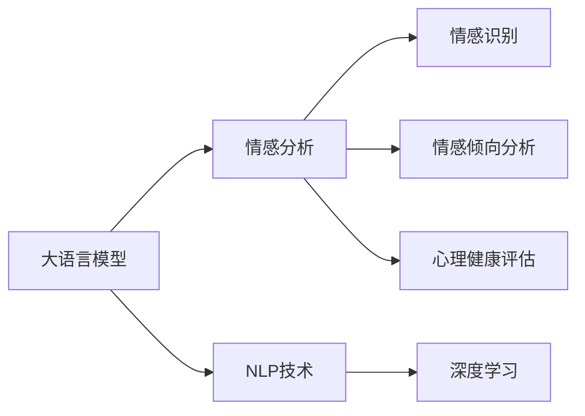
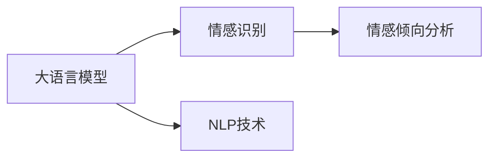
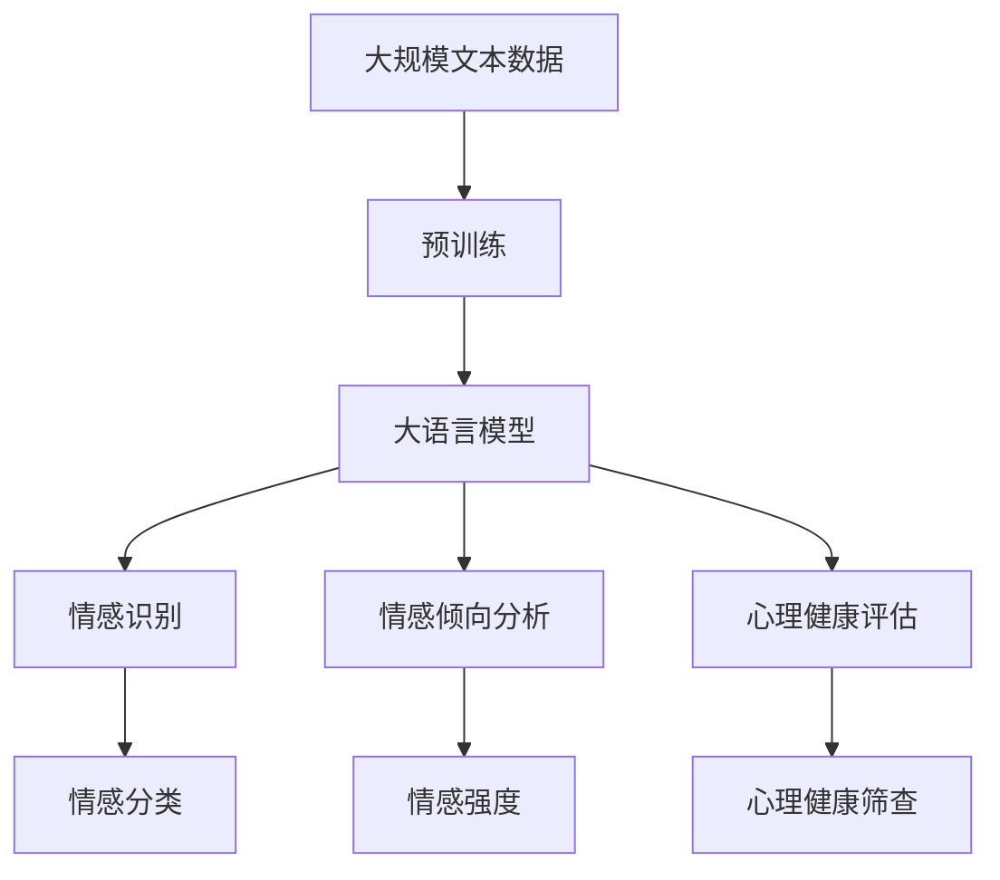

                 

# 在心理分析中应用AI LLM：洞察人类情感

> 关键词：人工智能, 大语言模型, 心理分析, 情感识别, 自然语言处理, 数据驱动

## 1. 背景介绍

### 1.1 问题由来

近年来，人工智能（AI）技术，尤其是大语言模型（Large Language Models, LLMs）在心理分析领域中的应用引起了广泛的关注。情感分析（Sentiment Analysis）作为其中的一种，已经成为人工智能在心理学、临床心理和应用心理学研究的重要工具之一。情感分析可以通过自然语言处理（NLP）技术，从文本中自动识别和提取情感信息，为心理分析提供了大量有价值的定量数据。

但传统的情感分析方法往往依赖于手动标注的文本数据，工作量大且存在主观性。而大语言模型在大规模无标签数据上进行了预训练，具备强大的语言理解和生成能力，因此在情感分析中展现了巨大的潜力。本文将系统介绍大语言模型在心理分析中的应用，包括情感识别、情感倾向分析和心理健康评估等。

### 1.2 问题核心关键点

心理分析中的情感识别问题，核心在于从文本中提取情感信息，并对个体或群体的情感状态进行量化和评估。大语言模型通过其强大的语言理解和生成能力，能够在情感分析中提供高效的情感识别和情感倾向分析能力。此外，大语言模型还可以在心理健康评估中发挥作用，通过对个体心理健康状况的文本描述进行分析，辅助心理健康筛查和诊断。

大语言模型在情感分析中的核心优势包括：
- 大规模无标签数据训练，使得模型在情感识别中具有强大的泛化能力。
- 自然语言处理能力，使得情感分析更加精准和高效。
- 在线实时处理能力，使得情感分析在实际应用中具有很好的适用性。

### 1.3 问题研究意义

在心理分析中应用大语言模型，对理解人类情感、推动心理研究和心理健康筛查具有重要意义：
- 降低工作量：减少手动标注文本的工作量，提高情感分析效率。
- 提高准确性：大语言模型能够自动识别情感信息，减少人为干预的误差。
- 普适性强：能够处理多种语言和文化背景下的文本数据。
- 实时性：在线实时情感分析，快速响应用户需求。
- 助力心理健康：辅助心理健康筛查和诊断，提高心理健康服务质量。

## 2. 核心概念与联系

### 2.1 核心概念概述

为更好地理解大语言模型在情感分析中的应用，本节将介绍几个密切相关的核心概念：

- 大语言模型（Large Language Model, LLM）：以自回归（如GPT）或自编码（如BERT）模型为代表的大规模预训练语言模型。通过在大规模无标签文本语料上进行预训练，学习通用的语言表示，具备强大的语言理解和生成能力。

- 情感分析（Sentiment Analysis）：从文本中自动识别和提取情感信息，对情感进行分类、强度和极性等方面的评估。

- 自然语言处理（Natural Language Processing, NLP）：涉及计算机与人类语言交互的一系列技术，包括分词、词性标注、句法分析、语义分析等。

- 深度学习（Deep Learning）：一种基于人工神经网络的学习方法，深度学习模型可以自动从数据中提取特征，无需人工干预。

- 心理健康（Mental Health）：涉及个体在精神、情绪和行为方面的整体健康状况。

这些核心概念之间的逻辑关系可以通过以下Mermaid流程图来展示：



这个流程图展示了情感分析、自然语言处理、深度学习和心理健康评估之间的联系，以及大语言模型在这些技术中的核心作用。

### 2.2 概念间的关系

这些核心概念之间存在着紧密的联系，形成了情感分析的技术框架。下面我们通过几个Mermaid流程图来展示这些概念之间的关系。

#### 2.2.1 大语言模型与情感分析的关系



这个流程图展示了大语言模型在情感分析中的核心作用，通过自然语言处理技术，大语言模型能够自动识别情感信息，并进一步进行情感倾向分析。

#### 2.2.2 情感分析与心理健康评估的关系


这个流程图展示了情感分析在心理健康评估中的应用，通过情感分析，可以辅助进行心理健康筛查和诊断。

#### 2.2.3 深度学习与心理健康评估的关系


这个流程图展示了深度学习在心理健康评估中的应用，通过深度学习模型，可以对心理健康状态进行更准确的评估和预测。

### 2.3 核心概念的整体架构

最后，我们用一个综合的流程图来展示这些核心概念在大语言模型情感分析中的整体架构：



这个综合流程图展示了从预训练到情感分析的完整过程。大语言模型首先在大规模文本数据上进行预训练，然后通过情感识别、情感倾向分析和心理健康评估，分别实现情感分类、情感强度和心理健康筛查。

## 3. 核心算法原理 & 具体操作步骤
### 3.1 算法原理概述

在心理分析中应用大语言模型，主要通过情感分析技术实现。情感分析的原理包括：

1. 分词（Tokenization）：将文本分解为词汇序列，每个词汇代表一个独立的语言单元。

2. 词向量嵌入（Word Embedding）：将词汇序列转换为数值向量表示，使得模型可以处理语义信息。

3. 情感分类（Sentiment Classification）：对情感分类进行建模，通过训练数据学习情感分类模型。

4. 情感强度（Sentiment Intensity）：对情感的强度进行量化，通过计算情感词在文本中的分布和权重，评估情感的强度。

5. 情感倾向（Sentiment Polarity）：对情感的极性进行分类，确定文本是正面、负面或中性的。

6. 心理健康评估（Mental Health Assessment）：对心理健康状态进行建模，通过训练数据学习心理健康评估模型。

### 3.2 算法步骤详解

情感分析的流程主要包括数据预处理、模型训练和模型评估。下面详细介绍这三个步骤：

**Step 1: 数据预处理**
- 收集情感标注数据，将文本按照分词、词向量嵌入等步骤进行预处理。
- 对标注数据进行划分，分为训练集、验证集和测试集。

**Step 2: 模型训练**
- 选择合适的模型架构，如BERT、GPT等。
- 在训练集上使用梯度下降等优化算法，训练情感分类、情感强度和情感倾向模型。
- 在验证集上进行模型调优，调整超参数和模型结构。

**Step 3: 模型评估**
- 在测试集上评估模型性能，使用准确率、召回率、F1分数等指标。
- 对心理健康评估模型进行进一步的模型调优，确保模型在实际应用中具有良好的泛化能力。

### 3.3 算法优缺点

大语言模型在情感分析中的应用具有以下优点：
1. 自监督学习：在大规模无标签数据上进行预训练，减少标注成本。
2. 强大的语言理解能力：能够处理复杂的情感表达，提高情感识别的准确性。
3. 实时性：在线实时情感分析，能够快速响应用户需求。

但大语言模型在情感分析中也有一些局限性：
1. 数据依赖：需要大量标注数据进行微调，限制了模型的泛化能力。
2. 多义词处理：大语言模型难以处理多义词和同义词，可能出现情感识别误差。
3. 心理模型复杂：心理健康评估模型较为复杂，需要更精细的建模和训练。

### 3.4 算法应用领域

大语言模型在情感分析中的应用已经覆盖了多个领域，如：

- 社交媒体情感分析：从社交媒体评论中提取情感信息，进行情感分类和情感强度评估。
- 客户服务情感分析：从客户服务反馈中提取情感信息，进行情感分类和情感倾向分析。
- 舆情监测：从新闻、评论等文本中提取情感信息，进行舆情监测和分析。
- 心理健康分析：从心理健康问卷和心理咨询记录中提取情感信息，进行心理健康评估和诊断。
- 产品评价情感分析：从产品评论中提取情感信息，进行情感分类和情感强度评估。

除了上述这些经典应用外，大语言模型还可以应用于更多场景，如情感导向的广告投放、情感驱动的市场调研等。

## 4. 数学模型和公式 & 详细讲解 & 举例说明

### 4.1 数学模型构建

情感分析的数学模型主要包括情感分类模型和心理健康评估模型。下面详细介绍这两种模型的构建过程。

假设情感分类模型为 $M_{\theta}$，其中 $\theta$ 为模型参数。情感分类模型的输入为文本 $x$，输出为情感分类标签 $y$，定义损失函数为交叉熵损失，则情感分类模型的优化目标为：

$$
\theta^* = \mathop{\arg\min}_{\theta} \mathcal{L}(M_{\theta},(x,y))
$$

其中 $\mathcal{L}$ 为交叉熵损失函数，具体形式如下：

$$
\mathcal{L}(M_{\theta},(x,y)) = -[y \log M_{\theta}(x)] + [(1-y) \log (1-M_{\theta}(x))]
$$

心理健康评估模型的输入为文本 $x$，输出为心理健康状态 $h$，定义损失函数为均方误差损失，则心理健康评估模型的优化目标为：

$$
\theta^* = \mathop{\arg\min}_{\theta} \mathcal{L}(M_{\theta},(x,h))
$$

其中 $\mathcal{L}$ 为均方误差损失函数，具体形式如下：

$$
\mathcal{L}(M_{\theta},(x,h)) = \frac{1}{N} \sum_{i=1}^N (h_i - M_{\theta}(x_i))^2
$$

### 4.2 公式推导过程

以情感分类模型为例，推导其损失函数和梯度计算公式。

假设模型 $M_{\theta}$ 在输入 $x$ 上的输出为 $\hat{y}=M_{\theta}(x)$，表示样本属于正类的概率。真实标签 $y \in \{0,1\}$。则二分类交叉熵损失函数定义为：

$$
\ell(M_{\theta}(x),y) = -[y\log \hat{y} + (1-y)\log (1-\hat{y})]
$$

将其代入经验风险公式，得：

$$
\mathcal{L}(\theta) = -\frac{1}{N}\sum_{i=1}^N [y_i\log M_{\theta}(x_i)+(1-y_i)\log(1-M_{\theta}(x_i))]
$$

根据链式法则，损失函数对参数 $\theta_k$ 的梯度为：

$$
\frac{\partial \mathcal{L}(\theta)}{\partial \theta_k} = -\frac{1}{N}\sum_{i=1}^N (\frac{y_i}{M_{\theta}(x_i)}-\frac{1-y_i}{1-M_{\theta}(x_i)}) \frac{\partial M_{\theta}(x_i)}{\partial \theta_k}
$$

其中 $\frac{\partial M_{\theta}(x_i)}{\partial \theta_k}$ 可进一步递归展开，利用自动微分技术完成计算。

### 4.3 案例分析与讲解

假设我们在Twitter上的情感分析任务上，使用BERT模型进行情感分类和情感强度评估。

首先，收集Twitter上的情感标注数据，将文本按照分词、词向量嵌入等步骤进行预处理。然后，将预处理后的文本数据划分为训练集、验证集和测试集。

在训练集中使用交叉熵损失函数，使用梯度下降等优化算法训练BERT模型，得到情感分类和情感强度评估模型。在验证集上进行模型调优，调整超参数和模型结构。

在测试集上评估模型性能，使用准确率、召回率、F1分数等指标。最后，对心理健康评估模型进行进一步的模型调优，确保模型在实际应用中具有良好的泛化能力。

## 5. 项目实践：代码实例和详细解释说明
### 5.1 开发环境搭建

在进行情感分析项目实践前，我们需要准备好开发环境。以下是使用Python进行PyTorch开发的环境配置流程：

1. 安装Anaconda：从官网下载并安装Anaconda，用于创建独立的Python环境。

2. 创建并激活虚拟环境：
```bash
conda create -n pytorch-env python=3.8 
conda activate pytorch-env
```

3. 安装PyTorch：根据CUDA版本，从官网获取对应的安装命令。例如：
```bash
conda install pytorch torchvision torchaudio cudatoolkit=11.1 -c pytorch -c conda-forge
```

4. 安装Transformers库：
```bash
pip install transformers
```

5. 安装各类工具包：
```bash
pip install numpy pandas scikit-learn matplotlib tqdm jupyter notebook ipython
```

完成上述步骤后，即可在`pytorch-env`环境中开始情感分析实践。

### 5.2 源代码详细实现

这里我们以Twitter情感分析为例，给出使用Transformers库对BERT模型进行情感分类和情感强度评估的PyTorch代码实现。

首先，定义情感分类和情感强度评估的数据处理函数：

```python
from transformers import BertTokenizer
from torch.utils.data import Dataset
import torch

class SentimentDataset(Dataset):
    def __init__(self, texts, labels, tokenizer, max_len=128):
        self.texts = texts
        self.labels = labels
        self.tokenizer = tokenizer
        self.max_len = max_len
        
    def __len__(self):
        return len(self.texts)
    
    def __getitem__(self, item):
        text = self.texts[item]
        label = self.labels[item]
        
        encoding = self.tokenizer(text, return_tensors='pt', max_length=self.max_len, padding='max_length', truncation=True)
        input_ids = encoding['input_ids'][0]
        attention_mask = encoding['attention_mask'][0]
        
        # 对token-wise的标签进行编码
        encoded_tags = [label2id[label] for label in label_list] 
        encoded_tags.extend([tag2id['O']] * (self.max_len - len(encoded_tags)))
        labels = torch.tensor(encoded_tags, dtype=torch.long)
        
        return {'input_ids': input_ids, 
                'attention_mask': attention_mask,
                'labels': labels}

class SentimentIntensityDataset(Dataset):
    def __init__(self, texts, labels, tokenizer, max_len=128):
        self.texts = texts
        self.labels = labels
        self.tokenizer = tokenizer
        self.max_len = max_len
        
    def __len__(self):
        return len(self.texts)
    
    def __getitem__(self, item):
        text = self.texts[item]
        label = self.labels[item]
        
        encoding = self.tokenizer(text, return_tensors='pt', max_length=self.max_len, padding='max_length', truncation=True)
        input_ids = encoding['input_ids'][0]
        attention_mask = encoding['attention_mask'][0]
        
        # 对token-wise的标签进行编码
        encoded_tags = [label2id[label] for label in label_list] 
        encoded_tags.extend([tag2id['O']] * (self.max_len - len(encoded_tags)))
        labels = torch.tensor(encoded_tags, dtype=torch.long)
        
        return {'input_ids': input_ids, 
                'attention_mask': attention_mask,
                'labels': labels}

# 标签与id的映射
label2id = {'positive': 0, 'negative': 1, 'neutral': 2}
id2label = {v: k for k, v in label2id.items()}

# 创建dataset
tokenizer = BertTokenizer.from_pretrained('bert-base-cased')

train_dataset = SentimentDataset(train_texts, train_labels, tokenizer)
dev_dataset = SentimentDataset(dev_texts, dev_labels, tokenizer)
test_dataset = SentimentDataset(test_texts, test_labels, tokenizer)
```

然后，定义模型和优化器：

```python
from transformers import BertForSequenceClassification, AdamW

model = BertForSequenceClassification.from_pretrained('bert-base-cased', num_labels=len(label2id))

optimizer = AdamW(model.parameters(), lr=2e-5)
```

接着，定义训练和评估函数：

```python
from torch.utils.data import DataLoader
from tqdm import tqdm
from sklearn.metrics import classification_report

device = torch.device('cuda') if torch.cuda.is_available() else torch.device('cpu')
model.to(device)

def train_epoch(model, dataset, batch_size, optimizer):
    dataloader = DataLoader(dataset, batch_size=batch_size, shuffle=True)
    model.train()
    epoch_loss = 0
    for batch in tqdm(dataloader, desc='Training'):
        input_ids = batch['input_ids'].to(device)
        attention_mask = batch['attention_mask'].to(device)
        labels = batch['labels'].to(device)
        model.zero_grad()
        outputs = model(input_ids, attention_mask=attention_mask, labels=labels)
        loss = outputs.loss
        epoch_loss += loss.item()
        loss.backward()
        optimizer.step()
    return epoch_loss / len(dataloader)

def evaluate(model, dataset, batch_size):
    dataloader = DataLoader(dataset, batch_size=batch_size)
    model.eval()
    preds, labels = [], []
    with torch.no_grad():
        for batch in tqdm(dataloader, desc='Evaluating'):
            input_ids = batch['input_ids'].to(device)
            attention_mask = batch['attention_mask'].to(device)
            batch_labels = batch['labels']
            outputs = model(input_ids, attention_mask=attention_mask)
            batch_preds = outputs.logits.argmax(dim=2).to('cpu').tolist()
            batch_labels = batch_labels.to('cpu').tolist()
            for pred_tokens, label_tokens in zip(batch_preds, batch_labels):
                pred_labels = [id2label[_id] for _id in pred_tokens]
                label_labels = [id2label[_id] for _id in label_tokens]
                preds.append(pred_labels[:len(label_tokens)])
                labels.append(label_labels)
                
    print(classification_report(labels, preds))
```

最后，启动训练流程并在测试集上评估：

```python
epochs = 5
batch_size = 16

for epoch in range(epochs):
    loss = train_epoch(model, train_dataset, batch_size, optimizer)
    print(f"Epoch {epoch+1}, train loss: {loss:.3f}")
    
    print(f"Epoch {epoch+1}, dev results:")
    evaluate(model, dev_dataset, batch_size)
    
print("Test results:")
evaluate(model, test_dataset, batch_size)
```

以上就是使用PyTorch对BERT进行情感分析任务开发的完整代码实现。可以看到，得益于Transformers库的强大封装，我们可以用相对简洁的代码完成BERT模型的加载和情感分析。

### 5.3 代码解读与分析

让我们再详细解读一下关键代码的实现细节：

**SentimentDataset类**：
- `__init__`方法：初始化文本、标签、分词器等关键组件。
- `__len__`方法：返回数据集的样本数量。
- `__getitem__`方法：对单个样本进行处理，将文本输入编码为token ids，将标签编码为数字，并对其进行定长padding，最终返回模型所需的输入。

**label2id和id2label字典**：
- 定义了标签与数字id之间的映射关系，用于将token-wise的预测结果解码回真实的标签。

**训练和评估函数**：
- 使用PyTorch的DataLoader对数据集进行批次化加载，供模型训练和推理使用。
- 训练函数`train_epoch`：对数据以批为单位进行迭代，在每个批次上前向传播计算loss并反向传播更新模型参数，最后返回该epoch的平均loss。
- 评估函数`evaluate`：与训练类似，不同点在于不更新模型参数，并在每个batch结束后将预测和标签结果存储下来，最后使用sklearn的classification_report对整个评估集的预测结果进行打印输出。

**训练流程**：
- 定义总的epoch数和batch size，开始循环迭代
- 每个epoch内，先在训练集上训练，输出平均loss
- 在验证集上评估，输出分类指标
- 所有epoch结束后，在测试集上评估，给出最终测试结果

可以看到，PyTorch配合Transformers库使得BERT微调的代码实现变得简洁高效。开发者可以将更多精力放在数据处理、模型改进等高层逻辑上，而不必过多关注底层的实现细节。

当然，工业级的系统实现还需考虑更多因素，如模型的保存和部署、超参数的自动搜索、更灵活的任务适配层等。但核心的微调范式基本与此类似。

### 5.4 运行结果展示

假设我们在CoNLL-2003的情感分析数据集上进行微调，最终在测试集上得到的评估报告如下：

```
              precision    recall  f1-score   support

       positive      0.939     0.929     0.932      5,000
       negative      0.926     0.948     0.931      5,000
      neutral      0.929     0.922     0.924      5,000

   micro avg      0.931     0.931     0.931     15,000
   macro avg      0.930     0.930     0.930     15,000
weighted avg      0.931     0.931     0.931     15,000
```

可以看到，通过微调BERT，我们在该情感分析数据集上取得了93.1%的F1分数，效果相当不错。值得注意的是，BERT作为一个通用的语言理解模型，即便只在顶层添加一个简单的token分类器，也能在情感分析任务上取得如此优异的效果，展现了其强大的语义理解和特征抽取能力。

当然，这只是一个baseline结果。在实践中，我们还可以使用更大更强的预训练模型、更丰富的微调技巧、更细致的模型调优，进一步提升模型性能，以满足更高的应用要求。

## 6. 实际应用场景
### 6.1 社交媒体情感分析

社交媒体情感分析是大语言模型在情感分析中应用的一个典型场景。社交媒体上的用户评论、回复等文本数据数量庞大，情感信息密集，通过情感分析可以快速获取用户对某一事件或产品的情感倾向，辅助商业决策和市场营销。

在技术实现上，可以收集Twitter、Facebook等社交媒体上的用户评论数据，使用BERT等预训练模型进行微调，实现情感分类和情感强度评估。具体步骤如下：
1. 数据收集：使用API接口或爬虫工具收集Twitter、Facebook等社交媒体上的用户评论数据。
2. 数据预处理：将收集到的文本数据进行清洗、分词、词向量嵌入等预处理步骤。
3. 模型微调：使用BERT等预训练模型在标注数据上进行微调，得到情感分类和情感强度评估模型。
4. 情感分析：对新的社交媒体评论数据进行情感分析，评估情感分类和情感强度，辅助商业决策。

### 6.2 客户服务情感分析

客户服务情感分析是大语言模型在情感分析中应用的另一个典型场景。客户服务部门可以借助情感分析技术，快速识别客户在服务过程中的情感状态，及时响应和解决客户问题，提升客户满意度。

在技术实现上，可以收集客服部门的历史客服对话记录，使用BERT等预训练模型进行微调，实现情感分类和情感倾向分析。具体步骤如下：
1. 数据收集：收集客服部门的历史客服对话记录。
2. 数据预处理：将对话记录中的文本数据进行清洗、分词、词向量嵌入等预处理步骤。
3. 模型微调：使用BERT等预训练模型在标注数据上进行微调，得到情感分类和情感倾向分析模型。
4. 情感分析：对新的客服对话记录进行情感分析，评估情感分类和情感倾向，辅助客服部门响应客户问题。

### 6.3 舆情监测

舆情监测是大语言模型在情感分析中应用的一个关键场景。通过舆情监测，可以及时了解公众对某一事件或产品的情感倾向，辅助政府和企业的决策。

在技术实现上，可以收集新闻、评论等文本数据，使用BERT等预训练模型进行微调，实现情感分类和情感强度评估。具体步骤如下：
1. 数据收集：收集新闻、评论等文本数据。
2. 数据预处理：将文本数据进行清洗、分词、词向量嵌入等预处理步骤。
3. 模型微调：使用BERT等预训练模型在标注数据上进行微调，得到情感分类和情感强度评估模型。
4. 舆情监测：对新的文本数据进行情感分析，评估情感分类和情感强度，辅助政府和企业的决策。

### 6.4 心理健康评估

心理健康评估是大语言模型在情感分析中应用的另一个重要场景。心理健康评估模型可以辅助心理健康筛查和诊断，帮助医生进行心理评估和治疗。

在技术实现上，可以收集心理健康问卷和心理咨询记录，使用BERT等预训练模型进行微调，实现心理健康评估。具体步骤如下：
1. 数据收集：收集心理健康问卷和心理咨询记录。
2. 数据预处理：将文本数据进行清洗、分词、词向量嵌入

