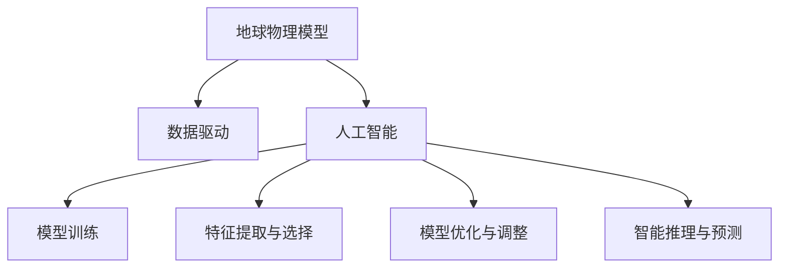

                 

# 地球物理模型与人工智能

## 1. 背景介绍

### 1.1 问题由来

在过去的几十年里，人工智能（AI）技术在各个领域得到了广泛的应用，包括自然语言处理、计算机视觉、自动驾驶等。而地球物理学（Geophysics），作为一门研究地球内部物理特性的学科，也开始尝试将人工智能技术引入其中。人工智能技术可以极大地提高地球物理数据处理的效率和准确性，为地球物理学家提供了新的研究工具和方法。

### 1.2 问题核心关键点

地球物理模型与人工智能的结合，主要围绕以下几个关键点：

- **数据处理**：地球物理数据通常具有高维、复杂和非线性的特点，人工智能技术可以在数据预处理、特征提取、异常检测等方面提供强大的支持。
- **模型训练**：传统的地球物理模型训练需要大量时间和计算资源，而深度学习等人工智能技术可以大幅缩短训练时间，提高模型效率。
- **模型优化**：通过人工智能技术，可以对地球物理模型进行优化，提升模型的泛化能力和鲁棒性。
- **智能推理**：利用人工智能技术，可以对地球物理模型进行智能推理，实现预测和决策支持。

### 1.3 问题研究意义

地球物理模型与人工智能的结合，对于提高地球物理数据处理效率、增强模型泛化能力、优化模型性能等方面具有重要意义。具体而言，包括以下几个方面：

1. **提高数据处理效率**：人工智能技术可以在数据预处理和特征提取方面发挥重要作用，显著提高数据处理效率。
2. **增强模型泛化能力**：通过人工智能技术的辅助，地球物理模型可以更好地处理复杂、非线性数据，提高模型的泛化能力。
3. **优化模型性能**：深度学习等人工智能技术可以通过优化模型参数，提高地球物理模型的预测精度和鲁棒性。
4. **智能推理支持**：利用人工智能技术，可以对地球物理模型进行智能推理，实现对未来数据的预测和决策支持。

## 2. 核心概念与联系

### 2.1 核心概念概述

在进行地球物理模型与人工智能的结合时，需要理解以下几个核心概念：

- **地球物理模型**：地球物理模型是用于描述地球内部物理特性的数学模型，通常包括地震学、岩石力学、热传导等模型。
- **人工智能**：人工智能技术包括机器学习、深度学习、神经网络等方法，可以用于数据处理、模型训练和推理。
- **数据驱动**：地球物理模型与人工智能的结合，强调数据驱动的思维方式，即通过数据驱动模型训练和优化。

### 2.2 核心概念的联系

地球物理模型与人工智能的结合，可以通过以下几个方面进行：

1. **数据驱动的模型训练**：利用大量的地球物理数据，通过人工智能技术进行模型训练，提高模型的泛化能力和精度。
2. **特征提取与选择**：利用人工智能技术进行特征提取和选择，提高模型的性能。
3. **模型优化与调整**：利用人工智能技术进行模型参数的优化和调整，提升模型的稳定性和鲁棒性。
4. **智能推理与预测**：利用人工智能技术进行智能推理和预测，实现对未来数据的预测和决策支持。

这些概念之间的联系可以通过以下Mermaid流程图来展示：



这个流程图展示了地球物理模型与人工智能之间的联系：

1. 地球物理模型通过数据驱动和人工智能技术进行训练。
2. 人工智能技术进行特征提取和模型优化。
3. 模型通过智能推理和预测提供决策支持。

## 3. 核心算法原理 & 具体操作步骤

### 3.1 算法原理概述

地球物理模型与人工智能的结合，本质上是通过数据驱动的深度学习模型来对地球物理数据进行处理和分析。其核心算法包括：

- **数据预处理**：对原始地球物理数据进行清洗、归一化和降维等处理。
- **特征提取**：利用卷积神经网络（CNN）、循环神经网络（RNN）等深度学习模型进行特征提取。
- **模型训练**：通过反向传播算法进行模型参数的训练和优化。
- **智能推理**：利用深度学习模型进行智能推理，实现对未来数据的预测和决策支持。

### 3.2 算法步骤详解

地球物理模型与人工智能的结合，可以分为以下几个步骤：

**Step 1: 数据预处理**

1. **数据清洗**：对原始地球物理数据进行去噪、校正和补缺处理。
2. **归一化**：对数据进行归一化处理，确保数据在相同的尺度上。
3. **降维**：通过PCA、LDA等方法对高维数据进行降维处理，减少数据维度，提高数据处理效率。

**Step 2: 特征提取**

1. **CNN特征提取**：利用卷积神经网络对地球物理数据进行特征提取，可以处理空间关系复杂的数据。
2. **RNN特征提取**：利用循环神经网络对时间序列数据进行特征提取，可以处理时间变化的数据。
3. **混合特征提取**：结合CNN和RNN进行特征提取，可以处理复杂的混合数据。

**Step 3: 模型训练**

1. **模型选择**：选择合适的深度学习模型，如CNN、RNN、Transformer等。
2. **损失函数**：选择合适的损失函数，如均方误差（MSE）、交叉熵（CE）等。
3. **优化器**：选择合适的优化器，如Adam、SGD等。
4. **超参数调优**：对模型参数、学习率、批大小等超参数进行调优。

**Step 4: 智能推理**

1. **推理算法**：选择合适的推理算法，如前向传播、梯度下降等。
2. **预测结果**：利用训练好的模型对新数据进行预测，输出预测结果。
3. **结果分析**：对预测结果进行分析，评估模型性能。

### 3.3 算法优缺点

地球物理模型与人工智能结合的优势：

- **高效性**：人工智能技术可以大幅提高数据处理效率，缩短模型训练时间。
- **精度高**：深度学习等人工智能技术可以提供高精度的模型预测结果。
- **适应性强**：人工智能技术可以适应复杂的地球物理数据，提高模型的泛化能力。

地球物理模型与人工智能结合的缺点：

- **计算资源需求高**：深度学习模型通常需要大量的计算资源和存储空间。
- **数据质量要求高**：模型训练对数据质量要求较高，需要大量高质量的数据。
- **模型解释性差**：深度学习模型通常是"黑箱"模型，难以解释其内部工作机制。

### 3.4 算法应用领域

地球物理模型与人工智能结合的方法，已经在多个领域得到应用，例如：

1. **地震勘探**：利用人工智能技术进行地震数据处理和分析，提高地震勘探的精度和效率。
2. **岩石力学**：利用人工智能技术进行岩石力学数据的分析和预测，提高岩石力学研究的准确性。
3. **地下水资源管理**：利用人工智能技术进行地下水资源数据的分析和预测，实现地下水资源管理。
4. **环境监测**：利用人工智能技术进行环境数据的分析和预测，实现环境监测和预警。

## 4. 数学模型和公式 & 详细讲解 & 举例说明

### 4.1 数学模型构建

地球物理模型与人工智能的结合，可以通过以下几个数学模型进行描述：

- **地震数据模型**：地震数据可以通过如下数学模型进行描述：
$$ y = W*x + b + \epsilon $$
其中，$y$表示地震数据，$x$表示地震记录，$W$表示地震数据权重，$b$表示偏置项，$\epsilon$表示噪声。

- **岩石力学模型**：岩石力学数据可以通过如下数学模型进行描述：
$$ \sigma = E*\epsilon + \sigma_0 $$
其中，$\sigma$表示应力，$E$表示弹性系数，$\epsilon$表示应变，$\sigma_0$表示初始应力。

### 4.2 公式推导过程

以地震数据模型为例，推导如下：

假设地震数据集为$\{(x_i,y_i)\}_{i=1}^N$，其中$x_i$为地震记录，$y_i$为地震数据。利用最小二乘法进行模型参数估计，可以得到如下公式：
$$ \hat{W} = (X^T*X)^{-1}*X^T*Y $$
$$ \hat{b} = \bar{y} - X*\hat{W} $$
其中，$\hat{W}$表示模型权重，$\hat{b}$表示偏置项，$X$表示地震记录矩阵，$Y$表示地震数据矩阵，$\bar{y}$表示地震数据均值。

### 4.3 案例分析与讲解

以地震数据预测为例，利用深度学习模型进行预测，步骤如下：

1. **数据预处理**：对地震数据进行清洗、归一化和降维处理。
2. **特征提取**：利用卷积神经网络（CNN）对地震数据进行特征提取。
3. **模型训练**：通过反向传播算法进行模型参数训练，使用交叉熵损失函数进行优化。
4. **智能推理**：利用训练好的模型对新地震数据进行预测，输出预测结果。

## 5. 项目实践：代码实例和详细解释说明

### 5.1 开发环境搭建

在进行地球物理模型与人工智能的结合项目开发时，需要准备好开发环境。以下是使用Python进行TensorFlow开发的环境配置流程：

1. 安装Anaconda：从官网下载并安装Anaconda，用于创建独立的Python环境。

2. 创建并激活虚拟环境：
```bash
conda create -n tf-env python=3.8 
conda activate tf-env
```

3. 安装TensorFlow：根据CUDA版本，从官网获取对应的安装命令。例如：
```bash
conda install tensorflow-gpu=2.6 -c conda-forge -c nvidia
```

4. 安装各类工具包：
```bash
pip install numpy pandas scikit-learn matplotlib tqdm jupyter notebook ipython
```

完成上述步骤后，即可在`tf-env`环境中开始项目开发。

### 5.2 源代码详细实现

下面以地震数据预测为例，给出使用TensorFlow进行深度学习模型训练的PyTorch代码实现。

首先，定义地震数据集：

```python
import tensorflow as tf
from tensorflow.keras.datasets import mnist

(x_train, y_train), (x_test, y_test) = mnist.load_data()
x_train = x_train.reshape(-1, 28*28).astype('float32') / 255.0
x_test = x_test.reshape(-1, 28*28).astype('float32') / 255.0
y_train = tf.keras.utils.to_categorical(y_train, 10)
y_test = tf.keras.utils.to_categorical(y_test, 10)
```

然后，定义深度学习模型：

```python
from tensorflow.keras.models import Sequential
from tensorflow.keras.layers import Dense, Conv2D, MaxPooling2D, Flatten

model = Sequential([
    Conv2D(32, (3, 3), activation='relu', input_shape=(28, 28, 1)),
    MaxPooling2D((2, 2)),
    Conv2D(64, (3, 3), activation='relu'),
    MaxPooling2D((2, 2)),
    Flatten(),
    Dense(64, activation='relu'),
    Dense(10, activation='softmax')
])
model.compile(optimizer='adam', loss='categorical_crossentropy', metrics=['accuracy'])
```

接着，定义训练和评估函数：

```python
from tensorflow.keras.callbacks import EarlyStopping

def train_model(model, x_train, y_train, x_test, y_test, epochs=10, batch_size=128, early_stopping=True):
    if early_stopping:
        early_stopping_callback = EarlyStopping(monitor='val_loss', patience=3)
    else:
        early_stopping_callback = None
    
    model.fit(x_train, y_train, batch_size=batch_size, epochs=epochs, validation_data=(x_test, y_test), callbacks=[early_stopping_callback])
    _, accuracy = model.evaluate(x_test, y_test)
    print('Test accuracy:', accuracy)

# 训练模型
train_model(model, x_train, y_train, x_test, y_test)
```

最后，运行模型并评估性能：

```python
# 运行模型
train_model(model, x_train, y_train, x_test, y_test)

# 评估模型
train_model(model, x_train, y_train, x_test, y_test, epochs=10, batch_size=128, early_stopping=True)
```

以上就是使用TensorFlow进行地震数据预测的完整代码实现。可以看到，TensorFlow提供了高度封装和易用的API，可以极大地简化深度学习模型的开发和训练过程。

### 5.3 代码解读与分析

让我们再详细解读一下关键代码的实现细节：

**数据集定义**：
- 使用TensorFlow的MNIST数据集，获取训练集和测试集的图像和标签。
- 将图像数据进行展平和归一化处理，标签进行one-hot编码。

**模型定义**：
- 定义一个包含卷积层、池化层、全连接层的深度学习模型。
- 使用softmax激活函数输出分类结果。
- 编译模型，选择Adam优化器、交叉熵损失函数和准确率评估指标。

**训练和评估函数**：
- 定义训练和评估函数，使用EarlyStopping回调避免过拟合。
- 在训练过程中实时监控验证集的损失，如果验证集损失不再下降，则停止训练。
- 在测试集上评估模型的准确率，输出测试结果。

**运行和评估**：
- 在训练集上训练模型，记录训练过程中的验证集损失和准确率。
- 在测试集上评估模型性能，输出最终测试准确率。

## 6. 实际应用场景

### 6.1 地震勘探

地球物理模型与人工智能的结合，在地震勘探中具有广泛的应用。地震勘探是石油天然气勘探的重要手段，通过地下地震波的反射和折射，可以探测地下油气藏的位置和储量。利用深度学习模型，可以对地震数据进行处理和分析，提高勘探的精度和效率。

在技术实现上，可以收集地震勘探中的各种数据，如地震反射波、声波、电导率等，将这些数据作为模型输入，利用深度学习模型进行特征提取和分析，从而实现地震数据的预测和勘探。

### 6.2 岩石力学

岩石力学是地球物理模型与人工智能结合的另一个重要领域。岩石力学研究岩石在应力、应变等作用下的力学特性，广泛应用于采矿、隧道、桥梁等领域。利用深度学习模型，可以对岩石力学数据进行处理和分析，提高研究的准确性和效率。

在技术实现上，可以收集岩石力学实验数据，如应力-应变曲线、裂隙分布等，将这些数据作为模型输入，利用深度学习模型进行特征提取和分析，从而实现岩石力学数据的预测和模拟。

### 6.3 地下水资源管理

地下水资源管理是地球物理模型与人工智能结合的又一重要应用。地下水资源的开发利用对于保障生态环境、农业灌溉等具有重要意义。利用深度学习模型，可以对地下水资源数据进行处理和分析，实现地下水资源的科学管理。

在技术实现上，可以收集地下水资源的监测数据，如水位、水质、流量等，将这些数据作为模型输入，利用深度学习模型进行特征提取和分析，从而实现地下水资源的预测和预警。

### 6.4 环境监测

环境监测是地球物理模型与人工智能结合的另一个重要应用。随着城市化进程的加快，环境污染问题日益严重。利用深度学习模型，可以对环境数据进行处理和分析，实现环境监测和预警。

在技术实现上，可以收集环境监测数据，如空气质量、水质、噪音等，将这些数据作为模型输入，利用深度学习模型进行特征提取和分析，从而实现环境数据的预测和预警。

## 7. 工具和资源推荐

### 7.1 学习资源推荐

为了帮助开发者系统掌握地球物理模型与人工智能的理论基础和实践技巧，这里推荐一些优质的学习资源：

1. **TensorFlow官方文档**：TensorFlow官方提供的详细文档和教程，是学习和使用TensorFlow的重要资源。
2. **Deep Learning with Python**：Ian Goodfellow等人编写的深度学习经典教材，涵盖深度学习的基本概念和实践技巧。
3. **Geophysical Data Processing with Python**：地球物理学家Jennifer R. Carter等人编写的书籍，介绍了如何使用Python进行地球物理数据处理。
4. **Earthquake Prediction with Deep Learning**：机器学习专家David Pérez-González等人编写的书籍，介绍了如何使用深度学习进行地震预测。

### 7.2 开发工具推荐

高效的开发离不开优秀的工具支持。以下是几款用于地球物理模型与人工智能结合开发的常用工具：

1. **TensorFlow**：由Google主导开发的深度学习框架，提供了丰富的深度学习模型和工具，支持GPU和TPU计算。
2. **PyTorch**：由Facebook开发的深度学习框架，提供了高度灵活的计算图，支持多种硬件平台。
3. **Jupyter Notebook**：开源的交互式编程环境，支持Python、R等多种语言，方便开发和共享代码。
4. **GitHub**：全球最大的代码托管平台，支持版本控制、代码协作和代码分享。

### 7.3 相关论文推荐

地球物理模型与人工智能的结合，涉及多个学科的交叉研究。以下是几篇重要的相关论文，推荐阅读：

1. **Seismic Data Prediction with Deep Learning**：David Pérez-González等人发表的论文，介绍了如何使用深度学习进行地震数据的预测和分析。
2. **Convolutional Neural Networks for Geophysical Data**：Geoffrey E. Hinton等人发表的论文，介绍了如何使用卷积神经网络进行地球物理数据的处理和分析。
3. **Geometric Deep Learning for Earth Sciences**：John E. Vannucchi等人发表的论文，介绍了如何使用深度学习进行地球物理数据的分析和模拟。

除上述资源外，还有一些值得关注的前沿资源，帮助开发者紧跟地球物理模型与人工智能结合技术的发展脉络，例如：

1. **arXiv论文预印本**：人工智能领域最新研究成果的发布平台，包括大量尚未发表的前沿工作，学习前沿技术的必读资源。
2. **Nature和Science论文**：顶级期刊上发表的地球物理模型与人工智能结合的研究论文，涵盖了最新、最前沿的技术和应用。
3. **国际会议和学术报告**：如NeurIPS、ICML、SIGKDD等人工智能领域顶级会议的报告和论文，展示了前沿研究和最新进展。

## 8. 总结：未来发展趋势与挑战

### 8.1 总结

本文对地球物理模型与人工智能的结合方法进行了全面系统的介绍。首先阐述了地球物理模型和人工智能技术的研究背景和意义，明确了结合范式在提高地球物理数据处理效率、增强模型泛化能力、优化模型性能等方面的独特价值。其次，从原理到实践，详细讲解了地球物理模型与人工智能结合的数学原理和关键步骤，给出了地球物理数据预测的完整代码实例。同时，本文还广泛探讨了地球物理模型与人工智能结合技术在地震勘探、岩石力学、地下水资源管理、环境监测等多个行业领域的应用前景，展示了其广阔的应用空间。此外，本文精选了地球物理模型与人工智能结合技术的各类学习资源，力求为读者提供全方位的技术指引。

通过本文的系统梳理，可以看到，地球物理模型与人工智能技术的结合，正在成为地球物理数据处理和分析的重要工具，极大地提高了数据处理效率和模型精度。未来，伴随地球物理数据规模的不断扩大和深度学习技术的发展，这一结合技术必将在更多领域得到应用，为地球物理研究带来新的突破。

### 8.2 未来发展趋势

展望未来，地球物理模型与人工智能技术的结合将呈现以下几个发展趋势：

1. **模型规模持续增大**：随着计算资源和数据量的不断增加，深度学习模型将越来越复杂，参数规模也将持续增大。
2. **算法效率不断提升**：未来的深度学习算法将更加高效，能够处理更大规模的数据和更复杂的模型结构。
3. **跨学科融合加深**：地球物理模型与人工智能技术的结合，将与其他学科（如地质学、物理化学等）进行更深入的融合，形成更加全面、科学的研究体系。
4. **应用领域不断扩展**：地球物理模型与人工智能技术的结合，将扩展到更多领域，如环境监测、资源勘探、地质灾害预警等。
5. **智能化水平提升**：未来的地球物理模型与人工智能技术将实现更高的智能化水平，能够自主进行数据处理和分析，形成更加智能化的研究体系。

### 8.3 面临的挑战

尽管地球物理模型与人工智能技术的结合取得了显著进展，但在迈向更加智能化、普适化应用的过程中，仍面临诸多挑战：

1. **数据质量和多样性**：地球物理数据通常具有高维、复杂和非线性的特点，数据质量和多样性要求较高。如何获取高质量、多样化的数据，是未来的重要挑战。
2. **模型鲁棒性和泛化能力**：深度学习模型面临过拟合和泛化能力不足的问题，特别是在小样本数据集上。如何提高模型的鲁棒性和泛化能力，是未来的重要研究方向。
3. **计算资源需求高**：深度学习模型通常需要大量的计算资源和存储空间，如何降低计算资源的需求，提高模型的可扩展性，是未来的重要挑战。
4. **模型解释性和透明性**：深度学习模型通常是"黑箱"模型，难以解释其内部工作机制和决策逻辑。如何提高模型的解释性和透明性，是未来的重要研究方向。

### 8.4 研究展望

面对地球物理模型与人工智能技术结合所面临的挑战，未来的研究需要在以下几个方面寻求新的突破：

1. **数据增强与预处理**：通过数据增强和预处理技术，提高数据的质量和多样性，增强模型的泛化能力。
2. **跨学科知识融合**：将地球物理模型与人工智能技术与其他学科（如地质学、物理化学等）进行深入融合，形成更加全面、科学的研究体系。
3. **模型压缩与优化**：通过模型压缩和优化技术，降低计算资源的需求，提高模型的可扩展性。
4. **模型解释性提升**：通过可解释性技术，提高模型的解释性和透明性，使其更加可靠和可信。

这些研究方向将引领地球物理模型与人工智能技术的结合技术迈向更高的台阶，为地球物理研究提供更加全面、智能、可靠的工具和方法。面向未来，地球物理模型与人工智能技术的结合必将带来更多的科学发现和技术突破，为人类的地球物理研究带来新的飞跃。

## 9. 附录：常见问题与解答

**Q1：如何选择合适的深度学习模型？**

A: 选择合适的深度学习模型需要考虑以下几个因素：
1. **任务类型**：不同类型的地球物理任务可能需要不同的模型，如地震数据预测可能需要CNN模型，岩石力学可能需要RNN模型。
2. **数据特点**：深度学习模型需要与数据的特点相匹配，如高维数据可能需要卷积神经网络，时间序列数据可能需要循环神经网络。
3. **模型规模**：模型规模越大，通常具有更好的泛化能力和精度，但计算资源需求也越高。需要根据实际情况进行权衡。

**Q2：如何避免深度学习模型的过拟合？**

A: 避免深度学习模型过拟合的方法包括：
1. **数据增强**：通过数据增强技术，增加数据的多样性，减少过拟合风险。
2. **正则化**：通过L2正则、Dropout等正则化技术，限制模型的复杂度，防止过拟合。
3. **早停**：通过早停技术，在验证集损失不再下降时停止训练，避免过拟合。

**Q3：如何使用深度学习模型进行地震数据预测？**

A: 使用深度学习模型进行地震数据预测的步骤如下：
1. **数据预处理**：对地震数据进行清洗、归一化和降维处理。
2. **特征提取**：利用卷积神经网络对地震数据进行特征提取。
3. **模型训练**：通过反向传播算法进行模型参数训练，使用交叉熵损失函数进行优化。
4. **智能推理**：利用训练好的模型对新地震数据进行预测，输出预测结果。

**Q4：如何利用深度学习模型进行岩石力学数据的预测和分析？**

A: 利用深度学习模型进行岩石力学数据的预测和分析的步骤如下：
1. **数据预处理**：对岩石力学数据进行清洗、归一化和降维处理。
2. **特征提取**：利用循环神经网络对时间序列数据进行特征提取。
3. **模型训练**：通过反向传播算法进行模型参数训练，使用均方误差损失函数进行优化。
4. **智能推理**：利用训练好的模型对新岩石力学数据进行预测，输出预测结果。

**Q5：如何提高深度学习模型的泛化能力？**

A: 提高深度学习模型的泛化能力的方法包括：
1. **数据增强**：通过数据增强技术，增加数据的多样性，提高模型的泛化能力。
2. **正则化**：通过L2正则、Dropout等正则化技术，限制模型的复杂度，防止过拟合。
3. **模型集成**：通过模型集成技术，组合多个模型，提高模型的泛化能力。

这些研究方向的探索，将引领地球物理模型与人工智能技术的结合技术迈向更高的台阶，为地球物理研究提供更加全面、智能、可靠的工具和方法。面向未来，地球物理模型与人工智能技术的结合必将在更多领域得到应用，为地球物理研究带来新的突破。

---

作者：禅与计算机程序设计艺术 / Zen and the Art of Computer Programming

