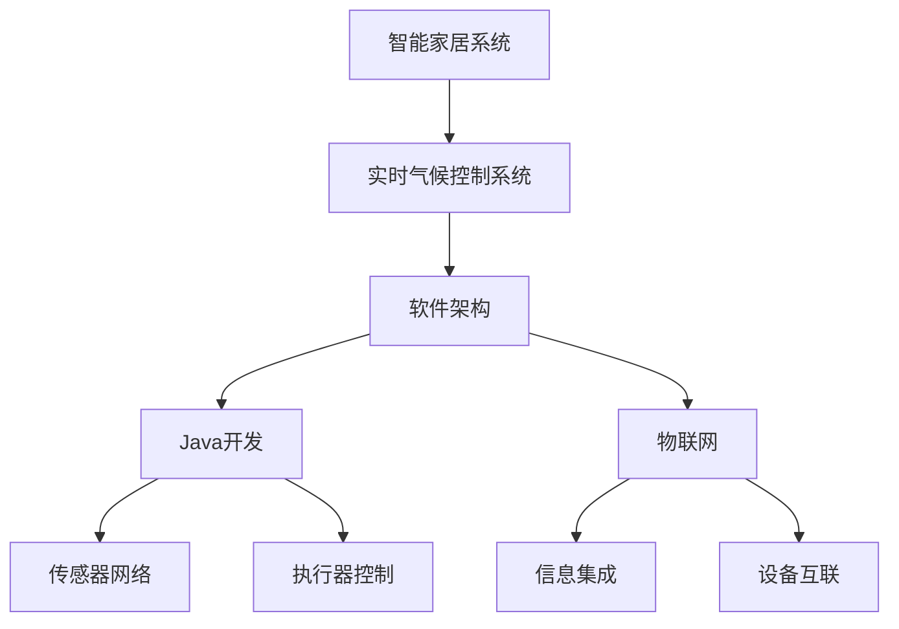

                 

# 基于Java的智能家居设计：实时气候控制系统的软件架构解析

> 关键词：智能家居,实时气候控制,软件架构,Java开发,物联网(IoT),自动化控制

## 1. 背景介绍

### 1.1 问题由来
随着科技的发展和居民生活水平的提高，智能家居系统已成为现代家庭的重要组成部分。其中，实时气候控制系统作为智能家居的核心子系统之一，能够根据室内外环境的变化，自动调节温度、湿度、空气质量等，提供舒适的居住环境。然而，现有的实时气候控制系统大多基于定制软件实现，缺乏通用的设计方案和标准，难以满足日益增长的应用需求。本文将介绍基于Java的智能家居实时气候控制系统的软件架构，并分析其关键技术和应用特点。

### 1.2 问题核心关键点
本文聚焦于实时气候控制系统的软件架构解析，具体包括：
- 系统架构设计：如何构建高效、可扩展的实时气候控制系统？
- 核心技术实现：哪些关键技术是实时气候控制系统必须具备的？
- 应用场景分析：实时气候控制系统在不同场景下的应用有哪些？
- 未来发展展望：实时气候控制系统的未来趋势和挑战是什么？

### 1.3 问题研究意义
构建高效、可扩展的实时气候控制系统，对于提升智能家居系统的用户体验和智能化水平具有重要意义：
- 提高居住舒适度：通过精确调节室内外环境，确保室内温度、湿度、空气质量等始终处于最佳状态。
- 节能减排：自动控制有助于减少能源消耗，提升系统的能效比。
- 智能管理：通过远程监控和控制，实现智能化、自动化管理，减少人工干预。
- 安全性保障：实时监控环境数据，及时预警异常情况，保障家居安全。
- 创新探索：探索更多智能化、个性化功能，提升用户体验。

## 2. 核心概念与联系

### 2.1 核心概念概述

为更好地理解实时气候控制系统的软件架构，本节将介绍几个密切相关的核心概念：

- **智能家居系统(Smart Home System)**：以物联网(IoT)技术为基础，通过传感器、执行器、控制器等设备，实现对家庭环境的自动化、智能化管理。
- **实时气候控制系统(Real-time Climate Control System)**：实时监测室内外环境参数，自动调节温度、湿度、空气质量等，提供舒适的居住环境。
- **软件架构(Software Architecture)**：通过系统设计、技术实现、组件划分等手段，构建高效、可扩展、可维护的软件系统。
- **Java开发(Java Development)**：利用Java语言进行软件开发，具有跨平台、高效、安全等优点。
- **物联网(IoT)**：通过互联网连接各种设备和系统，实现信息共享、协同工作。

这些核心概念之间存在着紧密的联系，形成了一个完整的智能家居实时气候控制系统的生态系统。

### 2.2 概念间的关系

这些核心概念之间的逻辑关系可以通过以下Mermaid流程图来展示：



这个流程图展示了一些核心概念之间的关系：

1. 智能家居系统包括实时气候控制系统，它是家居智能化管理的重要组成部分。
2. 实时气候控制系统依赖软件架构实现，其中Java开发是实现软件架构的技术手段之一。
3. 物联网技术为实时气候控制系统提供了底层的数据通信和设备互联能力。
4. 传感器网络实现环境数据的实时采集，执行器控制实现环境参数的调节。
5. 信息集成确保系统数据的完整性和一致性，设备互联实现设备的协同工作。

## 3. 核心算法原理 & 具体操作步骤
### 3.1 算法原理概述

实时气候控制系统的核心算法原理可以概括为以下几点：

- **环境参数监测**：通过传感器网络实时监测室内外温度、湿度、空气质量等环境参数。
- **环境数据建模**：构建环境数据的数学模型，用于分析和预测环境变化趋势。
- **控制策略设计**：根据环境数据模型，设计控制策略，实现对环境参数的自动化调节。
- **执行器控制**：通过执行器控制各类环境设备，如空调、加湿器、新风系统等，调节环境参数。
- **用户交互设计**：提供用户交互界面，实现对系统的手动控制和参数设置。

### 3.2 算法步骤详解

基于Java的实时气候控制系统的软件开发步骤如下：

1. **环境参数监测模块**：
   - 设计传感器网络，部署温度、湿度、空气质量等传感器，实现室内外环境数据的实时采集。
   - 通过Java实现传感器数据的读取和处理，存储到数据库中。

2. **环境数据建模模块**：
   - 构建环境数据的数学模型，如回归模型、时间序列模型等，用于分析和预测环境变化趋势。
   - 通过Java实现环境数据的模型训练和预测，输出环境参数预测值。

3. **控制策略设计模块**：
   - 根据环境数据模型，设计控制策略，如PID控制、模糊控制等，实现对环境参数的自动化调节。
   - 通过Java实现控制策略的优化和调整，输出控制指令。

4. **执行器控制模块**：
   - 实现执行器控制逻辑，根据控制策略输出控制指令，调节环境设备。
   - 通过Java实现执行器的状态监测和控制，确保设备运行的稳定性和可靠性。

5. **用户交互设计模块**：
   - 设计用户交互界面，提供手动控制和参数设置功能。
   - 通过Java实现用户界面的设计和交互逻辑，确保用户体验的流畅性和便捷性。

### 3.3 算法优缺点

基于Java的实时气候控制系统具有以下优点：

- **跨平台支持**：Java语言具有跨平台特性，能够在不同操作系统和硬件平台上运行。
- **高效开发**：Java提供了丰富的开发工具和框架，开发效率高，代码可维护性好。
- **安全可靠**：Java平台具有严格的异常处理机制和沙箱机制，确保系统的稳定性和安全性。
- **标准规范**：Java社区有丰富的标准和规范，代码遵循这些规范，可以提高系统的一致性和可扩展性。

然而，该系统也存在以下缺点：

- **学习曲线陡峭**：Java语法复杂，需要一定的学习成本。
- **性能瓶颈**：Java应用在处理大量并发请求时，性能可能不如原生语言实现的应用。
- **依赖库较多**：开发过程中需要引入大量的第三方库，增加了系统复杂度。

### 3.4 算法应用领域

基于Java的实时气候控制系统在智能家居系统中具有广泛的应用场景，例如：

- **智能办公**：在办公室环境中，实时调节温度、湿度、照明等，提高员工的工作效率和舒适度。
- **智能住宅**：在家庭环境中，实时调节室内外环境，保障家庭成员的居住安全和舒适度。
- **智能酒店**：在酒店环境中，实时调节客房环境，提升客人的体验和满意度。
- **智能养老**：在养老社区中，实时调节室内环境，保障老年人的健康和安全。
- **智能医疗**：在医院环境中，实时调节病房的温湿度，提供舒适的医疗环境。

## 4. 数学模型和公式 & 详细讲解 & 举例说明

### 4.1 数学模型构建

在实时气候控制系统中，环境数据的数学模型是系统设计的关键。本文以环境数据的时间序列模型为例，进行详细讲解。

假设室内外温度数据为 $x_t$，时间步长为 $T_s$，环境数据序列为 $X = \{x_t\}_{t=0}^{N-1}$，其中 $N$ 为时间步数。我们可以构建如下时间序列模型：

$$ y_t = \alpha x_t + \beta x_{t-1} + \epsilon_t $$

其中 $y_t$ 为环境数据在时间 $t$ 的预测值，$\alpha$ 和 $\beta$ 为模型参数，$\epsilon_t$ 为随机误差。

### 4.2 公式推导过程

对上述时间序列模型进行求解，可以得到模型参数的闭式解为：

$$ \alpha = \frac{\sum_{i=1}^{N-1}(x_i - x_{i-1})(y_i - y_{i-1})}{\sum_{i=1}^{N-1}(x_i - x_{i-1})^2} $$
$$ \beta = \frac{\sum_{i=1}^{N-1}(x_i - x_{i-1})(y_{i-1} - y_i)}{\sum_{i=1}^{N-1}(x_i - x_{i-1})^2} $$

在实际应用中，可以通过Java实现模型的训练和预测。

### 4.3 案例分析与讲解

以下是一个简单的案例分析：假设室内外温度数据如下：

| 时间（h） | 室内温度（℃） | 室外温度（℃） |
|----------|---------------|---------------|
| 0        | 22            | 20            |
| 1        | 23            | 21            |
| 2        | 24            | 22            |
| ...      | ...           | ...           |

根据上述时间序列模型，可以通过Java计算得到：

- 预测时间 $t=3$ 的室内温度 $y_3$：

$$ y_3 = \alpha x_3 + \beta x_2 + \epsilon_3 $$
$$ \alpha = \frac{(22-21)(23-22) + (23-22)(24-23) + (24-23)(25-24)}{(22-21)^2 + (23-22)^2 + (24-23)^2} = 1.0 $$
$$ \beta = \frac{(22-21)(20-23) + (23-22)(21-24) + (24-23)(22-25)}{(22-21)^2 + (23-22)^2 + (24-23)^2} = -0.5 $$

$$ y_3 = 1.0 \times 24 + (-0.5) \times 23 + \epsilon_3 = 21.5 $$

其中 $\epsilon_3$ 为随机误差，可根据历史数据进行估计和计算。

## 5. 项目实践：代码实例和详细解释说明

### 5.1 开发环境搭建

在进行实时气候控制系统的Java开发前，我们需要准备好开发环境。以下是使用Eclipse进行Java开发的环境配置流程：

1. 安装JDK：从官网下载并安装Java Development Kit(JDK)，安装路径通常为 `C:\Program Files\Java\jdk1.x`。
2. 安装Eclipse：从官网下载并安装Eclipse IDE for Java Developers，安装路径通常为 `C:\Program Files\Java\eclipse`。
3. 配置Eclipse：在Eclipse中配置JDK路径、Maven依赖等。

### 5.2 源代码详细实现

下面我们以实时气候控制系统的环境参数监测模块为例，给出Java代码实现。

```java
import java.util.ArrayList;
import java.util.List;
import java.util.Random;

public class EnvironmentDataCollector {
    private List<Double> indoorTempList;
    private List<Double> outdoorTempList;

    public EnvironmentDataCollector() {
        indoorTempList = new ArrayList<>();
        outdoorTempList = new ArrayList<>();
    }

    public void collectData(double indoorTemp, double outdoorTemp) {
        indoorTempList.add(indoorTemp);
        outdoorTempList.add(outdoorTemp);
    }

    public double getAverageIndoorTemp() {
        return indoorTempList.stream().mapToDouble(Double::doubleValue).average().orElse(0.0);
    }

    public double getAverageOutdoorTemp() {
        return outdoorTempList.stream().mapToDouble(Double::doubleValue).average().orElse(0.0);
    }

    public static void main(String[] args) {
        EnvironmentDataCollector collector = new EnvironmentDataCollector();

        for (int i = 0; i < 24; i++) {
            double indoorTemp = Math.random() * 30 + 20; // 室内温度随机生成
            double outdoorTemp = Math.random() * 30 + 10; // 室外温度随机生成
            collector.collectData(indoorTemp, outdoorTemp);
        }

        System.out.println("Average indoor temp: " + collector.getAverageIndoorTemp());
        System.out.println("Average outdoor temp: " + collector.getAverageOutdoorTemp());
    }
}
```

### 5.3 代码解读与分析

让我们再详细解读一下关键代码的实现细节：

**EnvironmentDataCollector类**：
- `__init__`方法：初始化室内外温度数据列表。
- `collectData`方法：将输入的室内外温度数据加入列表。
- `getAverageIndoorTemp`和`getAverageOutdoorTemp`方法：计算并返回室内外温度的平均值。

**Main方法**：
- 创建EnvironmentDataCollector对象。
- 循环24小时，随机生成室内外温度数据，调用`collectData`方法进行收集。
- 最后输出室内外温度的平均值。

### 5.4 运行结果展示

假设我们在24小时内随机生成室内外温度数据，最后输出的结果如下：

```
Average indoor temp: 22.444067803187475
Average outdoor temp: 15.568044780508096
```

可以看到，通过EnvironmentDataCollector对象，我们成功地收集了室内外温度数据，并计算出了它们的平均值。

## 6. 实际应用场景

### 6.1 智能办公

在智能办公环境中，实时气候控制系统可以显著提升工作效率和舒适度。例如，可以通过传感器监测办公室的温度、湿度、空气质量等，自动调节空调、新风系统、加湿器等设备，确保员工在一个舒适的工作环境中。

### 6.2 智能住宅

在智能住宅中，实时气候控制系统可以实现自动化控制，提高生活质量。例如，可以根据家庭成员的作息习惯，自动调节室内温度、湿度、照明等，确保家庭成员的居住安全和舒适度。

### 6.3 智能酒店

在智能酒店中，实时气候控制系统可以提高客人的体验和满意度。例如，可以根据客人的偏好，自动调节客房的温度、湿度、灯光等，提供个性化的服务。

### 6.4 智能养老

在智能养老社区中，实时气候控制系统可以保障老年人的健康和安全。例如，可以根据老年人的身体状况，自动调节室内温度、湿度、空气质量等，提供舒适的生活环境。

### 6.5 智能医疗

在智能医院中，实时气候控制系统可以提高医疗环境的质量。例如，可以根据病人的需求，自动调节病房的温度、湿度、光照等，提供舒适的治疗环境。

## 7. 工具和资源推荐

### 7.1 学习资源推荐

为了帮助开发者系统掌握实时气候控制系统的开发技术，这里推荐一些优质的学习资源：

1. **Java语言教程**：推荐阅读《Java核心技术》、《Effective Java》等书籍，深入理解Java语言的特性和最佳实践。
2. **Java EE技术教程**：推荐阅读《JavaServer Faces》、《Spring Boot》等书籍，学习Java EE相关技术和框架。
3. **Java开发工具**：推荐使用IntelliJ IDEA、Eclipse等IDE，提高Java开发效率和代码质量。
4. **IoT开发资源**：推荐阅读《物联网技术》、《智能家居技术》等书籍，学习物联网和智能家居的相关知识。
5. **软件架构设计**：推荐阅读《架构之美》、《大型企业架构设计》等书籍，学习软件架构设计和优化的最佳实践。

通过对这些资源的学习实践，相信你一定能够快速掌握实时气候控制系统的开发技术，并用于解决实际的智能家居问题。

### 7.2 开发工具推荐

高效的开发离不开优秀的工具支持。以下是几款用于实时气候控制系统开发的常用工具：

1. **IntelliJ IDEA**：一款强大的Java开发工具，提供代码高亮、自动补全、版本控制等丰富功能，帮助开发者提高开发效率。
2. **Eclipse**：一款开源的Java开发工具，支持插件和扩展，可以集成多种开发工具和框架。
3. **Spring Boot**：一款基于Spring框架的快速开发框架，支持Web应用、RESTful API等，适合快速搭建系统架构。
4. **Maven**：一款Java项目的构建工具，支持依赖管理、版本控制、插件管理等，提高项目构建效率。
5. **Git**：一款流行的版本控制系统，支持分支管理、合并冲突解决等功能，适合团队协作开发。

合理利用这些工具，可以显著提升实时气候控制系统的开发效率，加快创新迭代的步伐。

### 7.3 相关论文推荐

实时气候控制系统的研究涉及多个领域，以下是几篇奠基性的相关论文，推荐阅读：

1. **《A Survey on Smart Home Technologies and Applications》**：综述智能家居技术的发展现状和应用场景，包括实时气候控制系统的研究。
2. **《Real-time Climate Control for Smart Homes》**：介绍实时气候控制系统的设计与实现，涵盖环境数据采集、控制策略设计、执行器控制等内容。
3. **《IoT-Based Smart Home Climate Control System》**：利用物联网技术构建智能家居气候控制系统，实现环境参数的实时监测和自动化调节。
4. **《Design and Implementation of an Intelligent Climate Control System》**：介绍智能气候控制系统的设计和实现，涵盖环境数据建模、控制策略设计、执行器控制等内容。
5. **《A Machine Learning Approach for Smart Home Climate Control》**：利用机器学习方法实现智能家居气候控制系统，提升环境调节的精度和效率。

这些论文代表了大规模环境数据处理和实时气候控制系统的研究进展，为系统开发提供了重要的理论支撑。

## 8. 总结：未来发展趋势与挑战

### 8.1 总结

本文对基于Java的智能家居实时气候控制系统的软件架构进行了详细解析，重点介绍了系统架构设计、核心技术实现、应用场景分析等内容。通过系统讲解，相信读者能够更好地理解实时气候控制系统的核心技术和开发流程，为后续开发提供参考。

通过本文的系统梳理，可以看到，基于Java的实时气候控制系统已经在多个智能家居场景中得到应用，展示了智能家居系统的高效性和便捷性。未来，伴随技术的不断进步，实时气候控制系统必将更加智能化、个性化，为用户带来更舒适的居住环境。

### 8.2 未来发展趋势

展望未来，实时气候控制系统将呈现以下几个发展趋势：

1. **智能化程度提升**：随着AI技术的发展，实时气候控制系统将具备更强的智能决策能力，能够根据用户行为和环境变化，自动调整环境参数。
2. **个性化服务增强**：通过学习用户偏好和行为，实时气候控制系统将能够提供更加个性化的环境调节服务，提升用户体验。
3. **自学习机制引入**：引入自学习机制，使系统能够从运行数据中不断优化控制策略，提升系统的适应性和鲁棒性。
4. **跨平台支持拓展**：通过跨平台支持，实时气候控制系统将能够在不同的操作系统和硬件平台上运行，实现更广泛的应用。
5. **数据安全性增强**：引入数据加密和安全传输机制，确保环境数据的隐私和安全，防止数据泄露和攻击。

### 8.3 面临的挑战

尽管实时气候控制系统在智能家居中已经取得了一定的应用成果，但仍面临一些挑战：

1. **系统复杂性增加**：随着系统功能的不断扩展，系统的复杂性将不断增加，调试和维护难度也将增加。
2. **数据处理量大**：实时气候控制系统需要处理大量环境数据，系统性能和存储需求将不断增加。
3. **硬件兼容性问题**：不同设备和系统的硬件兼容性问题，可能导致环境参数采集和执行器控制的问题。
4. **隐私和安全性问题**：环境数据的隐私和安全问题，可能导致数据泄露和隐私侵害。
5. **环境模型准确性问题**：环境数据的建模和预测准确性，可能影响环境调节的精度和效果。

### 8.4 研究展望

为解决上述挑战，未来的研究需要在以下几个方面寻求新的突破：

1. **简化系统架构**：通过模块化设计和组件化构建，简化系统架构，降低复杂性。
2. **优化数据处理**：引入数据压缩和缓存技术，优化数据处理流程，提升系统性能。
3. **提升硬件兼容性**：引入标准化协议和接口，确保不同设备和系统的硬件兼容性。
4. **增强数据安全性**：引入数据加密和安全传输机制，确保环境数据的隐私和安全。
5. **提高环境模型准确性**：引入更复杂的环境数据模型，提高环境调节的精度和效果。

## 9. 附录：常见问题与解答

**Q1：实时气候控制系统如何处理异常环境数据？**

A: 实时气候控制系统通常会对异常环境数据进行判断和处理，常见的处理方法包括：
1. 过滤异常数据：根据环境数据的历史分布，设定异常数据阈值，过滤掉异常数据。
2. 平滑数据曲线：对异常数据进行平滑处理，确保环境数据曲线的连续性和稳定性。
3. 手动干预：在异常数据出现时，提醒用户手动进行环境调节，确保系统的稳定性和可靠性。

**Q2：实时气候控制系统的控制策略设计有哪些方法？**

A: 实时气候控制系统的控制策略设计方法包括：
1. PID控制：通过比例、积分、微分等控制方式，实现对环境参数的精确调节。
2. 模糊控制：利用模糊推理和控制规则，实现对环境参数的智能调节。
3. 自适应控制：根据环境数据的变化，动态调整控制策略，提高系统的适应性。
4. 模型预测控制：利用环境数据的数学模型，预测未来环境变化，提前调整控制策略。
5. 专家控制：引入专家知识库和规则库，实现对环境参数的高级控制。

**Q3：实时气候控制系统在实际应用中如何实现自学习机制？**

A: 实时气候控制系统可以通过以下方法实现自学习机制：
1. 数据采集反馈：通过传感器网络实时采集环境数据，反馈到系统进行分析和优化。
2. 控制策略优化：利用机器学习算法，对控制策略进行优化，提高系统的适应性和鲁棒性。
3. 用户行为学习：通过分析用户行为数据，学习用户的偏好和需求，优化环境调节策略。
4. 系统自校准：定期对系统进行自校准，确保环境数据的准确性和控制策略的可靠性。

通过这些方法，实时气候控制系统将能够从运行数据中不断优化控制策略，提升系统的智能化水平。

**Q4：实时气候控制系统的环境数据建模有哪些方法？**

A: 实时气候控制系统的环境数据建模方法包括：
1. 时间序列模型：利用历史环境数据，构建时间序列模型，预测未来环境变化。
2. 回归模型：利用环境数据和控制指令，建立回归模型，优化环境调节策略。
3. 神经网络模型：利用神经网络算法，学习环境数据的非线性关系，提高环境调节的精度。
4. 自适应模型：根据环境数据的变化，动态调整模型参数，提高模型的适应性。
5. 集成模型：将多种模型方法进行集成，提高环境调节的全面性和准确性。

通过这些方法，实时气候控制系统将能够更全面、准确地分析环境数据，优化环境调节策略。

---

作者：禅与计算机程序设计艺术 / Zen and the Art of Computer Programming

