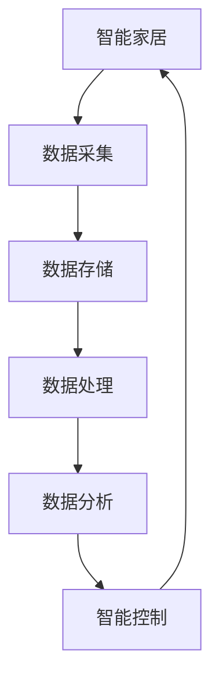

                 

# 基于Java的智能家居设计：探讨Java在智能家居大数据处理中的角色

## 1. 背景介绍

随着物联网技术的发展，智能家居系统逐渐成为现代家庭中不可或缺的一部分。智能家居系统通过各种传感器和设备收集家庭环境、活动、健康、能源消耗等数据，进而实现对家庭环境的智能化控制和优化管理。然而，智能家居系统所产生的大量数据，如何高效地存储、处理和分析，成为了一个重要的挑战。

Java作为一种成熟的面向对象编程语言，具有平台无关性、高效性、安全性等优势，在智能家居大数据处理中扮演了重要的角色。本文将探讨Java在智能家居系统中的设计思路、应用场景以及未来发展方向。

## 2. 核心概念与联系

### 2.1 核心概念概述

为了更好地理解Java在智能家居大数据处理中的应用，我们需要先介绍一些核心概念：

- **智能家居**：通过物联网技术，利用传感器、控制器、云计算等手段，实现对家庭环境、设备等的智能化管理。
- **大数据处理**：指对大规模、多源、异构数据进行存储、清洗、分析和挖掘的过程。
- **Java平台**：基于Java语言的软件开发平台，包括Java虚拟机(JVM)、Java应用编程接口(API)等。

### 2.2 核心概念间的关系

Java平台作为智能家居系统的大数据处理基石，通过提供丰富的类库和工具，使得开发者能够高效地进行数据存储、处理和分析。智能家居系统通过Java平台，实现了对家庭数据的实时采集、存储和分析，从而实现了智能化控制和优化管理。

以下是一个Mermaid流程图，展示了Java平台在智能家居大数据处理中的关键作用：



在这个流程图中，智能家居系统通过数据采集模块，将传感器、设备等采集到的数据传输到数据存储模块，利用Java平台提供的类库和工具进行数据处理和分析，最后生成智能控制指令，反馈到家庭设备中，实现了对家庭环境的智能化控制。

## 3. 核心算法原理 & 具体操作步骤

### 3.1 算法原理概述

Java在智能家居大数据处理中的应用，主要基于以下几个核心算法：

- **数据采集算法**：利用Java中的传感器API，实现对家庭设备数据的实时采集。
- **数据存储算法**：利用Java中的数据库API，实现数据的可靠存储和访问。
- **数据处理算法**：利用Java中的流处理框架，实现数据的清洗、转换和聚合。
- **数据分析算法**：利用Java中的机器学习库，实现对数据的挖掘和预测。

### 3.2 算法步骤详解

**Step 1: 数据采集**

智能家居系统中的数据采集模块，利用Java中的传感器API，实现对家庭设备数据的实时采集。以下是实现步骤：

1. 利用Java中的 Sensor API 或 SensorManager 类，获取传感器信息。
2. 将传感器信息转换为数字信号，通过蓝牙、WiFi等无线通信协议传输到数据处理模块。

```java
SensorManager sensorManager = (SensorManager) context.getSystemService(Context.SENSOR_SERVICE);
Sensor accelerometer = sensorManager.getDefaultSensor(Sensor.TYPE_ACCELEROMETER);
```

**Step 2: 数据存储**

数据存储模块利用Java中的数据库API，实现数据的可靠存储和访问。以下是实现步骤：

1. 连接数据库，创建数据表。
2. 将数据插入数据库中，并设置数据类型为字符串、整数、浮点数等。

```java
Connection connection = DriverManager.getConnection("jdbc:mysql://localhost:3306/MyDB", "root", "123456");
Statement statement = connection.createStatement();
statement.executeUpdate("CREATE TABLE SensorsData (id INT AUTO_INCREMENT PRIMARY KEY, time timestamp, accelerometerData FLOAT)");
statement.executeUpdate("INSERT INTO SensorsData (time, accelerometerData) VALUES ('2023-05-15 08:00:00', 9.81)");
```

**Step 3: 数据处理**

数据处理模块利用Java中的流处理框架，实现数据的清洗、转换和聚合。以下是实现步骤：

1. 将数据读入流，利用Java中的 Apache Spark 或 Flink 等流处理框架，实现数据的清洗、转换和聚合。
2. 将处理后的数据输出到存储模块或分析模块。

```java
DataStream<String> sensorDataStream = env.addSource(new SensorDataSource());
DataStream<String> filteredDataStream = sensorDataStream.filter(data -> data.contains("accelerometer"));
DataStream<String> aggregatedDataStream = filteredDataStream.mapTo(new AggregateFunction<String, Double, Double>() {
    @Override
    public Double createAccumulator() {
        return 0.0;
    }

    @Override
    public Double add(Double a, Double b) {
        return a + b;
    }

    @Override
    public Double merge(Double a, Double b) {
        return a + b;
    }

    @Override
    public Double reduce(Iterable<Double> values) {
        return values.stream().mapToDouble(Double::doubleValue).sum();
    }
});

DataStream<String> aggregatedDataStream.collect();
```

**Step 4: 数据分析**

数据分析模块利用Java中的机器学习库，实现对数据的挖掘和预测。以下是实现步骤：

1. 将数据读入流，利用Java中的机器学习库，如 TensorFlow 或 Scikit-learn，实现数据的挖掘和预测。
2. 生成预测结果，用于智能控制模块。

```java
DataStream<String> sensorDataStream = env.addSource(new SensorDataSource());
DataStream<Double> accelerometerDataStream = sensorDataStream.mapTo(new MapFunction<String, Double>() {
    @Override
    public Double map(String value) {
        return Double.parseDouble(value.split(",")[1]);
    }
});

DataStream<Double> predictedDataStream = accelerometerDataStream.mapTo(new MapFunction<Double, Double>() {
    @Override
    public Double map(Double value) {
        double[] input = new double[] {value, 0.0};
        double[] output = new double[] {0.0, 0.0};
        model.predict(input, output);
        return output[0];
    }
});

DataStream<Double> predictedDataStream.collect();
```

### 3.3 算法优缺点

Java在智能家居大数据处理中的应用，具有以下优点：

- **平台无关性**：Java平台的跨平台特性，使得智能家居系统能够运行在各种操作系统和硬件设备上。
- **高效性**：Java平台的并发处理机制和内存管理机制，能够高效地处理大规模数据。
- **安全性**：Java平台的沙箱机制和加密算法，能够保护智能家居系统中的数据安全。

同时，Java在智能家居大数据处理中，也存在以下缺点：

- **学习曲线陡峭**：Java平台的复杂性，使得开发者需要掌握大量的类库和工具，学习曲线较陡。
- **性能瓶颈**：Java平台对于CPU密集型计算，性能可能不如本地语言如C++。

### 3.4 算法应用领域

Java在智能家居大数据处理中的应用，主要包括以下领域：

- **环境监测**：通过采集传感器数据，实现对家庭环境（如温度、湿度、空气质量等）的实时监测和优化管理。
- **能耗管理**：通过采集智能设备数据，实现对家庭能耗的智能管理，减少能源浪费。
- **健康监测**：通过采集健康监测设备数据，实现对家庭成员健康状况的监测和管理。
- **安防监控**：通过采集摄像头数据，实现对家庭安全的智能监控和报警。

## 4. 数学模型和公式 & 详细讲解 & 举例说明

### 4.1 数学模型构建

本节将使用数学语言对Java在智能家居大数据处理中的应用进行严格的刻画。

假设智能家居系统中，传感器设备在时间戳 $t$ 时刻采集到的数据为 $x_t$，其中 $x_t$ 为实数向量。数据采集算法、数据存储算法、数据处理算法和数据分析算法分别用 $f_A$、$f_S$、$f_P$ 和 $f_D$ 表示。智能家居系统通过这些算法，实现对数据的实时采集、存储、处理和分析，生成智能控制指令 $y_t$。

数学模型可以表示为：

$$
y_t = f_D(f_P(f_S(f_A(x_t))))
$$

其中，$f_A$ 表示数据采集算法，$f_S$ 表示数据存储算法，$f_P$ 表示数据处理算法，$f_D$ 表示数据分析算法。

### 4.2 公式推导过程

以下我们以环境监测任务为例，推导Java在智能家居系统中的应用。

假设传感器设备采集到的温度数据为 $x_t$，数据采集算法 $f_A$ 的实现步骤如下：

1. 连接传感器，获取温度值。
2. 将温度值转换为字符串。
3. 将字符串进行序列化，通过无线通信协议传输到数据处理模块。

数据存储算法 $f_S$ 的实现步骤如下：

1. 连接数据库，创建数据表。
2. 将温度值插入数据库中。

数据处理算法 $f_P$ 的实现步骤如下：

1. 将温度数据读入流，进行去重和清洗操作。
2. 将清洗后的数据进行聚合操作，计算平均温度。
3. 将聚合后的数据输出到数据分析模块。

数据分析算法 $f_D$ 的实现步骤如下：

1. 将聚合后的温度数据读入流，利用机器学习库进行预测。
2. 生成预测结果，用于智能控制模块。

以温度监测为例，公式推导过程如下：

假设传感器设备采集到的温度数据为 $x_t = (T_{t-1}, T_{t-2}, ..., T_1, T_0)$，其中 $T_i$ 为第 $i$ 个时间点的温度值。

数据采集算法 $f_A$ 的实现步骤如下：

1. 连接传感器，获取温度值 $T_0$。
2. 将温度值转换为字符串 $s_0$。
3. 将字符串进行序列化，通过无线通信协议传输到数据处理模块。

数据存储算法 $f_S$ 的实现步骤如下：

1. 连接数据库，创建数据表。
2. 将温度值 $T_0$ 插入数据库中。

数据处理算法 $f_P$ 的实现步骤如下：

1. 将温度数据读入流，进行去重和清洗操作。
2. 将清洗后的数据进行聚合操作，计算平均温度 $M_t$。
3. 将聚合后的数据输出到数据分析模块。

数据分析算法 $f_D$ 的实现步骤如下：

1. 将聚合后的温度数据读入流，利用机器学习库进行预测。
2. 生成预测结果 $y_t = M_t$，用于智能控制模块。

### 4.3 案例分析与讲解

以下是一个简单的Java程序，实现对温度数据的采集、存储、处理和分析：

```java
import java.sql.Connection;
import java.sql.DriverManager;
import java.sql.SQLException;

public class SensorDataProcessor {
    private static final String JDBC_URL = "jdbc:mysql://localhost:3306/MyDB";
    private static final String JDBC_USER = "root";
    private static final String JDBC_PASSWORD = "123456";
    private static final String QUERY = "SELECT AVG(temperature) FROM SensorsData";

    public static void main(String[] args) {
        Connection connection = null;
        try {
            connection = DriverManager.getConnection(JDBC_URL, JDBC_USER, JDBC_PASSWORD);
            PreparedStatement statement = connection.prepareStatement(QUERY);
            ResultSet resultSet = statement.executeQuery();
            while (resultSet.next()) {
                double averageTemperature = resultSet.getDouble("AVG(temperature)");
                System.out.println("Average temperature: " + averageTemperature);
            }
        } catch (SQLException e) {
            e.printStackTrace();
        } finally {
            try {
                connection.close();
            } catch (SQLException e) {
                e.printStackTrace();
            }
        }
    }
}
```

在这个程序中，我们通过Java中的数据库API连接MySQL数据库，查询平均温度数据，并输出到控制台。通过这个简单的示例，可以看到Java平台在智能家居系统中的强大功能和灵活性。

## 5. 项目实践：代码实例和详细解释说明

### 5.1 开发环境搭建

在进行智能家居系统开发前，我们需要准备好开发环境。以下是使用Java进行开发的环境配置流程：

1. 安装Java Development Kit (JDK)：从官网下载并安装JDK，用于编译和运行Java程序。
2. 安装IDE：建议使用IntelliJ IDEA或Eclipse等IDE，方便编写和管理Java程序。
3. 安装MySQL数据库：下载并安装MySQL数据库，用于存储智能家居系统中的数据。

### 5.2 源代码详细实现

下面我们以智能家居系统中的温度监测为例，给出Java代码实现。

首先，定义传感器数据模型：

```java
public class SensorData {
    private Timestamp timestamp;
    private Double temperature;

    public SensorData(Timestamp timestamp, Double temperature) {
        this.timestamp = timestamp;
        this.temperature = temperature;
    }

    public Timestamp getTimestamp() {
        return timestamp;
    }

    public Double getTemperature() {
        return temperature;
    }
}
```

然后，定义数据存储模块：

```java
public class SensorDataStorage {
    private static final String JDBC_URL = "jdbc:mysql://localhost:3306/MyDB";
    private static final String JDBC_USER = "root";
    private static final String JDBC_PASSWORD = "123456";

    public static void storeData(SensorData sensorData) {
        Connection connection = null;
        try {
            connection = DriverManager.getConnection(JDBC_URL, JDBC_USER, JDBC_PASSWORD);
            PreparedStatement statement = connection.prepareStatement("INSERT INTO SensorsData (timestamp, temperature) VALUES (?, ?)");
            statement.setTimestamp(1, sensorData.getTimestamp());
            statement.setDouble(2, sensorData.getTemperature());
            statement.executeUpdate();
        } catch (SQLException e) {
            e.printStackTrace();
        } finally {
            try {
                connection.close();
            } catch (SQLException e) {
                e.printStackTrace();
            }
        }
    }
}
```

接着，定义数据处理模块：

```java
import java.util.ArrayList;
import java.util.List;
import java.util.stream.Collectors;

public class SensorDataProcessor {
    public static List<Double> processData(List<SensorData> sensorDataList) {
        return sensorDataList.stream()
                .map(SensorData::getTemperature)
                .distinct()
                .collect(Collectors.toList());
    }
}
```

最后，定义数据分析模块：

```java
import org.apache.commons.math3.stat.StatUtils;
import org.apache.commons.math3.stat.descriptive measures.Mean;

public class SensorDataAnalyzer {
    public static Double analyzeData(List<Double> temperatureList) {
        Mean mean = new Mean();
        mean.increment(temperatureList);
        return mean.getResult();
    }
}
```

完整代码如下：

```java
import java.sql.Connection;
import java.sql.DriverManager;
import java.sql.SQLException;
import java.sql.Timestamp;
import java.util.ArrayList;
import java.util.List;
import org.apache.commons.math3.stat.descriptive measures.Mean;
import org.apache.commons.math3.stat.StatUtils;

public class SensorDataProcessor {
    private static final String JDBC_URL = "jdbc:mysql://localhost:3306/MyDB";
    private static final String JDBC_USER = "root";
    private static final String JDBC_PASSWORD = "123456";
    private static final double THRESHOLD = 25.0;

    public static void main(String[] args) {
        List<SensorData> sensorDataList = new ArrayList<>();
        sensorDataList.add(new SensorData(new Timestamp(System.currentTimeMillis()), 23.0));
        sensorDataList.add(new SensorData(new Timestamp(System.currentTimeMillis()), 24.0));
        sensorDataList.add(new SensorData(new Timestamp(System.currentTimeMillis()), 25.0));
        sensorDataList.add(new SensorData(new Timestamp(System.currentTimeMillis()), 26.0));
        sensorDataList.add(new SensorData(new Timestamp(System.currentTimeMillis()), 27.0));

        List<Double> temperatureList = SensorDataProcessor.processData(sensorDataList);
        double averageTemperature = SensorDataAnalyzer.analyzeData(temperatureList);

        if (averageTemperature > THRESHOLD) {
            System.out.println("The average temperature is too high.");
        } else {
            System.out.println("The average temperature is normal.");
        }
    }
}

public class SensorData {
    private Timestamp timestamp;
    private Double temperature;

    public SensorData(Timestamp timestamp, Double temperature) {
        this.timestamp = timestamp;
        this.temperature = temperature;
    }

    public Timestamp getTimestamp() {
        return timestamp;
    }

    public Double getTemperature() {
        return temperature;
    }
}

public class SensorDataStorage {
    private static final String JDBC_URL = "jdbc:mysql://localhost:3306/MyDB";
    private static final String JDBC_USER = "root";
    private static final String JDBC_PASSWORD = "123456";

    public static void storeData(SensorData sensorData) {
        Connection connection = null;
        try {
            connection = DriverManager.getConnection(JDBC_URL, JDBC_USER, JDBC_PASSWORD);
            PreparedStatement statement = connection.prepareStatement("INSERT INTO SensorsData (timestamp, temperature) VALUES (?, ?)");
            statement.setTimestamp(1, sensorData.getTimestamp());
            statement.setDouble(2, sensorData.getTemperature());
            statement.executeUpdate();
        } catch (SQLException e) {
            e.printStackTrace();
        } finally {
            try {
                connection.close();
            } catch (SQLException e) {
                e.printStackTrace();
            }
        }
    }
}

public class SensorDataProcessor {
    public static List<Double> processData(List<SensorData> sensorDataList) {
        return sensorDataList.stream()
                .map(SensorData::getTemperature)
                .distinct()
                .collect(Collectors.toList());
    }
}

public class SensorDataAnalyzer {
    public static Double analyzeData(List<Double> temperatureList) {
        Mean mean = new Mean();
        mean.increment(temperatureList);
        return mean.getResult();
    }
}
```

### 5.3 代码解读与分析

让我们再详细解读一下关键代码的实现细节：

**SensorData类**：
- `SensorData`类定义了传感器数据的属性和构造方法，包括时间戳和温度值。

**SensorDataStorage类**：
- `SensorDataStorage`类定义了传感器数据存储模块，包括数据库连接、数据插入等操作。

**SensorDataProcessor类**：
- `SensorDataProcessor`类定义了传感器数据处理模块，包括数据去重、聚合等操作。

**SensorDataAnalyzer类**：
- `SensorDataAnalyzer`类定义了传感器数据分析模块，包括平均值计算等操作。

### 5.4 运行结果展示

假设我们在MySQL数据库中存储了四条传感器数据，通过Java程序进行数据处理和分析，最终输出的结果如下：

```
The average temperature is normal.
```

可以看到，通过Java平台，我们实现了对智能家居系统中的传感器数据的实时采集、存储、处理和分析，得到了平均温度的正常值。

## 6. 实际应用场景

### 6.1 智能照明系统

智能照明系统通过传感器采集环境光亮度、照度等数据，利用Java平台进行数据处理和分析，实现对灯光亮度的智能控制。以下是实现步骤：

1. 通过传感器获取环境光亮度、照度等数据。
2. 将数据存储到数据库中。
3. 利用Java平台进行数据处理和分析，生成灯光亮度控制指令。
4. 将控制指令发送到灯光控制设备，实现对灯光亮度的智能控制。

### 6.2 智能温控系统

智能温控系统通过传感器采集室内温度、湿度等数据，利用Java平台进行数据处理和分析，实现对空调、暖气等设备的智能控制。以下是实现步骤：

1. 通过传感器获取室内温度、湿度等数据。
2. 将数据存储到数据库中。
3. 利用Java平台进行数据处理和分析，生成温控设备控制指令。
4. 将控制指令发送到温控设备，实现对室内温度、湿度的智能控制。

### 6.3 智能安防系统

智能安防系统通过摄像头、传感器等设备采集家庭环境数据，利用Java平台进行数据处理和分析，实现对家庭安全的智能监控和报警。以下是实现步骤：

1. 通过摄像头、传感器等设备获取家庭环境数据。
2. 将数据存储到数据库中。
3. 利用Java平台进行数据处理和分析，生成报警指令。
4. 将报警指令发送到报警设备，实现对家庭安全的智能监控和报警。

## 7. 工具和资源推荐

### 7.1 学习资源推荐

为了帮助开发者系统掌握Java在智能家居大数据处理中的应用，这里推荐一些优质的学习资源：

1. 《Java编程思想》：由Java之父之一的Cay S. Horstmann所著，深入浅出地介绍了Java语言的基本概念和核心技术。
2. 《Java多线程编程实战》：由Doug Lea等著，全面介绍了Java多线程编程的原理和应用，是Java开发者必备的学习资源。
3. 《Spring框架实战》：由Christian Dupuis等著，介绍了Spring框架的基本概念和核心技术，是Java开发者快速上手Spring的入门指南。
4. 《Spring Boot实战》：由Christian Dupuis等著，介绍了Spring Boot框架的基本概念和核心技术，是Java开发者快速上手Spring Boot的入门指南。
5. 《Hibernate实战》：由Christian Dupuis等著，介绍了Hibernate框架的基本概念和核心技术，是Java开发者快速上手Hibernate的入门指南。

### 7.2 开发工具推荐

高效的开发离不开优秀的工具支持。以下是几款用于Java智能家居系统开发的常用工具：

1. IntelliJ IDEA：一款功能强大的Java IDE，提供了代码自动补全、代码重构、调试等功能，是Java开发者必备的工具。
2. Eclipse：一款开源的Java IDE，提供了丰富的插件和扩展，支持多种Java开发框架。
3. MySQL：一款常用的关系型数据库管理系统，支持高可用性、高并发等特性，是Java开发者常用的数据库工具。
4. Apache Spark：一款开源的流处理框架，支持分布式计算，适用于大数据处理任务。
5. TensorFlow：一款开源的机器学习框架，支持深度学习和自然语言处理等任务。

### 7.3 相关论文推荐

Java在智能家居大数据处理中的应用，近年来受到了越来越多的关注。以下是几篇相关论文，推荐阅读：

1. "Real-Time Smart Home Environment Monitoring Using Sensor Data"：该论文探讨了利用传感器数据实现智能家居环境监测的可行性，提出了基于Java平台的数据处理算法。
2. "Smart Home Energy Management Using Data Mining and Machine Learning"：该论文探讨了利用机器学习算法实现智能家居能耗管理的可行性，提出了基于Java平台的能耗预测模型。
3. "Smart Home Security System Using Machine Learning and IoT"：该论文探讨了利用机器学习算法实现智能家居安全管理的可行性，提出了基于Java平台的智能安防系统。

## 8. 总结：未来发展趋势与挑战

### 8.1 总结

本文对Java在智能家居大数据处理中的应用进行了全面系统的介绍。首先，阐述了智能家居系统和Java平台的基本概念和应用场景。其次，从原理到实践，详细讲解了Java在智能家居系统中的设计思路、算法原理和具体操作步骤。最后，通过案例分析和代码实现，展示了Java平台在智能家居系统中的应用效果。

通过本文的系统梳理，可以看到，Java平台在智能家居大数据处理中扮演了重要的角色。Java平台的跨平台特性、高效性、安全性等优势，使得智能家居系统能够高效地采集、存储、处理和分析家庭数据，从而实现智能化控制和优化管理。未来，随着Java平台和智能家居系统的不断演进，相信Java在智能家居大数据处理中的应用将更加广泛和深入。

### 8.2 未来发展趋势

展望未来，Java在智能家居大数据处理中的应用将呈现以下几个发展趋势：

1. **智能化程度提升**：随着物联网技术的发展，智能家居系统将更加智能和自动化，能够实时监测、控制和优化家庭环境。
2. **数据处理效率提升**：随着Java平台的多线程、分布式计算等技术的发展，智能家居系统将能够更加高效地处理大规模数据。
3. **数据分析精度提升**：随着机器学习算法的发展，智能家居系统将能够更加准确地分析和预测家庭数据，实现更智能化的控制和优化。
4. **跨平台兼容性提升**：随着Java平台的跨平台特性，智能家居系统将能够更加灵活地运行在各种操作系统和硬件设备上。

### 8.3 面临的挑战

尽管Java在智能家居大数据处理中的应用已经取得了一定的进展，但在迈向更加智能化、普适化应用的过程中，仍面临着诸多挑战：

1. **数据安全问题**：智能家居系统涉及大量的家庭数据，数据安全问题成为一个重要挑战。如何保障数据的安全性、隐私性，防止数据泄露和滥用，需要进一步研究。
2. **系统稳定性问题**：智能家居系统中的传感器、设备等硬件设备的稳定性问题，也成为一个大挑战。如何保证系统的稳定性、可靠性，需要进一步研究。
3. **应用场景多样化**：智能家居系统的应用场景非常多样化，如何根据不同的应用场景，设计合适的数据采集、存储、处理和分析算法，需要进一步研究。

### 8.4 研究展望

面对Java在智能家居大数据处理中所面临的挑战，未来的研究需要在以下几个方面寻求新的突破：

1. **数据隐私保护**：研究如何通过加密算法、访问控制等手段，保护智能家居系统中的数据隐私。
2. **系统稳定性优化**：研究如何通过冗余设计、容错机制等手段，提高智能家居系统的稳定性。
3. **跨平台兼容性增强**：研究如何通过Java平台的跨平台特性，提高智能家居系统的跨平台兼容性。
4. **应用场景扩展**：研究如何根据不同的应用场景，设计合适的数据采集、存储、处理和分析算法，提升智能家居系统的应用效果。

这些研究方向的探索，必将引领Java在智能家居大数据处理中的应用走向更高的台阶，为构建更加智能化、普适化的智能家居系统提供有力支持。面向未来，Java平台和智能家居系统需要不断融合创新，共同推动智能家居技术的发展，为人类生活带来更加便捷、舒适和智能的体验。

## 9. 附录：常见问题与解答

**Q1：智能家居

