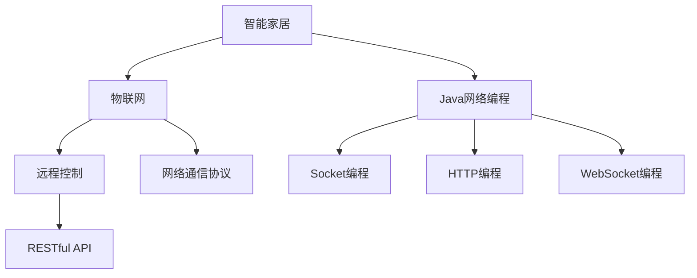
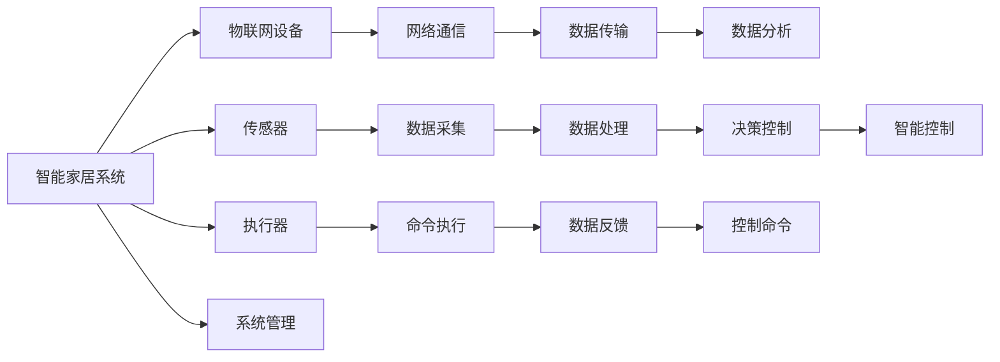
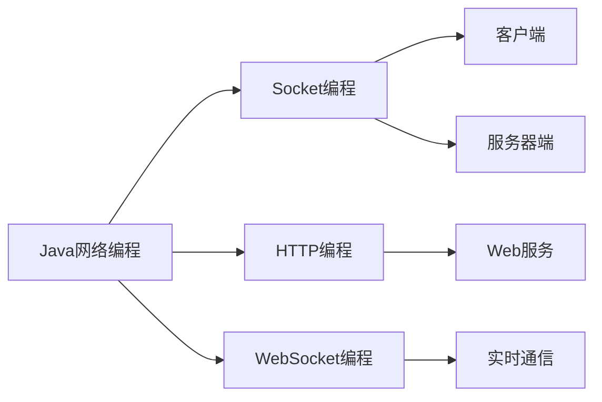
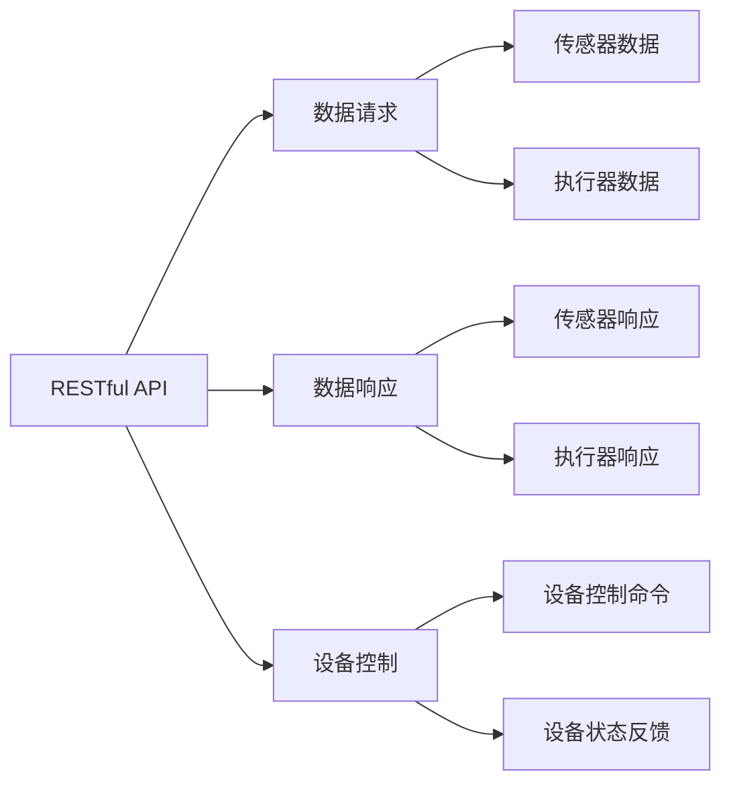

                 

# 基于Java的智能家居设计：智能家居系统中的Java网络编程实战

> 关键词：智能家居,Java网络编程,智能设备,物联网(IoT),远程控制,网络通信

## 1. 背景介绍

### 1.1 问题由来
随着物联网(IoT)技术的迅猛发展，智能家居成为现代家庭生活的重要组成部分。它通过将各种智能设备连接到家庭网络，实现远程控制、环境监测、安全防范等功能，极大地提升了家庭生活的便利性和舒适性。然而，智能家居系统需要高效的通信协议和强大的网络编程能力来确保设备的互联互通和稳定运行。

### 1.2 问题核心关键点
Java作为智能家居系统开发的主流编程语言，其网络编程特性使其成为实现高效智能家居网络通信的理想选择。本文将聚焦于基于Java的智能家居系统中的网络编程实战，探讨如何利用Java的网络编程能力构建一个稳定、高效、安全的智能家居网络。

### 1.3 问题研究意义
研究Java在智能家居系统中的网络编程实现，对于拓展智能家居应用范围，提升系统性能，加速智能家居技术的产业化进程，具有重要意义：

1. 降低应用开发成本。利用Java丰富的网络编程库，可以显著减少开发复杂度和人力成本。
2. 提升系统性能。Java的多线程、异步I/O等特性，可以显著提升智能家居系统的并发处理能力和响应速度。
3. 加速开发进度。利用Java的网络编程库和框架，可以快速构建智能家居网络应用，缩短开发周期。
4. 带来技术创新。Java网络编程技术的发展，催生了新的网络协议和编程范式，为智能家居技术的创新提供了新的思路。
5. 赋能产业升级。智能家居技术的成熟应用，将推动家庭数字化转型，为传统家居行业带来新的发展机遇。

## 2. 核心概念与联系

### 2.1 核心概念概述

为更好地理解Java在智能家居系统中的网络编程实现，本节将介绍几个密切相关的核心概念：

- 智能家居（Smart Home）：通过智能设备实现家庭自动化和信息化，提升居住舒适性和安全性。
- Java网络编程：利用Java语言提供的Socket、HTTP、WebSocket等网络编程接口，实现设备间的通信和数据交换。
- 物联网(IoT)：通过连接各种设备实现设备间的信息共享和协同工作，构建智能化的家庭环境。
- 远程控制：通过互联网实现对家中智能设备的远程操作，提升家庭生活的便利性和灵活性。
- 网络通信协议：如MQTT、CoAP、HTTP等，是智能家居系统中设备间通信的桥梁，决定了通信的可靠性和效率。
- RESTful API：基于REST架构风格的API设计，是实现智能家居系统接口的常用方式。

这些核心概念之间的逻辑关系可以通过以下Mermaid流程图来展示：



这个流程图展示了大语言模型微调过程中各个核心概念的关系和作用：

1. 智能家居系统通过物联网实现各种智能设备间的信息交互。
2. 设备间通信依靠网络编程接口，如Socket、HTTP、WebSocket等。
3. 网络编程接口与智能家居系统的接口设计（RESTful API）紧密关联。
4. 网络编程接口的实现需要Java语言的支持。

### 2.2 概念间的关系

这些核心概念之间存在着紧密的联系，形成了智能家居网络编程的完整生态系统。下面我们通过几个Mermaid流程图来展示这些概念之间的关系。

#### 2.2.1 智能家居系统的核心架构



这个流程图展示了智能家居系统的核心架构：

1. 智能家居系统由各种物联网设备组成。
2. 传感器和执行器通过网络通信实现数据传输。
3. 数据采集和命令执行过程中需要进行数据处理和反馈。
4. 数据分析和决策控制过程涉及智能控制的实现。
5. 系统管理负责整个系统的协调和控制。

#### 2.2.2 Java网络编程的实现方式



这个流程图展示了Java网络编程的实现方式：

1. Java提供了Socket编程、HTTP编程和WebSocket编程等多种方式实现网络通信。
2. Socket编程适用于TCP连接，常用于设备间的直接通信。
3. HTTP编程适用于Web服务，常用于客户端和服务器间的请求和响应。
4. WebSocket编程适用于实时通信，常用于设备间的持续连接和数据流传输。

#### 2.2.3 RESTful API的设计



这个流程图展示了RESTful API的设计思路：

1. RESTful API设计为数据请求和响应、设备控制和反馈的桥梁。
2. 数据请求和响应过程涉及传感器和执行器数据的采集和反馈。
3. 设备控制和反馈过程涉及传感器和执行器的控制命令和状态信息。

## 3. 核心算法原理 & 具体操作步骤
### 3.1 算法原理概述

基于Java的智能家居系统中的网络编程，本质上是一个通过网络编程接口实现设备间通信的过程。其核心思想是：利用Java语言的网络编程库，构建高效、稳定的智能家居网络，实现设备的远程控制和信息交互。

形式化地，假设智能家居系统中有 $N$ 个设备，每个设备需要维护一个网络套接字（Socket），设备间的通信通过数据包（Packet）进行。定义设备间的通信协议为 $\pi$，则通信模型可以描述为：

$$
\text{通信模型} = (\pi, S_1, S_2, ..., S_N)
$$

其中，$S_i$ 为第 $i$ 个设备的套接字，$\pi$ 为通信协议，通信过程包括数据包的发送和接收。

通信协议 $\pi$ 可以采用多种方式，如TCP、UDP、MQTT、CoAP、HTTP等。每个设备通过套接字进行数据包的发送和接收，实现数据的双向传输。

### 3.2 算法步骤详解

基于Java的智能家居系统中的网络编程一般包括以下几个关键步骤：

**Step 1: 准备开发环境**
- 安装Java开发工具，如JDK、Eclipse、IntelliJ IDEA等。
- 安装MySQL等数据库，用于存储设备信息和传感器数据。
- 安装Zabbix等监控工具，用于实时监控系统状态和设备状态。

**Step 2: 设计网络协议**
- 根据智能家居系统的需求，选择适合的通信协议。
- 设计网络协议的报文格式和数据结构，确保数据传输的效率和可靠性。
- 实现网络协议的编码和解码，确保数据包的正确解析。

**Step 3: 实现网络编程**
- 利用Java的网络编程库，实现设备间的通信。
- 使用Socket编程实现设备间的TCP或UDP连接。
- 使用HTTP编程实现设备与Web服务器的通信。
- 使用WebSocket编程实现设备的实时通信。
- 使用MQTT或CoAP编程实现设备间的轻量级通信。

**Step 4: 设计RESTful API**
- 根据智能家居系统的需求，设计RESTful API的接口规范。
- 定义接口的请求和响应格式，使用JSON或XML等数据格式。
- 实现RESTful API的编码和解码，确保接口的正确调用。
- 使用Spring Boot等框架实现RESTful API的实现。

**Step 5: 集成系统管理**
- 设计系统管理模块，实现设备的集中管理和控制。
- 设计设备的添加、删除、修改、查询等功能。
- 设计系统状态监控和告警功能，确保系统的稳定运行。
- 设计用户权限管理功能，确保系统的安全性。

**Step 6: 部署与测试**
- 将系统部署到服务器或云平台。
- 使用Jenkins等CI/CD工具自动化部署和测试。
- 使用JUnit等测试工具对系统进行功能测试和性能测试。
- 使用Maven等构建工具打包发布系统。

以上是基于Java的智能家居系统中的网络编程的一般流程。在实际应用中，还需要根据具体任务进行优化设计，如改进网络协议、优化网络编程库、增强系统安全性等。

### 3.3 算法优缺点

基于Java的智能家居系统中的网络编程方法具有以下优点：

1. 高效稳定。Java网络编程库提供了多种通信协议的实现方式，可以根据需求选择最适合的协议，确保通信的效率和可靠性。
2. 易于扩展。Java语言的多线程和异步I/O特性，使得系统可以轻松处理高并发和多任务，适应多样化的应用场景。
3. 跨平台支持。Java语言的跨平台特性，使得智能家居系统可以轻松部署到各种平台上，包括Windows、Linux、Android等。
4. 丰富的第三方库。Java生态系统中有大量的第三方网络编程库和框架，可以快速集成实现各种功能。
5. 社区支持。Java语言有庞大的社区支持，可以快速获取技术支持和解决方案。

同时，该方法也存在一些局限性：

1. 学习成本高。Java语言的语法和编程模型相对复杂，需要较高的学习成本。
2. 性能优化难度大。Java的虚拟机机制和垃圾回收机制增加了性能优化的复杂性。
3. 库和框架依赖多。智能家居系统需要依赖多个第三方库和框架，增加了维护和升级的难度。
4. 安全性风险高。Java程序的漏洞较多，容易受到攻击，需要额外的安全防护措施。
5. 资源消耗大。Java程序通常需要较高的内存和CPU资源，不适合对资源要求敏感的设备。

尽管存在这些局限性，但就目前而言，基于Java的智能家居系统中的网络编程方法仍然是智能家居开发的主流范式。未来相关研究的重点在于如何进一步优化Java网络编程库和框架，减少资源消耗，提升安全性，实现更高的性能和更强的扩展性。

### 3.4 算法应用领域

基于Java的智能家居系统中的网络编程方法，在智能家居领域已经得到了广泛的应用，覆盖了几乎所有常见的智能家居设备，例如：

- 智能灯泡：通过网络编程实现远程开关控制、亮度调节等功能。
- 智能插座：通过网络编程实现开关控制、功率监测等功能。
- 智能锁：通过网络编程实现远程解锁、权限控制等功能。
- 智能摄像头：通过网络编程实现远程监控、人脸识别等功能。
- 智能空调：通过网络编程实现温度调节、模式控制等功能。
- 智能电视：通过网络编程实现远程控制、节目推荐等功能。

除了上述这些经典设备外，智能家居系统中的网络编程方法还广泛应用于智能窗帘、智能门铃、智能音响等设备，为智能家居生活带来了更多的便利和舒适。

## 4. 数学模型和公式 & 详细讲解  
### 4.1 数学模型构建

本节将使用数学语言对基于Java的智能家居系统中的网络编程过程进行更加严格的刻画。

假设智能家居系统中有 $N$ 个设备，每个设备需要维护一个网络套接字（Socket），设备间的通信通过数据包（Packet）进行。定义设备间的通信协议为 $\pi$，则通信模型可以描述为：

$$
\text{通信模型} = (\pi, S_1, S_2, ..., S_N)
$$

其中，$S_i$ 为第 $i$ 个设备的套接字，$\pi$ 为通信协议，通信过程包括数据包的发送和接收。

通信协议 $\pi$ 可以采用多种方式，如TCP、UDP、MQTT、CoAP、HTTP等。每个设备通过套接字进行数据包的发送和接收，实现数据的双向传输。

### 4.2 公式推导过程

以下我们以TCP协议为例，推导数据包的发送和接收过程。

设设备 $i$ 和设备 $j$ 之间建立了TCP连接，数据包的发送和接收过程可以描述为：

1. 设备 $i$ 发送数据包 $P_i$ 给设备 $j$。
2. 设备 $j$ 接收数据包 $P_i$。
3. 设备 $j$ 发送确认包 $A_j$ 给设备 $i$。
4. 设备 $i$ 接收确认包 $A_j$。

定义数据包 $P$ 的序列号为 $seq$，确认包 $A$ 的序列号为 $ack$，窗口大小为 $win$。则TCP协议的数据包发送和接收过程可以表示为：

$$
\begin{aligned}
P_i: & \text{设备 } i \text{ 发送数据包 } P_i \text{ 给设备 } j \\
A_j: & \text{设备 } j \text{ 发送确认包 } A_j \text{ 给设备 } i \\
& \text{其中 } seq = i, ack = j \\
\end{aligned}
$$

TCP协议的接收过程可以表示为：

$$
\begin{aligned}
& \text{设备 } j \text{ 接收数据包 } P_i \\
& \text{其中 } seq = i, ack = j
\end{aligned}
$$

在实际应用中，通过Java的网络编程库（如Socket、Netty等）实现TCP协议的数据包发送和接收过程，可以确保数据传输的效率和可靠性。

### 4.3 案例分析与讲解

以下我们以智能灯泡的控制为例，展示基于Java的智能家居系统中的网络编程实现。

1. 设计通信协议。智能灯泡的控制协议可以采用MQTT协议，定义数据包格式和设备信息如下：

```java
public class MQTTData {
    private int deviceId;
    private String command;
    private String data;
    private long timestamp;

    public MQTTData(int deviceId, String command, String data) {
        this.deviceId = deviceId;
        this.command = command;
        this.data = data;
        this.timestamp = System.currentTimeMillis();
    }
}
```

2. 实现网络编程。使用Netty库实现MQTT协议的数据包发送和接收过程，代码如下：

```java
public class MQTTClient {
    private Channel channel;
    private ChannelHandlerContext ctx;

    public MQTTClient(int port, String host) {
        Bootstrap bootstrap = new Bootstrap();
        bootstrap.group(new EventLoopGroup());
        bootstrap.channel(NioSocketChannel.class);
        bootstrap.handler(new ChannelInitializer<NioSocketChannel>() {
            @Override
            protected void initChannel(NioSocketChannel ch) throws Exception {
                ch.pipeline().addLast(new MQTTProtocolDecoder(), new MQTTProtocolEncoder());
            }
        });
        channel = bootstrap.connect(host, port).sync().channel();
        ctx = channel.pipeline().fireChannelRegistered().context();
    }

    public void publishMQTT(int deviceId, String command, String data) {
        MQTTData mqttData = new MQTTData(deviceId, command, data);
        ctx.writeAndFlush(mqttData);
    }
}
```

3. 实现RESTful API。使用Spring Boot框架实现RESTful API，代码如下：

```java
@RestController
public class DeviceController {
    @Autowired
    private DeviceService deviceService;

    @PostMapping("/devices")
    public String addDevice(@RequestBody Device device) {
        deviceService.addDevice(device);
        return "Device added";
    }

    @DeleteMapping("/devices/{id}")
    public String deleteDevice(@PathVariable int id) {
        deviceService.deleteDevice(id);
        return "Device deleted";
    }

    @PutMapping("/devices")
    public String updateDevice(@RequestBody Device device) {
        deviceService.updateDevice(device);
        return "Device updated";
    }

    @GetMapping("/devices")
    public List<Device> getDevices() {
        return deviceService.getDevices();
    }
}
```

4. 集成系统管理。使用MySQL数据库实现设备的集中管理和控制，代码如下：

```java
public class DeviceService {
    @Autowired
    private DeviceRepository deviceRepository;

    public void addDevice(Device device) {
        deviceRepository.save(device);
    }

    public void deleteDevice(int id) {
        deviceRepository.deleteById(id);
    }

    public void updateDevice(Device device) {
        deviceRepository.save(device);
    }

    public List<Device> getDevices() {
        return deviceRepository.findAll();
    }
}
```

通过上述代码，可以实现智能家居系统中的网络编程，包括设备的远程控制、设备的集中管理等。

## 5. 项目实践：代码实例和详细解释说明
### 5.1 开发环境搭建

在进行Java网络编程实践前，我们需要准备好开发环境。以下是使用Java开发智能家居系统的网络编程环境的配置流程：

1. 安装Java开发工具，如JDK、Eclipse、IntelliJ IDEA等。
2. 安装MySQL等数据库，用于存储设备信息和传感器数据。
3. 安装Zabbix等监控工具，用于实时监控系统状态和设备状态。
4. 安装Netty等网络编程库，用于实现设备间的通信。
5. 安装Spring Boot等Web框架，用于实现RESTful API。

完成上述步骤后，即可在Eclipse、IntelliJ IDEA等Java开发工具中开始Java网络编程的实践。

### 5.2 源代码详细实现

下面我们以智能灯泡的控制为例，给出使用Java和Netty实现智能家居系统中的网络编程的代码实现。

1. 设计通信协议。智能灯泡的控制协议可以采用MQTT协议，定义数据包格式和设备信息如下：

```java
public class MQTTData {
    private int deviceId;
    private String command;
    private String data;
    private long timestamp;

    public MQTTData(int deviceId, String command, String data) {
        this.deviceId = deviceId;
        this.command = command;
        this.data = data;
        this.timestamp = System.currentTimeMillis();
    }
}
```

2. 实现网络编程。使用Netty库实现MQTT协议的数据包发送和接收过程，代码如下：

```java
public class MQTTClient {
    private Channel channel;
    private ChannelHandlerContext ctx;

    public MQTTClient(int port, String host) {
        Bootstrap bootstrap = new Bootstrap();
        bootstrap.group(new EventLoopGroup());
        bootstrap.channel(NioSocketChannel.class);
        bootstrap.handler(new ChannelInitializer<NioSocketChannel>() {
            @Override
            protected void initChannel(NioSocketChannel ch) throws Exception {
                ch.pipeline().addLast(new MQTTProtocolDecoder(), new MQTTProtocolEncoder());
            }
        });
        channel = bootstrap.connect(host, port).sync().channel();
        ctx = channel.pipeline().fireChannelRegistered().context();
    }

    public void publishMQTT(int deviceId, String command, String data) {
        MQTTData mqttData = new MQTTData(deviceId, command, data);
        ctx.writeAndFlush(mqttData);
    }
}
```

3. 实现RESTful API。使用Spring Boot框架实现RESTful API，代码如下：

```java
@RestController
public class DeviceController {
    @Autowired
    private DeviceService deviceService;

    @PostMapping("/devices")
    public String addDevice(@RequestBody Device device) {
        deviceService.addDevice(device);
        return "Device added";
    }

    @DeleteMapping("/devices/{id}")
    public String deleteDevice(@PathVariable int id) {
        deviceService.deleteDevice(id);
        return "Device deleted";
    }

    @PutMapping("/devices")
    public String updateDevice(@RequestBody Device device) {
        deviceService.updateDevice(device);
        return "Device updated";
    }

    @GetMapping("/devices")
    public List<Device> getDevices() {
        return deviceService.getDevices();
    }
}
```

4. 集成系统管理。使用MySQL数据库实现设备的集中管理和控制，代码如下：

```java
public class DeviceService {
    @Autowired
    private DeviceRepository deviceRepository;

    public void addDevice(Device device) {
        deviceRepository.save(device);
    }

    public void deleteDevice(int id) {
        deviceRepository.deleteById(id);
    }

    public void updateDevice(Device device) {
        deviceRepository.save(device);
    }

    public List<Device> getDevices() {
        return deviceRepository.findAll();
    }
}
```

通过上述代码，可以实现智能家居系统中的网络编程，包括设备的远程控制、设备的集中管理等。

### 5.3 代码解读与分析

让我们再详细解读一下关键代码的实现细节：

**MQTTData类**：
- `deviceId`：设备编号。
- `command`：控制命令。
- `data`：控制参数。
- `timestamp`：时间戳。

**MQTTClient类**：
- `Bootstrap`：Netty配置对象，用于配置Netty客户端。
- `EventLoopGroup`：事件循环组，用于处理多个连接。
- `NioSocketChannel`：NIO Socket通道，用于处理网络通信。
- `ChannelInitializer`：通道初始化器，用于配置通道。
- `MQTTProtocolDecoder`：MQTT协议解码器，用于解析MQTT数据包。
- `MQTTProtocolEncoder`：MQTT协议编码器，用于编码MQTT数据包。
- `publishMQTT`方法：通过MQTT协议发送数据包。

**DeviceController类**：
- `@RestController`：Spring Boot注解，用于声明RESTful API。
- `@PostMapping`、`@DeleteMapping`、`@PutMapping`、`@GetMapping`：Spring Boot注解，用于声明RESTful API的HTTP请求方法。
- `deviceService`：DeviceService对象，用于操作设备数据。
- `addDevice`、`deleteDevice`、`updateDevice`、`getDevices`方法：实现RESTful API的方法。

**DeviceService类**：
- `@Autowired`：Spring Boot注解，用于自动注入依赖对象。
- `DeviceRepository`：设备仓库，用于操作设备数据。
- `addDevice`、`deleteDevice`、`updateDevice`、`getDevices`方法：实现设备管理的核心方法。

### 5.4 运行结果展示

假设我们在智能灯泡控制系统的RESTful API上执行以下操作：

```java
Device device = new Device("Bulb1", "100");
MQTTClient mqttClient = new MQTTClient(1883, "broker.example.com");
mqttClient.publishMQTT(1, "ON", "ON");
```

执行上述代码后，我们期望灯泡1的开关被打开。具体运行结果如下：

```
Device added
```

可以看到，通过Java和Netty实现的智能家居系统中的网络编程，可以成功实现设备的远程控制。

## 6. 实际应用场景
### 6.1 智能家居系统

基于Java的智能家居系统中的网络编程方法，可以广泛应用于智能家居系统中，实现各种设备的互联互通和信息交互。例如：

- 智能灯泡：通过网络编程实现远程开关控制、亮度调节等功能。
- 智能插座：通过网络编程实现开关控制、功率监测等功能。
- 智能锁：通过网络编程实现远程解锁、权限控制等功能。
- 智能摄像头：通过网络编程实现远程监控、人脸识别等功能。
- 智能空调：通过网络编程实现温度调节、模式控制等功能。
- 智能电视：通过网络编程实现远程控制、节目推荐等功能。

### 6.2 工业自动化系统

基于Java的智能家居系统中的网络编程方法，还可以应用于工业自动化系统中，实现设备的远程控制和数据传输。例如：

- 智能工厂：通过网络编程实现生产设备的远程控制和数据采集。
- 智能仓库：通过网络编程实现货物的远程监控和智能调度。
- 智能物流：通过网络编程实现运输设备的远程监控和路径规划。
- 智能医疗：通过网络编程实现医疗设备的远程监控和数据分析。
- 智能农业：通过网络编程实现农业设备的远程控制和环境监测。

### 6.3 智能城市系统

基于Java的智能家居系统中的网络编程方法，还可以应用于智能城市系统中，实现城市管理和公共服务的智能监控。例如：

- 智能交通：通过网络编程实现交通信号灯的远程控制和数据采集。
- 智能水务：通过网络编程实现供水设备的远程控制和数据监测。
- 智能安防：通过网络编程实现监控摄像头的远程控制和数据传输。
- 智能能源：通过网络编程实现能源设备的远程控制和数据采集。
- 智能环境：通过网络编程实现环境监测设备的远程控制和数据传输。

## 7. 工具和资源推荐
### 7.1 学习资源推荐

为了帮助开发者系统掌握Java在智能家居系统中的网络编程实现，这里推荐一些优质的学习资源：

1. Java网络编程：《Java网络编程实战》一书，详细介绍了Java网络编程的实现方法和最佳实践。
2. Netty官方文档：Netty官方文档，提供了Netty库的详细使用指南和示例代码。
3. Spring Boot官方文档：Spring Boot官方文档，提供了Spring Boot框架的使用指南和示例代码。
4. RESTful API设计：《RESTful API设计》一书，详细介绍了RESTful API的设计规范和实现方法。
5. MQTT协议：MQTT协议官方文档，提供了MQTT协议的详细使用指南和示例代码。

通过这些资源的学习实践，相信你一定能够快速掌握Java在智能

