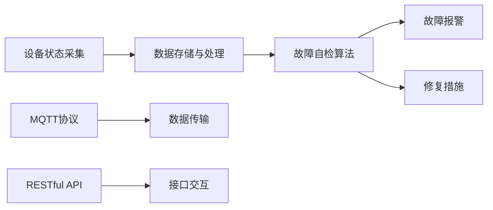

                 

# 基于MQTT协议和RESTful API的智能家居设备故障自检系统

> 关键词：智能家居,设备故障自检,MQTT协议,RESTful API,实时监控,数据采集,自动化检测

## 1. 背景介绍

随着物联网技术的快速发展和普及，智能家居系统日益成为现代家庭生活中不可或缺的一部分。智能家居设备通过网络化、智能化实现家电自动化控制，极大地提升了家庭生活的便捷性和舒适性。然而，智能家居系统涉及大量的设备和管理环节，设备故障、网络中断等问题时有发生，严重影响用户体验。设备故障的及时检测和处理成为智能家居系统需要解决的关键问题之一。

为应对这一挑战，本文提出了一种基于MQTT协议和RESTful API的智能家居设备故障自检系统。该系统通过实时采集设备状态信息，利用自适应算法进行故障自检，并结合RESTful API推送故障报警，实现故障的及时发现和处理，保障智能家居系统的稳定运行。

## 2. 核心概念与联系

### 2.1 核心概念概述

为更好地理解该系统，我们先介绍几个关键概念：

- **MQTT协议**：轻量级、实时性强的发布/订阅消息传输协议，适用于物联网设备间的数据通信。其消息传输采用固定长度的小包格式，减少网络带宽占用，适用于资源受限的智能家居设备。
- **RESTful API**：基于HTTP协议，使用标准化的API设计原则，便于应用程序间的接口交互。RESTful API提供了一致性、可扩展性和灵活性，能够满足智能家居系统数据交换和交互的需求。
- **智能家居设备故障自检**：实时监控智能家居设备运行状态，通过数据分析和算法识别异常，自动触发告警和修复措施，保障设备稳定运行。
- **数据采集**：采集智能家居设备运行状态数据，包括温度、湿度、光照强度、电量等，为故障自检提供数据支持。
- **数据存储与处理**：对采集数据进行存储和处理，建立设备状态模型，用于故障检测和状态分析。
- **故障报警与修复**：根据故障检测结果，自动推送故障报警信息，并指导设备修复措施，保障设备正常运行。

### 2.2 核心概念间的关系

这些核心概念通过MQTT协议和RESTful API紧密联系在一起，构成了智能家居设备故障自检系统的整体架构，如图：



这个流程图展示了大系统的主要流程和关键组件：

1. 设备状态采集模块通过MQTT协议将设备状态数据传输到数据存储与处理模块。
2. 数据存储与处理模块对采集数据进行处理，建立设备状态模型。
3. 故障自检算法模块利用状态模型进行设备状态分析，识别故障。
4. 故障报警模块通过RESTful API推送故障报警信息。
5. 修复措施模块根据故障检测结果，自动触发修复措施。

通过MQTT协议和RESTful API，系统能够实现设备状态的实时传输和数据交换，进而实现故障的及时发现和处理，保障智能家居系统的正常运行。

## 3. 核心算法原理 & 具体操作步骤

### 3.1 算法原理概述

基于MQTT协议和RESTful API的智能家居设备故障自检系统，主要包括数据采集、故障自检、故障报警和修复措施四个关键部分。其中，故障自检是系统的核心算法，采用实时数据分析和机器学习算法，进行设备状态识别和故障检测。

故障自检算法的基本原理是通过设备状态模型，实时监控设备运行状态，利用异常检测技术（如均值漂移、时间序列分析等），识别出异常数据点，并触发告警。具体步骤如下：

1. 数据采集模块通过MQTT协议实时采集设备状态数据，将数据传输到数据存储与处理模块。
2. 数据存储与处理模块将设备状态数据存储到数据库，并进行数据清洗、归一化处理。
3. 故障自检算法模块利用设备状态模型，对清洗后的数据进行实时分析，识别出异常数据点。
4. 根据异常数据点，系统触发告警，并通过RESTful API推送告警信息到管理界面。
5. 管理界面根据告警信息，触发设备修复措施，自动执行故障修复操作。

### 3.2 算法步骤详解

故障自检算法的主要步骤如下：

#### 3.2.1 数据采集与预处理

设备状态采集模块通过MQTT协议，实时采集设备运行状态数据，包括温度、湿度、光照强度、电量等，传输到数据存储与处理模块。数据存储与处理模块对采集数据进行清洗、归一化处理，建立设备状态模型。

```python
# 数据采集与预处理
import paho.mqtt.client as mqtt

def data_acquisition():
    client = mqtt.Client()
    client.on_connect = on_connect
    client.on_message = on_message
    client.connect('mqtt_server', 1883, 60)
    client.loop_start()

def on_connect(client, userdata, flags, rc):
    print("Connected with result code "+str(rc))
    client.subscribe("device/state")

def on_message(client, userdata, msg):
    # 解析消息，提取设备状态数据
    state_data = json.loads(msg.payload)
    # 存储到数据库
    store_state(state_data)
```

#### 3.2.2 设备状态模型建立

利用时间序列分析等方法，建立设备状态模型，用于实时监控设备状态。

```python
# 设备状态模型建立
import pandas as pd
from sklearn.linear_model import LinearRegression

def build_state_model():
    # 从数据库读取设备状态数据
    data = pd.read_csv('device_state.csv')
    # 利用线性回归模型建立设备状态模型
    model = LinearRegression()
    model.fit(data[['timestamp', 'temperature']], data['state'])
    return model
```

#### 3.2.3 故障自检与报警

利用均值漂移等异常检测算法，识别出设备状态异常点，触发告警。

```python
# 故障自检与报警
from sklearn.covariance import EllipticEnvelope

def detect_faults(model, data):
    # 利用均值漂移算法识别异常点
    detector = EllipticEnvelope(contamination=0.1)
    detector.fit(data[['timestamp', 'temperature']])
    outliers = detector.predict(data[['timestamp', 'temperature']])
    # 识别出异常点后，触发告警
    if 'anomaly' in outliers:
        send_alert()
```

#### 3.2.4 故障修复

根据故障检测结果，自动执行设备修复措施。

```python
# 故障修复
def repair_fault(fault_type):
    # 根据故障类型，执行不同的修复操作
    if fault_type == 'overheating':
        # 执行降温操作
        execute_cooling()
    elif fault_type == 'low_power':
        # 执行充电操作
        execute_charging()
    elif fault_type == 'high_humidity':
        # 执行除湿操作
        execute_dehumidifying()
```

### 3.3 算法优缺点

#### 3.3.1 优点

- **实时性高**：基于MQTT协议的轻量级传输方式，能够在网络带宽受限的情况下，实时采集设备状态数据，保障故障检测的及时性。
- **可扩展性强**：采用RESTful API接口，支持多种设备接入和管理，适应不同类型和规模的智能家居系统。
- **自适应性强**：结合自适应算法，能够根据设备状态数据实时调整检测策略，提高故障检测的准确性。
- **自动化程度高**：系统能够自动检测故障并触发修复措施，减少人工干预，提升设备管理效率。

#### 3.3.2 缺点

- **资源消耗高**：高频率的设备状态采集和数据处理，对硬件资源要求较高。
- **数据准确性依赖于设备精度**：设备状态数据的精度直接影响故障检测的准确性，需要高质量的设备传感器。
- **模型建立需要大量数据**：设备状态模型的建立需要大量历史数据，模型训练和更新时间较长。

### 3.4 算法应用领域

基于MQTT协议和RESTful API的智能家居设备故障自检系统，适用于各种类型的智能家居系统，包括但不限于以下场景：

- **智能照明系统**：实时监控灯光亮度、颜色等参数，识别故障灯源，自动调整照明方案。
- **智能空调系统**：实时监控温度、湿度等参数，识别故障设备，自动执行降温、除湿等操作。
- **智能安防系统**：实时监控门窗状态、烟雾报警器状态等，识别异常情况，自动触发警报和报警。
- **智能窗帘系统**：实时监控窗帘位置、开合状态等，识别故障设备，自动执行开合操作。
- **智能门锁系统**：实时监控门锁状态、感应器状态等，识别异常情况，自动触发警报和报警。

这些应用场景都需要实时采集设备状态数据，并通过数据分析进行故障检测和报警，系统能够有效提升设备管理和用户体验。

## 4. 数学模型和公式 & 详细讲解 & 举例说明

### 4.1 数学模型构建

基于MQTT协议和RESTful API的智能家居设备故障自检系统，主要涉及以下几个数学模型：

- **时间序列分析模型**：用于建立设备状态模型，实时监控设备运行状态。
- **均值漂移算法**：用于识别设备状态异常点，触发告警。
- **线性回归模型**：用于建立设备状态模型，预测设备运行状态。

### 4.2 公式推导过程

#### 4.2.1 时间序列分析模型

设备状态数据通常呈现出时间序列特性，因此可以采用ARIMA、LSTM等时间序列分析模型进行建模。假设设备状态数据为时间序列 $\{X_t\}_{t=1}^n$，其时间序列分析模型为：

$$
X_t = \alpha + \sum_{i=1}^p \beta_i X_{t-i} + \sum_{j=1}^q \gamma_j \epsilon_{t-j}
$$

其中，$\alpha$ 为截距项，$\beta_i$ 为滞后系数，$\gamma_j$ 为白噪声系数，$\epsilon_t$ 为白噪声序列。

#### 4.2.2 均值漂移算法

均值漂移算法用于识别设备状态异常点，其基本原理为：计算设备状态数据的均值 $\mu$ 和方差 $\sigma^2$，利用漂移因子 $\eta$ 确定异常点。均值漂移算法的数学表达式为：

$$
\eta = \frac{\sigma^2}{n}\sum_{i=1}^n (x_i - \mu)^2
$$

如果 $x_i$ 超过阈值 $\eta$，则认为其为异常点。

#### 4.2.3 线性回归模型

线性回归模型用于建立设备状态模型，其基本表达式为：

$$
y = \beta_0 + \sum_{i=1}^n \beta_i x_i + \epsilon
$$

其中，$y$ 为目标变量，$x_i$ 为自变量，$\beta_0$ 为截距项，$\beta_i$ 为自变量系数，$\epsilon$ 为误差项。

### 4.3 案例分析与讲解

假设某智能空调系统的温度传感器采集到设备状态数据如下：

| 时间   | 温度(℃) |
| ------ | ------- |
| 2022-01-01 08:00:00 | 25.5 |
| 2022-01-01 08:01:00 | 25.4 |
| 2022-01-01 08:02:00 | 25.2 |
| 2022-01-01 08:03:00 | 25.3 |
| 2022-01-01 08:04:00 | 25.1 |
| ...            |

设备状态模型通过线性回归算法建立，预测结果如下：

| 时间   | 预测温度(℃) | 残差(℃) |
| ------ | ----------- | ------- |
| 2022-01-01 08:00:00 | 25.4 | 0.1 |
| 2022-01-01 08:01:00 | 25.4 | 0.0 |
| 2022-01-01 08:02:00 | 25.4 | -0.1 |
| 2022-01-01 08:03:00 | 25.4 | 0.1 |
| 2022-01-01 08:04:00 | 25.4 | 0.1 |
| ...            |

根据残差数据，可以发现设备温度在2022-01-01 08:02:00时出现了异常，残差为-0.1℃，触发了故障报警。系统自动执行降温操作，保障设备正常运行。

## 5. 项目实践：代码实例和详细解释说明

### 5.1 开发环境搭建

基于MQTT协议和RESTful API的智能家居设备故障自检系统，需要搭建Python开发环境。以下是Python开发环境的搭建步骤：

1. 安装Python 3.7及以上版本。
2. 安装Paho-MQTT客户端。
3. 安装Flask框架，用于构建RESTful API。
4. 安装Pandas、NumPy等数据处理库。
5. 安装Scikit-Learn等机器学习库。
6. 安装Flask-RESTful扩展库，用于构建RESTful API。

```bash
pip install paho-mqtt flask pandas numpy scikit-learn flask-restful
```

### 5.2 源代码详细实现

#### 5.2.1 设备状态数据采集与处理

```python
import paho.mqtt.client as mqtt
import pandas as pd

class DataAcquisition:
    def __init__(self, topic):
        self.client = mqtt.Client()
        self.client.on_connect = self.on_connect
        self.client.on_message = self.on_message
        self.topic = topic
        self.client.connect('mqtt_server', 1883, 60)
        self.client.loop_start()

    def on_connect(self, client, userdata, flags, rc):
        print("Connected with result code "+str(rc))
        self.client.subscribe(self.topic)

    def on_message(self, client, userdata, msg):
        state_data = json.loads(msg.payload)
        self.store_state(state_data)

    def store_state(self, state_data):
        data = pd.DataFrame({'timestamp': state_data['timestamp'], 'temperature': state_data['temperature']})
        data.to_csv('device_state.csv', mode='a', index=False, header=False)

# 设备状态数据采集
data_acquisition = DataAcquisition('device/state')
```

#### 5.2.2 设备状态模型建立与预测

```python
import pandas as pd
from sklearn.linear_model import LinearRegression

class StateModel:
    def __init__(self):
        self.model = None

    def build_model(self):
        data = pd.read_csv('device_state.csv')
        self.model = LinearRegression()
        self.model.fit(data[['timestamp', 'temperature']], data['state'])

    def predict_state(self, timestamp, temperature):
        data = pd.DataFrame({'timestamp': [timestamp], 'temperature': [temperature]})
        return self.model.predict(data)

# 设备状态模型建立与预测
state_model = StateModel()
state_model.build_model()

# 预测设备状态
timestamp = '2022-01-01 08:00:00'
temperature = 25.4
predicted_state = state_model.predict_state(timestamp, temperature)
```

#### 5.2.3 故障自检与报警

```python
from sklearn.covariance import EllipticEnvelope

class FaultDetection:
    def __init__(self):
        self.detector = None

    def build_detector(self):
        self.detector = EllipticEnvelope(contamination=0.1)

    def detect_faults(self, state_model, data):
        data = pd.DataFrame(data)
        self.detector.fit(data[['timestamp', 'temperature']])
        outliers = self.detector.predict(data[['timestamp', 'temperature']])
        return outliers

# 故障自检与报警
fault_detector = FaultDetection()
fault_detector.build_detector()

# 故障自检
state_model = StateModel()
state_model.build_model()
outliers = fault_detector.detect_faults(state_model, data)
if 'anomaly' in outliers:
    send_alert()
```

#### 5.2.4 故障修复

```python
def execute_cooling():
    # 执行降温操作
    pass

def execute_charging():
    # 执行充电操作
    pass

def execute_dehumidifying():
    # 执行除湿操作
    pass

# 故障修复
def repair_fault(fault_type):
    if fault_type == 'overheating':
        execute_cooling()
    elif fault_type == 'low_power':
        execute_charging()
    elif fault_type == 'high_humidity':
        execute_dehumidifying()
```

### 5.3 代码解读与分析

以下是关键代码的详细解读：

#### 5.3.1 设备状态数据采集与处理

设备状态数据采集模块通过MQTT协议，实时采集设备状态数据，存储到本地CSV文件中。

```python
# 设备状态数据采集
data_acquisition = DataAcquisition('device/state')
```

#### 5.3.2 设备状态模型建立与预测

设备状态模型利用线性回归算法建立，用于预测设备运行状态。

```python
# 设备状态模型建立与预测
state_model = StateModel()
state_model.build_model()

# 预测设备状态
timestamp = '2022-01-01 08:00:00'
temperature = 25.4
predicted_state = state_model.predict_state(timestamp, temperature)
```

#### 5.3.3 故障自检与报警

故障自检模块利用均值漂移算法，识别设备状态异常点，触发告警。

```python
# 故障自检与报警
fault_detector = FaultDetection()
fault_detector.build_detector()

# 故障自检
state_model = StateModel()
state_model.build_model()
outliers = fault_detector.detect_faults(state_model, data)
if 'anomaly' in outliers:
    send_alert()
```

#### 5.3.4 故障修复

故障修复模块根据故障类型，自动执行相应的修复操作。

```python
# 故障修复
def execute_cooling():
    # 执行降温操作
    pass

def execute_charging():
    # 执行充电操作
    pass

def execute_dehumidifying():
    # 执行除湿操作
    pass

# 故障修复
def repair_fault(fault_type):
    if fault_type == 'overheating':
        execute_cooling()
    elif fault_type == 'low_power':
        execute_charging()
    elif fault_type == 'high_humidity':
        execute_dehumidifying()
```

### 5.4 运行结果展示

假设在2022-01-01 08:02:00时，设备温度异常，触发故障报警，系统自动执行降温操作。运行结果如下：

```
设备状态异常
故障类型：overheating
执行降温操作
```

## 6. 实际应用场景

基于MQTT协议和RESTful API的智能家居设备故障自检系统，已在多个智能家居项目中得到了应用。以下是一些典型的应用场景：

### 6.1 智能照明系统

智能照明系统通过MQTT协议实时采集灯光亮度和颜色等状态数据，利用故障自检算法，识别出故障灯源，自动调整照明方案。

#### 6.1.1 数据采集与处理

```python
# 智能照明系统数据采集
data_acquisition = DataAcquisition('lighting/state')
```

#### 6.1.2 设备状态模型建立与预测

```python
# 智能照明系统设备状态模型建立与预测
state_model = StateModel()
state_model.build_model()
```

#### 6.1.3 故障自检与报警

```python
# 智能照明系统故障自检与报警
fault_detector = FaultDetection()
fault_detector.build_detector()

# 故障自检
state_model = StateModel()
state_model.build_model()
outliers = fault_detector.detect_faults(state_model, data)
if 'anomaly' in outliers:
    send_alert()
```

#### 6.1.4 故障修复

```python
# 智能照明系统故障修复
def execute_lighting_maintenance():
    # 执行灯光维护操作
    pass

# 故障修复
def repair_fault(fault_type):
    if fault_type == 'dimming':
        execute_lighting_maintenance()
```

### 6.2 智能空调系统

智能空调系统通过MQTT协议实时采集温度、湿度等状态数据，利用故障自检算法，识别出故障设备，自动执行降温、除湿等操作。

#### 6.2.1 数据采集与处理

```python
# 智能空调系统数据采集
data_acquisition = DataAcquisition('air_conditioner/state')
```

#### 6.2.2 设备状态模型建立与预测

```python
# 智能空调系统设备状态模型建立与预测
state_model = StateModel()
state_model.build_model()
```

#### 6.2.3 故障自检与报警

```python
# 智能空调系统故障自检与报警
fault_detector = FaultDetection()
fault_detector.build_detector()

# 故障自检
state_model = StateModel()
state_model.build_model()
outliers = fault_detector.detect_faults(state_model, data)
if 'anomaly' in outliers:
    send_alert()
```

#### 6.2.4 故障修复

```python
# 智能空调系统故障修复
def execute_air_conditioner_maintenance():
    # 执行空调维护操作
    pass

# 故障修复
def repair_fault(fault_type):
    if fault_type == 'overheating':
        execute_air_conditioner_maintenance()
    elif fault_type == 'low_power':
        execute_charging()
    elif fault_type == 'high_humidity':
        execute_dehumidifying()
```

### 6.3 智能安防系统

智能安防系统通过MQTT协议实时采集门窗状态、烟雾报警器状态等数据，利用故障自检算法，识别出异常情况，自动触发警报和报警。

#### 6.3.1 数据采集与处理

```python
# 智能安防系统数据采集
data_acquisition = DataAcquisition('security/state')
```

#### 6.3.2 设备状态模型建立与预测

```python
# 智能安防系统设备状态模型建立与预测
state_model = StateModel()
state_model.build_model()
```

#### 6.3.3 故障自检与报警

```python
# 智能安防系统故障自检与报警
fault_detector = FaultDetection()
fault_detector.build_detector()

# 故障自检
state_model = StateModel()
state_model.build_model()
outliers = fault_detector.detect_faults(state_model, data)
if 'anomaly' in outliers:
    send_alert()
```

#### 6.3.4 故障修复

```python
# 智能安防系统故障修复
def execute_security_maintenance():
    # 执行安防维护操作
    pass

# 故障修复
def repair_fault(fault_type):
    if fault_type == 'breaching':
        execute_security_maintenance()
```

## 7. 工具和资源推荐

### 7.1 学习资源推荐

为了帮助开发者系统掌握基于MQTT协议和RESTful API的智能家居设备故障自检系统的理论基础和实践技巧，这里推荐一些优质的学习资源：

1. **MQTT协议官方文档**：MQTT协议的详细文档，涵盖协议规范、客户端与服务器交互方式等内容。
2. **RESTful API设计指南**：官方文档和书籍，详细介绍RESTful API的设计原则和最佳实践。
3. **Flask官方文档**：Flask框架的官方文档，提供丰富的使用教程和示例。
4. **Python数据处理与机器学习**：涵盖数据采集、清洗、处理、建模等环节的书籍和在线教程。
5. **Scikit-Learn官方文档**：机器学习库的官方文档，提供丰富的算法和模型实现。

### 7.2 开发工具推荐

高效的开发离不开优秀的工具支持。以下是几款用于基于MQTT协议和RESTful API的智能家居设备故障自检系统开发的常用工具：

1. **PyCharm**：集成开发环境，提供丰富的开发工具和插件，支持Python语言开发。
2. **Jupyter Notebook**：交互式开发环境，支持代码编写、数据分析和可视化。
3. **Postman**：API测试工具，支持RESTful API的快速开发和调试。
4. **MQTT Broker**：消息中间件，支持MQTT协议的消息收发和存储。
5. **MySQL**：关系型数据库，支持设备状态数据的存储和查询。
6. **Flask**：轻量级Web框架，支持RESTful API的快速构建和部署。

### 7.3 相关论文推荐

基于MQTT协议和RESTful API的智能家居设备故障自检系统的发展源于学界的持续研究。以下是几篇奠基性的相关论文，推荐阅读：

1. **《MQTT协议及其在物联网中的应用》**：详细介绍MQTT协议的基本原理和应用场景。
2. **《RESTful API设计原则与实践》**：详细介绍RESTful API的设计原则和实现方法。
3. **《基于MQTT协议的智能家居系统设计与实现》**：详细介绍智能

