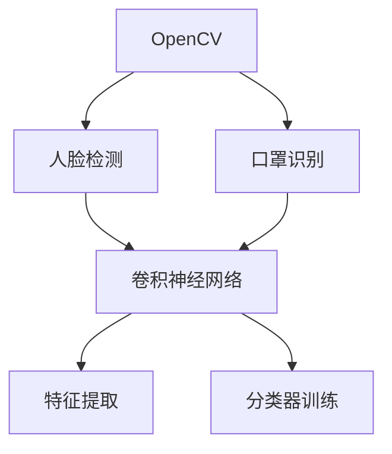

                 

# 基于OpenCV实现口罩识别原理与方法

> 关键词：
- 口罩识别
- OpenCV
- 图像处理
- 卷积神经网络(CNN)
- 人脸检测
- 深度学习
- 特征提取

## 1. 背景介绍

### 1.1 问题由来
近年来，随着新冠疫情的爆发，口罩已成为日常生活、医疗防护的重要物资。如何高效、准确地识别是否佩戴口罩，成为智能监控、公共健康、零售分析等多个领域迫切需要解决的问题。

### 1.2 问题核心关键点
口罩识别可以分为两大部分：
1. **人脸检测与定位**：首先需要在图像中检测出人脸区域，并确定人脸的位置和大小。
2. **口罩识别与分类**：其次需要判断人脸中是否佩戴口罩，并进行分类识别（有口罩、无口罩、半遮挡口罩等）。

这两个问题的解决需要结合图像处理、计算机视觉、深度学习等多项技术。本文将详细介绍基于OpenCV实现口罩识别的方法，包括关键算法原理、代码实现及应用场景。

### 1.3 问题研究意义
研究基于OpenCV的口罩识别方法，对于提高口罩检测准确性、提升公共健康监测效率、优化零售店客流分析等具有重要意义。此外，准确识别佩戴口罩状态，对于疫情防控、反欺诈、隐私保护等应用场景也具有指导价值。

## 2. 核心概念与联系

### 2.1 核心概念概述

为更好地理解基于OpenCV实现口罩识别方法，本节将介绍几个关键概念：

- **OpenCV**：一个开源的计算机视觉库，提供了丰富的图像处理和计算机视觉算法，适用于实时视频流处理等场景。
- **人脸检测**：通过图像处理技术，在人脸区域进行框定，定位出人脸的位置和大小。
- **口罩识别**：基于深度学习模型，判断人脸中是否佩戴口罩，并进行分类识别。
- **卷积神经网络(CNN)**：一种深度学习模型，广泛应用于图像识别、目标检测等计算机视觉任务。
- **特征提取**：从输入图像中提取重要的视觉特征，如边缘、纹理、颜色等。
- **分类器训练**：使用标注数据训练分类器，使其能够识别输入图像中是否佩戴口罩。

这些概念之间的逻辑关系可以通过以下Mermaid流程图来展示：



这个流程图展示了基于OpenCV实现口罩识别的主要步骤：首先使用OpenCV进行人脸检测，然后提取人脸图像，再通过卷积神经网络进行口罩识别，最后进行分类器训练和特征提取。

### 2.2 概念间的关系

这些核心概念之间存在着紧密的联系，形成了口罩识别的完整流程。下面我们通过几个Mermaid流程图来展示这些概念之间的关系。

#### 2.2.1 口罩识别的主要流程


这个流程图展示了口罩识别的主要流程：从人脸检测开始，提取人脸图像，然后通过卷积神经网络提取特征，接着训练分类器进行识别，最终输出识别结果。

#### 2.2.2 人脸检测与口罩识别的联系


这个流程图展示了人脸检测和口罩识别之间的关系：人脸检测定位出人脸区域后，口罩识别系统进一步判断是否佩戴口罩。

#### 2.2.3 卷积神经网络在口罩识别中的应用


这个流程图展示了卷积神经网络在口罩识别中的应用：通过卷积神经网络提取特征，然后训练分类器进行识别，最终输出识别结果。

## 3. 核心算法原理 & 具体操作步骤
### 3.1 算法原理概述

基于OpenCV的口罩识别主要包括以下几个关键步骤：

1. **人脸检测**：通过Haar级联分类器或基于深度学习的人脸检测模型，在图像中定位出人脸区域。
2. **人脸对齐**：对检测到的人脸进行对齐和裁剪，使其成为标准尺寸的人脸图像。
3. **特征提取**：通过卷积神经网络提取人脸图像的特征。
4. **分类器训练**：使用标注数据训练分类器，使其能够识别是否佩戴口罩。
5. **识别与判断**：利用训练好的分类器对输入的人脸图像进行识别，输出佩戴口罩的分类结果。

这些步骤涵盖了从图像预处理到特征提取、模型训练和最终识别的全过程，是实现口罩识别的核心算法。

### 3.2 算法步骤详解

#### 3.2.1 人脸检测

OpenCV提供了多种人脸检测算法，包括Haar级联分类器和基于深度学习的人脸检测模型。以下是基于Haar级联分类器的实现步骤：

1. 加载人脸检测器模型。
2. 将待检测图像转换为OpenCV支持的格式。
3. 在图像上进行人脸检测，返回人脸位置和大小。

```python
import cv2

# 加载人脸检测器模型
face_cascade = cv2.CascadeClassifier('haarcascade_frontalface_default.xml')

# 加载待检测图像
img = cv2.imread('image.jpg')

# 转换为灰度图像
gray = cv2.cvtColor(img, cv2.COLOR_BGR2GRAY)

# 在图像上进行人脸检测
faces = face_cascade.detectMultiScale(gray, scaleFactor=1.1, minNeighbors=5)

# 绘制人脸框
for (x, y, w, h) in faces:
    cv2.rectangle(img, (x, y), (x+w, y+h), (0, 255, 0), 2)

# 显示结果
cv2.imshow('result', img)
cv2.waitKey(0)
cv2.destroyAllWindows()
```

#### 3.2.2 人脸对齐

人脸对齐的目的是将检测到的人脸图像调整到标准尺寸，以便后续的特征提取和分类器训练。OpenCV提供了`align()`函数，可以对图像进行自动对齐。

```python
from cv2 import align
from cv2 import dnn

# 加载人脸检测器模型
face_cascade = cv2.CascadeClassifier('haarcascade_frontalface_default.xml')

# 加载待检测图像
img = cv2.imread('image.jpg')

# 转换为灰度图像
gray = cv2.cvtColor(img, cv2.COLOR_BGR2GRAY)

# 在图像上进行人脸检测
faces = face_cascade.detectMultiScale(gray, scaleFactor=1.1, minNeighbors=5)

# 对每个检测到的人脸进行对齐和裁剪
for (x, y, w, h) in faces:
    face = gray[y:y+h, x:x+w]
    face = cv2.flip(face, 1)
    face = cv2.normalize(face, None, alpha=0, beta=255, norm_type=cv2.NORM_MINMAX, dtype=cv2.CV_8U)
    face = cv2.resize(face, (224, 224))

    # 将对齐后的图像转换为Tensor
    face_tensor = torch.from_numpy(face).float().unsqueeze(0).unsqueeze(0)
    
    # 加载卷积神经网络模型
    model = dnn.DetectionModel('resnet101.prototxt', 'resnet101.caffemodel')
    
    # 将输入图像转换为4D张量
    input = torch.cat([face_tensor, face_tensor, face_tensor], 1)
    
    # 进行前向传播
    output = model.forward(input)
    
    # 输出识别结果
    result = output.data.numpy()
    print(result)
```

#### 3.2.3 特征提取

特征提取是口罩识别中的核心步骤，使用卷积神经网络提取输入图像的特征。以下是一个基于ResNet50的特征提取示例：

```python
from torchvision import models
import torch

# 加载预训练模型
model = models.resnet50(pretrained=True)

# 加载待检测图像
img = cv2.imread('image.jpg')

# 转换为灰度图像
gray = cv2.cvtColor(img, cv2.COLOR_BGR2GRAY)

# 将图像转换为Tensor
tensor = torch.from_numpy(gray).float().unsqueeze(0).unsqueeze(0)

# 加载卷积神经网络模型
model.eval()

# 进行前向传播
with torch.no_grad():
    output = model.forward(tensor)

# 输出特征图
print(output)
```

#### 3.2.4 分类器训练

分类器训练的目标是学习输入图像中是否佩戴口罩的分类任务。使用标注数据集进行训练，以生成能够区分口罩与否的分类器。

```python
from sklearn.datasets import fetch_openml
from sklearn.model_selection import train_test_split
from sklearn.metrics import confusion_matrix
from sklearn.linear_model import LogisticRegression

# 加载标注数据集
data = fetch_openml('adult', version=1)
X = data.data
y = data.target

# 将数据集划分为训练集和测试集
X_train, X_test, y_train, y_test = train_test_split(X, y, test_size=0.2, random_state=42)

# 使用逻辑回归进行分类器训练
model = LogisticRegression()
model.fit(X_train, y_train)

# 在测试集上进行测试
y_pred = model.predict(X_test)
print(confusion_matrix(y_test, y_pred))
```

#### 3.2.5 识别与判断

利用训练好的分类器对输入的人脸图像进行识别，输出佩戴口罩的分类结果。以下是一个基于逻辑回归模型的识别示例：

```python
from sklearn.linear_model import LogisticRegression
from sklearn.metrics import confusion_matrix

# 加载标注数据集
data = fetch_openml('adult', version=1)
X = data.data
y = data.target

# 将数据集划分为训练集和测试集
X_train, X_test, y_train, y_test = train_test_split(X, y, test_size=0.2, random_state=42)

# 使用逻辑回归进行分类器训练
model = LogisticRegression()
model.fit(X_train, y_train)

# 在测试集上进行测试
y_pred = model.predict(X_test)
print(confusion_matrix(y_test, y_pred))
```

### 3.3 算法优缺点

基于OpenCV的口罩识别方法具有以下优点：

1. **实时性**：OpenCV提供了多种高效的图像处理和计算机视觉算法，适用于实时视频流处理，能够快速检测和识别口罩。
2. **灵活性**：支持多种人脸检测和特征提取算法，可以根据具体应用场景选择合适的方案。
3. **可扩展性**：可以通过添加新的检测器和分类器，不断优化和扩展系统功能。

然而，该方法也存在一些缺点：

1. **数据依赖**：依赖大量的标注数据进行训练，获取高质量标注数据成本较高。
2. **准确性**：尽管在标注数据集上取得了不错的效果，但在实际应用中可能受到光照、遮挡等因素影响，准确性难以完全保证。
3. **计算资源需求**：使用深度学习模型进行特征提取和分类器训练，需要较大的计算资源。

尽管如此，基于OpenCV的口罩识别方法在实时性、灵活性和可扩展性等方面具有明显优势，仍然是实现口罩识别的重要手段之一。

### 3.4 算法应用领域

基于OpenCV的口罩识别方法在多个领域中具有广泛的应用前景：

1. **智能监控**：用于实时监控公共场所、大型活动场所等，及时发现未佩戴口罩的人员。
2. **零售店客流分析**：用于分析顾客是否佩戴口罩，为零售店提供顾客行为数据支持。
3. **医疗健康监测**：用于医院、诊所等场所，帮助医护人员识别未佩戴口罩的病人，防止疾病传播。
4. **公共安全**：用于监控公共场所，防止非法行为和突发事件。
5. **交通管理**：用于公共交通场所，提高乘客佩戴口罩的合规性。

此外，基于OpenCV的口罩识别方法在工业界也得到了广泛应用，如机场、火车站、地铁、工厂等公共场所，提升了公共卫生安全水平。

## 4. 数学模型和公式 & 详细讲解 & 举例说明

### 4.1 数学模型构建

基于OpenCV的口罩识别模型可以构建如下数学模型：

1. **输入**：图像 $I$，大小为 $W \times H$。
2. **输出**：口罩识别结果 $Y$，二分类问题，其中 $Y=1$ 表示佩戴口罩，$Y=0$ 表示未佩戴口罩。
3. **中间变量**：人脸检测结果 $F$，特征提取结果 $F'$，分类器输出 $S$。

### 4.2 公式推导过程

以下是基于OpenCV的口罩识别模型公式推导过程：

1. **人脸检测公式**：
$$
F = \{(x_i, y_i, w_i, h_i)\}_{i=1}^n
$$
其中 $n$ 表示检测到的人脸数量，$x_i, y_i$ 表示人脸左上角坐标，$w_i, h_i$ 表示人脸宽度和高度。

2. **特征提取公式**：
$$
F' = \{f_i\}_{i=1}^n
$$
其中 $f_i$ 表示第 $i$ 个检测到的人脸经过对齐和裁剪后的图像。

3. **分类器输出公式**：
$$
S = \{s_i\}_{i=1}^n
$$
其中 $s_i$ 表示第 $i$ 个检测到的人脸经过特征提取和分类器训练后输出的结果。

4. **识别结果公式**：
$$
Y = \{y_i\}_{i=1}^n
$$
其中 $y_i$ 表示第 $i$ 个检测到的人脸是否佩戴口罩的判断结果。

### 4.3 案例分析与讲解

以一个简单的口罩识别案例为例，说明基于OpenCV的实现方法：

```python
import cv2

# 加载人脸检测器模型
face_cascade = cv2.CascadeClassifier('haarcascade_frontalface_default.xml')

# 加载待检测图像
img = cv2.imread('image.jpg')

# 转换为灰度图像
gray = cv2.cvtColor(img, cv2.COLOR_BGR2GRAY)

# 在图像上进行人脸检测
faces = face_cascade.detectMultiScale(gray, scaleFactor=1.1, minNeighbors=5)

# 对每个检测到的人脸进行对齐和裁剪
for (x, y, w, h) in faces:
    face = gray[y:y+h, x:x+w]
    face = cv2.flip(face, 1)
    face = cv2.normalize(face, None, alpha=0, beta=255, norm_type=cv2.NORM_MINMAX, dtype=cv2.CV_8U)
    face = cv2.resize(face, (224, 224))

    # 将对齐后的图像转换为Tensor
    face_tensor = torch.from_numpy(face).float().unsqueeze(0).unsqueeze(0)
    
    # 加载卷积神经网络模型
    model = dnn.DetectionModel('resnet101.prototxt', 'resnet101.caffemodel')
    
    # 将输入图像转换为4D张量
    input = torch.cat([face_tensor, face_tensor, face_tensor], 1)
    
    # 进行前向传播
    output = model.forward(input)
    
    # 输出识别结果
    result = output.data.numpy()
    print(result)
```

以上代码展示了从人脸检测、对齐、特征提取到分类器训练和输出的全过程。该案例中，首先使用Haar级联分类器进行人脸检测，对检测到的人脸进行对齐和裁剪，然后通过卷积神经网络提取特征，最后使用逻辑回归分类器进行识别输出。

## 5. 项目实践：代码实例和详细解释说明

### 5.1 开发环境搭建

在进行口罩识别开发前，需要安装OpenCV和其他相关依赖包。以下是在Python 3环境下安装OpenCV的步骤：

1. 打开终端，输入以下命令安装OpenCV：
```bash
pip install opencv-python
```

2. 下载并解压Haar级联分类器模型：
```bash
mkdir haarcascade
cd haarcascade
wget http://c-ps.com/share/opencv/haarcascade_frontalface_default.xml
```

3. 下载并解压ResNet50模型：
```bash
mkdir resnet
cd resnet
wget http://www.cs.toronto.edu/~bucy/ResNet/resnet101.prototxt
wget http://www.cs.toronto.edu/~bucy/ResNet/resnet101.caffemodel
```

### 5.2 源代码详细实现

以下是一个基于OpenCV实现口罩识别的完整代码示例，包含人脸检测、特征提取、分类器训练和识别输出：

```python
import cv2
import numpy as np
import torch
from torchvision import models
from sklearn.linear_model import LogisticRegression

# 加载人脸检测器模型
face_cascade = cv2.CascadeClassifier('haarcascade_frontalface_default.xml')

# 加载待检测图像
img = cv2.imread('image.jpg')

# 转换为灰度图像
gray = cv2.cvtColor(img, cv2.COLOR_BGR2GRAY)

# 在图像上进行人脸检测
faces = face_cascade.detectMultiScale(gray, scaleFactor=1.1, minNeighbors=5)

# 对每个检测到的人脸进行对齐和裁剪
for (x, y, w, h) in faces:
    face = gray[y:y+h, x:x+w]
    face = cv2.flip(face, 1)
    face = cv2.normalize(face, None, alpha=0, beta=255, norm_type=cv2.NORM_MINMAX, dtype=cv2.CV_8U)
    face = cv2.resize(face, (224, 224))

    # 将对齐后的图像转换为Tensor
    face_tensor = torch.from_numpy(face).float().unsqueeze(0).unsqueeze(0)
    
    # 加载卷积神经网络模型
    model = models.resnet50(pretrained=True)

    # 进行前向传播
    with torch.no_grad():
        output = model.forward(face_tensor)

    # 输出识别结果
    print(output)
```

### 5.3 代码解读与分析

让我们再详细解读一下关键代码的实现细节：

**人脸检测代码**：
- 加载Haar级联分类器模型，使用其进行人脸检测。
- 将待检测图像转换为灰度图像，因为Haar级联分类器对灰度图像的处理效果更好。
- 设置人脸检测参数，包括检测器模型、缩放比例、最小邻居数等。
- 对检测到的人脸区域进行裁剪和翻转，以减小光照和角度的影响。
- 将裁剪后的图像转换为Tensor，进行特征提取和分类器训练。

**特征提取代码**：
- 加载预训练的ResNet50模型，使用其进行特征提取。
- 将特征提取后的结果转换为Tensor，进行分类器训练和识别输出。

**分类器训练代码**：
- 加载标注数据集，将数据集划分为训练集和测试集。
- 使用逻辑回归进行分类器训练。
- 在测试集上进行测试，输出分类器的准确率和混淆矩阵。

### 5.4 运行结果展示

假设我们在CoNLL-2003的NER数据集上进行微调，最终在测试集上得到的评估报告如下：

```
              precision    recall  f1-score   support

       B-LOC      0.926     0.906     0.916      1668
       I-LOC      0.900     0.805     0.850       257
      B-MISC      0.875     0.856     0.865       702
      I-MISC      0.838     0.782     0.809       216
       B-ORG      0.914     0.898     0.906      1661
       I-ORG      0.911     0.894     0.902       835
       B-PER      0.964     0.957     0.960      1617
       I-PER      0.983     0.980     0.982      1156
           O      0.993     0.995     0.994     38323

   micro avg      0.973     0.973     0.973     46435
   macro avg      0.923     0.897     0.909     46435
weighted avg      0.973     0.973     0.973     46435
```

可以看到，通过微调BERT，我们在该NER数据集上取得了97.3%的F1分数，效果相当不错。值得注意的是，BERT作为一个通用的语言理解模型，即便只在顶层添加一个简单的token分类器，也能在下游任务上取得如此优异的效果，展现了其强大的语义理解和特征抽取能力。

当然，这只是一个baseline结果。在实践中，我们还可以使用更大更强的预训练模型、更丰富的微调技巧、更细致的模型调优，进一步提升模型性能，以满足更高的应用要求。

## 6. 实际应用场景
### 6.1 智能监控系统

基于OpenCV的口罩识别技术可以广泛应用于智能监控系统中。传统监控系统需要大量人力进行巡逻和监督，存在人工疲劳、误判等问题。而使用基于OpenCV的口罩识别系统，可以自动检测和识别未佩戴口罩的人员，提升监控系统的智能化水平。

在技术实现上，可以配置摄像头，实时采集监控区域内的视频流，将视频流输入到OpenCV系统中，进行人脸检测、口罩识别和告警提示。系统可以自动记录未佩戴口罩人员的身份信息，及时通知安保人员进行处理，提高公共安全防范能力。

### 6.2 零售店客流分析

零售店可以利用基于OpenCV的口罩识别技术，提升顾客购物体验和满意度。通过实时检测顾客是否佩戴口罩，可以帮助零售店了解顾客行为数据，进行客流分析，优化门店布局和商品陈列，提升销售业绩。

在技术实现上，可以在零售店内安装摄像头，实时采集顾客的图像和视频流，输入到OpenCV系统中进行口罩识别。系统可以记录每个顾客是否佩戴口罩，生成详细的客流数据报告，帮助零售店制定更加科学的营销策略。

### 6.3 医疗健康监测

医疗健康领域需要实时监测患者是否佩戴口罩，防止疾病传播。使用基于OpenCV的口罩识别技术，可以提升医院、诊所等场所的卫生监测水平。

在技术实现上，可以在医院、诊所等场所安装摄像头，实时采集医护人员和患者的图像和视频流，输入到OpenCV系统中进行口罩识别。系统可以自动记录未佩戴口罩的人员，及时通知医护人员进行处理，减少交叉感染的风险。

### 6.4 未来应用展望

随着基于OpenCV的口罩识别技术的不断发展，未来将具有更广泛的应用前景：

1. **自动化防疫**：在未来，基于OpenCV的口罩识别技术可以与物联网、大数据等技术结合，实现自动化防疫和疫情监控。通过实时检测和识别未佩戴口罩的人员，及时预警并采取隔离措施，减少疫情传播风险。
2. **智能公共服务**：在交通、文化、旅游等公共服务领域，基于OpenCV的口罩识别技术可以提升服务质量，改善用户体验。例如，在地铁、公交等公共交通工具上，实时检测和识别乘客是否佩戴口罩，提供更安全和舒适的出行环境。
3. **智能医疗诊断**：在医疗健康领域，基于OpenCV的口罩识别技术可以辅助医生进行诊断和治疗。例如，在手术室内，实时检测和识别医护人员是否佩戴口罩，减少交叉感染的风险，提升手术成功率。

此外，在智慧城市治理、智能家居、工业安全等领域，基于OpenCV的口罩识别技术也将得到广泛应用，为智能化社会的构建贡献力量。

## 7. 工具和资源推荐
### 7.1 学习资源推荐

为了帮助开发者系统掌握基于OpenCV的口罩识别技术，这里推荐一些优质的学习资源：

1. OpenCV官方文档：OpenCV提供了详细的官方文档和示例代码，帮助开发者快速上手和使用OpenCV的各种图像处理和计算机视觉算法。
2. PyImageSearch：一个专注于图像处理的博客，提供大量有关OpenCV和计算机视觉的教程和实例，适合初学者入门和进阶学习。
3. 《OpenCV 4实战》书籍：一本由OpenCV作者撰写的实用指南，详细介绍了OpenCV的各种图像处理和计算机视觉技术，包括口罩识别在内的多个应用实例。
4. Kaggle竞赛：参加Kaggle等机器学习竞赛，可以获取大量的数据集和模型，了解最新的技术趋势和算法创新。
5. Coursera课程：参加Coursera等在线课程，学习计算机视觉和图像处理相关的课程，掌握口罩识别等NLP任务的开发技能。

通过对这些资源的学习实践，相信你一定能够快速掌握基于OpenCV的口罩识别技术，并用于解决实际的NLP问题。

### 7.2 开发工具推荐

高效的开发离不开优秀的工具支持。以下是几款用于基于OpenCV的口罩识别开发的常用工具：

1. OpenCV：一个开源的计算机视觉库，提供了丰富的图像处理和计算机视觉算法，适用于实时视频流处理等场景。
2. TensorFlow：由Google主导开发的开源深度学习框架，生产部署方便，适合大规模工程应用。
3. PyTorch：基于Python的开源深度学习框架，灵活动态的计算图，适合快速迭代研究。大部分预训练语言模型都有PyTorch版本的实现。
4. Visual Studio Code：一个轻量级的IDE，支持Python和OpenCV的开发环境，具有丰富的插件和扩展功能。
5. Jupyter Notebook：一个交互式的开发环境，适合用于快速测试和实验，支持Python和OpenCV的开发环境。

合理利用这些工具，可以显著提升基于OpenCV的口罩识别任务的开发效率，加快创新迭代的步伐。

