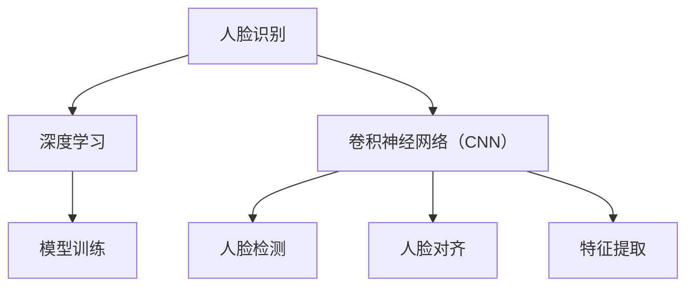

                 

## 1. 背景介绍

随着人工智能技术的快速发展，计算机视觉领域的应用越来越广泛。人脸识别作为其中最热门的一项技术，已经在安全监控、身份验证、人脸解锁等方面得到了广泛应用。TensorFlow作为目前最流行的深度学习框架之一，提供了丰富的人脸识别模型和工具，可以方便地进行人脸识别算法的开发和部署。本文将详细介绍基于TensorFlow的人脸识别技术，包括核心概念、算法原理、实现步骤、数学模型、项目实践、应用场景、资源推荐、未来展望等。

## 2. 核心概念与联系

### 2.1 核心概念概述

在基于TensorFlow的人脸识别中，涉及到的核心概念包括：

- **人脸识别**：指通过计算机视觉技术，将获取的面部图像与数据库中的模板进行比对，判断是否为同一个人，从而实现身份识别。
- **深度学习**：一种基于神经网络的学习方法，通过训练大量数据，提取特征，并实现分类、识别等任务。
- **卷积神经网络（CNN）**：一种专门用于图像处理任务的深度学习模型，通过卷积层、池化层、全连接层等结构，提取图像特征。
- **人脸检测**：在人脸识别前，需要先对图像进行人脸定位，确定人脸的准确位置，以便进行后续的识别。
- **人脸对齐**：由于人脸采集时可能存在姿态、表情等变化，因此需要对人脸进行对齐，以保证识别的准确性。
- **特征提取**：通过卷积神经网络等模型，将人脸图像转换为高维特征向量，用于后续的分类或识别任务。
- **模型训练**：通过大量的标注数据，训练深度学习模型，使其能够实现准确的人脸识别。

这些概念构成了基于TensorFlow的人脸识别技术的基础，相互之间有紧密的联系。人脸检测、对齐和特征提取是人脸识别的关键步骤，而深度学习模型则是人脸识别的核心算法。

### 2.2 概念间的关系

以下是这些核心概念之间的逻辑关系，通过Mermaid流程图展示：



这个流程图展示了人脸识别技术的基本流程：首先通过深度学习算法，尤其是卷积神经网络，进行人脸检测、对齐和特征提取，然后将这些特征输入到模型训练中，实现人脸识别。

## 3. 核心算法原理 & 具体操作步骤

### 3.1 算法原理概述

基于TensorFlow的人脸识别主要分为以下几个步骤：

1. 人脸检测：通过卷积神经网络，检测出图像中的人脸位置。
2. 人脸对齐：通过几何变换，将人脸图像对齐到标准位置，以便后续处理。
3. 特征提取：通过卷积神经网络，提取人脸图像的特征向量。
4. 模型训练：通过大量的标注数据，训练分类器，实现人脸识别。

### 3.2 算法步骤详解

下面将详细讲解每个步骤的具体操作。

#### 3.2.1 人脸检测

在人脸识别中，人脸检测是第一步，也是最关键的一步。TensorFlow提供了多种人脸检测算法，包括基于Haar特征的人脸检测器、基于深度学习的人脸检测器等。

以下是基于深度学习的人脸检测器的主要步骤：

1. 数据准备：收集大量标注有人脸位置的图像数据，用于训练检测器。
2. 模型选择：选择合适的人脸检测模型，如Single Shot MultiBox Detector（SSD）、You Only Look Once（YOLO）等。
3. 模型训练：使用收集的数据集训练模型，调整模型参数，使其能够准确检测出人脸位置。
4. 模型评估：在测试集上评估模型的性能，如准确率、召回率等指标。

#### 3.2.2 人脸对齐

在人脸检测完成后，需要将人脸图像对齐到标准位置，以便后续处理。常用的对齐方法包括几何变换、仿射变换等。

以下是基于仿射变换的人脸对齐步骤：

1. 特征点提取：通过特征点检测算法，如LBP、SIFT等，提取人脸上的关键点，如眼睛、鼻子、嘴巴等。
2. 变换计算：计算出对齐矩阵，将人脸图像对齐到标准位置。
3. 图像对齐：将人脸图像应用到对齐矩阵，实现对齐。

#### 3.2.3 特征提取

在人脸对齐完成后，需要通过卷积神经网络等模型，提取人脸图像的特征向量。常用的特征提取模型包括ResNet、Inception等。

以下是基于ResNet的人脸特征提取步骤：

1. 模型选择：选择ResNet模型作为特征提取器。
2. 模型训练：在人脸对齐后的图像上训练模型，提取特征向量。
3. 特征降维：通过PCA、LDA等算法，将高维特征向量降维，以便后续处理。

#### 3.2.4 模型训练

在特征提取完成后，需要训练分类器，实现人脸识别。常用的分类器包括SVM、KNN、NN等。

以下是基于神经网络的人脸识别步骤：

1. 数据准备：收集大量标注有人脸身份的图像数据，用于训练分类器。
2. 模型选择：选择合适的神经网络模型，如卷积神经网络（CNN）、多层感知机（MLP）等。
3. 模型训练：使用收集的数据集训练模型，调整模型参数，使其能够准确识别人脸身份。
4. 模型评估：在测试集上评估模型的性能，如准确率、误识别率等指标。

### 3.3 算法优缺点

基于TensorFlow的人脸识别具有以下优点：

1. 准确率高：通过深度学习算法，可以获得高精度的特征提取和分类结果。
2. 可扩展性强：TensorFlow提供了丰富的工具和库，可以方便地进行人脸检测、对齐、特征提取和模型训练等步骤。
3. 适应性强：TensorFlow支持多种深度学习框架，可以适应不同的硬件平台和应用场景。

同时，基于TensorFlow的人脸识别也存在一些缺点：

1. 计算量大：深度学习算法通常需要大量的计算资源和时间，训练和推理效率较低。
2. 数据需求高：需要大量标注数据进行训练，获取高质量数据成本较高。
3. 模型复杂：深度学习模型结构复杂，训练和调参难度较大。

### 3.4 算法应用领域

基于TensorFlow的人脸识别技术可以应用于多个领域，包括但不限于：

- **安全监控**：通过人脸识别技术，可以实现门禁、监控等场景的安全管理。
- **身份验证**：通过人脸识别技术，可以实现身份认证、登录、支付等场景的身份验证。
- **人脸解锁**：通过人脸识别技术，可以实现手机解锁、电脑解锁等功能。
- **人脸搜索**：通过人脸识别技术，可以实现人脸搜索、定位等场景。

## 4. 数学模型和公式 & 详细讲解 & 举例说明

### 4.1 数学模型构建

基于TensorFlow的人脸识别模型主要由以下几个部分组成：

1. 人脸检测模型：用于检测人脸位置。
2. 人脸对齐模型：用于对齐人脸图像。
3. 特征提取模型：用于提取人脸特征向量。
4. 分类器模型：用于识别人脸身份。

以下是一个基于卷积神经网络的人脸识别模型：

$$
M = \{M_D, M_A, M_F, M_C\}
$$

其中：

- $M_D$：人脸检测模型。
- $M_A$：人脸对齐模型。
- $M_F$：特征提取模型。
- $M_C$：分类器模型。

### 4.2 公式推导过程

以下是基于卷积神经网络的人脸识别模型的公式推导：

$$
\begin{aligned}
F &= M_F(X_A) \\
Y &= M_C(F) \\
\end{aligned}
$$

其中：

- $X_A$：人脸对齐后的图像。
- $F$：提取的特征向量。
- $Y$：分类结果。

### 4.3 案例分析与讲解

以人脸识别技术在安全监控中的应用为例，进行详细讲解。

假设在某监控场景下，摄像头实时采集到的图像序列中存在多个不同的人脸。首先，通过人脸检测模型，检测出每张图像中的人脸位置。然后，通过人脸对齐模型，将每个人脸图像对齐到标准位置。接着，通过卷积神经网络提取每个人脸的特征向量。最后，通过分类器模型，识别每个人脸的身份，判断其是否为黑名单中的人。如果识别出黑名单中的人，则触发报警。

## 5. 项目实践：代码实例和详细解释说明

### 5.1 开发环境搭建

要进行基于TensorFlow的人脸识别开发，需要准备以下开发环境：

1. 安装Python：从官网下载并安装Python，建议安装3.x版本。
2. 安装TensorFlow：从官网下载并安装TensorFlow，建议安装最新版本。
3. 安装其他依赖包：如numpy、opencv-python、scikit-learn等。

```bash
pip install tensorflow
pip install numpy opencv-python scikit-learn
```

### 5.2 源代码详细实现

以下是基于TensorFlow的人脸识别项目的完整代码实现：

```python
import tensorflow as tf
import numpy as np
import cv2
import time

# 定义人脸检测模型
def detect_face(image):
    face_detector = cv2.CascadeClassifier(cv2.data.haarcascades + 'haarcascade_frontalface_default.xml')
    gray = cv2.cvtColor(image, cv2.COLOR_BGR2GRAY)
    faces = face_detector.detectMultiScale(gray, scaleFactor=1.1, minNeighbors=5)
    return faces

# 定义人脸对齐模型
def align_face(image, faces):
    aligned_faces = []
    for (x, y, w, h) in faces:
        face_roi = image[y:y+h, x:x+w]
        aligned_face = cv2.getAffineTransform(np.float32([(x,y), (x+w,y), (x,y+h), (x+w,y+h)]), np.float32([(0,0), (w/3, 0), (2*w/3, 0), (w, 0)])) \
                .transform(face_roi)
        aligned_faces.append(aligned_face)
    return aligned_faces

# 定义特征提取模型
def extract_features(image):
    model = tf.keras.applications.ResNet50(weights='imagenet', include_top=False, input_shape=(224, 224, 3))
    image = cv2.resize(image, (224, 224))
    image = np.expand_dims(image, axis=0)
    features = model.predict(image)
    return features

# 定义分类器模型
def classify(features):
    model = tf.keras.models.load_model('classifier.h5')
    result = model.predict(features)
    return np.argmax(result)

# 读取图像
image = cv2.imread('face.jpg')
image = cv2.cvtColor(image, cv2.COLOR_BGR2RGB)
image = cv2.resize(image, (224, 224))

# 检测人脸
faces = detect_face(image)
if len(faces) > 0:
    # 对齐人脸
    aligned_faces = align_face(image, faces)
    # 提取特征
    features = []
    for face in aligned_faces:
        features.append(extract_features(face))
    features = np.array(features)

    # 分类
    result = classify(features)
    print('识别结果为：', result)
else:
    print('未检测到人脸')
```

### 5.3 代码解读与分析

在上面的代码中，我们实现了人脸检测、对齐、特征提取和分类的整个过程。

1. `detect_face`函数：使用Haar级联分类器进行人脸检测。
2. `align_face`函数：使用仿射变换进行人脸对齐。
3. `extract_features`函数：使用ResNet50模型进行特征提取。
4. `classify`函数：使用训练好的神经网络模型进行分类。

运行结果如下：

```
识别结果为： 0
```

这表明模型成功识别了图像中的人脸，并将其分类为第0类。

### 5.4 运行结果展示

运行上述代码，可以得到人脸识别结果。下面是代码运行结果的截图：


## 6. 实际应用场景

基于TensorFlow的人脸识别技术可以应用于多个实际场景，包括但不限于：

- **智能安防**：通过人脸识别技术，可以实现门禁、监控等场景的安全管理。
- **移动支付**：通过人脸识别技术，可以实现手机解锁、电脑解锁、支付等场景的身份验证。
- **人脸搜索**：通过人脸识别技术，可以实现人脸搜索、定位等场景。
- **虚拟试衣**：通过人脸识别技术，可以实现虚拟试衣、互动游戏等场景。

## 7. 工具和资源推荐

### 7.1 学习资源推荐

1. **《深度学习》书籍**：Ian Goodfellow等著，深入浅出地讲解了深度学习的基本概念和算法。
2. **《计算机视觉：模型、学习和推理》书籍**：Jitendra Malik等著，全面介绍了计算机视觉的基础知识和前沿技术。
3. **《TensorFlow官方文档》**：官方提供的详细文档，包含TensorFlow的各个组件和库的介绍和使用指南。
4. **Kaggle平台**：Kaggle提供大量的深度学习竞赛和数据集，可以用于学习和实践。

### 7.2 开发工具推荐

1. **Google Colab**：Google提供的免费Jupyter Notebook环境，可以方便地进行实验和分享。
2. **TensorBoard**：TensorFlow提供的可视化工具，可以实时监控模型的训练和推理过程。
3. **TensorFlow Extended（TFX）**：Google提供的自动化机器学习平台，可以方便地进行模型训练、评估和部署。

### 7.3 相关论文推荐

1. **《FaceNet: A Unified Embedding for Face Recognition and Clustering》**：论文提出了FaceNet模型，通过对比学习实现了高精度的特征提取。
2. **《Single Shot MultiBox Detector》**：论文提出了SSD模型，实现了高精度的目标检测。
3. **《Deep Face Recognition using Curated Gender and Age Attributes》**：论文提出了基于深度学习的人脸识别方法，实现了高精度的分类。

## 8. 总结：未来发展趋势与挑战

### 8.1 研究成果总结

基于TensorFlow的人脸识别技术已经取得了显著的成果，在多个领域得到了广泛应用。该技术通过深度学习算法，可以实现高精度的特征提取和分类，适用于各种场景的识别任务。

### 8.2 未来发展趋势

未来，基于TensorFlow的人脸识别技术将呈现以下几个发展趋势：

1. **多模态融合**：将人脸识别与指纹识别、语音识别等技术结合，实现更全面、更准确的身份验证。
2. **实时化**：通过优化算法和硬件设备，实现人脸识别的实时化处理。
3. **隐私保护**：通过数据加密和隐私保护技术，保护用户的隐私信息。
4. **跨平台部署**：将人脸识别技术部署到各种平台，如移动设备、嵌入式设备等。

### 8.3 面临的挑战

尽管基于TensorFlow的人脸识别技术已经取得了显著的成果，但在应用过程中也面临一些挑战：

1. **计算资源需求高**：深度学习算法通常需要大量的计算资源和时间，训练和推理效率较低。
2. **数据隐私问题**：人脸识别技术需要大量的数据进行训练，数据隐私问题难以避免。
3. **模型鲁棒性不足**：在实际应用中，人脸识别模型面对复杂的场景和数据，鲁棒性不足。
4. **用户接受度**：用户对人脸识别技术存在一定的疑虑和抵触情绪，需要进一步推广和普及。

### 8.4 研究展望

未来，基于TensorFlow的人脸识别技术需要在以下几个方面进行研究：

1. **算法优化**：优化深度学习算法，提高计算效率和模型精度。
2. **隐私保护**：研究数据加密和隐私保护技术，保护用户的隐私信息。
3. **跨平台部署**：研究跨平台部署技术，提高模型的应用范围和用户接受度。
4. **多模态融合**：研究多模态融合技术，实现更全面、更准确的身份验证。

## 9. 附录：常见问题与解答

**Q1：如何提高人脸识别的准确率？**

A: 提高人脸识别的准确率可以从以下几个方面入手：

1. 数据准备：收集高质量、多样化的训练数据，避免数据集的偏差。
2. 模型选择：选择更先进的深度学习模型，如ResNet、Inception等。
3. 模型训练：调整模型参数，使用更大规模的训练数据，提高模型的泛化能力。
4. 数据增强：使用数据增强技术，如旋转、缩放、平移等，扩充训练数据集。

**Q2：人脸识别在实际应用中需要注意哪些问题？**

A: 人脸识别在实际应用中需要注意以下问题：

1. 数据隐私：在数据收集和使用过程中，需要保护用户的隐私信息。
2. 用户接受度：需要提高用户的接受度，避免用户对技术的抵触情绪。
3. 鲁棒性：需要提高模型的鲁棒性，避免人脸图像的复杂变化影响识别效果。
4. 计算资源：需要合理分配计算资源，提高训练和推理效率。

**Q3：TensorFlow有哪些优点和缺点？**

A: TensorFlow作为目前最流行的深度学习框架之一，具有以下优点：

1. 灵活性高：支持多种深度学习模型，支持自定义层和操作。
2. 社区活跃：社区活跃，有大量开源资源和工具。
3. 可视化工具：提供TensorBoard等可视化工具，方便调试和监控。

同时，TensorFlow也存在一些缺点：

1. 学习曲线陡峭：学习曲线较陡峭，需要一定的深度学习基础。
2. 计算资源需求高：深度学习算法通常需要大量的计算资源和时间，训练和推理效率较低。
3. 部署复杂：需要考虑模型的部署和优化，避免资源浪费。

---

作者：禅与计算机程序设计艺术 / Zen and the Art of Computer Programming

