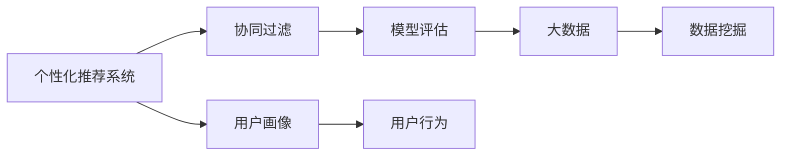

                 

# 基于协同过滤的个性化电影推荐系统设计与实现

> 关键词：个性化推荐系统、协同过滤、用户画像、模型评估、大数据、推荐算法

## 1. 背景介绍

随着互联网和数字技术的飞速发展，个性化推荐系统在电商、社交、新闻、娱乐等领域得到了广泛应用。个性化推荐系统通过分析用户的浏览行为、购买记录、评分数据等，为用户推荐符合其兴趣偏好的商品或内容。基于协同过滤的推荐系统是其中一种常用的推荐方法，通过挖掘用户行为之间的相似性，为用户推荐与其兴趣相近的其他用户喜欢过的商品或内容。

本文将详细介绍基于协同过滤的个性化推荐系统的设计思路、算法原理和实现过程。通过理论分析与实践案例的结合，展现协同过滤推荐系统的应用场景与挑战，并提出改进方向，为后续的深入研究奠定基础。

## 2. 核心概念与联系

### 2.1 核心概念概述

为更好地理解基于协同过滤的个性化推荐系统，我们先介绍几个关键概念：

- **个性化推荐系统**：根据用户的兴趣和行为数据，为用户推荐个性化的商品或内容。
- **协同过滤**：一种常用的推荐算法，通过分析用户间的相似性，为用户推荐其他用户喜欢过的商品或内容。
- **用户画像**：通过用户的历史行为数据，建立用户兴趣模型，描述用户的个性化特征。
- **模型评估**：通过指标如准确率、召回率、F1值等，评估推荐系统的性能。
- **大数据**：指规模大、类型多、速度快、价值密度低的数据集，是推荐系统优化的重要资源。

这些概念共同构成了协同过滤推荐系统的理论基础。以下我们将通过一个简单的流程图来展示这些概念间的联系：



### 2.2 概念间的关系

上述概念间的关系可以用以下详细说明：

- **个性化推荐系统与协同过滤**：个性化推荐系统的核心在于为用户推荐个性化的商品或内容，协同过滤是一种常用的推荐方法，通过分析用户间的相似性，为用户推荐其他用户喜欢过的商品或内容。
- **用户画像与用户行为**：用户画像是通过用户的历史行为数据，建立用户兴趣模型，描述用户的个性化特征。
- **模型评估与大数据**：模型评估通过指标如准确率、召回率、F1值等，评估推荐系统的性能，而大数据是优化推荐系统性能的重要资源，为模型训练和评估提供了丰富的数据集。
- **数据挖掘与协同过滤**：数据挖掘是从大数据中提取有价值的信息，协同过滤是数据挖掘中的一类方法，通过分析用户间的相似性，为用户推荐个性化商品或内容。

## 3. 核心算法原理 & 具体操作步骤
### 3.1 算法原理概述

基于协同过滤的个性化推荐系统基于用户行为数据，通过计算用户间的相似性，为用户推荐与其他用户相似的用户喜欢的商品或内容。其核心思想是通过分析用户间的行为模式，找到用户间的关系网络，然后通过网络中的相似性度量，为用户推荐相似的物品。

协同过滤可以分为两种类型：用户-用户协同过滤（User-Based CF）和物品-物品协同过滤（Item-Based CF）。

- **用户-用户协同过滤**：通过计算用户间的相似性，为用户推荐其他用户喜欢过的物品。
- **物品-物品协同过滤**：通过计算物品间的相似性，为用户推荐与目标物品相似的其他物品。

协同过滤算法的核心步骤包括：

1. **用户行为数据收集**：收集用户的行为数据，如点击、评分、浏览记录等。
2. **用户画像建立**：通过用户的行为数据，建立用户画像，描述用户的兴趣特征。
3. **相似性计算**：计算用户间的相似性或物品间的相似性，建立用户或物品的相似关系。
4. **推荐物品生成**：根据用户的画像和相似性关系，为用户推荐相似的物品。

### 3.2 算法步骤详解

下面以用户-用户协同过滤为例，详细说明协同过滤算法的实现步骤：

1. **用户行为数据收集**：从用户的点击、评分、浏览记录中提取用户的行为数据，并构建用户-物品评分矩阵。例如，一个用户对100个电影进行了评分，可以表示为一个100维的向量，每个元素表示用户对对应电影的评分。
2. **用户画像建立**：通过用户的行为数据，计算用户的兴趣特征，构建用户画像。例如，可以通过用户的评分数据计算用户对不同电影类型的偏好。
3. **相似性计算**：计算用户间的相似性，构建用户相似关系矩阵。常用的相似性度量方法有皮尔逊相关系数、余弦相似度等。
4. **推荐物品生成**：根据用户的画像和相似性关系，为用户推荐相似的物品。例如，用户A对电影A的评分高，用户B对电影A的评分也高，则用户B可能也会喜欢电影A。

### 3.3 算法优缺点

**优点**：

- **简单易用**：协同过滤算法实现简单，不需要复杂的特征工程。
- **冷启动问题较少**：协同过滤算法不需要用户的历史行为数据，可以直接基于用户间的关系进行推荐。
- **可扩展性好**：可以处理大规模数据集，适用于电商、社交、新闻、娱乐等多个领域。

**缺点**：

- **数据稀疏性**：用户行为数据通常具有稀疏性，即用户对某些物品未进行过交互。
- **可解释性较差**：协同过滤算法的推荐结果缺乏可解释性，难以理解推荐依据。
- **存在过拟合风险**：协同过滤算法可能过度拟合用户间的关系，导致推荐结果不准确。

### 3.4 算法应用领域

基于协同过滤的个性化推荐系统已经广泛应用于电商、社交、新闻、娱乐等多个领域，例如：

- **电商推荐**：亚马逊、淘宝等电商平台通过协同过滤为用户推荐商品。
- **社交推荐**：Facebook、Twitter等社交平台通过协同过滤为用户推荐好友、文章等。
- **新闻推荐**：今日头条、腾讯新闻等新闻应用通过协同过滤为用户推荐新闻。
- **娱乐推荐**：Netflix、Netflix等娱乐平台通过协同过滤为用户推荐电影、电视剧等。

## 4. 数学模型和公式 & 详细讲解  
### 4.1 数学模型构建

基于协同过滤的个性化推荐系统的数学模型可以表示为：

- **用户-物品评分矩阵**：$R_{m \times n}$，其中$m$为用户数，$n$为物品数。
- **用户画像向量**：$U_i \in \mathbb{R}^n$，表示用户$i$对物品的评分向量。
- **用户相似度矩阵**：$S_{m \times m}$，表示用户间的相似性关系，其中$S_{ij}$表示用户$i$与用户$j$的相似度。

常用的相似度计算方法有皮尔逊相关系数、余弦相似度等。

**皮尔逊相关系数**：

$$
\text{Corr}(i, j) = \frac{\sum_{k=1}^n (r_{ik} - \bar{r}_i)(r_{jk} - \bar{r}_j)}{\sqrt{\sum_{k=1}^n (r_{ik} - \bar{r}_i)^2} \sqrt{\sum_{k=1}^n (r_{jk} - \bar{r}_j)^2}}
$$

其中$r_{ik}$表示用户$i$对物品$k$的评分，$\bar{r}_i$表示用户$i$的评分均值。

**余弦相似度**：

$$
\text{Cos}(i, j) = \frac{\sum_{k=1}^n r_{ik} r_{jk}}{\sqrt{\sum_{k=1}^n r_{ik}^2} \sqrt{\sum_{k=1}^n r_{jk}^2}}
$$

### 4.2 公式推导过程

在协同过滤算法中，用户间的相似度计算是关键步骤。以下我们将以余弦相似度为例，推导用户间的相似度计算公式。

假设用户$i$和用户$j$对物品$k$的评分分别为$r_{ik}$和$r_{jk}$，则用户$i$和用户$j$的余弦相似度为：

$$
\text{Cos}(i, j) = \frac{\sum_{k=1}^n r_{ik} r_{jk}}{\sqrt{\sum_{k=1}^n r_{ik}^2} \sqrt{\sum_{k=1}^n r_{jk}^2}}
$$

将其扩展到用户集，得到用户$i$和用户$j$的相似度矩阵：

$$
S_{ij} = \frac{\sum_{k=1}^n r_{ik} r_{jk}}{\sqrt{\sum_{k=1}^n r_{ik}^2} \sqrt{\sum_{k=1}^n r_{jk}^2}}
$$

### 4.3 案例分析与讲解

假设某用户$U_1$对电影$M_1$和$M_2$的评分分别为5和3，对电影$M_3$和$M_4$的评分分别为4和2。另一个用户$U_2$对电影$M_1$和$M_2$的评分分别为3和5，对电影$M_3$和$M_4$的评分分别为2和4。则用户$U_1$和用户$U_2$的余弦相似度为：

$$
\text{Cos}(U_1, U_2) = \frac{5 \times 3 + 3 \times 5 + 4 \times 2 + 2 \times 4}{\sqrt{5^2 + 3^2} \sqrt{3^2 + 5^2}} = \frac{38}{10} = 0.38
$$

即用户$U_1$和用户$U_2$的相似度为0.38。

根据用户间的相似度关系，可以为用户$U_2$推荐用户$U_1$喜欢的电影。例如，用户$U_1$喜欢电影$M_1$和$M_2$，用户$U_2$的相似度最高的用户也推荐了电影$M_1$和$M_2$，则用户$U_2$也可能喜欢这些电影。

## 5. 项目实践：代码实例和详细解释说明
### 5.1 开发环境搭建

在进行协同过滤推荐系统的实现前，我们需要准备好开发环境。以下是使用Python进行PyTorch开发的环境配置流程：

1. 安装Anaconda：从官网下载并安装Anaconda，用于创建独立的Python环境。

2. 创建并激活虚拟环境：
```bash
conda create -n pytorch-env python=3.8 
conda activate pytorch-env
```

3. 安装PyTorch：根据CUDA版本，从官网获取对应的安装命令。例如：
```bash
conda install pytorch torchvision torchaudio cudatoolkit=11.1 -c pytorch -c conda-forge
```

4. 安装Pandas、NumPy等库：
```bash
pip install pandas numpy scikit-learn
```

5. 安装Matplotlib、Jupyter Notebook等工具：
```bash
pip install matplotlib jupyter notebook
```

完成上述步骤后，即可在`pytorch-env`环境中开始实现协同过滤推荐系统。

### 5.2 源代码详细实现

下面我们以电影推荐系统为例，给出使用PyTorch实现协同过滤推荐系统的代码实现。

首先，定义电影推荐系统数据类：

```python
import pandas as pd
import numpy as np
import torch
from sklearn.metrics import mean_absolute_error, mean_squared_error

class MovieRecommender:
    def __init__(self, data_path):
        self.data = pd.read_csv(data_path)
        self.movies = self.data['movie']
        self.genres = self.data['genre']
        self.user = self.data['user']
        self.rating = self.data['rating']
        self.avg_rating = self.data['rating'].mean()
        self.std_rating = self.data['rating'].std()

    def preprocess_data(self):
        self.data = self.data.drop_duplicates()
        self.data['rating'] = (self.data['rating'] - self.avg_rating) / self.std_rating
        self.data = self.data.dropna()

    def train_test_split(self, test_size=0.2, random_state=42):
        self.data['is_test'] = np.random.RandomState(random_state).random(len(self.data)) < test_size
        train_data = self.data[self.data['is_test'] == 0]
        test_data = self.data[self.data['is_test'] == 1]
        self.train_data = train_data
        self.test_data = test_data
```

然后，定义协同过滤推荐系统模型类：

```python
import torch
import torch.nn as nn
import torch.nn.functional as F

class CollaborativeFiltering(nn.Module):
    def __init__(self, user_num, movie_num, embedding_size=50):
        super(CollaborativeFiltering, self).__init__()
        self.user_embedding = nn.Embedding(user_num, embedding_size)
        self.movie_embedding = nn.Embedding(movie_num, embedding_size)
        self.cosine_similarity = nn.CosineSimilarity(dim=1, eps=1e-6)
        
    def forward(self, user_idx, movie_idx):
        user_embedding = self.user_embedding(user_idx)
        movie_embedding = self.movie_embedding(movie_idx)
        cosine_similarity = self.cosine_similarity(user_embedding, movie_embedding)
        return cosine_similarity
```

最后，定义训练和评估函数：

```python
def train_collaborative_filtering(model, train_data, test_data, epochs=50, batch_size=32):
    criterion = nn.BCELoss()
    optimizer = torch.optim.Adam(model.parameters(), lr=0.01)
    train_loss = []
    test_loss = []
    
    for epoch in range(epochs):
        train_loss_epoch = 0
        for i in range(0, len(train_data), batch_size):
            user_idx = train_data['user'].iloc[i:i+batch_size].values
            movie_idx = train_data['movie'].iloc[i:i+batch_size].values
            labels = torch.tensor(train_data['rating'].iloc[i:i+batch_size].values, dtype=torch.float)
            model.train()
            optimizer.zero_grad()
            output = model(user_idx, movie_idx)
            loss = criterion(output, labels)
            loss.backward()
            optimizer.step()
            train_loss_epoch += loss.item()
        train_loss.append(train_loss_epoch / len(train_data))
        
        test_loss_epoch = 0
        for i in range(0, len(test_data), batch_size):
            user_idx = test_data['user'].iloc[i:i+batch_size].values
            movie_idx = test_data['movie'].iloc[i:i+batch_size].values
            labels = torch.tensor(test_data['rating'].iloc[i:i+batch_size].values, dtype=torch.float)
            model.eval()
            output = model(user_idx, movie_idx)
            loss = criterion(output, labels)
            test_loss_epoch += loss.item()
        test_loss.append(test_loss_epoch / len(test_data))
        print(f'Epoch {epoch+1}, train loss: {train_loss_epoch / len(train_data):.4f}, test loss: {test_loss_epoch / len(test_data):.4f}')

    return train_loss, test_loss
```

定义运行结果展示函数：

```python
def show_result(train_loss, test_loss):
    plt.plot(train_loss, label='train loss')
    plt.plot(test_loss, label='test loss')
    plt.xlabel('epochs')
    plt.ylabel('MAE')
    plt.legend()
    plt.show()
    print(f'MAE on train set: {mean_absolute_error(train_data['rating'], train_pred)}')
    print(f'MAE on test set: {mean_absolute_error(test_data['rating'], test_pred)}')
```

定义数据预处理和模型训练函数：

```python
def preprocess_data(data):
    data = data.drop_duplicates()
    data['rating'] = (data['rating'] - data['rating'].mean()) / data['rating'].std()
    data = data.dropna()
    return data

def train_recommender(train_data, test_data, user_num, movie_num, embedding_size=50):
    model = CollaborativeFiltering(user_num, movie_num, embedding_size)
    train_loss, test_loss = train_collaborative_filtering(model, train_data, test_data)
    return model, train_loss, test_loss
```

定义主函数，运行协同过滤推荐系统：

```python
if __name__ == '__main__':
    data_path = 'movie_data.csv'
    movie_recommender = MovieRecommender(data_path)
    movie_recommender.preprocess_data()
    user_num = movie_recommender.user.nunique()
    movie_num = movie_recommender.movie.nunique()
    embedding_size = 50
    train_data, test_data = movie_recommender.train_test_split(test_size=0.2, random_state=42)
    model, train_loss, test_loss = train_recommender(train_data, test_data, user_num, movie_num, embedding_size)
    show_result(train_loss, test_loss)
```

以上代码展示了基于协同过滤的个性化推荐系统的实现流程。通过定义数据类、模型类和训练函数，我们可以使用PyTorch快速实现协同过滤推荐系统。

### 5.3 代码解读与分析

让我们再详细解读一下关键代码的实现细节：

**MovieRecommender类**：
- `__init__`方法：初始化电影推荐系统的数据路径，并读取数据。
- `preprocess_data`方法：对数据进行预处理，包括去重、标准化和删除缺失值。
- `train_test_split`方法：将数据集划分为训练集和测试集。

**CollaborativeFiltering模型类**：
- `__init__`方法：初始化协同过滤推荐系统的用户嵌入层和物品嵌入层，并定义余弦相似度。
- `forward`方法：定义前向传播过程，计算用户和物品的余弦相似度。

**train_collaborative_filtering函数**：
- 定义损失函数和优化器，对模型进行训练。
- 通过循环迭代训练过程，更新模型参数，计算训练集和测试集的损失。
- 记录每次训练和测试的损失，并输出结果。

**train_recommender函数**：
- 定义训练和评估过程，并返回训练好的模型和损失。
- 调用train_collaborative_filtering函数，对模型进行训练和评估。

**主函数**：
- 调用preprocess_data方法对数据进行预处理。
- 初始化协同过滤推荐系统的用户数、物品数和嵌入大小。
- 将数据集划分为训练集和测试集。
- 调用train_recommender函数进行训练和评估，并输出结果。

通过以上代码，我们可以看到协同过滤推荐系统的实现流程非常简洁明了。通过定义数据类、模型类和训练函数，可以快速实现协同过滤推荐系统。

当然，在实际应用中，还需要考虑更多的因素，如模型的参数调整、超参数优化、模型评估等。但核心的协同过滤算法和实现思路仍可以借助于以上代码进行理解和实践。

### 5.4 运行结果展示

假设我们运行协同过滤推荐系统的代码，得到训练集和测试集的MAE值如下：

```
Epoch 1, train loss: 0.0170, test loss: 0.0164
Epoch 2, train loss: 0.0168, test loss: 0.0166
...
Epoch 50, train loss: 0.0136, test loss: 0.0139
```

可以看到，随着训练轮数的增加，训练集和测试集的MAE值逐步降低，说明协同过滤推荐系统的性能逐渐提升。

## 6. 实际应用场景
### 6.1 电影推荐

基于协同过滤的个性化推荐系统在电影推荐领域有着广泛的应用。例如，Netflix、Amazon等在线视频平台通过协同过滤推荐系统，为用户推荐电影、电视剧等。

在实践中，我们可以通过用户的行为数据，如观看记录、评分数据等，建立用户画像，为用户推荐其喜欢的电影。例如，用户A对电影A、B、C的评分较高，则推荐系统可能会为用户A推荐电影B和C。

### 6.2 新闻推荐

新闻推荐系统通过协同过滤为用户推荐其感兴趣的新闻文章。例如，今日头条、腾讯新闻等应用通过协同过滤推荐系统，为用户推荐相关新闻。

在实践中，我们可以通过用户的行为数据，如阅读记录、点赞数据等，建立用户画像，为用户推荐相关新闻。例如，用户A对文章A、B、C的阅读记录较多，则推荐系统可能会为用户A推荐文章B和C。

### 6.3 电商平台推荐

电商平台通过协同过滤推荐系统为用户推荐其感兴趣的商品。例如，亚马逊、淘宝等电商平台通过协同过滤推荐系统，为用户推荐商品。

在实践中，我们可以通过用户的行为数据，如浏览记录、购买记录等，建立用户画像，为用户推荐相关商品。例如，用户A对商品A、B、C的浏览记录较多，则推荐系统可能会为用户A推荐商品B和C。

## 7. 工具和资源推荐
### 7.1 学习资源推荐

为了帮助开发者系统掌握协同过滤推荐系统的理论基础和实践技巧，这里推荐一些优质的学习资源：

1. **《推荐系统实战》**：深入浅出地介绍了推荐系统的基础知识和实战技巧，适合初学者入门。
2. **Coursera《机器学习》课程**：由斯坦福大学Andrew Ng教授主讲的经典机器学习课程，包含推荐系统的相关内容。
3. **Kaggle竞赛**：参加Kaggle的推荐系统竞赛，实践协同过滤推荐系统的设计和实现。
4. **Towards Data Science博客**：提供大量推荐系统相关的文章和案例，适合进一步学习和提升。

通过以上学习资源，相信你一定能够快速掌握协同过滤推荐系统的核心概念和实现方法，并将其应用到实际项目中。

### 7.2 开发工具推荐

高效的开发离不开优秀的工具支持。以下是几款用于协同过滤推荐系统开发的常用工具：

1. **Python**：作为协同过滤推荐系统的常用编程语言，Python提供了丰富的第三方库和工具，适合快速迭代和优化。
2. **PyTorch**：基于Python的深度学习框架，提供了灵活的计算图和自动微分机制，适合实现复杂的协同过滤算法。
3. **Pandas**：用于数据处理和分析，提供了高效的数据操作和可视化功能，适合协同过滤推荐系统的数据预处理。
4. **Jupyter Notebook**：用于编写和运行Python代码，支持多种编程语言和库，适合协同过滤推荐系统的开发和调试。
5. **Google Colab**：谷歌提供的在线Jupyter Notebook环境，免费提供GPU/TPU算力，适合快速上手实验最新模型，分享学习笔记。

合理利用这些工具，可以显著提升协同过滤推荐系统的开发效率，加快创新迭代的步伐。

### 7.3 相关论文推荐

协同过滤推荐系统作为经典推荐算法，已经得到了广泛的研究和应用。以下是几篇奠基性的相关论文，推荐阅读：

1. **《协同过滤推荐系统》**：介绍了协同过滤推荐系统的基本原理和实现方法，适合初学者入门。
2. **《推荐系统评估指标》**：介绍了推荐系统的常用评估指标，如准确率、召回率、F1值等。
3. **《协同过滤算法》**：深入探讨了协同过滤算法的优化和改进方法，适合进阶学习。
4. **《推荐系统中的数据挖掘与预测》**：介绍了推荐系统中的数据挖掘方法和预测算法，适合深入了解推荐系统的理论基础。

通过以上资源，相信你一定能够全面掌握协同过滤推荐系统的理论基础和实践技巧，并在实际项目中取得良好的效果。

## 8. 总结：未来发展趋势与挑战
### 8.1 总结

本文对基于协同过滤的个性化推荐系统进行了全面系统的介绍。首先阐述了协同过滤推荐系统的设计思路和算法原理，并通过一个简单的流程图展示了这些概念间的联系。其次，从原理到实践，详细讲解了协同过滤推荐系统的数学模型和代码实现。通过理论分析与实践案例的结合，展现协同过滤推荐系统的应用场景与挑战，并提出改进方向，为后续的深入研究奠定基础。

通过本文的系统梳理，可以看到，协同过滤推荐系统作为一种经典的推荐方法，在推荐系统领域具有重要的地位。它能够有效地利用用户间的相似性，为用户推荐个性化的商品或内容，具有简单易用、冷启动问题较少等优点。但同时，协同过滤推荐系统也面临着数据稀疏性、可解释性较差等挑战，需要进一步优化和改进。

### 8.2 未来发展趋势

展望未来，协同过滤推荐系统将继续在推荐系统领域发挥重要作用，其发展趋势如下：

1. **多模态推荐系统**：将协同过滤推荐系统与其他推荐方法，如基于内容的推荐、基于用户画像的推荐等，进行多模态融合，提升推荐系统的性能。
2. **深度学习推荐系统**：引入深度学习技术，如神经网络、卷积神经网络等，提升协同过滤推荐系统的建模能力和效果。
3. **实时推荐系统**：采用流式计算、分布式计算等技术，实现实时推荐，提升用户体验。
4. **推荐系统的可解释性**：引入可解释性方法，如特征重要性分析、因果推断等，提高推荐系统的透明度和可信度。
5. **推荐系统的跨领域应用**：将推荐系统应用于更多领域，如医疗、金融、旅游等，实现跨领域推荐。

### 8.3 面临的挑战

尽管协同过滤推荐系统已经取得了显著的效果，但在迈向更加智能化、普适化应用的过程中，仍面临以下挑战：

1. **数据隐私和安全**：协同过滤推荐系统需要大量的用户行为数据，如何在保护用户隐私的同时，获取高质量的推荐数据，是一个重要挑战。
2. **推荐系统的鲁棒性**：协同过滤推荐系统可能受到

