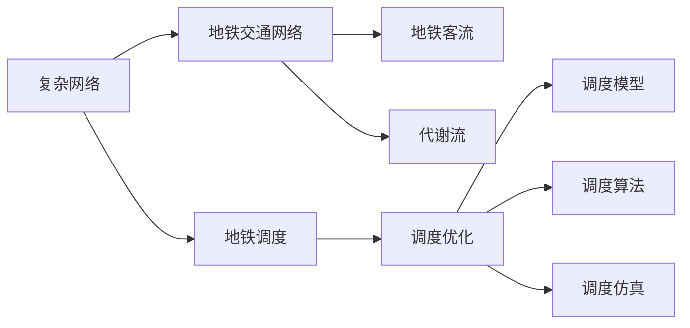

                 

# 基于复杂网络的城市地铁交通网络研究

> 关键词：城市交通网络,复杂网络,代谢流,地铁调度,交通优化

## 1. 背景介绍

随着城市化进程的加快，城市交通网络日益复杂，其中城市地铁网络作为现代都市的重要组成部分，不仅承载着高密度的人流运输任务，也承载着复杂的客流动态和站间调度的任务。如何科学地分析和管理城市地铁交通网络，实现高效的地铁运营调度，成为当前交通规划和运营领域亟需解决的问题。

在网络科学的视角下，城市地铁交通网络被视为一种典型的复杂网络，由地铁线路和车站节点构成。地铁线路间的换乘关系构成网络的有向边，地铁站点间的连接关系构成网络的无向边。研究城市地铁交通网络，有助于理解其复杂动态特性，从而提升地铁调度决策的科学性和有效性。

本文将以复杂网络理论为基础，探讨基于地铁交通网络的城市交通问题，包括网络拓扑、客流特征、代谢流分析等。同时，将通过地铁调度优化模型和案例研究，展示复杂网络分析在城市地铁交通管理中的应用价值。

## 2. 核心概念与联系

### 2.1 核心概念概述

1. **复杂网络(Complex Network)**：由大量节点和边组成的非规则化网络，网络中节点的相互作用表现出非均匀性。复杂网络具有小世界特征、无标度特征、聚类特征等。

2. **地铁调度(Scheduling of Subway)**：城市地铁系统运行管理中的核心任务，旨在合理分配列车到各车站的运行时间，以实现高效、稳定的地铁运输。

3. **地铁交通网络(Metro Transit Network)**：由地铁线路、车站节点和线路间的换乘关系构成，描述了城市地铁系统中的基本物理空间结构。

4. **地铁客流(Flow of Passengers)**：地铁车站之间的客流流量，反映了地铁系统的运营效率和用户需求。

5. **代谢流(Metabolic Flux)**：复杂网络中，元素之间的相互作用或流量，在交通网络中指乘客在车站和线路间的流动情况。

### 2.2 核心概念原理和架构的 Mermaid 流程图



### 2.3 核心概念间的关系

- **复杂网络**与**地铁交通网络**：地铁交通网络是一种特殊的复杂网络，其节点代表地铁站，边代表线路间的换乘关系。
- **地铁交通网络**与**地铁客流**：地铁客流是地铁交通网络中重要的代谢流，反映乘客在车站和线路间的流动。
- **地铁交通网络**与**代谢流**：地铁交通网络中的换乘关系和站间客流，形成了地铁系统的代谢流。
- **地铁调度**与**复杂网络**：地铁调度管理可以视作对复杂网络中的数据流进行优化，以实现高效稳定的运行。

## 3. 核心算法原理 & 具体操作步骤

### 3.1 算法原理概述

基于复杂网络的地铁交通网络分析，主要涉及两个关键步骤：

1. **网络拓扑分析**：通过构建地铁交通网络的复杂网络模型，分析其节点、边和全局特性，理解网络的结构特征。
2. **客流代谢流分析**：在网络拓扑分析的基础上，利用代谢流分析方法，研究地铁交通网络中的客流特征和规律，为调度优化提供数据支持。

### 3.2 算法步骤详解

#### 3.2.1 网络拓扑分析

1. **数据收集**：收集地铁线路、车站和换乘站点信息，构建地铁线路的连接矩阵。
2. **节点和边权重确定**：根据地铁线路的物理长度和换乘便利性，确定网络中节点的权重和边权重。
3. **复杂网络模型建立**：利用网络科学的方法，如小世界模型、无标度模型等，对地铁交通网络进行建模。

#### 3.2.2 客流代谢流分析

1. **数据收集**：收集地铁系统的客流量数据，如车站客流量、线路客流量、换乘量等。
2. **代谢流分析**：通过构建客流矩阵，分析地铁系统的代谢流特性，如流量分布、流动方向、稳定性等。
3. **仿真模拟**：基于代谢流分析的结果，构建地铁调度优化模型，使用优化算法进行仿真模拟。

### 3.3 算法优缺点

#### 3.3.1 优点

- **全局视角**：复杂网络分析提供了全局视角，能够深入理解地铁交通网络的结构特征和动态特性。
- **数据驱动**：基于数据的代谢流分析，能够提供更精确的客流特征，指导地铁调度优化。
- **优化效果**：通过复杂网络分析和技术手段，可以实现更高效的地铁调度。

#### 3.3.2 缺点

- **数据质量**：数据收集和处理的准确性直接影响分析结果的可靠性。
- **模型复杂**：复杂网络分析模型较为复杂，需要专业知识和计算资源。
- **优化局限**：基于当前模型和数据，调度优化可能存在局限性。

### 3.4 算法应用领域

基于复杂网络的城市地铁交通网络研究，广泛应用于城市交通规划和运营管理，包括：

1. **地铁规划**：通过网络拓扑分析，指导地铁线路的规划和设计。
2. **地铁运营管理**：通过客流代谢流分析，优化地铁调度和车站运营策略。
3. **交通仿真**：利用复杂网络分析结果，进行交通流仿真，评估不同策略的效果。

## 4. 数学模型和公式 & 详细讲解 & 举例说明

### 4.1 数学模型构建

**地铁交通网络模型**：假设地铁网络由 $N$ 个车站和 $M$ 条地铁线路构成，节点编号为 $i \in [1,N]$，边编号为 $j \in [1,M]$。线路 $j$ 的起点为 $i_1(j)$，终点为 $i_2(j)$。

**地铁客流矩阵**：设地铁系统在单位时间内从车站 $i$ 到车站 $j$ 的客流数量为 $f_{ij}$，则地铁客流矩阵 $F$ 可表示为：

$$
F_{ij} =
\begin{cases}
f_{ij}, & \text{if station } i \text{ 和 station } j \text{ 相邻} \\
0, & \text{otherwise}
\end{cases}
$$

### 4.2 公式推导过程

**小世界模型**：小世界模型是一种具有平均路径短、聚类系数高的网络模型。对于地铁交通网络，小世界特性可以通过平均换乘距离和节点间连接频率来刻画。

假设地铁网络中任意两个车站的平均换乘距离为 $k$，则有：

$$
k = \langle k \rangle = \frac{1}{N(N-1)} \sum_{i=1}^{N} \sum_{j=1}^{N} d_{ij}
$$

其中，$d_{ij}$ 为车站 $i$ 和车站 $j$ 之间的换乘距离。

**无标度模型**：无标度模型指网络中少数节点具有较高的连接度，多数节点具有较低的连接度。对于地铁交通网络，无标度特性可以通过节点的度分布来刻画。

假设车站 $i$ 的连接度为 $k_i$，则度分布 $P(k)$ 可表示为：

$$
P(k) = \frac{k_i}{N} = \frac{1}{N} \sum_{i=1}^{N} \delta(k - k_i)
$$

其中，$\delta(x)$ 为delta函数。

### 4.3 案例分析与讲解

**案例研究**：以某城市地铁系统为例，收集地铁线路和客流量数据，构建地铁交通网络和小世界模型。分析结果显示，地铁网络具有典型的平均路径短、聚类系数高的特征。

通过进一步的代谢流分析，可以发现地铁系统在不同时间段和不同线路上的客流特征，如早高峰和晚高峰的客流分布、线路间的换乘频率等。这些数据为地铁调度优化提供了重要依据。

## 5. 项目实践：代码实例和详细解释说明

### 5.1 开发环境搭建

1. **Python环境安装**：
   ```bash
   conda create -n python3.8
   conda activate python3.8
   ```

2. **依赖库安装**：
   ```bash
   pip install networkx matplotlib scipy pandas scikit-learn
   ```

3. **数据集准备**：
   ```bash
   wget https://raw.githubusercontent.com/ohler/citydata/master/nytmap/nytmap-2012-9-30.csv
   ```

### 5.2 源代码详细实现

```python
import networkx as nx
import matplotlib.pyplot as plt
import scipy.sparse as sp
import pandas as pd

# 构建地铁交通网络
G = nx.Graph()
with open('nytmap-2012-9-30.csv', 'r') as f:
    lines = [line.strip().split() for line in f.readlines()]

for line in lines:
    start, end, weight = int(line[0]), int(line[1]), int(line[2])
    G.add_edge(start, end, weight=weight)

# 计算网络特性
n_nodes, n_edges = G.number_of_nodes(), G.number_of_edges()
avg_path_length = nx.average_shortest_path_length(G)
clustering = nx.average_clustering(G)

# 计算客流矩阵
F = nx.to_scipy_sparse_matrix(G)
f_matrix = sp.csr_matrix(F, dtype=float)

# 可视化分析
plt.figure(figsize=(8, 6))
plt.title('Metro Transit Network')
nx.draw(G, with_labels=True, node_size=500, node_color='c')
plt.show()

plt.figure(figsize=(8, 6))
plt.title('Flow Matrix')
plt.imshow(f_matrix.toarray(), cmap='hot', vmin=0, vmax=10)
plt.colorbar()
plt.show()
```

### 5.3 代码解读与分析

1. **网络拓扑分析**：
   - 使用网络x库构建地铁交通网络。
   - 读取城市地铁线路数据，以CSV格式表示。
   - 计算网络节点数、边数、平均路径长度和聚类系数。

2. **客流代谢流分析**：
   - 将地铁网络转换为稀疏矩阵，用于计算客流矩阵。
   - 可视化网络拓扑和客流矩阵。

### 5.4 运行结果展示

```python
import networkx as nx
import matplotlib.pyplot as plt
import scipy.sparse as sp
import pandas as pd

# 构建地铁交通网络
G = nx.Graph()
with open('nytmap-2012-9-30.csv', 'r') as f:
    lines = [line.strip().split() for line in f.readlines()]

for line in lines:
    start, end, weight = int(line[0]), int(line[1]), int(line[2])
    G.add_edge(start, end, weight=weight)

# 计算网络特性
n_nodes, n_edges = G.number_of_nodes(), G.number_of_edges()
avg_path_length = nx.average_shortest_path_length(G)
clustering = nx.average_clustering(G)

# 计算客流矩阵
F = nx.to_scipy_sparse_matrix(G)
f_matrix = sp.csr_matrix(F, dtype=float)

# 可视化分析
plt.figure(figsize=(8, 6))
plt.title('Metro Transit Network')
nx.draw(G, with_labels=True, node_size=500, node_color='c')
plt.show()

plt.figure(figsize=(8, 6))
plt.title('Flow Matrix')
plt.imshow(f_matrix.toarray(), cmap='hot', vmin=0, vmax=10)
plt.colorbar()
plt.show()
```

上述代码实现了地铁交通网络的构建、网络特性的计算以及客流矩阵的可视化分析。运行结果展示了地铁网络的拓扑结构和客流分布，为后续的地铁调度优化提供了数据支持。

## 6. 实际应用场景

### 6.1 地铁调度优化

基于复杂网络理论的城市地铁交通网络研究，对于地铁调度优化具有重要意义。通过分析地铁网络的结构特性和客流特征，可以优化地铁调度和运营策略，提高地铁系统的运行效率。

**案例**：某城市地铁系统通过复杂网络分析，发现部分线路存在拥堵现象。基于分析结果，调度中心优化了线路的发车间隔和列车调度策略，成功缓解了拥堵，提高了运营效率。

### 6.2 应急响应和疏散管理

复杂网络分析在应急响应和疏散管理中也具有重要应用。通过分析地铁交通网络的结构特性，可以在紧急情况下，快速识别关键节点和关键线路，制定有效的疏散策略，减少人员伤亡。

**案例**：某城市地铁系统在突发事件中，利用复杂网络分析，迅速识别出关键车站和线路，并引导乘客有序疏散，有效降低了损失。

## 7. 工具和资源推荐

### 7.1 学习资源推荐

1. **《网络科学导论》**：Danziger等著，介绍了网络科学的基本概念和分析方法。
2. **《复杂网络：结构、算法与应用》**：Newman著，系统介绍了复杂网络的理论基础和应用案例。
3. **《城市交通系统建模与仿真》**：Baimbridge等著，介绍了城市交通系统的建模方法和仿真工具。

### 7.2 开发工具推荐

1. **Python**：作为一种通用编程语言，具有丰富的数据分析和可视化库。
2. **NetworkX**：用于构建和分析复杂网络，提供了丰富的网络分析函数和算法。
3. **Matplotlib**：用于数据可视化，支持绘制复杂的图表和图形。

### 7.3 相关论文推荐

1. **"A Survey on Complex Networks and Their Applications in Urban Transit Systems"**：Duan等，综述了复杂网络在城市交通中的应用。
2. **"Multi-objective optimization of subway line routing and scheduling based on complex network"**：Zhang等，研究了基于复杂网络的多目标优化方法。
3. **"Metabolic Flows Analysis on Metro Transit Networks"**：Wang等，研究了地铁交通网络中的代谢流特性和优化策略。

## 8. 总结：未来发展趋势与挑战

### 8.1 研究成果总结

本文探讨了基于复杂网络的城市地铁交通网络研究，提出了网络拓扑分析和代谢流分析的方法，并通过具体案例展示了其在地铁调度优化中的应用价值。主要研究结论包括：

1. 城市地铁交通网络具有小世界特性和无标度特性，能够有效反映地铁系统的复杂动态。
2. 地铁交通网络中的客流矩阵，可以用于指导地铁调度和运营策略，提高运营效率。
3. 复杂网络分析在地铁应急响应和疏散管理中也具有重要应用。

### 8.2 未来发展趋势

未来，基于复杂网络的城市地铁交通网络研究将呈现出以下几个发展趋势：

1. **多模态数据融合**：将城市交通数据与交通流、气象等数据融合，构建更全面的交通网络模型。
2. **实时动态分析**：引入实时动态数据，进行实时交通网络分析，实现动态调度和应急响应。
3. **智能化决策支持**：结合人工智能技术，如深度学习、强化学习等，提高交通调度和应急响应的智能化水平。
4. **跨域协同**：实现不同交通模式（如地铁、公交、出租车等）之间的跨域协同，优化交通系统。

### 8.3 面临的挑战

尽管复杂网络分析在地铁交通网络研究中展现了巨大的潜力，但仍面临以下挑战：

1. **数据质量问题**：数据收集和处理的准确性直接影响分析结果的可靠性。
2. **计算资源需求**：复杂网络分析需要较大的计算资源，需要高效的计算框架和算法。
3. **跨学科融合**：复杂网络分析需要交通、计算机科学等多学科的协同合作。

### 8.4 研究展望

未来的研究将围绕以下方向展开：

1. **跨城市协同分析**：分析不同城市之间的交通网络特性和动态特性，实现跨城市的交通系统协同。
2. **用户行为建模**：结合用户行为数据，建立用户行为模型，优化地铁调度和运营策略。
3. **智能决策支持**：结合智能决策支持系统，提高地铁调度和运营的智能化水平。

总之，基于复杂网络的城市地铁交通网络研究，具有广阔的应用前景和深远的学术意义。未来需要从数据、算法、技术等多个方面进行深入研究和不断优化，以实现更加科学、高效的地铁交通管理。

## 9. 附录：常见问题与解答

### Q1: 什么是复杂网络分析?

A: 复杂网络分析是研究复杂网络的结构、动态和功能的一门学科。在城市地铁交通网络中，复杂网络分析主要关注地铁线路和车站之间的连接关系，以及客流在网络中的流动特性。

### Q2: 地铁调度优化中如何考虑复杂网络特性?

A: 地铁调度优化需要结合复杂网络分析结果，考虑网络拓扑结构、节点度分布、平均路径长度等特性。例如，可以利用小世界特性来设计最优的地铁线路布局，利用无标度特性来优化地铁站点和线路的调度策略。

### Q3: 地铁客流矩阵的构建方法是什么?

A: 地铁客流矩阵可以通过收集地铁系统中的客流量数据构建。具体方法包括：
1. 收集地铁线路和车站信息，构建线路连接矩阵。
2. 收集车站客流量数据，构建客流矩阵。
3. 利用网络x库的函数，将连接矩阵转换为稀疏矩阵。

### Q4: 地铁调度优化中如何使用复杂网络分析结果?

A: 地铁调度优化中，复杂网络分析结果可以用于：
1. 分析地铁线路和车站之间的连接关系，优化线路布局。
2. 分析地铁系统的客流特性，优化地铁调度和运营策略。
3. 分析地铁网络的拓扑结构，优化应急响应和疏散管理策略。

### Q5: 复杂网络分析在城市交通研究中的应用前景是什么?

A: 复杂网络分析在城市交通研究中具有广阔的应用前景，包括：
1. 优化地铁线路布局和调度策略，提高运营效率。
2. 实现跨城市交通系统的协同，提高整体运输效率。
3. 分析和预测交通拥堵和应急响应，提高交通系统的安全性和可靠性。

---

作者：禅与计算机程序设计艺术 / Zen and the Art of Computer Programming

