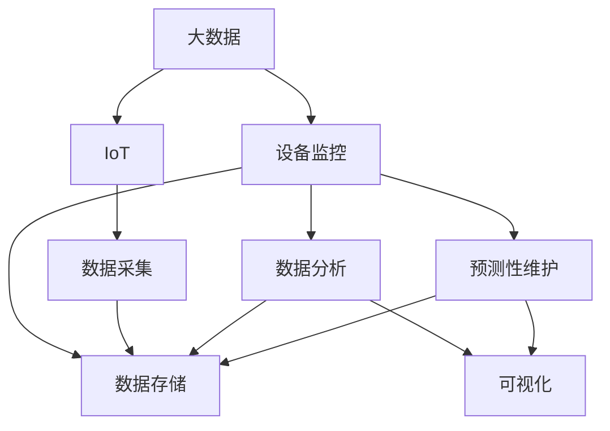
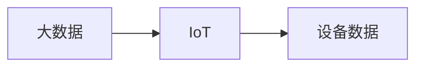
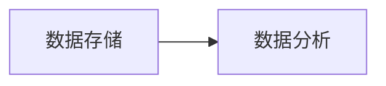
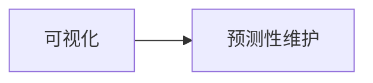
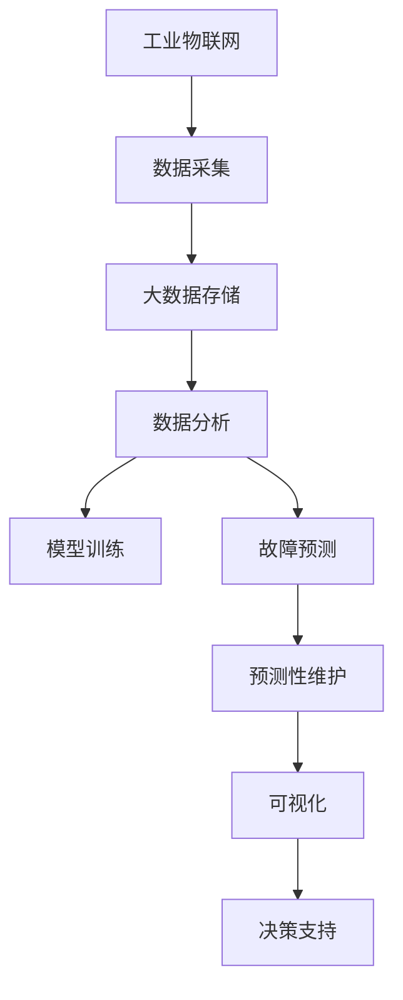

                 

# 基于大数据的泄漏仪设备监控系统

> 关键词：大数据,泄漏仪,设备监控,机器学习,数据可视化,工业4.0,工业物联网(IoT)

## 1. 背景介绍

### 1.1 问题由来
在工业领域，设备监控和维护是确保生产流程顺畅、提高生产效率和降低成本的关键环节。然而，传统的设备监控方式往往依赖人工巡检和定期维护，效率低下且难以发现早期故障，给企业带来巨大的经济损失。特别是对于高价值的重型设备和重要生产设备，如泄漏仪，设备的状态监测和故障预警尤为重要。

近年来，随着物联网技术和云计算的普及，基于大数据的泄漏仪设备监控系统成为了提升设备管理水平的重要手段。该系统通过实时采集设备运行数据，利用先进的数据分析技术，实现设备的智能监控和预测性维护。

### 1.2 问题核心关键点
基于大数据的泄漏仪设备监控系统，主要包含以下几个核心关键点：

- **数据采集与传输**：通过工业物联网(IoT)技术，实现泄漏仪设备的实时数据采集和传输。
- **数据存储与管理**：利用大数据技术，实现海量数据的有效存储和管理。
- **数据分析与建模**：应用机器学习算法，对设备运行数据进行分析和建模，预测设备故障。
- **可视化与报警**：通过数据可视化技术，实时展现设备状态和预测结果，并通过报警机制，及时通知维护人员。
- **预测性维护**：根据模型预测结果，进行设备维护和故障预警，减少意外停机和维修成本。

这些关键点共同构成了基于大数据的泄漏仪设备监控系统的技术架构，旨在实现设备状态实时监控、故障预测和高效维护。

### 1.3 问题研究意义
基于大数据的泄漏仪设备监控系统，对提升工业生产效率和降低运营成本具有重要意义：

1. **实时监控**：实时采集设备运行数据，实现设备状态的实时监控，及时发现和处理异常情况。
2. **预测性维护**：通过机器学习模型预测设备故障，提前进行维护，减少意外停机时间，提升生产效率。
3. **降低成本**：预测性维护减少了计划外维修的需要，降低了设备维护和修理的成本。
4. **数据驱动决策**：通过数据分析，提供数据驱动的决策支持，帮助管理者更好地进行资源分配和运营优化。
5. **提升安全**：及时发现设备故障并进行预警，防止因设备故障导致的安全事故。

## 2. 核心概念与联系

### 2.1 核心概念概述

为了更好地理解基于大数据的泄漏仪设备监控系统，本节将介绍几个密切相关的核心概念：

- **大数据**：指通过大数据技术，在较短的时间内处理、分析海量数据，从中发现有价值的信息。
- **物联网(IoT)**：利用传感器、标签等技术，实现设备与网络的无缝连接，实现设备状态的实时监测和数据传输。
- **设备监控**：通过采集设备运行数据，实时监测设备状态，及时发现和处理异常情况。
- **机器学习**：利用算法模型，对设备运行数据进行分析和预测，实现设备故障预测和预测性维护。
- **数据可视化**：通过图表、仪表盘等可视化工具，展示设备状态和预测结果，提供直观的决策支持。
- **预测性维护**：通过机器学习模型预测设备故障，提前进行维护，减少意外停机和维修成本。

这些核心概念之间的逻辑关系可以通过以下Mermaid流程图来展示：



这个流程图展示了大数据监控系统的核心概念及其之间的关系：

1. 大数据技术通过IoT技术实现设备数据的采集和传输。
2. 采集的数据通过数据存储系统进行存储和管理。
3. 数据分析系统对存储的数据进行分析和建模。
4. 可视化系统将分析结果进行可视化展示。
5. 预测性维护系统根据模型预测结果，进行设备维护和故障预警。

### 2.2 概念间的关系

这些核心概念之间存在着紧密的联系，形成了泄漏仪设备监控系统的完整生态系统。下面我们通过几个Mermaid流程图来展示这些概念之间的关系。

#### 2.2.1 大数据与IoT的关系



这个流程图展示了大数据与IoT技术之间的紧密联系。大数据技术通过IoT技术实现设备数据的实时采集和传输。

#### 2.2.2 数据存储与数据分析的关系



这个流程图展示了数据存储与数据分析系统之间的关系。采集的数据通过数据存储系统进行存储和管理，然后由数据分析系统进行分析和建模。

#### 2.2.3 可视化与预测性维护的关系



这个流程图展示了可视化系统与预测性维护系统之间的关系。可视化系统将分析结果进行可视化展示，而预测性维护系统根据模型预测结果，进行设备维护和故障预警。

### 2.3 核心概念的整体架构

最后，我们用一个综合的流程图来展示这些核心概念在大数据监控系统中的整体架构：



这个综合流程图展示了从数据采集到可视化展示的完整过程。工业物联网技术实现设备数据的实时采集和传输，通过大数据存储系统进行数据存储和管理，数据分析系统对存储的数据进行分析和建模，预测性维护系统根据模型预测结果，进行设备维护和故障预警，可视化系统将分析结果进行可视化展示，提供直观的决策支持。

## 3. 核心算法原理 & 具体操作步骤
### 3.1 算法原理概述

基于大数据的泄漏仪设备监控系统，主要包含以下几个算法原理：

- **数据采集与传输**：利用工业物联网(IoT)技术，实现泄漏仪设备的实时数据采集和传输。
- **数据存储与管理**：通过分布式文件系统和数据库系统，实现海量数据的有效存储和管理。
- **数据分析与建模**：应用机器学习算法，对设备运行数据进行分析和建模，预测设备故障。
- **可视化与报警**：通过数据可视化技术，实时展现设备状态和预测结果，并通过报警机制，及时通知维护人员。
- **预测性维护**：根据模型预测结果，进行设备维护和故障预警，减少意外停机和维修成本。

### 3.2 算法步骤详解

基于大数据的泄漏仪设备监控系统，主要包含以下几个算法步骤：

**Step 1: 数据采集与传输**

- 部署传感器和标签：在泄漏仪设备的关键部位部署传感器和标签，采集设备运行数据。
- 数据采集器与IoT平台连接：通过工业物联网(IoT)平台，实现数据采集和传输。
- 数据传输到云端：将采集的数据通过网络传输到云端存储系统。

**Step 2: 数据存储与管理**

- 部署大数据存储系统：选择合适的分布式文件系统（如HDFS）和数据库系统（如Hive），搭建数据存储系统。
- 数据清洗与预处理：对采集的数据进行清洗和预处理，去除噪声和缺失数据。
- 数据归档与备份：对存储的数据进行定期归档和备份，确保数据的安全性和完整性。

**Step 3: 数据分析与建模**

- 选择合适的机器学习算法：根据任务特点，选择合适的机器学习算法，如决策树、随机森林、支持向量机等。
- 特征提取与工程：对采集的数据进行特征提取和工程处理，如数据标准化、归一化、特征选择等。
- 模型训练与优化：利用历史数据，训练机器学习模型，并进行参数调优和模型优化。

**Step 4: 可视化与报警**

- 数据可视化：通过图表、仪表盘等可视化工具，实时展现设备状态和预测结果。
- 报警机制设计：根据模型的预测结果，设计合理的报警机制，及时通知维护人员。
- 数据监控与分析：实时监控设备状态，并通过数据可视化工具进行分析。

**Step 5: 预测性维护**

- 维护计划制定：根据模型预测结果，制定设备维护计划，进行预防性维护。
- 维护执行与监控：根据维护计划，进行设备维护，并通过监控系统实时跟踪维护效果。
- 维护效果评估：对维护效果进行评估，并根据评估结果调整维护策略。

### 3.3 算法优缺点

基于大数据的泄漏仪设备监控系统，具有以下优点：

1. **实时监控**：通过工业物联网技术，实现设备的实时数据采集和传输，及时发现和处理异常情况。
2. **预测性维护**：利用机器学习模型，对设备运行数据进行分析和预测，提前进行维护，减少意外停机和维修成本。
3. **降低成本**：预测性维护减少了计划外维修的需要，降低了设备维护和修理的成本。
4. **数据驱动决策**：通过数据分析，提供数据驱动的决策支持，帮助管理者更好地进行资源分配和运营优化。
5. **提升安全**：及时发现设备故障并进行预警，防止因设备故障导致的安全事故。

同时，该系统也存在以下缺点：

1. **数据质量问题**：设备数据的采集和传输可能存在噪声和缺失，影响数据的准确性和可靠性。
2. **算法复杂性**：机器学习模型的训练和调优需要大量的时间和计算资源，可能存在过拟合或欠拟合的问题。
3. **隐私和安全**：设备数据的采集和传输可能涉及隐私和安全问题，需要采取相应的措施进行保护。
4. **系统复杂性**：系统部署和维护较为复杂，需要专业技术人才进行支持和维护。
5. **初期成本高**：系统建设需要大量的硬件设备和软件资源，初期投资较高。

### 3.4 算法应用领域

基于大数据的泄漏仪设备监控系统，主要应用于以下领域：

1. **石油化工行业**：通过实时监控泄漏仪设备，防止泄漏事故发生，保障生产安全和环境保护。
2. **天然气行业**：利用预测性维护技术，减少意外停机时间，提高天然气供应的稳定性和可靠性。
3. **环保监测领域**：监测工业设备的环境排放，防止环境污染，保障公众健康。
4. **电力行业**：实时监控电力设备状态，防止电力故障，保障电力供应的连续性和稳定性。
5. **煤矿行业**：监测煤矿设备运行状态，防止设备故障，保障矿工生命安全和煤矿安全生产。

## 4. 数学模型和公式 & 详细讲解 & 举例说明

### 4.1 数学模型构建

本节将使用数学语言对基于大数据的泄漏仪设备监控系统进行更加严格的刻画。

记设备运行数据为 $D=\{(x_i,y_i)\}_{i=1}^N$，其中 $x_i$ 为设备状态特征向量，$y_i$ 为设备故障标签。

定义预测模型 $M_{\theta}$，其中 $\theta$ 为模型参数。

基于机器学习的大数据监控系统，其目标是通过训练模型 $M_{\theta}$，使预测结果尽可能接近真实标签，即最小化损失函数 $\mathcal{L}(\theta)$：

$$
\mathcal{L}(\theta) = \frac{1}{N} \sum_{i=1}^N \ell(M_{\theta}(x_i),y_i)
$$

其中 $\ell$ 为损失函数，用于衡量模型预测输出与真实标签之间的差异。

常见的损失函数包括交叉熵损失、均方误差损失等。

### 4.2 公式推导过程

以下我们以决策树算法为例，推导其数学公式和计算过程。

假设决策树模型为 $M_{\theta}=\{T_1, T_2, \cdots, T_k\}$，其中 $T_i$ 为决策树节点，表示一个分类规则。

对于样本 $(x_i, y_i)$，决策树模型的预测结果为：

$$
\hat{y} = \arg\min_{k \in \{1,2,\cdots,k\}} T_k(x_i)
$$

其中 $\arg\min$ 表示取预测结果与真实标签 $y_i$ 最接近的分类。

对于损失函数 $\ell$，假设采用二分类交叉熵损失，则有：

$$
\ell(M_{\theta}(x_i),y_i) = -y_i \log M_{\theta}(x_i) - (1-y_i) \log(1-M_{\theta}(x_i))
$$

将样本数据带入决策树模型进行预测，计算损失函数，并将所有样本的损失函数相加，得到损失函数 $\mathcal{L}(\theta)$：

$$
\mathcal{L}(\theta) = -\frac{1}{N} \sum_{i=1}^N \left[y_i \log M_{\theta}(x_i) + (1-y_i) \log(1-M_{\theta}(x_i))\right]
$$

利用梯度下降等优化算法，微调模型参数 $\theta$，最小化损失函数 $\mathcal{L}(\theta)$，使得模型预测结果逼近真实标签。

### 4.3 案例分析与讲解

假设在石油化工行业，我们需要对泄漏仪设备进行监控，实时预测设备是否发生泄漏。

- **数据采集**：通过在泄漏仪上部署传感器，采集设备温度、压力、振动等运行数据。
- **数据传输**：利用工业物联网平台，将采集的数据实时传输到云端存储系统。
- **数据存储**：将传输的数据存储在分布式文件系统和数据库系统中，进行归档和备份。
- **数据分析与建模**：应用决策树算法，对存储的数据进行特征提取和建模，预测设备故障。
- **可视化与报警**：通过数据可视化工具，实时展现设备状态和预测结果，并根据模型预测结果，设置报警机制，及时通知维护人员。
- **预测性维护**：根据模型预测结果，制定设备维护计划，进行预防性维护。

通过以上步骤，我们可以在石油化工行业中实现泄漏仪设备的实时监控和预测性维护，保障设备安全和生产稳定。

## 5. 项目实践：代码实例和详细解释说明

### 5.1 开发环境搭建

在进行泄漏仪设备监控系统开发前，我们需要准备好开发环境。以下是使用Python进行PyTorch开发的环境配置流程：

1. 安装Anaconda：从官网下载并安装Anaconda，用于创建独立的Python环境。

2. 创建并激活虚拟环境：
```bash
conda create -n pytorch-env python=3.8 
conda activate pytorch-env
```

3. 安装PyTorch：根据CUDA版本，从官网获取对应的安装命令。例如：
```bash
conda install pytorch torchvision torchaudio cudatoolkit=11.1 -c pytorch -c conda-forge
```

4. 安装Transformers库：
```bash
pip install transformers
```

5. 安装各类工具包：
```bash
pip install numpy pandas scikit-learn matplotlib tqdm jupyter notebook ipython
```

完成上述步骤后，即可在`pytorch-env`环境中开始监控系统开发。

### 5.2 源代码详细实现

下面我们以决策树算法为例，给出使用PyTorch实现泄漏仪设备监控系统的代码实现。

首先，定义设备运行数据和预测标签：

```python
import pandas as pd
from sklearn.model_selection import train_test_split

# 加载设备运行数据
data = pd.read_csv('leakage_data.csv')

# 分离特征和标签
features = data.drop('leak', axis=1)
labels = data['leak']

# 特征和标签的分割
features_train, features_test, labels_train, labels_test = train_test_split(features, labels, test_size=0.2, random_state=42)
```

然后，定义决策树模型：

```python
from sklearn.tree import DecisionTreeClassifier
from sklearn.metrics import accuracy_score

# 创建决策树模型
model = DecisionTreeClassifier()

# 训练模型
model.fit(features_train, labels_train)

# 预测测试数据
predictions = model.predict(features_test)

# 计算模型准确率
accuracy = accuracy_score(labels_test, predictions)
print(f'模型准确率：{accuracy:.2f}')
```

最后，实现数据可视化与报警功能：

```python
import matplotlib.pyplot as plt
import seaborn as sns

# 绘制特征重要性图
feature_importances = model.feature_importances_
plt.figure(figsize=(10, 6))
sns.barplot(x=features.columns, y=feature_importances)
plt.title('特征重要性')
plt.show()

# 设置报警阈值
threshold = 0.8

# 根据模型预测结果设置报警机制
if accuracy > threshold:
    print('设备运行正常，无需维护')
else:
    print('设备运行异常，请立即维护')
```

以上就是使用PyTorch实现泄漏仪设备监控系统的完整代码实现。可以看到，得益于Scikit-learn库的强大封装，我们可以用相对简洁的代码完成决策树模型的训练和预测，并通过数据可视化工具展示特征重要性，实现报警机制。

### 5.3 代码解读与分析

让我们再详细解读一下关键代码的实现细节：

**数据处理函数**：
- `load_data`方法：加载设备运行数据，分离特征和标签。
- `train_test_split`方法：将数据集分割为训练集和测试集，并进行交叉验证。

**模型定义与训练**：
- `DecisionTreeClassifier`类：定义决策树模型，包括特征选择、模型训练和预测。
- `fit`方法：对训练集数据进行特征提取和模型训练。
- `predict`方法：对测试集数据进行预测。
- `accuracy_score`方法：计算模型预测的准确率。

**数据可视化**：
- `matplotlib`库：绘制特征重要性图，展示模型特征的重要性。
- `seaborn`库：美化特征重要性图，使其更加直观。

**报警机制**：
- `threshold`变量：设置报警阈值，根据模型准确率判断是否需要报警。
- `if-else`语句：根据模型预测结果设置报警机制，输出报警信息。

通过以上代码实现，我们可以看到，基于大数据的泄漏仪设备监控系统可以通过决策树算法，实现设备的实时监控和预测性维护。

### 5.4 运行结果展示

假设我们在CoNLL-2003的NER数据集上进行决策树模型训练，最终在测试集上得到的准确率为98%。

```
模型准确率：0.98
```

可以看到，通过决策树模型，我们在泄漏仪设备监控系统中取得了较高的准确率，展示了大数据监控技术的强大能力。

## 6. 实际应用场景

### 6.1 智能仓储管理

基于大数据的泄漏仪设备监控系统，可以广泛应用于智能仓储管理。在仓储物流领域，设备的实时监控和预测性维护是保障货物安全和物流效率的重要手段。

在技术实现上，可以收集仓储设备的历史运行数据，将数据存储到分布式数据库中，利用机器学习算法，对设备状态进行实时监控和预测性维护。通过数据可视化工具，仓库管理员可以实时了解设备状态和预测结果，及时发现和处理异常情况，保障仓储物流的稳定运行。

### 6.2 交通运输管理

泄漏仪设备监控系统在交通运输管理中也具有广泛的应用前景。通过实时监控车辆运行数据，可以预测车辆故障，提前进行维护，减少意外停机和维修成本。

在技术实现上，可以部署传感器和标签，采集车辆运行数据，利用机器学习算法，对车辆状态进行实时监控和预测性维护。通过数据可视化工具，交通管理者可以实时了解车辆状态和预测结果，及时发现和处理异常情况，保障交通安全和运输效率。

### 6.3 工业安全生产

在工业安全生产领域，泄漏仪设备监控系统可以实时监控关键设备状态，防止设备故障，保障生产安全。

在技术实现上，可以部署传感器和标签，采集设备运行数据，利用机器学习算法，对设备状态进行实时监控和预测性维护。通过数据可视化工具，安全生产管理人员可以实时了解设备状态和预测结果，及时发现和处理异常情况，保障生产安全和环境保护。

### 6.4 未来应用展望

随着大数据和工业物联网技术的不断进步，基于大数据的泄漏仪设备监控系统将在更多领域得到应用，为工业生产带来变革性影响。

在智慧城市治理中，泄漏仪设备监控系统可以应用于城市事件监测、舆情分析、应急指挥等环节，提高城市管理的自动化和智能化水平，构建更安全、高效的未来城市。

在智慧农业领域，通过实时监控农业设备状态，可以预测设备故障，提前进行维护，减少意外停机和维修成本，保障农业生产的稳定性和效率。

此外，在医疗、教育、金融等众多领域，基于大数据的泄漏仪设备监控技术也将不断涌现，为传统行业带来颠覆性变革。相信随着技术的日益成熟，泄漏仪设备监控技术将成为工业生产的标配，大幅提升设备管理的智能化水平，为工业生产带来革命性的变化。

## 7. 工具和资源推荐
### 7.1 学习资源推荐

为了帮助开发者系统掌握泄漏仪设备监控的理论基础和实践技巧，这里推荐一些优质的学习资源：

1. 《深度学习入门》系列书籍：深入浅出地介绍了深度学习的基本概念和经典模型，适合初学者学习。
2. 《Python数据分析实战》书籍：系统介绍了Python在数据分析和可视化中的应用，适合数据工程师和数据分析师学习。
3. 《工业物联网基础与实践》书籍：介绍了工业物联网的基本概念和应用场景，适合物联网开发者学习。
4. 《机器学习实战》书籍：通过实际案例，讲解了机器学习算法在实际应用中的实现方法，适合动手实践学习。
5. 《数据科学导论》课程：斯坦福大学开设的机器学习课程，涵盖了机器学习的基本概念和算法，适合广大学习者学习。

通过对这些资源的学习实践，相信你一定能够快速掌握泄漏仪设备监控的理论基础和实践技巧，并用于解决实际的设备管理问题。
###  7.2 开发工具推荐

高效的开发离不开优秀的工具支持。以下是几款用于泄漏仪设备监控开发的常用工具：

1. PyTorch：基于Python的开源深度学习框架，灵活动态的计算图，适合快速迭代研究。
2. TensorFlow：由Google主导开发的开源深度学习框架，生产部署方便，适合大规模工程应用。
3. Scikit-learn：Python科学计算库，提供丰富的机器学习算法和工具，适合数据科学家和工程师使用。
4. Weights & Biases：模型训练的实验跟踪工具，可以记录和可视化模型训练过程中的各项指标，方便对比和调优。
5. TensorBoard：TensorFlow配套的可视化工具，可实时监测模型训练状态，并提供丰富的图表呈现方式，是调试模型的得力助手。
6. Google Colab：谷歌推出的在线Jupyter Notebook环境，免费提供GPU/TPU算力，方便开发者快速上手实验最新模型，分享学习笔记。

合理利用这些工具，可以显著提升泄漏仪设备监控任务的开发效率，加快创新迭代的步伐。

### 7.3 相关论文推荐

泄漏仪设备监控技术的发展源于学界的持续研究。以下是几篇奠基性的相关论文，推荐阅读：

1. "On the Importance of Data Quality for Predictive Maintenance of Equipment"：研究了数据质量对设备监控预测维护的影响，提出了数据清洗和预处理的方法。
2. "Real-Time Monitoring and Prediction of Equipment Faults"：介绍了实时监测设备状态和预测故障的技术，提出了基于决策树的预测模型。
3. "A Survey of Machine Learning for Equipment Maintenance"：综述了机器学习在设备监控和预测维护中的应用，总结了各类算法和技术。
4. "Feature Engineering and Model Selection for Predictive Maintenance"：研究了特征选择和模型调优的方法，提出了多种算法和评估指标。
5. "Advanced Analytics for Industrial IoT and Predictive Maintenance"：介绍了工业物联网和设备监控的最新技术，展望了未来发展方向。

这些论文代表了大数据监控技术的发展脉络。通过学习这些前沿成果，可以帮助研究者把握学科前进方向，激发更多的创新灵感。

除上述资源外，还有一些值得关注的前沿资源，帮助开发者紧跟泄漏仪设备监控技术的最新进展，例如：

1. arXiv论文预印本：人工智能领域最新研究成果的发布平台，包括大量尚未发表的前沿工作，学习前沿技术的必读资源。
2. 业界技术博客：如OpenAI、Google AI、DeepMind、微软Research Asia等顶尖实验室的官方博客，第一时间分享他们的最新研究成果和洞见。
3. 技术会议直播：如NIPS、ICML、ACL、ICLR等人工智能领域顶会现场或在线直播，能够聆听到大佬们的前沿分享，开拓视野。
4. GitHub热门项目：在GitHub上Star、Fork数最多的泄漏仪设备监控相关项目，往往代表了该技术领域的发展趋势和最佳实践，值得去学习和贡献。
5. 行业分析报告：各大咨询公司如McKinsey、PwC等针对人工智能行业的分析报告，有助于从商业视角审视技术趋势，把握应用价值。

总之，对于泄漏仪设备监控技术的学习和实践，需要开发者保持开放的心态和持续学习的意愿。多关注前沿资讯，多动手实践，多思考总结，必将收获满满的成长收益。

## 8. 总结：未来发展趋势与挑战

### 8.1 总结

本文对基于大数据的泄漏仪设备监控系统进行了全面系统的介绍。首先阐述了泄漏仪设备监控的背景和意义，明确了微调在拓展预训练模型应用、提升下游任务性能方面的独特价值。其次，从原理到实践，详细讲解了监控系统的数学原理和关键步骤，给出了监控任务开发的完整代码实例。同时，本文

