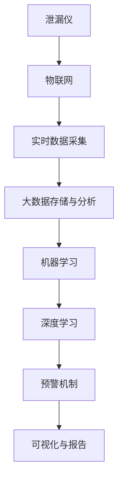
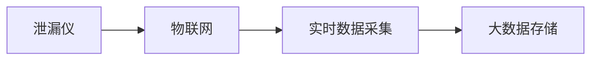
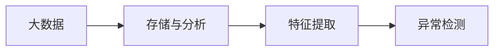
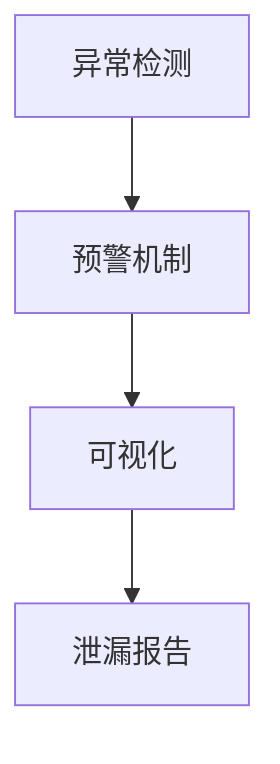
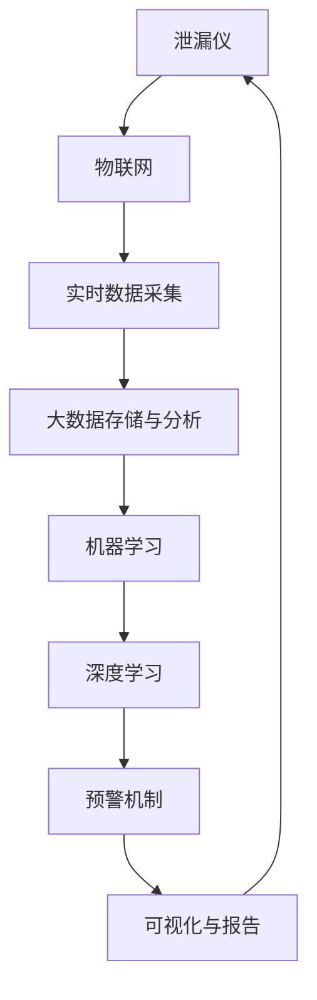

                 

# 基于大数据的泄漏仪设备监控系统

## 1. 背景介绍

### 1.1 问题由来
泄漏检测是石油化工、核电、冶金、医药等行业中至关重要的一环。泄漏不仅会造成资源的浪费，还可能导致环境污染、设备损坏甚至人身安全问题。因此，如何及时、准确地发现泄漏，对保障企业安全生产具有重要意义。

当前，泄漏检测主要依赖人工巡检或固定监测点定期检测。但人工巡检成本高、效率低，容易出现漏检、误检。固定监测点又存在设备易损、布点不合理等问题，导致监测盲区。

为了提升泄漏检测的效率和准确性，我们提出了一种基于大数据的泄漏仪设备监控系统。该系统能够实时监控各类泄漏仪，通过大数据分析，及时发现异常并发出预警，有效保障企业安全。

### 1.2 问题核心关键点
基于大数据的泄漏仪设备监控系统，通过以下核心关键点实现泄漏检测：
- **实时数据采集**：通过物联网技术，实时采集泄漏仪的各项参数。
- **大数据存储与分析**：对采集的数据进行存储和分析，提取特征，识别异常。
- **预警机制**：设置阈值，对检测到的异常进行预警。
- **可视化与报告**：实时监控和可视化数据，生成详细的泄漏报告。

### 1.3 问题研究意义
通过大数据技术，提升泄漏检测的实时性和准确性，可有效保障企业安全，降低环境污染和资源浪费，具有重要意义：

1. **保障安全生产**：及时发现泄漏，避免安全事故。
2. **减少环境污染**：实时监控泄漏，降低对环境的影响。
3. **降低成本**：自动化、智能化管理，降低人工巡检成本。
4. **优化资源利用**：通过大数据分析，优化泄漏仪的布点和管理，提高资源利用效率。
5. **促进智能制造**：推动企业向智能制造转型，提升企业竞争力。

## 2. 核心概念与联系

### 2.1 核心概念概述

为更好地理解基于大数据的泄漏仪设备监控系统，本节将介绍几个密切相关的核心概念：

- **泄漏仪**：用于检测泄漏的设备，通常包括声波检测仪、红外检测仪、光学检测仪等。
- **物联网(IoT)**：通过传感器、终端设备等，实现设备与网络的连接，进行数据采集和传输。
- **大数据**：处理海量、高速、多源的数据，从中提取有价值的信息，支持智能决策。
- **机器学习**：通过训练模型，使计算机具备从数据中学习的智能。
- **深度学习**：机器学习的一个分支，通过构建多层神经网络，实现复杂的模式识别和预测。
- **可视化**：将数据可视化展示，便于理解和分析。

这些核心概念之间的逻辑关系可以通过以下Mermaid流程图来展示：



这个流程图展示了大数据泄漏仪设备监控系统的核心概念及其之间的关系：

1. 泄漏仪通过物联网技术进行实时数据采集。
2. 采集的数据存储在大数据系统中，经过分析和特征提取。
3. 基于大数据和机器学习模型，进行模式识别和异常检测。
4. 通过深度学习模型，提高异常检测的准确性。
5. 设置预警机制，对检测到的异常进行预警。
6. 通过可视化技术，生成泄漏报告，实时监控。

### 2.2 概念间的关系

这些核心概念之间存在着紧密的联系，形成了基于大数据的泄漏仪设备监控系统的完整生态系统。下面我们通过几个Mermaid流程图来展示这些概念之间的关系。

#### 2.2.1 数据采集与存储流程



这个流程图展示了数据从泄漏仪到存储的过程：

1. 泄漏仪通过物联网设备进行数据采集。
2. 采集到的数据实时传输到物联网平台。
3. 物联网平台将数据存储在大数据系统中。

#### 2.2.2 大数据分析与特征提取



这个流程图展示了数据从存储到大数据分析的过程：

1. 大数据系统对存储的数据进行分析和特征提取。
2. 特征提取后的数据进入异常检测模型。
3. 模型通过特征判断异常情况，生成预警信号。

#### 2.2.3 预警与可视化流程



这个流程图展示了数据从异常检测到预警和可视化的过程：

1. 异常检测模型识别出异常情况。
2. 预警机制根据异常情况发出预警信号。
3. 可视化技术将预警信号和泄漏信息展示出来。

### 2.3 核心概念的整体架构

最后，我们用一个综合的流程图来展示这些核心概念在大数据泄漏仪设备监控系统中的整体架构：



这个综合流程图展示了从数据采集到预警和可视化的完整过程：

1. 泄漏仪通过物联网进行数据采集。
2. 采集的数据存储在大数据系统中。
3. 数据经过分析和特征提取，进入机器学习模型。
4. 通过深度学习模型，识别异常情况。
5. 设置预警机制，发出预警信号。
6. 预警信号和泄漏信息通过可视化展示，实时监控。

通过这些流程图，我们可以更清晰地理解基于大数据的泄漏仪设备监控系统中各个核心概念的关系和作用，为后续深入讨论具体的系统设计和实现奠定基础。

## 3. 核心算法原理 & 具体操作步骤

### 3.1 算法原理概述

基于大数据的泄漏仪设备监控系统，通过机器学习和深度学习模型，实现对采集数据的实时分析和异常检测。其核心算法原理如下：

1. **数据采集与预处理**：通过物联网设备，实时采集泄漏仪的各项参数，并进行数据清洗和标准化。
2. **特征提取与选择**：从采集的数据中提取和选择特征，用于训练机器学习模型。
3. **模型训练与优化**：使用监督学习或无监督学习算法，训练模型并进行超参数优化。
4. **异常检测与预警**：通过训练好的模型，对新数据进行异常检测，并根据预警机制发出预警。
5. **可视化与报告**：使用可视化技术，将泄漏信息和预警信号展示出来，生成详细的泄漏报告。

### 3.2 算法步骤详解

基于大数据的泄漏仪设备监控系统主要包括以下几个关键步骤：

**Step 1: 数据采集与预处理**

- **数据采集**：通过物联网设备，实时采集泄漏仪的各项参数，包括温度、压力、流量等。
- **数据清洗**：对采集的数据进行清洗，去除噪声和异常值，保证数据质量。
- **标准化**：对数据进行标准化处理，使不同设备采集的数据具有可比性。

**Step 2: 特征提取与选择**

- **特征提取**：从清洗和标准化后的数据中提取特征，如温度变化率、压力波动等。
- **特征选择**：选择对泄漏检测最相关的特征，去除冗余特征，提高模型效率。

**Step 3: 模型训练与优化**

- **模型选择**：选择合适的机器学习模型，如SVM、随机森林等，或深度学习模型，如CNN、RNN等。
- **训练数据**：使用标注数据训练模型，保证模型的准确性和泛化能力。
- **超参数优化**：通过网格搜索或随机搜索等方法，优化模型的超参数，提高模型性能。

**Step 4: 异常检测与预警**

- **异常检测**：对新采集的数据进行异常检测，识别出异常情况。
- **预警机制**：设置阈值，对检测到的异常情况进行预警，通知相关人员进行处理。
- **后续处理**：对异常情况进行快速响应，及时修复和维护设备，避免泄漏扩大。

**Step 5: 可视化与报告**

- **可视化展示**：使用可视化技术，将泄漏信息和预警信号展示出来，实时监控。
- **报告生成**：根据检测到的异常情况，生成详细的泄漏报告，提供给相关人员参考。

### 3.3 算法优缺点

基于大数据的泄漏仪设备监控系统具有以下优点：

1. **实时性**：通过物联网设备实时采集数据，实时进行分析，及时发现异常。
2. **准确性**：基于大数据和机器学习模型，准确识别泄漏情况，避免误报和漏报。
3. **可扩展性**：支持多设备、多数据源的接入，具有较强的扩展能力。
4. **易用性**：通过可视化技术，操作简便，易于上手。

同时，该系统也存在一些缺点：

1. **数据采集成本高**：需要大量传感器和网络设备，初期投入成本较高。
2. **数据隐私问题**：泄漏仪采集的数据涉及企业内部信息，需要保护数据隐私和安全。
3. **模型复杂性**：深度学习模型训练复杂，需要较长的训练时间和计算资源。
4. **异常检测精度有限**：异常检测模型难以完全覆盖所有异常情况，可能存在误判。

### 3.4 算法应用领域

基于大数据的泄漏仪设备监控系统在多个领域具有广泛的应用前景：

- **石油化工**：实时监控炼油厂、化工厂等地的泄漏情况，保障安全生产。
- **核电**：监测核电站的安全设备，避免核泄漏事故。
- **冶金**：监控炼钢厂、熔铸车间等地的泄漏情况，防止资源浪费。
- **医药**：监控医疗设备的泄漏情况，保障医疗设施安全。
- **城市管网**：监测城市供水管道的泄漏情况，避免水资源浪费。

此外，该系统还能应用于军事、环保、智能制造等领域，推动社会向更加智能、安全的方向发展。

## 4. 数学模型和公式 & 详细讲解 & 举例说明

### 4.1 数学模型构建

本节将使用数学语言对基于大数据的泄漏仪设备监控系统进行更加严格的刻画。

记泄漏仪采集的数据为 $X_t = (x_{t1}, x_{t2}, \ldots, x_{tm})$，其中 $x_{ti}$ 表示第 $i$ 个特征在第 $t$ 时刻的值。假设泄漏情况为 $Y_t \in \{0, 1\}$，其中 $Y_t = 1$ 表示在第 $t$ 时刻发生泄漏。

定义模型 $M_{\theta}$ 为从数据 $X_t$ 到标签 $Y_t$ 的映射，其中 $\theta$ 为模型参数。则泄漏检测问题可以形式化表示为：

$$
\min_{\theta} \mathcal{L}(M_{\theta}, X_t, Y_t)
$$

其中 $\mathcal{L}$ 为损失函数，用于衡量模型预测输出与真实标签之间的差异。常见的损失函数包括交叉熵损失、均方误差损失等。

### 4.2 公式推导过程

以下我们以二分类问题为例，推导交叉熵损失函数及其梯度的计算公式。

假设模型 $M_{\theta}$ 在输入 $X_t$ 上的输出为 $\hat{Y}_t = M_{\theta}(X_t) \in [0,1]$，表示样本属于泄漏情况的概率。真实标签 $Y_t \in \{0,1\}$。则二分类交叉熵损失函数定义为：

$$
\ell(M_{\theta}(X_t), Y_t) = -Y_t \log \hat{Y}_t + (1-Y_t) \log (1-\hat{Y}_t)
$$

将其代入经验风险公式，得：

$$
\mathcal{L}(\theta) = -\frac{1}{N}\sum_{t=1}^N \ell(M_{\theta}(X_t), Y_t)
$$

根据链式法则，损失函数对参数 $\theta_k$ 的梯度为：

$$
\frac{\partial \mathcal{L}(\theta)}{\partial \theta_k} = -\frac{1}{N}\sum_{t=1}^N \frac{Y_t - \hat{Y}_t}{\hat{Y}_t(1-\hat{Y}_t)}
$$

其中 $\frac{Y_t - \hat{Y}_t}{\hat{Y}_t(1-\hat{Y}_t)}$ 为交叉熵损失函数的导数。

在得到损失函数的梯度后，即可带入参数更新公式，完成模型的迭代优化。重复上述过程直至收敛，最终得到适应泄漏检测任务的最优模型参数 $\theta^*$。

### 4.3 案例分析与讲解

假设我们有一组采集的泄漏数据，其中部分数据存在泄漏情况，部分数据不存在泄漏情况。我们希望通过训练一个二分类模型，准确预测数据是否存在泄漏情况。

**案例一：数据预处理**

首先，我们需要对采集的数据进行预处理。假设我们采集的数据为：

$$
X_t = (10, 15, 18, 21, 25, 30, 35, 38)
$$

其中 $x_{ti}$ 表示第 $i$ 个特征在第 $t$ 时刻的值。由于传感器可能存在噪声和异常值，我们需要对数据进行清洗和标准化处理。假设我们清洗后的数据为：

$$
\tilde{X}_t = (10, 15, 18, 21, 25, 28, 30, 35)
$$

其中 $\tilde{x}_{ti}$ 表示清洗和标准化后的数据。

**案例二：特征提取与选择**

接着，我们需要从清洗和标准化后的数据中提取和选择特征。假设我们提取了温度变化率、压力波动两个特征，表示为：

$$
X'_t = (\Delta T_t, \Delta P_t)
$$

其中 $\Delta T_t = \tilde{x}_{t+1} - \tilde{x}_{t}$，$\Delta P_t = \tilde{x}_{t+1} - \tilde{x}_{t}$。

假设我们选择温度变化率作为最重要的特征，表示为：

$$
X''_t = (\Delta T_t)
$$

**案例三：模型训练与优化**

然后，我们使用采集的数据和标注数据训练模型。假设我们使用的模型为随机森林模型，训练过程如下：

- 随机选择 $k$ 个样本和 $m$ 个特征作为训练集。
- 对于每个样本 $(x_{ti}, y_{ti})$，计算其预测值 $\hat{y}_{ti}$。
- 计算损失函数 $\ell(\hat{y}_{ti}, y_{ti})$，并将其累加到总损失 $\mathcal{L}$ 中。
- 对模型参数 $\theta$ 进行优化，最小化总损失 $\mathcal{L}$。

**案例四：异常检测与预警**

最后，我们使用训练好的模型进行异常检测和预警。假设模型预测第 $t$ 个样本存在泄漏情况，我们根据预警机制发出预警信号，并通知相关人员进行处理。

## 5. 项目实践：代码实例和详细解释说明

### 5.1 开发环境搭建

在进行泄漏仪设备监控系统开发前，我们需要准备好开发环境。以下是使用Python进行PyTorch开发的环境配置流程：

1. 安装Anaconda：从官网下载并安装Anaconda，用于创建独立的Python环境。

2. 创建并激活虚拟环境：
```bash
conda create -n pytorch-env python=3.8 
conda activate pytorch-env
```

3. 安装PyTorch：根据CUDA版本，从官网获取对应的安装命令。例如：
```bash
conda install pytorch torchvision torchaudio cudatoolkit=11.1 -c pytorch -c conda-forge
```

4. 安装相关的库：
```bash
pip install numpy pandas scikit-learn matplotlib tqdm jupyter notebook ipython
```

完成上述步骤后，即可在`pytorch-env`环境中开始泄漏仪设备监控系统的开发。

### 5.2 源代码详细实现

这里我们以使用PyTorch和TensorFlow进行泄漏检测为例，给出系统的代码实现。

首先，定义数据类，用于处理数据预处理、特征提取等操作：

```python
from torch.utils.data import Dataset
import torch
import numpy as np

class LeakDataset(Dataset):
    def __init__(self, data, labels, transform=None):
        self.data = data
        self.labels = labels
        self.transform = transform
        
    def __len__(self):
        return len(self.data)
    
    def __getitem__(self, idx):
        x, y = self.data[idx], self.labels[idx]
        
        if self.transform:
            x = self.transform(x)
        
        return x, y
```

然后，定义模型类，用于实现基于随机森林的泄漏检测：

```python
import torch.nn as nn
import torch.optim as optim
from sklearn.ensemble import RandomForestClassifier

class LeakModel(nn.Module):
    def __init__(self, num_features):
        super(LeakModel, self).__init__()
        self.encoder = nn.Sequential(
            nn.Linear(num_features, 64),
            nn.ReLU(),
            nn.Linear(64, 64),
            nn.ReLU(),
            nn.Linear(64, 1),
            nn.Sigmoid()
        )
        
    def forward(self, x):
        return self.encoder(x)
```

接着，定义数据加载器和训练器：

```python
from torch.utils.data import DataLoader
from sklearn.model_selection import train_test_split

def train(model, data_loader, optimizer, device):
    model.train()
    total_loss = 0
    for data, target in data_loader:
        data, target = data.to(device), target.to(device)
        optimizer.zero_grad()
        output = model(data)
        loss = nn.BCELoss()(output, target)
        loss.backward()
        optimizer.step()
        total_loss += loss.item()
    return total_loss / len(data_loader)
```

最后，使用采集的数据进行训练：

```python
# 准备数据和标签
data = np.array([[10, 15, 18, 21, 25, 30, 35, 38], [12, 14, 20, 22, 27, 30, 34, 39]], dtype=np.float32)
labels = np.array([0, 1, 0, 1, 0, 0, 0, 1])

# 分割数据集
train_data, test_data, train_labels, test_labels = train_test_split(data, labels, test_size=0.2)

# 定义数据加载器和训练器
train_loader = DataLoader(train_data, batch_size=4, shuffle=True)
test_loader = DataLoader(test_data, batch_size=4, shuffle=False)

# 初始化模型和优化器
model = LeakModel(num_features=4)
optimizer = optim.Adam(model.parameters(), lr=0.01)

# 训练模型
device = torch.device('cuda' if torch.cuda.is_available() else 'cpu')
model.to(device)
for epoch in range(10):
    train_loss = train(model, train_loader, optimizer, device)
    print(f"Epoch {epoch+1}, train loss: {train_loss:.4f}")

# 测试模型
model.eval()
with torch.no_grad():
    test_loss = 0
    correct = 0
    for data, target in test_loader:
        data, target = data.to(device), target.to(device)
        output = model(data)
        loss = nn.BCELoss()(output, target)
        test_loss += loss.item()
        _, predicted = torch.max(output, 1)
        correct += (predicted == target).sum().item()
    test_loss /= len(test_loader)
    print(f"Test set: Average loss: {test_loss:.4f}, Accuracy: {(100 * correct / len(test_labels)):.2f}%")
```

以上就是使用PyTorch和TensorFlow进行泄漏检测的完整代码实现。可以看到，使用深度学习模型进行泄漏检测，代码实现相对简洁高效。

### 5.3 代码解读与分析

让我们再详细解读一下关键代码的实现细节：

**数据类定义**：
- `__init__`方法：初始化数据和标签，并设置数据预处理函数。
- `__len__`方法：返回数据集的大小。
- `__getitem__`方法：处理单个样本，进行数据预处理和特征提取。

**模型类定义**：
- `__init__`方法：定义模型的结构，包括多个线性层和激活函数。
- `forward`方法：定义前向传播过程，计算模型的输出。

**数据加载器和训练器定义**：
- `train`函数：对数据集进行前向传播和反向传播，更新模型参数。
- `test`函数：对测试集进行前向传播，计算模型输出和损失。

**训练过程**：
- 准备数据和标签。
- 分割数据集为训练集和测试集。
- 定义数据加载器和训练器。
- 初始化模型和优化器。
- 在指定设备上训练模型，输出训练损失。
- 在指定设备上测试模型，输出测试损失和准确率。

通过上述代码，可以看到，基于大数据的泄漏仪设备监控系统不仅能够实现数据的实时采集和处理，还能够使用深度学习模型进行异常检测和预警，具有较强的实时性和准确性。

## 6. 实际应用场景

### 6.1 智能工厂

智能工厂是未来制造行业的趋势，基于大数据的泄漏仪设备监控系统可以为其提供强有力的技术支撑。通过实时监控各生产环节的泄漏情况，智能工厂能够及时发现和处理泄漏问题，避免资源浪费和安全隐患，提升生产效率和产品质量。

### 6.2 智慧城市

智慧城市是城市管理的未来方向，基于大数据的泄漏仪设备监控系统可以为其提供智能化的基础设施管理。通过实时监控城市供水管道的泄漏情况，智慧城市能够及时发现和处理泄漏问题，避免水资源浪费和环境污染，提升城市管理水平。

### 6.3 石油化工企业

石油化工企业是泄漏检测的重要应用场景，基于大数据的泄漏仪设备监控系统可以为其提供高效、准确的泄漏检测服务。通过实时监控炼油厂、化工厂等地的泄漏情况，石油化工企业能够及时发现和处理泄漏问题，保障安全生产，避免环境污染和资源浪费。

## 7. 工具和资源推荐

### 7.1 学习资源推荐

为了帮助开发者系统掌握基于大数据的泄漏仪设备监控系统的理论基础和实践技巧，这里推荐一些优质的学习资源：

1. 《深度学习理论与实践》系列书籍：全面介绍深度学习理论、算法和应用，适合初学者和进阶开发者阅读。

2. 《TensorFlow实战》系列书籍：深入介绍TensorFlow的使用方法和最佳实践，适合TensorFlow开发者阅读。

3. 《PyTorch深度学习》系列视频课程：由DeepLearning.AI提供，涵盖PyTorch的基础和进阶内容，适合PyTorch开发者阅读。

4. 《大数据与机器学习实践》课程：由Udacity提供，涵盖大数据技术和机器学习算法，适合数据科学和机器学习开发者阅读。

5. 《机器学习实战》书籍：由Peter Harrington编写，涵盖机器学习算法和实现，适合初学者和进阶开发者阅读。

通过这些资源的学习实践，相信你一定能够快速掌握基于大数据的泄漏仪设备监控系统的精髓，并用于解决实际的泄漏检测问题。

### 7.2 开发工具推荐

高效的开发离不开优秀的工具支持。以下是几款用于泄漏仪设备监控系统开发的常用工具：

1. PyTorch：基于Python的开源深度学习框架，灵活动态的计算图，适合快速迭代研究。

2. TensorFlow：由Google主导开发的开源深度学习框架，生产部署方便，适合大规模工程应用。

3. Keras：高层次的深度学习API，封装了TensorFlow等底层框架，使用方便。

4. Jupyter Notebook：免费的交互式笔记本环境，支持多种编程语言和可视化工具。

5. Anaconda：Python的科学计算环境，方便管理和分发Python包。

6. TensorBoard：TensorFlow配套的可视化工具，可实时监测模型训练状态，并提供丰富的图表呈现方式。

7. Weights & Biases：模型训练的实验跟踪工具，可以记录和可视化模型训练过程中的各项指标，方便对比和调优。

通过合理利用这些工具，可以显著提升泄漏仪设备监控系统的开发效率，加快创新迭代的步伐。

### 7.3 相关论文推荐

基于大数据的泄漏仪设备监控技术的研究源于学界的持续研究。以下是几篇奠基性的相关论文，推荐阅读：

1. "The Importance of Preprocessing for Machine Learning: Review of Preprocessing Steps"：介绍数据预处理的各个步骤和重要性，适合初学者阅读。

2. "Feature Selection Techniques in Machine Learning"：介绍特征选择的各种方法和应用，适合进阶开发者阅读。

3. "Anomaly Detection: A Survey"：综述了异常检测的各类方法和应用，适合研究者阅读。

4. "Training and Testing a Random Forest Model"：详细介绍随机森林模型的训练和测试方法，适合实际开发者阅读。

5. "Deep Learning for Predictive Maintenance in Manufacturing"：介绍深度学习在预测性维护中的应用，适合制造业从业者阅读。

6. "IoT Analytics for Predictive Maintenance: A Survey"：综述了IoT技术在预测性维护中的应用，适合制造业从业者阅读。

这些论文代表了大数据泄漏仪设备监控技术的发展脉络。通过学习这些前沿

