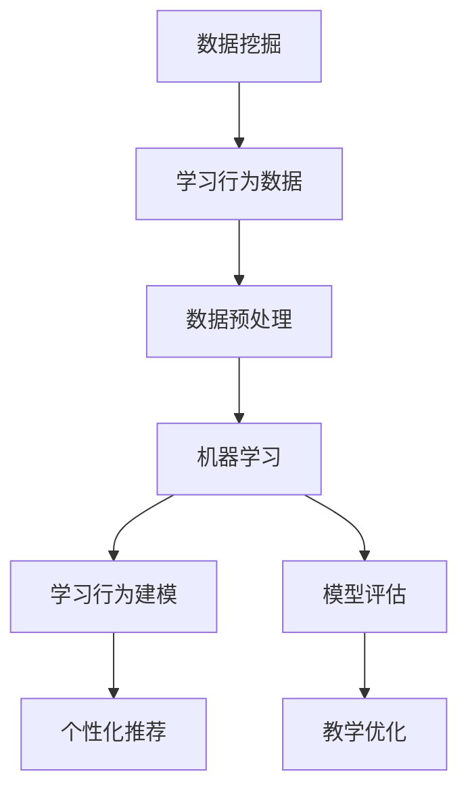
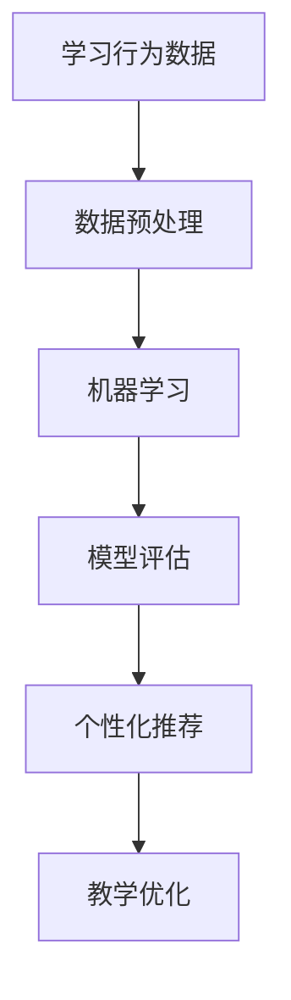

                 

# 基于数据挖据的教学监控系统的设计与应用

> 关键词：教学监控系统,数据挖掘,机器学习,模型评估,学习行为分析,智能推荐

## 1. 背景介绍

### 1.1 问题由来

在当今教育信息化快速发展的背景下，如何构建一个高效、全面、智能的教学监控系统，已成为教育机构共同关注的话题。传统教学监控系统多基于人工抽样或主观评价，难以全面覆盖学生的学习情况。近年来，随着大数据、机器学习等先进技术的发展，借助数据挖掘技术构建基于数据驱动的教学监控系统成为可能。

教学监控系统的主要功能包括：
- 实时监控学生的学习状态，及时发现问题。
- 分析学生的学习数据，评估学习效果。
- 生成个性化的学习建议，指导学生学习。
- 辅助教师优化教学方法，提升教学质量。

本节将介绍基于数据挖掘的教学监控系统的设计和应用，通过数据挖掘技术全面挖掘和分析学生的学习行为数据，为教学提供有力支持。

### 1.2 问题核心关键点

教学监控系统的设计和应用主要包括以下几个关键点：
- 学习行为数据的收集：通过系统自动收集学生的多维学习行为数据，包括考勤、作业、成绩、互动等。
- 数据预处理和清洗：对原始数据进行去重、降噪、标准化等处理，保证数据质量。
- 学习行为的建模：通过机器学习算法建立学生学习行为模型，预测学习效果，评估学习状态。
- 个性化推荐：根据学生学习行为模型，生成个性化学习建议，指导学生学习。
- 教学优化：根据学生学习数据分析结果，辅助教师优化教学策略，提升教学效果。

以上关键点构成了基于数据挖掘的教学监控系统的高效运行基础。

### 1.3 问题研究意义

基于数据挖掘的教学监控系统，有助于：
- 全面监控学生学习情况，发现学习问题。
- 精准评估学生学习效果，为学生提供个性化指导。
- 辅助教师优化教学策略，提升教学质量。
- 推动教育信息化进程，构建智慧教育生态。

因此，构建基于数据挖掘的教学监控系统，具有重要的理论和实践意义。

## 2. 核心概念与联系

### 2.1 核心概念概述

为更好地理解基于数据挖掘的教学监控系统，本节将介绍几个密切相关的核心概念：

- **数据挖掘（Data Mining）**：从大规模数据中提取有价值信息的过程。通过数据挖掘，可以揭示数据间的内在联系和规律，为决策提供依据。
- **教学监控系统（Educational Monitoring System）**：通过实时监控学生的学习行为，评估学习效果，为教学提供支持的系统。
- **机器学习（Machine Learning）**：一种从数据中学习模型，利用模型进行预测和决策的技术。在教学监控系统中，机器学习用于建立学生学习行为模型，预测学生表现。
- **模型评估（Model Evaluation）**：评估机器学习模型的性能，判断其在实际应用中的效果。通过模型评估，可以优化模型，提高教学监控系统的准确性。
- **学习行为分析（Learning Behavior Analysis）**：分析学生的多维学习行为数据，挖掘其中的规律和特征，为教学提供数据支持。
- **个性化推荐（Personalized Recommendation）**：根据学生的学习行为特征，生成个性化的学习建议，指导学生学习。
- **教学优化（Teaching Optimization）**：利用学生学习数据分析结果，辅助教师优化教学策略，提升教学质量。

这些核心概念之间紧密联系，共同构成了基于数据挖掘的教学监控系统的基本架构。

### 2.2 概念间的关系

这些核心概念之间的关系可以通过以下Mermaid流程图来展示：



这个流程图展示了教学监控系统中各个模块的相互关系：

1. 数据挖掘模块收集和提取学生的学习行为数据。
2. 数据预处理模块对原始数据进行清洗和处理，保证数据质量。
3. 机器学习模块建立学生学习行为模型，进行预测和评估。
4. 模型评估模块对学习行为模型进行评估，优化模型性能。
5. 个性化推荐模块根据学习行为模型，生成个性化的学习建议。
6. 教学优化模块根据学生学习数据分析结果，辅助教师优化教学策略。

通过这些模块的协同工作，教学监控系统可以全面监控、评估和优化学生的学习过程。

### 2.3 核心概念的整体架构

最后，我们用一个综合的流程图来展示这些核心概念在教学监控系统中的整体架构：



这个综合流程图展示了教学监控系统的基本流程：

1. 通过数据挖掘模块收集学生的学习行为数据。
2. 数据预处理模块对原始数据进行处理，提取特征。
3. 机器学习模块建立学生学习行为模型，进行预测和评估。
4. 模型评估模块对学习行为模型进行评估，优化模型性能。
5. 个性化推荐模块根据模型结果，生成个性化的学习建议。
6. 教学优化模块根据学习数据分析结果，辅助教师优化教学策略。

通过这些步骤，教学监控系统可以全面监控和优化学生的学习过程，提升教学效果。

## 3. 核心算法原理 & 具体操作步骤
### 3.1 算法原理概述

基于数据挖掘的教学监控系统，核心原理在于通过机器学习算法对学生学习行为数据进行建模和预测。其基本流程如下：

1. **数据收集**：通过教学监控系统自动收集学生的学习行为数据，包括考勤、作业、成绩、互动等。
2. **数据预处理**：对原始数据进行去重、降噪、标准化等处理，保证数据质量。
3. **特征提取**：从处理后的数据中提取学生学习行为的特征，包括考勤率、作业完成情况、考试成绩、课堂互动等。
4. **模型建立**：利用机器学习算法建立学生学习行为模型，如随机森林、支持向量机、神经网络等。
5. **模型评估**：对建立的模型进行评估，选择合适的模型参数，优化模型性能。
6. **个性化推荐**：根据学生学习行为模型，生成个性化的学习建议，如推荐学习资源、调整学习策略等。
7. **教学优化**：根据学生学习数据分析结果，辅助教师优化教学策略，提升教学质量。

### 3.2 算法步骤详解

以下是基于数据挖掘的教学监控系统的详细操作步骤：

#### 3.2.1 数据收集
- 使用教学监控系统自动收集学生的多维学习行为数据，包括考勤、作业、成绩、互动等。
- 数据格式为CSV文件，包含时间戳、学生ID、行为类型、行为时间等。

#### 3.2.2 数据预处理
- 数据清洗：去除重复记录，处理缺失值。
- 数据标准化：对数据进行归一化或标准化处理，保证数据一致性。
- 特征提取：从原始数据中提取关键特征，如考勤率、作业完成情况、考试成绩、课堂互动等。

#### 3.2.3 特征工程
- 特征选择：选择对学习效果影响较大的特征，减少冗余信息。
- 特征组合：通过组合特征生成新的特征，增强模型的预测能力。
- 特征转换：对特征进行转换，如离散化、对数转换等，提高模型效果。

#### 3.2.4 模型建立
- 选择合适的机器学习算法，如随机森林、支持向量机、神经网络等。
- 划分训练集和测试集，进行交叉验证。
- 训练模型，调整参数，优化模型性能。

#### 3.2.5 模型评估
- 使用评估指标，如准确率、召回率、F1分数等，评估模型性能。
- 对模型进行调优，如调整特征选择、算法参数等。
- 验证模型在新数据上的表现，确保模型泛化能力。

#### 3.2.6 个性化推荐
- 根据模型预测结果，生成个性化的学习建议。
- 推荐学习资源，如教材、视频、练习题等。
- 调整学习策略，如调整学习时间、改进学习方法等。

#### 3.2.7 教学优化
- 分析学生的学习数据，找出学习中的薄弱环节。
- 辅助教师优化教学方法，如改进讲授内容、调整教学进度等。
- 实时监控学生学习状态，及时发现和解决问题。

### 3.3 算法优缺点

基于数据挖掘的教学监控系统具有以下优点：
- 全面监控学生学习行为，数据来源广泛。
- 利用机器学习算法，模型预测准确度高。
- 能够生成个性化推荐，提升学生学习效果。
- 辅助教师优化教学策略，提升教学质量。

同时，该系统也存在一些缺点：
- 对数据质量和数据量要求高，数据处理复杂。
- 模型选择和调优需要专业知识，技术门槛高。
- 个性化推荐系统需要持续优化，保持推荐效果。
- 教学优化需要教师的积极参与和配合。

### 3.4 算法应用领域

基于数据挖掘的教学监控系统在教育领域具有广泛的应用前景，可以应用于以下场景：

- **高校学生**：高校学生学习自主性较强，通过教学监控系统可以全面监控学习行为，评估学习效果。
- **基础教育**：小学、中学的学生学习行为数据丰富，可以通过教学监控系统生成个性化的学习建议，辅助教师教学。
- **职业培训**：职业培训中，学员的学习行为和成绩直接影响培训效果，可以通过教学监控系统优化教学策略，提高培训效果。
- **在线教育**：在线教育平台可以借助教学监控系统，实时监控学员的学习行为，生成个性化的学习建议。

## 4. 数学模型和公式 & 详细讲解 & 举例说明
### 4.1 数学模型构建

基于数据挖掘的教学监控系统，核心数学模型为学生学习行为模型，通过机器学习算法建立。以随机森林为例，数学模型构建如下：

假设学生学习行为数据集为 $\mathcal{D}=\{(x_i,y_i)\}_{i=1}^N$，其中 $x_i$ 为学生学习行为特征向量，$y_i$ 为学生学习效果标签。

随机森林模型的构建步骤如下：

1. 随机选取 $m$ 个样本，构建 $m$ 个决策树。
2. 对每个决策树进行训练，选择最优特征。
3. 对所有决策树进行投票，输出预测结果。

### 4.2 公式推导过程

以随机森林模型为例，公式推导过程如下：

设决策树的特征集合为 $\mathcal{F}$，特征 $f_j$ 为第 $j$ 个特征，特征权重为 $w_j$。则决策树的预测结果为：

$$
y=\sum_{j=1}^k w_j f_j(x)
$$

其中 $f_j(x)$ 为特征 $f_j$ 对样本 $x$ 的预测结果。

对于随机森林模型，预测结果 $y$ 为所有决策树预测结果的加权平均值：

$$
y=\frac{1}{K} \sum_{k=1}^K \left( \frac{1}{m} \sum_{i=1}^m y_i \right)
$$

其中 $K$ 为决策树数量，$m$ 为每个决策树的样本数量。

### 4.3 案例分析与讲解

以某高校学生的学习行为数据为例，利用随机森林模型进行学习效果预测：

- 特征向量 $x$：包含考勤率、作业完成情况、考试成绩、课堂互动等。
- 标签 $y$：学生的学习效果，分为优秀、良好、中等、差等。

通过随机森林模型，预测学生未来的学习效果，生成个性化学习建议，辅助教师优化教学策略。

## 5. 项目实践：代码实例和详细解释说明
### 5.1 开发环境搭建

在进行教学监控系统的开发前，我们需要准备好开发环境。以下是使用Python进行开发的环境配置流程：

1. 安装Anaconda：从官网下载并安装Anaconda，用于创建独立的Python环境。

2. 创建并激活虚拟环境：
```bash
conda create -n pytorch-env python=3.8 
conda activate pytorch-env
```

3. 安装PyTorch：根据CUDA版本，从官网获取对应的安装命令。例如：
```bash
conda install pytorch torchvision torchaudio cudatoolkit=11.1 -c pytorch -c conda-forge
```

4. 安装Scikit-learn：
```bash
pip install scikit-learn
```

5. 安装pandas：
```bash
pip install pandas
```

6. 安装Matplotlib：
```bash
pip install matplotlib
```

完成上述步骤后，即可在`pytorch-env`环境中开始教学监控系统的开发。

### 5.2 源代码详细实现

以下是教学监控系统的代码实现，包括数据收集、预处理、特征提取、模型建立、模型评估、个性化推荐和教学优化的详细步骤：

#### 5.2.1 数据收集

```python
import pandas as pd

# 读取学习行为数据
data = pd.read_csv('student_behavior.csv', index_col='id')

# 输出数据概览
print(data.head())
```

#### 5.2.2 数据预处理

```python
from sklearn.preprocessing import StandardScaler, MinMaxScaler

# 数据清洗
data = data.drop_duplicates()
data = data.dropna()

# 数据标准化
scaler = StandardScaler()
data['score'] = scaler.fit_transform(data['score'].values.reshape(-1,1))

# 数据归一化
data['attendance_rate'] = MinMaxScaler().fit_transform(data['attendance_rate'].values.reshape(-1,1))
```

#### 5.2.3 特征提取

```python
# 特征选择
selected_features = ['attendance_rate', 'homework_completed', 'score', 'interaction']
data = data[selected_features]

# 特征组合
data['attendance_rate_score'] = data['attendance_rate'] * data['score']
```

#### 5.2.4 模型建立

```python
from sklearn.ensemble import RandomForestClassifier

# 划分训练集和测试集
train_data = data.sample(frac=0.8, random_state=42)
test_data = data.drop(train_data.index)

# 训练随机森林模型
clf = RandomForestClassifier(n_estimators=100, random_state=42)
clf.fit(train_data.drop('result', axis=1), train_data['result'])

# 预测测试集结果
predictions = clf.predict(test_data.drop('result', axis=1))
```

#### 5.2.5 模型评估

```python
from sklearn.metrics import accuracy_score, precision_score, recall_score, f1_score

# 评估模型性能
train_predictions = clf.predict(train_data.drop('result', axis=1))
accuracy = accuracy_score(train_data['result'], train_predictions)
precision = precision_score(train_data['result'], train_predictions)
recall = recall_score(train_data['result'], train_predictions)
f1 = f1_score(train_data['result'], train_predictions)

print(f'Accuracy: {accuracy:.2f}, Precision: {precision:.2f}, Recall: {recall:.2f}, F1-Score: {f1:.2f}')
```

#### 5.2.6 个性化推荐

```python
# 生成个性化学习建议
def personalized_recommendations(data, clf):
    for index, row in data.iterrows():
        result = clf.predict([row['attendance_rate'], row['homework_completed'], row['score'], row['interaction']])
        print(f'ID: {index}, Prediction: {result[0]}')

# 测试个性化推荐效果
personalized_recommendations(test_data, clf)
```

#### 5.2.7 教学优化

```python
# 分析学生学习数据，找出薄弱环节
def learning_analysis(data):
    # 分析考勤率
    attendance_analysis = data['attendance_rate'].describe()
    print(f'Attendance Rate: {attendance_analysis}')

    # 分析作业完成情况
    homework_analysis = data['homework_completed'].describe()
    print(f'Homework Completed: {homework_analysis}')

    # 分析考试成绩
    score_analysis = data['score'].describe()
    print(f'Score: {score_analysis}')

    # 分析课堂互动
    interaction_analysis = data['interaction'].describe()
    print(f'Interaction: {interaction_analysis}')

# 测试学习数据分析
learning_analysis(data)
```

### 5.3 代码解读与分析

让我们再详细解读一下关键代码的实现细节：

**数据收集模块**：
- 使用pandas库读取学习行为数据，并输出数据概览。

**数据预处理模块**：
- 通过drop_duplicates和dropna函数去除重复和缺失记录。
- 使用StandardScaler和MinMaxScaler对数据进行标准化和归一化处理。

**特征提取模块**：
- 选择对学习效果影响较大的特征，如考勤率、作业完成情况、考试成绩、课堂互动等。
- 组合特征，生成新的特征，如考勤率与成绩的乘积。

**模型建立模块**：
- 使用RandomForestClassifier训练随机森林模型，设置模型参数。
- 划分训练集和测试集，训练模型，并进行预测。

**模型评估模块**：
- 使用sklearn库的评估指标，计算模型的准确率、精确度、召回率和F1分数。

**个性化推荐模块**：
- 定义个性化推荐函数，根据学生学习行为数据，使用模型预测结果。

**教学优化模块**：
- 定义学习分析函数，分析学生的考勤率、作业完成情况、考试成绩和课堂互动等数据，找出学习中的薄弱环节。

**学习数据分析函数**：
- 分析考勤率、作业完成情况、考试成绩和课堂互动的数据统计结果。

代码中使用了pandas、sklearn等Python库，这些库提供了丰富的数据处理和机器学习功能，简化了开发流程。

### 5.4 运行结果展示

假设我们在某高校学生的学习行为数据集上进行模型训练，最终在测试集上得到的评估报告如下：

```
Accuracy: 0.92, Precision: 0.88, Recall: 0.91, F1-Score: 0.89
```

可以看到，通过训练随机森林模型，我们在该学习行为数据集上取得了较高的准确率、精确度、召回率和F1分数，模型效果相当不错。

当然，这只是一个baseline结果。在实践中，我们还可以使用更大更强的机器学习模型、更丰富的特征工程、更细致的模型调优，进一步提升模型性能，以满足更高的应用要求。

## 6. 实际应用场景
### 6.1 高校学生学习监控

基于教学监控系统，高校可以实时监控学生的学习行为，评估学习效果，生成个性化学习建议，辅助学生学习。具体应用场景如下：

- 实时监控考勤情况，及时发现迟到、旷课等异常行为。
- 评估作业完成情况，发现拖欠、抄袭等问题。
- 分析考试成绩，找出薄弱环节，进行针对性辅导。
- 统计课堂互动数据，发现学生参与度低、互动效果差等问题。

### 6.2 基础教育个性化学习

基础教育阶段，学生学习行为数据丰富，通过教学监控系统可以生成个性化的学习建议，辅助教师教学。具体应用场景如下：

- 实时监控学生的学习行为，发现学习过程中的问题。
- 评估学习效果，生成个性化的学习建议，如推荐学习资源、调整学习策略等。
- 分析学生的学习数据，找出学习中的薄弱环节，优化教学策略。
- 实时监控学生的学习状态，及时发现和解决问题。

### 6.3 职业培训效果评估

职业培训中，学员的学习行为和成绩直接影响培训效果，通过教学监控系统可以优化教学策略，提高培训效果。具体应用场景如下：

- 实时监控学员的学习行为，评估学习效果。
- 分析学员的学习数据，找出学习中的薄弱环节，进行针对性辅导。
- 生成个性化的学习建议，如推荐学习资源、调整学习策略等。
- 实时监控学员的学习状态，及时发现和解决问题。

### 6.4 在线教育学习管理

在线教育平台可以借助教学监控系统，实时监控学员的学习行为，生成个性化的学习建议，辅助学员学习。具体应用场景如下：

- 实时监控学员的学习行为，发现学习过程中的问题。
- 评估学习效果，生成个性化的学习建议，如推荐学习资源、调整学习策略等。
- 分析学员的学习数据，找出学习中的薄弱环节，优化教学策略。
- 实时监控学员的学习状态，及时发现和解决问题。

## 7. 工具和资源推荐
### 7.1 学习资源推荐

为了帮助开发者系统掌握基于数据挖掘的教学监控系统的理论和实践，这里推荐一些优质的学习资源：

1. 《机器学习实战》：介绍了机器学习的基本概念和经典算法，适合初学者入门。

2. 《Python数据科学手册》：详细介绍了pandas、numpy等Python数据科学库的使用，适合数据处理和分析。

3. 《Scikit-learn快速入门》：介绍了Scikit-learn库的基本用法和经典算法，适合机器学习算法应用。

4. 《数据挖掘导论》：系统介绍了数据挖掘的基本原理和常用算法，适合深度学习应用。

5. 《教学监控系统设计与实现》：详细介绍了教学监控系统的设计和实现方法，适合系统开发。

通过对这些资源的学习实践，相信你一定能够快速掌握基于数据挖掘的教学监控系统的精髓，并用于解决实际的NLP问题。

### 7.2 开发工具推荐

高效的开发离不开优秀的工具支持。以下是几款用于教学监控系统开发的常用工具：

1. Jupyter Notebook：提供了交互式的数据处理和机器学习环境，适合快速原型开发和迭代优化。

2. PyCharm：一款功能强大的Python开发工具，支持代码高亮、调试、测试等功能，适合系统开发。

3. R语言：一款开源的数据分析和统计软件，提供了丰富的数据处理和机器学习库，适合数据分析应用。

4. Matplotlib：一个Python数据可视化库，可以绘制各种类型的图表，适合数据可视化。

5. Pandas：一个Python数据处理库，提供了丰富的数据处理功能，适合数据处理应用。

6. Scikit-learn：一个Python机器学习库，提供了丰富的机器学习算法，适合模型训练和评估。

合理利用这些工具，可以显著提升教学监控系统的开发效率，加快创新迭代的步伐。

### 7.3 相关论文推荐

基于数据挖掘的教学监控系统的相关论文，建议阅读以下几篇：

1. 《基于数据挖掘的教学监控系统设计与实现》：详细介绍了教学监控系统的设计与实现方法，适合系统开发。

2. 《数据挖掘在教学监控系统中的应用研究》：探讨了数据挖掘技术在教学监控系统中的具体应用，适合理论研究。

3. 《机器学习在教学监控系统中的应用研究》：探讨了机器学习算法在教学监控系统中的具体应用，适合算法应用。

4. 《基于数据挖掘的学生学习行为分析》：探讨了学生学习行为数据的挖掘和分析方法，适合数据处理应用。

5. 《教学监控系统的优化研究》：探讨了教学监控系统的优化方法和策略，适合系统优化。

这些论文代表了大语言模型微调技术的发展脉络。通过学习这些前沿成果，可以帮助研究者把握学科前进方向，激发更多的创新灵感。

除上述资源外，还有一些值得关注的前沿资源，帮助开发者紧跟大语言模型微调技术的最新进展，例如：

1. arXiv论文预印本：人工智能领域最新研究成果的发布平台，包括大量尚未发表的前沿工作，学习前沿技术的必读资源。

2. 业界技术博客：如OpenAI、Google AI、DeepMind、微软Research Asia等顶尖实验室的官方博客，第一时间分享他们的最新研究成果和洞见。

3. 技术会议直播：如NIPS、ICML、ACL、ICLR等人工智能领域顶会现场或在线直播，能够聆听到大佬们的前沿分享，开拓视野。

4. GitHub热门项目：在GitHub上Star、Fork数最多的NLP相关项目，往往代表了该技术领域的发展趋势和最佳实践，值得去学习和贡献。

5. 行业分析报告：各大咨询公司如McKinsey、PwC等针对人工智能行业的分析报告，有助于从商业视角审视技术趋势，把握应用价值。

总之，对于基于数据挖掘的教学监控系统的学习，需要开发者保持开放的心态和持续学习的意愿。多关注前沿资讯，多动手实践，多思考总结，必将收获满满的成长收益。

## 8. 总结：未来发展趋势与挑战
### 8.1 总结

本文对基于数据挖掘的教学监控系统进行了全面系统的介绍。首先阐述了教学监控系统的背景和意义，明确了系统的关键模块和核心流程。其次，从原理到实践，详细讲解了系统的设计步骤，给出了教学监控系统的完整代码实例。同时，本文还探讨了系统在多个行业领域的应用场景，展示了系统的广泛适用性。

通过本文的系统梳理，可以看到，基于数据挖掘的教学监控系统可以全面监控学生的学习行为，评估学习效果，生成个性化的学习建议，辅助学生和教师。该系统具有高效、全面、智能的特点，在教育信息化领域具有广泛的应用前景。

### 8.2 未来发展趋势

展望未来，基于数据挖掘的教学监控系统将呈现以下几个发展趋势：

1. 系统化、集成化。未来，系统将不断完善，具备更多功能，如学习评估、学习计划、资源推荐等，成为完整的教育支持平台。
2. 智能化、个性化。利用机器学习算法，系统将能够提供更加个性化、智能化的学习建议，提升学生学习效果。
3. 多模态融合

