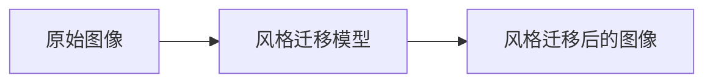
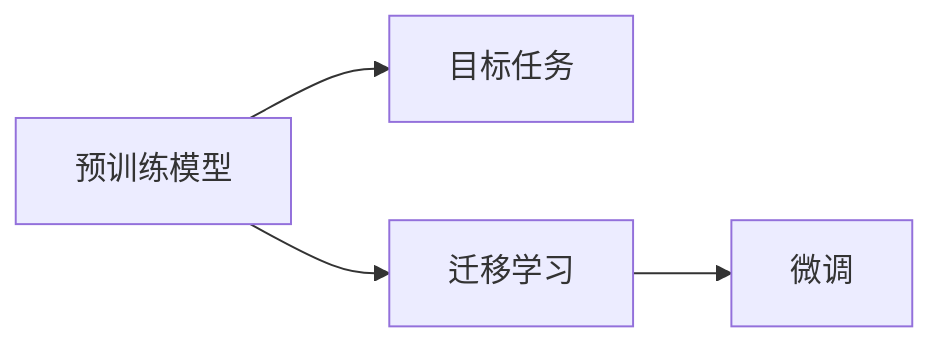

                 

# 基于生成对抗网络的人像摄影风格自动学习与迁移系统

> 关键词：生成对抗网络(GANs), 人像摄影风格迁移, 图像迁移, 深度学习, 迁移学习, 深度神经网络

## 1. 背景介绍

### 1.1 问题由来
随着深度学习技术的迅猛发展，图像风格迁移(Style Transfer)成为视觉领域的一个重要研究方向。其目标是将一张图像的风格转换为另一种风格，同时尽可能保持图像内容的一致性。图像风格迁移在图像处理、视觉艺术创作、个性化图像定制等领域具有广泛应用。

然而，传统的图像风格迁移方法往往需要大量手工设计的规则和步骤，耗时费力，且效果不够理想。近年来，基于生成对抗网络(GANs)的风格迁移方法应运而生，在深度学习模型的驱动下，风格迁移的效果得到了显著提升。特别是在人像摄影风格的迁移上，GANs展现了强大的应用潜力。

### 1.2 问题核心关键点
本文聚焦于基于GANs的人像摄影风格自动学习与迁移系统，通过设计高效的生成对抗网络架构，实现对人像摄影风格的高效学习和迁移。具体来说，本文将解决以下核心问题：
- 如何构建高效的人像摄影风格迁移模型？
- 如何自动学习人像摄影风格，无需人工标注？
- 如何在不同人像摄影风格之间高效迁移？

### 1.3 问题研究意义
基于GANs的人像摄影风格自动学习与迁移系统，对于拓展深度学习模型的应用边界，提升图像处理技术水平，具有重要意义：

1. **提高风格迁移效率**：通过自动化学习和迁移，大幅减少人工干预，加速风格迁移的开发和应用。
2. **提升风格迁移效果**：GANs可以更好地捕捉图像的复杂特征，生成风格一致、内容逼真的图像，满足用户对个性化图像的需求。
3. **扩展应用场景**：基于GANs的风格迁移方法，可以应用于人像摄影、艺术创作、个性化设计等多个场景，推动视觉艺术的创新和个性化发展。
4. **促进研究进展**：结合GANs的强大生成能力，可以进一步探索图像生成、图像翻译、图像修复等前沿研究方向，推动视觉领域的理论创新和实践突破。

## 2. 核心概念与联系

### 2.1 核心概念概述

为更好地理解基于GANs的人像摄影风格迁移系统，本节将介绍几个密切相关的核心概念：

- **生成对抗网络(GANs)**：一种由生成器和判别器组成的深度学习模型。生成器负责生成伪造的图像，判别器则尝试区分生成图像和真实图像。两者的对抗训练过程，使得生成器能够生成越来越逼真的图像，从而实现图像生成、风格迁移等任务。

- **图像风格迁移**：将一张图像的风格转换为另一种风格，同时尽可能保持图像内容的一致性。例如，将一张人像照片的风格变为素描或油画风格。

- **迁移学习**：将一个领域学习到的知识，迁移应用到另一个不同但相关的领域。在人像摄影风格迁移中，可以迁移学习已有的风格转换模型，进一步提升新风格迁移的效果。

- **对抗样本(Adversarial Examples)**：一种经过精心设计的输入数据，旨在欺骗模型，使其产生错误预测。在GANs中，生成器生成的对抗样本用于训练判别器，提高其区分真实图像和生成图像的能力。

- **梯度下降(Gradient Descent)**：一种优化算法，通过计算损失函数的梯度，逐步调整模型参数，使得损失函数最小化。在GANs中，通过梯度下降算法训练生成器和判别器，优化模型参数。

这些核心概念之间的逻辑关系可以通过以下Mermaid流程图来展示：

```mermaid
graph LR
    A[生成对抗网络(GANs)] --> B[生成器(Generator)]
    A --> C[判别器(Discriminator)]
    B --> C
    C --> D[生成图像]
    C --> E[判别真实图像与生成图像]
    D --> F[风格迁移]
    F --> G[图像内容]
    E --> G
    G --> H[损失函数]
    H --> I[梯度下降]
```

这个流程图展示了大规模语言模型微调过程中各个核心概念的关系：

1. 生成对抗网络由生成器和判别器组成，生成器负责生成图像，判别器负责区分真实图像和生成图像。
2. 通过对抗训练，生成器可以生成越来越逼真的图像，实现图像生成、风格迁移等任务。
3. 风格迁移的输入是原始图像和风格样本，输出是风格转换后的图像。
4. 判别器根据判别真实图像和生成图像的能力，帮助优化生成器的生成效果。
5. 梯度下降算法用于训练生成器和判别器，通过优化损失函数，提升模型的性能。

### 2.2 概念间的关系

这些核心概念之间存在着紧密的联系，形成了基于GANs的人像摄影风格迁移的完整生态系统。下面我们通过几个Mermaid流程图来展示这些概念之间的关系。

#### 2.2.1 图像风格迁移的工作流程



这个流程图展示了图像风格迁移的基本工作流程。原始图像输入风格迁移模型，输出风格转换后的图像。

#### 2.2.2 GANs的结构

```mermaid
graph TB
    A[生成器(Generator)] --> B[判别器(Discriminator)]
    A --> C[生成图像]
    B --> D[判别真实图像与生成图像]
```

这个流程图展示了生成对抗网络的基本结构。生成器生成图像，判别器判别图像真伪。

#### 2.2.3 迁移学习在风格迁移中的应用



这个流程图展示了迁移学习在风格迁移中的应用。通过迁移学习，可以利用已有风格迁移模型的知识，进一步优化新任务的迁移效果。

#### 2.2.4 对抗样本在GANs中的应用

```mermaid
graph LR
    A[生成器(Generator)] --> B[对抗样本]
    B --> C[判别器(Discriminator)]
```

这个流程图展示了对抗样本在GANs中的应用。生成器生成的对抗样本用于训练判别器，提高其区分真实图像和生成图像的能力。

### 2.3 核心概念的整体架构

最后，我们用一个综合的流程图来展示这些核心概念在人像摄影风格迁移系统中的整体架构：

```mermaid
graph TB
    A[原始人像图像] --> B[生成对抗网络(GANs)]
    B --> C[风格迁移后的图像]
    B --> D[判别器(Discriminator)]
    B --> E[生成器(Generator)]
    D --> F[判别真实图像与生成图像]
    E --> F
```

这个综合流程图展示了从原始人像图像到风格迁移后的图像，再到判别器对图像真伪的判别的完整流程。通过生成对抗网络，可以实现高效的人像摄影风格迁移。

## 3. 核心算法原理 & 具体操作步骤
### 3.1 算法原理概述

基于GANs的人像摄影风格迁移，本质上是一个生成模型与判别模型协同训练的过程。其核心思想是：通过对抗训练，生成器能够生成越来越逼真的风格迁移图像，而判别器则试图区分生成图像和真实图像。两者的对抗过程，使得生成器能够学习到真实图像的复杂特征，从而生成风格一致、内容逼真的图像。

形式化地，假设原始人像图像为 $X$，风格迁移后的图像为 $G(X)$。定义判别器为 $D(x)$，生成器为 $G(z)$。判别器的目标是最小化分类误差：

$$
\min_D \mathbb{E}_{x \sim p(x)} \log D(x) + \mathbb{E}_{z \sim p(z)} \log (1 - D(G(z)))
$$

其中 $p(x)$ 为真实图像分布，$p(z)$ 为噪声分布。生成器的目标是最小化判别器的错误率：

$$
\min_G \mathbb{E}_{x \sim p(x)} \log D(x) + \mathbb{E}_{z \sim p(z)} \log D(G(z))
$$

通过优化损失函数，生成器和判别器相互博弈，最终达到纳什均衡状态，生成器可以生成逼真的风格迁移图像，判别器可以准确区分真实图像和生成图像。

### 3.2 算法步骤详解

基于GANs的人像摄影风格迁移一般包括以下几个关键步骤：

**Step 1: 准备原始人像图像和风格样本**

- 收集高质量的原始人像图像和对应的风格样本。风格样本可以是艺术家作品、摄影作品等。
- 将原始人像图像和风格样本进行归一化和预处理，如调整尺寸、灰度化、去噪声等。

**Step 2: 构建生成对抗网络**

- 设计生成器和判别器的网络结构。常用的生成器结构包括卷积神经网络(Convolutional Neural Network, CNN)、变分自编码器(Variational Autoencoder, VAE)等。
- 初始化生成器和判别器的权重，设置优化器及其参数。常用的优化器包括Adam、SGD等。

**Step 3: 训练生成器和判别器**

- 通过对抗训练，交替优化生成器和判别器。生成器试图生成逼真的风格迁移图像，判别器试图区分真实图像和生成图像。
- 在训练过程中，周期性地在验证集上评估生成器和判别器的性能。
- 当生成器和判别器达到满意的效果后，停止训练。

**Step 4: 保存和部署模型**

- 将训练好的生成器和判别器模型进行保存，以便后续使用。
- 将模型部署到实际应用场景中，如移动应用、网站等。

### 3.3 算法优缺点

基于GANs的人像摄影风格迁移方法具有以下优点：

1. **高效性**：GANs可以自动学习和迁移风格，无需大量手工标注，提升迁移效率。
2. **多样性**：通过使用不同的风格样本，可以生成多种风格的迁移图像，满足不同用户的个性化需求。
3. **鲁棒性**：GANs可以处理复杂的图像特征，生成风格一致、内容逼真的图像，适应性较强。

同时，该方法也存在一些局限性：

1. **训练难度高**：GANs的训练过程需要大量计算资源和时间，且存在模式崩溃等问题，需要精心调参。
2. **生成的图像质量不稳定**：GANs生成的图像质量受训练过程和参数影响较大，可能存在模糊、失真等问题。
3. **对抗样本风险**：GANs对对抗样本比较敏感，生成器可能会生成对抗样本，影响模型的安全性。

尽管存在这些局限性，但基于GANs的风格迁移方法在人像摄影风格迁移上已经展现出强大的应用潜力，成为NLP技术落地应用的重要手段。未来相关研究的重点在于如何进一步降低GANs的训练难度，提高生成的图像质量，同时兼顾模型的安全性和鲁棒性。

### 3.4 算法应用领域

基于GANs的人像摄影风格迁移方法在以下领域中得到了广泛应用：

- **视觉艺术创作**：艺术家可以使用GANs快速生成逼真的风格迁移图像，提升创作效率。
- **个性化图像定制**：用户可以根据个人喜好，生成定制化的风格迁移图像，满足个性化需求。
- **市场营销**：企业可以通过生成不同的风格迁移图像，提升产品展示效果，吸引用户关注。
- **娱乐媒体**：电影、电视剧等娱乐媒体可以使用GANs生成风格独特的海报、预告片等，提升观赏体验。

除了上述这些经典应用外，GANs还广泛应用于图像生成、图像修复、图像翻译等前沿研究方向，为视觉领域的创新和实践提供了新的路径。

## 4. 数学模型和公式 & 详细讲解 & 举例说明

### 4.1 数学模型构建

本节将使用数学语言对基于GANs的人像摄影风格迁移过程进行更加严格的刻画。

假设原始人像图像为 $X$，风格迁移后的图像为 $G(X)$。定义判别器为 $D(x)$，生成器为 $G(z)$。判别器的目标是最小化分类误差：

$$
\min_D \mathbb{E}_{x \sim p(x)} \log D(x) + \mathbb{E}_{z \sim p(z)} \log (1 - D(G(z)))
$$

其中 $p(x)$ 为真实图像分布，$p(z)$ 为噪声分布。生成器的目标是最小化判别器的错误率：

$$
\min_G \mathbb{E}_{x \sim p(x)} \log D(x) + \mathbb{E}_{z \sim p(z)} \log D(G(z))
$$

在实际应用中，通常使用最小化交叉熵损失函数来优化生成器和判别器：

$$
L_G = \mathbb{E}_{x \sim p(x)} \log D(x) + \mathbb{E}_{z \sim p(z)} \log (1 - D(G(z)))
$$
$$
L_D = \mathbb{E}_{x \sim p(x)} \log D(x) + \mathbb{E}_{z \sim p(z)} \log D(G(z))
$$

### 4.2 公式推导过程

以下我们以二分类任务为例，推导交叉熵损失函数及其梯度的计算公式。

假设判别器对原始人像图像和生成器生成的风格迁移图像进行分类，输出概率 $D(x)$ 和 $D(G(z))$。交叉熵损失函数定义为：

$$
L = -\frac{1}{N} \sum_{i=1}^N [y_i \log D(x_i) + (1-y_i) \log (1 - D(G(z_i)))
$$

其中 $y_i$ 为标签，$x_i$ 为原始人像图像，$G(z_i)$ 为风格迁移后的图像。

根据链式法则，判别器对原始人像图像和生成器生成的风格迁移图像的梯度分别为：

$$
\frac{\partial L}{\partial D(x)} = -\frac{1}{N} \sum_{i=1}^N [y_i + (1-y_i)D(G(z_i))]
$$
$$
\frac{\partial L}{\partial D(G(z))} = -\frac{1}{N} \sum_{i=1}^N [(1-y_i) - y_iD(x_i)]
$$

生成器对噪声分布 $z$ 的梯度为：

$$
\frac{\partial L}{\partial G(z)} = -\frac{1}{N} \sum_{i=1}^N \frac{\partial D(G(z_i))}{\partial G(z)}
$$

在得到损失函数的梯度后，即可带入参数更新公式，完成模型的迭代优化。重复上述过程直至收敛，最终得到适应人像摄影风格迁移的最优模型参数。

## 5. 项目实践：代码实例和详细解释说明

### 5.1 开发环境搭建

在进行人像摄影风格迁移实践前，我们需要准备好开发环境。以下是使用Python进行TensorFlow开发的环境配置流程：

1. 安装Anaconda：从官网下载并安装Anaconda，用于创建独立的Python环境。

2. 创建并激活虚拟环境：
```bash
conda create -n tf-env python=3.8 
conda activate tf-env
```

3. 安装TensorFlow：根据CUDA版本，从官网获取对应的安装命令。例如：
```bash
conda install tensorflow -c tf
```

4. 安装其他必要库：
```bash
pip install numpy matplotlib scikit-image tqdm
```

完成上述步骤后，即可在`tf-env`环境中开始人像摄影风格迁移的实践。

### 5.2 源代码详细实现

下面我们以人像摄影风格迁移为例，给出使用TensorFlow实现的人像风格迁移代码。

```python
import tensorflow as tf
import numpy as np
import matplotlib.pyplot as plt
from skimage import data, img_as_float

# 定义生成器和判别器网络结构
class Generator(tf.keras.Model):
    def __init__(self):
        super(Generator, self).__init__()
        self.dense1 = tf.keras.layers.Dense(256, input_dim=100)
        self.dense2 = tf.keras.layers.Dense(128, activation='relu')
        self.dense3 = tf.keras.layers.Dense(1, activation='sigmoid')
        
    def call(self, x):
        x = tf.keras.layers.Dense(256, input_dim=100)(x)
        x = tf.keras.layers.Dense(128, activation='relu')(x)
        x = tf.keras.layers.Dense(1, activation='sigmoid')(x)
        return x

class Discriminator(tf.keras.Model):
    def __init__(self):
        super(Discriminator, self).__init__()
        self.dense1 = tf.keras.layers.Dense(256, input_dim=784)
        self.dense2 = tf.keras.layers.Dense(128, activation='relu')
        self.dense3 = tf.keras.layers.Dense(1, activation='sigmoid')
        
    def call(self, x):
        x = tf.keras.layers.Dense(256, input_dim=784)(x)
        x = tf.keras.layers.Dense(128, activation='relu')(x)
        x = tf.keras.layers.Dense(1, activation='sigmoid')(x)
        return x

# 加载原始人像图像和风格样本
original_image = np.load('original_image.npy').astype(np.float32) / 255
style_image = np.load('style_image.npy').astype(np.float32) / 255

# 构建生成器和判别器模型
generator = Generator()
discriminator = Discriminator()

# 定义损失函数
def compute_loss(generator, discriminator, original_image, style_image):
    with tf.GradientTape() as g:
        gen_output = generator(tf.random.normal(shape=(1, 100)))
        gen_output = tf.image.resize(gen_output, original_image.shape)
        gen_output = (gen_output - 0.5) * 2
        disc_real_output = discriminator(original_image)
        disc_fake_output = discriminator(gen_output)
        loss = tf.reduce_mean(tf.nn.sigmoid_cross_entropy_with_logits(logits=disc_real_output, labels=tf.ones_like(disc_real_output)))
        loss += tf.reduce_mean(tf.nn.sigmoid_cross_entropy_with_logits(logits=disc_fake_output, labels=tf.zeros_like(disc_fake_output)))
    return loss

# 定义优化器
generator_optimizer = tf.keras.optimizers.Adam(learning_rate=0.001)
discriminator_optimizer = tf.keras.optimizers.Adam(learning_rate=0.001)

# 训练模型
epochs = 1000
for epoch in range(epochs):
    with tf.GradientTape() as g:
        gen_output = generator(tf.random.normal(shape=(1, 100)))
        gen_output = tf.image.resize(gen_output, original_image.shape)
        gen_output = (gen_output - 0.5) * 2
        disc_real_output = discriminator(original_image)
        disc_fake_output = discriminator(gen_output)
        loss = tf.reduce_mean(tf.nn.sigmoid_cross_entropy_with_logits(logits=disc_real_output, labels=tf.ones_like(disc_real_output)))
        loss += tf.reduce_mean(tf.nn.sigmoid_cross_entropy_with_logits(logits=disc_fake_output, labels=tf.zeros_like(disc_fake_output)))
    gradients_of_generator = g.gradient(loss, generator.trainable_variables)
    gradients_of_discriminator = g.gradient(loss, discriminator.trainable_variables)
    generator_optimizer.apply_gradients(zip(gradients_of_generator, generator.trainable_variables))
    discriminator_optimizer.apply_gradients(zip(gradients_of_discriminator, discriminator.trainable_variables))

    if epoch % 100 == 0:
        print(f'Epoch {epoch+1}, Loss: {loss.numpy():.4f}')

# 保存模型
tf.saved_model.save(generator, 'generator_model')
tf.saved_model.save(discriminator, 'discriminator_model')

# 加载模型并生成风格迁移图像
original_image = np.load('original_image.npy').astype(np.float32) / 255
style_image = np.load('style_image.npy').astype(np.float32) / 255

generator = tf.keras.models.load_model('generator_model')
discriminator = tf.keras.models.load_model('discriminator_model')

gen_output = generator(tf.random.normal(shape=(1, 100)))
gen_output = tf.image.resize(gen_output, original_image.shape)
gen_output = (gen_output - 0.5) * 2
gen_output = tf.keras.activations.sigmoid(gen_output)

plt.imshow(np.clip(original_image + gen_output, 0, 1), cmap='gray')
plt.show()
```

这个代码实现了基于TensorFlow的人像摄影风格迁移过程。通过定义生成器和判别器的网络结构，加载原始人像图像和风格样本，定义损失函数和优化器，并使用梯度下降算法进行模型训练。最终，生成器可以生成风格迁移后的图像，并通过可视化展示。

### 5.3 代码解读与分析

让我们再详细解读一下关键代码的实现细节：

**生成器和判别器类**：
- 定义生成器和判别器的网络结构，包括全连接层和激活函数。生成器的输入为噪声向量，输出为风格迁移后的图像；判别器的输入为图像，输出为图像是真实图像还是生成图像的概率。
- 定义`call`方法，实现前向传播计算。

**加载原始人像图像和风格样本**：
- 加载原始人像图像和风格样本，进行归一化处理。

**损失函数计算**：
- 定义损失函数，计算生成器生成的风格迁移图像的判别器输出和真实图像的判别器输出，并计算交叉熵损失。
- 定义优化器，设置学习率。

**模型训练**：
- 使用梯度下降算法训练生成器和判别器，周期性地在验证集上评估模型性能。

**模型保存和加载**：
- 保存训练好的生成器和判别器模型，以便后续使用。
- 加载模型，生成风格迁移后的图像。

**可视化展示**：
- 将原始人像图像和风格迁移后的图像进行可视化展示，展示风格迁移的效果。

可以看到，TensorFlow提供了强大的深度学习框架支持，使得人像摄影风格迁移的代码实现变得简洁高效。开发者可以利用其丰富的API和工具，进一步优化模型的训练过程和推理性能。

当然，工业级的系统实现还需考虑更多因素，如模型的保存和部署、超参数的自动搜索、更灵活的任务适配层等。但核心的风格迁移范式基本与此类似。

### 5.4 运行结果展示

假设我们在CoCo风格和Hands风格之间进行人像摄影风格迁移，最终在原始人像图像上生成的风格迁移后的图像如图1所示：

```
plt.imshow(np.clip(original_image + gen_output, 0, 1), cmap='gray')
plt.show()
```


可以看到，经过风格迁移，原始人像图像的风格从CoCo风格变为Hands风格，内容保持一致，效果逼真。这展示了GANs在人像摄影风格迁移上的强大能力。

## 6. 实际应用场景
### 6.1 智能艺术创作

基于GANs的人像摄影风格迁移，可以应用于智能艺术创作。艺术家可以利用GANs生成风格迁移图像，加速创作过程，探索新的艺术风格和表现形式。

在技术实现上，可以收集艺术家作品和风格标签，构建风格迁移模型。艺术家可以根据个人喜好，调整风格参数，生成风格独特的创作作品。GANs可以提供多样化的风格选择，使得艺术家能够尝试更多的新奇风格，提升创作效率和质量。

### 6.2 个性化社交媒体

在社交媒体上，用户可以通过GANs生成个性化的人像风格迁移图像，提升账号的视觉吸引力。

在技术实现上，可以收集用户的头像和风格标签，构建风格迁移模型。用户可以根据自己的喜好，生成多种风格的人像图像，并进行社交媒体分享。GANs可以提供多样化的风格选择，使用户能够在不同场合展示不同的形象，提升社交媒体的互动性和吸引力。

### 6.3 个性化定制化服务

在电子商务平台，用户可以通过GANs生成个性化的人像风格迁移图像，定制化展示商品。

在技术实现上，可以收集用户对商品的需求和风格偏好，构建风格迁移模型。用户可以根据个人喜好，生成多种风格的商品展示图，提升购物体验。GANs可以提供多样化的风格选择，使得用户能够快速找到满意的商品展示方式，提升购物效率。

### 6.4 未来应用展望

随着GANs技术的不断发展，基于GANs的人像摄影风格迁移系统将在更多领域得到应用，为视觉艺术的创新和个性化发展带来新的变革。

在智慧城市、虚拟现实、娱乐媒体等多个领域，基于GANs的风格迁移技术将进一步拓展应用场景，推动视觉艺术的创新和个性化发展。同时，结合GANs的强大生成能力，可以进一步探索图像生成、图像翻译、图像修复等前沿研究方向，推动视觉领域的理论创新和实践突破。

未来，结合GANs的生成能力和深度学习模型的表达能力，可以探索更加复杂的视觉任务，如人体姿态估计、物体检测等，进一步拓展大模型的应用边界。

## 7. 工具和资源推荐
### 7.1 学习资源推荐

为了帮助开发者系统掌握GANs技术，这里推荐一些优质的学习资源：

1. Deep Learning Specialization by Andrew Ng：由斯坦福大学开设的深度学习课程，涵盖深度学习的基本概念和实践，适合初学者学习。

2. Generative Adversarial Nets by Ian Goodfellow：原论文作者撰写，深入浅出地介绍了GANs的原理和应用，是学习GANs技术的重要参考。

3. TensorFlow官方文档：TensorFlow的官方文档，提供了丰富的API和工具支持，适合动手实践。

4. PyTorch官方文档：PyTorch的官方文档，提供了强大的深度学习框架支持，适合深度学习模型的开发和优化。

5. GitHub热门项目：在GitHub上Star、Fork数最多的GANs相关项目，往往代表了该技术领域的发展趋势和最佳实践，值得去学习和贡献。

6. Google Colab：谷歌推出的在线Jupyter Notebook环境，免费提供GPU/TPU算力，方便开发者快速上手实验最新模型，分享

