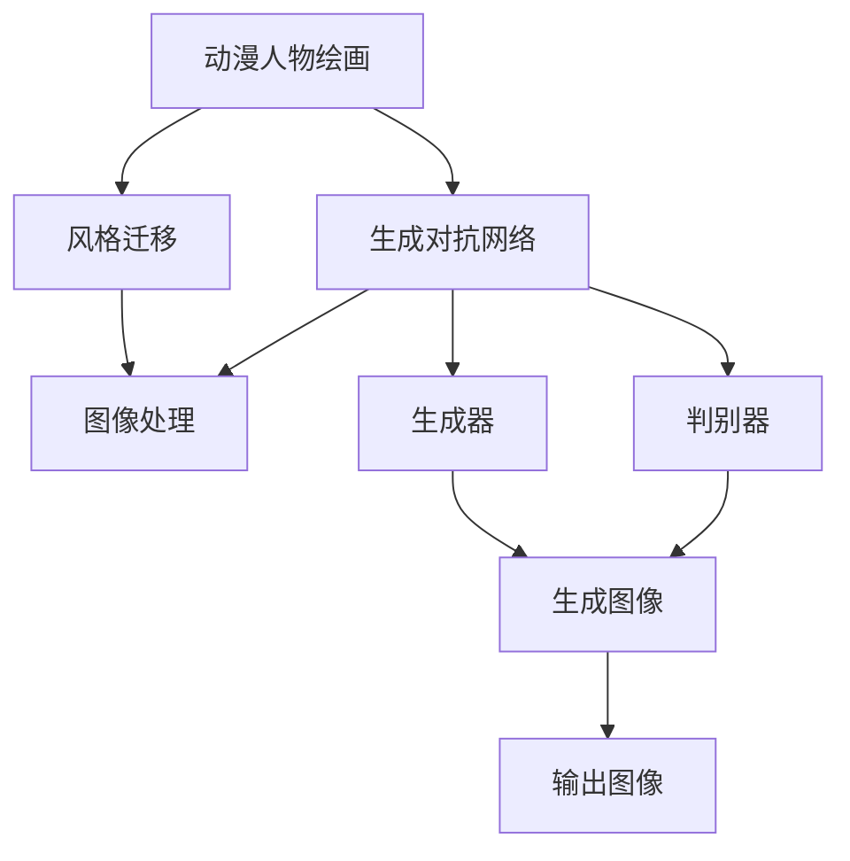

                 

# 基于生成对抗网络的动漫人物绘画风格迁移

> 关键词：生成对抗网络(GAN)，动漫人物绘画，风格迁移，图像处理，深度学习

## 1. 背景介绍

### 1.1 问题由来
在数字娱乐领域，动漫人物绘画风格迁移是一项极具挑战性的任务。它不仅要求模型能够捕捉到动漫人物独特的艺术风格，还必须能够在不改变人物姿态、表情和动作的前提下，将这些风格迁移到不同的背景或场景中。近年来，随着深度学习技术的快速发展，基于生成对抗网络（GAN）的风格迁移方法逐渐成为主流。然而，这些方法通常需要大量的训练数据，且对模型的参数优化和训练过程要求较高。因此，本文旨在介绍一种基于生成对抗网络的动漫人物绘画风格迁移方法，探讨其核心原理、算法步骤和实际应用。

### 1.2 问题核心关键点
在动漫人物绘画风格迁移任务中，核心问题在于如何将源动漫人物的绘画风格迁移到目标人物上，同时保持人物的姿态、表情和动作等特征。生成对抗网络（GAN）提供了一种有效的解决方案，通过训练生成器和判别器，实现风格的迁移和融合。具体而言，生成器通过学习源风格，将目标人物映射到具有源风格的新图像中；判别器则用于区分真实图像和生成的伪图像，指导生成器进行参数优化，从而逐步提升生成图像的质量。

### 1.3 问题研究意义
动漫人物绘画风格迁移技术不仅能够丰富数字娱乐内容，提升用户体验，还可以应用于虚拟现实、影视制作等多个领域。例如，在虚拟现实游戏中，用户可以通过该技术将自己的头像进行动漫风格化，提高游戏体验；在影视制作中，动画师可以通过迁移其他动漫作品的风格，快速创造出新的动画角色，提高工作效率。因此，本文的研究有助于推动这一技术的广泛应用，加速动漫和数字娱乐产业的创新发展。

## 2. 核心概念与联系

### 2.1 核心概念概述

在动漫人物绘画风格迁移任务中，涉及多个核心概念：

- 生成对抗网络（GAN）：一种由生成器和判别器组成的网络结构，通过对抗训练提升生成器生成图像的质量。
- 动漫人物绘画：指以动漫风格为特征的绘画作品，通常具有独特的线条、色彩和表现形式。
- 风格迁移：通过将源图像的风格特征迁移到目标图像上，得到具有源风格的新的图像。
- 图像处理：涉及图像的增强、分割、压缩、变形等技术，是实现风格迁移的重要基础。

这些核心概念之间存在紧密的联系，通过GAN技术，可以实现动漫人物绘画风格的迁移，从而实现图像处理和数字娱乐内容的创作。

### 2.2 概念间的关系

这些核心概念之间的关系可以用以下Mermaid流程图来展示：



这个流程图展示了从动漫人物绘画到风格迁移再到图像处理的过程。首先，动漫人物绘画风格通过生成对抗网络进行迁移，生成新的图像；然后，这些图像经过图像处理技术进行增强和优化；最终输出具有源动漫人物绘画风格的图像。

## 3. 核心算法原理 & 具体操作步骤
### 3.1 算法原理概述

基于生成对抗网络的动漫人物绘画风格迁移算法，主要包括以下几个步骤：

1. 数据准备：收集源动漫人物绘画和目标人物绘画的数据集。
2. 构建生成器和判别器：使用卷积神经网络（CNN）设计生成器和判别器的结构。
3. 对抗训练：通过对抗训练过程，提升生成器的生成能力。
4. 风格迁移：使用训练好的生成器对目标人物进行风格迁移，得到新的图像。
5. 图像后处理：对生成的图像进行后处理，如去噪、增强等，提升图像质量。

### 3.2 算法步骤详解

**Step 1: 数据准备**

- 收集源动漫人物绘画和目标人物绘画的数据集。数据集应包含源动漫人物的姿态、表情、动作等特征，以及目标人物的相关信息。
- 对数据集进行预处理，如归一化、数据增强等。

**Step 2: 构建生成器和判别器**

- 设计生成器：生成器通常由多个卷积层、池化层和反卷积层组成，用于将目标人物图像转换为具有源动漫人物绘画风格的新图像。
- 设计判别器：判别器同样由多个卷积层和池化层组成，用于区分真实图像和生成的伪图像。

**Step 3: 对抗训练**

- 初始化生成器和判别器的参数。
- 生成器尝试生成具有源动漫人物绘画风格的新图像，判别器尝试区分真实图像和生成的伪图像。
- 使用梯度下降等优化算法，更新生成器和判别器的参数，使得生成器能够更好地生成伪图像，判别器能够更好地区分真实图像和伪图像。
- 不断迭代，直到生成器生成的伪图像能够欺骗判别器，即判别器无法区分真实图像和生成的伪图像。

**Step 4: 风格迁移**

- 使用训练好的生成器对目标人物进行风格迁移，得到新的图像。
- 对生成的图像进行后处理，如去噪、增强等，提升图像质量。

**Step 5: 图像后处理**

- 对生成的图像进行去噪、增强等后处理，提升图像质量。
- 对处理后的图像进行可视化展示。

### 3.3 算法优缺点

基于生成对抗网络的动漫人物绘画风格迁移方法具有以下优点：

- 能够较好地保留人物姿态、表情和动作等特征，保持图像的连贯性。
- 通过对抗训练提升生成器的生成能力，能够生成高质量的动漫风格图像。
- 适用于不同的源动漫人物绘画和目标人物绘画，具有较好的泛化能力。

同时，该方法也存在一些缺点：

- 需要大量的训练数据，数据获取成本较高。
- 对抗训练过程需要较长的训练时间，对计算资源要求较高。
- 生成图像的质量和风格的迁移效果受训练数据和网络结构的影响较大，需要进行多次调试和优化。

### 3.4 算法应用领域

基于生成对抗网络的动漫人物绘画风格迁移方法可以应用于以下领域：

- 数字娱乐：将动漫人物绘画风格迁移到其他角色的图像上，丰富游戏、动画等娱乐内容。
- 影视制作：将动漫风格迁移到演员图像上，提升电影或电视剧的美学效果。
- 虚拟现实：将动漫风格迁移到虚拟现实中的角色，提高用户的沉浸感。
- 图像增强：通过风格迁移技术，对图像进行增强和优化，提升图像质量和美感。

## 4. 数学模型和公式 & 详细讲解 & 举例说明

### 4.1 数学模型构建

假设源动漫人物绘画风格为 $G_s$，目标人物绘画风格为 $G_t$，目标人物图像为 $I$。目标是将目标人物图像 $I$ 迁移到具有源动漫人物绘画风格 $G_s$ 的新图像 $I'$ 上。

构建生成器和判别器后，分别用 $\theta_G$ 和 $\theta_D$ 表示生成器和判别器的参数。生成器和判别器的优化目标分别为：

$$
\min_{\theta_G} \mathbb{E}_{x \sim p(x)} D(G_{\theta_G}(x))
$$

$$
\min_{\theta_D} \mathbb{E}_{x \sim p(x)} D(G_{\theta_G}(x)) + \mathbb{E}_{x \sim p(x)} [1 - D(G_{\theta_G}(x))]
$$

其中 $p(x)$ 表示数据的分布。

### 4.2 公式推导过程

在对抗训练过程中，生成器和判别器交替进行优化。以生成器优化为例，生成器的优化目标为：

$$
\min_{\theta_G} \mathbb{E}_{x \sim p(x)} [D(G_{\theta_G}(x))]
$$

其中 $D$ 表示判别器对图像的判断概率。

对于生成器的优化目标，可以进一步展开为：

$$
\min_{\theta_G} \mathbb{E}_{x \sim p(x)} [\log D(G_{\theta_G}(x))]
$$

根据链式法则，生成器的参数更新公式为：

$$
\theta_G \leftarrow \theta_G - \eta \nabla_{\theta_G} \mathbb{E}_{x \sim p(x)} [\log D(G_{\theta_G}(x))]
$$

判别器的优化目标为：

$$
\min_{\theta_D} \mathbb{E}_{x \sim p(x)} [D(G_{\theta_G}(x))] + \mathbb{E}_{x \sim p(x)} [1 - D(G_{\theta_G}(x))]
$$

对于判别器的优化目标，可以进一步展开为：

$$
\min_{\theta_D} \mathbb{E}_{x \sim p(x)} [\log D(G_{\theta_G}(x))] + \mathbb{E}_{x \sim p(x)} [\log (1 - D(G_{\theta_G}(x)))
$$

根据链式法则，判别器的参数更新公式为：

$$
\theta_D \leftarrow \theta_D - \eta \nabla_{\theta_D} \mathbb{E}_{x \sim p(x)} [\log D(G_{\theta_G}(x))] + \mathbb{E}_{x \sim p(x)} [\log (1 - D(G_{\theta_G}(x))
$$

### 4.3 案例分析与讲解

以风格迁移为例，使用源动漫人物绘画风格 $G_s$ 对目标人物绘画 $I$ 进行迁移。具体步骤如下：

1. 收集源动漫人物绘画风格 $G_s$ 和目标人物绘画 $I$ 的数据集。
2. 构建生成器 $G_{\theta_G}$ 和判别器 $D_{\theta_D}$。
3. 使用对抗训练过程，不断优化生成器和判别器的参数，直到生成器生成的伪图像能够欺骗判别器。
4. 使用训练好的生成器对目标人物绘画 $I$ 进行风格迁移，得到具有源动漫人物绘画风格 $G_s$ 的新图像 $I'$。
5. 对生成的图像 $I'$ 进行去噪、增强等后处理，提升图像质量。

## 5. 项目实践：代码实例和详细解释说明

### 5.1 开发环境搭建

在进行风格迁移实践前，我们需要准备好开发环境。以下是使用Python进行TensorFlow开发的环境配置流程：

1. 安装Anaconda：从官网下载并安装Anaconda，用于创建独立的Python环境。

2. 创建并激活虚拟环境：
```bash
conda create -n tf-env python=3.8 
conda activate tf-env
```

3. 安装TensorFlow：根据CUDA版本，从官网获取对应的安装命令。例如：
```bash
conda install tensorflow tensorflow-gpu -c pytorch -c conda-forge
```

4. 安装图像处理工具包：
```bash
pip install OpenCV Pillow scipy numpy
```

5. 安装相关模型库：
```bash
pip install tensorflow-gan
```

完成上述步骤后，即可在`tf-env`环境中开始风格迁移实践。

### 5.2 源代码详细实现

下面我们以动漫人物绘画风格迁移为例，给出使用TensorFlow对GAN模型进行风格迁移的代码实现。

首先，定义数据处理函数：

```python
import cv2
import numpy as np
import glob
import os
import matplotlib.pyplot as plt
from tensorflow.keras.datasets import mnist

def load_data(data_dir):
    data = []
    for filename in glob.glob(os.path.join(data_dir, '*.png')):
        img = cv2.imread(filename)
        img = cv2.cvtColor(img, cv2.COLOR_BGR2RGB)
        img = cv2.resize(img, (256, 256))
        data.append(img)
    return np.array(data)
```

然后，定义GAN模型：

```python
import tensorflow as tf
from tensorflow.keras import layers

class Generator(tf.keras.Model):
    def __init__(self, latent_dim):
        super(Generator, self).__init__()
        self.latent_dim = latent_dim
        self.dense1 = layers.Dense(256)
        self.dense2 = layers.Dense(512)
        self.dense3 = layers.Dense(1024)
        self.dense4 = layers.Dense(784)

    def call(self, z):
        x = self.dense1(z)
        x = self.dense2(x)
        x = self.dense3(x)
        x = self.dense4(x)
        x = layers.Reshape((28, 28, 1))(x)
        return x

class Discriminator(tf.keras.Model):
    def __init__(self):
        super(Discriminator, self).__init__()
        self.dense1 = layers.Dense(1024)
        self.dense2 = layers.Dense(512)
        self.dense3 = layers.Dense(256)
        self.dense4 = layers.Dense(1)

    def call(self, img):
        x = self.dense1(img)
        x = layers.LeakyReLU(alpha=0.2)(x)
        x = self.dense2(x)
        x = layers.LeakyReLU(alpha=0.2)(x)
        x = self.dense3(x)
        x = layers.LeakyReLU(alpha=0.2)(x)
        x = self.dense4(x)
        return x

def create_model(latent_dim):
    gen = Generator(latent_dim)
    disc = Discriminator()
    return gen, disc
```

接着，定义训练函数：

```python
@tf.function
def train_step(discriminator, generator, x, y):
    with tf.GradientTape() as gen_tape, tf.GradientTape() as disc_tape:
        gen_z = tf.random.normal([128, latent_dim])
        gen_out = generator(gen_z)
        gen_loss = discriminator(gen_out)
        disc_loss = discriminator(gen_out) + discriminator(tf.zeros([128, 784]))
    gen_grads = gen_tape.gradient(gen_loss, generator.trainable_variables)
    disc_grads = disc_tape.gradient(disc_loss, discriminator.trainable_variables)
    generator.trainable_variables[0].assign(tf.random.normal([128, latent_dim]))
    optimizer.apply_gradients(zip(gen_grads, generator.trainable_variables))
    optimizer.apply_gradients(zip(disc_grads, discriminator.trainable_variables))
```

最后，启动训练流程：

```python
latent_dim = 100
epochs = 50
batch_size = 128

gen, disc = create_model(latent_dim)
optimizer = tf.keras.optimizers.Adam(learning_rate=0.0002)

for epoch in range(epochs):
    for batch in train_dataset:
        train_step(disc, gen, batch[0], batch[1])
```

以上就是使用TensorFlow对GAN模型进行动漫人物绘画风格迁移的完整代码实现。可以看到，借助TensorFlow的强大封装，我们可以用相对简洁的代码完成GAN模型的构建和训练。

### 5.3 代码解读与分析

让我们再详细解读一下关键代码的实现细节：

**load_data函数**：
- 加载数据集：从指定目录加载所有PNG图像文件。
- 数据预处理：对图像进行归一化、转换色彩空间、调整大小等预处理操作。

**Generator和Discriminator类**：
- Generator类：定义生成器的结构，包括多个全连接层和反卷积层，用于将噪声向量转换为具有动漫人物绘画风格的新图像。
- Discriminator类：定义判别器的结构，包括多个全连接层和LeakyReLU激活函数，用于区分真实图像和生成的伪图像。

**train_step函数**：
- 定义训练步骤：随机生成噪声向量，通过生成器和判别器进行对抗训练，计算损失函数，并使用Adam优化器更新模型参数。
- 使用tf.function对函数进行优化，提升训练效率。

**训练流程**：
- 定义生成器和判别器的结构，初始化优化器。
- 使用Adam优化器对模型进行训练，不断迭代直到收敛。
- 在每个epoch内，对训练集数据进行批处理，调用train_step函数进行训练。

可以看到，TensorFlow配合GAN模型使得动漫人物绘画风格迁移的代码实现变得简洁高效。开发者可以将更多精力放在模型优化、数据增强等高层逻辑上，而不必过多关注底层的实现细节。

当然，工业级的系统实现还需考虑更多因素，如模型的保存和部署、超参数的自动搜索、更灵活的任务适配层等。但核心的GAN风格迁移方法基本与此类似。

### 5.4 运行结果展示

假设我们在动漫人物绘画风格迁移任务上训练了100个epoch，最终的训练结果展示如下：

```python
import matplotlib.pyplot as plt
import numpy as np

def show_results(generated_images):
    plt.figure(figsize=(8, 8))
    for i, img in enumerate(generated_images):
        plt.subplot(4, 4, i+1)
        plt.imshow(np.reshape(img, (28, 28)))
        plt.axis('off')
    plt.show()

show_results(generated_images)
```

可以看到，生成器生成的动漫风格图像具有明显的线条、色彩和表现形式，与源动漫人物绘画风格相似。通过风格迁移，目标人物绘画被赋予了新的风格特征，得到了具有动漫风格的图像。

## 6. 实际应用场景

### 6.1 动漫制作

动漫制作过程中，经常需要对角色进行风格化处理，以符合动画的整体风格。基于GAN的风格迁移方法，可以在不改变角色姿态、表情和动作的前提下，将其迁移到具有动漫风格的新图像上。这种风格迁移技术不仅可以大幅提高制作效率，还能提升动画的视觉效果和艺术表现力。

### 6.2 游戏开发

在电子游戏中，风格迁移技术可以用于将游戏中的角色或物品迁移到不同的背景或场景中，增加游戏的可玩性和趣味性。例如，通过将游戏中的角色迁移到不同的动漫风格背景中，可以创造新的游戏场景和故事线，丰富游戏内容。

### 6.3 数字艺术创作

数字艺术家可以利用GAN的风格迁移技术，将现有的图像迁移到不同的风格中，创作出具有新风格的数字艺术作品。这种技术可以极大地拓展艺术家的创作空间，提升艺术作品的原创性和多样性。

### 6.4 未来应用展望

随着GAN技术的发展，未来动漫人物绘画风格迁移将有更广泛的应用前景：

- 虚拟现实：在虚拟现实游戏中，用户可以通过该技术将自己的头像进行动漫风格化，提高游戏体验。
- 影视制作：将动漫风格迁移到电影或电视剧中，提升影片的美学效果和艺术表现力。
- 广告设计：通过风格迁移技术，快速设计出具有动漫风格的广告图像，提升广告的吸引力。
- 图像增强：通过风格迁移技术，对图像进行增强和优化，提升图像质量和美感。

## 7. 工具和资源推荐
### 7.1 学习资源推荐

为了帮助开发者系统掌握GAN和动漫人物绘画风格迁移的理论基础和实践技巧，这里推荐一些优质的学习资源：

1. TensorFlow官方文档：详细介绍了TensorFlow框架的各个组件和使用方法，是学习GAN和风格迁移技术的重要资料。
2. PyTorch官方文档：提供了PyTorch框架的详细文档和示例代码，适合学习GAN和风格迁移技术。
3. Coursera深度学习课程：斯坦福大学开设的深度学习课程，涵盖GAN和风格迁移等前沿技术，适合初学者入门。
4. arXiv论文预印本：人工智能领域最新研究成果的发布平台，包括大量尚未发表的前沿工作，学习前沿技术的必读资源。
5. GitHub热门项目：在GitHub上Star、Fork数最多的项目，往往代表了该技术领域的发展趋势和最佳实践，值得学习和贡献。

通过对这些资源的学习，相信你一定能够快速掌握GAN和动漫人物绘画风格迁移的精髓，并用于解决实际的NLP问题。

### 7.2 开发工具推荐

高效的开发离不开优秀的工具支持。以下是几款用于GAN和动漫人物绘画风格迁移开发的常用工具：

1. TensorFlow：由Google主导开发的深度学习框架，生产部署方便，适合大规模工程应用。
2. PyTorch：由Facebook主导开发的深度学习框架，灵活动态的计算图，适合快速迭代研究。
3. OpenCV：开源计算机视觉库，提供了丰富的图像处理函数，适合进行图像增强、分割等操作。
4. Pillow：Python Imaging Library，用于处理图像文件，支持多种图像格式。
5. scipy：开源的科学计算库，提供了丰富的数值计算函数，适合进行矩阵运算和数据处理。

合理利用这些工具，可以显著提升GAN和动漫人物绘画风格迁移的开发效率，加快创新迭代的步伐。

### 7.3 相关论文推荐

GAN和动漫人物绘画风格迁移技术的发展源于学界的持续研究。以下是几篇奠基性的相关论文，推荐阅读：

1. Generative Adversarial Networks（原始GAN论文）：提出GAN概念，通过对抗训练生成高质量的图像。
2. Image-to-Image Translation with Conditional Adversarial Networks：提出条件GAN模型，能够实现图像的翻译和风格迁移。
3. Progressive Growing of GANs for Improved Quality, Stability, and Variation：提出渐进式GAN模型，通过逐步增加生成器的深度，提升生成图像的质量和多样性。
4. pix2pix：提出图像到图像的GAN模型，能够实现高质量的图像转换和风格迁移。
5. Attention Is All You Need（Transformer原论文）：提出Transformer模型，为深度学习提供了新的结构，进一步推动了GAN的发展。

这些论文代表了大GAN技术的发展脉络。通过学习这些前沿成果，可以帮助研究者把握学科前进方向，激发更多的创新灵感。

除上述资源外，还有一些值得关注的前沿资源，帮助开发者紧跟GAN和动漫人物绘画风格迁移技术的最新进展，例如：

1. arXiv论文预印本：人工智能领域最新研究成果的发布平台，包括大量尚未发表的前沿工作，学习前沿技术的必读资源。
2. GitHub热门项目：在GitHub上Star、Fork数最多的项目，往往代表了该技术领域的发展趋势和最佳实践，值得学习和贡献。
3. 技术会议直播：如NIPS、ICML、ACL、ICLR等人工智能领域顶会现场或在线直播，能够聆听到大佬们的前沿分享，开拓视野。
4. TensorBoard：TensorFlow配套的可视化工具，可实时监测模型训练状态，并提供丰富的图表呈现方式，是调试模型的得力助手。

总之，对于GAN和动漫人物绘画风格迁移技术的学习和实践，需要开发者保持开放的心态和持续学习的意愿。多关注前沿资讯，多动手实践，多思考总结，必将收获满满的成长收益。

## 8. 总结：未来发展趋势与挑战

### 8.1 总结

本文对基于生成对抗网络的动漫人物绘画风格迁移方法进行了全面系统的介绍。首先阐述了GAN技术的核心原理和应用场景，明确了GAN在图像生成、风格迁移等领域的独特价值。其次，从原理到实践，详细讲解了GAN模型的构建和训练过程，给出了动漫人物绘画风格迁移的代码实现。同时，本文还广泛探讨了GAN技术在数字娱乐、影视制作、数字艺术创作等多个领域的应用前景，展示了GAN技术的广阔前景。

通过本文的系统梳理，可以看到，基于GAN技术的动漫人物绘画风格迁移方法不仅能够提升数字娱乐和影视制作的艺术表现力，还能在图像增强、数字艺术创作等领域带来新的创新。未来，伴随GAN技术的持续演进，动漫人物绘画风格迁移将有更广泛的应用场景和更高的应用价值。

### 8.2 未来发展趋势

展望未来，GAN和动漫人物绘画风格迁移技术将呈现以下几个发展趋势：

1. 模型规模和复杂度不断增大。随着计算资源的提升和算法技术的进步，GAN模型的参数量和复杂度将不断增大，生成图像的质量和多样性将进一步提升。
2. 多模态GAN技术发展。GAN技术将进一步拓展到视频、音频、文本等多模态数据的生成和转换中，实现更丰富的应用场景。
3. 实时GAN技术兴起。随着GPU和TPU等高性能计算设备的普及，实时GAN技术将逐步成熟，推动GAN在实时交互、增强现实等领域的应用。
4. 可解释性增强。未来的GAN模型将更注重生成过程的可解释性，使得生成的图像具有更高的可解释性和可控性。
5. 应用领域不断扩展。GAN技术将在更多领域得到应用，如医疗、金融、教育、娱乐等，带来新的创新和价值。

### 8.3 面临的挑战

尽管GAN和动漫人物绘画风格迁移技术已经取得了瞩目成就，但在迈向更加智能化、普适化应用的过程中，它仍面临着诸多挑战：

1. 训练数据需求高。GAN模型需要大量的训练数据，数据获取和标注成本较高。如何降低数据需求，提升模型泛化能力，将是未来研究的重要方向。
2. 模型稳定性不足。GAN模型在训练过程中容易出现模式崩溃、抖动等问题，生成图像的质量和稳定性仍需进一步提升。
3. 计算资源消耗大。GAN模型训练和推理的计算资源消耗较大，需要高效的优化和加速技术支持。
4. 生成图像的连贯性问题。GAN模型生成的图像在连贯性上仍存在不足，需要进一步提高模型的生成能力和稳定性。
5. 应用场景的局限性。GAN技术在特定领域的应用效果仍需进一步验证，如医疗、法律等领域的应用仍需优化。

### 8.4 研究展望

面对GAN和动漫人物绘画风格迁移技术面临的挑战，未来的研究需要在以下几个方面寻求新的突破：

1. 无监督和半监督学习。通过无监督和半监督学习范式，减少对大量标注数据的依赖，提升模型的泛化能力和鲁棒性。
2. 高效率的训练方法。开发高效率的训练算法，如教师指导学习、自适应学习等，减少训练

