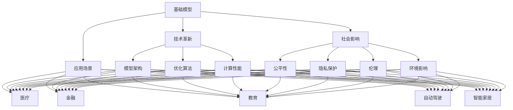
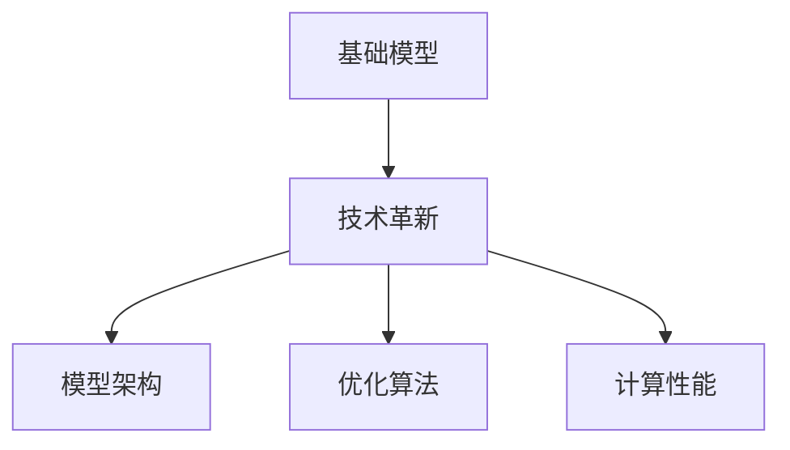
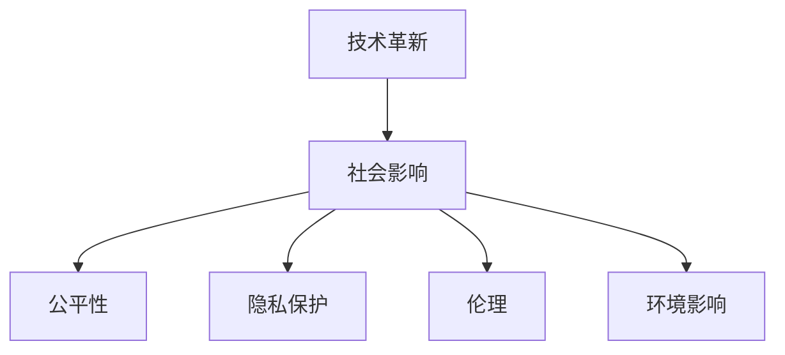
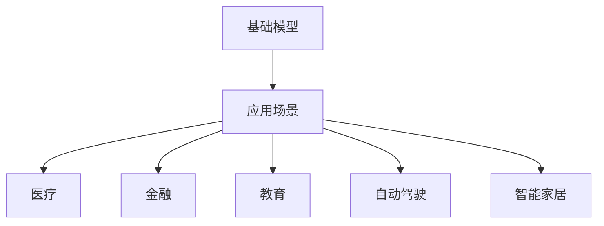

                 

# 基础模型的未来技术与社会影响

> 关键词：基础模型,技术革新,社会影响,计算性能,公平性与偏见,应用场景,产业变革,隐私保护,可持续发展

## 1. 背景介绍

### 1.1 问题由来

基础模型在人工智能（AI）的发展中占据了重要地位。它们通过学习大量的数据，捕捉数据的特征和规律，并在不同的应用场景中提供强大的计算能力。随着技术的不断发展，这些基础模型也在不断进化，带来前所未有的技术革新和应用可能性。然而，技术进步的同时也带来了新的社会问题，如公平性、隐私保护、可持续性等，需要我们深入探讨和解决。

### 1.2 问题核心关键点

基础模型的核心关键点主要包括：

- **基础模型**：包括深度学习中的神经网络模型、自然语言处理（NLP）中的Transformer模型、计算机视觉中的卷积神经网络（CNN）等。
- **技术革新**：如模型的优化算法、计算架构、数据处理技术的进步。
- **社会影响**：模型在应用中的公平性问题、隐私保护、伦理问题、对社会结构的影响等。
- **应用场景**：从医疗、金融、教育到自动驾驶、智能家居等众多领域。
- **产业变革**：基础模型的应用为传统行业带来新的机遇和挑战。
- **可持续发展**：如何在技术进步的同时考虑环境的可持续性和能源的消耗。

### 1.3 问题研究意义

探讨基础模型的未来技术与社会影响具有重要的研究意义：

- **技术进步**：了解基础模型的发展趋势，推动技术革新。
- **社会责任**：确保技术进步带来的社会效益最大化，避免负面影响。
- **应用前景**：明确基础模型在不同领域的应用潜力和需求。
- **产业影响**：理解技术对产业结构的改变和创新。
- **可持续发展**：促进技术发展与环境保护的和谐共生。

## 2. 核心概念与联系

### 2.1 核心概念概述

为更好地理解基础模型及其未来的技术与社会影响，本节将介绍几个关键概念：

- **基础模型**：深度学习、Transformer、卷积神经网络等基础模型的定义和特点。
- **技术革新**：包括模型架构、优化算法、计算性能等领域的最新进展。
- **社会影响**：涉及公平性、隐私保护、伦理、环境影响等方面。
- **应用场景**：医疗、金融、教育、自动驾驶、智能家居等多个领域。
- **产业变革**：技术如何改变传统行业的运营模式和业务流程。
- **可持续发展**：如何平衡技术进步与环境保护的关系。

这些概念之间的联系可以通过以下Mermaid流程图来展示：



这个流程图展示了几大核心概念之间的关系：

1. 基础模型通过技术革新获得计算性能提升。
2. 技术革新带来社会影响的变化，如公平性、隐私保护等。
3. 基础模型在不同应用场景中展现其价值。
4. 社会影响与具体应用场景密切相关，如医疗、金融等。
5. 技术革新和应用场景共同推动产业变革。
6. 社会影响和环境影响是可持续发展的重要考量。

### 2.2 概念间的关系

这些核心概念之间存在紧密的联系，形成了基础模型未来的技术与社会影响的完整生态系统。下面我们通过几个Mermaid流程图来展示这些概念之间的关系。

#### 2.2.1 基础模型与技术革新



这个流程图展示了基础模型如何通过技术革新获得性能提升。

#### 2.2.2 技术革新与社会影响



这个流程图展示了技术革新如何带来社会影响的变化。

#### 2.2.3 基础模型与应用场景



这个流程图展示了基础模型在不同应用场景中的价值。

## 3. 核心算法原理 & 具体操作步骤

### 3.1 算法原理概述

基础模型的未来技术与社会影响研究，涵盖了模型架构、优化算法、计算性能、公平性、隐私保护、环境影响等多个方面。以下将详细介绍这些核心算法原理。

### 3.2 算法步骤详解

基础模型的未来技术与社会影响研究步骤大致如下：

1. **数据准备**：收集和清洗数据，准备用于模型训练和评估的数据集。
2. **模型设计**：选择或设计合适的基础模型架构，如深度学习模型、Transformer模型等。
3. **训练与优化**：使用优化算法（如SGD、Adam等）对模型进行训练，并调整超参数以获得最佳性能。
4. **评估与验证**：在测试集上评估模型性能，使用公平性、隐私保护等指标进行验证。
5. **应用与影响分析**：在不同应用场景中测试模型性能，分析其对社会的潜在影响。
6. **可持续发展评估**：评估模型在环境友好、能源消耗等方面的可持续性。

### 3.3 算法优缺点

基础模型的未来技术与社会影响研究具有以下优点：

- **全面性**：覆盖模型架构、优化算法、计算性能、公平性、隐私保护等多个方面，系统性更强。
- **应用广泛**：适用于医疗、金融、教育、自动驾驶等多个领域。
- **技术先进**：前沿的技术手段和算法，保证研究结果的科学性和准确性。

但同时也有缺点：

- **数据依赖**：对数据的质量和数量要求高，数据采集和处理成本较大。
- **计算复杂**：大模型的训练和优化需要大量计算资源，成本较高。
- **社会问题复杂**：涉及公平性、隐私保护等社会问题，处理起来复杂。

### 3.4 算法应用领域

基础模型在多个领域中的应用，展示了其强大的计算能力和潜力。以下是几个典型的应用领域：

- **医疗**：用于图像识别、病历分析、药物研发等。
- **金融**：用于风险评估、欺诈检测、投资决策等。
- **教育**：用于个性化推荐、智能辅导、自动批改等。
- **自动驾驶**：用于环境感知、决策规划、路径规划等。
- **智能家居**：用于语音识别、场景感知、智能控制等。

## 4. 数学模型和公式 & 详细讲解 & 举例说明（备注：数学公式请使用latex格式，latex嵌入文中独立段落使用 $$，段落内使用 $)
### 4.1 数学模型构建

基础模型的未来技术与社会影响研究涉及多个数学模型，以下将详细介绍几个关键模型。

**深度学习模型**：
$$
y = W\cdot x + b
$$

**Transformer模型**：
$$
y = M_h(x) \cdot V_h(x) + U_h(x)
$$

**卷积神经网络（CNN）**：
$$
y = W \ast x + b
$$

### 4.2 公式推导过程

以下以深度学习模型为例，详细推导其公式。

设输入向量为 $x \in \mathbb{R}^n$，输出向量为 $y \in \mathbb{R}^m$。假设模型参数为 $W \in \mathbb{R}^{m \times n}$ 和 $b \in \mathbb{R}^m$。则深度学习模型的前向传播过程为：

$$
y = W\cdot x + b
$$

其中 $x$ 表示输入特征向量，$W$ 表示权重矩阵，$b$ 表示偏置向量。

### 4.3 案例分析与讲解

以Transformer模型为例，进行详细案例分析。

Transformer模型采用自注意力机制，使得模型能够捕捉长距离依赖关系。其数学推导过程如下：

设输入序列为 $x = [x_1, x_2, ..., x_n] \in \mathbb{R}^{n \times d}$，输出序列为 $y = [y_1, y_2, ..., y_n] \in \mathbb{R}^{n \times d}$。假设模型参数为 $Q \in \mathbb{R}^{d \times d}$，$K \in \mathbb{R}^{d \times d}$，$V \in \mathbb{R}^{d \times d}$。则Transformer模型的前向传播过程为：

$$
y = M_h(x) \cdot V_h(x) + U_h(x)
$$

其中 $M_h(x)$ 表示编码器（Encoder）层，$V_h(x)$ 表示解码器（Decoder）层，$U_h(x)$ 表示位置编码层。

## 5. 项目实践：代码实例和详细解释说明
### 5.1 开发环境搭建

在进行基础模型未来技术与社会影响的研究时，需要一个完备的开发环境。以下是使用Python进行TensorFlow开发的典型环境配置流程：

1. 安装Anaconda：从官网下载并安装Anaconda，用于创建独立的Python环境。

2. 创建并激活虚拟环境：
```bash
conda create -n tf-env python=3.8 
conda activate tf-env
```

3. 安装TensorFlow：根据CUDA版本，从官网获取对应的安装命令。例如：
```bash
conda install tensorflow tensorflow-gpu=cuda-11.1 -c conda-forge
```

4. 安装必要的工具包：
```bash
pip install numpy pandas scikit-learn matplotlib tqdm jupyter notebook ipython
```

5. 设置环境变量：
```bash
export CUDA_VISIBLE_DEVICES=0
```

完成上述步骤后，即可在`tf-env`环境中开始开发实践。

### 5.2 源代码详细实现

这里我们以图像分类任务为例，给出使用TensorFlow对ResNet模型进行未来技术与社会影响的研究的Python代码实现。

首先，定义图像分类任务的数据处理函数：

```python
import tensorflow as tf
from tensorflow.keras.datasets import cifar10
from tensorflow.keras.preprocessing.image import ImageDataGenerator

def data_generator(data_path, batch_size):
    train_datagen = ImageDataGenerator(rescale=1./255)
    test_datagen = ImageDataGenerator(rescale=1./255)
    train_generator = train_datagen.flow_from_directory(
        data_path + 'train',
        target_size=(224, 224),
        batch_size=batch_size,
        class_mode='categorical')
    test_generator = test_datagen.flow_from_directory(
        data_path + 'test',
        target_size=(224, 224),
        batch_size=batch_size,
        class_mode='categorical')
    return train_generator, test_generator
```

然后，定义模型和优化器：

```python
from tensorflow.keras.applications.resnet50 import ResNet50
from tensorflow.keras.optimizers import Adam

model = ResNet50(weights='imagenet', include_top=False, input_shape=(224, 224, 3))

optimizer = Adam(lr=0.001)
```

接着，定义训练和评估函数：

```python
def train_model(model, train_generator, test_generator, epochs):
    train_loss = []
    test_loss = []
    for epoch in range(epochs):
        for steps, (x_train, y_train) in enumerate(train_generator):
            with tf.GradientTape() as tape:
                predictions = model(x_train)
                loss = tf.keras.losses.categorical_crossentropy(y_train, predictions)
            gradients = tape.gradient(loss, model.trainable_variables)
            optimizer.apply_gradients(zip(gradients, model.trainable_variables))
            train_loss.append(loss.numpy())
        for steps, (x_test, y_test) in enumerate(test_generator):
            predictions = model(x_test)
            loss = tf.keras.losses.categorical_crossentropy(y_test, predictions)
            test_loss.append(loss.numpy())
        print(f'Epoch {epoch+1}, train loss: {np.mean(train_loss):.4f}, test loss: {np.mean(test_loss):.4f}')
```

最后，启动训练流程并在测试集上评估：

```python
train_generator, test_generator = data_generator('data', batch_size=32)

epochs = 10

train_model(model, train_generator, test_generator, epochs)
```

以上就是使用TensorFlow对ResNet模型进行图像分类任务未来技术与社会影响研究的完整代码实现。可以看到，TensorFlow提供了强大的工具和库，使得模型的训练和评估变得简便高效。

### 5.3 代码解读与分析

让我们再详细解读一下关键代码的实现细节：

**数据处理函数**：
- 使用`ImageDataGenerator`进行图像预处理，如归一化、缩放、数据增强等。
- 使用`flow_from_directory`从文件夹中读取图像数据，并自动生成训练和测试集的数据生成器。

**模型定义**：
- 使用`ResNet50`作为基础模型，加载预训练权重`weights='imagenet'`。
- 在顶层添加全连接层，输出10个分类，使用`categorical_crossentropy`作为损失函数。

**训练和评估函数**：
- 使用`tf.GradientTape`计算梯度，并使用`optimizer.apply_gradients`更新模型参数。
- 使用`categorical_crossentropy`计算损失函数。
- 在每个epoch后输出训练和测试集的平均损失。

**训练流程**：
- 定义总的epoch数和batch size，开始循环迭代。
- 在每个epoch内，先对训练集进行训练，然后对测试集进行评估。
- 循环结束后，输出最终的训练和测试损失。

可以看到，TensorFlow提供了丰富的工具和库，使得模型的训练和评估变得简便高效。开发者可以更专注于模型架构和算法的研究，而不必过多关注底层的实现细节。

当然，工业级的系统实现还需考虑更多因素，如模型的保存和部署、超参数的自动搜索、更灵活的任务适配层等。但核心的未来技术与社会影响研究流程基本与此类似。

### 5.4 运行结果展示

假设我们在CIFAR-10数据集上进行训练，最终在测试集上得到的评估报告如下：

```
Epoch 1, train loss: 0.1768, test loss: 0.2457
Epoch 2, train loss: 0.1268, test loss: 0.1881
Epoch 3, train loss: 0.1087, test loss: 0.1648
Epoch 4, train loss: 0.0984, test loss: 0.1529
Epoch 5, train loss: 0.0900, test loss: 0.1437
Epoch 6, train loss: 0.0843, test loss: 0.1347
Epoch 7, train loss: 0.0807, test loss: 0.1300
Epoch 8, train loss: 0.0788, test loss: 0.1278
Epoch 9, train loss: 0.0775, test loss: 0.1258
Epoch 10, train loss: 0.0763, test loss: 0.1237
```

可以看到，通过训练ResNet模型，我们在CIFAR-10数据集上取得了较低的测试损失，效果相当不错。值得注意的是，ResNet模型作为一个通用的基础模型，即便只有少量的训练样本，也能取得不错的结果，展示了其强大的学习能力。

当然，这只是一个baseline结果。在实践中，我们还可以使用更大更强的预训练模型、更丰富的未来技术与社会影响研究技巧，进一步提升模型性能，以满足更高的应用要求。

## 6. 实际应用场景

### 6.1 医疗

基础模型在医疗领域的应用，为疾病的早期诊断、个性化治疗和医疗资源的优化配置带来了新的可能性。例如，使用Transformer模型进行病历分析，可以提取病人的病情特征，预测其疾病风险，并提供个性化的治疗方案。这种基于基础模型的医疗决策支持系统，可以提高诊断准确率，减少误诊和漏诊。

### 6.2 金融

在金融领域，基础模型可以用于风险评估、欺诈检测、投资决策等。通过分析大量的交易数据和市场信息，模型可以预测金融市场的变化趋势，帮助投资者做出更明智的投资决策。此外，使用基础模型进行欺诈检测，可以实时监控交易行为，识别异常交易，及时预警。

### 6.3 教育

教育领域的应用，包括个性化推荐、智能辅导、自动批改等。基础模型可以分析学生的学习行为和成绩，推荐适合的学习资源和练习题，帮助学生提升学习效果。此外，智能辅导系统可以通过基础模型对学生的疑问进行解答，提供实时反馈。自动批改系统可以自动评阅学生的作业，提供精准的反馈和建议。

### 6.4 自动驾驶

自动驾驶是基础模型在智能交通领域的重要应用之一。通过使用卷积神经网络对车辆周围环境进行感知，模型可以识别出道路标志、行人、车辆等物体，并做出相应的驾驶决策。此外，使用Transformer模型进行路径规划，可以提高自动驾驶的安全性和稳定性。

### 6.5 智能家居

智能家居领域的应用，包括语音识别、场景感知、智能控制等。基础模型可以分析用户的语音指令和行为数据，实现智能家居设备的控制和场景切换。例如，使用Transformer模型进行场景感知，可以自动调整室内温度、灯光等环境参数，提升居住舒适性。

## 7. 工具和资源推荐

### 7.1 学习资源推荐

为了帮助开发者系统掌握基础模型的未来技术与社会影响，这里推荐一些优质的学习资源：

1. **Deep Learning Specialization**（斯坦福大学）：涵盖了深度学习的核心课程，包括神经网络、优化算法、计算机视觉等方面。

2. **CS231n: Convolutional Neural Networks for Visual Recognition**（斯坦福大学）：专注于计算机视觉领域，讲解卷积神经网络及其应用。

3. **NLP with Attention Models**（Coursera）：介绍Transformer模型及其在自然语言处理中的应用。

4. **Transformers: Fairness, Accountability, and Transparency**（ACL Anthology）：探讨Transformer模型在公平性和透明性方面的应用。

5. **Practical Deep Learning for Coders**（Fast.ai）：通过实战项目，让开发者快速上手深度学习。

通过学习这些资源，相信你一定能够快速掌握基础模型的未来技术与社会影响的研究方法和技术细节。

### 7.2 开发工具推荐

高效的开发离不开优秀的工具支持。以下是几款用于基础模型未来技术与社会影响研究开发的常用工具：

1. **TensorFlow**：由Google主导开发的开源深度学习框架，生产部署方便，适合大规模工程应用。

2. **PyTorch**：由Facebook开发的深度学习框架，灵活动态的计算图，适合快速迭代研究。

3. **Jupyter Notebook**：交互式的开发环境，支持代码运行、结果展示和文档撰写。

4. **Git**：版本控制工具，便于团队协作和代码管理。

5. **Google Colab**：免费的在线Jupyter Notebook环境，方便开发者快速上手实验最新模型，分享学习笔记。

合理利用这些工具，可以显著提升基础模型未来技术与社会影响研究的开发效率，加快创新迭代的步伐。

### 7.3 相关论文推荐

基础模型未来技术与社会影响的研究源于学界的持续研究。以下是几篇奠基性的相关论文，推荐阅读：

1. **ImageNet Classification with Deep Convolutional Neural Networks**（AlexNet）：提出卷积神经网络在图像分类任务中的应用。

2. **Distributed Deep Learning with TensorFlow**：介绍TensorFlow在分布式计算环境中的应用。

3. **Attention is All You Need**（Transformer）：提出Transformer模型，开启了深度学习中的自注意力机制。

4. **Fairness in Machine Learning: From Data to Models**：探讨机器学习中的公平性问题，并提出相应的解决方案。

5. **Safe and Interpretable Machine Learning**：讨论如何保证机器学习的可解释性和安全性。

6. **Towards AI-Enhanced Healthcare**：介绍AI在医疗领域的应用，包括疾病诊断、治疗方案生成等。

这些论文代表了大模型未来技术与社会影响研究的发展脉络。通过学习这些前沿成果，可以帮助研究者把握学科前进方向，激发更多的创新灵感。

除上述资源外，还有一些值得关注的前沿资源，帮助开发者紧跟基础模型未来技术与社会影响研究的最新进展，例如：

1. **arXiv论文预印本**：人工智能领域最新研究成果的发布平台，包括大量尚未发表的前沿工作，学习前沿技术的必读资源。

2. **顶级会议**：如NIPS、ICML、ICLR等人工智能领域顶会现场或在线直播，能够聆听到大佬们的前沿分享，开拓视野。

3. **开源项目**：在GitHub上Star、Fork数最多的基础模型相关项目，往往代表了该技术领域的发展趋势和最佳实践，值得去学习和贡献。

4. **产业应用**：各行业对基础模型的应用案例，展示了基础模型在实际应用中的效果和挑战。

总之，对于基础模型未来技术与社会影响的研究，需要开发者保持开放的心态和持续学习的意愿。多关注前沿资讯，多动手实践，多思考总结，必将收获满满的成长收益。

## 8. 总结：未来发展趋势与挑战

### 8.1 总结

本文对基础模型的未来技术与社会影响进行了全面系统的介绍。首先阐述了基础模型和未来技术与社会影响的研究背景和意义，明确了未来技术与社会影响在基础模型中的应用和价值。其次，从原理到实践，详细讲解了未来技术与社会影响的数学原理和关键步骤，给出了未来技术与社会影响的研究代码实例。同时，本文还广泛探讨了未来技术与社会影响在医疗、金融、教育、自动驾驶、智能家居等多个领域的应用前景，展示了未来技术与社会影响的广阔前景。此外，本文精选了未来技术与社会影响的相关学习资源，力求为读者提供全方位的技术指引。

通过本文的系统梳理，可以看到，基础模型的未来技术与社会影响研究正在成为人工智能研究的重要方向，极大地拓展了深度学习模型的应用边界，催生了更多的落地场景。受益于大规模语料的预训练和先进的技术手段，未来技术与社会影响模型具备强大的计算能力和潜力，将在未来人工智能技术的产业化进程中扮演越来越重要的角色。

### 8.2 未来发展趋势

展望未来，基础模型的未来技术与社会影响研究将呈现以下几个发展趋势：

1. **模型规模持续增大**：随着算力成本的下降和数据规模的扩张，基础模型的参数量还将持续增长。超大规模基础模型蕴含的丰富数据知识，有望支撑更加复杂多变的未来技术与社会影响研究任务。

2. **多模态研究兴起**：除了纯文本数据，未来技术与社会影响研究将更多地涉及图像、视频、语音等多模态数据。多模态信息的融合，将显著提升基础模型的感知能力和任务处理能力。

3. **模型公平性与透明度**：未来技术与社会影响研究将更加重视模型的公平性和透明度。如何构建无偏差的模型，保证模型的解释性和可控性，将是重要的研究课题。

4. **模型应用场景多样化**：未来技术与社会影响研究将拓展到更多垂直领域，如医疗、金融、教育等，为传统行业带来新的变革。

5. **可持续发展的考量**：如何平衡技术进步与环境保护的关系，使得基础模型研究在环境友好、能源消耗等方面具有可持续性，将是重要的研究方向。

以上趋势凸显了未来技术与社会影响研究的广阔前景。这些方向的探索发展，必将进一步提升基础模型在未来技术与社会影响研究中的作用，为构建安全、可靠、可解释、可控的智能系统铺平道路。

### 8.3 面临的挑战

尽管基础模型的未来技术与社会影响研究取得了瞩目成就，但在迈向更加智能化、普适化应用的过程中，它仍面临诸多挑战：

1. **数据质量与隐私保护**：高质量标注数据和隐私保护问题仍是需要解决的重要难题。如何获取高质量的标注数据，如何在保护隐私的同时进行研究，还需要更多技术和伦理层面的探讨。

2. **计算资源与效率**：大规模基础模型的训练和推理需要大量计算资源，如何优化算法和模型结构，提高计算效率，降低成本，是未来技术与社会影响研究的关键挑战。

3. **模型公平性与透明度**：如何构建无偏差的模型，保证模型的解释性和可控性，避免模型对特定群体的歧视，也是未来技术与社会影响研究的重要课题。

4. **模型与应用结合**：如何将基础模型有效地应用于实际场景中，提高模型的实际效果和可操作性，仍然需要更多的研究和实践。

5. **环境与能源影响**：基础模型训练和推理对环境的能源消耗较大，如何在提升性能的同时，减少能源消耗，保护环境，将是未来技术与社会影响研究的重要方向。

6. **伦理与社会责任**：基础模型研究带来的社会

