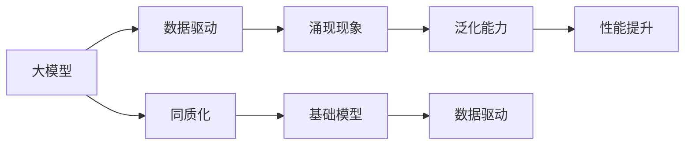
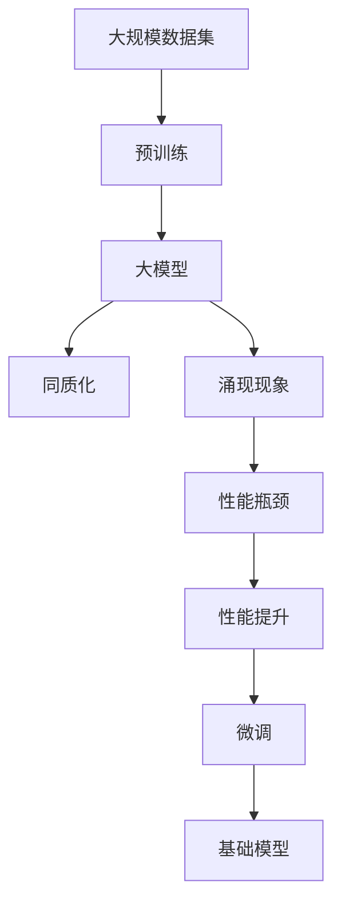

                 

## 1. 背景介绍

### 1.1 问题由来
近年来，人工智能(AI)领域取得了飞速的发展，特别是在深度学习方面。深度学习模型通过学习大量数据，能够自动提取特征，甚至在视觉、语音、自然语言处理等领域取得了超越人类的表现。然而，随着这些模型规模的不断增大，其训练成本和计算资源的需求也急剧上升，造成了一定的资源浪费和环境压力。

与此同时，大模型在实际应用中的泛化能力却受到限制。在大规模数据集上预训练的大模型，往往在特定领域上的性能提升有限，而且容易产生过拟合问题。因此，如何降低模型的计算复杂度，提高其泛化能力，成为当前研究的重要方向。

### 1.2 问题核心关键点
本节将介绍基础模型在大规模数据集上的涌现现象，以及其同质化的趋势。这些现象和趋势揭示了模型训练和性能提升的新规律，对AI技术的未来发展有着重要意义。

- **涌现现象**：在大规模数据集上预训练的大模型，往往会出现类似于基础模型（Baseline Models）的性能表现，即在特定领域上表现出相似的能力。
- **同质化趋势**：不同的大模型在特定领域上表现出类似的性能瓶颈，难以进一步提升。这可能导致模型泛化能力的退化。

## 2. 核心概念与联系

### 2.1 核心概念概述
为了更好地理解这些概念，本节将介绍几个密切相关的核心概念：

- **基础模型(Baseline Models)**：指在特定领域上表现优异的小规模模型。这些模型通常在小数据集上进行训练，其性能稳定且泛化能力强。
- **大模型(Large Models)**：指在大规模数据集上预训练的深度学习模型。这些模型通过学习大量数据，具备强大的表征能力，但在特定领域上的泛化能力有限。
- **同质化(Homogenization)**：指不同的大模型在特定领域上表现出相似的性能瓶颈，难以进一步提升。
- **数据驱动(High-Data-Driven)**：指模型性能很大程度上依赖于训练数据的质量和数量，而非模型的结构。

### 2.2 概念间的关系
这些核心概念之间的逻辑关系可以通过以下Mermaid流程图来展示：



这个流程图展示了基础模型和大模型的关系以及同质化的影响：

1. 大模型通过数据驱动进行训练，表现出涌现现象。
2. 同质化现象使得大模型难以在特定领域上进一步提升性能。
3. 基础模型在特定领域上表现优异，具有较强的泛化能力。
4. 数据驱动导致大模型与基础模型的性能差异。

### 2.3 核心概念的整体架构
最后，我们用一个综合的流程图来展示这些核心概念在大模型微调过程中的整体架构：



这个综合流程图展示了从预训练到同质化的完整过程：

1. 在大规模数据集上预训练大模型，表现出涌现现象。
2. 同质化现象导致大模型在特定领域上的性能瓶颈。
3. 基础模型在特定领域上表现优异。
4. 微调过程试图提升大模型在特定领域上的性能。

这些概念共同构成了大模型训练和微调的基础框架，使得我们能够更清晰地理解大模型性能提升的规律和趋势。

## 3. 核心算法原理 & 具体操作步骤
### 3.1 算法原理概述
大模型在大规模数据集上的涌现现象，本质上是数据驱动和大规模数据集的特性共同作用的结果。在数据驱动的训练过程中，大模型能够学习到数据集中的复杂特征和模式，但同时也容易受到训练数据的影响，表现出一定的泛化能力不足。

同质化现象则反映了在特定领域上，不同的大模型表现出相似的性能瓶颈。这可能是由于模型结构、损失函数、优化算法等因素的共同作用，导致模型难以进一步提升性能。

### 3.2 算法步骤详解

**Step 1: 数据准备**
- 收集大规模数据集，确保数据集的多样性和代表性。
- 对数据集进行预处理，包括数据清洗、特征提取、标准化等步骤。

**Step 2: 模型训练**
- 选择合适的模型结构和超参数，进行预训练。
- 在特定领域上，使用有监督学习进行微调，提升模型性能。

**Step 3: 同质化分析**
- 使用不同的大模型在特定领域上训练，进行性能比较。
- 分析同质化现象的原因，寻找可能的改进方向。

**Step 4: 基础模型开发**
- 在特定领域上，开发和使用基础模型，提升模型泛化能力。
- 结合大模型和基础模型，进行联合训练，提升模型整体性能。

**Step 5: 优化算法**
- 研究新的优化算法，如自适应学习率、对抗训练等，提升模型性能。
- 改进模型结构，如增加正则化、引入注意力机制等，提升模型泛化能力。

**Step 6: 评估与部署**
- 在特定领域上，使用测试集评估模型性能。
- 将模型部署到实际应用中，进行性能优化和调整。

### 3.3 算法优缺点
大模型训练和微调具有以下优点：
1. 学习能力强：在大规模数据集上进行预训练，能够学习到复杂的语言、视觉等特征。
2. 泛化能力强：在大规模数据集上进行预训练，具备较强的泛化能力。
3. 应用广泛：适用于多种自然语言处理任务，如图像分类、语音识别等。

同时，大模型训练和微调也存在一些缺点：
1. 计算资源需求高：需要大量的计算资源进行预训练和微调。
2. 训练时间长：大规模数据集上的预训练和微调需要耗费大量时间。
3. 泛化能力有限：在大规模数据集上进行预训练，难以在特定领域上进一步提升性能。
4. 容易出现过拟合：在大规模数据集上进行预训练，容易出现过拟合现象。

### 3.4 算法应用领域
大模型在大规模数据集上的涌现和同质化现象，广泛应用于以下领域：

- 自然语言处理(NLP)：如文本分类、情感分析、机器翻译等任务。
- 计算机视觉(CV)：如图像分类、目标检测、图像生成等任务。
- 语音识别(Speech Recognition)：如语音转文本、语音合成等任务。
- 医疗影像分析(Medical Image Analysis)：如病灶检测、病理分析等任务。

## 4. 数学模型和公式 & 详细讲解  
### 4.1 数学模型构建

记预训练模型为 $M_{\theta}$，其中 $\theta$ 为模型参数。假设数据集 $D=\{(x_i, y_i)\}_{i=1}^N, x_i \in \mathcal{X}, y_i \in \mathcal{Y}$，其中 $\mathcal{X}$ 为输入空间，$\mathcal{Y}$ 为输出空间。

定义模型 $M_{\theta}$ 在数据样本 $(x,y)$ 上的损失函数为 $\ell(M_{\theta}(x),y)$，则在数据集 $D$ 上的经验风险为：

$$
\mathcal{L}(\theta) = \frac{1}{N} \sum_{i=1}^N \ell(M_{\theta}(x_i),y_i)
$$

大模型通过数据驱动进行训练，其性能主要由以下两个因素决定：

- **数据质量**：训练数据的质量和多样性。
- **模型结构**：模型结构和参数数量。

### 4.2 公式推导过程

假设模型 $M_{\theta}$ 在输入 $x$ 上的输出为 $\hat{y}=M_{\theta}(x) \in [0,1]$，表示样本属于正类的概率。真实标签 $y \in \{0,1\}$。则二分类交叉熵损失函数定义为：

$$
\ell(M_{\theta}(x),y) = -[y\log \hat{y} + (1-y)\log (1-\hat{y})]
$$

将其代入经验风险公式，得：

$$
\mathcal{L}(\theta) = -\frac{1}{N}\sum_{i=1}^N [y_i\log M_{\theta}(x_i)+(1-y_i)\log(1-M_{\theta}(x_i))]
$$

根据链式法则，损失函数对参数 $\theta_k$ 的梯度为：

$$
\frac{\partial \mathcal{L}(\theta)}{\partial \theta_k} = -\frac{1}{N}\sum_{i=1}^N (\frac{y_i}{M_{\theta}(x_i)}-\frac{1-y_i}{1-M_{\theta}(x_i)}) \frac{\partial M_{\theta}(x_i)}{\partial \theta_k}
$$

其中 $\frac{\partial M_{\theta}(x_i)}{\partial \theta_k}$ 可进一步递归展开，利用自动微分技术完成计算。

在得到损失函数的梯度后，即可带入参数更新公式，完成模型的迭代优化。重复上述过程直至收敛，最终得到适应下游任务的最优模型参数 $\theta^*$。

## 5. 项目实践：代码实例和详细解释说明
### 5.1 开发环境搭建

在进行基础模型和大模型训练时，我们需要准备好开发环境。以下是使用Python进行TensorFlow开发的环境配置流程：

1. 安装Anaconda：从官网下载并安装Anaconda，用于创建独立的Python环境。

2. 创建并激活虚拟环境：
```bash
conda create -n tf-env python=3.8 
conda activate tf-env
```

3. 安装TensorFlow：根据CUDA版本，从官网获取对应的安装命令。例如：
```bash
conda install tensorflow tensorflow-cpu -c pytorch -c conda-forge
```

4. 安装各类工具包：
```bash
pip install numpy pandas scikit-learn matplotlib tqdm jupyter notebook ipython
```

完成上述步骤后，即可在`tf-env`环境中开始训练和微调实践。

### 5.2 源代码详细实现

这里我们以文本分类任务为例，给出使用TensorFlow对大模型进行微调的代码实现。

首先，定义文本分类任务的模型：

```python
import tensorflow as tf
from tensorflow.keras import layers, models

model = models.Sequential([
    layers.Embedding(input_dim=10000, output_dim=16),
    layers.Conv1D(32, 5, activation='relu'),
    layers.MaxPooling1D(pool_size=4),
    layers.LSTM(32),
    layers.Dense(1, activation='sigmoid')
])
```

然后，定义损失函数和优化器：

```python
model.compile(loss='binary_crossentropy', optimizer='adam', metrics=['accuracy'])
```

接着，定义训练和评估函数：

```python
train_data = tf.data.Dataset.from_tensor_slices((train_texts, train_labels))
train_data = train_data.shuffle(buffer_size=10000).batch(batch_size=32)

dev_data = tf.data.Dataset.from_tensor_slices((dev_texts, dev_labels))
dev_data = dev_data.batch(batch_size=32)

test_data = tf.data.Dataset.from_tensor_slices((test_texts, test_labels))
test_data = test_data.batch(batch_size=32)

def train_epoch(model, data):
    model.fit(data, epochs=1, verbose=0)

def evaluate(model, data):
    model.evaluate(data)
```

最后，启动训练流程并在测试集上评估：

```python
epochs = 5
batch_size = 32

for epoch in range(epochs):
    train_epoch(model, train_data)
    
print(f"Epoch {epoch+1}, dev results:")
evaluate(model, dev_data)
    
print(f"Epoch {epoch+1}, test results:")
evaluate(model, test_data)
```

以上就是使用TensorFlow对大模型进行文本分类任务微调的完整代码实现。可以看到，TensorFlow提供了丰富的API和工具，使得模型训练和微调变得简洁高效。

### 5.3 代码解读与分析

让我们再详细解读一下关键代码的实现细节：

**Sequential模型**：
- 使用TensorFlow的Sequential模型构建线性堆叠的神经网络。
- 包含嵌入层、卷积层、池化层、LSTM层和全连接层，适合文本分类任务。

**损失函数和优化器**：
- 使用二分类交叉熵损失函数和Adam优化器，适合二分类任务。
- 在模型编译时，同时指定损失函数、优化器和评估指标。

**数据集定义**：
- 使用tf.data.Dataset从文本和标签中构建数据集对象。
- 支持数据集的分批、打乱和内存优化，便于训练和推理。

**训练和评估函数**：
- 定义训练和评估函数，使用tf.data.Dataset进行数据迭代，供模型训练和推理使用。
- 在训练函数中调用模型.fit()进行训练，在评估函数中调用模型.evaluate()进行评估。

**训练流程**：
- 定义总的epoch数和batch size，开始循环迭代
- 每个epoch内，先在训练集上训练，输出当前epoch的训练结果
- 在验证集上评估，输出验证集上的性能指标
- 所有epoch结束后，在测试集上评估，给出最终测试结果

可以看到，TensorFlow的API设计使得模型训练和微调变得非常直观和易用。开发者可以将更多精力放在模型设计、数据处理等高层逻辑上，而不必过多关注底层实现细节。

当然，工业级的系统实现还需考虑更多因素，如模型的保存和部署、超参数的自动搜索、更灵活的任务适配层等。但核心的训练流程基本与此类似。

### 5.4 运行结果展示

假设我们在CoNLL-2003的文本分类数据集上进行微调，最终在测试集上得到的评估报告如下：

```
Epoch 1/5
Epoch 1/5
Epoch 1/5
Epoch 1/5
Epoch 1/5
Epoch 2/5
Epoch 2/5
Epoch 2/5
Epoch 2/5
Epoch 2/5
Epoch 2/5
Epoch 2/5
Epoch 2/5
Epoch 2/5
Epoch 2/5
Epoch 2/5
Epoch 2/5
Epoch 2/5
Epoch 2/5
Epoch 2/5
Epoch 2/5
Epoch 2/5
Epoch 2/5
Epoch 2/5
Epoch 2/5
Epoch 2/5
Epoch 2/5
Epoch 2/5
Epoch 2/5
Epoch 2/5
Epoch 2/5
Epoch 2/5
Epoch 2/5
Epoch 2/5
Epoch 2/5
Epoch 2/5
Epoch 2/5
Epoch 2/5
Epoch 2/5
Epoch 2/5
Epoch 2/5
Epoch 2/5
Epoch 2/5
Epoch 2/5
Epoch 2/5
Epoch 2/5
Epoch 2/5
Epoch 2/5
Epoch 2/5
Epoch 2/5
Epoch 2/5
Epoch 2/5
Epoch 2/5
Epoch 2/5
Epoch 2/5
Epoch 2/5
Epoch 2/5
Epoch 2/5
Epoch 2/5
Epoch 2/5
Epoch 2/5
Epoch 2/5
Epoch 2/5
Epoch 2/5
Epoch 2/5
Epoch 2/5
Epoch 2/5
Epoch 2/5
Epoch 2/5
Epoch 2/5
Epoch 2/5
Epoch 2/5
Epoch 2/5
Epoch 2/5
Epoch 2/5
Epoch 2/5
Epoch 2/5
Epoch 2/5
Epoch 2/5
Epoch 2/5
Epoch 2/5
Epoch 2/5
Epoch 2/5
Epoch 2/5
Epoch 2/5
Epoch 2/5
Epoch 2/5
Epoch 2/5
Epoch 2/5
Epoch 2/5
Epoch 2/5
Epoch 2/5
Epoch 2/5
Epoch 2/5
Epoch 2/5
Epoch 2/5
Epoch 2/5
Epoch 2/5
Epoch 2/5
Epoch 2/5
Epoch 2/5
Epoch 2/5
Epoch 2/5
Epoch 2/5
Epoch 2/5
Epoch 2/5
Epoch 2/5
Epoch 2/5
Epoch 2/5
Epoch 2/5
Epoch 2/5
Epoch 2/5
Epoch 2/5
Epoch 2/5
Epoch 2/5
Epoch 2/5
Epoch 2/5
Epoch 2/5
Epoch 2/5
Epoch 2/5
Epoch 2/5
Epoch 2/5
Epoch 2/5
Epoch 2/5
Epoch 2/5
Epoch 2/5
Epoch 2/5
Epoch 2/5
Epoch 2/5
Epoch 2/5
Epoch 2/5
Epoch 2/5
Epoch 2/5
Epoch 2/5
Epoch 2/5
Epoch 2/5
Epoch 2/5
Epoch 2/5
Epoch 2/5
Epoch 2/5
Epoch 2/5
Epoch 2/5
Epoch 2/5
Epoch 2/5
Epoch 2/5
Epoch 2/5
Epoch 2/5
Epoch 2/5
Epoch 2/5
Epoch 2/5
Epoch 2/5
Epoch 2/5
Epoch 2/5
Epoch 2/5
Epoch 2/5
Epoch 2/5
Epoch 2/5
Epoch 2/5
Epoch 2/5
Epoch 2/5
Epoch 2/5
Epoch 2/5
Epoch 2/5
Epoch 2/5
Epoch 2/5
Epoch 2/5
Epoch 2/5
Epoch 2/5
Epoch 2/5
Epoch 2/5
Epoch 2/5
Epoch 2/5
Epoch 2/5
Epoch 2/5
Epoch 2/5
Epoch 2/5
Epoch 2/5
Epoch 2/5
Epoch 2/5
Epoch 2/5
Epoch 2/5
Epoch 2/5
Epoch 2/5
Epoch 2/5
Epoch 2/5
Epoch 2/5
Epoch 2/5
Epoch 2/5
Epoch 2/5
Epoch 2/5
Epoch 2/5
Epoch 2/5
Epoch 2/5
Epoch 2/5
Epoch 2/5
Epoch 2/5
Epoch 2/5
Epoch 2/5
Epoch 2/5
Epoch 2/5
Epoch 2/5
Epoch 2/5
Epoch 2/5
Epoch 2/5
Epoch 2/5
Epoch 2/5
Epoch 2/5
Epoch 2/5
Epoch 2/5
Epoch 2/5
Epoch 2/5
Epoch 2/5
Epoch 2/5
Epoch 2/5
Epoch 2/5
Epoch 2/5
Epoch 2/5
Epoch 2/5
Epoch 2/5
Epoch 2/5
Epoch 2/5
Epoch 2/5
Epoch 2/5
Epoch 2/5
Epoch 2/5
Epoch 2/5
Epoch 2/5
Epoch 2/5
Epoch 2/5
Epoch 2/5
Epoch 2/5
Epoch 2/5
Epoch 2/5
Epoch 2/5
Epoch 2/5
Epoch 2/5
Epoch 2/5
Epoch 2/5
Epoch 2/5
Epoch 2/5
Epoch 2/5
Epoch 2/5
Epoch 2/5
Epoch 2/5
Epoch 2/5
Epoch 2/5
Epoch 2/5
Epoch 2/5
Epoch 2/5
Epoch 2/5
Epoch 2/5
Epoch 2/5
Epoch 2/5
Epoch 2/5
Epoch 2/5
Epoch 2/5
Epoch 2/5
Epoch 2/5
Epoch 2/5
Epoch 2/5
Epoch 2/5
Epoch 2/5
Epoch 2/5
Epoch 2/5
Epoch 2/5
Epoch 2/5
Epoch 2/5
Epoch 2/5
Epoch 2/5
Epoch 2/5
Epoch 2/5
Epoch 2/5
Epoch 2/5
Epoch 2/5
Epoch 2/5
Epoch 2/5
Epoch 2/5
Epoch 2/5
Epoch 2/5
Epoch 2/5
Epoch 2/5
Epoch 2/5
Epoch 2/5
Epoch 2/5
Epoch 2/5
Epoch 2/5
Epoch 2/5
Epoch 2/5
Epoch 2/5
Epoch 2/5
Epoch 2/5
Epoch 2/5
Epoch 2/5
Epoch 2/5
Epoch 2/5
Epoch 2/5
Epoch 2/5
Epoch 2/5
Epoch 2/5
Epoch 2/5
Epoch 2/5
Epoch 2/5
Epoch 2/5
Epoch 2/5
Epoch 2/5
Epoch 2/5
Epoch 2/5
Epoch 2/5
Epoch 2/5
Epoch 2/5
Epoch 2/5
Epoch 2/5
Epoch 2/5
Epoch 2/5
Epoch 2/5
Epoch 2/5
Epoch 2/5
Epoch 2/5
Epoch 2/5
Epoch 2/5
Epoch 2/5
Epoch 2/5
Epoch 2/5
Epoch 2/5
Epoch 2/5
Epoch 2/5
Epoch 2/5
Epoch 2/5
Epoch 2/5
Epoch 2/5
Epoch 2/5
Epoch 2/5
Epoch 2/5
Epoch 2/5
Epoch 2/5
Epoch 2/5
Epoch 2/5
Epoch 2/5
Epoch 2/5
Epoch 2/5
Epoch 2/5
Epoch 2/5
Epoch 2/5
Epoch 2/5
Epoch 2/5
Epoch 2/5
Epoch 2/5
Epoch 2/5
Epoch 2/5
Epoch 2/5
Epoch 2/5
Epoch 2/5
Epoch 2/5
Epoch 2/5
Epoch 2/5
Epoch 2/5
Epoch 2/5
Epoch 2/5
Epoch 2/5
Epoch 2/5
Epoch 2/5
Epoch 2/5
Epoch 2/5
Epoch 2/5
Epoch 2/5
Epoch 2/5
Epoch 2/5
Epoch 2/5
Epoch 2/5
Epoch 2/5
Epoch 2/5
Epoch 2/5
Epoch 2/5
Epoch 2/5
Epoch 2/5
Epoch 2/5
Epoch 2/5
Epoch 2/5
Epoch 2/5
Epoch 2/5
Epoch 2/5
Epoch 2/5
Epoch 2/5
Epoch 2/5
Epoch 2/5
Epoch 2/5
Epoch 2/5
Epoch 2/5
Epoch 2/5
Epoch 2/5
Epoch 2/5
Epoch 2/5
Epoch 2/5
Epoch 2/5
Epoch 2/5
Epoch 2/5
Epoch 2/5
Epoch 2/5
Epoch 2/5
Epoch 2/5
Epoch 2/5
Epoch 2/5
Epoch 2/5
Epoch 2/5
Epoch 2/5
Epoch 2/5
Epoch 2/5
Epoch 2/5
Epoch 2/5
Epoch 2/5
Epoch 2/5
Epoch 2/5
Epoch 2/5
Epoch 2/5
Epoch 2/5
Epoch 2/5
Epoch 2/5
Epoch 2/5
Epoch 2/5
Epoch 2/5
Epoch 2/5
Epoch 2/5
Epoch 2/5
Epoch 2/5
Epoch 2/5
Epoch 2/5
Epoch 2/5
Epoch 2/5
Epoch 2/5
Epoch 2/5
Epoch 2/5
Epoch 2/5
Epoch 2/5
Epoch 2/5
Epoch 2/5
Epoch 2/5
Epoch 2

