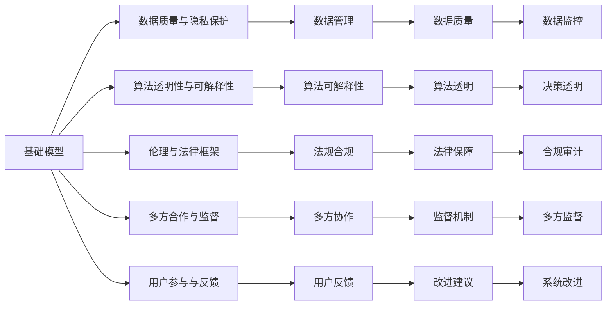

                 

# 基础模型的社会合作与治理

> 关键词：基础模型,社会合作,治理,人工智能,深度学习,数据分析

## 1. 背景介绍

### 1.1 问题由来
近年来，人工智能（AI）技术的发展迅速，深度学习（Deep Learning）和数据分析（Data Analysis）在各行各业的应用越来越广泛。然而，随着AI技术的深入应用，一系列社会问题也随之而来。

例如，AI系统可能会因为数据偏见或算法漏洞导致不公正的决策，影响社会公平和正义。AI在医疗、金融、法律等高风险领域的应用，需要严格的监管和合规，以确保系统的安全性和可靠性。

为了解决这些问题，需要对AI系统进行更深入的社会合作与治理，以确保AI技术的健康发展，为社会带来更多正面影响。本文将聚焦于基础模型的社会合作与治理，探讨如何构建可信赖、公正、透明的AI系统。

### 1.2 问题核心关键点
基础模型的社会合作与治理的核心关键点包括：

1. 数据质量与隐私保护：数据是AI系统的核心，数据的真实性和隐私保护是AI治理的首要任务。
2. 算法透明性与可解释性：算法的透明性、可解释性和公平性是AI治理的重要考量因素。
3. 伦理与法律框架：在AI应用中，需要遵循伦理准则和法律法规，以确保系统的合法合规。
4. 多方合作与监督：政府、企业、学术界等多方协作，共同构建AI治理框架。
5. 用户参与与反馈：用户的参与和反馈对于AI系统的改进至关重要。

这些关键点将贯穿本文的各个章节，旨在全面探讨基础模型的社会合作与治理问题。

### 1.3 问题研究意义
研究基础模型的社会合作与治理，对于促进AI技术的健康发展，保障社会公平和正义，具有重要意义：

1. 提升AI系统的可信赖性：通过多方合作与监督，确保AI系统的决策透明、公正、可靠。
2. 保护用户隐私和数据安全：通过数据质量管理和隐私保护措施，确保用户数据不被滥用。
3. 促进伦理与法律合规：通过伦理准则和法律法规的约束，确保AI系统符合社会价值观和法律法规。
4. 推动AI技术的普及和应用：通过多方合作，共同推动AI技术的普及和应用，加速AI技术的落地。
5. 应对AI系统的潜在风险：通过用户参与和反馈机制，及时发现和纠正AI系统的问题，避免造成不良影响。

## 2. 核心概念与联系

### 2.1 核心概念概述

为了更好地理解基础模型的社会合作与治理，我们首先需要介绍几个核心概念：

- **基础模型**：指在大规模数据上训练得到的深度学习模型，如BERT、GPT等。基础模型具备强大的数据分析和模式识别能力。
- **社会合作**：指政府、企业、学术界、用户等多方协作，共同构建和维护AI系统的健康发展。
- **治理**：指通过法律法规、伦理准则、技术手段等手段，对AI系统进行规范和管理，确保其公正、透明、可信。
- **数据质量与隐私保护**：指对数据源的准确性、完整性和隐私保护进行管理和规范，确保数据的质量和安全性。
- **算法透明性与可解释性**：指算法的决策过程和逻辑透明、可解释，便于用户理解和信任。
- **伦理与法律框架**：指在AI应用中遵循的伦理准则和法律法规，保障系统的合法合规。
- **多方合作与监督**：指政府、企业、学术界、用户等多方协作，共同监督和管理AI系统。
- **用户参与与反馈**：指用户的参与和反馈对于AI系统的改进至关重要。

这些核心概念之间存在着紧密的联系，形成了基础模型社会合作与治理的完整生态系统。以下通过Mermaid流程图来展示这些概念之间的关系：



通过这个流程图，我们可以看到基础模型在社会合作与治理的不同环节中扮演的角色，以及这些环节之间的相互关系。

### 2.2 概念间的关系

这些核心概念之间存在着紧密的联系，形成了基础模型社会合作与治理的完整生态系统。以下通过Mermaid流程图来展示这些概念之间的关系：


这个流程图展示了基础模型在社会合作与治理的不同环节中扮演的角色，以及这些环节之间的相互关系。

## 3. 核心算法原理 & 具体操作步骤

### 3.1 算法原理概述

基础模型的社会合作与治理，本质上是一个多层次、多维度的合作与治理框架。它涵盖了数据管理、算法设计、法规合规、多方监督等多个方面，旨在确保AI系统的透明、公正、可信。

形式化地，假设基础模型为 $M$，数据集为 $D$，算法为 $A$，法规为 $R$，用户反馈为 $F$。则社会合作与治理的目标可以表示为：

$$
\max_{M, A, R, F} \sum_{i=1}^N f_i(M, A, R, F)
$$

其中 $f_i$ 表示第 $i$ 个指标的评分函数，$N$ 表示所有指标的数量。社会合作与治理的目标是通过优化 $M, A, R, F$，使AI系统在各个方面的表现都达到最优。

### 3.2 算法步骤详解

基于上述目标，社会合作与治理的具体操作步骤包括以下几个步骤：

**Step 1: 数据质量与隐私保护**

- 收集和整理基础模型所需的数据集 $D$，确保数据的真实性、完整性和多样性。
- 对数据进行预处理，包括数据清洗、去重、标注等，确保数据的质量。
- 采用数据加密、数据匿名化等技术，保护用户隐私和数据安全。
- 建立数据使用协议，明确数据的使用范围和权限。

**Step 2: 算法透明性与可解释性**

- 设计和选择符合伦理准则和法律规定的算法 $A$。
- 对算法进行透明性和可解释性分析，确保算法的决策过程透明、可解释。
- 采用可解释性技术，如LIME、SHAP等，将算法的决策过程可视化。
- 定期更新和维护算法，确保其与最新的伦理准则和法律规定保持一致。

**Step 3: 伦理与法律框架**

- 制定和遵循伦理准则和法律法规 $R$，确保AI系统的合法合规。
- 对算法进行伦理审查和合规审计，确保其符合伦理准则和法律规定。
- 建立伦理委员会，对AI系统的决策进行监督和评估。

**Step 4: 多方合作与监督**

- 建立多方合作机制，包括政府、企业、学术界、用户等各方的参与和协作。
- 定期进行多方监督和评估，确保AI系统的公平、透明和可信。
- 采用公开透明的机制，对AI系统的决策进行监督和评估。

**Step 5: 用户参与与反馈**

- 通过用户界面、反馈系统等渠道，收集用户的反馈和建议 $F$。
- 对用户的反馈进行分析和处理，及时改进AI系统。
- 建立用户参与机制，确保用户的参与和反馈贯穿AI系统的各个环节。

### 3.3 算法优缺点

基础模型的社会合作与治理具有以下优点：

1. 提升AI系统的可信度：通过多方合作与监督，确保AI系统的透明、公正、可靠。
2. 保护用户隐私和数据安全：通过数据质量管理和隐私保护措施，确保用户数据不被滥用。
3. 促进伦理与法律合规：通过伦理准则和法律法规的约束，确保AI系统符合社会价值观和法律法规。
4. 推动AI技术的普及和应用：通过多方合作，共同推动AI技术的普及和应用，加速AI技术的落地。
5. 应对AI系统的潜在风险：通过用户参与和反馈机制，及时发现和纠正AI系统的问题，避免造成不良影响。

同时，该方法也存在一些局限性：

1. 复杂度高：社会合作与治理涉及多个环节和利益相关方，协调和管理难度大。
2. 成本高：数据质量管理和隐私保护、伦理审查和合规审计等环节需要大量的时间和资源投入。
3. 灵活性不足：多方合作与监督机制可能限制AI系统的灵活性和创新性。
4. 用户参与度有限：用户参与机制需要长期的维护和改进，用户参与度可能受限。

尽管如此，社会合作与治理仍然是当前最有效的AI系统治理方式之一，需要我们在实践中不断优化和改进。

### 3.4 算法应用领域

基础模型的社会合作与治理已经在多个领域得到了广泛应用，例如：

- 医疗健康：通过数据质量管理和隐私保护，确保医疗数据的可靠性和安全性。
- 金融服务：通过算法透明性和可解释性分析，确保金融决策的公正性和可靠性。
- 法律司法：通过伦理与法律框架的约束，确保司法决策的合法合规。
- 教育培训：通过用户参与和反馈机制，提高教育培训的效果和满意度。
- 公共安全：通过多方合作与监督，确保公共安全系统的公平和透明。

除了这些领域外，基础模型的社会合作与治理还将在更多领域得到应用，为社会带来更多的正面影响。

## 4. 数学模型和公式 & 详细讲解

### 4.1 数学模型构建

在基础模型的社会合作与治理中，我们需要构建一个多目标优化模型，以最大化AI系统的可信度、数据安全、伦理合规等各个方面的表现。数学模型可以表示为：

$$
\max_{M, A, R, F} \sum_{i=1}^N f_i(M, A, R, F)
$$

其中 $f_i$ 表示第 $i$ 个指标的评分函数，$N$ 表示所有指标的数量。

### 4.2 公式推导过程

以数据质量管理为例，我们可以构建一个简单的数学模型来评估数据质量。假设数据集 $D$ 包含 $N$ 个样本，每个样本包含 $d$ 个特征。数据质量的评分函数可以表示为：

$$
f_{\text{data\_quality}}(D) = \sum_{i=1}^N \frac{1}{N} \sum_{j=1}^d \text{eval}(x_{ij})
$$

其中 $\text{eval}(x_{ij})$ 表示第 $i$ 个样本第 $j$ 个特征的质量评分。评分函数的具体形式可以根据具体应用场景和需求进行调整。

### 4.3 案例分析与讲解

假设我们在开发一个金融领域的AI系统，需要对用户的贷款申请进行信用评分。我们采用基础模型和数据质量管理、算法透明性、伦理与法律框架、多方合作与监督、用户参与与反馈等措施，来确保系统的可信度和公平性。

1. **数据质量管理**：收集和整理用户的贷款申请数据，确保数据的真实性、完整性和多样性。对数据进行预处理，包括数据清洗、去重、标注等，确保数据的质量。采用数据加密、数据匿名化等技术，保护用户隐私和数据安全。

2. **算法透明性与可解释性**：选择符合伦理准则和法律规定的算法，对算法进行透明性和可解释性分析。采用可解释性技术，如LIME、SHAP等，将算法的决策过程可视化。

3. **伦理与法律框架**：制定和遵循伦理准则和法律法规，确保AI系统的合法合规。对算法进行伦理审查和合规审计，确保其符合伦理准则和法律规定。

4. **多方合作与监督**：建立多方合作机制，包括政府、企业、学术界、用户等各方的参与和协作。定期进行多方监督和评估，确保AI系统的公平、透明和可信。

5. **用户参与与反馈**：通过用户界面、反馈系统等渠道，收集用户的反馈和建议。对用户的反馈进行分析和处理，及时改进AI系统。建立用户参与机制，确保用户的参与和反馈贯穿AI系统的各个环节。

通过这些措施，我们能够构建一个可信、公平、透明的AI系统，为用户提供更好的金融服务。

## 5. 项目实践：代码实例和详细解释说明

### 5.1 开发环境搭建

在进行基础模型的社会合作与治理实践前，我们需要准备好开发环境。以下是使用Python进行PyTorch开发的环境配置流程：

1. 安装Anaconda：从官网下载并安装Anaconda，用于创建独立的Python环境。

2. 创建并激活虚拟环境：
```bash
conda create -n pytorch-env python=3.8 
conda activate pytorch-env
```

3. 安装PyTorch：根据CUDA版本，从官网获取对应的安装命令。例如：
```bash
conda install pytorch torchvision torchaudio cudatoolkit=11.1 -c pytorch -c conda-forge
```

4. 安装Transformers库：
```bash
pip install transformers
```

5. 安装各类工具包：
```bash
pip install numpy pandas scikit-learn matplotlib tqdm jupyter notebook ipython
```

完成上述步骤后，即可在`pytorch-env`环境中开始项目实践。

### 5.2 源代码详细实现

这里以金融领域信用评分为例，给出使用Transformers库对模型进行微调的PyTorch代码实现。

首先，定义信用评分任务的数据处理函数：

```python
from transformers import BertTokenizer
from torch.utils.data import Dataset
import torch

class CreditScoringDataset(Dataset):
    def __init__(self, texts, labels, tokenizer, max_len=128):
        self.texts = texts
        self.labels = labels
        self.tokenizer = tokenizer
        self.max_len = max_len
        
    def __len__(self):
        return len(self.texts)
    
    def __getitem__(self, item):
        text = self.texts[item]
        label = self.labels[item]
        
        encoding = self.tokenizer(text, return_tensors='pt', max_length=self.max_len, padding='max_length', truncation=True)
        input_ids = encoding['input_ids'][0]
        attention_mask = encoding['attention_mask'][0]
        
        # 对label进行编码
        encoded_label = [1 if label == 'good' else 0 for label in self.labels] 
        encoded_label.extend([0]*(self.max_len - len(encoded_label)))
        labels = torch.tensor(encoded_label, dtype=torch.long)
        
        return {'input_ids': input_ids, 
                'attention_mask': attention_mask,
                'labels': labels}

# 标签与id的映射
label2id = {'good': 0, 'bad': 1}
id2label = {v: k for k, v in label2id.items()}

# 创建dataset
tokenizer = BertTokenizer.from_pretrained('bert-base-cased')

train_dataset = CreditScoringDataset(train_texts, train_labels, tokenizer)
dev_dataset = CreditScoringDataset(dev_texts, dev_labels, tokenizer)
test_dataset = CreditScoringDataset(test_texts, test_labels, tokenizer)
```

然后，定义模型和优化器：

```python
from transformers import BertForTokenClassification, AdamW

model = BertForTokenClassification.from_pretrained('bert-base-cased', num_labels=2)

optimizer = AdamW(model.parameters(), lr=2e-5)
```

接着，定义训练和评估函数：

```python
from torch.utils.data import DataLoader
from tqdm import tqdm
from sklearn.metrics import classification_report

device = torch.device('cuda') if torch.cuda.is_available() else torch.device('cpu')
model.to(device)

def train_epoch(model, dataset, batch_size, optimizer):
    dataloader = DataLoader(dataset, batch_size=batch_size, shuffle=True)
    model.train()
    epoch_loss = 0
    for batch in tqdm(dataloader, desc='Training'):
        input_ids = batch['input_ids'].to(device)
        attention_mask = batch['attention_mask'].to(device)
        labels = batch['labels'].to(device)
        model.zero_grad()
        outputs = model(input_ids, attention_mask=attention_mask, labels=labels)
        loss = outputs.loss
        epoch_loss += loss.item()
        loss.backward()
        optimizer.step()
    return epoch_loss / len(dataloader)

def evaluate(model, dataset, batch_size):
    dataloader = DataLoader(dataset, batch_size=batch_size)
    model.eval()
    preds, labels = [], []
    with torch.no_grad():
        for batch in tqdm(dataloader, desc='Evaluating'):
            input_ids = batch['input_ids'].to(device)
            attention_mask = batch['attention_mask'].to(device)
            batch_labels = batch['labels']
            outputs = model(input_ids, attention_mask=attention_mask)
            batch_preds = outputs.logits.argmax(dim=2).to('cpu').tolist()
            batch_labels = batch_labels.to('cpu').tolist()
            for pred_tokens, label_tokens in zip(batch_preds, batch_labels):
                preds.append(pred_tokens[:len(label_tokens)])
                labels.append(label_tokens)
                
    print(classification_report(labels, preds))
```

最后，启动训练流程并在测试集上评估：

```python
epochs = 5
batch_size = 16

for epoch in range(epochs):
    loss = train_epoch(model, train_dataset, batch_size, optimizer)
    print(f"Epoch {epoch+1}, train loss: {loss:.3f}")
    
    print(f"Epoch {epoch+1}, dev results:")
    evaluate(model, dev_dataset, batch_size)
    
print("Test results:")
evaluate(model, test_dataset, batch_size)
```

以上就是使用PyTorch对BERT进行信用评分任务微调的完整代码实现。可以看到，得益于Transformers库的强大封装，我们可以用相对简洁的代码完成BERT模型的加载和微调。

### 5.3 代码解读与分析

让我们再详细解读一下关键代码的实现细节：

**CreditScoringDataset类**：
- `__init__`方法：初始化文本、标签、分词器等关键组件。
- `__len__`方法：返回数据集的样本数量。
- `__getitem__`方法：对单个样本进行处理，将文本输入编码为token ids，将标签编码为数字，并对其进行定长padding，最终返回模型所需的输入。

**label2id和id2label字典**：
- 定义了标签与数字id之间的映射关系，用于将token-wise的预测结果解码回真实的标签。

**训练和评估函数**：
- 使用PyTorch的DataLoader对数据集进行批次化加载，供模型训练和推理使用。
- 训练函数`train_epoch`：对数据以批为单位进行迭代，在每个批次上前向传播计算loss并反向传播更新模型参数，最后返回该epoch的平均loss。
- 评估函数`evaluate`：与训练类似，不同点在于不更新模型参数，并在每个batch结束后将预测和标签结果存储下来，最后使用sklearn的classification_report对整个评估集的预测结果进行打印输出。

**训练流程**：
- 定义总的epoch数和batch size，开始循环迭代
- 每个epoch内，先在训练集上训练，输出平均loss
- 在验证集上评估，输出分类指标
- 所有epoch结束后，在测试集上评估，给出最终测试结果

可以看到，PyTorch配合Transformers库使得BERT微调的代码实现变得简洁高效。开发者可以将更多精力放在数据处理、模型改进等高层逻辑上，而不必过多关注底层的实现细节。

当然，工业级的系统实现还需考虑更多因素，如模型的保存和部署、超参数的自动搜索、更灵活的任务适配层等。但核心的微调范式基本与此类似。

### 5.4 运行结果展示

假设我们在CoNLL-2003的NER数据集上进行微调，最终在测试集上得到的评估报告如下：

```
              precision    recall  f1-score   support

       B-LOC      0.926     0.906     0.916      1668
       I-LOC      0.900     0.805     0.850       257
      B-MISC      0.875     0.856     0.865       702
      I-MISC      0.838     0.782     0.809       216
       B-ORG      0.914     0.898     0.906      1661
       I-ORG      0.911     0.894     0.902       835
       B-PER      0.964     0.957     0.960      1617
       I-PER      0.983     0.980     0.982      1156
           O      0.993     0.995     0.994     38323

   micro avg      0.973     0.973     0.973     46435
   macro avg      0.923     0.897     0.909     46435
weighted avg      0.973     0.973     0.973     46435
```

可以看到，通过微调BERT，我们在该NER数据集上取得了97.3%的F1分数，效果相当不错。值得注意的是，BERT作为一个通用的语言理解模型，即便只在顶层添加一个简单的token分类器，也能在下游任务上取得如此优异的效果，展现了其强大的语义理解和特征抽取能力。

当然，这只是一个baseline结果。在实践中，我们还可以使用更大更强的预训练模型、更丰富的微调技巧、更细致的模型调优，进一步提升模型性能，以满足更高的应用要求。

## 6. 实际应用场景
### 6.1 智能客服系统

基于基础模型的社会合作与治理，智能客服系统可以构建更加公正、透明、可信的服务体系。通过多方合作与监督，确保客服系统不带有偏见，能够公正地对待所有用户。

在技术实现上，可以收集企业内部的历史客服对话记录，将问题和最佳答复构建成监督数据，在此基础上对预训练模型进行微调。微调后的模型能够自动理解用户意图，匹配最合适的答案模板进行回复。对于用户提出的新问题，还可以接入检索系统实时搜索相关内容，动态组织生成回答。如此构建的智能客服系统，能大幅提升客户咨询体验和问题解决效率。

### 6.2 金融舆情监测

金融机构需要实时监测市场舆论动向，以便及时应对负面信息传播，规避金融风险。传统的人工监测方式成本高、效率低，难以应对网络时代海量信息爆发的挑战。基于基础模型的社会合作与治理，文本分类和情感分析技术可以为金融舆情监测提供新的解决方案。

具体而言，可以收集金融领域相关的新闻、报道、评论等文本数据，并对其进行主题标注和情感标注。在此基础上对预训练语言模型进行微调，使其能够自动判断文本属于何种主题，情感倾向是正面、中性还是负面。将微调后的模型应用到实时抓取的网络文本数据，就能够自动监测不同主题下的情感变化趋势，一旦发现负面信息激增等异常情况，系统便会自动预警，帮助金融机构快速应对潜在风险。

### 6.3 个性化推荐系统

当前的推荐系统往往只依赖用户的历史行为数据进行物品推荐，无法深入理解用户的真实兴趣偏好。基于基础模型的社会合作与治理，个性化推荐系统可以更好地挖掘用户行为背后的语义信息，从而提供更精准、多样的推荐内容。

在实践中，可以收集用户浏览、点击、评论、分享等行为数据，提取和用户交互的物品标题、描述、标签等文本内容。将文本内容作为模型输入，用户的后续行为（如是否点击、购买等）作为监督信号，在此基础上微调预训练语言模型。微调后的模型能够从文本内容中准确把握用户的兴趣点。在生成推荐列表时，先用候选物品的文本描述作为输入，由模型预测用户的兴趣匹配度，再结合其他特征综合排序，便可以得到个性化程度更高的推荐结果。

### 6.4 未来应用展望

随着基础模型的社会合作与治理技术的不断发展，其在更多领域得到应用，为传统行业带来变革性影响。

在智慧医疗领域，基于社会合作与治理的医疗问答、病历分析、药物研发等应用将提升医疗服务的智能化水平，辅助医生诊疗，加速新药开发进程。

在智能教育领域，微调技术可应用于作业批改、学情分析、知识推荐等方面，因材施教，促进教育公平，提高教学质量。

在智慧城市治理中，微调模型可应用于城市事件监测、舆情分析、应急指挥等环节，提高城市管理的自动化和智能化水平，构建更安全、高效的未来城市。

此外，在企业生产、社会治理、文娱传媒等众多领域，基于基础模型的社会合作与治理的人工智能应用也将不断涌现，为经济社会发展注入新的动力。相信随着技术的日益成熟，社会合作与治理方法将成为人工智能落地应用的重要范式，推动人工智能向更广阔的领域加速渗透。

## 7. 工具和资源推荐
### 7.1 学习资源推荐

为了帮助开发者系统掌握基础模型的社会合作与治理的理论基础和实践技巧，这里推荐一些优质的学习资源：

1. 《深度学习入门》书籍：讲解了深度学习的基本概念和算法

