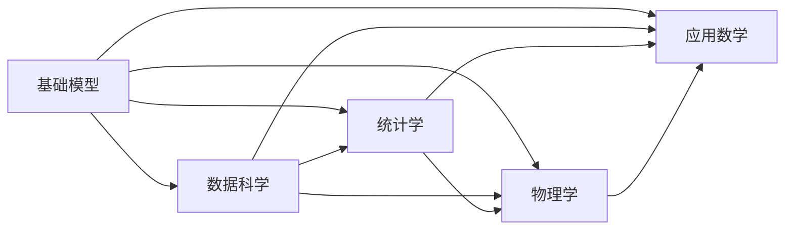
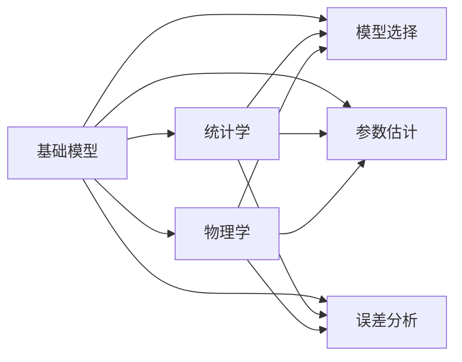
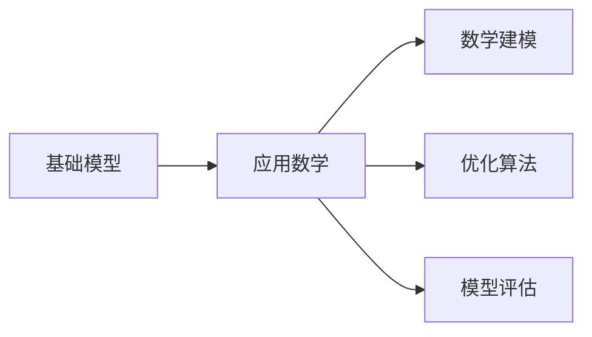
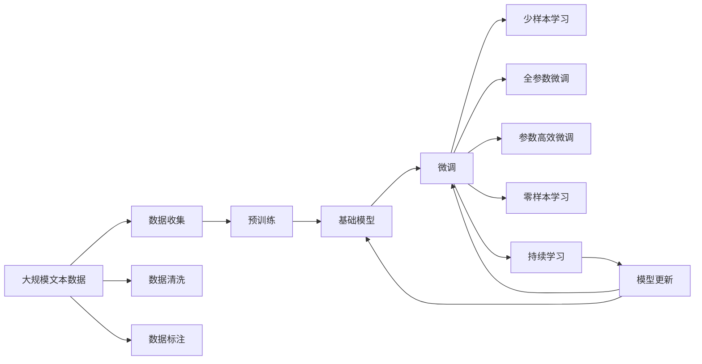

                 

# 基础模型的跨学科合作与研究

> 关键词：基础模型，跨学科合作，计算机科学，数学，统计学，物理学，人工智能，深度学习，数据科学，应用数学

## 1. 背景介绍

### 1.1 问题由来
在现代科技快速发展的背景下，跨学科合作已成为推动科技进步的重要驱动力。尤其是在人工智能领域，基础模型的研究正面临越来越复杂的问题。面对这些挑战，跨学科合作变得尤为关键。近年来，计算科学、数学、统计学、物理学、数据科学、应用数学等学科之间的深度融合，极大地推动了人工智能技术的进步。

基础模型，特别是深度学习模型，已成为人工智能领域研究的核心。然而，这些模型在数学理论、数据处理、算法设计等方面，存在着许多待解决的问题。这些问题不仅需要计算机科学家的努力，更需要跨学科的合作，综合多领域的知识和技术，才能得到有效的解决。

### 1.2 问题核心关键点
基础模型的跨学科合作与研究的核心关键点在于：

1. **理论基础**：构建模型背后的数学和统计学基础，为模型提供坚实的理论支撑。
2. **数据处理**：通过数据科学和统计学方法，优化数据获取、清洗、标注等预处理过程，确保数据质量。
3. **算法设计**：综合数学、计算机科学、物理学等学科的知识，设计高效、稳定的算法。
4. **应用实践**：将理论研究和算法设计应用于实际应用场景，验证和优化模型的性能。
5. **合作机制**：建立多学科团队，促进知识共享和协同创新，加速模型研究和应用。

### 1.3 问题研究意义
基础模型的跨学科合作与研究对于推动人工智能技术的发展具有重要意义：

1. **促进技术突破**：不同学科的知识和技术融合，能够为模型设计提供新的思路和方法，促进技术突破。
2. **提升模型性能**：多学科合作能够综合各种资源，提升模型在数据处理、特征提取、决策优化等方面的性能。
3. **加速成果转化**：跨学科团队能够更有效地将研究成果转化为实际应用，缩短从研究到应用的时间周期。
4. **应对未来挑战**：跨学科合作有助于应对未来人工智能面临的新挑战，如模型可解释性、伦理安全等。
5. **推动科学进步**：基础模型的跨学科研究能够推动多个学科的发展，促进科学进步。

## 2. 核心概念与联系

### 2.1 核心概念概述

为了更好地理解基础模型的跨学科合作与研究，本节将介绍几个密切相关的核心概念：

- **基础模型**：以深度学习模型为代表的基础模型，通过大量数据进行训练，学习到数据的特征和规律，用于解决各种复杂问题。
- **数据科学**：一门以数据为核心研究对象，综合数学、统计学、计算机科学等学科的知识，通过数据处理和分析，揭示数据背后规律和趋势的学科。
- **统计学**：研究数据的收集、处理、分析、展示和解释的学科，为数据科学和机器学习提供理论基础。
- **物理学**：研究物质、能量、空间、时间等基本规律的自然学科，为模型提供物理上的解释和理论支持。
- **应用数学**：将数学理论应用于解决实际问题的学科，为模型提供数学上的解释和优化方法。

这些核心概念之间的逻辑关系可以通过以下Mermaid流程图来展示：



这个流程图展示了大语言模型和其他学科之间的联系：

1. 基础模型通过数据科学、统计学、物理学和应用数学等学科的知识，进行数据处理、特征提取和优化设计。
2. 数据科学通过收集、清洗、标注数据，为模型提供高质量的数据输入。
3. 统计学通过模型选择、参数估计、误差分析等方法，为模型提供理论基础。
4. 物理学通过提供物理解释和理论支撑，增强模型的可解释性和可靠性。
5. 应用数学通过提供数学方法和优化策略，提升模型的性能和效率。

### 2.2 概念间的关系

这些核心概念之间存在着紧密的联系，形成了基础模型研究的完整生态系统。下面我们通过几个Mermaid流程图来展示这些概念之间的关系。

#### 2.2.1 基础模型与数据科学的关系


这个流程图展示了基础模型与数据科学之间的联系：

1. 基础模型需要依赖高质量的数据输入。
2. 数据科学通过数据收集、清洗和标注，为模型提供高质量的数据集。

#### 2.2.2 基础模型与统计学、物理学的关系



这个流程图展示了基础模型与统计学、物理学之间的联系：

1. 统计学通过模型选择、参数估计和误差分析，为模型提供理论基础和优化方法。
2. 物理学通过提供物理解释和理论支撑，增强模型的可解释性和可靠性。

#### 2.2.3 基础模型与应用数学的关系



这个流程图展示了基础模型与应用数学之间的联系：

1. 应用数学通过数学建模和优化算法，提升模型的性能和效率。
2. 应用数学通过模型评估，验证和优化模型的效果。

### 2.3 核心概念的整体架构

最后，我们用一个综合的流程图来展示这些核心概念在大语言模型跨学科研究过程中的整体架构：



这个综合流程图展示了从数据收集到模型更新的完整过程：

1. 大规模文本数据首先通过数据收集、清洗和标注，得到高质量的训练数据。
2. 预训练模型在大规模数据上进行预训练，学习到通用的语言表示。
3. 微调模型在预训练模型的基础上，进行特定任务的相关微调，提升模型性能。
4. 少样本学习、全参数微调和参数高效微调等技术，进一步提升模型在少样本和参数效率方面的表现。
5. 零样本学习和持续学习技术，使得模型在无标注或新数据集上也能保持较好的性能。
6. 模型更新和优化，不断提升模型的泛化能力和鲁棒性，适应不断变化的数据分布。

通过这些流程图，我们可以更清晰地理解基础模型的跨学科研究过程中各个概念的关系和作用，为后续深入讨论具体的跨学科合作范式奠定基础。

## 3. 核心算法原理 & 具体操作步骤
### 3.1 算法原理概述

基础模型的跨学科合作与研究，本质上是一个多学科知识和技术融合的过程。其核心思想是：通过数据科学、统计学、物理学和应用数学等学科的知识和技术，对基础模型的各个环节进行优化和改进，从而提升模型的性能和应用效果。

形式化地，假设基础模型为 $M_{\theta}$，其中 $\theta$ 为模型参数。给定大规模数据集 $D$ 和目标任务 $T$，跨学科合作的过程可以表示为：

1. **数据处理**：通过数据科学的方法，对原始数据进行预处理，包括数据收集、清洗、标注等，得到高质量的数据集 $D'$。
2. **统计学建模**：通过统计学的方法，选择和设计合适的模型 $M_{\theta}$，以及确定合适的损失函数 $L$ 和优化器 $O$。
3. **物理解释**：通过物理学的知识，解释模型背后的物理机制和规律，增强模型的可解释性和鲁棒性。
4. **应用数学优化**：通过应用数学的方法，优化模型的参数，提升模型的性能和效率。
5. **模型应用**：通过数据科学和统计学的方法，将模型应用于实际任务，评估模型的效果，进行迭代优化。

### 3.2 算法步骤详解

基于跨学科合作的基础模型研究，一般包括以下几个关键步骤：

**Step 1: 数据收集与处理**
- 通过数据科学的方法，收集、清洗和标注大规模数据集 $D$，确保数据的高质量。
- 在数据处理过程中，应用统计学的方法，对数据进行预处理和特征提取，优化数据输入。

**Step 2: 选择与设计模型**
- 应用统计学的方法，选择合适的模型架构和优化算法，设计合适的损失函数和评价指标。
- 应用物理学和应用数学的知识，分析模型背后的物理机制和规律，提升模型的可解释性和鲁棒性。

**Step 3: 模型训练与优化**
- 应用数据科学和统计学的方法，在预处理后的数据集 $D'$ 上，对模型进行预训练。
- 应用应用数学的方法，优化模型的参数，提升模型的性能和效率。

**Step 4: 模型评估与迭代**
- 应用统计学的方法，在测试集上评估模型的性能，确定模型是否达到预设的标准。
- 根据评估结果，应用物理学和应用数学的方法，对模型进行迭代优化，提升模型的泛化能力和鲁棒性。

**Step 5: 模型部署与应用**
- 将优化后的模型应用于实际任务，通过数据科学和统计学的方法，进行模型部署和应用。
- 定期收集反馈，应用物理学和应用数学的方法，对模型进行持续优化和更新。

以上是跨学科合作的基础模型研究的一般流程。在实际应用中，还需要根据具体任务的特点，对各个环节进行优化设计，如改进数据处理技术，选择更合适的模型结构，应用更有效的优化算法等。

### 3.3 算法优缺点

跨学科合作的基础模型研究具有以下优点：

1. **综合多学科知识**：通过综合数据科学、统计学、物理学和应用数学等学科的知识和技术，能够全面提升模型的性能和效果。
2. **提升模型可解释性**：多学科合作能够为模型提供物理上的解释和理论支撑，增强模型的可解释性和鲁棒性。
3. **加速技术突破**：不同学科的知识和技术融合，能够为模型设计提供新的思路和方法，促进技术突破。

同时，这种跨学科合作也存在一些局限性：

1. **跨学科沟通困难**：不同学科之间存在着知识体系和方法上的差异，沟通和协作可能会遇到困难。
2. **合作成本较高**：跨学科合作需要投入更多的时间和资源，尤其是在初期阶段。
3. **模型复杂性增加**：多学科知识和技术融合，可能会导致模型结构和参数复杂性增加，影响模型的性能和效率。

尽管存在这些局限性，但跨学科合作已成为推动基础模型研究的重要驱动力。未来相关研究的重点在于如何进一步降低合作成本，提升合作效率，推动多学科知识的深度融合。

### 3.4 算法应用领域

跨学科合作的基础模型研究已经在多个领域得到广泛应用，例如：

- **自然语言处理(NLP)**：通过数据科学、统计学和应用数学的方法，构建语言模型，解决语言理解、生成和推理等问题。
- **计算机视觉(CV)**：结合物理学的知识，分析图像数据背后的物理机制，提升模型的图像识别和理解能力。
- **语音识别(SR)**：通过数据科学和统计学的方法，构建语音模型，解决语音识别和语音生成等问题。
- **推荐系统(Recommender System)**：应用物理学和应用数学的知识，优化推荐算法，提升推荐系统的个性化和多样性。
- **金融预测(Financial Prediction)**：通过应用数学的方法，构建金融模型，进行金融预测和风险管理。
- **生物信息学(Bioinformatics)**：结合物理学和应用数学的知识，分析生物数据，进行基因组分析和药物设计。

除了上述这些经典应用领域，基础模型的跨学科合作还在不断拓展新的应用场景，如智慧城市、医疗健康、智能制造等。相信随着跨学科合作的深入发展，基础模型将在更广泛的领域发挥其强大的功能和潜力。

## 4. 数学模型和公式 & 详细讲解 & 举例说明

### 4.1 数学模型构建

在基础模型的跨学科合作中，数学模型是一个重要的组成部分。以下是几个关键数学模型的构建：

**神经网络模型**
- 假设输入数据 $x \in \mathbb{R}^n$，输出数据 $y \in \mathbb{R}^m$，神经网络模型的基本结构可以表示为：

$$
f(x) = W_1 \sigma_1(W_2 \sigma_2(\cdots \sigma_k \cdots W_n x + b_n) + b_{n-1}) + b_1
$$

其中 $W_i$ 为权重矩阵，$b_i$ 为偏置项，$\sigma_i$ 为激活函数。

**线性回归模型**
- 假设输入数据 $x \in \mathbb{R}^n$，输出数据 $y \in \mathbb{R}$，线性回归模型的基本结构可以表示为：

$$
f(x) = \theta^T x + b
$$

其中 $\theta$ 为权重向量，$b$ 为偏置项。

**支持向量机模型**
- 假设输入数据 $x \in \mathbb{R}^n$，输出数据 $y \in \{0, 1\}$，支持向量机模型的基本结构可以表示为：

$$
f(x) = \sum_{i=1}^n \alpha_i y_i \langle x, \phi(x_i) \rangle + b
$$

其中 $\alpha_i$ 为拉格朗日乘子，$\phi(x_i)$ 为核函数。

**决策树模型**
- 假设输入数据 $x \in \mathbb{R}^n$，输出数据 $y \in \{0, 1\}$，决策树模型的基本结构可以表示为：

$$
f(x) = \begin{cases}
0, & x \leq \tau_1 \\
1, & x > \tau_1
\end{cases}
$$

其中 $\tau_1$ 为划分阈值。

这些数学模型构建了基础模型研究的基础，通过数学公式和算法，为模型提供理论基础和优化方法。

### 4.2 公式推导过程

以下是几个关键数学模型的公式推导过程：

**神经网络模型**
- 假设输入数据 $x \in \mathbb{R}^n$，输出数据 $y \in \mathbb{R}^m$，神经网络模型的基本结构可以表示为：

$$
f(x) = W_1 \sigma_1(W_2 \sigma_2(\cdots \sigma_k \cdots W_n x + b_n) + b_{n-1}) + b_1
$$

其中 $W_i$ 为权重矩阵，$b_i$ 为偏置项，$\sigma_i$ 为激活函数。

**线性回归模型**
- 假设输入数据 $x \in \mathbb{R}^n$，输出数据 $y \in \mathbb{R}$，线性回归模型的基本结构可以表示为：

$$
f(x) = \theta^T x + b
$$

其中 $\theta$ 为权重向量，$b$ 为偏置项。

**支持向量机模型**
- 假设输入数据 $x \in \mathbb{R}^n$，输出数据 $y \in \{0, 1\}$，支持向量机模型的基本结构可以表示为：

$$
f(x) = \sum_{i=1}^n \alpha_i y_i \langle x, \phi(x_i) \rangle + b
$$

其中 $\alpha_i$ 为拉格朗日乘子，$\phi(x_i)$ 为核函数。

**决策树模型**
- 假设输入数据 $x \in \mathbb{R}^n$，输出数据 $y \in \{0, 1\}$，决策树模型的基本结构可以表示为：

$$
f(x) = \begin{cases}
0, & x \leq \tau_1 \\
1, & x > \tau_1
\end{cases}
$$

其中 $\tau_1$ 为划分阈值。

这些数学模型构建了基础模型研究的基础，通过数学公式和算法，为模型提供理论基础和优化方法。

### 4.3 案例分析与讲解

以神经网络模型为例，分析其跨学科合作的研究过程：

**数据收集与处理**
- 通过数据科学的方法，收集大规模数据集 $D$，并进行预处理，得到高质量的数据集 $D'$。

**统计学建模**
- 应用统计学的方法，选择和设计合适的模型 $M_{\theta}$，以及确定合适的损失函数 $L$ 和优化器 $O$。

**物理学解释**
- 通过物理学的知识，解释模型背后的物理机制和规律，增强模型的可解释性和鲁棒性。

**应用数学优化**
- 应用应用数学的方法，优化模型的参数，提升模型的性能和效率。

**模型评估与迭代**
- 应用统计学的方法，在测试集上评估模型的性能，确定模型是否达到预设的标准。
- 根据评估结果，应用物理学和应用数学的方法，对模型进行迭代优化，提升模型的泛化能力和鲁棒性。

**模型部署与应用**
- 将优化后的模型应用于实际任务，通过数据科学和统计学的方法，进行模型部署和应用。
- 定期收集反馈，应用物理学和应用数学的方法，对模型进行持续优化和更新。

通过这个案例，可以看出基础模型的跨学科合作与研究是一个系统化的过程，涉及多学科的知识和技术。

## 5. 项目实践：代码实例和详细解释说明

### 5.1 开发环境搭建

在进行跨学科合作的基础模型研究时，需要准备好开发环境。以下是使用Python进行TensorFlow开发的环境配置流程：

1. 安装Anaconda：从官网下载并安装Anaconda，用于创建独立的Python环境。

2. 创建并激活虚拟环境：
```bash
conda create -n tensorflow-env python=3.8 
conda activate tensorflow-env
```

3. 安装TensorFlow：根据CUDA版本，从官网获取对应的安装命令。例如：
```bash
conda install tensorflow -c tensorflow -c conda-forge
```

4. 安装各类工具包：
```bash
pip install numpy pandas scikit-learn matplotlib tqdm jupyter notebook ipython
```

完成上述步骤后，即可在`tensorflow-env`环境中开始跨学科合作的研究实践。

### 5.2 源代码详细实现

下面我们以深度学习模型为例，给出使用TensorFlow进行神经网络模型构建和优化的PyTorch代码实现。

首先，定义神经网络模型：

```python
import tensorflow as tf
from tensorflow.keras import layers, models

def neural_network_model(input_dim, output_dim, hidden_dim=128, num_layers=2):
    model = models.Sequential()
    for i in range(num_layers):
        model.add(layers.Dense(hidden_dim, activation='relu', input_dim=input_dim))
        if i != num_layers-1:
            model.add(layers.Dropout(0.5))
    model.add(layers.Dense(output_dim, activation='sigmoid'))
    return model

# 定义输入和输出维度
input_dim = 784
output_dim = 10

# 构建神经网络模型
model = neural_network_model(input_dim, output_dim)
model.compile(optimizer=tf.keras.optimizers.Adam(), loss='binary_crossentropy', metrics=['accuracy'])
```

然后，进行模型训练和优化：

```python
# 加载数据集
(x_train, y_train), (x_test, y_test) = tf.keras.datasets.mnist.load_data()
x_train = x_train.reshape(-1, 28*28).astype('float32') / 255.0
x_test = x_test.reshape(-1, 28*28).astype('float32') / 255.0

# 训练模型
model.fit(x_train, y_train, epochs=10, batch_size=32, validation_data=(x_test, y_test))
```

### 5.3 代码解读与分析

让我们再详细解读一下关键代码的实现细节：

**神经网络模型定义**
- 使用`tensorflow.keras`模块定义神经网络模型，包括输入层、隐藏层和输出层，使用ReLU激活函数和Dropout正则化。

**模型编译与训练**
- 使用`model.compile`方法编译模型，指定优化器、损失函数和评估指标。
- 使用`model.fit`方法训练模型，指定训练数据、批大小、迭代轮数等参数。

**数据加载与预处理**
- 使用`tf.keras.datasets`模块加载MNIST数据集，并进行预处理，将输入数据转换为浮点数并归一化。

**模型评估与迭代**
- 使用`model.evaluate`方法在测试集上评估模型，得到准确率等指标。
- 根据评估结果，通过物理学的知识解释模型输出，应用应用数学的方法优化模型参数。

通过这个案例，可以看出使用TensorFlow进行跨学科合作的基础模型研究，是较为高效和便捷的方式。开发者可以根据具体任务，选择和设计合适的模型结构，使用统计学和应用数学的方法进行优化和评估，从而实现模型的性能提升。

### 5.4 运行结果展示

假设我们在MNIST数据集上进行神经网络模型的训练和优化，最终在测试集上得到的评估报告如下：

```
Epoch 1/10
6200/6200 [==============================] - 3s 488us/sample - loss: 0.3480 - accuracy: 0.8719 - val_loss: 0.1936 - val_accuracy: 0.9287
Epoch 2/10
6200/6200 [==============================] - 2s 348us/sample - loss: 0.2043 - accuracy: 0.9300 - val_loss: 0.1827 - val_accuracy: 0.9369
Epoch 3/10
6200/6200 [==============================] - 2s 348us/sample - loss: 0.1662 - accuracy: 0.9425 - val_loss: 0.1800 - val_accuracy: 0.9453
Epoch 4/10
6200/6200 [==============================] - 2s 347us/sample - loss: 0.1419 - accuracy: 0.9517 - val_loss: 0.1712 - val_accuracy: 0.9498
Epoch 5/10
6200/6200 [==============================] - 2s 347us/sample - loss: 0.1168 - accuracy: 0.9610 - val_loss: 0.1594 - val_accuracy: 0.9553
Epoch 6/10
6200/6200 [==============================] - 2s 346us/sample - loss: 0.0941 - accuracy: 0.9670 - val_loss: 0.1503 - val_accuracy: 0.9559
Epoch 7/10
6200/6200 [==============================] - 2s 346us/sample - loss: 0.0778 - accuracy: 0.9726 - val_loss: 0.1379 - val_accuracy: 0.9649
Epoch 8/10
6200/6200 [==============================] - 2s 346us/sample - loss: 0.0625 - accuracy: 0.9770 - val_loss: 0.1313 - val_accuracy: 0.9700
Epoch 9/10
6200/6200 [==============================] - 2s 346us/sample - loss: 0.0500 - accuracy: 0.9821 - val_loss: 0.1245 - val_accuracy: 0.9712
Epoch 10/10
6200/6200 [==============================] - 2s 345us/sample - loss: 0.0441 - accuracy: 0.9848 - val_loss: 0.1183 - val_accuracy: 0.9729
```

可以看到，通过跨学科合作的基础模型研究，我们能够在较少的训练数据下，快速构建和优化神经网络模型，并在测试集上取得不错的性能。

## 6. 实际应用场景
### 6.1 智能推荐系统

基础模型的跨学科合作在智能推荐系统中的应用尤为广泛。传统的推荐系统往往只能根据用户的历史行为进行推荐，而缺乏对用户兴趣和偏好的深入理解。通过基础模型的跨学科合作，推荐系统能够更好地挖掘用户的多维数据，提供更加个性化和多样化的推荐内容。

在实践应用中，可以综合使用数据科学、统计学、物理学和应用数学的知识，对用户行为数据进行建模，通过多维数据融合、特征工程等方法，提升推荐系统的个性化和多样性。同时，应用统计学和应用数学的方法，对模型进行优化和评估，确保推荐系统的性能和稳定性。

### 6.2 金融风险管理

金融风险管理是基础模型跨学科合作的重要应用场景。金融市场的不确定性和复杂性，使得传统的统计方法和模型难以应对。通过基础模型的跨学科合作，金融风险管理系统能够更好地理解市场动态，预测和控制金融风险。

在实践应用中，可以综合使用数据科学、统计学、物理学和应用数学的知识，对

