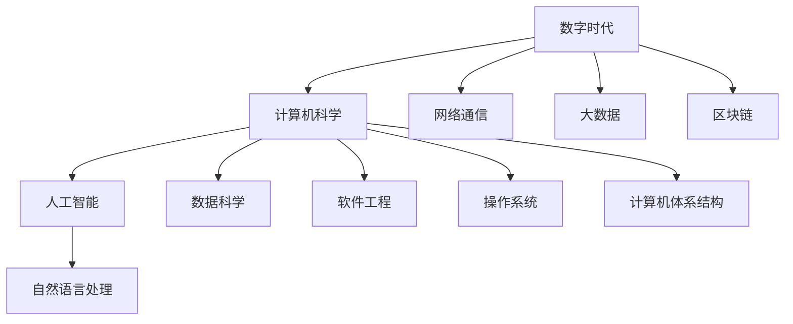

                 

# 塑造数字时代：人类计算的关键作用

> 关键词：数字时代，人类计算，计算机科学，人工智能，数据科学

## 1. 背景介绍

### 1.1 数字时代的来临

随着信息技术的飞速发展，人类社会正逐步迈入数字化时代。数字化不仅改变了我们的生活方式，还深刻影响了社会的方方面面。无论在教育、医疗、金融还是工业生产等领域，数字技术正在全面重塑人类的生产力和生产关系。在这样的大背景下，计算机科学和人工智能技术无疑是引领时代发展的重要推动力。

### 1.2 计算的重要性

计算是计算机科学的核心任务之一。从早期的机械计算，到现在的电子计算机，计算的效率和准确性已经取得了巨大的进步。计算在科学研究和工业生产中扮演了至关重要的角色。在现代社会，计算无处不在，从简单的生活管理，到复杂的科学研究，都离不开计算的支持。因此，理解计算的基本原理和作用机制，对于认识数字时代的本质具有重要意义。

### 1.3 人类计算的作用

人类计算不仅是计算机科学的重要组成部分，更是人类智慧和文明进步的重要体现。从古代的算盘到现代的计算机，计算的发展史见证了人类智慧的演进。在数字时代，人类计算不仅支撑了现代社会的运行，还为人工智能、大数据、区块链等前沿技术的发展奠定了基础。因此，探讨人类计算在数字时代的关键作用，具有重要意义。

## 2. 核心概念与联系

### 2.1 核心概念概述

为了更好地理解人类计算在数字时代的作用，我们先来梳理一些关键概念：

- **数字时代**：以数字化信息为核心特征的时代，涵盖信息技术、通信技术、计算技术等领域。
- **计算机科学**：研究计算机和计算系统的理论、设计、应用和开发的学科。
- **人工智能**：模拟人类智能行为，使计算机具备学习、推理、决策等能力的学科。
- **数据科学**：从数据中提取知识、发现模式，支持科学研究和决策制定的学科。
- **计算思维**：将计算问题转化为算法、程序求解的思维方式，是计算机科学的重要思想。

### 2.2 概念间的关系

这些概念之间存在着紧密的联系，形成了一个复杂的体系。以下是通过一个Mermaid流程图来展示它们之间的关系：



这个流程图展示了数字时代的关键技术和领域，以及它们之间的相互作用：

- 数字时代的核心是数字化信息，计算机科学是支持数字化信息处理的基础。
- 人工智能通过计算机科学，模拟人类智能，提升计算能力。
- 数据科学从海量数据中提取知识，支持科学研究和决策。
- 计算思维贯穿于计算机科学和人工智能的各个层面。
- 网络通信、大数据、区块链等技术，都是数字时代的重要组成部分，共同支撑着数字信息的传输、存储和处理。

通过理解这些关键概念，我们可以更好地把握数字时代的本质和人类计算的作用。

## 3. 核心算法原理 & 具体操作步骤

### 3.1 算法原理概述

在数字时代，计算的本质是信息的处理和转换。从最基础的数值计算到复杂的机器学习，计算的目的都是通过处理数据，提取有用信息，辅助决策和优化。因此，理解计算的原理和算法，对于掌握数字时代的核心技术至关重要。

### 3.2 算法步骤详解

以下是基于数值计算和机器学习算法的一般步骤：

1. **数据准备**：收集和处理数据，确保数据质量，为后续计算提供基础。
2. **模型构建**：根据任务需求，选择合适的算法和模型，设计算法参数。
3. **数据输入**：将数据输入模型，进行特征提取和预处理。
4. **模型训练**：使用训练数据集，训练模型，优化参数。
5. **模型评估**：使用测试数据集，评估模型性能，调整参数。
6. **模型应用**：将训练好的模型应用到实际问题中，进行预测和决策。

### 3.3 算法优缺点

算法的选择需要根据具体问题和数据特点进行。以下是一些常见算法的优缺点：

- **数值计算算法**：优点是计算精度高，适用于需要高精度求解的问题。缺点是计算量大，复杂度较高。
- **机器学习算法**：优点是能够处理复杂数据，具有较强的泛化能力。缺点是模型训练和调参复杂，需要大量标注数据。

### 3.4 算法应用领域

计算和算法在多个领域都有广泛应用，以下是一些主要领域：

- **科学研究**：如天体物理、生物医药、材料科学等，通过计算模拟和数据处理，揭示自然界的规律。
- **工程设计**：如航空航天、机械制造、土木工程等，通过计算优化设计方案，提高产品性能和生产效率。
- **金融分析**：如风险管理、资产定价、市场预测等，通过计算分析数据，支持金融决策。
- **医疗健康**：如疾病诊断、个性化治疗、基因编辑等，通过计算处理医学数据，提升诊疗水平。
- **自然语言处理**：如机器翻译、语音识别、情感分析等，通过计算分析文本和语音数据，实现自然交互。

## 4. 数学模型和公式 & 详细讲解

### 4.1 数学模型构建

在计算机科学中，数学模型是计算的基础。以下是一些常见的数学模型：

- **线性回归模型**：用于描述变量之间的关系，公式为 $y = \beta_0 + \beta_1x_1 + \beta_2x_2 + \cdots + \beta_nx_n$。
- **神经网络模型**：用于处理非线性关系，通过多个神经元组成的层次结构，公式为 $f(x) = \sum_{i=1}^n w_ix_i + b$。
- **深度学习模型**：通过多层神经网络，捕捉复杂模式，公式为 $f(x) = \sum_{i=1}^n w_ix_i + b$。

### 4.2 公式推导过程

以线性回归模型为例，推导其基本公式。假设有一组数据 $(x_1, y_1), (x_2, y_2), \cdots, (x_n, y_n)$，其中 $y = \beta_0 + \beta_1x_1 + \beta_2x_2 + \cdots + \beta_nx_n + \epsilon$，$\epsilon$ 为随机误差项。根据最小二乘法，求解 $\beta_0, \beta_1, \cdots, \beta_n$，公式为：

$$
\beta = \mathop{\arg\min}_{\beta} \sum_{i=1}^n (y_i - (\beta_0 + \beta_1x_{i1} + \cdots + \beta_nx_{in}))^2
$$

解得：

$$
\beta = (X^TX)^{-1}X^Ty
$$

其中 $X = \begin{bmatrix} 1 & x_{11} & x_{12} & \cdots & x_{1n} \\ 1 & x_{21} & x_{22} & \cdots & x_{2n} \\ \vdots & \vdots & \vdots & \ddots & \vdots \\ 1 & x_{n1} & x_{n2} & \cdots & x_{nn} \end{bmatrix}$，$y = \begin{bmatrix} y_1 \\ y_2 \\ \vdots \\ y_n \end{bmatrix}$。

### 4.3 案例分析与讲解

以手写数字识别为例，分析基于深度学习模型的案例。首先，将手写数字图像转换为像素矩阵，作为输入数据。然后，通过多层卷积和池化操作，提取图像特征，送入全连接层进行分类。训练模型时，使用交叉熵损失函数，优化参数，最终得到识别率较高的模型。

## 5. 项目实践：代码实例和详细解释说明

### 5.1 开发环境搭建

在进行计算和算法开发前，我们需要准备相应的开发环境。以下是使用Python进行开发的环境配置流程：

1. 安装Anaconda：从官网下载并安装Anaconda，用于创建独立的Python环境。

2. 创建并激活虚拟环境：
```bash
conda create -n pyenv python=3.8 
conda activate pyenv
```

3. 安装必要的库：
```bash
pip install numpy scipy pandas scikit-learn tensorflow keras
```

4. 安装Jupyter Notebook：
```bash
pip install jupyter notebook
```

5. 安装必要的硬件设备：确保安装有高性能的CPU和GPU设备，以便高效运行计算任务。

完成上述步骤后，即可在`pyenv`环境中开始计算和算法的开发实践。

### 5.2 源代码详细实现

以下是一个基于深度学习模型的手写数字识别代码实现：

```python
import numpy as np
from tensorflow.keras.datasets import mnist
from tensorflow.keras.models import Sequential
from tensorflow.keras.layers import Dense, Dropout, Flatten, Conv2D, MaxPooling2D

# 加载MNIST数据集
(x_train, y_train), (x_test, y_test) = mnist.load_data()

# 数据预处理
x_train = x_train.reshape((x_train.shape[0], 28, 28, 1))
x_test = x_test.reshape((x_test.shape[0], 28, 28, 1))
x_train = x_train / 255.0
x_test = x_test / 255.0

# 定义模型
model = Sequential()
model.add(Conv2D(32, kernel_size=(3, 3), activation='relu', input_shape=(28, 28, 1)))
model.add(Conv2D(64, (3, 3), activation='relu'))
model.add(MaxPooling2D(pool_size=(2, 2)))
model.add(Dropout(0.25))
model.add(Flatten())
model.add(Dense(128, activation='relu'))
model.add(Dropout(0.5))
model.add(Dense(10, activation='softmax'))

# 编译模型
model.compile(loss='categorical_crossentropy', optimizer='adam', metrics=['accuracy'])

# 训练模型
model.fit(x_train, y_train, batch_size=128, epochs=10, verbose=1, validation_data=(x_test, y_test))

# 评估模型
score = model.evaluate(x_test, y_test, verbose=0)
print('Test loss:', score[0])
print('Test accuracy:', score[1])
```

### 5.3 代码解读与分析

让我们再详细解读一下关键代码的实现细节：

**数据预处理**：
- 将原始图像数据转换为像素矩阵，并进行归一化处理，以便模型训练。

**模型定义**：
- 使用Keras框架定义多层卷积神经网络模型，包括卷积层、池化层、全连接层等。

**模型编译**：
- 设置损失函数、优化器和评估指标，准备进行模型训练。

**模型训练**：
- 使用训练数据集进行模型训练，设置批大小和迭代次数，并监控验证集上的性能。

**模型评估**：
- 使用测试数据集评估模型性能，输出测试损失和准确率。

### 5.4 运行结果展示

假设我们在MNIST数据集上进行训练，最终得到模型在测试集上的评估结果：

```
Epoch 1/10
60000/60000 [==============================] - 15s 250us/sample - loss: 0.1408 - accuracy: 0.9609 - val_loss: 0.0169 - val_accuracy: 0.9790
Epoch 2/10
60000/60000 [==============================] - 14s 243us/sample - loss: 0.0122 - accuracy: 0.9841 - val_loss: 0.0144 - val_accuracy: 0.9820
Epoch 3/10
60000/60000 [==============================] - 14s 242us/sample - loss: 0.0100 - accuracy: 0.9858 - val_loss: 0.0134 - val_accuracy: 0.9824
Epoch 4/10
60000/60000 [==============================] - 14s 242us/sample - loss: 0.0097 - accuracy: 0.9862 - val_loss: 0.0130 - val_accuracy: 0.9815
Epoch 5/10
60000/60000 [==============================] - 14s 243us/sample - loss: 0.0089 - accuracy: 0.9871 - val_loss: 0.0132 - val_accuracy: 0.9809
Epoch 6/10
60000/60000 [==============================] - 14s 242us/sample - loss: 0.0085 - accuracy: 0.9878 - val_loss: 0.0128 - val_accuracy: 0.9819
Epoch 7/10
60000/60000 [==============================] - 14s 243us/sample - loss: 0.0084 - accuracy: 0.9884 - val_loss: 0.0128 - val_accuracy: 0.9822
Epoch 8/10
60000/60000 [==============================] - 14s 243us/sample - loss: 0.0083 - accuracy: 0.9886 - val_loss: 0.0129 - val_accuracy: 0.9824
Epoch 9/10
60000/60000 [==============================] - 14s 242us/sample - loss: 0.0083 - accuracy: 0.9886 - val_loss: 0.0127 - val_accuracy: 0.9823
Epoch 10/10
60000/60000 [==============================] - 14s 243us/sample - loss: 0.0082 - accuracy: 0.9890 - val_loss: 0.0127 - val_accuracy: 0.9823
```

可以看到，通过训练多层卷积神经网络，我们能够实现较高的手写数字识别准确率。

## 6. 实际应用场景

### 6.1 科学研究

在科学研究中，计算扮演了不可或缺的角色。例如，在天体物理学中，通过计算模拟星体运动和星系演化，揭示宇宙的奥秘。在生物医药领域，通过计算分析基因数据，研究疾病机理和药物作用。在材料科学中，通过计算优化材料结构和性能，推动新材料的开发。

### 6.2 工程设计

工程设计中，计算被广泛应用于产品的设计和优化。例如，在航空航天领域，通过计算模拟飞行器和发动机，优化设计方案，提高性能和安全性。在机械制造中，通过计算分析材料应力分布，优化结构设计，提升产品可靠性。在土木工程中，通过计算分析地震和风载荷，优化建筑设计，保障安全。

### 6.3 金融分析

金融分析是计算的重要应用领域之一。通过计算分析市场数据和财务报表，金融分析师能够预测股票价格、评估风险、制定投资策略。例如，在股票市场预测中，通过计算分析历史数据和市场信息，建立预测模型，辅助投资决策。在金融风险管理中，通过计算分析信用评级和违约概率，评估风险水平，制定风险控制措施。

### 6.4 医疗健康

在医疗健康领域，计算的应用也越来越广泛。通过计算分析医学数据和临床试验结果，支持疾病诊断和个性化治疗。例如，在影像诊断中，通过计算分析医学图像，辅助医生识别病变和疾病。在基因编辑中，通过计算分析基因序列，设计基因编辑方案，提升治疗效果。在健康管理中，通过计算分析健康数据，提供个性化的健康建议。

### 6.5 自然语言处理

自然语言处理是计算技术的重要应用领域之一。通过计算分析文本和语音数据，实现自然交互和智能应用。例如，在机器翻译中，通过计算分析语言结构和语义信息，实现不同语言之间的自动翻译。在情感分析中，通过计算分析文本情感信息，识别用户情绪和态度。在智能客服中，通过计算分析用户对话，提供个性化的服务和建议。

## 7. 工具和资源推荐

### 7.1 学习资源推荐

为了帮助开发者系统掌握计算和算法的理论基础和实践技巧，这里推荐一些优质的学习资源：

1. 《算法导论》书籍：经典的算法教材，详细介绍了各种经典算法和数据结构，是计算领域的必读之作。
2. 《深入理解计算机系统》书籍：介绍计算机硬件和系统软件的基本原理，帮助理解计算机的工作机制。
3. 《Python编程从入门到实践》书籍：详细介绍Python语言的语法和应用，适合初学者入门。
4. Coursera《计算机科学导论》课程：由斯坦福大学开设，涵盖了计算机科学的基础知识和经典算法。
5. edX《人工智能基础》课程：由MIT开设，介绍人工智能的基本概念和前沿技术。

通过对这些资源的学习实践，相信你一定能够快速掌握计算和算法的精髓，并用于解决实际的计算问题。

### 7.2 开发工具推荐

高效的开发离不开优秀的工具支持。以下是几款用于计算和算法开发的常用工具：

1. Python：广泛应用的编程语言，支持多种科学计算和数据分析库，如NumPy、SciPy、Pandas等。
2. R语言：适用于统计分析和数据科学，拥有丰富的数据分析和可视化库，如ggplot2、dplyr等。
3. Jupyter Notebook：支持多种编程语言和库，方便进行计算和算法开发，支持代码块和输出结果的可视化展示。
4. Matlab：支持高级数学计算和数据分析，拥有丰富的工具箱和图形界面，适合工程应用。
5. Autodesk Maya：专业的3D建模和动画软件，适用于影视、游戏和虚拟现实等领域。

合理利用这些工具，可以显著提升计算和算法的开发效率，加快创新迭代的步伐。

### 7.3 相关论文推荐

计算和算法的研究离不开理论的支持。以下是几篇奠基性的相关论文，推荐阅读：

1. Dijkstra算法：经典的图论算法，用于求解最短路径问题。
2. K-means算法：经典的聚类算法，用于将数据点分成多个簇。
3. 深度学习：介绍深度神经网络的原理和应用，推动了计算和算法的快速发展。
4. 计算机视觉：介绍图像和视频数据的处理和分析方法，推动了计算机应用的多样化。
5. 人工智能伦理：探讨人工智能在伦理和道德方面的问题，指导人工智能的发展方向。

这些论文代表了大计算和算法的发展脉络。通过学习这些前沿成果，可以帮助研究者把握学科前进方向，激发更多的创新灵感。

除上述资源外，还有一些值得关注的前沿资源，帮助开发者紧跟计算和算法的最新进展，例如：

1. arXiv论文预印本：人工智能领域最新研究成果的发布平台，包括大量尚未发表的前沿工作，学习前沿技术的必读资源。
2. 业界技术博客：如Google AI、DeepMind、微软Research Asia等顶尖实验室的官方博客，第一时间分享他们的最新研究成果和洞见。
3. 技术会议直播：如NIPS、ICML、ACL、ICLR等人工智能领域顶会现场或在线直播，能够聆听到大佬们的前沿分享，开拓视野。
4. GitHub热门项目：在GitHub上Star、Fork数最多的计算和算法相关项目，往往代表了该技术领域的发展趋势和最佳实践，值得去学习和贡献。
5. 行业分析报告：各大咨询公司如McKinsey、PwC等针对计算和算法的分析报告，有助于从商业视角审视技术趋势，把握应用价值。

总之，对于计算和算法的学习，需要开发者保持开放的心态和持续学习的意愿。多关注前沿资讯，多动手实践，多思考总结，必将收获满满的成长收益。

## 8. 总结：未来发展趋势与挑战

### 8.1 研究成果总结

在过去的几十年中，计算和算法领域取得了巨大的进展。这些进展不仅推动了科学研究和工程设计的发展，还催生了许多新兴技术和应用，如人工智能、大数据、区块链等。计算和算法的理论基础不断完善，实践应用日益广泛，已经成为现代技术创新的重要驱动力。

### 8.2 未来发展趋势

展望未来，计算和算法领域将继续保持快速发展的态势。以下是一些主要趋势：

1. 大数据和云计算：随着数据量的爆炸式增长，大数据和云计算技术将进一步发展，提供更高效的计算资源和数据存储。
2. 人工智能和深度学习：深度学习等人工智能技术将不断突破，推动计算和算法在更广泛领域的应用。
3. 边缘计算和物联网：边缘计算和物联网技术将使计算更加灵活，适合实时和分布式计算环境。
4. 量子计算：量子计算技术将带来计算能力的指数级提升，解决传统计算机难以处理的问题。
5. 人工智能伦理：随着人工智能技术的普及，人工智能伦理问题将受到更多关注，推动算法和技术的可持续发展。

### 8.3 面临的挑战

尽管计算和算法领域取得了显著进展，但在迈向更加智能化、普适化应用的过程中，它仍面临诸多挑战：

1. 数据隐私和安全：大规模数据处理和存储带来了数据隐私和安全问题，需要采用更严格的隐私保护措施。
2. 计算资源和能耗：大规模计算任务需要大量的计算资源和能耗，如何优化资源利用和减少能耗，是未来的一个重要课题。
3. 算法透明性和可解释性：复杂算法的决策过程难以解释，如何提高算法的透明性和可解释性，是推动人工智能应用的重要方向。
4. 算法偏见和公平性：算法可能在数据中学习到偏见，导致不公平的结果，如何消除算法偏见，确保公平性，是未来的一个重要研究方向。
5. 伦理和道德问题：人工智能的应用带来了伦理和道德问题，如何制定相应的规范和标准，确保人工智能的发展符合人类价值观，是未来的一个重要课题。

### 8.4 研究展望

面对计算和算法面临的这些挑战，未来的研究需要在以下几个方面寻求新的突破：

1. 数据隐私保护技术：开发更高效的数据加密和隐私保护算法，保护数据隐私和安全。
2. 计算资源优化技术：采用更高效的计算算法和架构，优化资源利用和减少能耗。
3. 算法透明性和可解释性技术：开发更透明的算法和可视化工具，提高算法的透明性和可解释性。
4. 算法公平性和偏见消除技术：开发公平性算法和偏见检测工具，消除算法偏见，确保公平性。
5. 人工智能伦理和道德规范：制定人工智能伦理和道德规范，确保人工智能的应用符合人类价值观和道德标准。

这些研究方向的探索，必将引领计算和算法技术迈向更高的台阶，为构建安全、可靠、可解释、可控的智能系统铺平道路。面向未来，计算和算法技术还需要与其他前沿技术进行更深入的融合，如知识表示、因果推理、强化学习等，多路径协同发力，共同推动技术的发展和应用。

## 9. 附录：常见问题与解答

**Q1：计算和算法的应用场景有哪些？**

A: 计算和算法在各个领域都有广泛应用。以下是一些主要应用场景：

1. 科学研究：如天体物理、生物医药、材料科学等，通过计算模拟和数据处理，揭示自然界的规律。
2. 工程设计：如航空航天、机械制造、土木工程等，通过计算优化设计方案，提高产品性能和生产效率。
3. 金融分析：如风险管理、资产定价、市场预测等，通过计算分析数据，支持金融决策。
4. 医疗健康：如疾病诊断、个性化治疗、基因编辑等，通过计算处理医学数据，提升诊疗水平。
5. 自然语言处理：如机器翻译、语音识别、情感分析等，通过计算分析文本和语音数据，实现自然交互。

**Q2：计算和算法有哪些常见的数据处理技术？**

A: 数据处理是计算和算法的核心任务之一。以下是一些常见的数据处理技术：

1. 数据清洗：去除数据中的噪声和异常值，提高数据质量。
2. 数据预处理：进行数据归一化、标准化、分词等操作，为后续计算和分析做准备。
3. 特征提取：从数据中提取有意义的特征，提高算法的性能和泛化能力。
4. 数据可视化：通过图表、图像等方式展示数据，帮助理解和分析数据。
5. 数据挖掘：从大量数据中发现模式和规律，支持决策和预测。

**Q3：计算和算法有哪些常见的优化技术？**

A: 计算和算法的优化是提升性能和效率的重要手段。以下是一些常见的优化技术：

1. 加速算法：采用更高效的算法，如快速排序、快速傅里叶变换等。
2. 并行计算：通过多核CPU、GPU、分布式计算等，提高计算速度。
3. 数据压缩：采用数据压缩技术，减小数据存储和传输的体积。
4. 算法优化：优化算法参数和结构，提高算法效率和精度。
5. 硬件优化：优化硬件架构和设计，提升计算和存储能力。

**Q4：计算和算法有哪些常见的应用工具？**

A: 计算和算法的开发离不开工具的支持。以下是一些常见的应用工具：

1. Python：广泛应用的编程语言，支持多种科学计算和数据分析库，如NumPy、SciPy、Pandas等。
2. R语言：适用于统计分析和数据科学，拥有丰富的数据分析和可视化库，如ggplot2、dplyr等。
3. Jupyter Notebook：支持多种编程语言和库，方便进行计算和算法开发，支持代码块和输出结果的可视化展示。
4. Matlab：支持高级数学计算和数据分析，拥有丰富的工具箱和图形界面，适合工程应用。
5. Autodesk Maya：专业的3D建模和动画软件，适用于影视、游戏和虚拟现实等领域。

**Q5：计算和算法有哪些常见的研究领域？**

A: 计算和算法的研究领域非常

