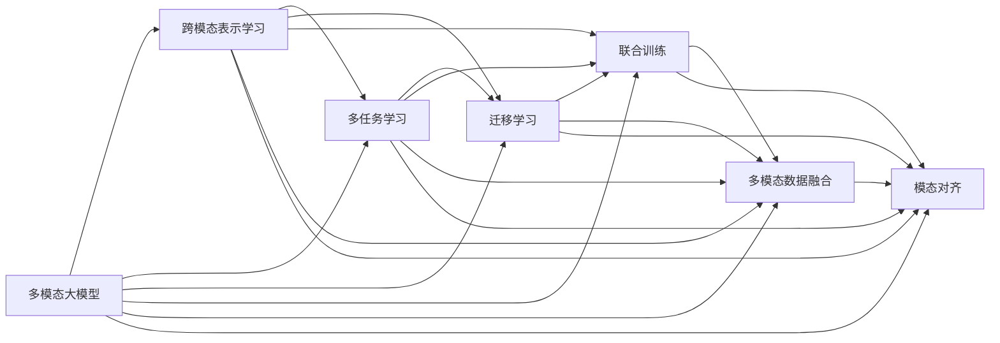
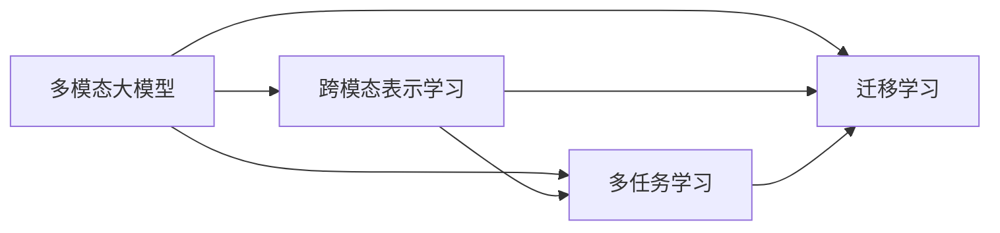
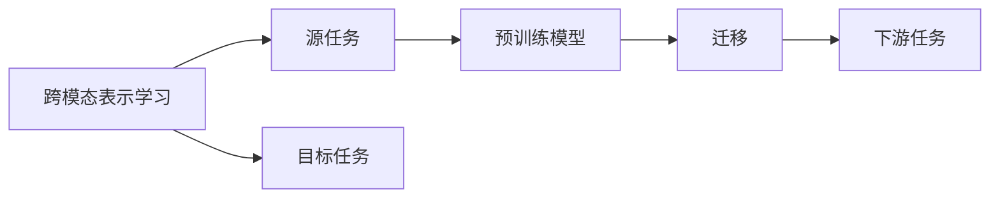
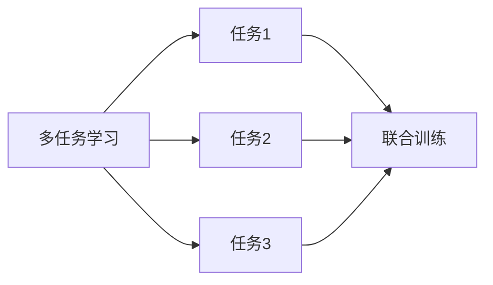
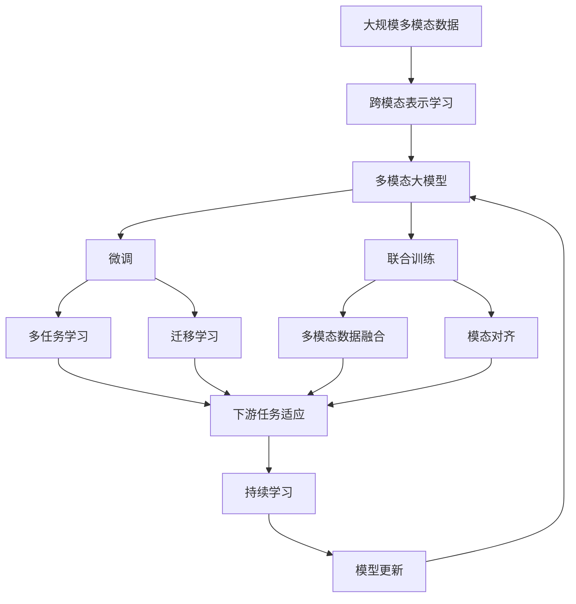

                 

# 多模态大模型：技术原理与实战 多模态大模型的核心技术

## 1. 背景介绍

### 1.1 问题由来
近年来，随着深度学习技术的飞速发展，特别是深度神经网络在大规模数据上的训练取得突破性进展，多模态大模型（Multimodal Large Models, MLMs）成为人工智能领域的热点。多模态大模型通过结合图像、视频、音频等多种模态数据，学习更加全面、准确的知识表示，具有强大的跨模态迁移和推理能力。这一进展标志着人工智能技术在多模态领域的应用迈出了坚实的一步。

### 1.2 问题核心关键点
多模态大模型的核心在于其能够理解和处理多种数据模态，从而在不同模态数据间进行有效迁移和融合。这使得模型可以应用于诸如图像分类、视觉问答、语音识别、音频分类、视频分析等众多实际任务中。然而，由于多模态数据的多样性和复杂性，模型的设计和训练过程也面临诸多挑战。因此，本文聚焦于多模态大模型的技术原理和实际应用，旨在为开发者和研究者提供全面的技术指导。

### 1.3 问题研究意义
研究多模态大模型，对于拓展AI在多模态领域的应用，提升各类多模态任务的性能，加速多模态技术的产业化进程，具有重要意义：

1. **降低应用开发成本**：通过预训练多模态大模型，可以显著减少从头开发所需的计算资源和时间成本，加速模型应用部署。
2. **提升模型效果**：多模态大模型通过融合多模态数据，可以获得更加丰富和全面的语义理解，从而在多模态任务上取得更优表现。
3. **加速开发进度**：借助预训练多模态大模型，开发者可以快速适配特定任务，缩短开发周期。
4. **带来技术创新**：多模态大模型的研究和应用，促进了对预训练-微调、跨模态表示学习等前沿技术的深入研究，催生了新的研究方向。
5. **赋能产业升级**：多模态大模型的应用，使得AI技术更容易被各行各业所采用，为传统行业数字化转型提供了新的技术路径。

## 2. 核心概念与联系

### 2.1 核心概念概述

为更好地理解多模态大模型的技术原理和实际应用，本节将介绍几个关键的多模态概念：

- **多模态大模型（MLMs）**：结合图像、视频、音频等多模态数据进行预训练的语言模型，具备跨模态的迁移和推理能力。
- **跨模态表示学习（Cross-Modal Representation Learning）**：学习将不同模态的数据映射到统一的低维空间中，以便进行有效的跨模态信息融合和迁移。
- **多任务学习（Multitask Learning）**：在同一数据集上训练多个相关但不同的任务，提高模型的泛化能力和学习效率。
- **迁移学习（Transfer Learning）**：在源任务上预训练的模型，通过微调在目标任务上进行迁移，利用已有知识提高新任务的表现。
- **联合训练（Joint Training）**：在同一数据集上训练多个模态的模型，使得它们可以协同工作，共同提升任务性能。
- **多模态数据融合（Multimodal Data Fusion）**：将不同模态的数据进行融合，生成更加全面和准确的多模态特征表示。
- **模态对齐（Modal Alignment）**：对不同模态的数据进行特征对齐，使得它们在融合时更加一致和高效。

这些核心概念之间的联系可以通过以下Mermaid流程图来展示：



这个流程图展示了多模态大模型的核心概念及其之间的关联关系：

1. 多模态大模型通过跨模态表示学习，学习多模态数据的统一表示。
2. 多模态大模型可以通过多任务学习和迁移学习，提升模型在不同任务上的表现。
3. 联合训练和多模态数据融合，使得多模态大模型可以更好地协同工作。
4. 模态对齐技术，使得不同模态的数据在融合时更加一致和高效。

这些核心概念共同构成了多模态大模型的技术和应用框架，使其能够在多模态领域发挥强大的跨模态迁移和推理能力。通过理解这些核心概念，我们可以更好地把握多模态大模型的工作原理和优化方向。

### 2.2 概念间的关系

这些核心概念之间存在着紧密的联系，形成了多模态大模型的完整生态系统。下面我们通过几个Mermaid流程图来展示这些概念之间的关系。

#### 2.2.1 多模态大模型的学习范式



这个流程图展示了多模态大模型的三种主要学习范式：

1. 多模态大模型通过跨模态表示学习，学习多模态数据的统一表示。
2. 多模态大模型可以通过多任务学习和迁移学习，提升模型在不同任务上的表现。

#### 2.2.2 跨模态表示学习与迁移学习的关系



这个流程图展示了跨模态表示学习的基本原理，以及它与迁移学习的关系：

1. 跨模态表示学习涉及多模态数据的表示，通过将不同模态的数据映射到统一的空间中。
2. 迁移学习是指在源任务上预训练的模型，通过微调在目标任务上进行迁移，利用已有知识提高新任务的表现。

#### 2.2.3 多任务学习与联合训练的关系



这个流程图展示了多任务学习的基本原理，以及它与联合训练的关系：

1. 多任务学习在同一数据集上训练多个相关但不同的任务，提高模型的泛化能力和学习效率。
2. 联合训练在同一数据集上训练多个模态的模型，使得它们可以协同工作，共同提升任务性能。

### 2.3 核心概念的整体架构

最后，我们用一个综合的流程图来展示这些核心概念在多模态大模型微调过程中的整体架构：



这个综合流程图展示了从预训练到微调，再到持续学习的完整过程：

1. 多模态大模型通过跨模态表示学习，学习多模态数据的统一表示。
2. 微调通过对多模态大模型进行任务特定的优化，使得模型输出能够匹配任务标签。
3. 联合训练和多模态数据融合，使得多模态大模型可以更好地协同工作。
4. 模态对齐技术，使得不同模态的数据在融合时更加一致和高效。
5. 多任务学习和迁移学习，使得模型能够迁移和适应新的多模态任务。
6. 持续学习技术，使得模型能够不断学习新知识，避免灾难性遗忘，保持性能。

通过这些流程图，我们可以更清晰地理解多模态大模型的学习和应用过程，为后续深入讨论具体的微调方法和技术奠定基础。

## 3. 核心算法原理 & 具体操作步骤

### 3.1 算法原理概述

多模态大模型的微调，本质上是一个多模态的迁移学习过程。其核心思想是：将多模态预训练大模型视作一个强大的"多模态表示学习器"，通过在多模态任务的少量标注数据上进行有监督的微调，使得模型输出能够匹配任务标签，从而获得针对特定多模态任务优化的模型。

形式化地，假设多模态预训练模型为 $M_{\theta}$，其中 $\theta$ 为多模态预训练得到的模型参数。给定多模态任务 $T$ 的标注数据集 $D=\{(x_i, y_i)\}_{i=1}^N$，微调的目标是找到新的模型参数 $\hat{\theta}$，使得：

$$
\hat{\theta}=\mathop{\arg\min}_{\theta} \mathcal{L}(M_{\theta},D)
$$

其中 $\mathcal{L}$ 为针对任务 $T$ 设计的损失函数，用于衡量模型预测输出与真实标签之间的差异。常见的损失函数包括交叉熵损失、均方误差损失等。

通过梯度下降等优化算法，微调过程不断更新模型参数 $\theta$，最小化损失函数 $\mathcal{L}$，使得模型输出逼近真实标签。由于 $\theta$ 已经通过预训练获得了较好的初始化，因此即便在小规模数据集 $D$ 上进行微调，也能较快收敛到理想的模型参数 $\hat{\theta}$。

### 3.2 算法步骤详解

多模态大模型的微调一般包括以下几个关键步骤：

**Step 1: 准备预训练模型和数据集**
- 选择合适的多模态预训练模型 $M_{\theta}$ 作为初始化参数，如ViT、MoCo、SimCLR等。
- 准备多模态任务 $T$ 的标注数据集 $D$，划分为训练集、验证集和测试集。一般要求标注数据与预训练数据的分布不要差异过大。

**Step 2: 添加任务适配层**
- 根据任务类型，在预训练模型顶层设计合适的输出层和损失函数。
- 对于分类任务，通常在顶层添加线性分类器和交叉熵损失函数。
- 对于生成任务，通常使用语言模型的解码器输出概率分布，并以负对数似然为损失函数。

**Step 3: 设置微调超参数**
- 选择合适的优化算法及其参数，如 AdamW、SGD 等，设置学习率、批大小、迭代轮数等。
- 设置正则化技术及强度，包括权重衰减、Dropout、Early Stopping 等。
- 确定冻结预训练参数的策略，如仅微调顶层，或全部参数都参与微调。

**Step 4: 执行梯度训练**
- 将训练集数据分批次输入模型，前向传播计算损失函数。
- 反向传播计算参数梯度，根据设定的优化算法和学习率更新模型参数。
- 周期性在验证集上评估模型性能，根据性能指标决定是否触发 Early Stopping。
- 重复上述步骤直到满足预设的迭代轮数或 Early Stopping 条件。

**Step 5: 测试和部署**
- 在测试集上评估微调后模型 $M_{\hat{\theta}}$ 的性能，对比微调前后的精度提升。
- 使用微调后的模型对新样本进行推理预测，集成到实际的应用系统中。
- 持续收集新的数据，定期重新微调模型，以适应数据分布的变化。

以上是多模态大模型微调的一般流程。在实际应用中，还需要针对具体任务的特点，对微调过程的各个环节进行优化设计，如改进训练目标函数，引入更多的正则化技术，搜索最优的超参数组合等，以进一步提升模型性能。

### 3.3 算法优缺点

多模态大模型的微调方法具有以下优点：

1. **简单高效**：只需准备少量标注数据，即可对多模态预训练模型进行快速适配，获得较大的性能提升。
2. **通用适用**：适用于各种多模态下游任务，包括分类、匹配、生成等，设计简单的任务适配层即可实现微调。
3. **参数高效**：利用参数高效微调技术，在固定大部分预训练参数的情况下，仍可取得不错的提升。
4. **效果显著**：在学术界和工业界的诸多任务上，基于微调的方法已经刷新了最先进的性能指标。

同时，该方法也存在一定的局限性：

1. **依赖标注数据**：微调的效果很大程度上取决于标注数据的质量和数量，获取高质量标注数据的成本较高。
2. **迁移能力有限**：当目标任务与预训练数据的分布差异较大时，微调的性能提升有限。
3. **负面效果传递**：预训练模型的固有偏见、有害信息等，可能通过微调传递到下游任务，造成负面影响。
4. **可解释性不足**：微调模型的决策过程通常缺乏可解释性，难以对其推理逻辑进行分析和调试。

尽管存在这些局限性，但就目前而言，基于监督学习的微调方法仍是多模态大模型应用的最主流范式。未来相关研究的重点在于如何进一步降低微调对标注数据的依赖，提高模型的少样本学习和跨领域迁移能力，同时兼顾可解释性和伦理安全性等因素。

### 3.4 算法应用领域

多模态大模型的微调方法在NLP领域已经得到了广泛的应用，覆盖了几乎所有常见任务，例如：

- **文本分类**：如情感分析、主题分类、意图识别等。通过微调使模型学习文本-标签映射。
- **命名实体识别**：识别文本中的人名、地名、机构名等特定实体。通过微调使模型掌握实体边界和类型。
- **关系抽取**：从文本中抽取实体之间的语义关系。通过微调使模型学习实体-关系三元组。
- **问答系统**：对自然语言问题给出答案。将问题-答案对作为微调数据，训练模型学习匹配答案。
- **机器翻译**：将源语言文本翻译成目标语言。通过微调使模型学习语言-语言映射。
- **文本摘要**：将长文本压缩成简短摘要。将文章-摘要对作为微调数据，使模型学习抓取要点。
- **对话系统**：使机器能够与人自然对话。将多轮对话历史作为上下文，微调模型进行回复生成。

除了上述这些经典任务外，多模态大模型微调也被创新性地应用到更多场景中，如可控文本生成、常识推理、代码生成、数据增强等，为NLP技术带来了全新的突破。随着预训练模型和微调方法的不断进步，相信NLP技术将在更广阔的应用领域大放异彩。

## 4. 数学模型和公式 & 详细讲解

### 4.1 数学模型构建

本节将使用数学语言对多模态大模型微调过程进行更加严格的刻画。

记多模态预训练语言模型为 $M_{\theta}$，其中 $\theta$ 为多模态预训练得到的模型参数。假设微调任务的训练集为 $D=\{(x_i,y_i)\}_{i=1}^N$，其中 $x_i$ 为多模态数据，包括文本、图像、音频等多种形式，$y_i$ 为任务的标注标签。

定义模型 $M_{\theta}$ 在数据样本 $(x,y)$ 上的损失函数为 $\ell(M_{\theta}(x),y)$，则在数据集 $D$ 上的经验风险为：

$$
\mathcal{L}(\theta) = \frac{1}{N} \sum_{i=1}^N \ell(M_{\theta}(x_i),y_i)
$$

微调的优化目标是最小化经验风险，即找到最优参数：

$$
\theta^* = \mathop{\arg\min}_{\theta} \mathcal{L}(\theta)
$$

在实践中，我们通常使用基于梯度的优化算法（如SGD、Adam等）来近似求解上述最优化问题。设 $\eta$ 为学习率，$\lambda$ 为正则化系数，则参数的更新公式为：

$$
\theta \leftarrow \theta - \eta \nabla_{\theta}\mathcal{L}(\theta) - \eta\lambda\theta
$$

其中 $\nabla_{\theta}\mathcal{L}(\theta)$ 为损失函数对参数 $\theta$ 的梯度，可通过反向传播算法高效计算。

### 4.2 公式推导过程

以下我们以二分类任务为例，推导交叉熵损失函数及其梯度的计算公式。

假设模型 $M_{\theta}$ 在输入 $x$ 上的输出为 $\hat{y}=M_{\theta}(x) \in [0,1]$，表示样本属于正类的概率。真实标签 $y \in \{0,1\}$。则二分类交叉熵损失函数定义为：

$$
\ell(M_{\theta}(x),y) = -[y\log \hat{y} + (1-y)\log (1-\hat{y})]
$$

将其代入经验风险公式，得：

$$
\mathcal{L}(\theta) = -\frac{1}{N}\sum_{i=1}^N [y_i\log M_{\theta}(x_i)+(1-y_i)\log(1-M_{\theta}(x_i))]
$$

根据链式法则，损失函数对参数 $\theta_k$ 的梯度为：

$$
\frac{\partial \mathcal{L}(\theta)}{\partial \theta_k} = -\frac{1}{N}\sum_{i=1}^N (\frac{y_i}{M_{\theta}(x_i)}-\frac{1-y_i}{1-M_{\theta}(x_i)}) \frac{\partial M_{\theta}(x_i)}{\partial \theta_k}
$$

其中 $\frac{\partial M_{\theta}(x_i)}{\partial \theta_k}$ 可进一步递归展开，利用自动微分技术完成计算。

在得到损失函数的梯度后，即可带入参数更新公式，完成模型的迭代优化。重复上述过程直至收敛，最终得到适应下游任务的最优模型参数 $\theta^*$。

## 5. 项目实践：代码实例和详细解释说明

### 5.1 开发环境搭建

在进行多模态大模型微调实践前，我们需要准备好开发环境。以下是使用Python进行PyTorch开发的环境配置流程：

1. 安装Anaconda：从官网下载并安装Anaconda，用于创建独立的Python环境。

2. 创建并激活虚拟环境：
```bash
conda create -n pytorch-env python=3.8 
conda activate pytorch-env
```

3. 安装PyTorch：根据CUDA版本，从官网获取对应的安装命令。例如：
```bash
conda install pytorch torchvision torchaudio cudatoolkit=11.1 -c pytorch -c conda-forge
```

4. 安装Transformers库：
```bash
pip install transformers
```

5. 安装各类工具包：
```bash
pip install numpy pandas scikit-learn matplotlib tqdm jupyter notebook ipython
```

完成上述步骤后，即可在`pytorch-env`环境中开始多模态大模型微调实践。

### 5.2 源代码详细实现

这里我们以多模态文本分类任务为例，给出使用Transformers库对BERT模型进行多模态微调的PyTorch代码实现。

首先，定义多模态数据处理函数：

```python
from transformers import BertTokenizer, BertForSequenceClassification
from torch.utils.data import Dataset, DataLoader
import torch

class MultimodalDataset(Dataset):
    def __init__(self, texts, tags, images, captions, tokenizer, max_len=128):
        self.texts = texts
        self.tags = tags
        self.images = images
        self.captions = captions
        self.tokenizer = tokenizer
        self.max_len = max_len
        
    def __len__(self):
        return len(self.texts)
    
    def __getitem__(self, item):
        text = self.texts[item]
        image = self.images[item]
        caption = self.captions[item]
        
        # 对文本和caption进行token化
        encoding = self.tokenizer(text, caption, return_tensors='pt', max_length=self.max_len, padding='max_length', truncation=True)
        input_ids = encoding['input_ids'][0]
        attention_mask = encoding['attention_mask'][0]
        
        # 对图像数据进行处理
        image = image.unsqueeze(0)
        image = torchvision.transforms.ToTensor()(image)
        image = image / 255.0
        
        # 对label进行编码
        encoded_tags = [tag2id[tag] for tag in self.tags] 
        encoded_tags.extend([tag2id['O']] * (self.max_len - len(encoded_tags)))
        labels = torch.tensor(encoded_tags, dtype=torch.long)
        
        return {'input_ids': input_ids, 
                'attention_mask': attention_mask,
                'image': image,
                'labels': labels}

# 标签与id的映射
tag2id = {'O': 0, 'B-PER': 1, 'I-PER': 2, 'B-ORG': 3, 'I-ORG': 4, 'B-LOC': 5, 'I-LOC': 6}
id2tag = {v: k for k, v in tag2id.items()}

# 创建dataset
tokenizer = BertTokenizer.from_pretrained('bert-base-cased')

train_dataset = MultimodalDataset(train_texts, train_tags, train_images, train_captions, tokenizer)
dev_dataset = MultimodalDataset(dev_texts, dev_tags, dev_images, dev_captions, tokenizer)
test_dataset = MultimodalDataset(test_texts, test_tags, test_images, test_captions, tokenizer)
```

然后，定义模型和优化器：

```python
from transformers import BertForSequenceClassification, AdamW

model = BertForSequenceClassification.from_pretrained('bert-base-cased', num_labels=len(tag2id))

optimizer = AdamW(model.parameters(), lr=2e-5)
```

接着，定义训练和评估函数：

```python
from torch.utils.data import DataLoader
from tqdm import tqdm
from sklearn.metrics import classification_report

device = torch.device('cuda') if torch.cuda.is_available() else torch.device('cpu')
model.to(device)

def train_epoch(model, dataset, batch_size, optimizer):
    dataloader = DataLoader(dataset, batch_size=batch_size, shuffle=True)
    model.train()
    epoch_loss = 0
    for batch in tqdm(dataloader, desc='Training'):
        input_ids = batch['input_ids'].to(device)
        attention_mask = batch['attention_mask'].to(device)
        images = batch['image'].to(device)
        labels = batch['labels'].to(device)
        model.zero_grad()
        outputs = model(input_ids, attention_mask=attention_mask, images=images)
        loss = outputs.loss
        epoch_loss += loss.item()
        loss.backward()
        optimizer.step()
    return epoch_loss / len(dataloader)

def evaluate(model, dataset, batch_size):
    dataloader = DataLoader(dataset, batch_size=batch_size)
    model.eval()
    preds, labels = [], []
    with torch.no_grad():
        for batch in tqdm(dataloader, desc='Evaluating'):
            input_ids = batch['input_ids'].to(device)
            attention_mask = batch['attention_mask'].to(device)
            images = batch['image'].to(device)
            batch_labels = batch['labels']
            outputs = model(input_ids, attention_mask=attention_mask, images=images)
            batch_preds = outputs.logits.argmax(dim=2).to('cpu').tolist()
            batch_labels = batch_labels.to('cpu').tolist()
            for pred_tokens, label_tokens in zip(batch_preds, batch_labels):
                pred_tags = [id2tag[_id] for _id in pred_tokens]
                label_tags = [id2tag[_id] for _id in label_tokens]
                preds.append(pred_tags[:len(label_tokens)])
                labels.append(label_tags)
                
    print(classification_report(labels, preds))
```

最后，启动训练流程并在测试集上评估：

```python
epochs = 5
batch_size = 16

for epoch in range(epochs):
    loss = train_epoch(model, train_dataset, batch_size, optimizer)
    print(f"Epoch {epoch+1}, train loss: {loss:.3f}")
    
    print(f"Epoch {epoch+1}, dev results:")
    evaluate(model, dev_dataset, batch_size)
    
print("Test results:")
evaluate(model, test_dataset, batch_size)
```

以上就是使用PyTorch对BERT进行多模态文本分类任务微调的完整代码实现。可以看到，得益于Transformers库的强大封装，我们可以用相对简洁的代码完成BERT模型的加载和微调。

### 5.3 代码解读与分析

让我们再详细解读一下关键代码的实现细节：

**MultimodalDataset类**：
- `__init__`方法：初始化文本、标签、图像、caption等关键组件。
- `__len__`方法：返回数据集的样本数量。
- `__getitem__`方法：对单个样本进行处理，将文本和caption输入

