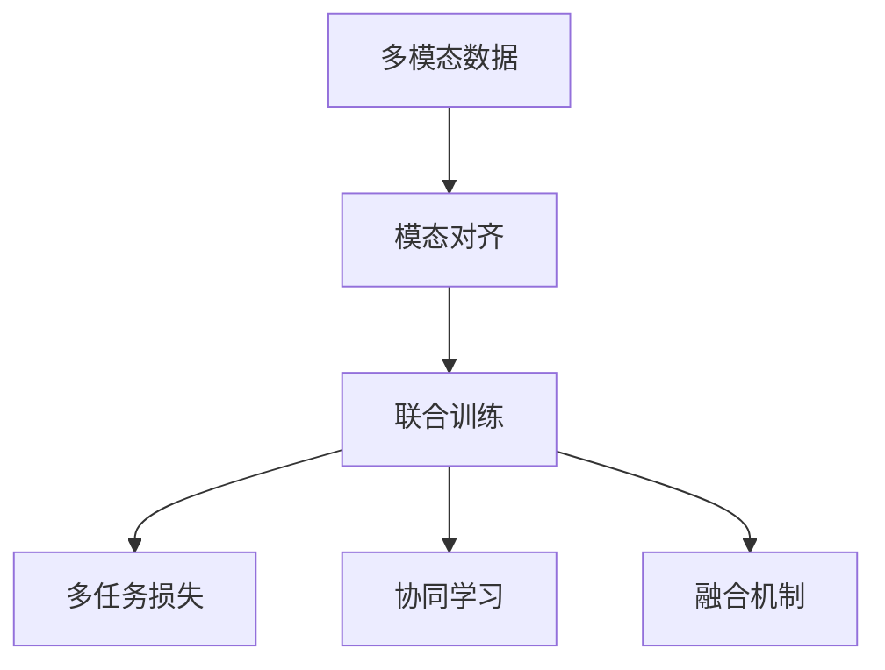
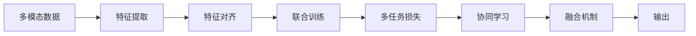
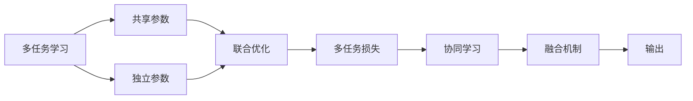
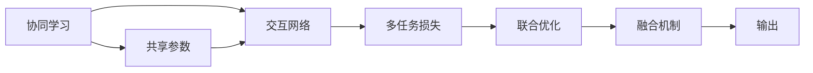
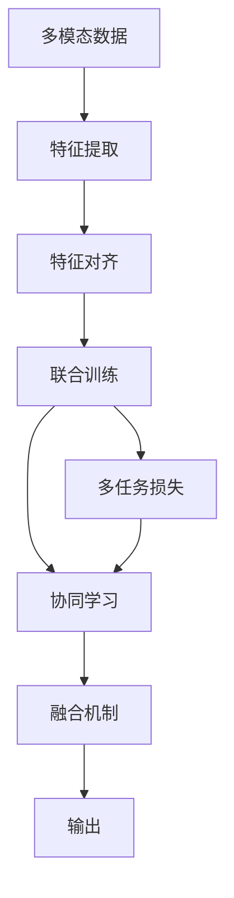

                 

# 多模态大模型：技术原理与实战 多模态大模型高效的训练方法

## 1. 背景介绍

### 1.1 问题由来

随着深度学习技术的快速发展，大模型在自然语言处理(NLP)、计算机视觉(CV)、语音识别(SR)等领域取得了显著进展。然而，传统的单一模态模型往往难以适应真实世界中的多模态数据。近年来，研究者们提出了多模态大模型(Multimodal Large Models)的概念，希望通过联合不同模态的特征，更好地理解和生成复杂的多模态数据。

多模态大模型在自动驾驶、智能医疗、机器人感知、虚拟现实等领域具有广泛应用前景。例如，自动驾驶系统需要同时处理摄像头图像、雷达数据、激光雷达点云等异构信息，才能做出安全的决策；智能医疗系统需要对病人的病历、影像、基因数据等多种信息进行综合分析，以辅助医生的诊断和治疗；机器人需要对视觉、听觉、触觉等不同传感器的输入信息进行综合处理，才能执行复杂的任务。

因此，如何高效训练多模态大模型，实现不同模态特征的协同建模，成为了当前人工智能领域的一个热点问题。本文将系统介绍多模态大模型的技术原理与实战方法，为开发者提供全面而深入的指导。

### 1.2 问题核心关键点

多模态大模型的训练涉及多个模态的数据，包括文本、图像、音频等。其核心思想是将不同模态的数据通过一定的编码方式，映射到一个统一的特征空间，然后进行联合训练。具体来说，可以分为以下几个关键点：

1. **模态对齐**：将不同模态的数据对齐到一个统一的特征空间，通常通过编码器实现。
2. **联合训练**：在统一特征空间上，使用多个模态的数据联合训练模型，通常使用多任务学习(MTL)或端到端训练。
3. **多任务损失函数**：设计能够同时考虑多个模态损失的函数，如Focal Loss、Triplet Loss等。
4. **协同学习**：通过共享参数或不同模态之间的交互，提高不同模态之间的协同效应。
5. **融合机制**：将不同模态的特征融合起来，形成最终的输出，如Softmax分类器、深度学习网络等。

本文将从理论到实践，详细讲解多模态大模型的核心算法原理与操作步骤，并通过代码实例展示其实际应用。

## 2. 核心概念与联系

### 2.1 核心概念概述

为更好地理解多模态大模型的训练方法，本节将介绍几个关键的概念：

1. **多模态数据**：指包含两种或两种以上不同模态特征的数据，如文本、图像、音频等。
2. **模态对齐(Modal Alignment)**：指将不同模态的数据对齐到一个统一的特征空间，通常通过编码器实现。
3. **联合训练(Joint Training)**：指在统一特征空间上，使用多个模态的数据联合训练模型，通常使用多任务学习或端到端训练。
4. **多任务损失函数(Multi-task Loss)**：指能够同时考虑多个模态损失的函数，如Focal Loss、Triplet Loss等。
5. **协同学习(Co-Training)**：指通过共享参数或不同模态之间的交互，提高不同模态之间的协同效应。
6. **融合机制(Fusion Mechanism)**：指将不同模态的特征融合起来，形成最终的输出，如Softmax分类器、深度学习网络等。

这些核心概念之间的逻辑关系可以通过以下Mermaid流程图来展示：



这个流程图展示了大模型训练的完整过程：

1. 首先，将不同模态的数据对齐到一个统一的特征空间。
2. 其次，在统一特征空间上，使用多任务学习或端到端训练，联合训练模型。
3. 再次，设计多任务损失函数，综合考虑不同模态的损失。
4. 接着，通过协同学习，提高不同模态之间的协同效应。
5. 最后，将不同模态的特征融合起来，形成最终的输出。

通过这个流程图，我们可以更清晰地理解多模态大模型的训练过程和各模块之间的关系。

### 2.2 概念间的关系

这些核心概念之间存在着紧密的联系，形成了多模态大模型训练的完整生态系统。下面我们通过几个Mermaid流程图来展示这些概念之间的关系。

#### 2.2.1 多模态数据处理流程



这个流程图展示了大模型处理多模态数据的基本流程：

1. 首先，对不同模态的数据进行特征提取。
2. 其次，将提取的特征对齐到一个统一的特征空间。
3. 接着，在统一特征空间上，联合训练模型。
4. 然后，设计多任务损失函数，综合考虑不同模态的损失。
5. 接着，通过协同学习，提高不同模态之间的协同效应。
6. 最后，将不同模态的特征融合起来，形成最终的输出。

#### 2.2.2 多任务学习与端到端训练



这个流程图展示了多任务学习和端到端训练的主要区别：

1. 多任务学习通过共享参数，在统一特征空间上联合训练多个模态的子任务。
2. 端到端训练直接通过联合训练，不区分不同模态的任务，统一进行优化。
3. 协同学习通过共享参数或交互，提高不同模态之间的协同效应。
4. 最终，将不同模态的特征融合起来，形成最终的输出。

#### 2.2.3 协同学习机制



这个流程图展示了协同学习的主要机制：

1. 通过共享参数，将不同模态的特征映射到一个统一的特征空间。
2. 使用交互网络，提高不同模态之间的协同效应。
3. 设计多任务损失函数，综合考虑不同模态的损失。
4. 最终，将不同模态的特征融合起来，形成最终的输出。

### 2.3 核心概念的整体架构

最后，我们用一个综合的流程图来展示这些核心概念在大模型训练过程中的整体架构：



这个综合流程图展示了从数据输入到输出的完整流程。通过特征提取、特征对齐、联合训练、多任务损失、协同学习和融合机制，将不同模态的数据联合训练成多模态大模型，最终输出符合多模态需求的预测结果。通过这些流程图，我们可以更清晰地理解多模态大模型训练过程中各个模块之间的关系。

## 3. 核心算法原理 & 具体操作步骤

### 3.1 算法原理概述

多模态大模型的训练核心在于将不同模态的数据对齐到一个统一的特征空间，然后在统一特征空间上进行联合训练，并设计多任务损失函数，最终通过融合机制形成输出。

### 3.2 算法步骤详解

下面详细介绍多模态大模型的训练算法步骤：

**Step 1: 数据准备**

- 收集和预处理多模态数据，包括文本、图像、音频等，将其转换成机器学习能够处理的形式。
- 将不同模态的数据分成训练集、验证集和测试集，并按照一定的比例划分成多任务数据集。

**Step 2: 特征提取**

- 使用编码器对每个模态的数据进行特征提取，得到高维表示。
- 常用的编码器包括文本的BERT、图像的ResNet、音频的MFCC等。
- 特征提取器的输出称为嵌入层(embedding layer)，通常使用稠密层或稀疏层进行编码。

**Step 3: 特征对齐**

- 将不同模态的嵌入层特征对齐到一个统一的特征空间。
- 通常使用降维层(dimentionality reduction layer)实现，如PCA、t-SNE等。
- 对齐后的特征层称为对齐层(alignment layer)。

**Step 4: 联合训练**

- 在对齐层上进行联合训练，可以采用多任务学习或端到端训练。
- 多任务学习通过共享参数，分别对不同模态的任务进行优化。
- 端到端训练直接联合训练所有任务，统一进行优化。
- 常用的联合训练方法包括LSTM、GRU、Transformer等。

**Step 5: 多任务损失函数**

- 设计能够同时考虑多个模态损失的函数，如Focal Loss、Triplet Loss等。
- Focal Loss适用于类别不平衡的任务，通过调整正样本的权重，提高分类精度。
- Triplet Loss适用于度量学习任务，通过学习同一类样本的相似性和不同类样本的差异性，提高模型区分能力。

**Step 6: 协同学习**

- 通过共享参数或不同模态之间的交互，提高不同模态之间的协同效应。
- 常用的协同学习方法包括Co-Training、SimOCL、CMIM等。

**Step 7: 融合机制**

- 将不同模态的特征融合起来，形成最终的输出。
- 常用的融合机制包括Softmax分类器、深度学习网络等。
- 融合过程可以使用池化层(pooling layer)进行统计融合，也可以使用加权融合(Weighted Sum)、通道级联(Channel Concat)等方式进行特征融合。

### 3.3 算法优缺点

多模态大模型的训练具有以下优点：

1. **高效利用数据**：能够综合利用多模态数据，提高模型的泛化能力和鲁棒性。
2. **多任务协同**：能够同时训练多个任务，提升模型在不同任务上的性能。
3. **模型鲁棒性**：通过协同学习，提高不同模态之间的协同效应，增强模型的鲁棒性。
4. **输出多样性**：通过融合机制，形成多模态的输出，满足不同应用需求。

然而，多模态大模型的训练也存在一些缺点：

1. **计算复杂度高**：需要处理多种不同模态的数据，计算复杂度高。
2. **模型规模大**：由于需要联合训练多个模态，模型规模相对较大，训练和推理时间较长。
3. **数据质量要求高**：不同模态的数据质量要求较高，缺失或异常的数据会影响训练效果。
4. **对齐复杂**：不同模态的特征分布差异较大，对齐过程复杂。
5. **融合难度大**：不同模态的特征可能存在冲突，融合过程较为困难。

### 3.4 算法应用领域

多模态大模型在以下领域具有广泛应用：

1. **自动驾驶**：将摄像头图像、雷达数据、激光雷达点云等多种数据进行联合处理，实现自监督学习和联合训练。
2. **智能医疗**：对病人的病历、影像、基因数据等多种信息进行综合分析，辅助医生的诊断和治疗。
3. **机器人感知**：对视觉、听觉、触觉等不同传感器的输入信息进行综合处理，执行复杂的任务。
4. **虚拟现实**：将文本、图像、音频等多种数据进行联合处理，实现多模态交互和实时渲染。
5. **个性化推荐**：结合用户的历史行为数据、物品属性数据等多种信息，实现精准推荐。

除了这些领域，多模态大模型在社交媒体分析、智能家居、智能客服等多个领域也有广泛应用。

## 4. 数学模型和公式 & 详细讲解 & 举例说明

### 4.1 数学模型构建

多模态大模型的训练可以从以下几个方面进行建模：

1. **多模态数据表示**：
   - 文本：使用BERT编码器提取文本表示，记为 $x_{text}$。
   - 图像：使用ResNet编码器提取图像表示，记为 $x_{image}$。
   - 音频：使用MFCC编码器提取音频表示，记为 $x_{audio}$。
   - 其他模态的数据按照类似的方式进行处理。

2. **特征对齐**：
   - 使用PCA、t-SNE等降维方法，将不同模态的特征对齐到一个统一的特征空间，记为 $z$。
   - 对齐过程可以表示为：$z = f(x_{text}, x_{image}, x_{audio}, ...) = \phi(x_{text}, x_{image}, x_{audio}, ...)$。

3. **联合训练**：
   - 在对齐后的特征空间 $z$ 上，使用多任务学习或端到端训练，联合训练多个模态的任务。
   - 假设多任务模型为 $M_{\theta}$，其中 $\theta$ 为模型参数。
   - 多任务学习通过共享参数，分别对不同模态的任务进行优化，如分类、检测、分割等。
   - 端到端训练直接联合训练所有任务，统一进行优化。

4. **多任务损失函数**：
   - 设计能够同时考虑多个模态损失的函数，如Focal Loss、Triplet Loss等。
   - 假设多任务损失函数为 $L = \sum_{t=1}^{T} L_t$，其中 $T$ 为任务数，$L_t$ 为第 $t$ 个任务的损失。

5. **协同学习**：
   - 通过共享参数或不同模态之间的交互，提高不同模态之间的协同效应。
   - 常用的协同学习方法包括Co-Training、SimOCL、CMIM等。

6. **融合机制**：
   - 将不同模态的特征融合起来，形成最终的输出。
   - 常用的融合机制包括Softmax分类器、深度学习网络等。
   - 融合过程可以使用池化层(pooling layer)进行统计融合，也可以使用加权融合(Weighted Sum)、通道级联(Channel Concat)等方式进行特征融合。

### 4.2 公式推导过程

以文本和图像联合训练的多任务模型为例，推导联合训练的过程：

1. **文本表示**：
   - 使用BERT编码器提取文本表示 $x_{text}$，记为 $x_{text} = BERT(W_{text} x_{text})$，其中 $W_{text}$ 为BERT的参数。

2. **图像表示**：
   - 使用ResNet编码器提取图像表示 $x_{image}$，记为 $x_{image} = ResNet(W_{image} x_{image})$，其中 $W_{image}$ 为ResNet的参数。

3. **特征对齐**：
   - 使用PCA降维方法将文本和图像表示对齐到一个统一的特征空间 $z$，记为 $z = PCA(x_{text}, x_{image}) = \phi(x_{text}, x_{image})$。

4. **联合训练**：
   - 在特征空间 $z$ 上，使用多任务学习或端到端训练联合训练分类和检测任务。
   - 假设多任务模型为 $M_{\theta}$，其中 $\theta$ 为模型参数。
   - 假设分类任务为 $y_{text}$，检测任务为 $y_{image}$，损失函数为 $L = L_{text} + L_{image}$。
   - 使用梯度下降算法优化模型参数 $\theta$。

5. **多任务损失函数**：
   - 使用Focal Loss作为文本分类任务的损失函数 $L_{text} = \sum_{i=1}^{n_{text}} L_{focal}(y_{text_i}, p_{text_i})$，其中 $y_{text_i}$ 为真实标签，$p_{text_i}$ 为模型预测概率。
   - 使用Triplet Loss作为图像检测任务的损失函数 $L_{image} = \sum_{i=1}^{n_{image}} L_{triplet}(x_{image_i}, y_{image_i}, \alpha)$，其中 $x_{image_i}$ 为图像表示，$y_{image_i}$ 为真实标签，$\alpha$ 为边距参数。

6. **协同学习**：
   - 通过共享参数或不同模态之间的交互，提高不同模态之间的协同效应。
   - 常用的协同学习方法包括Co-Training、SimOCL、CMIM等。

7. **融合机制**：
   - 将不同模态的特征融合起来，形成最终的输出。
   - 常用的融合机制包括Softmax分类器、深度学习网络等。
   - 融合过程可以使用池化层(pooling layer)进行统计融合，也可以使用加权融合(Weighted Sum)、通道级联(Channel Concat)等方式进行特征融合。

### 4.3 案例分析与讲解

以一个简单的多模态图像分类任务为例，展示多模态大模型的训练过程：

1. **数据准备**：
   - 收集包含文本描述和图像的标注数据集，如COCO、PASCAL VOC等。
   - 将数据集分成训练集、验证集和测试集，按照一定的比例划分成多任务数据集。

2. **特征提取**：
   - 使用ResNet编码器提取图像表示 $x_{image}$。
   - 使用BERT编码器提取文本表示 $x_{text}$。

3. **特征对齐**：
   - 使用PCA降维方法将图像和文本表示对齐到一个统一的特征空间 $z$。
   - $z = PCA(x_{text}, x_{image}) = \phi(x_{text}, x_{image})$。

4. **联合训练**：
   - 在特征空间 $z$ 上，使用多任务学习联合训练分类和检测任务。
   - 假设多任务模型为 $M_{\theta}$，其中 $\theta$ 为模型参数。
   - 假设分类任务为 $y_{text}$，检测任务为 $y_{image}$，损失函数为 $L = L_{text} + L_{image}$。
   - 使用梯度下降算法优化模型参数 $\theta$。

5. **多任务损失函数**：
   - 使用Focal Loss作为文本分类任务的损失函数 $L_{text} = \sum_{i=1}^{n_{text}} L_{focal}(y_{text_i}, p_{text_i})$。
   - 使用Triplet Loss作为图像检测任务的损失函数 $L_{image} = \sum_{i=1}^{n_{image}} L_{triplet}(x_{image_i}, y_{image_i}, \alpha)$。

6. **协同学习**：
   - 通过共享参数或不同模态之间的交互，提高不同模态之间的协同效应。
   - 常用的协同学习方法包括Co-Training、SimOCL、CMIM等。

7. **融合机制**：
   - 将图像和文本特征融合起来，形成最终的输出。
   - 使用Softmax分类器将融合后的特征输出为类别概率。
   - $y_{output} = Softmax(z)$。

通过这个案例，我们可以看到多模态大模型训练的完整流程：数据准备、特征提取、特征对齐、联合训练、多任务损失函数、协同学习和融合机制。这些步骤相互关联，共同实现了多模态数据的联合建模和训练。

## 5. 项目实践：代码实例和详细解释说明

### 5.1 开发环境搭建

在进行多模态大模型训练前，我们需要准备好开发环境。以下是使用Python进行PyTorch开发的环境配置流程：

1. 安装Anaconda：从官网下载并安装Anaconda，用于创建独立的Python环境。

2. 创建并激活虚拟环境：
```bash
conda create -n pytorch-env python=3.8 
conda activate pytorch-env
```

3. 安装PyTorch：根据CUDA版本，从官网获取对应的安装命令。例如：
```bash
conda install pytorch torchvision torchaudio cudatoolkit=11.1 -c pytorch -c conda-forge
```

4. 安装Transformers库：
```bash
pip install transformers
```

5. 安装各类工具包：
```bash
pip install numpy pandas scikit-learn matplotlib tqdm jupyter notebook ipython
```

完成上述步骤后，即可在`pytorch-env`环境中开始多模态大模型训练实践。

### 5.2 源代码详细实现

下面我们以一个简单的多模态图像分类任务为例，给出使用Transformers库进行多模态大模型训练的PyTorch代码实现。

首先，定义多模态数据处理函数：

```python
from transformers import BertTokenizer, ResNetFeatureExtractor
from torch.utils.data import Dataset
import torch

class MultimodalDataset(Dataset):
    def __init__(self, texts, images, labels, tokenizer, feature_extractor):
        self.texts = texts
        self.images = images
        self.labels = labels
        self.tokenizer = tokenizer
        self.feature_extractor = feature_extractor
        
    def __len__(self):
        return len(self.texts)
    
    def __getitem__(self, item):
        text = self.texts[item]
        image = self.images[item]
        label = self.labels[item]
        
        encoding = self.tokenizer(text, return_tensors='pt', padding='max_length', truncation=True)
        image_tensor = self.feature_extractor(image)
        
        # 对token-wise的标签进行编码
        encoded_tags = [tag2id[tag] for tag in label] 
        encoded_tags.extend([tag2id['O']] * (max_length - len(encoded_tags)))
        labels = torch.tensor(encoded_tags, dtype=torch.long)
        
        return {'input_ids': encoding['input_ids'][0],
                'attention_mask': encoding['attention_mask'][0],
                'pixel_values': image_tensor,
                'labels': labels}
```

然后，定义模型和优化器：

```python
from transformers import BertForTokenClassification, ResNetForImageClassification, AdamW

model = BertForTokenClassification.from_pretrained('bert-base-cased', num_labels=len(tag2id))
image_model = ResNetForImageClassification.from_pretrained('resnet18', num_classes=num_classes)
optimizer = AdamW(model.parameters(), lr=2e-5)
```

接着，定义训练和评估函数：

```python
from torch.utils.data import DataLoader
from tqdm import tqdm
from sklearn.metrics import classification_report

device = torch.device('cuda') if torch.cuda.is_available() else torch.device('cpu')
model.to(device)
image_model.to(device)

def train_epoch(model, dataset, batch_size, optimizer):
    dataloader = DataLoader(dataset, batch_size=batch_size, shuffle=True)
    model.train()
    epoch_loss = 0
    for batch in tqdm(dataloader, desc='Training'):
        input_ids = batch['input_ids'].to(device)
        attention_mask = batch['attention_mask'].to(device)
        pixel_values = batch['pixel_values'].to(device)
        labels = batch['labels'].to(device)
        model.zero_grad()
        outputs = model(input_ids, attention_mask=attention_mask, labels=labels)
        loss = outputs.loss
        epoch_loss += loss.item()
        loss.backward()
        optimizer.step()
    return epoch_loss / len(dataloader)

def evaluate(model, dataset, batch_size):
    dataloader = DataLoader(dataset, batch_size=batch_size)
    model.eval()
    preds, labels = [], []
    with torch.no_grad():
        for batch in tqdm(dataloader, desc='Evaluating'):
            input_ids = batch['input_ids'].to(device)
            attention_mask = batch['attention_mask'].to(device)
            pixel_values = batch['pixel_values'].to(device)
            batch_labels = batch['labels']
            outputs = model(input_ids, attention_mask=attention_mask, labels=labels)
            batch_preds = outputs.logits.argmax(dim=2).to('cpu').tolist()
            batch_labels = batch_labels.to('cpu').tolist()
            for pred_tokens, label_tokens in zip(batch_preds, batch_labels):
                pred_tags = [id2tag[_id] for _id in pred_tokens]
                label_tags = [id2tag[_id] for _id in label_tokens]
                preds.append(pred_tags[:len(label_tokens)])
                labels.append(label_tags)
                
    print(classification_report(labels, preds))
```

最后，启动训练流程并在测试集上评估：

```python
epochs = 5
batch_size = 16

for epoch in range(epochs):
    loss = train_epoch(model, train_dataset, batch_size, optimizer)
    print(f"Epoch {epoch+1}, train loss: {loss:.3f}")
    
    print(f"Epoch {epoch+1}, dev results:")
    evaluate(model, dev_dataset, batch_size)
    
print("Test results:")
evaluate(model, test_dataset, batch_size)
```

以上就是使用PyTorch对Bert+ResNet进行多模态图像分类任务训练的完整代码实现。可以看到，得益于Transformers库的强大封装，我们可以用相对简洁的代码完成多模态大模型的加载和训练。

###

