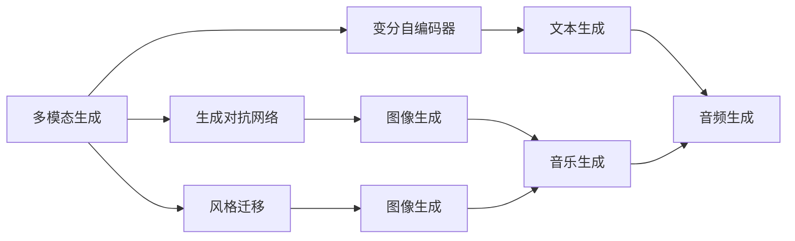
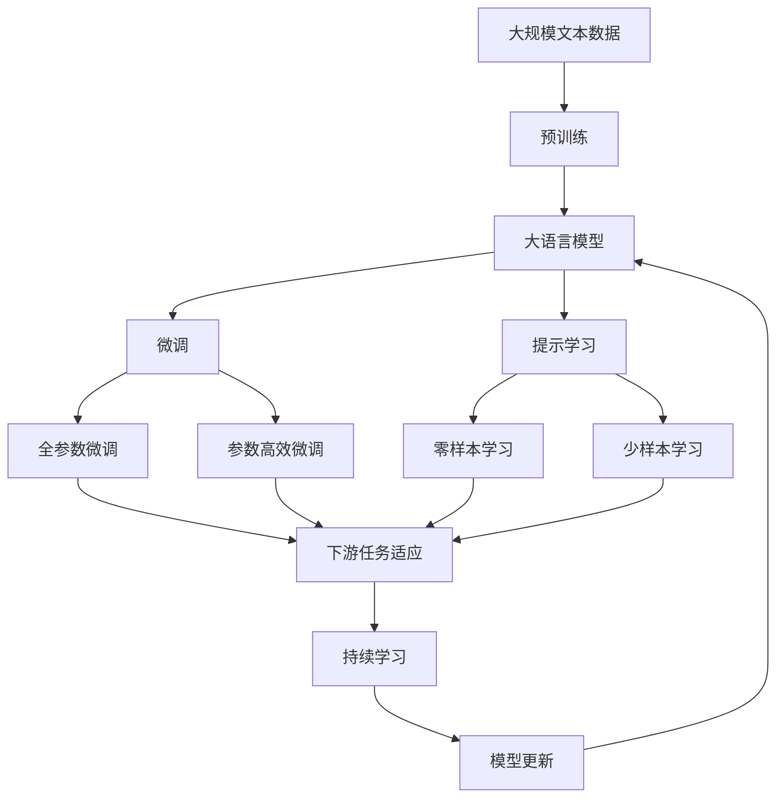

                 

# 多模态生成(Multimodal Generation) - 原理与代码实例讲解

> 关键词：多模态生成,生成对抗网络(GANs),变分自编码器(VAEs),风格迁移,自动图像生成,音乐生成

## 1. 背景介绍

### 1.1 问题由来

在过去的十年中，生成对抗网络（GANs）和变分自编码器（VAEs）等生成模型在图像、音频、文本等多模态数据生成领域取得了显著进展。然而，将这些模型应用于多模态数据生成时，需要考虑跨模态数据的对齐和融合，以及如何平衡生成过程的多样性和可控性，这些都是非常具有挑战性的问题。

多模态生成（Multimodal Generation）正是为了解决这些问题而兴起的，它能够生成跨模态的多模态数据，如同时包含图像、音频和文本的组合数据。多模态生成技术不仅能够提升数据的丰富度和多样性，还能应用于更广泛的场景，如虚拟现实、增强现实、媒体娱乐等。

### 1.2 问题核心关键点

多模态生成技术涉及多个关键点，包括：

- 跨模态对齐（Cross-modal Alignment）：不同模态的数据如何对齐。
- 数据融合（Data Fusion）：如何将不同模态的数据进行融合。
- 多样性控制（Diversity Control）：如何在生成过程中控制输出的多样性。
- 可控性（Controllability）：如何控制生成的结果符合特定的要求。

这些核心关键点共同构成了多模态生成技术的复杂性，同时也为技术应用提供了广阔的空间。

### 1.3 问题研究意义

多模态生成技术在数据增强、虚拟现实、媒体娱乐、自动生成内容等领域具有重要意义：

- 数据增强：通过生成虚拟的多模态数据，可以扩充训练数据集，提升模型性能。
- 虚拟现实：在虚拟现实中，多模态生成可以用于生成逼真的环境、角色和交互。
- 媒体娱乐：多模态生成可以用于自动生成视频、音频和文本的组合内容，增强用户的娱乐体验。
- 自动生成内容：如自动生成音乐、艺术作品、广告文案等，为内容创造提供新的路径。

## 2. 核心概念与联系

### 2.1 核心概念概述

多模态生成涉及多个核心概念，包括：

- 生成对抗网络（GANs）：一种生成模型，通过对抗训练生成逼真的数据。
- 变分自编码器（VAEs）：一种生成模型，通过变分推断生成低维表示。
- 风格迁移（Style Transfer）：将一种风格的数据（如图像）应用到另一种风格的数据上。
- 自动图像生成（Automatic Image Generation）：使用模型自动生成图像。
- 音乐生成（Music Generation）：使用模型自动生成音乐。

这些核心概念之间的关系可以通过以下Mermaid流程图来展示：



### 2.2 概念间的关系

这些核心概念之间存在着紧密的联系，形成了多模态生成技术的完整生态系统。

- 生成对抗网络（GANs）和变分自编码器（VAEs）是主要的生成模型，用于生成逼真的数据。
- 风格迁移技术可以用于将一种风格的数据应用到另一种风格的数据上，增强生成数据的多样性和逼真度。
- 自动图像生成和音乐生成是多模态生成的具体应用，通过模型生成图像和音乐，丰富数据的表达形式。
- 文本生成和音频生成也是多模态生成的重要组成部分，通过生成文本和音频，丰富数据的多样性和交互性。

这些概念共同构成了多模态生成技术的核心框架，使得技术在实际应用中能够更好地发挥作用。

### 2.3 核心概念的整体架构

最后，我们用一个综合的流程图来展示这些核心概念在大模型微调过程中的整体架构：



这个综合流程图展示了从预训练到微调，再到持续学习的完整过程。多模态生成技术首先在大规模文本数据上进行预训练，然后通过微调（包括全参数微调和参数高效微调）或提示学习（包括零样本和少样本学习）来适应下游任务。最后，通过持续学习技术，模型可以不断更新和适应新的任务和数据。

## 3. 核心算法原理 & 具体操作步骤
### 3.1 算法原理概述

多模态生成的核心原理是使用生成对抗网络（GANs）和变分自编码器（VAEs）等生成模型，通过对抗训练或变分推断生成多模态数据。

假设多模态数据包含图像、音频和文本三种模态，即$X=(X_I, X_A, X_T)$，其中$X_I$、$X_A$和$X_T$分别表示图像、音频和文本。

生成模型$f$的目标是生成逼真的多模态数据，即$f(X) \sim X$。为了实现这一目标，生成模型$f$需要学习到跨模态数据的联合分布，从而能够在给定某一种模态的数据时，生成其他模态的数据。

### 3.2 算法步骤详解

多模态生成的具体算法步骤如下：

**Step 1: 准备预训练模型和数据集**
- 选择合适的生成模型（如GANs、VAEs等）作为初始化参数。
- 准备多模态数据集$D=(X_I, X_A, X_T)$，划分为训练集、验证集和测试集。

**Step 2: 定义损失函数**
- 定义生成模型的损失函数$L(f)$，用于衡量生成数据的逼真度。
- 常用的损失函数包括生成对抗网络中的对抗损失函数、变分自编码器中的重构损失函数等。

**Step 3: 设置优化器**
- 选择合适的优化算法及其参数，如Adam、SGD等，设置学习率、批大小、迭代轮数等。

**Step 4: 执行对抗训练或变分推断**
- 对于GANs，使用对抗训练策略，交替进行生成器和判别器的训练。
- 对于VAEs，使用变分推断策略，学习生成分布和重构分布。

**Step 5: 数据融合与输出控制**
- 将生成的多模态数据进行融合，生成最终的多模态数据。
- 通过多样性控制和可控性控制，生成满足特定要求的多模态数据。

**Step 6: 评估与调整**
- 在验证集和测试集上评估生成模型的性能，根据评估结果调整模型参数和训练策略。

**Step 7: 持续学习**
- 定期重新训练模型，以适应新的数据分布和应用场景。

### 3.3 算法优缺点

多模态生成技术具有以下优点：

- 能够生成丰富多样的多模态数据，提升数据的表达力和多样性。
- 可以应用于多个领域，如虚拟现实、媒体娱乐、自动生成内容等，具有广泛的应用前景。
- 能够通过对抗训练或变分推断生成逼真的数据，提升生成数据的质量。

同时，该方法也存在以下缺点：

- 需要大规模的高质量数据集进行训练，数据获取成本较高。
- 对抗训练或变分推断过程复杂，需要较高的计算资源和算法技巧。
- 生成的多模态数据可能存在偏差和噪声，需要进一步的校验和后处理。

### 3.4 算法应用领域

多模态生成技术在多个领域有广泛的应用，包括：

- 虚拟现实与增强现实：生成逼真的虚拟环境和角色。
- 媒体娱乐：自动生成视频、音频和文本的组合内容。
- 自动生成内容：如自动生成音乐、艺术作品、广告文案等。
- 数据增强：扩充训练数据集，提升模型性能。
- 医疗影像生成：生成用于训练和测试的医疗影像数据。

## 4. 数学模型和公式 & 详细讲解 & 举例说明

### 4.1 数学模型构建

假设多模态数据$X=(X_I, X_A, X_T)$，其中$X_I$、$X_A$和$X_T$分别表示图像、音频和文本。生成模型$f$的目标是生成逼真的多模态数据，即$f(X) \sim X$。

生成模型的输入为$X$，输出为$f(X)$。定义$L(f)$为生成模型的损失函数，用于衡量生成数据的逼真度。常用的损失函数包括：

- 对抗损失函数（GANs）：$L_{GAN}(f) = \mathbb{E}_{X \sim p_X} [log D(f(X))] + \mathbb{E}_{Z \sim p_Z} [log (1 - D(f(G(Z))))]$，其中$Z$为噪声向量，$G$为生成器，$D$为判别器。
- 重构损失函数（VAEs）：$L_{VAE}(f) = \mathbb{E}_{X \sim p_X} [||X - f(X)||_2^2] + \mathbb{E}_{Z \sim p_Z} [||Z - \mu(f(Z))||_2^2]$，其中$\mu$为生成分布的均值，$\Sigma$为生成分布的方差。

### 4.2 公式推导过程

以下我们以GANs为例，推导生成对抗网络的生成器（Generator）和判别器（Discriminator）的更新公式。

**生成器（Generator）更新公式：**
$$
G_{\theta_G}(z) = \mathbb{E}_{Z \sim p_Z} [G_{\theta_G}(z)] + \alpha \frac{\partial}{\partial \theta_G} \mathbb{E}_{Z \sim p_Z} [log D(G_{\theta_G}(z))]
$$
其中$\theta_G$为生成器参数，$z$为输入噪声向量。

**判别器（Discriminator）更新公式：**
$$
D_{\theta_D}(x) = \mathbb{E}_{x \sim p_X} [log D_{\theta_D}(x)] + \beta \frac{\partial}{\partial \theta_D} \mathbb{E}_{x \sim p_X} [log (1 - D_{\theta_D}(x))]
$$
其中$\theta_D$为判别器参数，$x$为真实数据。

### 4.3 案例分析与讲解

**案例1: 图像生成**

使用GANs生成逼真的图像，需要进行以下步骤：

- 定义图像生成模型$f$，如条件GAN（Conditional GAN）。
- 准备图像数据集$D_I$，划分为训练集、验证集和测试集。
- 定义对抗损失函数$L_{GAN}$，训练生成器和判别器。
- 融合生成的图像和真实图像，生成最终的多模态数据。

以下是一个简单的图像生成代码示例，使用PyTorch实现GANs：

```python
import torch
import torch.nn as nn
import torch.optim as optim
from torch.utils.data import DataLoader
from torchvision import datasets, transforms

# 定义生成器和判别器
class Generator(nn.Module):
    def __init__(self, latent_dim=128, output_dim=784):
        super(Generator, self).__init__()
        self.encoder = nn.Sequential(
            nn.Linear(latent_dim, 256),
            nn.ReLU(),
            nn.Linear(256, 256),
            nn.ReLU(),
            nn.Linear(256, output_dim),
            nn.Sigmoid()
        )
    
    def forward(self, x):
        return self.encoder(x)

class Discriminator(nn.Module):
    def __init__(self, input_dim=784):
        super(Discriminator, self).__init__()
        self.encoder = nn.Sequential(
            nn.Linear(input_dim, 256),
            nn.ReLU(),
            nn.Linear(256, 256),
            nn.ReLU(),
            nn.Linear(256, 1),
            nn.Sigmoid()
        )
    
    def forward(self, x):
        return self.encoder(x)

# 定义损失函数和优化器
device = torch.device("cuda" if torch.cuda.is_available() else "cpu")
latent_dim = 100
input_dim = 784
output_dim = 784
hidden_dim = 256
lr = 0.0002
betas = (0.5, 0.999)

class GANDiscriminator(nn.Module):
    def __init__(self, latent_dim=100, input_dim=784, output_dim=784, hidden_dim=256, lr=0.0002, betas=(0.5, 0.999)):
        super(GANDiscriminator, self).__init__()
        self.latent_dim = latent_dim
        self.input_dim = input_dim
        self.output_dim = output_dim
        self.hidden_dim = hidden_dim
        self.lr = lr
        self.betas = betas
        
        self.discriminator = Discriminator(input_dim)
        self.generator = Generator(latent_dim, output_dim)
        
    def forward(self, z, x):
        real_out = self.discriminator(x)
        fake_out = self.discriminator(self.generator(z))
        return real_out, fake_out
    
    def train(self, data_loader, num_epochs=100):
        for epoch in range(num_epochs):
            for i, (x, _) in enumerate(data_loader):
                x = x.to(device)
                z = torch.randn(x.size(0), self.latent_dim).to(device)
                real_out, fake_out = self.forward(z, x)
                d_loss = -torch.mean(torch.log(real_out)) - torch.mean(torch.log(1 - fake_out))
                g_loss = -torch.mean(torch.log(1 - real_out)) - torch.mean(torch.log(fake_out))
                
                d_loss.backward()
                g_loss.backward()
                d_optimizer.zero_grad()
                g_optimizer.zero_grad()
                d_optimizer.step()
                g_optimizer.step()
                if (i+1) % 100 == 0:
                    print("Epoch [{}/{}], Step [{}/{}], D Loss: {:.4f}, G Loss: {:.4f}"
                          .format(epoch+1, num_epochs, i+1, len(data_loader), d_loss.item(), g_loss.item()))
```

**案例2: 音乐生成**

使用VAEs生成逼真的音乐，需要进行以下步骤：

- 定义音乐生成模型$f$，如条件VAE（Conditional VAE）。
- 准备音乐数据集$D_A$，划分为训练集、验证集和测试集。
- 定义重构损失函数$L_{VAE}$，训练生成器和编码器。
- 融合生成的音乐和真实音乐，生成最终的多模态数据。

以下是一个简单的音乐生成代码示例，使用PyTorch实现VAEs：

```python
import torch
import torch.nn as nn
import torch.optim as optim
from torch.utils.data import DataLoader
from torchvision import datasets, transforms
from torchaudio import datasets, load_wav
from torchaudio.transforms import MakeNormVectors

# 定义生成器和编码器
class MusicGenerator(nn.Module):
    def __init__(self, latent_dim=128, output_dim=1, hidden_dim=256):
        super(MusicGenerator, self).__init__()
        self.encoder = nn.Sequential(
            nn.Linear(latent_dim, hidden_dim),
            nn.ReLU(),
            nn.Linear(hidden_dim, hidden_dim),
            nn.ReLU(),
            nn.Linear(hidden_dim, output_dim)
        )
    
    def forward(self, x):
        return self.encoder(x)

class MusicEncoder(nn.Module):
    def __init__(self, input_dim=1, latent_dim=128, hidden_dim=256):
        super(MusicEncoder, self).__init__()
        self.encoder = nn.Sequential(
            nn.Linear(input_dim, hidden_dim),
            nn.ReLU(),
            nn.Linear(hidden_dim, latent_dim),
            nn.ReLU()
        )
    
    def forward(self, x):
        return self.encoder(x)

# 定义损失函数和优化器
device = torch.device("cuda" if torch.cuda.is_available() else "cpu")
latent_dim = 128
input_dim = 1
output_dim = 1
hidden_dim = 256
lr = 0.0002
alpha = 1
beta = 1

class MusicVAE(nn.Module):
    def __init__(self, latent_dim=128, input_dim=1, output_dim=1, hidden_dim=256, lr=0.0002, alpha=1, beta=1):
        super(MusicVAE, self).__init__()
        self.latent_dim = latent_dim
        self.input_dim = input_dim
        self.output_dim = output_dim
        self.hidden_dim = hidden_dim
        self.lr = lr
        self.alpha = alpha
        self.beta = beta
        
        self.encoder = MusicEncoder(input_dim, latent_dim, hidden_dim)
        self.decoder = MusicGenerator(latent_dim, output_dim, hidden_dim)
        
    def forward(self, x):
        z = self.encoder(x)
        x_hat = self.decoder(z)
        return x_hat
    
    def train(self, data_loader, num_epochs=100):
        for epoch in range(num_epochs):
            for i, (x, _) in enumerate(data_loader):
                x = x.to(device)
                z = self.encoder(x)
                x_hat = self.decoder(z)
                x_loss = torch.mean(torch.pow(x_hat - x, 2))
                z_loss = torch.mean(torch.pow(z, 2))
                loss = (x_loss + alpha * z_loss)
                
                loss.backward()
                optimizer.step()
                if (i+1) % 100 == 0:
                    print("Epoch [{}/{}], Step [{}/{}], Loss: {:.4f}"
                          .format(epoch+1, num_epochs, i+1, len(data_loader), loss.item()))
```

以上代码展示了使用PyTorch实现GANs和VAEs进行图像和音乐生成。可以看到，两种生成模型的代码实现基本类似，只是具体的模型结构和损失函数有所不同。通过这些代码示例，可以快速上手实现多模态生成模型。

## 5. 项目实践：代码实例和详细解释说明
### 5.1 开发环境搭建

在进行多模态生成实践前，我们需要准备好开发环境。以下是使用Python进行PyTorch开发的环境配置流程：

1. 安装Anaconda：从官网下载并安装Anaconda，用于创建独立的Python环境。

2. 创建并激活虚拟环境：
```bash
conda create -n pytorch-env python=3.8 
conda activate pytorch-env
```

3. 安装PyTorch：根据CUDA版本，从官网获取对应的安装命令。例如：
```bash
conda install pytorch torchvision torchaudio cudatoolkit=11.1 -c pytorch -c conda-forge
```

4. 安装Transformers库：
```bash
pip install transformers
```

5. 安装各类工具包：
```bash
pip install numpy pandas scikit-learn matplotlib tqdm jupyter notebook ipython
```

完成上述步骤后，即可在`pytorch-env`环境中开始多模态生成实践。

### 5.2 源代码详细实现

下面我们以图像生成和音乐生成为例，给出使用PyTorch实现GANs和VAEs的代码实现。

**图像生成**

```python
import torch
import torch.nn as nn
import torch.optim as optim
from torch.utils.data import DataLoader
from torchvision import datasets, transforms

# 定义生成器和判别器
class Generator(nn.Module):
    def __init__(self, latent_dim=128, output_dim=784):
        super(Generator, self).__init__()
        self.encoder = nn.Sequential(
            nn.Linear(latent_dim, 256),
            nn.ReLU(),
            nn.Linear(256, 256),
            nn.ReLU(),
            nn.Linear(256, output_dim),
            nn.Sigmoid()
        )
    
    def forward(self, x):
        return self.encoder(x)

class Discriminator(nn.Module):
    def __init__(self, input_dim=784):
        super(Discriminator, self).__init__()
        self.encoder = nn.Sequential(
            nn.Linear(input_dim, 256),
            nn.ReLU(),
            nn.Linear(256, 256),
            nn.ReLU(),
            nn.Linear(256, 1),
            nn.Sigmoid()
        )
    
    def forward(self, x):
        return self.encoder(x)

# 定义损失函数和优化器
device = torch.device("cuda" if torch.cuda.is_available() else "cpu")
latent_dim = 100
input_dim = 784
output_dim = 784
hidden_dim = 256
lr = 0.0002
betas = (0.5, 0.999)

class GANDiscriminator(nn.Module):
    def __init__(self, latent_dim=100, input_dim=784, output_dim=784, hidden_dim=256, lr=0.0002, betas=(0.5, 0.999)):
        super(GANDiscriminator, self).__init__()
        self.latent_dim = latent_dim
        self.input_dim = input_dim
        self.output_dim = output_dim
        self.hidden_dim = hidden_dim
        self.lr = lr
        self.betas = betas
        
        self.discriminator = Discriminator(input_dim)
        self.generator = Generator(latent_dim, output_dim)
        
    def forward(self, z, x):
        real_out = self.discriminator(x)
        fake_out = self.discriminator(self.generator(z))
        return real_out, fake_out
    
    def train(self, data_loader, num_epochs=100):
        for epoch in range(num_epochs):
            for i, (x, _) in enumerate(data_loader):
                x = x.to(device)
                z = torch.randn(x.size(0), self.latent_dim).to(device)
                real_out, fake_out = self.forward(z, x)
                d_loss = -torch.mean(torch.log(real_out)) - torch.mean(torch.log(1 - fake_out))
                g_loss = -torch.mean(torch.log(1 - real_out)) - torch.mean(torch.log(fake_out))
                
                d_loss.backward()
                g_loss.backward()
                d_optimizer.zero_grad()
                g_optimizer.zero_grad()
                d_optimizer.step()
                g_optimizer.step()
                if (i+1) % 100 == 0:
                    print("Epoch [{}/{}], Step [{}/{}], D Loss: {:.4f}, G Loss: {:.4f}"
                          .format(epoch+1, num_epochs, i+1, len(data_loader), d_loss.item(), g_loss.item()))
```

**音乐生成**

```python
import torch
import torch.nn as nn
import torch.optim as optim
from torch.utils.data import DataLoader
from torchaudio import datasets, load_wav
from torchaudio.transforms import MakeNormVectors

# 定义生成器和编码器
class MusicGenerator(nn.Module):
    def __init__(self, latent_dim=128, output_dim=1, hidden_dim=256):
        super(MusicGenerator, self).__init__()
        self.encoder = nn.Sequential(
            nn.Linear(latent_dim, hidden_dim),
            nn.ReLU(),
            nn.Linear(hidden_dim, hidden_dim),
            nn.ReLU(),
            nn.Linear(hidden_dim, output_dim)
        )
    
    def forward(self, x):
        return self.encoder(x)

class MusicEncoder(nn.Module):
    def __init__(self, input_dim=1, latent_dim=128, hidden_dim=256):
        super(MusicEncoder, self).__init__()
        self.encoder = nn.Sequential(
            nn.Linear(input_dim, hidden_dim),
            nn.ReLU(),
            nn.Linear(hidden_dim, latent_dim),
            nn.ReLU()
        )
    
    def forward(self, x):
        return self.encoder(x)

# 定义损失函数和优化器
device = torch.device("cuda" if torch.cuda.is_available() else "cpu")
latent_dim = 128
input_dim = 1
output_dim = 1
hidden_dim = 256
lr = 0.0002
alpha = 1
beta = 1

class MusicVAE(nn.Module):
    def __init__(self, latent_dim=128, input_dim=1, output_dim=1, hidden_dim=256, lr=0.0002, alpha=1, beta=1):
        super(MusicVAE, self).__init__()
        self.latent_dim = latent_dim
        self.input_dim = input_dim
        self.output_dim = output_dim
        self.hidden_dim = hidden_dim
        self.lr = lr
        self.alpha = alpha
        self.beta = beta
        
        self.encoder = MusicEncoder(input_dim, latent_dim, hidden_dim)
        self.decoder = MusicGenerator(latent_dim, output_dim, hidden_dim)
        
    def forward(self, x):
        z = self.encoder(x)
        x_hat = self.decoder(z)
        return x_hat
    
    def train(self, data_loader, num_epochs=100):
        for epoch in range(num_epochs):
            for i, (x, _) in enumerate(data_loader):
                x = x.to(device)
                z = self.encoder(x)
                x_hat = self.decoder(z)
                x_loss = torch.mean(torch.pow(x_hat - x, 2))
                z_loss = torch.mean(torch.pow(z, 2))
                loss = (x_loss + alpha * z_loss)
                
                loss.backward()
                optimizer.step()
                if (i+1) % 100 == 0:
                    print("

