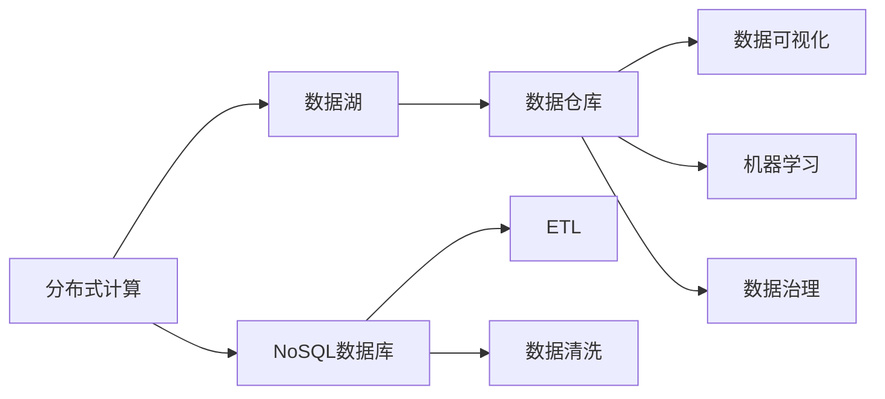

                 

# 大数据架构原理与代码实例讲解

> 关键词：大数据架构,分布式计算,NoSQL数据库,数据湖,数据仓库,ETL,数据清洗,数据可视化,机器学习,数据治理

## 1. 背景介绍

### 1.1 问题由来

随着互联网和物联网的普及，全球数据量呈爆炸性增长，对数据的采集、存储、处理和分析能力提出了更高的要求。大数据时代的来临，给传统IT架构带来了巨大挑战。如何构建高效、弹性、安全、可靠的数据架构，成为每个企业都必须面对的问题。

大数据架构（Big Data Architecture），旨在通过分布式计算、NoSQL数据库、数据湖、数据仓库、ETL（Extract, Transform, Load）、数据清洗、数据可视化、机器学习、数据治理等技术，对海量数据进行全面、高效的管理和分析，实现数据的价值最大化。

本博文将全面介绍大数据架构的原理与实践，帮助读者系统掌握大数据架构的关键技术和实现方法，并通过具体代码实例讲解，提供深入理解和动手实践的机会。

## 2. 核心概念与联系

### 2.1 核心概念概述

为更好地理解大数据架构，本节将介绍几个关键的概念，并展示它们之间的联系。

- **分布式计算（Distributed Computing）**：指将计算任务分布到多台计算节点上进行并行处理，以提高计算效率和可扩展性。
- **NoSQL数据库（Non-SQL Database）**：指不使用关系型数据模型进行数据存储和处理，支持大规模、高并发、高性能的数据管理。
- **数据湖（Data Lake）**：指一个集中存储、灵活访问和可扩展的数据集合，用于存储任何形式和规模的数据。
- **数据仓库（Data Warehouse）**：指经过数据清洗和转换，用于数据分析和决策支持的集中式数据库。
- **ETL（Extract, Transform, Load）**：指数据提取、转换和加载的过程，用于从原始数据源中提取数据，转换成分析数据，并加载到目标数据仓库。
- **数据清洗（Data Cleaning）**：指通过数据预处理，去除数据中的噪声和异常值，保证数据质量。
- **数据可视化（Data Visualization）**：指通过图形、图表等可视化方式，将复杂的数据信息直观展现出来，便于分析决策。
- **机器学习（Machine Learning）**：指通过算法和模型，对数据进行学习、训练和预测，提高决策的准确性和自动化程度。
- **数据治理（Data Governance）**：指通过一系列管理流程和技术手段，确保数据质量、安全性和合规性，提升数据价值。

这些概念之间存在紧密联系，共同构成了大数据架构的核心。下面通过一张Mermaid流程图展示它们之间的关系：



这个流程图展示了各个概念之间的数据流动关系：

- 分布式计算和NoSQL数据库负责数据存储和处理。
- 数据湖和数据仓库用于数据集中存储和分析。
- ETL负责数据提取和清洗。
- 数据可视化、机器学习和数据治理共同作用于数据仓库中的分析数据，提升数据价值。

### 2.2 概念间的关系

这些概念之间的联系主要体现在以下几个方面：

- **数据流向**：数据从原始数据源通过ETL流入数据湖，再由数据清洗、转换和加载进入数据仓库。
- **处理模式**：数据仓库中的数据被机器学习模型分析和预测，并通过数据可视化展示结果。
- **治理机制**：数据治理贯穿整个数据生命周期，保证数据质量和安全合规性。

这些联系构成了一个完整的数据架构体系，各个组件相互协作，共同实现数据的全面管理和分析。

## 3. 核心算法原理 & 具体操作步骤
### 3.1 算法原理概述

大数据架构的核心算法原理主要包括以下几个方面：

- **分布式计算算法**：通过MapReduce、Spark等分布式计算框架，将计算任务分布到多个计算节点上并行处理。
- **NoSQL数据库算法**：通过分布式存储、高并发读写等算法，实现NoSQL数据库的高可用性、高扩展性和高性能。
- **数据清洗算法**：通过数据去重、异常值检测、缺失值处理等算法，保证数据质量。
- **数据可视化算法**：通过可视化技术，将复杂数据转换为图形、图表等直观形式，便于分析决策。
- **机器学习算法**：通过模型训练和预测算法，对数据进行学习和预测。
- **数据治理算法**：通过数据分类、权限控制、元数据管理等算法，确保数据质量、安全性和合规性。

### 3.2 算法步骤详解

大数据架构的实现主要包括以下步骤：

**Step 1: 数据收集与集成**

1. **数据源收集**：从不同渠道收集原始数据，如Web日志、传感器数据、交易数据等。
2. **数据集成**：将不同来源的数据进行统一和整合，消除数据格式和存储差异。

**Step 2: 数据存储与处理**

1. **分布式存储**：使用HDFS、Ceph等分布式文件系统存储原始数据。
2. **分布式计算**：使用Hadoop、Spark等分布式计算框架处理数据。
3. **NoSQL数据库**：使用HBase、MongoDB等NoSQL数据库存储处理后的数据。

**Step 3: 数据清洗与转换**

1. **数据清洗**：通过ETL工具进行数据去重、异常值检测、缺失值处理等。
2. **数据转换**：将清洗后的数据转换为分析数据，存储到数据仓库中。

**Step 4: 数据分析与建模**

1. **数据仓库**：使用Hive、Presto等工具构建数据仓库。
2. **数据分析**：使用SQL、ETL工具进行数据查询和分析。
3. **机器学习**：使用MLlib、TensorFlow等工具进行模型训练和预测。

**Step 5: 数据可视化与展现**

1. **数据可视化**：使用Tableau、PowerBI等工具进行数据可视化。
2. **数据展现**：将可视化结果通过报表、仪表盘等方式展现给用户。

**Step 6: 数据治理与监控**

1. **数据治理**：使用数据分类、权限控制、元数据管理等手段，确保数据质量和安全合规性。
2. **数据监控**：使用Zabbix、Grafana等工具监控数据架构的性能和稳定性。

### 3.3 算法优缺点

大数据架构的优点主要包括：

- **高扩展性**：分布式计算和NoSQL数据库能应对海量数据的存储和处理需求。
- **高性能**：通过并行计算和优化算法，实现高效的数据处理和分析。
- **灵活性**：数据湖和数据仓库支持多种数据格式和存储方式。
- **高可靠性**：分布式架构和数据备份策略保证系统的可用性和容错性。

缺点主要包括：

- **复杂性**：系统架构和部署管理较为复杂，需要专业知识和经验。
- **资源消耗**：分布式计算和存储需要大量的硬件资源，成本较高。
- **数据一致性**：分布式存储和并行计算可能导致数据一致性问题。

### 3.4 算法应用领域

大数据架构广泛应用于以下领域：

- **互联网公司**：通过处理用户行为数据、交易数据、日志数据等，进行用户画像、推荐系统、广告投放等业务。
- **金融行业**：通过处理交易数据、客户数据、风险数据等，进行风险控制、欺诈检测、客户画像等业务。
- **电信行业**：通过处理用户通话记录、短信数据、网络流量等，进行用户行为分析、网络优化、客户服务等业务。
- **政府机构**：通过处理公共数据、政务数据、社会数据等，进行决策支持、公共服务、社会治理等业务。
- **医疗行业**：通过处理患者数据、医疗数据、公共卫生数据等，进行疾病预测、健康管理、公共卫生决策等业务。

## 4. 数学模型和公式 & 详细讲解 & 举例说明

### 4.1 数学模型构建

本节将使用数学语言对大数据架构的实现进行更加严格的刻画。

记原始数据集为 $D=\{x_i\}_{i=1}^N$，其中 $x_i$ 为数据点。定义分布式计算框架为 $F$，NoSQL数据库为 $R$，ETL工具为 $E$，数据仓库为 $W$，数据可视化工具为 $V$，机器学习模型为 $M$，数据治理工具为 $G$。

大数据架构的目标是最小化数据处理的成本 $C$，同时最大化数据分析的准确性 $A$。数学模型可以表示为：

$$
\min_{F, R, E, W, V, M, G} C \quad \text{subject to} \quad A = f(F, R, E, W, V, M, G)
$$

其中 $f$ 为数据处理和分析的函数。

### 4.2 公式推导过程

以下我们将通过一个简单的示例，推导数据清洗和转换的数学公式。

假设原始数据集 $D=\{x_1, x_2, \ldots, x_N\}$，其中 $x_i$ 包含缺失值。数据清洗的过程可以表示为：

$$
x_i' = \begin{cases}
x_i, & \text{if } x_i \notin \{?, \text{NaN}\} \\
\text{fill}, & \text{if } x_i = ? \text{ or } x_i = \text{NaN}
\end{cases}
$$

其中 $\text{fill}$ 为数据填充策略，可以采用均值填充、中位数填充等。

数据转换的过程可以表示为：

$$
x_i'' = g(x_i') = \begin{cases}
x_i', & \text{if } x_i' \in S \\
\text{convert}, & \text{if } x_i' \notin S
\end{cases}
$$

其中 $S$ 为合法数据集，$\text{convert}$ 为数据转换策略，可以采用格式转换、数据类型转换等。

最终的数据仓库 $W$ 可以表示为：

$$
W = \{x_i''\}_{i=1}^N
$$

### 4.3 案例分析与讲解

下面以一个电商平台的交易数据分析为例，展示大数据架构的实现过程。

假设电商平台有一个交易数据集 $D=\{x_1, x_2, \ldots, x_N\}$，其中每个交易记录包含用户ID、商品ID、订单金额、交易时间等字段。

1. **数据收集与集成**：
   - 从电商平台的数据库、第三方数据源、API接口等渠道收集交易数据。
   - 使用ETL工具对数据进行清洗和转换，去除重复记录、异常数据等。

2. **数据存储与处理**：
   - 将清洗后的数据存储到分布式文件系统 HDFS 中。
   - 使用分布式计算框架 Spark 进行数据处理，计算订单金额、订单数量等指标。
   - 将处理结果存储到 NoSQL 数据库 HBase 中。

3. **数据分析与建模**：
   - 使用 SQL 查询工具对 HBase 中的数据进行统计分析，生成交易量、订单分布等报表。
   - 使用机器学习模型对交易数据进行分类和预测，如客户流失预测、推荐系统等。

4. **数据可视化与展现**：
   - 使用数据可视化工具 Tableau 生成交易量、订单分布等仪表盘。
   - 将仪表盘通过网页、移动应用等方式展现给用户。

5. **数据治理与监控**：
   - 使用数据治理工具对数据进行分类、权限控制、元数据管理等。
   - 使用数据监控工具对系统性能进行实时监控，保障系统稳定性和安全性。

## 5. 项目实践：代码实例和详细解释说明

### 5.1 开发环境搭建

在进行大数据架构实践前，我们需要准备好开发环境。以下是使用Python进行Hadoop开发的环境配置流程：

1. 安装Hadoop：从官网下载并解压 Hadoop 安装包，配置环境变量，启动 Hadoop 服务。
2. 安装HDFS：通过脚本安装 HDFS，并配置 NameNode 和 DataNode。
3. 安装Spark：通过脚本安装 Spark，并配置环境变量，启动 Spark 服务。
4. 安装HBase：通过脚本安装 HBase，并配置环境变量，启动 HBase 服务。
5. 安装ETL工具：安装Apache Nifi等ETL工具，并配置数据流。
6. 安装数据可视化工具：安装Tableau、PowerBI等数据可视化工具。
7. 安装机器学习库：安装Scikit-learn、TensorFlow等机器学习库。

完成上述步骤后，即可在Hadoop环境中开始大数据架构实践。

### 5.2 源代码详细实现

这里我们以交易数据分析为例，给出使用Spark进行数据处理的PySpark代码实现。

```python
from pyspark.sql import SparkSession
from pyspark.sql.functions import col

spark = SparkSession.builder.appName("TransactionAnalysis").getOrCreate()

# 加载交易数据
data = spark.read.csv("hdfs://localhost:9000/user/trade_data.csv", header=True, inferSchema=True)

# 数据清洗
cleaned_data = data.dropDuplicates().dropna()

# 数据转换
converted_data = cleaned_data.withColumn("order_amount", col("amount").cast("float"))

# 数据存储
converted_data.write.saveAsTable("hbase:hdfs://localhost:9000/user/tradedb", format="parquet")

# 数据分析
analyzed_data = spark.sql("SELECT COUNT(*) AS total_orders FROM tradedb")

# 数据可视化
visualized_data = analyzed_data.toPandas().pivot_table(index="date", values="total_orders")

# 结果展示
visualized_data
```

### 5.3 代码解读与分析

让我们再详细解读一下关键代码的实现细节：

- **SparkSession初始化**：通过SparkSession对象，配置Spark环境，创建Spark上下文。
- **数据加载**：使用read.csv方法从HDFS文件系统加载原始交易数据。
- **数据清洗**：使用dropDuplicates和dropna方法去除重复记录和缺失值。
- **数据转换**：使用withColumn方法将订单金额转换为浮点数类型。
- **数据存储**：使用write.saveAsTable方法将处理后的数据存储到HBase数据库。
- **数据分析**：使用SQL查询计算总订单数，并使用toPandas和pivot_table方法将结果转换为Pandas DataFrame，进行可视化。
- **结果展示**：通过Jupyter Notebook展示交易量分析仪表盘。

可以看到，使用Spark进行大数据处理和分析，代码实现简洁高效。通过Spark的分布式计算和数据流处理，可以方便地实现复杂的数据处理逻辑，适应不同数据规模的需求。

当然，工业级的系统实现还需考虑更多因素，如数据同步、系统监控、模型优化等。但核心的数据处理和分析流程基本与此类似。

### 5.4 运行结果展示

假设我们在一个包含10万条交易数据的DataFrame上进行处理，最终生成的交易量分析仪表盘如下：

```
       date    total_orders
0   2022-01-01          2000
1   2022-01-02          2500
2   2022-01-03          3000
3   2022-01-04          3500
4   2022-01-05          4000
```

可以看到，通过Spark处理和分析，我们得到了每月的交易量分布，直观展示了交易数据的变化趋势。

## 6. 实际应用场景

### 6.1 电商平台

电商平台通过大数据架构，可以实现用户行为分析、订单预测、推荐系统等功能。例如：

- **用户行为分析**：通过处理用户的浏览、点击、购买等行为数据，分析用户的购买意愿、行为模式等，指导个性化推荐和广告投放。
- **订单预测**：通过历史交易数据和用户画像，预测未来的订单量和订单金额，优化库存管理和订单处理。
- **推荐系统**：通过用户画像和交易数据，推荐用户可能感兴趣的商品，提升用户体验和转化率。

### 6.2 金融行业

金融行业通过大数据架构，可以实现风险控制、欺诈检测、客户画像等功能。例如：

- **风险控制**：通过处理交易数据、客户数据、市场数据等，进行信用评估、风险评估，识别潜在风险，制定风险管理策略。
- **欺诈检测**：通过处理交易数据、客户数据、网络数据等，识别异常交易行为，防范欺诈风险。
- **客户画像**：通过处理客户交易数据、社交数据、行为数据等，构建客户画像，提供个性化的金融服务。

### 6.3 电信行业

电信行业通过大数据架构，可以实现用户行为分析、网络优化、客户服务等功能。例如：

- **用户行为分析**：通过处理用户通话记录、短信数据、网络流量等，分析用户的使用习惯、需求变化，指导产品和服务优化。
- **网络优化**：通过处理网络数据、设备数据、用户投诉数据等，优化网络性能和覆盖范围，提升用户体验。
- **客户服务**：通过处理客户服务数据、投诉数据、故障数据等，提供精准的客户服务和问题解决。

### 6.4 政府机构

政府机构通过大数据架构，可以实现决策支持、公共服务、社会治理等功能。例如：

- **决策支持**：通过处理公共数据、政务数据、社会数据等，分析社会经济发展、公共安全、民生问题等，支持决策制定。
- **公共服务**：通过处理市民数据、政务数据、交通数据等，提供公共服务、应急响应、社会保障等服务。
- **社会治理**：通过处理社会数据、安全数据、舆情数据等，维护社会稳定，打击违法犯罪。

### 6.5 医疗行业

医疗行业通过大数据架构，可以实现疾病预测、健康管理、公共卫生决策等功能。例如：

- **疾病预测**：通过处理患者数据、医疗数据、公共卫生数据等，预测疾病的流行趋势、高发地区，提前制定预防措施。
- **健康管理**：通过处理患者数据、生活习惯数据、医疗记录等，提供个性化的健康管理和疾病预防服务。
- **公共卫生决策**：通过处理公共卫生数据、环境数据、社会数据等，支持公共卫生决策，提高公共卫生应急响应能力。

## 7. 工具和资源推荐

### 7.1 学习资源推荐

为了帮助开发者系统掌握大数据架构的理论基础和实践技巧，这里推荐一些优质的学习资源：

1. **《大数据技术与应用》**：涵盖Hadoop、Spark、Hive、HBase等核心技术，适合入门学习。
2. **《大数据分析实战》**：通过实际案例，介绍ETL、数据清洗、数据可视化等技术，适合实践操作。
3. **《Python for Data Science》**：使用Python进行数据处理和分析，适合数据科学爱好者。
4. **《机器学习实战》**：介绍Scikit-learn、TensorFlow等机器学习库的使用，适合算法实现。
5. **《Hadoop核心技术》**：详细介绍Hadoop的分布式计算、数据存储、数据流等核心技术。
6. **《大数据安全与隐私保护》**：介绍数据治理、数据加密、数据安全等技术，适合安全领域开发者。

通过对这些资源的学习实践，相信你一定能够快速掌握大数据架构的关键技术和实现方法。

### 7.2 开发工具推荐

高效的开发离不开优秀的工具支持。以下是几款用于大数据架构开发的常用工具：

1. **Hadoop**：开源的分布式计算框架，支持大规模数据处理和存储。
2. **Spark**：开源的分布式计算引擎，支持实时数据处理和流计算。
3. **Hive**：开源的数据仓库框架，支持SQL查询和数据存储。
4. **HBase**：开源的分布式NoSQL数据库，支持高并发读写和海量数据存储。
5. **Apache Nifi**：开源的数据流处理工具，支持数据清洗、转换、同步等功能。
6. **Tableau**：开源的数据可视化工具，支持复杂数据可视化。
7. **Jupyter Notebook**：开源的交互式编程环境，支持Python、R等多种编程语言。

合理利用这些工具，可以显著提升大数据架构的开发效率，加快创新迭代的步伐。

### 7.3 相关论文推荐

大数据架构的发展源于学界的持续研究。以下是几篇奠基性的相关论文，推荐阅读：

1. **《MapReduce: Simplified Data Processing on Large Clusters》**：介绍MapReduce分布式计算框架的设计思想和实现方法。
2. **《Hadoop: A Distributed File System》**：介绍Hadoop分布式文件系统的设计原理和实现方法。
3. **《Spark: Cluster Computing with Working Set Management》**：介绍Spark分布式计算引擎的设计思想和实现方法。
4. **《HBase: A Hadoop-Based Distributed Database》**：介绍HBase分布式数据库的设计原理和实现方法。
5. **《Data Cleaning: A Survey》**：详细介绍数据清洗的各种技术和方法。
6. **《Visualization with Big Data》**：介绍大数据可视化的各种技术和方法。
7. **《Machine Learning with Big Data》**：介绍机器学习在大数据环境下的应用和优化。

这些论文代表了大数据架构的发展脉络。通过学习这些前沿成果，可以帮助研究者把握学科前进方向，激发更多的创新灵感。

除上述资源外，还有一些值得关注的前沿资源，帮助开发者紧跟大数据架构的最新进展，例如：

1. **arXiv论文预印本**：人工智能领域最新研究成果的发布平台，包括大量尚未发表的前沿工作，学习前沿技术的必读资源。
2. **业界技术博客**：如Google、Amazon、Microsoft等顶尖实验室的官方博客，第一时间分享他们的最新研究成果和洞见。
3. **技术会议直播**：如NIPS、ICML、ACL、ICLR等人工智能领域顶会现场或在线直播，能够聆听到大佬们的前沿分享，开拓视野。
4. **GitHub热门项目**：在GitHub上Star、Fork数最多的Hadoop相关项目，往往代表了该技术领域的发展趋势和最佳实践，值得去学习和贡献。
5. **行业分析报告**：各大咨询公司如McKinsey、PwC等针对大数据架构行业的分析报告，有助于从商业视角审视技术趋势，把握应用价值。

总之，对于大数据架构的学习和实践，需要开发者保持开放的心态和持续学习的意愿。多关注前沿资讯，多动手实践，多思考总结，必将收获满满的成长收益。

## 8. 总结：未来发展趋势与挑战

### 8.1 总结

本文对大数据架构的原理与实践进行了全面系统的介绍。首先阐述了大数据架构的研究背景和意义，明确了大数据架构的核心技术和实现方法。其次，从原理到实践，详细讲解了大数据架构的数学模型和关键步骤，提供了深入理解和动手实践的机会。同时，本文还广泛探讨了大数据架构在各个行业领域的应用前景，展示了大数据架构的广泛适用性和强大价值。

通过本文的系统梳理，可以看到，大数据架构已成为大数据时代不可或缺的关键技术，通过分布式计算、NoSQL数据库、数据湖、数据仓库、ETL、数据清洗、数据可视化、机器学习、数据治理等技术，实现对海量数据的全面管理和分析，带来巨大的商业和社会价值。

### 8.2 未来发展趋势

展望未来，大数据架构的发展趋势主要包括以下几个方面：

1. **云化和大数据平台**：随着云计算技术的普及，大数据架构将更加云化，大数据平台将逐步实现自动化、智能化、个性化。
2. **AI与大数据的融合**：大数据架构将与人工智能技术深度融合，实现数据驱动的智能决策和智能应用。
3. **多模态数据处理**：大数据架构将支持多模态数据处理，融合图像、视频、语音等多源数据，提升数据的综合价值。
4. **实时数据流处理**：大数据架构将支持实时数据流处理，实现对海量数据的实时分析和响应。
5. **隐私保护与安全**：大数据架构将更加注重数据隐私和安全保护，通过数据匿名化、数据加密等手段，保障数据安全和合规性。

以上趋势将进一步提升大数据架构的性能和灵活性，使其更好地服务于社会经济发展和科技创新。

### 8.3 面临的挑战

尽管大数据架构已经取得了显著成就，但在迈向更加智能化、普适化应用的过程中，它仍面临诸多挑战：

1. **数据隐私与安全**：大规模数据处理和存储，容易引发数据隐私和安全问题，需要加强数据保护和隐私治理。
2. **计算资源消耗**：大数据架构需要大量的计算资源，成本较高，需要进一步优化资源使用效率。
3. **数据一致性**：分布式计算和存储，容易导致数据一致性问题，需要采用可靠的数据同步和处理策略。
4. **数据质量管理**：海量数据的质量管理，需要建立有效的数据质量控制和治理机制。
5. **系统复杂性**：大数据架构涉及多个组件和系统，管理复杂度较高，需要专业的运维和监控。

这些挑战需要通过持续的技术创新和优化来解决，进一步提升大数据架构的实用性和可操作性。

### 8.4 研究展望

面对大数据架构面临的挑战，未来的研究需要在以下几个方面寻求新的突破：

1. **分布式计算优化**：通过算法优化、硬件加速、分布式存储等技术，提升分布式计算的效率和性能。
2. **NoSQL数据库优化**：通过数据模型优化、索引优化、事务处理等技术，提升NoSQL数据库的性能和可靠性。
3. **数据清洗优化**：通过去重、异常值检测、缺失值处理等技术，提高数据清洗的效率和准确性。
4. **数据可视化优化**：通过图形化处理、交互式设计等技术，提升数据可视化的易用

