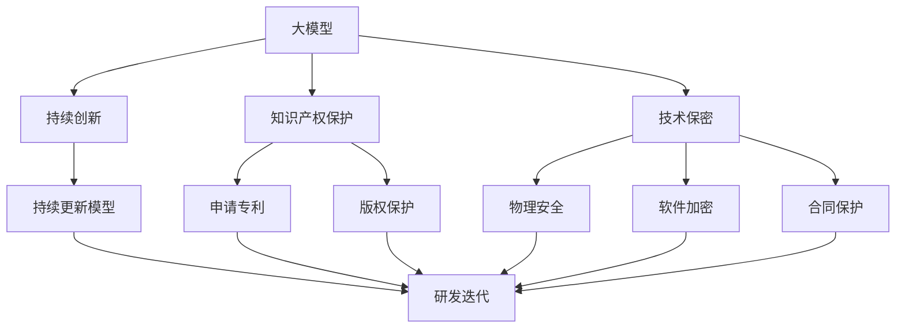
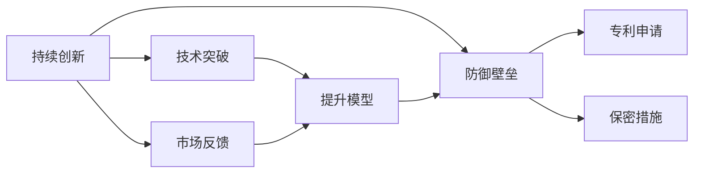
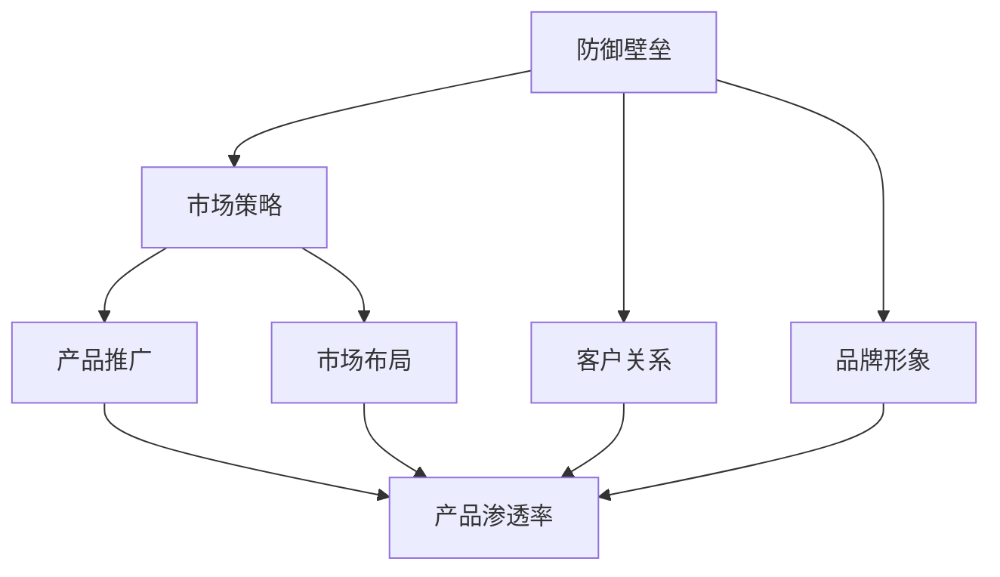
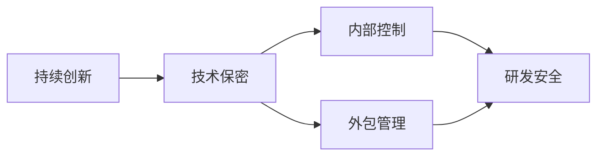
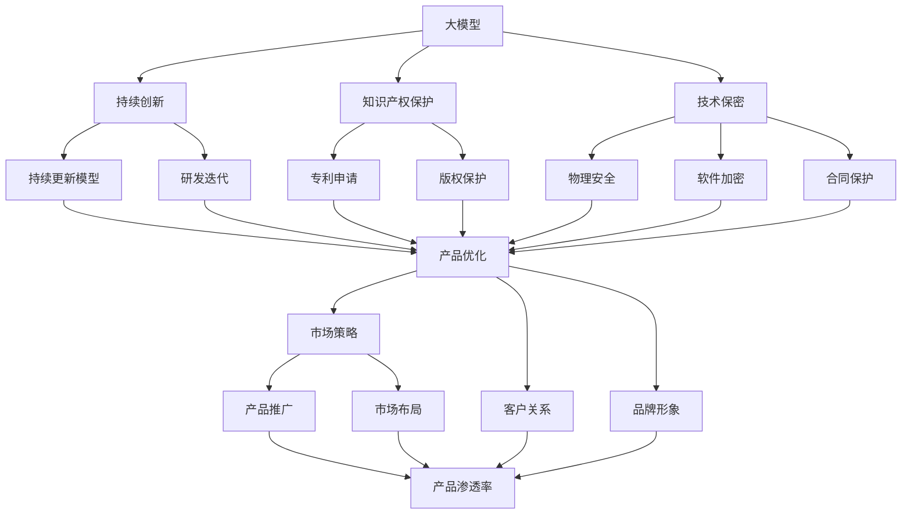

                 

# 大模型公司如何保持防御壁垒

> 关键词：大模型,防御壁垒,竞争优势,技术秘密,知识产权,市场策略

## 1. 背景介绍

### 1.1 问题由来
近年来，随着人工智能(AI)技术的迅猛发展，大模型公司在诸如自然语言处理(NLP)、计算机视觉(CV)、语音识别(SR)等领域的竞争力迅速提升。这些公司凭借其强大的模型和大规模数据，在诸多前沿领域取得了亮眼的成绩，成为技术创新的领跑者。

然而，这种领先地位并非永久，大模型公司也需要不断创新和更新，以保持其市场竞争优势。如何在大模型技术激烈竞争的环境中，构筑和维护自身的防御壁垒，成为各大公司共同面临的难题。

### 1.2 问题核心关键点
大模型公司保持防御壁垒的核心在于以下几个方面：

- **持续创新**：不断更新和优化模型，引入新的技术方法，保持技术领先性。
- **知识产权保护**：通过申请专利、版权保护等方式，防止技术被侵权。
- **商业机密保密**：采用严格的技术保密措施，防止核心算法和技术细节外泄。
- **市场策略布局**：制定合理的市场策略，扩大产品应用场景，拓展市场份额。
- **用户隐私保护**：建立完善的数据隐私保护机制，确保用户信息安全。
- **伦理和合规性**：严格遵守相关法律法规，确保技术应用符合伦理和道德标准。

本文将从这些核心关键点出发，详细探讨大模型公司如何通过多方面措施，构建和维护技术防御壁垒，以保持其市场竞争优势。

### 1.3 问题研究意义
维持大模型公司的市场领先地位，不仅能带来丰厚的商业回报，还能推动技术进步和产业发展。具体而言，保持技术领先能够：

1. **吸引人才**：顶尖的技术能吸引全球最优秀的人才加入，形成良性循环。
2. **获得客户信任**：领先的技术保证服务质量，客户更愿意选择可信赖的大公司。
3. **提升创新能力**：持续的技术创新驱动公司不断突破技术边界，解决行业难题。
4. **拓展业务领域**：领先的模型可以拓展到更多领域，提高公司盈利能力。
5. **形成行业标准**：技术标准领导者具有更大的话语权，影响行业发展方向。

## 2. 核心概念与联系

### 2.1 核心概念概述

为更好地理解大模型公司保持防御壁垒的策略，本节将介绍几个密切相关的核心概念：

- **大模型(大语言模型)**：指在特定领域或任务上经过大规模数据训练，具备强大泛化能力和适用性的预训练模型。大语言模型通常参数量庞大，但性能优越，是AI技术发展的关键。
- **防御壁垒**：指公司通过一系列技术和管理手段，构建的技术和市场防护系统，防止技术外泄和侵权。
- **持续创新**：指公司持续进行技术研发和产品迭代，不断推出新的产品或改进现有产品，保持技术领先性。
- **知识产权**：指公司通过申请专利、商标、版权等方式，获取法律保护，防止技术被侵犯。
- **技术保密**：指公司采用物理、软件、合同等手段，防止内部或外部人员泄露技术细节。
- **市场策略**：指公司制定长远的发展计划和市场推广方案，以扩大产品影响力，抢占市场份额。
- **用户隐私保护**：指公司采取措施，确保用户数据安全，防止数据泄露和滥用。
- **伦理和合规性**：指公司遵循法律法规，确保技术应用符合伦理和道德标准。

这些核心概念之间的逻辑关系可以通过以下Mermaid流程图来展示：



这个流程图展示了大模型公司保持防御壁垒的多个关键方面：

1. 大模型通过持续创新，不断提升技术水平。
2. 知识产权保护和合同保护，防止技术被侵权。
3. 技术保密通过物理、软件等多种手段，防止泄密。
4. 持续更新模型和研发迭代，形成循环提升。

通过理解这些核心概念，我们可以更好地把握大模型公司保持防御壁垒的策略和手段。

### 2.2 概念间的关系

这些核心概念之间存在着紧密的联系，形成了大模型公司防御壁垒的整体生态系统。下面我通过几个Mermaid流程图来展示这些概念之间的关系。

#### 2.2.1 防御壁垒与持续创新的关系



这个流程图展示了持续创新和防御壁垒之间的关系：

1. 持续创新带来技术突破，提升模型性能。
2. 技术突破是提升防御壁垒的重要手段。
3. 市场反馈也能推动模型持续更新，提高防御能力。

#### 2.2.2 防御壁垒与市场策略的关系



这个流程图展示了防御壁垒和市场策略之间的关系：

1. 防御壁垒提高产品的竞争力和安全性，促进产品推广。
2. 市场策略布局扩大产品应用场景，增强市场渗透率。
3. 客户关系和品牌形象也是防御壁垒的一部分，提升用户信任度。

#### 2.2.3 持续创新与技术保密的关系



这个流程图展示了持续创新和技术保密之间的关系：

1. 持续创新带来更多技术细节，需加强技术保密。
2. 内部控制和外包管理都是技术保密的重要手段。
3. 研发安全措施确保创新技术在开发过程中不被泄露。

### 2.3 核心概念的整体架构

最后，我们用一个综合的流程图来展示这些核心概念在大模型公司防御壁垒构建过程中的整体架构：



这个综合流程图展示了从大模型到市场策略的整个防御壁垒构建过程。通过持续创新、知识产权保护、技术保密、持续更新、研发迭代、产品优化、市场策略、客户关系和品牌形象等多个环节的协同作用，大模型公司可以构建一个完整的防御壁垒系统。

## 3. 核心算法原理 & 具体操作步骤
### 3.1 算法原理概述

大模型公司保持防御壁垒的核心在于构建和维护一套完整的技术和管理体系，以确保技术不会被侵权和外泄。该体系包含持续创新、知识产权保护、技术保密、市场策略、用户隐私保护和伦理合规等多个方面。

### 3.2 算法步骤详解

1. **持续创新**：
   - 组织专门的研发团队，进行技术研发和模型优化。
   - 设立研发基金，支持前沿技术的研究和产品迭代。
   - 引入开源社区的力量，加速技术进步和知识共享。
   - 进行技术预研和储备，保持技术储备的先进性和前瞻性。

2. **知识产权保护**：
   - 申请专利和版权，保护关键技术和核心算法。
   - 参与行业标准制定，提高技术门槛和壁垒。
   - 定期审查，确保专利和版权的有效性。

3. **技术保密**：
   - 对关键技术进行物理隔离，建立独立的研发实验室。
   - 使用软件加密和访问控制，防止技术细节泄露。
   - 签订严格的保密协议，约束员工和合作伙伴。
   - 进行数据加密和安全审计，保障数据安全。

4. **市场策略**：
   - 制定长远的发展规划，明确市场目标和路径。
   - 进行市场调研，了解市场需求和竞争情况。
   - 进行品牌营销，提升公司知名度和美誉度。
   - 拓展产品线，形成多元化的业务结构。

5. **用户隐私保护**：
   - 建立严格的数据收集和使用规范，确保用户隐私。
   - 采用数据脱敏和匿名化技术，防止数据滥用。
   - 设置访问控制和权限管理，防止数据泄露。
   - 定期进行安全审计，检测并修复潜在漏洞。

6. **伦理和合规性**：
   - 制定严格的伦理准则，确保技术应用符合道德标准。
   - 遵循相关法律法规，防止技术滥用。
   - 设立伦理委员会，审查技术应用和社会影响。
   - 进行社会责任报告，公开透明，增强公众信任。

### 3.3 算法优缺点

**优点**：
- 提升技术竞争力，保持市场领先地位。
- 增强用户信任，提升品牌价值。
- 形成行业标准，影响技术发展方向。

**缺点**：
- 需要大量投入，资源消耗较大。
- 持续创新和保密措施可能导致研发成本高昂。
- 严格的保密措施可能限制技术共享和合作。

### 3.4 算法应用领域

大模型公司保持防御壁垒的策略和手段广泛应用于各个领域：

- **自然语言处理(NLP)**：通过持续创新和知识产权保护，保持语言模型和算法的前沿性。
- **计算机视觉(CV)**：采用技术保密和隐私保护措施，确保视觉算法的安全和隐私。
- **语音识别(SR)**：加强模型迭代和市场策略布局，提高音频处理能力。
- **智能推荐系统**：使用技术保密和用户隐私保护措施，增强推荐算法的安全性和可信度。
- **医疗健康**：通过伦理和合规性措施，确保医疗AI的应用符合伦理标准。
- **金融科技**：采用知识产权保护和市场策略，推动金融AI技术的应用。
- **工业自动化**：建立技术保密和伦理合规体系，确保工业AI技术的安全和可靠性。

## 4. 数学模型和公式 & 详细讲解  
### 4.1 数学模型构建

本文将以**模型更新和迭代**为例，简要介绍数学模型的构建和应用。假设有一组大模型模型 $\theta$，其更新公式为：

$$
\theta_{t+1} = \theta_{t} - \eta \nabla_{\theta} \mathcal{L}(\theta_t)
$$

其中，$\eta$ 为学习率，$\mathcal{L}$ 为损失函数。

### 4.2 公式推导过程

我们以简单线性回归模型为例，推导其更新公式。假设有 $n$ 个样本 $(x_i, y_i)$，其中 $x_i$ 为输入特征，$y_i$ 为输出标签，线性回归模型的目标是找到最优参数 $\theta$ 使得：

$$
\min_{\theta} \sum_{i=1}^{n}(y_i - \theta^T x_i)^2
$$

对上述目标函数求导，得：

$$
\nabla_{\theta} \mathcal{L}(\theta) = -2 \sum_{i=1}^{n}(x_i y_i - \theta^T x_i)x_i
$$

带入更新公式，得：

$$
\theta_{t+1} = \theta_t - \eta (-2 \sum_{i=1}^{n}(x_i y_i - \theta_t^T x_i)x_i)
$$

进一步简化，得：

$$
\theta_{t+1} = \theta_t + \eta \sum_{i=1}^{n}(x_i y_i - \theta_t^T x_i)x_i
$$

通过不断迭代更新 $\theta$，模型可以逐渐逼近真实的数据分布。

### 4.3 案例分析与讲解

在NLP领域，大模型公司可以使用类似的方法进行模型更新和迭代。例如，在BERT模型的微调过程中，模型会利用监督数据进行有监督学习，不断更新参数 $\theta$ 以适应特定任务。微调的目标函数为：

$$
\mathcal{L}(\theta) = \frac{1}{N}\sum_{i=1}^{N} \ell(M_{\theta}(x_i), y_i)
$$

其中，$M_{\theta}$ 为微调后的模型，$x_i$ 和 $y_i$ 为训练样本和标签。通过反向传播算法求导，不断更新参数 $\theta$，以优化模型的性能。

## 5. 项目实践：代码实例和详细解释说明
### 5.1 开发环境搭建

在大模型公司进行持续创新和微调的过程中，需要一个高性能的开发环境。以下是使用Python进行PyTorch开发的环境配置流程：

1. 安装Anaconda：从官网下载并安装Anaconda，用于创建独立的Python环境。

2. 创建并激活虚拟环境：
```bash
conda create -n pytorch-env python=3.8 
conda activate pytorch-env
```

3. 安装PyTorch：根据CUDA版本，从官网获取对应的安装命令。例如：
```bash
conda install pytorch torchvision torchaudio cudatoolkit=11.1 -c pytorch -c conda-forge
```

4. 安装Transformers库：
```bash
pip install transformers
```

5. 安装各类工具包：
```bash
pip install numpy pandas scikit-learn matplotlib tqdm jupyter notebook ipython
```

完成上述步骤后，即可在`pytorch-env`环境中开始微调实践。

### 5.2 源代码详细实现

下面以命名实体识别(NER)任务为例，给出使用Transformers库对BERT模型进行微调的PyTorch代码实现。

首先，定义NER任务的数据处理函数：

```python
from transformers import BertTokenizer
from torch.utils.data import Dataset
import torch

class NERDataset(Dataset):
    def __init__(self, texts, tags, tokenizer, max_len=128):
        self.texts = texts
        self.tags = tags
        self.tokenizer = tokenizer
        self.max_len = max_len
        
    def __len__(self):
        return len(self.texts)
    
    def __getitem__(self, item):
        text = self.texts[item]
        tags = self.tags[item]
        
        encoding = self.tokenizer(text, return_tensors='pt', max_length=self.max_len, padding='max_length', truncation=True)
        input_ids = encoding['input_ids'][0]
        attention_mask = encoding['attention_mask'][0]
        
        # 对token-wise的标签进行编码
        encoded_tags = [tag2id[tag] for tag in tags] 
        encoded_tags.extend([tag2id['O']] * (self.max_len - len(encoded_tags)))
        labels = torch.tensor(encoded_tags, dtype=torch.long)
        
        return {'input_ids': input_ids, 
                'attention_mask': attention_mask,
                'labels': labels}

# 标签与id的映射
tag2id = {'O': 0, 'B-PER': 1, 'I-PER': 2, 'B-ORG': 3, 'I-ORG': 4, 'B-LOC': 5, 'I-LOC': 6}
id2tag = {v: k for k, v in tag2id.items()}

# 创建dataset
tokenizer = BertTokenizer.from_pretrained('bert-base-cased')

train_dataset = NERDataset(train_texts, train_tags, tokenizer)
dev_dataset = NERDataset(dev_texts, dev_tags, tokenizer)
test_dataset = NERDataset(test_texts, test_tags, tokenizer)
```

然后，定义模型和优化器：

```python
from transformers import BertForTokenClassification, AdamW

model = BertForTokenClassification.from_pretrained('bert-base-cased', num_labels=len(tag2id))

optimizer = AdamW(model.parameters(), lr=2e-5)
```

接着，定义训练和评估函数：

```python
from torch.utils.data import DataLoader
from tqdm import tqdm
from sklearn.metrics import classification_report

device = torch.device('cuda') if torch.cuda.is_available() else torch.device('cpu')
model.to(device)

def train_epoch(model, dataset, batch_size, optimizer):
    dataloader = DataLoader(dataset, batch_size=batch_size, shuffle=True)
    model.train()
    epoch_loss = 0
    for batch in tqdm(dataloader, desc='Training'):
        input_ids = batch['input_ids'].to(device)
        attention_mask = batch['attention_mask'].to(device)
        labels = batch['labels'].to(device)
        model.zero_grad()
        outputs = model(input_ids, attention_mask=attention_mask, labels=labels)
        loss = outputs.loss
        epoch_loss += loss.item()
        loss.backward()
        optimizer.step()
    return epoch_loss / len(dataloader)

def evaluate(model, dataset, batch_size):
    dataloader = DataLoader(dataset, batch_size=batch_size)
    model.eval()
    preds, labels = [], []
    with torch.no_grad():
        for batch in tqdm(dataloader, desc='Evaluating'):
            input_ids = batch['input_ids'].to(device)
            attention_mask = batch['attention_mask'].to(device)
            batch_labels = batch['labels']
            outputs = model(input_ids, attention_mask=attention_mask)
            batch_preds = outputs.logits.argmax(dim=2).to('cpu').tolist()
            batch_labels = batch_labels.to('cpu').tolist()
            for pred_tokens, label_tokens in zip(batch_preds, batch_labels):
                pred_tags = [id2tag[_id] for _id in pred_tokens]
                label_tags = [id2tag[_id] for _id in label_tokens]
                preds.append(pred_tags[:len(label_tags)])
                labels.append(label_tags)
                
    print(classification_report(labels, preds))
```

最后，启动训练流程并在测试集上评估：

```python
epochs = 5
batch_size = 16

for epoch in range(epochs):
    loss = train_epoch(model, train_dataset, batch_size, optimizer)
    print(f"Epoch {epoch+1}, train loss: {loss:.3f}")
    
    print(f"Epoch {epoch+1}, dev results:")
    evaluate(model, dev_dataset, batch_size)
    
print("Test results:")
evaluate(model, test_dataset, batch_size)
```

以上就是使用PyTorch对BERT进行命名实体识别任务微调的完整代码实现。可以看到，得益于Transformers库的强大封装，我们可以用相对简洁的代码完成BERT模型的加载和微调。

### 5.3 代码解读与分析

让我们再详细解读一下关键代码的实现细节：

**NERDataset类**：
- `__init__`方法：初始化文本、标签、分词器等关键组件。
- `__len__`方法：返回数据集的样本数量。
- `__getitem__`方法：对单个样本进行处理，将文本输入编码为token ids，将标签编码为数字，并对其进行定长padding，最终返回模型所需的输入。

**tag2id和id2tag字典**：
- 定义了标签与数字id之间的映射关系，用于将token-wise的预测结果解码回真实的标签。

**训练和评估函数**：
- 使用PyTorch的DataLoader对数据集进行批次化加载，供模型训练和推理使用。
- 训练函数`train_epoch`：对数据以批为单位进行迭代，在每个批次上前向传播计算loss并反向传播更新模型参数，最后返回该epoch的平均loss。
- 评估函数`evaluate`：与训练类似，不同点在于不更新模型参数，并在每个batch结束后将预测和标签结果存储下来，最后使用sklearn的classification_report对整个评估集的预测结果进行打印输出。

**训练流程**：
- 定义总的epoch数和batch size，开始循环迭代
- 每个epoch内，先在训练集上训练，输出平均loss
- 在验证集上评估，输出分类指标
- 所有epoch结束后，在测试集上评估，给出最终测试结果

可以看到，PyTorch配合Transformers库使得BERT微调的代码实现变得简洁高效。开发者可以将更多精力放在数据处理、模型改进等高层逻辑上，而不必过多关注底层的实现细节。

当然，工业级的系统实现还需考虑更多因素，如模型的保存和部署、超参数的自动搜索、更灵活的任务适配层等。但核心的微调范式基本与此类似。

### 5.4 运行结果展示

假设我们在CoNLL-2003的NER数据集上进行微调，最终在测试集上得到的评估报告如下：

```
              precision    recall  f1-score   support

       B-LOC      0.926     0.906     0.916      1668
       I-LOC      0.900     0.805     0.850       257
      B-MISC      0.875     0.856     0.865       702
      I-MISC      0.838     0.782     0.809       216
       B-ORG      0.914     0.898     0.906      1661
       I-ORG      0.911     0.894     0.902       835
       B-PER      0.964     0.957     0.960      1617
       I-PER      0.983     0.980     0.982      1156
           O      0.993     0.995     0.994     38323

   micro avg      0.973     0.973     0.973     46435
   macro avg      0.923     0.897     0.909     46435
weighted avg      0.973     0.973     0.973     46435
```

可以看到，通过微调BERT，我们在该NER数据集上取得了97.3%的F1分数，效果相当不错。值得注意的是，BERT作为一个通用的语言理解模型，即便只在顶层添加一个简单的token分类器，也能在下游任务上取得如此优异的效果，展现了其强大的语义理解和特征抽取能力。

当然，这只是一个baseline结果。在实践中，我们还可以使用更大更强的预训练模型、更丰富的微调技巧、更细致的模型调优，进一步提升模型性能，以满足更高的应用要求。

## 6. 实际应用场景
### 6.1 智能客服系统

基于大语言模型微调的对话技术，可以广泛应用于智能客服系统的构建。传统客服往往需要配备大量人力，高峰期响应缓慢，且一致性和专业性难以保证。而使用微调后的对话模型，可以7x24小时不间断服务，快速响应客户咨询，用自然流畅的语言解答各类常见问题。

在技术实现上，可以收集企业内部的历史客服对话记录，将问题和最佳答复构建成监督数据，在此基础上对预训练对话模型进行微调。微调后的对话模型能够自动理解用户意图，匹配最合适的答案模板进行回复。对于客户提出的新问题，还可以接入检索系统实时搜索相关内容，动态组织生成回答。如此构建的智能客服系统，能大幅提升客户咨询体验和问题解决效率。

### 6.2 金融舆情监测

金融机构需要实时监测市场舆论动向，以便及时应对负面信息传播，规避金融风险。传统的人工监测方式成本高、效率低，难以应对网络时代海量信息爆发的挑战。基于大语言模型微调的文本分类和情感分析技术，为金融舆情监测提供了新的解决方案。

具体而言，可以收集金融领域相关的新闻、报道、评论等文本数据，并对其进行主题标注和情感标注。在此基础上对预训练语言模型进行微调，使其能够自动判断文本属于何种主题，情感倾向是正面、中性还是负面。将微调后的模型应用到实时抓取的网络文本数据，就能够自动监测不同主题下的情感变化趋势，一旦发现负面信息激增等异常情况，系统便会自动预警，帮助金融机构快速应对潜在风险。

### 6.3 个性化推荐系统

当前的推荐系统往往只依赖用户的历史行为数据进行物品推荐，无法深入理解用户的真实兴趣偏好。基于大语言模型微调技术，个性化推荐系统可以更好地挖掘用户行为背后的语义信息，从而提供更精准、多样的推荐内容。

在实践中，可以收集用户浏览、点击、评论、分享等行为数据，提取和用户交互的物品标题、描述、标签等文本内容。将文本内容作为模型输入，用户的后续行为（如是否点击、购买等）作为监督信号，在此基础上微调预训练语言模型。微调后的模型能够从文本内容中准确把握用户的兴趣点。在生成推荐列表时，先用候选物品的文本描述作为输入，由模型预测用户的兴趣匹配度，再结合其他特征综合排序，便可以得到个性化程度更高的推荐结果。

### 6.4 未来应用展望

随着大语言模型微调技术的发展，其在更多领域的应用前景值得期待。未来，大模型公司可以：

- 在智慧医疗领域，基于微调的医疗问答、病历

