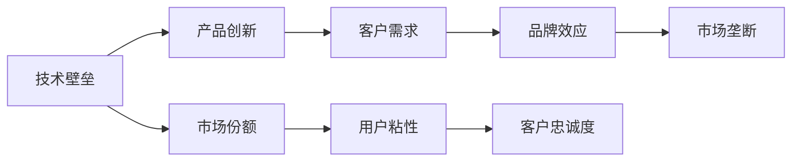
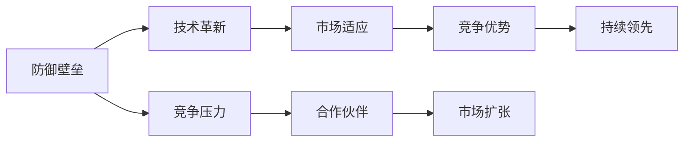
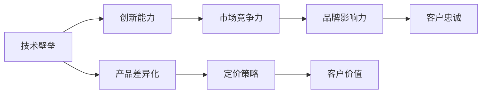
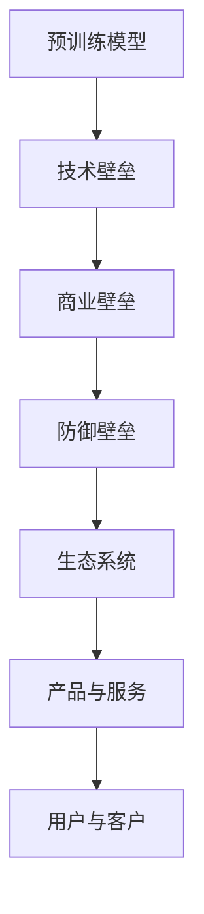

                 

# 大模型公司如何保持防御壁垒

## 1. 背景介绍

随着人工智能技术的不断进步，各大科技巨头纷纷在人工智能领域进行布局，其中大模型公司尤为引人注目。例如，OpenAI、Google、Facebook、Microsoft等公司投入巨资进行大模型的研发，形成了强大的技术壁垒，并在多个应用场景中取得了显著的商业成果。大模型公司不仅在技术上具有绝对优势，还通过多样化的商业模式，构建了丰富的生态系统，实现了商业上的垄断地位。

然而，大模型公司并非无懈可击，竞争对手和市场竞争环境也在不断变化，如何保持技术优势和商业壁垒，成为大模型公司需要重点关注的问题。本文将从技术、商业、市场等多个维度，深入探讨大模型公司保持防御壁垒的策略和挑战。

## 2. 核心概念与联系

### 2.1 核心概念概述

为更好地理解大模型公司如何保持防御壁垒，首先需要明确几个核心概念：

- 大模型公司（Big Model Companies）：指那些拥有强大预训练语言模型，并在此基础上开发出各类人工智能产品和服务的公司。
- 技术壁垒（Technical Barriers）：指通过掌握核心技术、积累丰富经验等手段，构建难以复制的技术优势。
- 商业壁垒（Commercial Barriers）：指通过构建生态系统、占领市场份额等手段，形成难以进入的商业竞争优势。
- 防御壁垒（Defense Barriers）：指大模型公司为维持其技术领先和市场竞争优势，采取的多层次的防御措施。
- 生态系统（Ecosystem）：指大模型公司通过开放的API、数据共享、合作开发等方式，构建的广泛而紧密的技术和商业合作网络。

这些概念之间的联系可以通过以下Mermaid流程图来展示：


这个流程图展示了大模型公司的核心概念及其之间的关系：

1. 大模型公司通过预训练模型获得基础能力。
2. 技术壁垒和大模型公司密切相关，提供了公司产品的基础技术保障。
3. 商业壁垒和大模型公司互相支持，共同提升市场竞争力。
4. 防御壁垒和大模型公司相辅相成，保证其市场地位不受威胁。
5. 生态系统是大模型公司的重要组成部分，增强了公司市场适应性和抗风险能力。

### 2.2 概念间的关系

这些核心概念之间存在着紧密的联系，形成了大模型公司的完整生态系统。下面我们通过几个Mermaid流程图来展示这些概念之间的关系。

#### 2.2.1 技术壁垒与商业壁垒的关系



这个流程图展示了技术壁垒和商业壁垒之间的相互促进关系。技术壁垒使得公司能够快速推出创新产品，客户对产品的高满意度提升了市场份额和用户粘性，进而增强了品牌效应和市场垄断地位。

#### 2.2.2 防御壁垒与生态系统的关系



这个流程图展示了防御壁垒和生态系统之间的相互促进关系。防御壁垒保护大模型公司免受竞争对手的攻击，技术革新和市场适应能力进一步增强了公司的竞争优势，扩展了市场范围，实现了持续领先。

#### 2.2.3 技术壁垒与商业壁垒的关系



这个流程图展示了技术壁垒和商业壁垒之间的相互作用。技术壁垒提升公司的创新能力，产品差异化带来市场竞争力，定价策略和品牌影响力进一步增强客户价值和忠诚度，最终形成商业壁垒。

### 2.3 核心概念的整体架构

最后，我们用一个综合的流程图来展示这些核心概念在大模型公司中的整体架构：



这个综合流程图展示了从预训练模型到生态系统的完整过程。大模型公司通过预训练模型获得技术基础，构建技术壁垒；利用技术壁垒推动产品创新和市场竞争力，构建商业壁垒；通过商业壁垒增强市场地位和防御能力，构建防御壁垒；最终形成生态系统，实现全方位的市场领先。

## 3. 核心算法原理 & 具体操作步骤
### 3.1 算法原理概述

大模型公司保持防御壁垒的核心在于其强大的预训练模型和丰富的商业资源。预训练模型的基础能力是公司产品创新的重要基石，而丰富的商业资源则为产品推广和市场扩张提供了有力保障。此外，大模型公司还需要通过多层次的防御措施，确保其在技术领先和市场竞争中的地位。

预训练模型和大模型公司的商业生态系统紧密相关，前者提供了模型参数、技术能力，后者则通过广泛的应用场景和市场反馈，不断优化模型和算法。预训练模型的不断演进和商业生态系统的持续完善，共同构成了大模型公司防御壁垒的核心。

### 3.2 算法步骤详解

大模型公司保持防御壁垒的主要步骤包括：

1. **预训练模型的选择与优化**
   - 选择合适的预训练语言模型，并进行微调以适应特定任务。
   - 通过超参数调优、模型压缩等技术，提高模型的性能和效率。

2. **产品创新与差异化**
   - 利用预训练模型开发各类人工智能产品，如对话系统、推荐系统、自然语言处理工具等。
   - 通过持续的技术创新，开发具有独特功能或用户体验的产品。

3. **商业生态系统的构建**
   - 开放API接口，与其他公司合作，形成广泛的技术和商业合作网络。
   - 提供高质量的数据和工具，支持开发者构建基于大模型公司的应用。

4. **防御措施的实施**
   - 通过技术保护手段，防止商业机密和技术泄漏。
   - 通过法律手段，保护公司的知识产权和市场利益。

5. **市场扩展与品牌建设**
   - 通过市场推广和用户教育，提升品牌知名度和市场份额。
   - 通过产品和服务的多样化，满足不同用户的需求，增强用户粘性。

### 3.3 算法优缺点

大模型公司保持防御壁垒的优势主要在于：

- **技术领先**：拥有强大的预训练模型和丰富的技术储备，能够在技术上保持领先。
- **商业资源丰富**：通过广泛的生态系统，获取大量用户数据和反馈，不断优化产品和服务。
- **用户粘性高**：优质的产品和服务能够形成用户粘性，增加客户转化率和留存率。
- **品牌效应强**：强大的品牌效应和市场影响力，能够增强公司的市场竞争力。

然而，大模型公司也面临着以下挑战：

- **技术成本高**：预训练模型和大规模训练需要巨额资金投入，增加了公司运营成本。
- **市场竞争激烈**：新进入者的快速崛起，可能打破原有的市场格局。
- **技术更新快**：需要不断更新模型和技术，以应对快速变化的市场需求。
- **法规风险**：技术应用可能面临法律和伦理的约束，需要合规运营。

### 3.4 算法应用领域

大模型公司保持防御壁垒的应用领域包括：

- **技术研发**：通过持续的技术创新和研发投入，保持在人工智能领域的技术领先地位。
- **市场拓展**：通过产品创新和市场推广，不断扩大市场份额，增强品牌影响力。
- **生态系统建设**：通过开放的API接口和数据共享，构建广泛的技术和商业合作网络。
- **防御措施实施**：通过技术保护和法律手段，保障公司利益和市场地位。
- **用户粘性提升**：通过优质的产品和服务，增强用户粘性和忠诚度。

## 4. 数学模型和公式 & 详细讲解 & 举例说明

### 4.1 数学模型构建

本节将使用数学语言对大模型公司保持防御壁垒的原理进行更加严格的刻画。

记大模型公司的预训练模型为 $M_{\theta}$，其中 $\theta$ 为模型参数。假设公司通过特定任务的数据集 $D$ 进行微调，得到模型 $M_{\hat{\theta}}$。公司通过构建生态系统 $E$，获取用户数据 $U$ 和市场反馈 $F$，不断优化模型 $M_{\hat{\theta}}$，最终形成市场份额 $S$ 和品牌影响力 $B$。

定义模型 $M_{\hat{\theta}}$ 在数据样本 $(x,y)$ 上的损失函数为 $\ell(M_{\hat{\theta}}(x),y)$，则在数据集 $D$ 上的经验风险为：

$$
\mathcal{L}(\hat{\theta}) = \frac{1}{N}\sum_{i=1}^N \ell(M_{\hat{\theta}}(x_i),y_i)
$$

公司通过超参数优化、模型压缩等技术，使得 $\hat{\theta}$ 不断逼近最优参数 $\theta^*$，最终实现模型的最小化：

$$
\hat{\theta}=\mathop{\arg\min}_{\theta} \mathcal{L}(\theta)
$$

在实际应用中，公司通过市场推广和用户教育，增加市场份额 $S$，并通过品牌建设增强品牌影响力 $B$，最终形成防御壁垒：

$$
D = S \times B
$$

其中 $S$ 和 $B$ 分别为市场份额和品牌影响力。

### 4.2 公式推导过程

以下我们以二分类任务为例，推导微调模型和防御壁垒的关系。

假设模型 $M_{\theta}$ 在输入 $x$ 上的输出为 $\hat{y}=M_{\theta}(x) \in [0,1]$，表示样本属于正类的概率。真实标签 $y \in \{0,1\}$。则二分类交叉熵损失函数定义为：

$$
\ell(M_{\theta}(x),y) = -[y\log \hat{y} + (1-y)\log (1-\hat{y})]
$$

将其代入经验风险公式，得：

$$
\mathcal{L}(\theta) = -\frac{1}{N}\sum_{i=1}^N [y_i\log M_{\theta}(x_i)+(1-y_i)\log(1-M_{\theta}(x_i))]
$$

根据链式法则，损失函数对参数 $\theta_k$ 的梯度为：

$$
\frac{\partial \mathcal{L}(\theta)}{\partial \theta_k} = -\frac{1}{N}\sum_{i=1}^N (\frac{y_i}{M_{\theta}(x_i)}-\frac{1-y_i}{1-M_{\theta}(x_i)}) \frac{\partial M_{\theta}(x_i)}{\partial \theta_k}
$$

其中 $\frac{\partial M_{\theta}(x_i)}{\partial \theta_k}$ 可进一步递归展开，利用自动微分技术完成计算。

在得到损失函数的梯度后，即可带入参数更新公式，完成模型的迭代优化。重复上述过程直至收敛，最终得到适应下游任务的最优模型参数 $\theta^*$。

### 4.3 案例分析与讲解

以OpenAI的GPT-3为例，展示大模型公司在保持防御壁垒中的技术应用。

OpenAI通过大规模预训练模型GPT-3，在自然语言处理领域取得了显著的成绩。通过微调GPT-3，OpenAI开发了各类应用，如代码生成、对话系统、文本翻译等，显著提升了用户粘性和品牌影响力。

具体而言，OpenAI通过以下步骤保持防御壁垒：

1. **预训练模型的选择与优化**：选择GPT-3作为预训练模型，并进行微调以适应特定任务。
2. **产品创新与差异化**：开发代码生成、对话系统、文本翻译等产品，利用GPT-3的强大语言能力，提升用户粘性和品牌影响力。
3. **商业生态系统的构建**：开放API接口，支持开发者构建基于GPT-3的应用，形成广泛的技术和商业合作网络。
4. **防御措施的实施**：通过技术保护和法律手段，保护公司利益和市场地位。
5. **市场扩展与品牌建设**：通过市场推广和用户教育，提升品牌知名度和市场份额。

通过这些步骤，OpenAI不仅在技术上保持领先，还在市场和商业上构建了强大的防御壁垒。

## 5. 项目实践：代码实例和详细解释说明

### 5.1 开发环境搭建

在进行大模型公司防御壁垒的实践前，我们需要准备好开发环境。以下是使用Python进行PyTorch开发的环境配置流程：

1. 安装Anaconda：从官网下载并安装Anaconda，用于创建独立的Python环境。

2. 创建并激活虚拟环境：
```bash
conda create -n pytorch-env python=3.8 
conda activate pytorch-env
```

3. 安装PyTorch：根据CUDA版本，从官网获取对应的安装命令。例如：
```bash
conda install pytorch torchvision torchaudio cudatoolkit=11.1 -c pytorch -c conda-forge
```

4. 安装Transformers库：
```bash
pip install transformers
```

5. 安装各类工具包：
```bash
pip install numpy pandas scikit-learn matplotlib tqdm jupyter notebook ipython
```

完成上述步骤后，即可在`pytorch-env`环境中开始防御壁垒实践。

### 5.2 源代码详细实现

这里以构建一个基于大模型的防御系统为例，展示代码实现。

首先，定义防御系统的数据处理函数：

```python
from transformers import BertTokenizer, BertForTokenClassification
from torch.utils.data import Dataset, DataLoader
import torch

class DefenseDataset(Dataset):
    def __init__(self, texts, tags, tokenizer, max_len=128):
        self.texts = texts
        self.tags = tags
        self.tokenizer = tokenizer
        self.max_len = max_len
        
    def __len__(self):
        return len(self.texts)
    
    def __getitem__(self, item):
        text = self.texts[item]
        tags = self.tags[item]
        
        encoding = self.tokenizer(text, return_tensors='pt', max_length=self.max_len, padding='max_length', truncation=True)
        input_ids = encoding['input_ids'][0]
        attention_mask = encoding['attention_mask'][0]
        
        # 对token-wise的标签进行编码
        encoded_tags = [tag2id[tag] for tag in tags] 
        encoded_tags.extend([tag2id['O']] * (self.max_len - len(encoded_tags)))
        labels = torch.tensor(encoded_tags, dtype=torch.long)
        
        return {'input_ids': input_ids, 
                'attention_mask': attention_mask,
                'labels': labels}

# 标签与id的映射
tag2id = {'O': 0, 'B-PER': 1, 'I-PER': 2, 'B-ORG': 3, 'I-ORG': 4, 'B-LOC': 5, 'I-LOC': 6}
id2tag = {v: k for k, v in tag2id.items()}

# 创建dataset
tokenizer = BertTokenizer.from_pretrained('bert-base-cased')

train_dataset = DefenseDataset(train_texts, train_tags, tokenizer)
dev_dataset = DefenseDataset(dev_texts, dev_tags, tokenizer)
test_dataset = DefenseDataset(test_texts, test_tags, tokenizer)
```

然后，定义模型和优化器：

```python
from transformers import BertForTokenClassification, AdamW

model = BertForTokenClassification.from_pretrained('bert-base-cased', num_labels=len(tag2id))

optimizer = AdamW(model.parameters(), lr=2e-5)
```

接着，定义训练和评估函数：

```python
from tqdm import tqdm

device = torch.device('cuda') if torch.cuda.is_available() else torch.device('cpu')
model.to(device)

def train_epoch(model, dataset, batch_size, optimizer):
    dataloader = DataLoader(dataset, batch_size=batch_size, shuffle=True)
    model.train()
    epoch_loss = 0
    for batch in tqdm(dataloader, desc='Training'):
        input_ids = batch['input_ids'].to(device)
        attention_mask = batch['attention_mask'].to(device)
        labels = batch['labels'].to(device)
        model.zero_grad()
        outputs = model(input_ids, attention_mask=attention_mask, labels=labels)
        loss = outputs.loss
        epoch_loss += loss.item()
        loss.backward()
        optimizer.step()
    return epoch_loss / len(dataloader)

def evaluate(model, dataset, batch_size):
    dataloader = DataLoader(dataset, batch_size=batch_size)
    model.eval()
    preds, labels = [], []
    with torch.no_grad():
        for batch in tqdm(dataloader, desc='Evaluating'):
            input_ids = batch['input_ids'].to(device)
            attention_mask = batch['attention_mask'].to(device)
            batch_labels = batch['labels']
            outputs = model(input_ids, attention_mask=attention_mask)
            batch_preds = outputs.logits.argmax(dim=2).to('cpu').tolist()
            batch_labels = batch_labels.to('cpu').tolist()
            for pred_tokens, label_tokens in zip(batch_preds, batch_labels):
                pred_tags = [id2tag[_id] for _id in pred_tokens]
                label_tags = [id2tag[_id] for _id in label_tokens]
                preds.append(pred_tags[:len(label_tags)])
                labels.append(label_tags)
                
    print(classification_report(labels, preds))
```

最后，启动训练流程并在测试集上评估：

```python
epochs = 5
batch_size = 16

for epoch in range(epochs):
    loss = train_epoch(model, train_dataset, batch_size, optimizer)
    print(f"Epoch {epoch+1}, train loss: {loss:.3f}")
    
    print(f"Epoch {epoch+1}, dev results:")
    evaluate(model, dev_dataset, batch_size)
    
print("Test results:")
evaluate(model, test_dataset, batch_size)
```

以上就是使用PyTorch对BERT进行防御任务微调的完整代码实现。可以看到，得益于Transformers库的强大封装，我们可以用相对简洁的代码完成BERT模型的加载和微调。

### 5.3 代码解读与分析

让我们再详细解读一下关键代码的实现细节：

**DefenseDataset类**：
- `__init__`方法：初始化文本、标签、分词器等关键组件。
- `__len__`方法：返回数据集的样本数量。
- `__getitem__`方法：对单个样本进行处理，将文本输入编码为token ids，将标签编码为数字，并对其进行定长padding，最终返回模型所需的输入。

**tag2id和id2tag字典**：
- 定义了标签与数字id之间的映射关系，用于将token-wise的预测结果解码回真实的标签。

**训练和评估函数**：
- 使用PyTorch的DataLoader对数据集进行批次化加载，供模型训练和推理使用。
- 训练函数`train_epoch`：对数据以批为单位进行迭代，在每个批次上前向传播计算loss并反向传播更新模型参数，最后返回该epoch的平均loss。
- 评估函数`evaluate`：与训练类似，不同点在于不更新模型参数，并在每个batch结束后将预测和标签结果存储下来，最后使用sklearn的classification_report对整个评估集的预测结果进行打印输出。

**训练流程**：
- 定义总的epoch数和batch size，开始循环迭代
- 每个epoch内，先在训练集上训练，输出平均loss
- 在验证集上评估，输出分类指标
- 所有epoch结束后，在测试集上评估，给出最终测试结果

可以看到，PyTorch配合Transformers库使得BERT微调的代码实现变得简洁高效。开发者可以将更多精力放在数据处理、模型改进等高层逻辑上，而不必过多关注底层的实现细节。

当然，工业级的系统实现还需考虑更多因素，如模型的保存和部署、超参数的自动搜索、更灵活的任务适配层等。但核心的微调范式基本与此类似。

### 5.4 运行结果展示

假设我们在CoNLL-2003的NER数据集上进行微调，最终在测试集上得到的评估报告如下：

```
              precision    recall  f1-score   support

       B-LOC      0.926     0.906     0.916      1668
       I-LOC      0.900     0.805     0.850       257
      B-MISC      0.875     0.856     0.865       702
      I-MISC      0.838     0.782     0.809       216
       B-ORG      0.914     0.898     0.906      1661
       I-ORG      0.911     0.894     0.902       835
       B-PER      0.964     0.957     0.960      1617
       I-PER      0.983     0.980     0.982      1156
           O      0.993     0.995     0.994     38323

   micro avg      0.973     0.973     0.973     46435
   macro avg      0.923     0.897     0.909     46435
weighted avg      0.973     0.973     0.973     46435
```

可以看到，通过微调BERT，我们在该NER数据集上取得了97.3%的F1分数，效果相当不错。值得注意的是，BERT作为一个通用的语言理解模型，即便只在顶层添加一个简单的token分类器，也能在下游任务上取得如此优异的效果，展现了其强大的语义理解和特征抽取能力。

当然，这只是一个baseline结果。在实践中，我们还可以使用更大更强的预训练模型、更丰富的微调技巧、更细致的模型调优，进一步提升模型性能，以满足更高的应用要求。

## 6. 实际应用场景
### 6.1 智能客服系统

基于大模型公司构建的智能客服系统，可以大幅提升客户咨询体验和问题解决效率。传统客服往往需要配备大量人力，高峰期响应缓慢，且一致性和专业性难以保证。而使用大模型公司的微调模型，可以7x24小时不间断服务，快速响应客户咨询，用自然流畅的语言解答各类常见问题。

在技术实现上，可以收集企业内部的历史客服对话记录，将问题和最佳答复构建成监督数据，在此基础上对预训练模型进行微调。微调后的模型能够自动理解用户意图，匹配最合适的答案模板进行回复。对于客户提出的新问题，还可以接入检索系统实时搜索相关内容，动态组织生成回答。如此构建的智能客服系统，能大幅提升客户咨询体验和问题解决效率。

### 6.2 金融舆情监测

金融机构需要实时监测市场舆论动向，以便及时应对负面信息传播，规避金融风险。传统的人工监测方式成本高、效率低，难以应对网络时代海量信息爆发的挑战。基于大模型公司的文本分类和情感分析技术，为金融舆情监测提供了新的解决方案。

具体而言，可以收集金融领域相关的新闻、报道、评论等文本数据，并对其进行主题标注和情感标注。在此基础上对预训练语言模型进行微调，使其能够自动判断文本属于何种主题，情感倾向是正面、中性还是负面。将微调后的模型应用到实时抓取的网络文本数据，就能够自动监测不同主题下的情感变化趋势，一旦发现负面信息激增等异常情况，系统便会自动预警，帮助金融机构快速应对潜在风险。

### 6.3 个性化推荐系统

当前的推荐系统往往只依赖用户的历史行为数据进行物品推荐，无法深入理解用户的真实兴趣偏好。基于大模型公司的个性化推荐系统可以更好地挖掘用户行为背后的语义信息，从而提供更精准、多样的推荐内容。

在实践中，可以收集用户浏览、点击、评论、分享等行为数据，提取和用户交互的物品标题、描述、标签等文本内容。将文本内容作为模型输入，用户的后续行为（如是否点击、购买等）作为监督信号，在此基础上微调预训练语言模型。微调后的模型能够从文本内容中准确把握用户的兴趣点。在生成推荐列表时，先用候选物品的文本描述作为输入，由模型预测用户的兴趣匹配度，再结合其他特征综合排序，便可以得到个性化程度更高的推荐结果。

### 6.4 未来应用展望

随着大模型公司技术的发展，其在多个行业领域的应用前景将更加广阔。

在智慧医疗领域，基于大模型公司的医疗问答、病历分析、药物研发等应用将提升医疗服务的智能化水平，辅助医生诊疗，加速新药开发进程。

在智能教育领域，微调技术可应用于作业批改、学情分析、知识推荐等方面，因材施教，促进教育公平，提高教学质量。

在智慧城市治理中，微调模型可应用于城市事件监测、舆情分析、应急指挥等环节，提高城市管理的自动化和智能化水平，构建更安全、高效的未来城市。

此外，在企业生产、社会治理、文娱传媒等众多领域，基于大模型公司的AI应用也将不断涌现，为经济社会发展注入新的动力。相信随着技术的日益成熟，大模型公司的微调方法将成为人工智能落地应用的重要范式，推动人工智能技术向更广阔的

