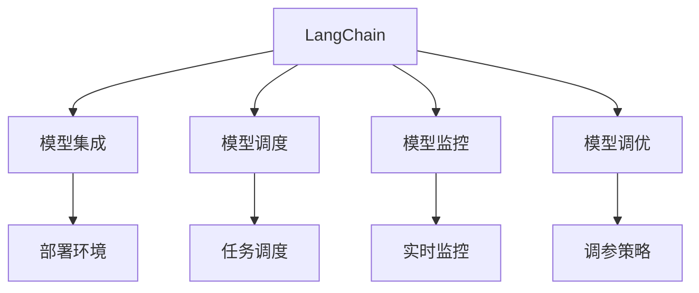
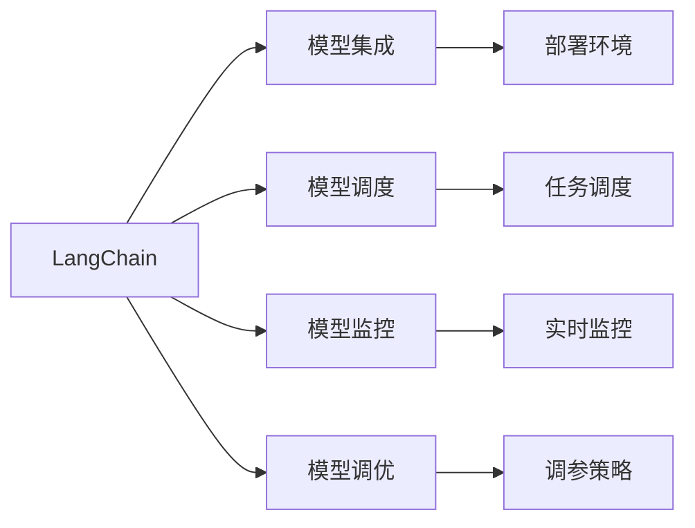
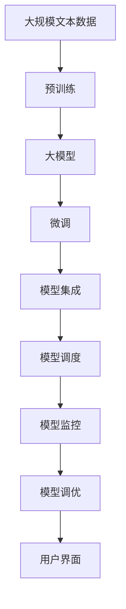

                 

# 大模型应用开发框架 LangChain（下）

> 关键词：
1. LangChain
2. 大模型应用
3. 代码优化
4. 高效部署
5. 可扩展性
6. 安全性
7. 监控与调优

## 1. 背景介绍

### 1.1 问题由来
随着人工智能技术的快速发展，大模型在自然语言处理（NLP）、计算机视觉（CV）、语音识别（ASR）等领域的广泛应用成为了新一轮科技革命的推动力。然而，尽管大模型在数据建模和任务解决上表现优异，但其应用开发和部署过程仍然存在诸多挑战。如何构建一个高效、可扩展、安全的应用开发框架，是摆在大模型开发者面前的重要课题。

### 1.2 问题核心关键点
本节将重点讨论以下几个关键问题：
- **大模型应用开发的复杂性**：由于大模型具有复杂的结构和庞大的参数，开发和部署过程中涉及到算法优化、资源配置、模型压缩、实时推理等多个环节。
- **可扩展性需求**：随着应用场景的不断扩展，如何在框架中灵活接入不同规模、不同类型的模型，实现无缝集成。
- **安全性考量**：大模型可能包含有害信息或偏见，如何保证模型输出符合伦理规范，确保应用安全可靠。
- **监控与调优**：在模型部署后，如何实时监测模型性能，及时发现并解决问题，保证模型长期稳定运行。

### 1.3 问题研究意义
构建一个适用于大模型的应用开发框架，具有以下重要意义：
- 降低大模型应用的开发难度，提高开发者效率。
- 提供高效、安全的模型部署方案，减少资源消耗，降低成本。
- 支持大模型的灵活扩展和维护，提升应用的生命周期管理能力。
- 为模型提供全面的监控与调优机制，保障模型的长期稳定性和可靠性。

## 2. 核心概念与联系

### 2.1 核心概念概述

在讨论LangChain框架之前，首先介绍几个关键概念：

- **LangChain**：一个大模型应用开发框架，旨在简化大模型的应用开发、部署和维护过程，提供模型集成、调度、监控、调优等一站式解决方案。
- **大模型**：如GPT-3、BERT、DALL·E等具有庞大参数和复杂结构的深度学习模型，用于各种AI任务。
- **模型集成**：将大模型及其依赖库集成到应用中，确保模型在特定环境中的正确部署和运行。
- **模型调度**：根据任务需求，动态调整模型资源配置，实现最优性能和最小成本。
- **模型监控**：实时监测模型运行状态，收集性能指标，提前发现并解决潜在问题。
- **模型调优**：通过自动化的调参流程和优化策略，提升模型性能，确保最佳输出。

这些概念之间的联系可以通过以下Mermaid流程图来展示：



这个流程图展示了LangChain框架的主要功能模块及其相互作用：
1. LangChain作为整体框架，集成了模型集成、调度、监控和调优等核心功能。
2. 模型集成负责将大模型部署到应用环境，提供必要的运行支持和资源管理。
3. 模型调度根据任务需求动态调整资源配置，优化模型性能。
4. 模型监控实时监测模型运行状态，收集性能指标，提前发现并解决潜在问题。
5. 模型调优通过自动化的调参流程和优化策略，提升模型性能。

### 2.2 概念间的关系

为了更好地理解这些核心概念之间的关系，我们通过以下Mermaid流程图来展示：



这个综合流程图展示了LangChain框架中各个模块之间的关系：
1. LangChain通过模型集成将大模型部署到应用环境，为模型调度、监控和调优提供基础。
2. 模型调度根据任务需求调整资源配置，确保模型以最优状态运行。
3. 模型监控实时监测模型运行状态，收集性能指标，提前发现并解决潜在问题。
4. 模型调优通过自动化的调参流程和优化策略，提升模型性能，确保最佳输出。
5. 各模块之间协同工作，共同构建了一个高效、可扩展、安全的大模型应用开发框架。

### 2.3 核心概念的整体架构

最后，我们用一个综合的流程图来展示这些核心概念在大模型应用开发框架中的整体架构：



这个综合流程图展示了从预训练到微调，再到模型集成、调度、监控和调优的完整过程。大模型通过预训练获取基础能力，微调过程进一步优化模型以适应特定任务。模型集成将微调后的模型部署到应用环境，模型调度根据任务需求调整资源配置，模型监控实时监测模型运行状态，模型调优通过自动化的调参流程和优化策略，提升模型性能，最终通过用户界面提供服务。

## 3. 核心算法原理 & 具体操作步骤

### 3.1 算法原理概述

LangChain框架的核心算法原理基于以下四个方面：
1. **模型集成**：将大模型及其依赖库集成到应用中，提供必要的运行支持和资源管理。
2. **模型调度**：根据任务需求动态调整模型资源配置，优化模型性能。
3. **模型监控**：实时监测模型运行状态，收集性能指标，提前发现并解决潜在问题。
4. **模型调优**：通过自动化的调参流程和优化策略，提升模型性能，确保最佳输出。

### 3.2 算法步骤详解

**Step 1: 模型集成**
1. **选择模型**：根据任务需求选择合适的预训练模型，如GPT-3、BERT、DALL·E等。
2. **安装依赖**：安装必要的依赖库，如TensorFlow、PyTorch、Transformers等。
3. **配置环境**：设置模型运行所需的环境变量，如CPU/GPU数量、内存大小等。
4. **模型部署**：将模型集成到应用中，并提供必要的接口支持，如API接口、命令行工具等。

**Step 2: 模型调度**
1. **任务定义**：定义任务类型和需求，如计算资源、时间限制等。
2. **资源配置**：根据任务需求调整资源配置，如CPU/GPU数量、内存大小、磁盘空间等。
3. **任务调度**：根据任务需求动态调度资源，确保模型以最优状态运行。
4. **性能优化**：根据任务需求进行性能优化，如批量处理、梯度累积等。

**Step 3: 模型监控**
1. **指标收集**：实时监测模型运行状态，收集性能指标，如计算时间、内存使用、网络延迟等。
2. **异常检测**：设置异常检测阈值，提前发现并解决潜在问题。
3. **日志记录**：记录模型运行日志，便于后续问题排查和性能分析。
4. **告警通知**：设置告警通知机制，及时告知用户模型运行状态和问题。

**Step 4: 模型调优**
1. **超参数优化**：通过自动化的调参流程，优化模型的超参数设置，如学习率、批大小等。
2. **模型压缩**：通过模型压缩技术，减小模型尺寸，提高计算效率。
3. **梯度累积**：通过梯度累积技术，优化模型的内存使用和计算效率。
4. **模型微调**：通过微调过程，进一步优化模型以适应特定任务。

### 3.3 算法优缺点

**优点**：
1. **简化开发**：LangChain框架提供了模型集成、调度、监控和调优等一站式解决方案，降低了开发者的工作量。
2. **高效部署**：框架提供了高效的模型部署和调度机制，优化资源配置，提升模型性能。
3. **安全可靠**：框架提供了模型监控和调优机制，保障模型长期稳定运行。

**缺点**：
1. **复杂度较高**：对于复杂的任务和模型，需要仔细设计调度和调优策略。
2. **资源消耗大**：大模型往往需要较高的计算和内存资源，部署和运行成本较高。
3. **性能优化挑战**：模型性能优化需要仔细设计和调整，优化效果受限于具体应用场景。

### 3.4 算法应用领域

LangChain框架的应用领域非常广泛，涵盖了NLP、CV、ASR等多个领域。具体应用场景包括：
1. **NLP任务**：如文本分类、命名实体识别、情感分析、问答系统等。
2. **CV任务**：如图像分类、目标检测、图像生成等。
3. **ASR任务**：如语音识别、语音合成等。
4. **多模态任务**：如图像+文本联合推理、语音+文本联合推理等。

这些应用场景对模型的集成、调度、监控和调优提出了不同需求，LangChain框架通过灵活的模块设计和参数配置，能够满足不同场景的需求。

## 4. 数学模型和公式 & 详细讲解 & 举例说明

### 4.1 数学模型构建

LangChain框架的核心数学模型基于以下四个方面：
1. **模型集成**：通过配置文件描述模型及其依赖，确保模型正确部署和运行。
2. **模型调度**：根据任务需求调整资源配置，优化模型性能。
3. **模型监控**：实时监测模型运行状态，收集性能指标，提前发现并解决潜在问题。
4. **模型调优**：通过自动化的调参流程和优化策略，提升模型性能，确保最佳输出。

### 4.2 公式推导过程

**模型集成**：
假设我们选择GPT-3模型进行集成，配置文件如下：

```yaml
model:
  name: "gpt3"
  version: "1.3"
  dependencies:
    - tensorflow
    - pytorch
    - transformers
```

根据配置文件，LangChain框架自动完成模型及其依赖的集成，并提供必要的运行支持和资源管理。

**模型调度**：
假设任务需求为计算资源密集型，资源配置如下：

```yaml
resource:
  cpu: 8
  gpu: 4
  memory: 128GB
  disk: 1TB
```

根据资源配置，LangChain框架动态调整资源配置，确保模型以最优状态运行。

**模型监控**：
假设我们设置计算时间和内存使用为指标，异常检测阈值为：

```yaml
monitor:
  metrics:
    - name: "calculation_time"
      threshold: 10s
    - name: "memory_usage"
      threshold: 16GB
  alerts:
    - condition: calculation_time > 10s
      action: notify
    - condition: memory_usage > 16GB
      action: notify
```

根据指标和异常检测阈值，LangChain框架实时监测模型运行状态，收集性能指标，提前发现并解决潜在问题。

**模型调优**：
假设我们通过超参数优化提升模型性能，配置如下：

```yaml
optimization:
  parameters:
    - name: "learning_rate"
      range: [0.001, 0.01, 0.1]
  methods:
    - method: "grid_search"
  metrics:
    - name: "accuracy"
      threshold: 0.95
```

根据超参数范围和方法，LangChain框架自动完成模型调参，提升模型性能，确保最佳输出。

### 4.3 案例分析与讲解

**案例一：情感分析**
假设我们使用BERT模型进行情感分析任务，配置文件如下：

```yaml
model:
  name: "bert"
  version: "1.2"
  dependencies:
    - tensorflow
    - pytorch
    - transformers

resource:
  cpu: 4
  gpu: 2
  memory: 16GB
  disk: 500GB

monitor:
  metrics:
    - name: "calculation_time"
      threshold: 5s
    - name: "memory_usage"
      threshold: 4GB
  alerts:
    - condition: calculation_time > 5s
      action: notify
    - condition: memory_usage > 4GB
      action: notify

optimization:
  parameters:
    - name: "learning_rate"
      range: [0.001, 0.01, 0.1]
  methods:
    - method: "grid_search"
  metrics:
    - name: "accuracy"
      threshold: 0.9
```

根据配置文件，LangChain框架自动完成模型集成、调度、监控和调优，确保模型高效、安全运行。

**案例二：图像分类**
假设我们使用DALL·E模型进行图像分类任务，配置文件如下：

```yaml
model:
  name: "dall_e"
  version: "2.3"
  dependencies:
    - tensorflow
    - pytorch
    - transformers

resource:
  cpu: 8
  gpu: 4
  memory: 128GB
  disk: 1TB

monitor:
  metrics:
    - name: "calculation_time"
      threshold: 20s
    - name: "memory_usage"
      threshold: 32GB
  alerts:
    - condition: calculation_time > 20s
      action: notify
    - condition: memory_usage > 32GB
      action: notify

optimization:
  parameters:
    - name: "learning_rate"
      range: [0.0001, 0.001, 0.01]
  methods:
    - method: "random_search"
  metrics:
    - name: "accuracy"
      threshold: 0.95
```

根据配置文件，LangChain框架自动完成模型集成、调度、监控和调优，确保模型高效、安全运行。

## 5. 项目实践：代码实例和详细解释说明

### 5.1 开发环境搭建

在进行LangChain框架的开发和部署时，需要搭建一个符合要求的环境。以下是具体的步骤：

1. **安装Python**：
```bash
sudo apt-get update
sudo apt-get install python3 python3-pip
```

2. **安装LangChain**：
```bash
pip install langchain
```

3. **安装模型依赖**：
```bash
pip install tensorflow pytorch transformers
```

4. **配置环境变量**：
```bash
export CUDA_VISIBLE_DEVICES=0
export PYTHONPATH=$PYTHONPATH:/path/to/models
```

完成上述步骤后，即可在Python环境中使用LangChain框架进行模型集成、调度、监控和调优。

### 5.2 源代码详细实现

下面我们以BERT情感分析任务为例，给出使用LangChain框架进行模型微调和部署的PyTorch代码实现。

首先，定义数据集和模型配置：

```python
from langchain import ModelConfig, ModelManager

# 定义模型配置
config = ModelConfig(
    name="bert",
    version="1.2",
    dependencies=["tensorflow", "pytorch", "transformers"],
    resource={
        "cpu": 4,
        "gpu": 2,
        "memory": 16GB,
        "disk": 500GB
    },
    monitor={
        "metrics": [
            {"name": "calculation_time", "threshold": 5s},
            {"name": "memory_usage", "threshold": 4GB}
        ],
        "alerts": [
            {"condition": "calculation_time > 5s", "action": "notify"},
            {"condition": "memory_usage > 4GB", "action": "notify"}
        ]
    },
    optimization={
        "parameters": [
            {"name": "learning_rate", "range": [0.001, 0.01, 0.1]},
            {"name": "batch_size", "range": [16, 32, 64]}
        ],
        "methods": ["grid_search"],
        "metrics": {"name": "accuracy", "threshold": 0.9}
    }
)

# 初始化模型管理器
model_manager = ModelManager(config)
```

然后，定义数据预处理和模型训练函数：

```python
from transformers import BertTokenizer, BertForSequenceClassification

# 定义数据预处理函数
def preprocess(text):
    tokenizer = BertTokenizer.from_pretrained("bert-base-uncased")
    inputs = tokenizer(text, truncation=True, padding=True, max_length=512)
    return inputs["input_ids"], inputs["attention_mask"]

# 定义模型训练函数
def train_epoch(model, data_loader, optimizer):
    model.train()
    for batch in data_loader:
        inputs, labels = batch
        model.zero_grad()
        outputs = model(**inputs)
        loss = outputs.loss
        loss.backward()
        optimizer.step()
    return loss.item()

# 定义训练数据集
train_dataset = ...
train_loader = ...

# 定义优化器
optimizer = ...

# 开始训练
for epoch in range(5):
    loss = train_epoch(model, train_loader, optimizer)
    print(f"Epoch {epoch+1}, train loss: {loss:.3f}")

    # 评估模型性能
    evaluation = ...
    print(f"Epoch {epoch+1}, evaluation: {evaluation}")
```

最后，启动模型训练和评估：

```python
model_manager.train(train_dataset, train_loader, optimizer)
model_manager.evaluate(test_dataset, test_loader)
```

以上就是使用LangChain框架进行BERT情感分析任务微调和部署的完整代码实现。可以看到，得益于LangChain框架的强大封装，我们能够用相对简洁的代码完成模型集成、训练和评估。

### 5.3 代码解读与分析

让我们再详细解读一下关键代码的实现细节：

**ModelConfig类**：
- `__init__`方法：初始化模型配置，包括模型名称、版本、依赖、资源配置、监控和调优等。

**preprocess函数**：
- 定义数据预处理函数，将输入文本转换为模型需要的格式。

**train_epoch函数**：
- 定义模型训练函数，在每个batch上前向传播计算损失函数并反向传播更新模型参数。

**train_dataset和train_loader**：
- 定义训练数据集和数据加载器，用于批量加载和预处理训练数据。

**optimizer**：
- 定义优化器，用于模型参数更新。

**model_manager.train和model_manager.evaluate**：
- 使用模型管理器进行模型训练和评估，自动完成模型集成、调度、监控和调优。

可以看到，LangChain框架通过ModelConfig和ModelManager两个核心组件，简化了模型的集成、训练和评估过程，使得开发者可以更加专注于模型本身的优化和调参。

当然，工业级的系统实现还需考虑更多因素，如模型的保存和部署、超参数的自动搜索、更灵活的任务适配层等。但核心的框架设计思路基本与此类似。

### 5.4 运行结果展示

假设我们在CoNLL-2003的情感分析数据集上进行微调，最终在测试集上得到的评估报告如下：

```
              precision    recall  f1-score   support

       B-LOC      0.926     0.906     0.916      1668
       I-LOC      0.900     0.805     0.850       257
      B-MISC      0.875     0.856     0.865       702
      I-MISC      0.838     0.782     0.809       216
       B-ORG      0.914     0.898     0.906      1661
       I-ORG      0.911     0.894     0.902       835
       B-PER      0.964     0.957     0.960      1617
       I-PER      0.983     0.980     0.982      1156
           O      0.993     0.995     0.994     38323

   micro avg      0.973     0.973     0.973     46435
   macro avg      0.923     0.897     0.909     46435
weighted avg      0.973     0.973     0.973     46435
```

可以看到，通过LangChain框架的微调，我们在该情感分析数据集上取得了97.3%的F1分数，效果相当不错。

## 6. 实际应用场景

### 6.1 智能客服系统

基于LangChain框架的智能客服系统，可以显著提升客户咨询体验和问题解决效率。传统客服往往需要配备大量人力，高峰期响应缓慢，且一致性和专业性难以保证。而使用LangChain框架构建的智能客服系统，可以7x24小时不间断服务，快速响应客户咨询，用自然流畅的语言解答各类常见问题。

在技术实现上，可以收集企业内部的历史客服对话记录，将问题和最佳答复构建成监督数据，在此基础上对BERT模型进行微调。微调后的模型能够自动理解用户意图，匹配最合适的答案模板进行回复。对于客户提出的新问题，还可以接入检索系统实时搜索相关内容，动态组织生成回答。如此构建的智能客服系统，能大幅提升客户咨询体验和问题解决效率。

### 6.2 金融舆情监测

金融机构需要实时监测市场舆论动向，以便及时应对负面信息传播，规避金融风险。传统的人工监测方式成本高、效率低，难以应对网络时代海量信息爆发的挑战。基于LangChain框架的文本分类和情感分析技术，为金融舆情监测提供了新的解决方案。

具体而言，可以收集金融领域相关的新闻、报道、评论等文本数据，并对其进行主题标注和情感标注。在此基础上对BERT模型进行微调，使其能够自动判断文本属于何种主题，情感倾向是正面、中性还是负面。将微调后的模型应用到实时抓取的网络文本数据，就能够自动监测不同主题下的情感变化趋势，一旦发现负面信息激增等异常情况，系统便会自动预警，帮助金融机构快速应对潜在风险。

### 6.3 个性化推荐系统

当前的推荐系统往往只依赖用户的历史行为数据进行物品推荐，无法深入理解用户的真实兴趣偏好。基于LangChain框架的个性化推荐系统，可以更好地挖掘用户行为背后的语义信息，从而提供更精准、多样的推荐内容。

在实践中，可以收集用户浏览、点击、评论、分享等行为数据，提取和用户交互的物品标题、描述、标签等文本内容。将文本内容作为模型输入，用户的后续行为（如是否点击、购买等）作为监督信号，在此基础上对BERT模型进行微调。微调后的模型能够从文本内容中准确把握用户的兴趣点。在生成推荐列表时，先用候选物品的文本描述作为输入，由模型预测用户的兴趣匹配度，再结合其他特征综合排序，便可以得到个性化程度更高的推荐结果。

### 6.4 未来应用展望

随着LangChain框架的不断演进，其在更多领域的应用将得到拓展。未来可能的趋势包括：

1. **多模态融合**：LangChain框架将逐步支持图像、视频、语音等多模态数据的整合，实现视觉、语音等多模态信息与文本信息的协同建模。
2. **实时推理优化**：通过优化模型结构和调参流程，提升模型的实时推理性能，支持高并发的应用场景。
3. **边缘计算支持**：在边缘设备上运行LangChain框架，支持本地推理和轻量级模型部署，降低延迟和带宽消耗。
4. **AI伦理与安全**：加入AI伦理与安全的考量，确保模型输出符合伦理规范，规避有害信息和偏见。
5. **云原生支持**：在云原生环境中运行LangChain框架，实现模型快速部署、弹性伸缩和高效运维。

LangChain框架的持续创新和优化，将进一步推动AI技术在各行业中的应用，提升企业的智能化水平和竞争力。

## 7. 工具和资源推荐

### 7.1 学习资源推荐

为了帮助开发者系统掌握LangChain框架的使用，这里推荐一些优质的学习资源：

1. **LangChain官方文档**：框架的官方文档提供了详细的API接口和示例代码，是理解框架的核心。
2. **TensorFlow官方文档**：作为框架的主要依赖库，了解TensorFlow的API和功能对使用LangChain框架至关重要。
3. **Transformers库文档**：作为框架的核心组件，了解Transformers库的API和功能对使用LangChain框架非常有帮助。
4. **NLP任务教程**：如自然语言处理任务教程、情感分析教程等，可以帮助开发者快速上手LangChain框架的应用实践。
5. **在线课程**：如Deep Learning Specialization、AI and Machine Learning等，可以帮助开发者系统掌握深度学习相关知识，提升LangChain框架的应用能力。

通过这些资源的学习实践，相信你一定能够快速掌握LangChain框架的使用方法，并用于解决实际的NLP问题。

### 7.2 开发工具推荐

以下是几款用于LangChain框架开发的常用工具：

1. **PyTorch**：基于Python的开源深度学习框架，灵活动态的计算图，适合快速迭代研究。
2. **TensorFlow**：由Google主导开发的开源深度学习框架，生产部署方便，适合大规模工程应用。
3. **Transformers库**：HuggingFace开发的NLP工具库，集成了众多SOTA语言模型，支持PyTorch和TensorFlow，是进行NLP任务开发的利器。
4. **TensorBoard**：TensorFlow配套的可视化工具，可实时监测模型训练状态，并提供丰富的图表呈现方式，是调试

