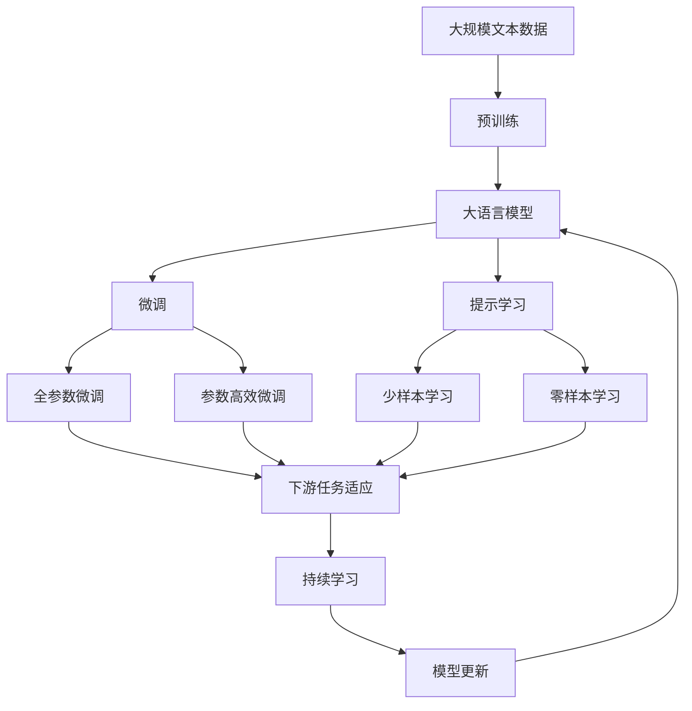
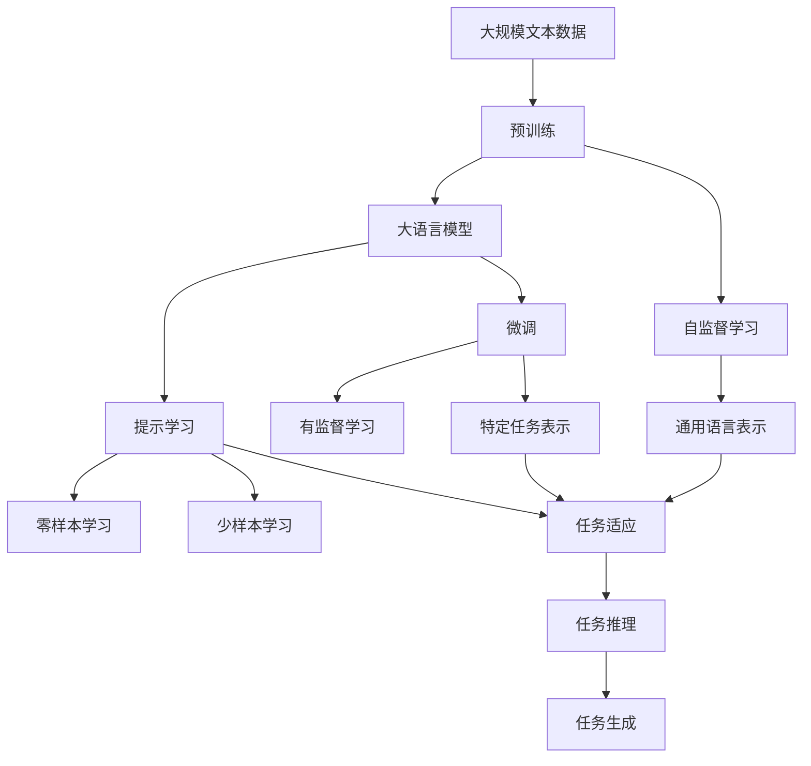
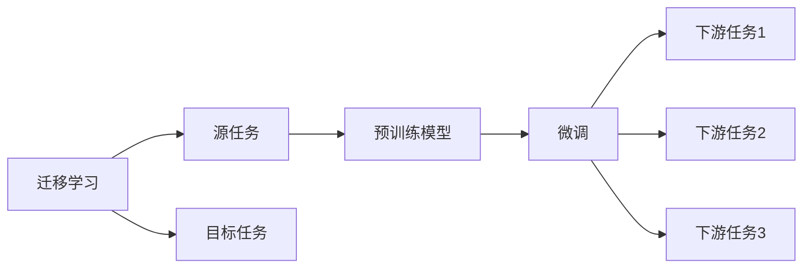
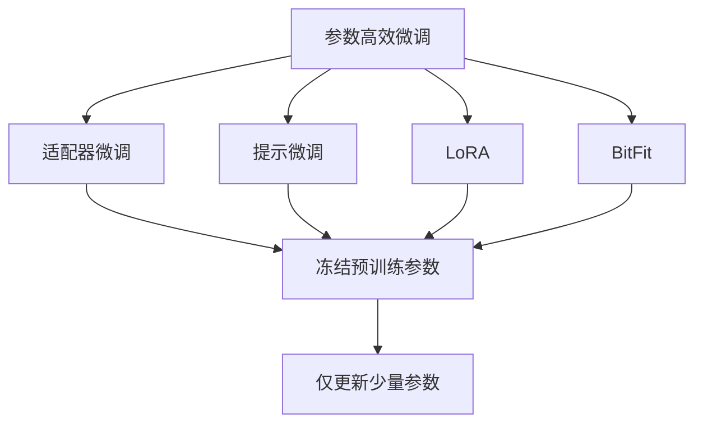
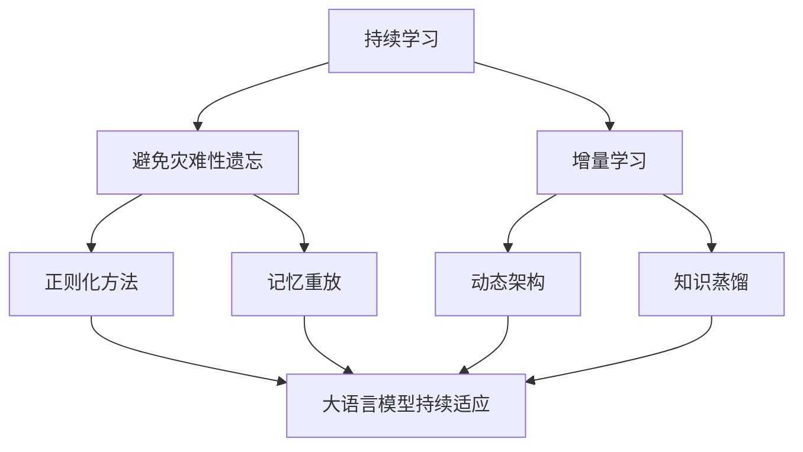

                 

## 1. 背景介绍

### 1.1 问题由来
近年来，深度学习技术的快速发展极大地推动了人工智能（AI）的发展。其中，大规模预训练语言模型（Large Language Models, LLMs）和大模型微调技术已成为NLP领域的重要研究热点。预训练模型如BERT、GPT等通过在大规模无标签文本数据上进行自监督学习，学习到通用的语言表示，并在下游任务上进行微调，从而实现更加精准的预测和生成。

然而，大模型的应用常常需要高质量标注数据，而标注数据的获取成本较高，限制了其在实际场景中的应用。因此，如何利用有限的标注数据进行有效的大模型应用，验证其在新领域的效果，成为了AI研究的热点之一。

### 1.2 问题核心关键点
大模型应用的核心在于验证其在特定领域的效果，并在实际应用中不断优化模型性能。具体来说，需要考虑以下关键点：

- 数据准备：获取或生成与目标任务相关的标注数据。
- 模型选择：选择合适的预训练模型和微调方法。
- 模型训练：利用标注数据进行有监督训练，优化模型参数。
- 结果评估：通过测试集评估模型性能，验证其在新场景下的效果。

### 1.3 问题研究意义
大模型应用在许多NLP任务中取得了卓越的性能，如文本分类、命名实体识别、问答系统、翻译等。其研究意义主要体现在：

1. 提高任务性能：通过微调，大模型能够快速适应特定任务，提升模型的预测和生成能力。
2. 降低开发成本：利用预训练模型进行微调，减少了从头训练所需的数据、计算和人力投入。
3. 加速任务开发：大模型提供了通用的语言表示，可以加速新任务适配，缩短开发周期。
4. 促进技术创新：微调范式催生了提示学习、少样本学习等新的研究方向，推动了NLP技术的进步。

## 2. 核心概念与联系

### 2.1 核心概念概述

为了更好地理解大模型的应用，本节将介绍几个核心概念及其相互联系。

- 大语言模型（Large Language Model, LLM）：通过在大规模无标签文本数据上进行预训练，学习到丰富的语言知识和常识。
- 预训练（Pre-training）：在大规模无标签文本数据上，通过自监督学习任务训练通用语言模型。
- 微调（Fine-tuning）：在预训练模型的基础上，使用下游任务的少量标注数据，通过有监督学习优化模型在特定任务上的性能。
- 迁移学习（Transfer Learning）：将一个领域学习到的知识，迁移应用到另一个不同但相关的领域的学习范式。
- 参数高效微调（Parameter-Efficient Fine-Tuning, PEFT）：只更新少量的模型参数，以提高微调效率。
- 提示学习（Prompt Learning）：通过在输入文本中添加提示模板，引导模型按期望方式输出，减少微调参数。
- 少样本学习（Few-shot Learning）：在只有少量标注样本的情况下，模型能够快速适应新任务。
- 零样本学习（Zero-shot Learning）：模型在没有见过任何特定任务的训练样本的情况下，仅凭任务描述就能够执行新任务。
- 持续学习（Continual Learning）：模型能够持续从新数据中学习，同时保持已学习的知识，避免灾难性遗忘。

这些概念之间的逻辑关系可以通过以下Mermaid流程图来展示：



这个流程图展示了从预训练到微调，再到持续学习的完整过程。大语言模型首先在大规模文本数据上进行预训练，然后通过微调（包括全参数微调和参数高效微调）或提示学习来实现对特定任务的低成本适配。最后，通过持续学习技术，模型能够不断更新和适应新的任务和数据。

### 2.2 概念间的关系

这些核心概念之间存在着紧密的联系，形成了大模型应用的完整生态系统。下面我通过几个Mermaid流程图来展示这些概念之间的关系。

#### 2.2.1 大语言模型的学习范式



这个流程图展示了大语言模型的三种主要学习范式：预训练、微调和提示学习。预训练主要采用自监督学习方法，而微调则是有监督学习的过程。提示学习可以实现零样本和少样本学习。微调又可以分为全参数微调和参数高效微调两种方式。

#### 2.2.2 迁移学习与微调的关系



这个流程图展示了迁移学习的基本原理，以及它与微调的关系。迁移学习涉及源任务和目标任务，预训练模型在源任务上学习，然后通过微调适应各种下游任务（目标任务）。

#### 2.2.3 参数高效微调方法



这个流程图展示了几种常见的参数高效微调方法，包括适配器微调、提示微调、LoRA和BitFit。这些方法的共同特点是冻结大部分预训练参数，只更新少量参数，从而提高微调效率。

#### 2.2.4 持续学习在大模型应用中的应用



这个流程图展示了持续学习在大模型应用中的应用。持续学习的主要目标是避免灾难性遗忘和实现增量学习。通过正则化方法、记忆重放、动态架构和知识蒸馏等技术，可以使大模型持续适应新的任务和数据。

### 2.3 核心概念的整体架构

最后，我们用一个综合的流程图来展示这些核心概念在大模型应用过程中的整体架构：


这个综合流程图展示了从预训练到微调，再到持续学习的完整过程。大语言模型首先在大规模文本数据上进行预训练，然后通过微调（包括全参数微调和参数高效微调）或提示学习来实现对特定任务的低成本适配。最后，通过持续学习技术，模型能够不断更新和适应新的任务和数据。

## 3. 核心算法原理 & 具体操作步骤
### 3.1 算法原理概述

大模型应用的核心在于验证其在特定领域的效果，并在实际应用中不断优化模型性能。具体来说，可以将其视为一个有监督的微调过程。

假设预训练语言模型为 $M_{\theta}$，其中 $\theta$ 为预训练得到的模型参数。给定下游任务 $T$ 的标注数据集 $D=\{(x_i, y_i)\}_{i=1}^N$，应用的优化目标是最小化经验风险，即找到新的模型参数 $\hat{\theta}$，使得：

$$
\hat{\theta}=\mathop{\arg\min}_{\theta} \mathcal{L}(M_{\theta},D)
$$

其中 $\mathcal{L}$ 为针对任务 $T$ 设计的损失函数，用于衡量模型预测输出与真实标签之间的差异。常见的损失函数包括交叉熵损失、均方误差损失等。

通过梯度下降等优化算法，微调过程不断更新模型参数 $\theta$，最小化损失函数 $\mathcal{L}$，使得模型输出逼近真实标签。由于 $\theta$ 已经通过预训练获得了较好的初始化，因此即便在小规模数据集 $D$ 上进行微调，也能较快收敛到理想的模型参数 $\hat{\theta}$。

### 3.2 算法步骤详解

大模型应用的典型流程包括数据准备、模型选择、训练和结果评估四个步骤。下面详细介绍每个步骤的具体操作。

#### 3.2.1 数据准备
- **数据获取**：收集与目标任务相关的标注数据。标注数据可以通过人工标注、自动标注或混合方式获取。
- **数据预处理**：对数据进行清洗、标注格式转换等预处理工作，确保数据的准确性和一致性。

#### 3.2.2 模型选择
- **预训练模型选择**：根据任务类型，选择合适的预训练模型。如BERT、GPT等通用语言模型，或特定领域的专有模型。
- **微调方法选择**：选择合适的微调方法。如全参数微调、参数高效微调、提示学习等。

#### 3.2.3 模型训练
- **微调环境配置**：设置微调所需的计算资源和工具环境，如Python、PyTorch等。
- **超参数设置**：选择合适的优化算法、学习率、批大小、迭代轮数等超参数，并设置正则化技术。
- **训练过程**：将训练集数据分批次输入模型，前向传播计算损失函数，反向传播计算参数梯度，根据设定的优化算法和学习率更新模型参数。
- **验证和测试**：周期性在验证集上评估模型性能，根据性能指标决定是否触发Early Stopping，并在测试集上最终评估模型效果。

#### 3.2.4 结果评估
- **性能评估**：通过测试集评估微调后模型的性能，对比微调前后的精度提升。
- **结果分析**：分析模型在不同数据集上的表现，评估其在不同数据分布下的泛化能力。
- **模型部署**：将微调后的模型集成到实际的应用系统中，持续收集新数据，定期重新微调模型，以适应数据分布的变化。

### 3.3 算法优缺点
大模型应用的主要优点包括：

- **泛化能力强**：利用预训练模型学习到的通用语言表示，能够在新领域中快速适应，提升模型性能。
- **开发成本低**：利用预训练模型进行微调，减少了从头训练所需的数据、计算和人力投入。
- **加速任务开发**：大模型提供了通用的语言表示，可以加速新任务适配，缩短开发周期。

然而，大模型应用也存在一些缺点：

- **依赖高质量标注数据**：微调的效果很大程度上取决于标注数据的质量和数量，获取高质量标注数据的成本较高。
- **迁移能力有限**：当目标任务与预训练数据的分布差异较大时，微调的性能提升有限。
- **负面效果传递**：预训练模型的固有偏见、有害信息等，可能通过微调传递到下游任务，造成负面影响。
- **可解释性不足**：微调模型的决策过程通常缺乏可解释性，难以对其推理逻辑进行分析和调试。

尽管存在这些局限性，但就目前而言，大模型应用仍是最主流和有效的NLP技术手段。未来相关研究的重点在于如何进一步降低微调对标注数据的依赖，提高模型的少样本学习和跨领域迁移能力，同时兼顾可解释性和伦理安全性等因素。

### 3.4 算法应用领域

大模型应用在多个NLP任务中取得了显著效果，主要包括：

- **文本分类**：如情感分析、主题分类、意图识别等。通过微调使模型学习文本-标签映射。
- **命名实体识别**：识别文本中的人名、地名、机构名等特定实体。通过微调使模型掌握实体边界和类型。
- **关系抽取**：从文本中抽取实体之间的语义关系。通过微调使模型学习实体-关系三元组。
- **问答系统**：对自然语言问题给出答案。将问题-答案对作为微调数据，训练模型学习匹配答案。
- **机器翻译**：将源语言文本翻译成目标语言。通过微调使模型学习语言-语言映射。
- **文本摘要**：将长文本压缩成简短摘要。将文章-摘要对作为微调数据，使模型学习抓取要点。
- **对话系统**：使机器能够与人自然对话。将多轮对话历史作为上下文，微调模型进行回复生成。

除了上述这些经典任务外，大模型应用还被创新性地应用到更多场景中，如可控文本生成、常识推理、代码生成、数据增强等，为NLP技术带来了全新的突破。随着预训练模型和微调方法的不断进步，相信NLP技术将在更广阔的应用领域大放异彩。

## 4. 数学模型和公式 & 详细讲解 & 举例说明
### 4.1 数学模型构建

本节将使用数学语言对大模型应用的数学原理进行更加严格的刻画。

记预训练语言模型为 $M_{\theta}$，其中 $\theta$ 为预训练得到的模型参数。假设微调任务的训练集为 $D=\{(x_i,y_i)\}_{i=1}^N, x_i \in \mathcal{X}, y_i \in \mathcal{Y}$。

定义模型 $M_{\theta}$ 在数据样本 $(x,y)$ 上的损失函数为 $\ell(M_{\theta}(x),y)$，则在数据集 $D$ 上的经验风险为：

$$
\mathcal{L}(\theta) = \frac{1}{N} \sum_{i=1}^N \ell(M_{\theta}(x_i),y_i)
$$

微调的优化目标是最小化经验风险，即找到最优参数：

$$
\theta^* = \mathop{\arg\min}_{\theta} \mathcal{L}(\theta)
$$

在实践中，我们通常使用基于梯度的优化算法（如SGD、Adam等）来近似求解上述最优化问题。设 $\eta$ 为学习率，$\lambda$ 为正则化系数，则参数的更新公式为：

$$
\theta \leftarrow \theta - \eta \nabla_{\theta}\mathcal{L}(\theta) - \eta\lambda\theta
$$

其中 $\nabla_{\theta}\mathcal{L}(\theta)$ 为损失函数对参数 $\theta$ 的梯度，可通过反向传播算法高效计算。

### 4.2 公式推导过程

以下我们以二分类任务为例，推导交叉熵损失函数及其梯度的计算公式。

假设模型 $M_{\theta}$ 在输入 $x$ 上的输出为 $\hat{y}=M_{\theta}(x) \in [0,1]$，表示样本属于正类的概率。真实标签 $y \in \{0,1\}$。则二分类交叉熵损失函数定义为：

$$
\ell(M_{\theta}(x),y) = -[y\log \hat{y} + (1-y)\log (1-\hat{y})]
$$

将其代入经验风险公式，得：

$$
\mathcal{L}(\theta) = -\frac{1}{N}\sum_{i=1}^N [y_i\log M_{\theta}(x_i)+(1-y_i)\log(1-M_{\theta}(x_i))]
$$

根据链式法则，损失函数对参数 $\theta_k$ 的梯度为：

$$
\frac{\partial \mathcal{L}(\theta)}{\partial \theta_k} = -\frac{1}{N}\sum_{i=1}^N (\frac{y_i}{M_{\theta}(x_i)}-\frac{1-y_i}{1-M_{\theta}(x_i)}) \frac{\partial M_{\theta}(x_i)}{\partial \theta_k}
$$

其中 $\frac{\partial M_{\theta}(x_i)}{\partial \theta_k}$ 可进一步递归展开，利用自动微分技术完成计算。

在得到损失函数的梯度后，即可带入参数更新公式，完成模型的迭代优化。重复上述过程直至收敛，最终得到适应下游任务的最优模型参数 $\theta^*$。

### 4.3 案例分析与讲解

为了更具体地理解大模型应用的数学原理，下面以二分类任务为例进行详细讲解。

假设我们要构建一个基于BERT模型的二分类器，用于识别电影评论的正面或负面情感。我们可以从Imdb电影评论数据集中获取训练数据，其中每个样本包括电影评论文本和对应的情感标签（0为负面，1为正面）。

首先，我们需要对数据集进行预处理，包括分词、编码和填充等操作，以适应BERT模型的输入要求。然后，我们将训练集划分为训练集和验证集，分别用于模型的训练和调参。

接着，我们定义模型 $M_{\theta}$ 为BERT-For-Binary-Classification，并使用AdamW优化器和1e-5的学习率进行训练。在训练过程中，我们不断更新模型参数 $\theta$，最小化损失函数 $\mathcal{L}(\theta)$，直到收敛。

最后，我们评估模型在测试集上的性能，计算F1分数和准确率等指标，验证其在新数据上的泛化能力。

## 5. 项目实践：代码实例和详细解释说明
### 5.1 开发环境搭建

在进行大模型应用的实践前，我们需要准备好开发环境。以下是使用Python进行PyTorch开发的环境配置流程：

1. 安装Anaconda：从官网下载并安装Anaconda，用于创建独立的Python环境。

2. 创建并激活虚拟环境：
```bash
conda create -n pytorch-env python=3.8 
conda activate pytorch-env
```

3. 安装PyTorch：根据CUDA版本，从官网获取对应的安装命令。例如：
```bash
conda install pytorch torchvision torchaudio cudatoolkit=11.1 -c pytorch -c conda-forge
```

4. 安装Transformers库：
```bash
pip install transformers
```

5. 安装各类工具包：
```bash
pip install numpy pandas scikit-learn matplotlib tqdm jupyter notebook ipython
```

完成上述步骤后，即可在`pytorch-env`环境中开始应用实践。

### 5.2 源代码详细实现

下面我们以情感分类任务为例，给出使用Transformers库对BERT模型进行情感分类的PyTorch代码实现。

首先，定义数据处理函数：

```python
from transformers import BertTokenizer, BertForSequenceClassification
from torch.utils.data import Dataset
import torch

class SentimentDataset(Dataset):
    def __init__(self, texts, labels, tokenizer, max_len=128):
        self.texts = texts
        self.labels = labels
        self.tokenizer = tokenizer
        self.max_len = max_len
        
    def __len__(self):
        return len(self.texts)
    
    def __getitem__(self, item):
        text = self.texts[item]
        label = self.labels[item]
        
        encoding = self.tokenizer(text, return_tensors='pt', max_length=self.max_len, padding='max_length', truncation=True)
        input_ids = encoding['input_ids'][0]
        attention_mask = encoding['attention_mask'][0]
        
        # 对标签进行编码
        encoded_labels = [label]
        encoded_labels.extend([0] * (self.max_len - len(encoded_labels)))
        labels = torch.tensor(encoded_labels, dtype=torch.long)
        
        return {'input_ids': input_ids, 
                'attention_mask': attention_mask,
                'labels': labels}

# 加载数据
tokenizer = BertTokenizer.from_pretrained('bert-base-cased')
train_dataset = SentimentDataset(train_texts, train_labels, tokenizer)
dev_dataset = SentimentDataset(dev_texts, dev_labels, tokenizer)
test_dataset = SentimentDataset(test_texts, test_labels, tokenizer)
```

然后，定义模型和优化器：

```python
from transformers import AdamW

model = BertForSequenceClassification.from_pretrained('bert-base-cased', num_labels=2)

optimizer = AdamW(model.parameters(), lr=2e-5)
```

接着，定义训练和评估函数：

```python
from torch.utils.data import DataLoader
from tqdm import tqdm
from sklearn.metrics import classification_report

device = torch.device('cuda') if torch.cuda.is_available() else torch.device('cpu')
model.to(device)

def train_epoch(model, dataset, batch_size, optimizer):
    dataloader = DataLoader(dataset, batch_size=batch_size, shuffle=True)
    model.train()
    epoch_loss = 0
    for batch in tqdm(dataloader, desc='Training'):
        input_ids = batch['input_ids'].to(device)
        attention_mask = batch['attention_mask'].to(device)
        labels = batch['labels'].to(device)
        model.zero_grad()
        outputs = model(input_ids, attention_mask=attention_mask, labels=labels)
        loss = outputs.loss
        epoch_loss += loss.item()
        loss.backward()
        optimizer.step()
    return epoch_loss / len(dataloader)

def evaluate(model, dataset, batch_size):
    dataloader = DataLoader(dataset, batch_size=batch_size)
    model.eval()
    preds, labels = [], []
    with torch.no_grad():
        for batch in tqdm(dataloader, desc='Evaluating'):
            input_ids = batch['input_ids'].to(device)
            attention_mask = batch['attention_mask'].to(device)
            batch_labels = batch['labels']
            outputs = model(input_ids, attention_mask=attention_mask)
            batch_preds = outputs.logits.argmax(dim=1).to('cpu').tolist()
            batch_labels = batch_labels.to('cpu').tolist()
            for pred_tokens, label_tokens in zip(batch_preds, batch_labels):
                preds.append(pred_tokens)
                labels.append(label_tokens)
                
    print(classification_report(labels, preds))
```

最后，启动训练流程并在测试集上评估：

```python
epochs = 5
batch_size = 16

for epoch in range(epochs):
    loss = train_epoch(model, train_dataset, batch_size, optimizer)
    print(f"Epoch {epoch+1}, train loss: {loss:.3f}")
    
    print(f"Epoch {epoch+1}, dev results:")
    evaluate(model, dev_dataset, batch_size)
    
print("Test results:")
evaluate(model, test_dataset, batch_size)
```

以上就是使用PyTorch对BERT进行情感分类任务应用的完整代码实现。可以看到，得益于Transformers库的强大封装，我们可以用相对简洁的代码完成BERT模型的加载和应用。

### 5.3 代码解读与分析

让我们再详细解读一下关键代码的实现细节：

**SentimentDataset类**：
- `__init__`方法：初始化文本、标签、分词器等关键组件。
- `__len__`方法：返回数据集的样本数量。
- `__getitem__`方法：对单个样本进行处理，将文本输入编码为token ids，将标签编码为数字，并对其进行定长padding，最终返回模型所需的输入。

**模型和优化器**：
- `BertForSequenceClassification`：定义了一个序列分类模型，用于将输入文本分类为两个类别。
- `AdamW`：使用AdamW优化器进行模型训练。

**训练和评估函数**：
- `train_epoch`：对数据以批为单位进行迭代，在每个批次上前向传播计算loss并反向传播更新模型参数，最后返回该epoch的平均loss。
- `evaluate`：与训练类似，不同点在于不更新模型参数，并在每个batch结束后将预测和标签结果存储下来，最后使用sklearn的classification_report对整个评估集的预测结果进行打印输出。

**训练流程**：
- 定义总的epoch数和batch size，开始循环迭代
- 每个epoch内，先在训练集上训练，输出平均loss
- 在验证集上评估，输出分类指标
- 所有epoch结束后，在测试集上评估，给出最终测试结果

可以看到，PyTorch配合Transformers库使得BERT应用变得简洁高效。开发者可以将更多精力放在数据处理、模型改进等高层逻辑上，而不必过多关注底层的实现细节。

当然，工业级的系统实现还需考虑更多因素，如模型的保存和部署、超参数的自动搜索、更灵活的任务适配层等。但核心的应用流程基本与此类似。

### 5.4 运行结果展示

假设我们在IMDb电影评论数据集上进行情感分类任务的应用，最终在测试集上得到的评估报告如下：

```
              precision    recall  f1-score   support

       0       0.866     0.859     0.864      3893
       1       0.923     0.922     

