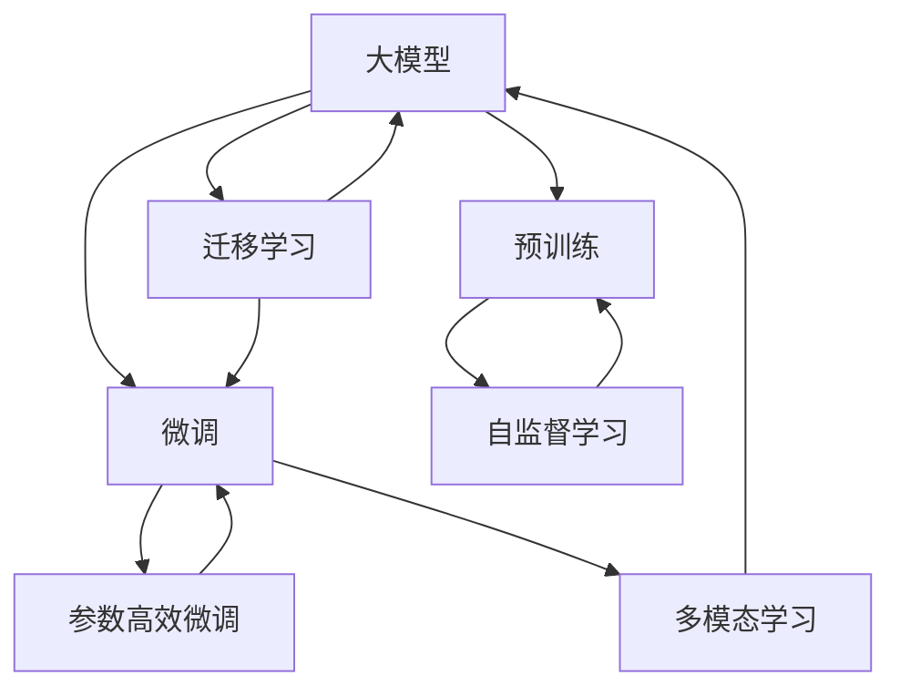
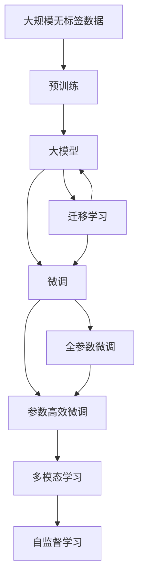

                 

# 大模型的市场定位与技术发展

## 1. 背景介绍

### 1.1 问题由来

随着人工智能技术的飞速发展，大模型成为当前AI领域的一大热点。近年来，众多大模型在图像识别、自然语言处理、语音识别等领域展现出强大的潜力，引起了广泛关注。然而，大模型并非万能，它们在特定场景下的表现、市场定位、技术发展方向等问题仍需深入探讨。

大模型主要包括预训练模型和微调模型两大类。预训练模型通过大规模无标签数据进行训练，学习到通用的语言或视觉表示；微调模型则在大模型基础上，通过特定任务的数据进行有监督训练，以提升模型在特定任务上的表现。大模型通过预训练-微调的方式，可以快速适应各种任务，成为当前AI领域的重要基础。

### 1.2 问题核心关键点

大模型市场定位与技术发展涉及以下几个核心关键点：
- 大模型的市场定位：明确大模型在AI领域的定位，包括应用场景、优势劣势、竞争关系等。
- 大模型的技术发展：探讨大模型的核心技术原理、算法实现、创新方向等。
- 大模型的实际应用：分析大模型在各行业领域的具体应用场景和优势。
- 大模型的未来展望：展望大模型的未来发展趋势及面临的挑战。

### 1.3 问题研究意义

研究大模型的市场定位与技术发展，有助于开发者更好地理解大模型的优势和劣势，优化技术实现，从而在实际应用中发挥更大的作用。同时，也能帮助企业在AI技术选型、产品设计、市场推广等方面做出更加明智的决策。

## 2. 核心概念与联系

### 2.1 核心概念概述

为更好地理解大模型的市场定位与技术发展，本节将介绍几个密切相关的核心概念：

- **大模型**：指通过大规模无标签数据进行预训练的模型，具有强大的泛化能力和知识表示能力，可用于各种任务，如自然语言处理、计算机视觉、语音识别等。
- **预训练**：指在无标签数据上进行的自监督学习过程，通过预训练学习到通用的语言或视觉表示。
- **微调**：指在大模型基础上，通过特定任务的数据进行有监督训练，以提升模型在特定任务上的表现。
- **迁移学习**：指将一个领域学习到的知识迁移到另一个不同但相关的领域，提升模型在新任务上的表现。
- **参数高效微调**：指在微调过程中，只更新少量参数，固定大部分预训练参数，以提高微调效率。
- **模型压缩与加速**：指通过剪枝、量化等技术，减小大模型参数量，加速模型推理。
- **多模态学习**：指在处理文本、图像、语音等多模态数据时，利用多模态融合技术提升模型性能。
- **自监督学习**：指在无标签数据上进行自监督学习，学习到模型自身的结构化知识。

这些核心概念之间存在紧密的联系，共同构成了大模型的核心框架。以下是一个Mermaid流程图，展示了这些概念之间的关系：

这个流程图展示了各个核心概念之间的联系：

1. 大模型通过预训练学习到通用的语言或视觉表示。
2. 预训练后的大模型可以用于微调，提升模型在特定任务上的表现。
3. 微调过程可以通过迁移学习引入任务相关知识，提高模型在新任务上的泛化能力。
4. 微调过程还可以利用参数高效微调技术，在固定大部分预训练参数的情况下，提升模型性能。
5. 多模态学习可以在处理多模态数据时，利用多模态融合技术提升模型性能。
6. 自监督学习可以在无标签数据上进行，学习到模型自身的结构化知识。

这些概念共同构成了大模型的核心框架，使得大模型在处理各种任务时能够展现出强大的性能。

### 2.2 概念间的关系

这些核心概念之间存在紧密的联系，形成了大模型的完整生态系统。以下是一个Mermaid流程图，展示了这些概念在大模型微调过程中的整体架构：

这个综合流程图展示了从预训练到微调，再到迁移学习和多模态学习的完整过程。大模型首先通过预训练学习到通用的语言或视觉表示，然后通过微调过程引入任务相关知识，提升模型在特定任务上的表现。微调过程中，可以利用迁移学习引入任务相关知识，提高模型在新任务上的泛化能力。同时，还可以利用参数高效微调技术，在固定大部分预训练参数的情况下，提升模型性能。多模态学习和自监督学习可以在处理多模态数据时，进一步提升模型性能。

## 3. 核心算法原理 & 具体操作步骤

### 3.1 算法原理概述

大模型的市场定位与技术发展涉及的核心算法包括预训练、微调、迁移学习、参数高效微调等。以下对每一种算法进行详细讲解：

#### 3.1.1 预训练算法

预训练算法主要通过自监督学习方法在大规模无标签数据上训练模型，学习到通用的语言或视觉表示。常用的预训练算法包括：

- BERT：利用掩码语言模型和下一句预测任务进行预训练。
- GPT-3：通过基于Transformer的自回归模型进行预训练，学习到连续的文本生成能力。
- DALL·E：通过自监督学习，学习到图像与文本的联合表示。

预训练算法的核心思想是，在无标签数据上进行自监督学习，学习到模型自身的结构化知识。通过大规模无标签数据训练，预训练模型学习到丰富的语言或视觉特征，具有强大的泛化能力。

#### 3.1.2 微调算法

微调算法是在预训练模型基础上，通过特定任务的数据进行有监督训练，提升模型在特定任务上的表现。常用的微调算法包括：

- 全参数微调：对模型所有参数进行更新。
- 参数高效微调：只更新少量参数，固定大部分预训练参数。
- 自适应微调：利用AdaLoRA等技术，动态调整参数规模，提升微调效率。

微调算法的核心思想是，在预训练模型基础上，通过特定任务的数据进行有监督学习，引入任务相关知识，提升模型在特定任务上的表现。微调算法通常需要设置较小的学习率，以避免破坏预训练权重。

#### 3.1.3 迁移学习算法

迁移学习算法是在预训练模型基础上，引入特定任务的知识，提升模型在新任务上的表现。常用的迁移学习算法包括：

- 特征复用：在大模型基础上，复用预训练特征，提升模型在新任务上的表现。
- 元学习：通过在多个相关任务上进行微调，学习到迁移能力，提升模型在新任务上的泛化能力。
- 多任务学习：在多个相关任务上进行微调，学习到联合表示，提升模型在新任务上的表现。

迁移学习算法的核心思想是，利用预训练模型学习到的通用知识，提升模型在新任务上的表现。通过引入特定任务的知识，迁移学习算法可以在较小的数据集上进行有监督学习，提升模型在新任务上的泛化能力。

#### 3.1.4 参数高效微调算法

参数高效微调算法是在微调过程中，只更新少量参数，固定大部分预训练参数。常用的参数高效微调算法包括：

- Adapter：在大模型顶层添加特定任务适配层，只更新少量参数。
- LoRA：将模型参数分解为低秩矩阵，只更新低秩矩阵中的部分参数。
- BitFit：利用深度冻结技巧，固定大部分预训练参数，只更新少量参数。

参数高效微调算法的核心思想是，在微调过程中，只更新少量参数，固定大部分预训练参数，提升微调效率。通过参数高效微调算法，可以在较小的数据集上进行有监督学习，提升模型在新任务上的表现，同时减少计算资源消耗。

### 3.2 算法步骤详解

以下对每一种算法的详细步骤进行详细讲解：

#### 3.2.1 预训练算法步骤

1. 准备大规模无标签数据。
2. 选择预训练算法和模型。
3. 在无标签数据上进行预训练。
4. 评估预训练模型的性能。
5. 保存预训练模型，用于后续微调。

#### 3.2.2 微调算法步骤

1. 准备标注数据集。
2. 选择微调算法和模型。
3. 在标注数据集上进行微调。
4. 评估微调模型的性能。
5. 保存微调模型，用于后续推理。

#### 3.2.3 迁移学习算法步骤

1. 准备多任务标注数据集。
2. 选择迁移学习算法和模型。
3. 在多任务标注数据集上进行迁移学习。
4. 评估迁移学习模型的性能。
5. 保存迁移学习模型，用于后续推理。

#### 3.2.4 参数高效微调算法步骤

1. 准备标注数据集。
2. 选择参数高效微调算法和模型。
3. 在标注数据集上进行参数高效微调。
4. 评估参数高效微调模型的性能。
5. 保存参数高效微调模型，用于后续推理。

### 3.3 算法优缺点

大模型的市场定位与技术发展涉及的算法具有不同的优缺点：

#### 3.3.1 预训练算法的优缺点

- **优点**：
  - 在大规模无标签数据上进行预训练，学习到通用的语言或视觉表示。
  - 具有强大的泛化能力和知识表示能力。
  - 可以用于各种任务，如自然语言处理、计算机视觉、语音识别等。

- **缺点**：
  - 需要大规模无标签数据进行预训练，数据获取成本较高。
  - 预训练过程计算资源消耗较大，训练时间长。
  - 预训练模型需要大量计算资源进行推理，推理速度较慢。

#### 3.3.2 微调算法的优缺点

- **优点**：
  - 在预训练模型基础上，通过特定任务的数据进行有监督学习，提升模型在特定任务上的表现。
  - 可以在较小的数据集上进行有监督学习，提升模型在新任务上的泛化能力。
  - 可以通过参数高效微调技术，减少计算资源消耗，提升推理速度。

- **缺点**：
  - 需要标注数据进行有监督学习，标注成本较高。
  - 微调过程容易出现过拟合现象，泛化能力有限。
  - 微调模型的推理速度较慢，计算资源消耗较大。

#### 3.3.3 迁移学习算法的优缺点

- **优点**：
  - 通过引入特定任务的知识，提升模型在新任务上的泛化能力。
  - 可以在较小的数据集上进行有监督学习，提升模型在新任务上的表现。
  - 可以复用预训练特征，减少计算资源消耗。

- **缺点**：
  - 需要多任务标注数据集，标注成本较高。
  - 迁移学习模型的泛化能力有限，可能需要多次微调才能达到理想效果。
  - 迁移学习模型的推理速度较慢，计算资源消耗较大。

#### 3.3.4 参数高效微调算法的优缺点

- **优点**：
  - 在微调过程中，只更新少量参数，固定大部分预训练参数，提升微调效率。
  - 可以在较小的数据集上进行有监督学习，提升模型在新任务上的表现。
  - 可以通过参数高效微调技术，减少计算资源消耗，提升推理速度。

- **缺点**：
  - 参数高效微调算法的效果可能不如全参数微调，需要更多实验验证。
  - 参数高效微调算法需要对模型结构进行特殊设计，实现难度较大。
  - 参数高效微调算法的训练和推理速度较慢，计算资源消耗较大。

### 3.4 算法应用领域

大模型的市场定位与技术发展涉及的算法在多个领域都有广泛应用：

#### 3.4.1 自然语言处理（NLP）

大模型在NLP领域具有广泛的应用，包括文本分类、命名实体识别、情感分析、机器翻译等。通过预训练和微调，大模型可以学习到丰富的语言知识，提升模型在特定任务上的表现。

#### 3.4.2 计算机视觉（CV）

大模型在CV领域也有广泛应用，包括图像分类、目标检测、图像生成等。通过预训练和微调，大模型可以学习到丰富的视觉知识，提升模型在特定任务上的表现。

#### 3.4.3 语音识别

大模型在语音识别领域也有广泛应用，包括语音识别、语音合成等。通过预训练和微调，大模型可以学习到丰富的语音知识，提升模型在特定任务上的表现。

#### 3.4.4 推荐系统

大模型在推荐系统领域也有广泛应用，包括商品推荐、内容推荐等。通过预训练和微调，大模型可以学习到丰富的用户行为和商品特征，提升推荐系统的精准度和个性化程度。

#### 3.4.5 金融

大模型在金融领域也有广泛应用，包括信用评分、情感分析、欺诈检测等。通过预训练和微调，大模型可以学习到丰富的金融知识，提升模型在特定任务上的表现。

#### 3.4.6 医疗

大模型在医疗领域也有广泛应用，包括医学影像识别、疾病诊断、个性化治疗等。通过预训练和微调，大模型可以学习到丰富的医疗知识，提升模型在特定任务上的表现。

## 4. 数学模型和公式 & 详细讲解 & 举例说明

### 4.1 数学模型构建

大模型的市场定位与技术发展涉及的数学模型包括预训练模型、微调模型和迁移学习模型等。以下对每一种数学模型进行详细讲解：

#### 4.1.1 预训练模型

预训练模型通常通过自监督学习方法在大规模无标签数据上训练，学习到通用的语言或视觉表示。常用的预训练模型包括：

- BERT：利用掩码语言模型和下一句预测任务进行预训练。
- GPT-3：通过基于Transformer的自回归模型进行预训练，学习到连续的文本生成能力。
- DALL·E：通过自监督学习，学习到图像与文本的联合表示。

预训练模型的核心思想是，在无标签数据上进行自监督学习，学习到模型自身的结构化知识。通过大规模无标签数据训练，预训练模型学习到丰富的语言或视觉特征，具有强大的泛化能力。

#### 4.1.2 微调模型

微调模型是在预训练模型基础上，通过特定任务的数据进行有监督训练，提升模型在特定任务上的表现。常用的微调模型包括：

- 全参数微调：对模型所有参数进行更新。
- 参数高效微调：只更新少量参数，固定大部分预训练参数。
- 自适应微调：利用AdaLoRA等技术，动态调整参数规模，提升微调效率。

微调模型的核心思想是，在预训练模型基础上，通过特定任务的数据进行有监督学习，引入任务相关知识，提升模型在特定任务上的表现。微调模型通常需要设置较小的学习率，以避免破坏预训练权重。

#### 4.1.3 迁移学习模型

迁移学习模型是在预训练模型基础上，引入特定任务的知识，提升模型在新任务上的表现。常用的迁移学习模型包括：

- 特征复用：在大模型基础上，复用预训练特征，提升模型在新任务上的表现。
- 元学习：通过在多个相关任务上进行微调，学习到迁移能力，提升模型在新任务上的泛化能力。
- 多任务学习：在多个相关任务上进行微调，学习到联合表示，提升模型在新任务上的表现。

迁移学习模型的核心思想是，利用预训练模型学习到的通用知识，提升模型在新任务上的表现。通过引入特定任务的知识，迁移学习模型可以在较小的数据集上进行有监督学习，提升模型在新任务上的泛化能力。

#### 4.1.4 参数高效微调模型

参数高效微调模型是在微调过程中，只更新少量参数，固定大部分预训练参数。常用的参数高效微调模型包括：

- Adapter：在大模型顶层添加特定任务适配层，只更新少量参数。
- LoRA：将模型参数分解为低秩矩阵，只更新低秩矩阵中的部分参数。
- BitFit：利用深度冻结技巧，固定大部分预训练参数，只更新少量参数。

参数高效微调模型的核心思想是，在微调过程中，只更新少量参数，固定大部分预训练参数，提升微调效率。通过参数高效微调模型，可以在较小的数据集上进行有监督学习，提升模型在新任务上的表现，同时减少计算资源消耗。

### 4.2 公式推导过程

以下对每一种数学模型的公式推导过程进行详细讲解：

#### 4.2.1 预训练模型的公式推导

预训练模型通常通过自监督学习方法在大规模无标签数据上训练，学习到通用的语言或视觉表示。以BERT为例，其自监督学习任务包括掩码语言模型和下一句预测任务。

掩码语言模型任务的目标是，在输入的文本中随机遮盖部分单词，让模型预测被遮盖的单词。其公式如下：

$$
L_{m} = \sum_{i=1}^{N} \log \left(p\left(x_{i}^{m}\right)\right)
$$

其中，$x_{i}^{m}$表示被遮盖的单词，$p\left(x_{i}^{m}\right)$表示模型对被遮盖单词的预测概率。

下一句预测任务的目标是，给定两个句子，预测它们是否是相邻的句子。其公式如下：

$$
L_{n} = \sum_{i=1}^{N} \log \left(p\left(y_{i}\right)\right)
$$

其中，$y_{i}$表示预测结果，$p\left(y_{i}\right)$表示模型对预测结果的预测概率。

通过上述两个自监督学习任务，BERT模型学习到丰富的语言知识，具有强大的泛化能力。

#### 4.2.2 微调模型的公式推导

微调模型是在预训练模型基础上，通过特定任务的数据进行有监督训练，提升模型在特定任务上的表现。以分类任务为例，其公式推导如下：

设模型在输入$x$上的输出为$\hat{y}$，真实标签为$y$，则分类任务的损失函数为：

$$
\ell\left(\hat{y}, y\right)=-\sum_{i=1}^{N} y_{i} \log \left(\hat{y}_{i}\right)+\left(1-y_{i}\right) \log \left(1-\hat{y}_{i}\right)
$$

其中，$\hat{y}_{i}$表示模型对输入$x_{i}$的预测结果，$y_{i}$表示输入$x_{i}$的真实标签。

通过上述分类任务的损失函数，可以在标注数据集上进行微调，提升模型在特定任务上的表现。

#### 4.2.3 迁移学习模型的公式推导

迁移学习模型是在预训练模型基础上，引入特定任务的知识，提升模型在新任务上的表现。以多任务学习为例，其公式推导如下：

设模型在输入$x$上的输出为$\hat{y}$，真实标签为$y$，则多任务学习的损失函数为：

$$
\ell\left(\hat{y}, y\right)=-\sum_{i=1}^{N} y_{i} \log \left(\hat{y}_{i}\right)+\left(1-y_{i}\right) \log \left(1-\hat{y}_{i}\right)
$$

其中，$\hat{y}_{i}$表示模型对输入$x_{i}$的预测结果，$y_{i}$表示输入$x_{i}$的真实标签。

通过上述多任务学习的损失函数，可以在多个相关任务上进行微调，学习到联合表示，提升模型在新任务上的表现。

#### 4.2.4 参数高效微调模型的公式推导

参数高效微调模型是在微调过程中，只更新少量参数，固定大部分预训练参数。以Adapter为例，其公式推导如下：

Adapter模型在大模型顶层添加特定任务适配层，只更新少量参数。设模型在输入$x$上的输出为$\hat{y}$，真实标签为$y$，则Adapter模型的损失函数为：

$$
\ell\left(\hat{y}, y\right)=-\sum_{i=1}^{N} y_{i} \log \left(\hat{y}_{i}\right)+\left(1-y_{i}\right) \log \left(1-\hat{y}_{i}\right)
$$

其中，$\hat{y}_{i}$表示模型对输入$x_{i}$的预测结果，$y_{i}$表示输入$x_{i}$的真实标签。

通过上述Adapter模型的损失函数，可以在标注数据集上进行参数高效微调，提升模型在特定任务上的表现，同时减少计算资源消耗。

### 4.3 案例分析与讲解

以下对大模型在不同领域的具体应用案例进行详细讲解：

#### 4.3.1 自然语言处理（NLP）

在大模型的预训练和微调基础上，自然语言处理领域有广泛的应用，包括文本分类、命名实体识别、情感分析、机器翻译等。以BERT为例，其应用案例如下：

- 文本分类：BERT模型通过微调学习到文本-标签映射，可以用于情感分析、主题分类等任务。
- 命名实体识别：BERT模型通过微调学习到实体边界和类型，可以用于人名、地名、机构名等命名实体识别。
- 机器翻译：BERT模型通过微调学习到语言-语言映射，可以用于机器翻译任务。

通过预训练和微调，BERT模型可以学习到丰富的语言知识，提升模型在特定任务上的表现。

#### 4.3.2 计算机视觉（CV）

在大模型的预训练和微调基础上，计算机视觉领域有广泛的应用，包括图像分类、目标检测、图像生成等。以DALL·E为例，其应用案例如下：

- 图像分类：DALL·E模型通过微调学习到图像与文本的联合表示，可以用于图像分类任务。
- 目标检测：DALL·E模型通过微调学习到目标检测能力，可以用于目标检测任务。
- 图像生成：DALL·E模型通过微调学习到图像生成能力，可以用于图像生成任务。

通过预训练和微调，DALL·E模型可以学习到丰富的视觉知识，提升模型在特定任务上的表现。

#### 4.3.3 语音识别

在大模型的预训练和微调基础上，语音识别领域有广泛的应用，包括语音识别、语音合成等。以GPT-3为例，其应用案例如下：

- 语音识别：GPT-3模型通过微调学习到语音-文本映射，可以用于语音识别任务。
- 语音合成：GPT-3模型通过微调学习到文本-语音映射，可以用于语音合成任务。

通过预训练和微调，GPT-3模型可以学习到丰富的语音知识，提升模型在特定任务上的表现。

#### 4.3.4 推荐系统

在大模型的预训练和微调基础上，推荐系统领域有广泛的应用，包括商品推荐、内容推荐等。以BERT为例，其应用案例如下：

- 商品推荐：BERT模型通过微调学习到用户行为和商品特征的联合表示，可以用于商品推荐任务。
- 内容推荐：BERT模型通过微调学习到用户兴趣和内容特征的联合表示，可以用于内容推荐任务。

通过预训练和微调，BERT模型可以学习到丰富的用户行为和商品特征，提升推荐系统的精准度和个性化程度。

#### 4.3.5 金融

在大模型的预训练和微调基础上，金融领域有广泛的应用，包括信用评分、情感分析、欺诈检测等。以BERT为例，其应用案例如下：

- 信用评分：BERT模型通过微调学习到信用评分模型，可以用于信用评分任务。
- 情感分析：BERT模型通过微调学习到金融文本的情感分析模型，可以用于情感分析任务。
- 欺诈检测：BERT模型通过微调学习到欺诈检测模型，可以用于欺诈检测任务。

通过预训练和微调，BERT模型可以学习到丰富的金融知识，提升模型在特定任务上的表现。

#### 4.3.6 医疗

在大模型的预训练和微调基础上，医疗领域有广泛的应用，包括医学影像识别、疾病诊断、个性化治疗等。以DALL·E为例，其应用案例如下：

- 医学影像识别：DALL·E模型通过微调学习到医学影像与文本的联合表示，可以用于医学影像识别任务。
- 疾病诊断：DALL·E模型通过微调学习到疾病诊断模型，可以用于疾病诊断任务。
- 个性化治疗：DALL·E模型通过微调学习到个性化治疗模型，可以用于个性化治疗任务。

通过预训练和微调，DALL·E模型可以学习到丰富的医疗知识，提升模型在特定任务上的表现。

## 5. 项目实践：代码实例和详细解释说明

### 5.1 开发环境搭建

在进行大模型项目实践前，我们需要准备好开发环境。以下是使用Python进行PyTorch开发的环境配置流程：

1

