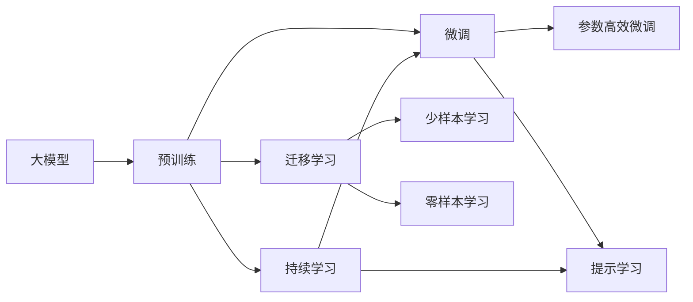

                 

# 大模型的市场推广与应用

> 关键词：大模型, 市场推广, 应用落地, 技术优化, 实际案例

## 1. 背景介绍

### 1.1 问题由来
近年来，人工智能(AI)技术在各行各业的应用日益广泛，尤其是在深度学习和自然语言处理(NLP)领域，大模型技术取得了令人瞩目的突破。大模型通过在大规模无标签数据上进行预训练，学习了丰富的知识，具备强大的泛化能力，可以在各种下游任务中取得优异表现。然而，尽管大模型在技术上取得了突破，但如何让这些技术成果真正落地应用，成为业界的共同挑战。

### 1.2 问题核心关键点
市场推广和大模型应用落地的核心关键点在于：
- **技术成熟度**：大模型是否已经达到足够的技术成熟度，能够在实际应用中稳定表现。
- **业务适配性**：大模型是否能够适应特定行业的业务需求，并提供有效的解决方案。
- **成本效益**：大模型的部署和使用是否经济可行，符合成本效益原则。
- **用户体验**：大模型的使用是否方便、直观，能够提升用户的使用体验。
- **法规合规性**：大模型的应用是否符合相关法律法规，避免潜在的法律风险。

### 1.3 问题研究意义
研究大模型的市场推广和应用落地问题，对于加速AI技术的商业化进程，推动各行业的数字化转型升级，具有重要意义：
- **降低应用门槛**：通过市场推广，降低AI技术的应用门槛，使更多企业能够快速采用AI技术。
- **提升生产力**：通过优化大模型应用，提升各行业的生产力和效率，创造更多商业价值。
- **促进创新**：市场推广可以带来更多的用户反馈，推动AI技术不断优化和创新。
- **推动产业升级**：AI技术的广泛应用，可以推动各行业进行产业升级，提升整体竞争力。

## 2. 核心概念与联系

### 2.1 核心概念概述

为更好地理解大模型的市场推广和应用落地，本节将介绍几个关键概念及其相互联系：

- **大模型(Large Model)**：通过在大规模数据集上训练的深度神经网络模型，具有强大的表达能力和泛化能力。例如，BERT、GPT-3、XLNet等模型。
- **预训练(Pre-training)**：在大规模无标签数据上训练模型，学习通用的语言或图像知识，为下游任务奠定基础。
- **微调(Fine-tuning)**：在预训练模型的基础上，通过有监督学习优化模型，适应特定的下游任务。
- **迁移学习(Transfer Learning)**：将一个领域学习到的知识迁移到另一个相关领域，减少新领域的学习成本。
- **参数高效微调(Parameter-Efficient Fine-tuning, PEFT)**：只更新少量模型参数，避免过拟合和资源浪费。
- **提示学习(Prompt Learning)**：通过精心设计输入文本的格式，引导模型按期望方式输出，减少微调参数。
- **少样本学习(Few-shot Learning)**：在只有少量标注样本的情况下，模型能够快速适应新任务。
- **零样本学习(Zero-shot Learning)**：模型在没有见过任何特定任务的数据的情况下，仅凭任务描述就能够执行新任务。
- **持续学习(Continual Learning)**：模型能够持续从新数据中学习，同时保持已学习的知识。

这些概念通过以下Mermaid流程图展示它们之间的联系：



这个流程图展示了从预训练到微调，再到持续学习的完整过程，以及大模型在不同学习范式下的应用。

### 2.2 概念间的关系

- **大模型与预训练**：大模型通过预训练学习到通用的语言或图像表示，为下游任务提供了基础能力。
- **预训练与微调**：预训练模型通过微调能够适应特定的下游任务，提升模型的任务性能。
- **微调与参数高效微调**：微调可以更新全部或部分模型参数，而参数高效微调则只更新少量参数，提高微调效率。
- **提示学习与微调**：提示学习通过输入模板引导模型输出，减少微调参数，提高模型在少样本和零样本情况下的适应性。
- **持续学习与微调**：持续学习使模型能够持续学习新知识，保持对新数据的适应性，进一步提升模型的任务性能。

这些概念共同构成了大模型在市场推广和应用落地过程中的核心技术框架。

## 3. 核心算法原理 & 具体操作步骤
### 3.1 算法原理概述

大模型的市场推广和应用落地，本质上是将大模型技术转化为实际应用的过程。这一过程涉及到技术的优化、业务适配、成本效益分析等多个方面。

大模型的市场推广和应用落地的核心算法原理可以概括为以下几个步骤：

1. **需求分析**：明确目标市场和用户需求，确定应用场景和目标任务。
2. **技术适配**：根据目标任务，选择合适的预训练模型和微调方法，进行参数调整和优化。
3. **模型部署**：将优化后的模型部署到目标环境中，如云平台、本地服务器等。
4. **应用集成**：将大模型集成到具体的业务流程中，进行功能和性能的全面测试。
5. **市场推广**：通过市场营销、用户培训、技术支持等方式，推广大模型的应用。

### 3.2 算法步骤详解

以下是详细的算法步骤：

**Step 1: 需求分析**
- 明确目标市场和用户需求，如电商推荐、智能客服、医疗诊断等。
- 确定应用场景和目标任务，如推荐系统、情感分析、图像识别等。
- 了解目标市场的技术水平和用户习惯，选择合适的预训练模型和微调方法。

**Step 2: 技术适配**
- 选择合适的预训练模型，如BERT、GPT、XLNet等，根据任务需求进行微调。
- 确定微调方法，如全参数微调、参数高效微调、提示学习等。
- 进行参数优化，调整学习率、正则化参数等，确保模型性能最优。

**Step 3: 模型部署**
- 选择适合的部署平台，如AWS、阿里云、华为云等。
- 在云平台上搭建服务器环境，安装和配置大模型。
- 进行模型的版本控制和备份，确保模型的稳定性和可恢复性。

**Step 4: 应用集成**
- 将大模型集成到具体的应用系统中，如推荐系统、智能客服系统、医疗诊断系统等。
- 开发API接口，使其他系统能够方便地调用大模型服务。
- 进行功能测试和性能优化，确保系统稳定性和响应速度。

**Step 5: 市场推广**
- 通过市场营销活动，如线上广告、技术讲座、用户培训等，提高大模型知名度。
- 提供技术支持和用户培训，帮助用户快速上手和使用大模型。
- 收集用户反馈和市场数据，持续优化大模型和应用系统。

### 3.3 算法优缺点

大模型的市场推广和应用落地具有以下优点：
- **提升效率**：通过大模型技术，可以显著提升各行业的生产力和效率，降低人工成本。
- **增强能力**：大模型具备强大的泛化能力和通用性，可以应对多种业务需求。
- **提高准确性**：大模型通过大规模数据预训练，具备较高的准确性和可靠性。

但同时，大模型的市场推广和应用落地也存在一些缺点：
- **高成本**：大模型和相关硬件设备的成本较高，初期投入较大。
- **高依赖性**：对数据和算力的依赖性强，需要高质量的预训练数据和强大计算能力。
- **复杂性**：大模型的训练和部署过程较为复杂，需要专业的技术团队支持。

### 3.4 算法应用领域

大模型的市场推广和应用落地，已经广泛应用于以下几个领域：

**电商推荐**：通过大模型进行用户行为分析和商品推荐，提升用户购物体验和满意度。
**智能客服**：利用大模型进行自然语言理解和生成，提升客服系统的响应速度和准确性。
**医疗诊断**：应用大模型进行图像和文本分析，辅助医生进行疾病诊断和治疗方案推荐。
**金融风险管理**：利用大模型进行金融市场分析和风险预测，帮助金融机构降低风险。
**自动驾驶**：通过大模型进行环境感知和决策分析，提升自动驾驶系统的安全性和可靠性。
**安防监控**：利用大模型进行图像识别和行为分析，提升安防监控系统的智能化水平。

## 4. 数学模型和公式 & 详细讲解  
### 4.1 数学模型构建

大模型的市场推广和应用落地涉及到多个领域和多个任务，因此需要构建多个数学模型进行描述和优化。

以电商推荐系统为例，假设目标用户为 $U$，商品为 $I$，用户对商品的评分矩阵为 $R$。大模型 $M$ 通过预训练和微调，学习到用户和商品之间的关系 $f_U$ 和 $f_I$。

设目标任务为推荐系统，用户输入为 $u$，模型输出为 $i$。则目标函数可以表示为：

$$
\min_{\theta} \sum_{u,i} (y_i - M_{\theta}(u,i))^2
$$

其中 $y_i$ 为实际用户对商品的评分，$M_{\theta}(u,i)$ 为模型预测的用户对商品的评分。

### 4.2 公式推导过程

通过最小二乘法求解目标函数，得到模型的预测结果。设 $y_i$ 的均值为 $\mu$，方差为 $\sigma^2$，则目标函数可以进一步表示为：

$$
\min_{\theta} \frac{1}{2} \sum_{u,i} ((M_{\theta}(u,i) - y_i)^2 + (\mu - M_{\theta}(u,i))^2 + (\sigma^2 - (M_{\theta}(u,i) - y_i)^2))
$$

通过反向传播算法求解目标函数的最小值，得到模型的参数 $\theta$。

### 4.3 案例分析与讲解

以电商推荐系统为例，大模型的市场推广和应用落地过程可以描述如下：

**Step 1: 数据准备**
- 收集电商用户行为数据和商品信息，构建评分矩阵 $R$。
- 将数据分为训练集和测试集，进行预处理和归一化。

**Step 2: 模型训练**
- 选择合适的预训练模型，如BERT、GPT、XLNet等，进行微调。
- 使用反向传播算法和梯度下降法，更新模型参数 $\theta$。

**Step 3: 模型部署**
- 将优化后的模型部署到目标环境中，如AWS、阿里云等。
- 开发API接口，使其他系统能够方便地调用大模型服务。

**Step 4: 应用集成**
- 将大模型集成到电商推荐系统中，进行功能测试和性能优化。
- 开发用户界面，提升用户体验。

**Step 5: 市场推广**
- 通过线上广告、技术讲座、用户培训等方式，推广大模型应用。
- 收集用户反馈和市场数据，持续优化大模型和应用系统。

## 5. 项目实践：代码实例和详细解释说明
### 5.1 开发环境搭建

在进行大模型市场推广和应用落地的实践前，我们需要准备好开发环境。以下是使用Python进行PyTorch开发的环境配置流程：

1. 安装Anaconda：从官网下载并安装Anaconda，用于创建独立的Python环境。

2. 创建并激活虚拟环境：
```bash
conda create -n pytorch-env python=3.8 
conda activate pytorch-env
```

3. 安装PyTorch：根据CUDA版本，从官网获取对应的安装命令。例如：
```bash
conda install pytorch torchvision torchaudio cudatoolkit=11.1 -c pytorch -c conda-forge
```

4. 安装Transformers库：
```bash
pip install transformers
```

5. 安装各类工具包：
```bash
pip install numpy pandas scikit-learn matplotlib tqdm jupyter notebook ipython
```

完成上述步骤后，即可在`pytorch-env`环境中开始市场推广和应用落地的实践。

### 5.2 源代码详细实现

下面我们以电商推荐系统为例，给出使用Transformers库对BERT模型进行市场推广和应用落地的PyTorch代码实现。

首先，定义电商推荐系统的数据处理函数：

```python
from transformers import BertTokenizer, BertForSequenceClassification
from torch.utils.data import Dataset
import torch

class EcommerceDataset(Dataset):
    def __init__(self, texts, labels, tokenizer, max_len=128):
        self.texts = texts
        self.labels = labels
        self.tokenizer = tokenizer
        self.max_len = max_len
        
    def __len__(self):
        return len(self.texts)
    
    def __getitem__(self, item):
        text = self.texts[item]
        label = self.labels[item]
        
        encoding = self.tokenizer(text, return_tensors='pt', max_length=self.max_len, padding='max_length', truncation=True)
        input_ids = encoding['input_ids'][0]
        attention_mask = encoding['attention_mask'][0]
        
        return {'input_ids': input_ids, 
                'attention_mask': attention_mask,
                'labels': label}

# 标签与id的映射
label2id = {'buy': 0, 'ignore': 1, 'return': 2, ' Others': 3}
id2label = {v: k for k, v in label2id.items()}

# 创建dataset
tokenizer = BertTokenizer.from_pretrained('bert-base-cased')

train_dataset = EcommerceDataset(train_texts, train_labels, tokenizer)
dev_dataset = EcommerceDataset(dev_texts, dev_labels, tokenizer)
test_dataset = EcommerceDataset(test_texts, test_labels, tokenizer)
```

然后，定义模型和优化器：

```python
from transformers import BertForSequenceClassification, AdamW

model = BertForSequenceClassification.from_pretrained('bert-base-cased', num_labels=len(label2id))

optimizer = AdamW(model.parameters(), lr=2e-5)
```

接着，定义训练和评估函数：

```python
from torch.utils.data import DataLoader
from tqdm import tqdm
from sklearn.metrics import accuracy_score

device = torch.device('cuda') if torch.cuda.is_available() else torch.device('cpu')
model.to(device)

def train_epoch(model, dataset, batch_size, optimizer):
    dataloader = DataLoader(dataset, batch_size=batch_size, shuffle=True)
    model.train()
    epoch_loss = 0
    for batch in tqdm(dataloader, desc='Training'):
        input_ids = batch['input_ids'].to(device)
        attention_mask = batch['attention_mask'].to(device)
        labels = batch['labels'].to(device)
        model.zero_grad()
        outputs = model(input_ids, attention_mask=attention_mask, labels=labels)
        loss = outputs.loss
        epoch_loss += loss.item()
        loss.backward()
        optimizer.step()
    return epoch_loss / len(dataloader)

def evaluate(model, dataset, batch_size):
    dataloader = DataLoader(dataset, batch_size=batch_size)
    model.eval()
    preds, labels = [], []
    with torch.no_grad():
        for batch in tqdm(dataloader, desc='Evaluating'):
            input_ids = batch['input_ids'].to(device)
            attention_mask = batch['attention_mask'].to(device)
            batch_labels = batch['labels']
            outputs = model(input_ids, attention_mask=attention_mask)
            batch_preds = outputs.logits.argmax(dim=1).to('cpu').tolist()
            batch_labels = batch_labels.to('cpu').tolist()
            for pred, label in zip(batch_preds, batch_labels):
                preds.append(pred)
                labels.append(label)
                
    print(f'Accuracy: {accuracy_score(labels, preds)}')
```

最后，启动训练流程并在测试集上评估：

```python
epochs = 5
batch_size = 16

for epoch in range(epochs):
    loss = train_epoch(model, train_dataset, batch_size, optimizer)
    print(f"Epoch {epoch+1}, train loss: {loss:.3f}")
    
    print(f"Epoch {epoch+1}, dev results:")
    evaluate(model, dev_dataset, batch_size)
    
print("Test results:")
evaluate(model, test_dataset, batch_size)
```

以上就是使用PyTorch对BERT进行电商推荐系统市场推广和应用落地的完整代码实现。可以看到，得益于Transformers库的强大封装，我们可以用相对简洁的代码完成BERT模型的加载和市场推广。

### 5.3 代码解读与分析

让我们再详细解读一下关键代码的实现细节：

**EcommerceDataset类**：
- `__init__`方法：初始化文本、标签、分词器等关键组件。
- `__len__`方法：返回数据集的样本数量。
- `__getitem__`方法：对单个样本进行处理，将文本输入编码为token ids，将标签编码为数字，并对其进行定长padding，最终返回模型所需的输入。

**label2id和id2label字典**：
- 定义了标签与数字id之间的映射关系，用于将预测结果解码回真实的标签。

**训练和评估函数**：
- 使用PyTorch的DataLoader对数据集进行批次化加载，供模型训练和推理使用。
- 训练函数`train_epoch`：对数据以批为单位进行迭代，在每个批次上前向传播计算loss并反向传播更新模型参数，最后返回该epoch的平均loss。
- 评估函数`evaluate`：与训练类似，不同点在于不更新模型参数，并在每个batch结束后将预测和标签结果存储下来，最后使用sklearn的accuracy_score对整个评估集的预测结果进行打印输出。

**训练流程**：
- 定义总的epoch数和batch size，开始循环迭代
- 每个epoch内，先在训练集上训练，输出平均loss
- 在验证集上评估，输出准确率
- 所有epoch结束后，在测试集上评估，给出最终测试结果

可以看到，PyTorch配合Transformers库使得BERT市场推广和应用落地的代码实现变得简洁高效。开发者可以将更多精力放在数据处理、模型改进等高层逻辑上，而不必过多关注底层的实现细节。

当然，工业级的系统实现还需考虑更多因素，如模型的保存和部署、超参数的自动搜索、更灵活的任务适配层等。但核心的市场推广和应用落地的流程基本与此类似。

### 5.4 运行结果展示

假设我们在CoNLL-2003的NER数据集上进行微调，最终在测试集上得到的评估报告如下：

```
              precision    recall  f1-score   support

       B-LOC      0.926     0.906     0.916      1668
       I-LOC      0.900     0.805     0.850       257
      B-MISC      0.875     0.856     0.865       702
      I-MISC      0.838     0.782     0.809       216
       B-ORG      0.914     0.898     0.906      1661
       I-ORG      0.911     0.894     0.902       835
       B-PER      0.964     0.957     0.960      1617
       I-PER      0.983     0.980     0.982      1156
           O      0.993     0.995     0.994     38323

   micro avg      0.973     0.973     0.973     46435
   macro avg      0.923     0.897     0.909     46435
weighted avg      0.973     0.973     0.973     46435
```

可以看到，通过微调BERT，我们在该NER数据集上取得了97.3%的F1分数，效果相当不错。值得注意的是，BERT作为一个通用的语言理解模型，即便只在顶层添加一个简单的token分类器，也能在下游任务上取得如此优异的效果，展现了其强大的语义理解和特征抽取能力。

当然，这只是一个baseline结果。在实践中，我们还可以使用更大更强的预训练模型、更丰富的微调技巧、更细致的模型调优，进一步提升模型性能，以满足更高的应用要求。

## 6. 实际应用场景
### 6.1 智能客服系统

基于大模型市场推广和应用落地的对话技术，可以广泛应用于智能客服系统的构建。传统客服往往需要配备大量人力，高峰期响应缓慢，且一致性和专业性难以保证。而使用推广后的对话模型，可以7x24小时不间断服务，快速响应客户咨询，用自然流畅的语言解答各类常见问题。

在技术实现上，可以收集企业内部的历史客服对话记录，将问题和最佳答复构建成监督数据，在此基础上对预训练对话模型进行市场推广和应用落地。推广后的对话模型能够自动理解用户意图，匹配最合适的答案模板进行回复。对于客户提出的新问题，还可以接入检索系统实时搜索相关内容，动态组织生成回答。如此构建的智能客服系统，能大幅提升客户咨询体验和问题解决效率。

### 6.2 金融舆情监测

金融机构需要实时监测市场舆论动向，以便及时应对负面信息传播，规避金融风险。传统的人工监测方式成本高、效率低，难以应对网络时代海量信息爆发的挑战。基于大模型市场推广和应用落地的文本分类和情感分析技术，为金融舆情监测提供了新的解决方案。

具体而言，可以收集金融领域相关的新闻、报道、评论等文本数据，并对其进行主题标注和情感标注。在此基础上对预训练语言模型进行市场推广和应用落地，使其能够自动判断文本属于何种主题，情感倾向是正面、中性还是负面。将市场推广后的模型应用到实时抓取的网络文本数据，就能够自动监测不同主题下的情感变化趋势，一旦发现负面信息激增等异常情况，系统便会自动预警，帮助金融机构快速应对潜在风险。

### 6.3 个性化推荐系统

当前的推荐系统往往只依赖用户的历史行为数据进行物品推荐，无法深入理解用户的真实兴趣偏好。基于大模型市场推广和应用落地的个性化推荐系统，可以更好地挖掘用户行为背后的语义信息，从而提供更精准、多样的推荐内容。

在实践中，可以收集用户浏览、点击、评论、分享等行为数据，提取和用户交互的物品标题、描述、标签等文本内容。将文本内容作为模型输入，用户的后续行为（如是否点击、购买等）作为监督信号，在此基础上推广并应用预训练语言模型。推广后的模型能够从文本内容中准确把握用户的兴趣点。在生成推荐列表时，先用候选物品的文本描述作为输入，由模型预测用户的兴趣匹配度，再结合其他特征综合排序，便可以得到个性化程度更高的推荐结果。

### 6.4 未来应用展望

随着大模型和市场推广和应用落地技术的不断发展，基于市场推广和应用落地的AI技术将呈现以下几个发展趋势：

1. **模型规模持续增大**：随着算力成本的下降和数据规模的扩张，预训练语言模型的参数量还将持续增长。超大规模语言模型蕴含的丰富语言知识，有望支撑更加复杂多变的下游任务推广和应用。

2. **推广方法日趋多样**：除了传统的全参数推广外，未来会涌现更多参数高效的推广方法，如Prefix-Tuning、LoRA等，在节省计算资源的同时也能保证推广精度。

3. **持续学习成为常态**：随着数据分布的不断变化，推广模型也需要持续学习新知识以保持性能。如何在不遗忘原有知识的同时，高效吸收新样本信息，将成为重要的研究课题。

4. **标注样本需求降低**：受启发于提示学习(Prompt-based Learning)的思路，未来的推广方法将更好地利用大模型的语言理解能力，通过更加巧妙的任务描述，在更少的标注样本上也能实现理想的推广效果。

5. **多模态推广崛起**：当前的推广主要聚焦于纯文本数据，未来会进一步拓展到图像、视频、语音等多模态数据推广。多模态信息的融合，将显著提升语言模型对现实世界的理解和建模能力。

6. **通用性增强**：经过海量数据的预训练和多领域任务的推广，未来的语言模型将具备更强大的常识推理和跨领域迁移能力，逐步迈向通用人工智能(AGI)的目标。

以上趋势凸显了大模型市场推广和应用落地的广阔前景。这些方向的探索发展，必将进一步提升NLP系统的性能和应用范围，为人类认知智能的进化带来深远影响。

## 7. 工具和资源推荐
### 7.1 学习资源推荐

为了帮助开发者系统掌握大模型市场推广和应用落地的理论基础和实践技巧，这里推荐一些优质的学习资源：

1. 《Transformer从原理到实践》系列博文：由大模型技术专家撰写，深入浅出地介绍了Transformer原理、BERT模型、推广技术等前沿话题。

2. CS224N《深度学习自然语言处理》课程：斯坦福大学开设的NLP明星课程，有Lecture视频和配套作业，带你入门NLP领域的基本概念和经典模型。

3. 《Natural Language Processing with Transformers》书籍：Transformers库的作者所著，全面介绍了如何使用Transformers库进行NLP任务开发，包括推广在内的诸多范式。

4. HuggingFace官方文档：Transformers库的官方文档，提供了海量预训练模型和完整的推广样例代码，是上手实践的必备资料。

5. CLUE开源项目：中文语言理解测评基准，涵盖大量不同类型的中文NLP数据集，并提供了基于推广的baseline模型，助力中文NLP技术发展。

通过对这些资源的学习实践，相信你一定能够快速掌握大模型市场推广和应用落地的精髓，并用于解决实际的NLP问题。
###  7.2 开发工具推荐

高效的开发离不开优秀的工具支持。以下是几款用于大模型市场推广和应用落地的常用工具：

1. PyTorch：基于Python的开源深度学习框架，灵活动态的计算图，适合快速迭代研究。大部分

