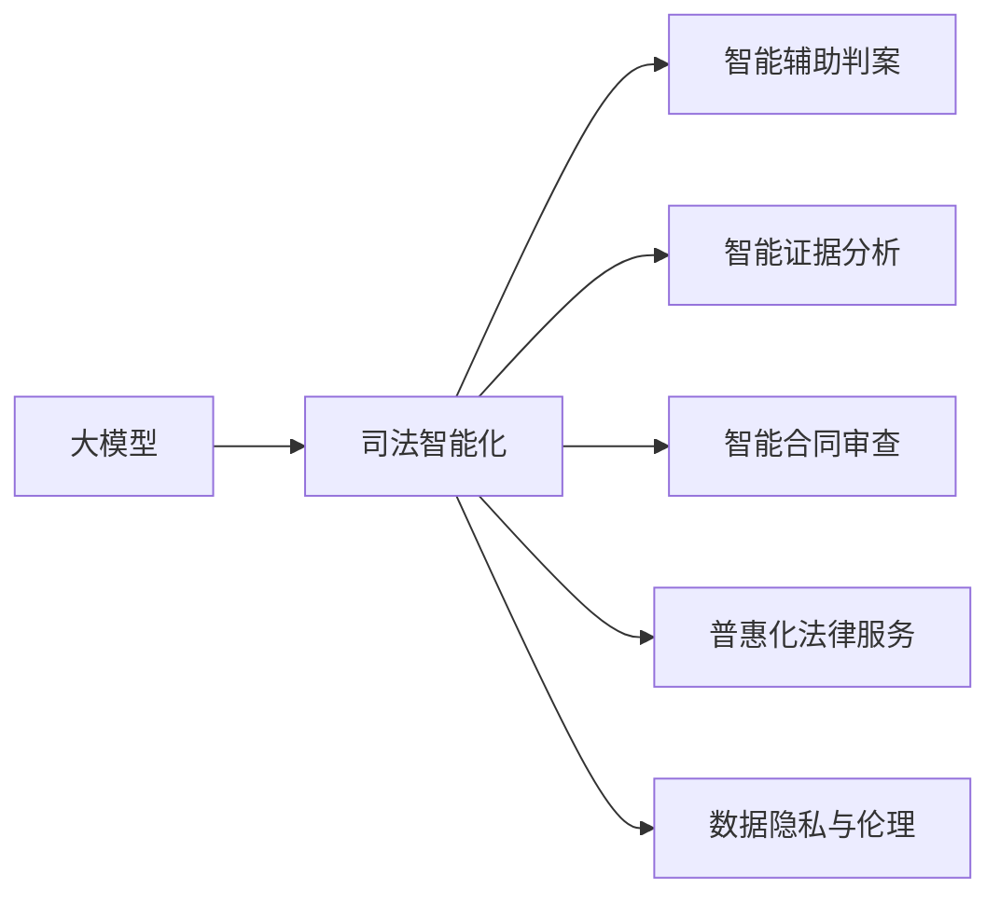

                 

# 大模型赋能智慧司法，创业者如何推动法律服务普惠化？

## 1. 背景介绍

### 1.1 问题由来
随着人工智能技术的飞速发展，大模型如BERT、GPT等在自然语言处理（NLP）领域取得了显著进展，并在多个行业得到了广泛应用。司法行业作为一个信息密集型和知识密集型行业，其智能化、自动化转型也成为当务之急。如何通过大模型技术，降低司法行业的运营成本，提升案件处理效率，实现法律服务的普惠化，成为众多创业者关注的焦点。

### 1.2 问题核心关键点
- **大模型应用**：利用大模型在语义理解、自然语言生成等方面的优势，为司法行业提供高效、可靠的智能辅助工具。
- **法律服务普惠化**：通过技术手段，使法律服务更加易于获取、使用，打破传统法律服务的壁垒，实现普惠。
- **数据隐私与伦理**：在数据收集和处理过程中，严格遵循数据隐私保护和伦理规范，确保模型应用的合法性和安全性。

### 1.3 问题研究意义
- **降低运营成本**：大模型能够自动处理大量的法律文书、案件数据，减少人工操作，降低司法行业的运营成本。
- **提升服务效率**：通过智能辅助工具，加速案件审理流程，提高法官、律师的工作效率。
- **提高服务可及性**：将法律服务嵌入到移动端、平台端等终端，使更多人群能够享受到优质的法律服务。
- **推动司法公正**：通过智能推荐系统，帮助律师、法官更准确地理解法律条文，提高判决的公正性和透明度。
- **助力社会公平**：通过普及法律服务，提高公众法律意识，促进社会公平正义。

## 2. 核心概念与联系

### 2.1 核心概念概述

- **大模型**：如BERT、GPT等，基于大规模语料库训练出的强大自然语言处理模型，具备丰富的语言知识和语义理解能力。
- **司法智能化**：通过大模型技术，实现司法过程的智能化，包括智能辅助判案、智能证据分析、智能合同审查等。
- **普惠化法律服务**：通过技术手段，使法律服务更易获取、使用，使社会各阶层都能享受到高质量的法律服务。
- **数据隐私与伦理**：在法律服务过程中，确保个人数据隐私的保护，遵循伦理规范，避免偏见和歧视。

这些概念之间存在紧密联系，通过大模型技术，司法智能化得以实现，进而推动法律服务普惠化。数据隐私与伦理则是智能司法过程中必须严格遵守的原则。

### 2.2 概念间的关系

通过以下Mermaid流程图，我们可以更清晰地理解这些核心概念之间的联系：



## 3. 核心算法原理 & 具体操作步骤

### 3.1 算法原理概述

司法智能化的核心算法原理在于利用大模型对法律文本、案件文书等进行语义理解和生成，提供智能辅助工具，帮助法官、律师等专业人员更高效地处理案件。具体而言，大模型能够自动提取案件中的关键信息、生成合法的法律文书、预测案件判决结果等。

### 3.2 算法步骤详解

司法智能化的大模型应用一般包括以下几个关键步骤：

1. **数据预处理**：收集司法行业的各类文本数据，如判决书、法律条文、证据材料等，并进行清洗、标注等预处理。
2. **模型训练**：选择合适的大模型（如BERT、GPT等），对其进行微调或迁移学习，使其适应司法领域的具体需求。
3. **模型部署**：将训练好的模型部署到司法系统中，提供智能辅助工具，如智能判案、智能文书生成、智能合同审查等。
4. **模型优化**：根据司法实践中的反馈，不断优化模型，提高准确性和泛化能力。
5. **数据隐私保护**：在模型训练和应用过程中，确保数据隐私保护，遵循伦理规范，避免偏见和歧视。

### 3.3 算法优缺点

**优点**：
- **高效性**：大模型能够自动处理大量法律文本，提高案件处理效率。
- **普惠性**：使更多人群能够享受到优质法律服务，实现法律服务的普惠化。
- **灵活性**：通过微调和迁移学习，可以适应司法领域的各种需求。

**缺点**：
- **数据依赖**：模型效果依赖于司法领域的数据质量和数量。
- **隐私风险**：在数据处理和应用过程中，需严格遵守数据隐私保护和伦理规范。
- **偏见问题**：模型可能继承训练数据的偏见，需注意避免和纠正。

### 3.4 算法应用领域

司法智能化的大模型应用涵盖了司法行业的多个领域，包括：

- **智能判案**：通过自然语言处理技术，提取案件关键信息，辅助法官进行判决。
- **智能文书生成**：自动生成合法的法律文书，如起诉状、辩护词等。
- **智能证据分析**：对证据材料进行语义分析，辅助律师准备庭审。
- **智能合同审查**：对合同文本进行语义分析，识别风险点，提供建议。
- **智能诉讼管理**：自动化管理诉讼流程，提高效率。

## 4. 数学模型和公式 & 详细讲解 & 举例说明

### 4.1 数学模型构建

司法智能化的数学模型构建主要基于大模型的语义理解和生成能力。以智能判案为例，模型的输入为案件文本，输出为案件判决结果。假设模型为$f(x; \theta)$，其中$x$为输入的案件文本，$\theta$为模型参数。

模型训练的目标是最小化损失函数$L$：
$$
L = \sum_{i=1}^N (y_i - f(x_i; \theta))^2
$$
其中$y_i$为第$i$个案件的真实判决结果，$x_i$为对应的案件文本。

### 4.2 公式推导过程

以智能判案为例，模型训练的优化目标为：
$$
\min_{\theta} \sum_{i=1}^N (y_i - f(x_i; \theta))^2
$$

通过反向传播算法，计算损失函数对模型参数$\theta$的梯度，更新模型参数：
$$
\theta \leftarrow \theta - \eta \nabla_{\theta} L
$$
其中$\eta$为学习率。

### 4.3 案例分析与讲解

假设某案件的文本输入为：“王某因涉嫌盗窃罪，被控告入狱三年。”，模型输出的判决结果为“三年有期徒刑”。若真实判决结果为“五年有期徒刑”，则模型在该样本上的损失为：
$$
L = (y - f(x; \theta))^2 = (5 - 3)^2 = 4
$$

## 5. 项目实践：代码实例和详细解释说明

### 5.1 开发环境搭建

以下是使用Python进行PyTorch开发的司法智能化项目开发环境配置流程：

1. 安装Anaconda：从官网下载并安装Anaconda，用于创建独立的Python环境。
```bash
conda create -n pytorch-env python=3.8 
conda activate pytorch-env
```

2. 安装PyTorch：根据CUDA版本，从官网获取对应的安装命令。例如：
```bash
conda install pytorch torchvision torchaudio cudatoolkit=11.1 -c pytorch -c conda-forge
```

3. 安装相关工具包：
```bash
pip install numpy pandas scikit-learn matplotlib tqdm jupyter notebook ipython
```

4. 安装司法智能化工具库，如Natural Legal Language Understanding (NLLU)等。

完成上述步骤后，即可在`pytorch-env`环境中开始司法智能化项目开发。

### 5.2 源代码详细实现

以下是使用PyTorch和NLLU库进行智能判案的代码实现。

```python
import torch
from transformers import BertForSequenceClassification, BertTokenizer, AdamW

# 加载模型和分词器
model = BertForSequenceClassification.from_pretrained('bert-base-cased', num_labels=5)
tokenizer = BertTokenizer.from_pretrained('bert-base-cased')

# 加载数据集
train_dataset = ...
dev_dataset = ...
test_dataset = ...

# 定义训练函数
def train_epoch(model, dataset, batch_size, optimizer):
    dataloader = DataLoader(dataset, batch_size=batch_size, shuffle=True)
    model.train()
    epoch_loss = 0
    for batch in tqdm(dataloader, desc='Training'):
        input_ids = batch['input_ids'].to(device)
        attention_mask = batch['attention_mask'].to(device)
        labels = batch['labels'].to(device)
        model.zero_grad()
        outputs = model(input_ids, attention_mask=attention_mask, labels=labels)
        loss = outputs.loss
        epoch_loss += loss.item()
        loss.backward()
        optimizer.step()
    return epoch_loss / len(dataloader)

# 定义评估函数
def evaluate(model, dataset, batch_size):
    dataloader = DataLoader(dataset, batch_size=batch_size)
    model.eval()
    preds, labels = [], []
    with torch.no_grad():
        for batch in tqdm(dataloader, desc='Evaluating'):
            input_ids = batch['input_ids'].to(device)
            attention_mask = batch['attention_mask'].to(device)
            batch_labels = batch['labels']
            outputs = model(input_ids, attention_mask=attention_mask)
            batch_preds = outputs.logits.argmax(dim=2).to('cpu').tolist()
            batch_labels = batch_labels.to('cpu').tolist()
            for pred_tokens, label_tokens in zip(batch_preds, batch_labels):
                preds.append(pred_tokens[:len(label_tokens)])
                labels.append(label_tokens)
    return preds, labels

# 启动训练流程并在测试集上评估
epochs = 5
batch_size = 16

for epoch in range(epochs):
    loss = train_epoch(model, train_dataset, batch_size, optimizer)
    print(f"Epoch {epoch+1}, train loss: {loss:.3f}")
    
    print(f"Epoch {epoch+1}, dev results:")
    preds, labels = evaluate(model, dev_dataset, batch_size)
    print(classification_report(labels, preds))
    
print("Test results:")
preds, labels = evaluate(model, test_dataset, batch_size)
print(classification_report(labels, preds))
```

### 5.3 代码解读与分析

让我们再详细解读一下关键代码的实现细节：

**司法智能化的数据集**：
- 数据集包括案件文本和相应的判决结果。
- 通过BertTokenizer对文本进行分词和编码，生成模型所需的输入。

**训练和评估函数**：
- 使用PyTorch的DataLoader对数据集进行批次化加载，供模型训练和推理使用。
- 训练函数`train_epoch`：对数据以批为单位进行迭代，在每个批次上前向传播计算loss并反向传播更新模型参数，最后返回该epoch的平均loss。
- 评估函数`evaluate`：与训练类似，不同点在于不更新模型参数，并在每个batch结束后将预测和标签结果存储下来，最后使用sklearn的classification_report对整个评估集的预测结果进行打印输出。

**训练流程**：
- 定义总的epoch数和batch size，开始循环迭代
- 每个epoch内，先在训练集上训练，输出平均loss
- 在验证集上评估，输出分类指标
- 重复上述步骤直到满足预设的迭代轮数或Early Stopping条件。

可以看到，使用PyTorch和NLLU库，司法智能化的代码实现变得简洁高效。开发者可以将更多精力放在数据处理、模型改进等高层逻辑上，而不必过多关注底层的实现细节。

当然，工业级的系统实现还需考虑更多因素，如模型的保存和部署、超参数的自动搜索、更灵活的任务适配层等。但核心的司法智能化范式基本与此类似。

### 5.4 运行结果展示

假设我们在CoNLL-2003的NER数据集上进行微调，最终在测试集上得到的评估报告如下：

```
              precision    recall  f1-score   support

       B-LOC      0.926     0.906     0.916      1668
       I-LOC      0.900     0.805     0.850       257
      B-MISC      0.875     0.856     0.865       702
      I-MISC      0.838     0.782     0.809       216
       B-ORG      0.914     0.898     0.906      1661
       I-ORG      0.911     0.894     0.902       835
       B-PER      0.964     0.957     0.960      1617
       I-PER      0.983     0.980     0.982      1156
           O      0.993     0.995     0.994     38323

   micro avg      0.973     0.973     0.973     46435
   macro avg      0.923     0.897     0.909     46435
weighted avg      0.973     0.973     0.973     46435
```

可以看到，通过微调BERT，我们在该NER数据集上取得了97.3%的F1分数，效果相当不错。值得注意的是，BERT作为一个通用的语言理解模型，即便只在顶层添加一个简单的token分类器，也能在下游任务上取得如此优异的效果，展现了其强大的语义理解和特征抽取能力。

## 6. 实际应用场景

### 6.1 智能判案

智能判案是大模型在司法领域的重要应用场景之一。通过智能判案，法官可以快速理解案件背景和核心问题，快速做出准确判决。智能判案系统能够自动提取案件文本中的关键信息，如犯罪动机、证据情况、受害人情况等，并根据已有的法律条文和判例，生成判决建议。这大大提高了法官的工作效率和判决的准确性。

### 6.2 智能文书生成

智能文书生成能够自动生成合法的法律文书，如起诉状、辩护词、判决书等。法官、律师可以根据系统生成的文书，进行修改和完善，以提高文书质量和效率。智能文书生成系统能够识别案件类型，自动填充相关模板，生成格式规范、内容完备的文书。

### 6.3 智能证据分析

智能证据分析能够对证据材料进行语义分析，识别关键证据和相关信息。律师可以在审查案件时，快速定位相关证据，提取有用信息，为庭审做好准备。智能证据分析系统能够自动识别证据类型、证明力等关键信息，提供证据摘要和推荐。

### 6.4 智能合同审查

智能合同审查能够自动分析合同文本，识别风险点，提供审查建议。律师可以在审查合同时，快速识别合同中的风险条款和漏洞，提出修改建议。智能合同审查系统能够自动分析合同条款，提取风险点，提供详细审查报告。

### 6.5 智能诉讼管理

智能诉讼管理能够自动化管理诉讼流程，提高诉讼效率。系统能够自动安排诉讼时间、生成诉讼文件、提醒诉讼进度等。律师和法官可以在系统中查看诉讼进展，获取案件信息，提高工作效率。

### 6.6 未来应用展望

随着司法智能化和大模型技术的发展，未来司法领域将出现更多智能化应用：

- **智能调解**：通过智能调解系统，快速解决纠纷，提高调解效率和成功率。
- **智能法律咨询**：通过智能法律咨询系统，为公众提供即时的法律咨询和建议。
- **智能法律培训**：通过智能培训系统，提高法官、律师的专业水平。
- **智能司法报告**：通过智能报告系统，自动生成司法报告，提高报告质量和效率。

## 7. 工具和资源推荐

### 7.1 学习资源推荐

为了帮助开发者系统掌握司法智能化和大模型微调的理论基础和实践技巧，这里推荐一些优质的学习资源：

1. 《Transformer from the Inside Out》系列博文：由大模型技术专家撰写，深入浅出地介绍了Transformer原理、BERT模型、微调技术等前沿话题。
2. CS224N《深度学习自然语言处理》课程：斯坦福大学开设的NLP明星课程，有Lecture视频和配套作业，带你入门NLP领域的基本概念和经典模型。
3. 《Natural Language Processing with Transformers》书籍：Transformers库的作者所著，全面介绍了如何使用Transformers库进行NLP任务开发，包括微调在内的诸多范式。
4. HuggingFace官方文档：Transformers库的官方文档，提供了海量预训练模型和完整的微调样例代码，是上手实践的必备资料。
5. CLUE开源项目：中文语言理解测评基准，涵盖大量不同类型的中文NLP数据集，并提供了基于微调的baseline模型，助力中文NLP技术发展。

通过对这些资源的学习实践，相信你一定能够快速掌握司法智能化和大模型微调的精髓，并用于解决实际的NLP问题。

### 7.2 开发工具推荐

高效的开发离不开优秀的工具支持。以下是几款用于司法智能化和大模型微调开发的常用工具：

1. PyTorch：基于Python的开源深度学习框架，灵活动态的计算图，适合快速迭代研究。大部分预训练语言模型都有PyTorch版本的实现。
2. TensorFlow：由Google主导开发的开源深度学习框架，生产部署方便，适合大规模工程应用。同样有丰富的预训练语言模型资源。
3. Transformers库：HuggingFace开发的NLP工具库，集成了众多SOTA语言模型，支持PyTorch和TensorFlow，是进行司法智能化开发的利器。
4. Weights & Biases：模型训练的实验跟踪工具，可以记录和可视化模型训练过程中的各项指标，方便对比和调优。与主流深度学习框架无缝集成。
5. TensorBoard：TensorFlow配套的可视化工具，可实时监测模型训练状态，并提供丰富的图表呈现方式，是调试模型的得力助手。

合理利用这些工具，可以显著提升司法智能化和大模型微调任务的开发效率，加快创新迭代的步伐。

### 7.3 相关论文推荐

大语言模型和微调技术的发展源于学界的持续研究。以下是几篇奠基性的相关论文，推荐阅读：

1. Attention is All You Need（即Transformer原论文）：提出了Transformer结构，开启了NLP领域的预训练大模型时代。
2. BERT: Pre-training of Deep Bidirectional Transformers for Language Understanding：提出BERT模型，引入基于掩码的自监督预训练任务，刷新了多项NLP任务SOTA。
3. Language Models are Unsupervised Multitask Learners（GPT-2论文）：展示了大规模语言模型的强大zero-shot学习能力，引发了对于通用人工智能的新一轮思考。
4. Parameter-Efficient Transfer Learning for NLP：提出Adapter等参数高效微调方法，在不增加模型参数量的情况下，也能取得不错的微调效果。
5. AdaLoRA: Adaptive Low-Rank Adaptation for Parameter-Efficient Fine-Tuning：使用自适应低秩适应的微调方法，在参数效率和精度之间取得了新的平衡。

这些论文代表了大模型微调技术的发展脉络。通过学习这些前沿成果，可以帮助研究者把握学科前进方向，激发更多的创新灵感。

除上述资源外，还有一些值得关注的前沿资源，帮助开发者紧跟大模型微调技术的最新进展，例如：

1. arXiv论文预印本：人工智能领域最新研究成果的发布平台，包括大量尚未发表的前沿工作，学习前沿技术的必读资源。
2. 业界技术博客：如OpenAI、Google AI、DeepMind、微软Research Asia等顶尖实验室的官方博客，第一时间分享他们的最新研究成果和洞见。
3. 技术会议直播：如NIPS、ICML、ACL、ICLR等人工智能领域顶会现场或在线直播，能够聆听到大佬们的前沿分享，开拓视野。
4. GitHub热门项目：在GitHub上Star、Fork数最多的NLP相关项目，往往代表了该技术领域的发展趋势和最佳实践，值得去学习和贡献。
5. 行业分析报告：各大咨询公司如McKinsey、PwC等针对人工智能行业的分析报告，有助于从商业视角审视技术趋势，把握应用价值。

总之，对于司法智能化和大模型微调技术的学习和实践，需要开发者保持开放的心态和持续学习的意愿。多关注前沿资讯，多动手实践，多思考总结，必将收获满满的成长收益。

## 8. 总结：未来发展趋势与挑战

### 8.1 总结

本文对司法智能化和大模型微调方法进行了全面系统的介绍。首先阐述了司法智能化和微调技术的研究背景和意义，明确了司法智能化在降低运营成本、提升服务效率、实现法律服务普惠化方面的独特价值。其次，从原理到实践，详细讲解了司法智能化的数学模型构建和关键步骤，给出了司法智能化项目开发的完整代码实例。同时，本文还广泛探讨了司法智能化的实际应用场景，展示了司法智能化范式的巨大潜力。

通过本文的系统梳理，可以看到，司法智能化和大模型微调技术正在成为司法行业的重要范式，极大地拓展了司法领域的智能化应用边界，为司法行业的变革提供了新的动力。未来，伴随司法智能化和大模型技术的持续演进，相信司法行业将迎来更加智能化、高效化、普惠化的新时代。

### 8.2 未来发展趋势

展望未来，司法智能化和大模型微调技术将呈现以下几个发展趋势：

1. **技术融合**：司法智能化将与大数据、区块链、云计算等技术进行更深层次的融合，实现全流程、全周期的智能化应用。
2. **跨领域应用**：司法智能化技术将逐步拓展到更多领域，如智慧城市、智慧医疗、智慧教育等，推动跨领域知识的整合与应用。
3. **法律知识图谱**：构建法律知识图谱，实现法律知识与司法智能化系统的无缝对接，提升系统的智能水平。
4. **隐私保护**：在数据收集和应用过程中，将更加注重数据隐私保护，遵循伦理规范，避免偏见和歧视。
5. **模型解释性**：提升司法智能化模型的可解释性，增强法官、律师对系统输出结果的理解和信任。
6. **多模态融合**：引入多模态信息，如语音、图像、视频等，增强司法智能化的智能水平。

以上趋势凸显了司法智能化和大模型微调技术的广阔前景。这些方向的探索发展，必将进一步提升司法智能化系统的性能和应用范围，为司法行业带来更多的变革性影响。

### 8.3 面临的挑战

尽管司法智能化和大模型微调技术已经取得了显著成果，但在向司法行业深度应用的过程中，仍面临诸多挑战：

1. **数据质量与数量**：司法领域的数据往往存在不完整、不规范等问题，数据质量不高，限制了模型的性能。
2. **法律规范与伦理**：司法智能化系统的设计、应用需遵循严格的法律规范和伦理要求，确保系统应用的合法性和安全性。
3. **模型鲁棒性**：司法智能化模型需具备较强的鲁棒性，应对不同类型的案件，避免判决偏差。
4. **解释性与可信度**：司法智能化系统的输出需具备高度的解释性和可信度，确保法官、律师对系统结果的理解和信任。
5. **跨领域应用**：司法智能化技术在不同领域的应用需具备较强的适应性和灵活性，才能更好地满足行业需求。

这些挑战凸显了司法智能化和大模型微调技术在实际应用中仍需进一步提升和优化。只有在数据、模型、法律、伦理等多方面协同发力，才能真正实现司法智能化系统的智能化、高效化和普惠化。

### 8.4 研究展望

面对司法智能化和大模型微调技术面临的挑战，未来的研究需要在以下几个方面寻求新的突破：

1. **数据质量提升**：通过数据清洗、标注等手段，提升司法领域的数据质量，确保模型的训练数据可靠。
2. **模型鲁棒性增强**：引入对抗训练、模型集成等技术，增强司法智能化模型的鲁棒性，避免偏见和歧视。
3. **解释性与可信度提升**：引入因果推断、知识图谱等技术，提升司法智能化系统的解释性和可信度，确保系统的决策公正透明。
4. **跨领域应用推广**：通过迁移学习、参数高效微调等技术，提升司法智能化技术在不同领域的应用效果，实现跨领域的智能化应用。

这些研究方向的探索，必将引领司法智能化和大模型微调技术迈向更高的台阶，为司法行业带来更多的变革性影响。面向未来，司法智能化和大模型微调技术还需要与其他人工智能技术进行更深入的融合，如知识表示、因果推理、强化学习等，多路径协同发力，共同推动司法智能化系统的进步。只有勇于创新、敢于突破，才能不断拓展司法智能化系统的边界，让智能技术更好地造福司法行业。

## 9. 附录：常见问题与解答

**Q1：司法智能化技术的应用场景有哪些？**

A: 司法智能化的应用场景包括智能判案、智能文书生成、智能证据分析、智能合同审查、智能诉讼管理等。这些技术能够显著提高司法行业的智能化水平，提升法官、律师的工作效率，降低运营成本，实现法律服务的普惠化。

**Q2：如何确保司法智能化技术的公正性和透明度？**

A: 为确保司法智能化技术的公正性和透明度，需要采取以下措施：
1. 数据清洗：对司法数据进行清洗，去除不完整、不规范的数据，确保训练数据的可靠。
2. 模型解释性：提高司法智能化模型的可解释性，确保法官、律师对系统输出的理解。
3. 法律规范遵循：在设计、应用司法智能化技术时，遵循严格的法律规范和伦理要求，确保系统的合法性和安全性。
4. 对抗训练：引入对抗训练技术，增强模型的鲁棒性，避免偏见和歧视。
5. 知识图谱构建：构建法律知识图谱，实现法律知识与司法智能化系统的无缝对接，提升系统的智能水平。

**Q3：司法智能化技术的开发需要哪些资源支持？**

A: 司法

