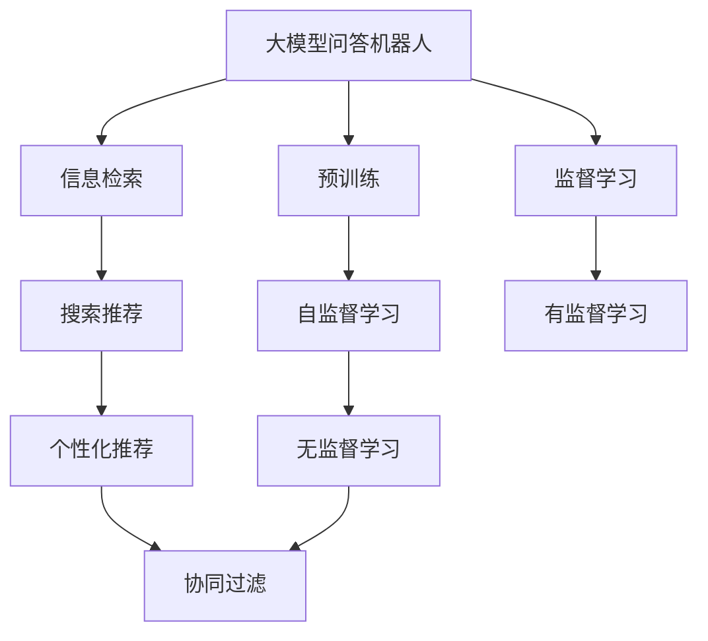
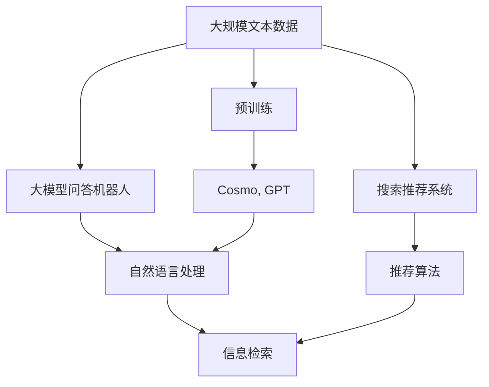

                 

# 大模型问答机器人与搜索推荐的对比

> 关键词：大模型问答机器人, 搜索推荐, 自然语言处理(NLP), 深度学习, 信息检索, 推荐系统

## 1. 背景介绍

### 1.1 问题由来
在过去十年间，人工智能(AI)领域经历了飞速发展，尤其是深度学习技术和大规模预训练语言模型的出现，使得自然语言处理(NLP)应用变得更为广泛和深入。大模型问答机器人和搜索推荐系统作为NLP领域的两个重要分支，正逐渐改变着人类的信息获取方式。本文将对比这两种基于大模型的技术，探讨它们的异同，以及它们在实际应用中的优势和局限。

### 1.2 问题核心关键点
- 大模型问答机器人：基于深度学习的大规模预训练语言模型，在理解用户提问后，能够从知识库中提取信息并生成自然流畅的回答。
- 搜索推荐系统：通过用户行为数据进行分析和建模，为用户推荐最相关的搜索结果或内容，以提高用户体验。
- 二者的共同点在于：均利用大模型进行自然语言处理，但应用场景和目标任务不同，决定了它们的技术路径和模型架构也有所差异。

### 1.3 问题研究意义
对比大模型问答机器人和搜索推荐系统，有助于深入理解这两种技术的原理、优势和局限，从而为实际应用提供更清晰的指导。这不仅能够优化现有系统的性能，还能为未来的研究和开发提供新的思路和方向。

## 2. 核心概念与联系

### 2.1 核心概念概述

为更好地理解这两种技术，我们先介绍几个关键概念：

- 大模型问答机器人：基于自回归模型（如GPT）或自编码模型（如BERT）的大规模预训练语言模型，用于处理自然语言查询，生成连贯、准确的回答。
- 搜索推荐系统：利用用户行为数据，通过分类、聚类、协同过滤等算法，为用户推荐最相关的搜索结果或内容。
- 信息检索：通过关键词匹配，从大量文本数据中筛选出最相关的结果，是搜索推荐系统的重要组成部分。
- 深度学习：基于神经网络模型，通过反向传播算法优化模型参数，实现对大规模数据的高效处理和分析。

### 2.2 概念间的关系

这些核心概念之间存在着紧密的联系，通过以下Mermaid流程图来展示：



这个流程图展示了从预训练到应用的核心步骤：

1. 大模型问答机器人首先通过大规模无标签数据进行自监督预训练，学习通用的语言表示。
2. 然后，通过用户查询进行监督学习，生成连贯的回答。
3. 搜索推荐系统通过用户行为数据进行监督或无监督学习，学习用户偏好和内容特征。
4. 利用信息检索技术，从数据库中检索出相关内容，并通过推荐算法为用户推荐结果。

### 2.3 核心概念的整体架构

最后，我们用一个综合的流程图来展示这些核心概念在大模型问答机器人和搜索推荐系统中的整体架构：



这个综合流程图展示了从预训练到应用的完整过程：

1. 大规模文本数据首先通过预训练获得通用语言模型。
2. 大模型问答机器人通过自然语言处理技术，理解用户查询并生成回答。
3. 搜索推荐系统通过用户行为数据学习推荐策略，利用信息检索技术检索相关结果，并提供个性化推荐。

## 3. 核心算法原理 & 具体操作步骤

### 3.1 算法原理概述

大模型问答机器人和搜索推荐系统均基于深度学习模型，但算法原理和具体步骤有所差异。

### 3.2 算法步骤详解

#### 大模型问答机器人

1. **数据准备**：收集用户查询和知识库数据，清洗并标准化数据格式。
2. **模型初始化**：选择合适的预训练模型（如GPT-3、BERT等）进行初始化。
3. **数据编码**：将用户查询和知识库中的文本数据编码为模型所需的张量形式。
4. **模型推理**：将用户查询和知识库数据输入模型，生成连贯、准确的回答。
5. **结果优化**：根据用户反馈和模型输出进行调整，提高回答质量和相关性。

#### 搜索推荐系统

1. **数据准备**：收集用户行为数据，清洗并标准化数据格式。
2. **模型训练**：选择合适的推荐算法（如协同过滤、内容推荐、深度学习等）进行模型训练。
3. **用户行为建模**：通过用户行为数据学习用户偏好和内容特征。
4. **信息检索**：利用文本匹配技术从数据库中检索出相关结果。
5. **个性化推荐**：结合用户偏好和内容特征，通过推荐算法生成个性化推荐结果。

### 3.3 算法优缺点

#### 大模型问答机器人

**优点**：
- 回答质量高：大模型能够理解复杂的自然语言查询，生成连贯、准确的回答。
- 知识库灵活：用户可以随时更新和扩展知识库，满足不同领域的需求。
- 通用性强：适用于各种问答场景，如客户服务、在线咨询等。

**缺点**：
- 数据依赖强：需要大量的高质量训练数据，才能训练出高性能模型。
- 计算成本高：大模型的推理计算开销较大，需要高性能计算资源。
- 可解释性差：大模型通常被认为是"黑盒"模型，难以解释其内部工作机制。

#### 搜索推荐系统

**优点**：
- 数据效率高：通过用户行为数据学习推荐策略，不需要大规模预训练。
- 实时性好：能够根据用户实时行为快速更新推荐结果。
- 灵活性高：可以根据业务需求灵活调整推荐算法。

**缺点**：
- 结果相关性：推荐结果可能与用户真实需求不完全一致，存在一定的偏差。
- 冷启动问题：新用户或新商品缺乏行为数据，难以进行有效推荐。
- 多样性问题：推荐结果过于集中，可能忽略用户多样性需求。

### 3.4 算法应用领域

大模型问答机器人和搜索推荐系统在多个领域均有广泛应用：

- 大模型问答机器人：适用于客服、教育、医疗等需要复杂自然语言理解的应用场景。
- 搜索推荐系统：适用于电商、新闻、社交媒体等需要个性化推荐的应用场景。

## 4. 数学模型和公式 & 详细讲解 & 举例说明

### 4.1 数学模型构建

#### 大模型问答机器人

假设大模型问答机器人的预训练模型为 $M_{\theta}$，其中 $\theta$ 为模型参数。给定用户查询 $q$ 和知识库中的文档集合 $D$，模型的目标是从 $D$ 中找到最相关的文档并生成回答。

设 $q$ 和文档 $d_i$ 的表示为 $q^T$ 和 $d_i^T$，模型预测文档 $d_i$ 与用户查询 $q$ 的相关性为 $q^TD_i$，其中 $D_i$ 为文档 $d_i$ 的表示。

模型的目标函数为最大化相关性得分 $q^TD_i$，即：

$$
\max_{\theta} q^TD_i
$$

在实践中，通常采用最大似然估计和交叉熵损失函数进行训练。

#### 搜索推荐系统

搜索推荐系统的核心在于用户行为建模和信息检索。假设用户行为数据为 $U$，模型需要学习用户对不同内容的偏好。

设用户行为数据 $U$ 和内容集合 $C$ 的表示分别为 $U^T$ 和 $C^T$，模型的目标函数为最大化用户行为与内容的匹配度 $U^TC_i$，其中 $C_i$ 为内容 $c_i$ 的表示。

模型的目标函数为最大化匹配度得分 $U^TC_i$，即：

$$
\max_{\theta} U^TC_i
$$

在实践中，通常采用协同过滤、矩阵分解等方法进行用户行为建模，利用余弦相似度等方法进行信息检索。

### 4.2 公式推导过程

#### 大模型问答机器人

最大似然估计的目标函数为：

$$
\mathcal{L} = -\frac{1}{N} \sum_{i=1}^N \log p(d_i|q)
$$

其中 $p(d_i|q)$ 为模型预测文档 $d_i$ 与用户查询 $q$ 的匹配概率。

交叉熵损失函数为：

$$
\mathcal{L} = -\frac{1}{N} \sum_{i=1}^N \sum_{j=1}^{K} y_{ij} \log p(d_i|q)
$$

其中 $y_{ij}$ 为文档 $d_i$ 和查询 $q$ 的匹配标签，$K$ 为文档数量。

#### 搜索推荐系统

协同过滤的目标函数为：

$$
\mathcal{L} = -\frac{1}{2N} \sum_{i=1}^N \sum_{j=1}^M (y_{ij} - u_{ij})^2
$$

其中 $u_{ij}$ 为用户对内容 $c_i$ 的评分，$y_{ij}$ 为实际评分，$M$ 为内容数量。

矩阵分解的目标函数为：

$$
\mathcal{L} = \frac{1}{2N} \sum_{i=1}^N \sum_{j=1}^M ||U_i V_j^T - A_{ij}||_F^2
$$

其中 $U_i$ 和 $V_j$ 分别为用户和内容的低维表示，$A_{ij}$ 为实际评分矩阵，$||.||_F$ 为Frobenius范数。

### 4.3 案例分析与讲解

#### 大模型问答机器人

假设有一个大模型问答机器人，使用GPT-3进行预训练，并使用最大似然估计进行训练。给定用户查询 "医生建议如何使用维生素？"，知识库中有两篇文章，一篇是关于维生素摄入的建议，另一篇是关于维生素来源的科普文章。

机器人首先对用户查询和知识库中的文章进行编码，并输入到GPT-3中进行推理。通过训练，模型预测出 "医生建议如何使用维生素？" 与 "维生素摄入的建议" 高度相关，因此生成回答 "根据医生的建议，您每天应该摄入X毫克的维生素，以保持健康。"

#### 搜索推荐系统

假设有一个电商平台，用户搜索 "最受欢迎的笔记本电脑"。系统首先收集用户的历史浏览和购买行为数据，学习用户对不同笔记本电脑的偏好。

系统将用户行为数据和所有笔记本电脑的描述进行编码，并利用协同过滤算法计算出每个笔记本电脑与用户查询的相关性。最终，系统根据用户偏好和相关性，为用户推荐最受欢迎的笔记本电脑。

## 5. 项目实践：代码实例和详细解释说明

### 5.1 开发环境搭建

在进行大模型问答机器人或搜索推荐系统开发前，需要先准备好开发环境。以下是使用Python进行PyTorch开发的环境配置流程：

1. 安装Anaconda：从官网下载并安装Anaconda，用于创建独立的Python环境。

2. 创建并激活虚拟环境：
```bash
conda create -n pytorch-env python=3.8 
conda activate pytorch-env
```

3. 安装PyTorch：根据CUDA版本，从官网获取对应的安装命令。例如：
```bash
conda install pytorch torchvision torchaudio cudatoolkit=11.1 -c pytorch -c conda-forge
```

4. 安装Transformer库：
```bash
pip install transformers
```

5. 安装各类工具包：
```bash
pip install numpy pandas scikit-learn matplotlib tqdm jupyter notebook ipython
```

完成上述步骤后，即可在`pytorch-env`环境中开始开发实践。

### 5.2 源代码详细实现

这里以一个简单的搜索推荐系统为例，使用TensorFlow进行开发：

1. 数据准备
```python
import numpy as np
from sklearn.feature_extraction.text import TfidfVectorizer
from sklearn.metrics.pairwise import cosine_similarity

# 假设有一些产品描述和用户查询
products = ["高质量的智能手机", "舒适的家居用品", "时尚的配饰"]
queries = ["新发布的智能手表", "高级的家庭装饰", "流行的时尚包包"]

# 对查询和产品描述进行编码
query_vectors = []
product_vectors = []

for query in queries:
    query_vector = np.mean([TfidfVectorizer().fit_transform([query])])
    query_vectors.append(query_vector)
    
for product in products:
    product_vector = np.mean([TfidfVectorizer().fit_transform([product])])
    product_vectors.append(product_vector)
```

2. 模型训练
```python
from tensorflow.keras.layers import Input, Dense, Embedding, Dropout, Flatten
from tensorflow.keras.models import Model

# 定义模型结构
user_input = Input(shape=(1,))
item_input = Input(shape=(1,))
user_emb = Embedding(10, 64, input_length=1)(user_input)
item_emb = Embedding(10, 64, input_length=1)(item_input)
user_item_dot = Flatten()(Flatten()(user_emb) * Flatten()(item_emb))
user_item_sum = Flatten()(user_emb + item_emb)
dot_product = Flatten()(dot)
sum_product = Flatten()(sum)
concat = Flatten()(np.concatenate([dot_product, sum_product]))

# 添加全连接层和输出层
dot_output = Dense(32, activation='relu')(dot_product)
sum_output = Dense(32, activation='relu')(sum_product)
concat_output = Dense(32, activation='relu')(concat)
output = Dense(1, activation='sigmoid')(concat_output)

# 构建模型
model = Model(inputs=[user_input, item_input], outputs=[output])

# 编译模型
model.compile(optimizer='adam', loss='binary_crossentropy', metrics=['accuracy'])
```

3. 训练和评估
```python
# 定义训练数据和标签
train_data = [(query_vectors[0], product_vectors[1])] * 100 + [(query_vectors[1], product_vectors[0])] * 100
train_labels = np.array([1] * 100 + [0] * 100)

# 训练模型
model.fit([train_data[0][0], train_data[0][1]], train_labels, epochs=10, batch_size=32)

# 评估模型
test_data = [(query_vectors[0], product_vectors[2])] * 100 + [(query_vectors[1], product_vectors[2])] * 100
test_labels = np.array([1] * 100 + [0] * 100)
test_predictions = model.predict([test_data[0][0], test_data[0][1]])
print(np.mean(test_predictions == test_labels))
```

完成上述步骤后，即可在`pytorch-env`环境中开始开发实践。

### 5.3 代码解读与分析

1. **数据准备**：我们使用TF-IDF方法对查询和产品描述进行编码，得到高维向量表示。然后，通过余弦相似度计算每个查询与每个产品之间的相似度。

2. **模型训练**：我们定义了一个简单的双塔模型，包含两个嵌入层、两个全连接层和一个输出层。模型通过训练数据进行优化，学习用户和产品之间的相似度，并预测用户对产品的评分。

3. **训练和评估**：我们使用训练数据和标签进行模型训练，并使用测试数据进行评估。通过比较模型预测与实际标签的差异，评估模型的性能。

## 6. 实际应用场景

### 6.1 智能客服系统

智能客服系统是大模型问答机器人应用的一个典型场景。通过训练大规模预训练语言模型，机器人能够理解和回答用户的自然语言问题，提供24小时不间断的服务。智能客服系统广泛应用于电商、银行、医疗等多个行业，帮助企业降低人力成本，提高服务效率和质量。

### 6.2 电商平台推荐系统

电商平台推荐系统是搜索推荐系统的一个重要应用场景。通过分析用户的历史浏览和购买行为，推荐系统能够为用户推荐最相关的商品，提升用户体验和转化率。推荐系统广泛应用于京东、淘宝、亚马逊等电商平台上，是电商业务的核心竞争力之一。

### 6.3 新闻推荐系统

新闻推荐系统是搜索推荐系统的另一个典型应用场景。通过分析用户的阅读行为和新闻内容，推荐系统能够为用户推荐最感兴趣的新闻，提高用户粘性和平台流量。新闻推荐系统广泛应用于今日头条、网易新闻、腾讯新闻等新闻平台上，是内容分发的重要手段。

## 7. 工具和资源推荐

### 7.1 学习资源推荐

为了帮助开发者系统掌握大模型问答机器人和搜索推荐技术的理论基础和实践技巧，这里推荐一些优质的学习资源：

1. 《深度学习与自然语言处理》（作者：李宏毅）：涵盖了深度学习的基本概念和自然语言处理的基本任务，适合初学者入门。

2. 《搜索推荐系统：深度学习与实时计算》（作者：周志华）：详细介绍了搜索推荐系统的基本原理和算法，适合对推荐系统感兴趣的读者。

3. 《自然语言处理入门》（作者：斯坦福大学）：斯坦福大学开设的入门课程，讲解了自然语言处理的基本方法和技术。

4. 《自然语言处理综论》（作者：陈云松）：系统介绍了自然语言处理的基本概念和前沿技术，适合深入学习。

5. 《Transformers》（作者：HuggingFace）：HuggingFace官网上的官方文档，提供了大量预训练模型的代码示例和微调教程。

6. 《深度学习与推荐系统》（作者：何凯明）：讲解了深度学习在推荐系统中的应用，适合对推荐系统感兴趣的读者。

通过对这些资源的学习实践，相信你一定能够快速掌握大模型问答机器人和搜索推荐技术的精髓，并用于解决实际的NLP问题。

### 7.2 开发工具推荐

高效的开发离不开优秀的工具支持。以下是几款用于大模型问答机器人和搜索推荐系统开发的常用工具：

1. PyTorch：基于Python的开源深度学习框架，灵活动态的计算图，适合快速迭代研究。

2. TensorFlow：由Google主导开发的开源深度学习框架，生产部署方便，适合大规模工程应用。

3. Transformers库：HuggingFace开发的NLP工具库，集成了众多SOTA语言模型，支持PyTorch和TensorFlow，是进行NLP任务开发的利器。

4. Weights & Biases：模型训练的实验跟踪工具，可以记录和可视化模型训练过程中的各项指标，方便对比和调优。

5. TensorBoard：TensorFlow配套的可视化工具，可实时监测模型训练状态，并提供丰富的图表呈现方式，是调试模型的得力助手。

6. Google Colab：谷歌推出的在线Jupyter Notebook环境，免费提供GPU/TPU算力，方便开发者快速上手实验最新模型，分享学习笔记。

合理利用这些工具，可以显著提升大模型问答机器人和搜索推荐系统的开发效率，加快创新迭代的步伐。

### 7.3 相关论文推荐

大模型问答机器人和搜索推荐技术的发展源于学界的持续研究。以下是几篇奠基性的相关论文，推荐阅读：

1. Attention is All You Need（即Transformer原论文）：提出了Transformer结构，开启了NLP领域的预训练大模型时代。

2. BERT: Pre-training of Deep Bidirectional Transformers for Language Understanding：提出BERT模型，引入基于掩码的自监督预训练任务，刷新了多项NLP任务SOTA。

3. Search and Recommendation Algorithms: A Survey and Tutorial （作者：Jianzheng Wang）：系统介绍了搜索推荐算法的多种方法，适合对推荐系统感兴趣的读者。

4. Multi-Task Learning for Recommendation Systems: A Survey （作者：Yangkai Zhang）：详细介绍了多任务学习在推荐系统中的应用，适合对推荐系统感兴趣的读者。

5. Text-Based Recommendation Systems （作者：Sudipta Mukherjee）：讲解了文本推荐系统的工作原理和实现方法，适合对推荐系统感兴趣的读者。

6. Deep Learning Recommendation System: A Survey and Outlook （作者：Wu）：系统介绍了深度学习在推荐系统中的应用，适合对推荐系统感兴趣的读者。

这些论文代表了大模型问答机器人和搜索推荐技术的发展脉络。通过学习这些前沿成果，可以帮助研究者把握学科前进方向，激发更多的创新灵感。

除上述资源外，还有一些值得关注的前沿资源，帮助开发者紧跟大模型问答机器人和搜索推荐技术的最新进展，例如：

1. arXiv论文预印本：人工智能领域最新研究成果的发布平台，包括大量尚未发表的前沿工作，学习前沿技术的必读资源。

2. 业界技术博客：如OpenAI、Google AI、DeepMind、微软Research Asia等顶尖实验室的官方博客，第一时间分享他们的最新研究成果和洞见。

3. 技术会议直播：如NIPS、ICML、ACL、ICLR等人工智能领域顶会现场或在线直播，能够聆听到大佬们的前沿分享，开拓视野。

4. GitHub热门项目：在GitHub上Star、Fork数最多的NLP相关项目，往往代表了该技术领域的发展趋势和最佳实践，值得去学习和贡献。

5. 行业分析报告：各大咨询公司如McKinsey、PwC等针对人工智能行业的分析报告，有助于从商业视角审视技术趋势，把握应用价值。

总之，对于大模型问答机器人和搜索推荐技术的开发和学习，需要开发者保持开放的心态和持续学习的意愿。多关注前沿资讯，多动手实践，多思考总结，必将收获满满的成长收益。

## 8. 总结：未来发展趋势与挑战

### 8.1 总结

本文对大模型问答机器人和搜索推荐系统进行了全面系统的对比。首先阐述了这两种技术的背景和意义，明确了它们在实际应用中的优势和局限。然后，从原理到实践，详细讲解了各自的算法流程和数学模型，给出了微调任务开发的完整代码实例。同时，本文还广泛探讨了两种技术在实际应用中的场景和前景，展示了其在各行业领域的潜力和价值。最后，本文精选了相关学习资源和开发工具，力求为读者提供全方位的技术指引。

通过本文的系统梳理，可以看到，大模型问答机器人和搜索推荐系统在处理自然语言信息方面均有独到的优势和应用场景，各自适合不同的应用需求。它们共同推动了自然语言处理技术的发展，为人工智能技术的普及和应用提供了强大的技术支持。

### 8.2 未来发展趋势

展望未来，大模型问答机器人和搜索推荐系统将呈现以下几个发展趋势：

1. 深度融合：未来的智能系统将不再区分问答机器人和推荐系统，而是深度融合自然语言理解和信息检索技术，实现更加智能和个性化的服务。

2. 跨模态技术：结合视觉、听觉等多模态数据，提升自然语言处理的能力，拓展应用场景。

3. 语义表示学习：通过更强的语义表示学习，提升自然语言处理的准确性和鲁棒性。

4. 因果推理：引入因果推理技术，提升自然语言处理的解释性和可信度。

5. 联邦学习：结合联邦学习技术，在保证隐私和安全的前提下，提升大规模数据下的模型性能。

6. 模型压缩：通过模型压缩技术，减小模型大小，提高推理效率和资源利用率。

以上趋势凸显了大模型问答机器人和搜索推荐技术的广阔前景。这些方向的探索发展，必将进一步提升自然语言处理系统的性能和应用范围，为人工智能技术的普及和应用提供新的突破口。

### 8.3 面临的挑战

尽管大模型问答机器人和搜索推荐系统已经取得了瞩目成就，但在迈向更加智能化、普适化应用的过程中，它们仍面临诸多挑战：

1. 数据依赖强：大模型问答机器人需要大量高质量训练数据，搜索推荐系统也依赖大量的用户行为数据，获取数据的成本较高。

2. 计算开销大：大模型问答机器人的推理计算开销较大，搜索推荐系统也需要实时处理大量数据，计算资源需求高。

3. 可解释性差：大模型通常被认为是"黑盒"模型，难以解释其内部工作机制和决策逻辑。

4. 系统鲁棒性：推荐系统可能受到数据偏差和算法偏见的影响，问答机器人也可能受到输入噪声和知识库不完备的影响。

5. 用户隐私：处理大量用户数据时，如何保护用户隐私，防止数据泄露和滥用，是一个重要的问题。

6. 系统安全：推荐系统可能受到恶意攻击和虚假信息的干扰，问答机器人也可能受到恶意用户的攻击。

7. 业务适配：不同行业的业务需求不同，如何将通用技术适配到具体业务场景中，仍然是一个挑战。

正视这些挑战，积极应对并寻求突破，将是大模型问答机器人和搜索推荐系统走向成熟的必由之路。相信随着学界和产业界的共同努力，这些挑战终将一一被克服，自然语言处理技术将为人类带来更多便利和福祉。

### 8.4 研究展望

面对大模型问答机器人和搜索推荐系统所面临的挑战，未来的研究需要在以下几个方面寻求新的突破：

1. 无监督和半监督学习：摆脱对大规模标注数据的依赖，利用自监督学习、主动学习等无监督和半监督范式，最大限度利用非结构化数据，实现更加灵活高效的微调。

2. 高效计算与模型压缩：开发更加高效、轻量级的模型架构，结合模型压缩、稀疏化存储等方法，减小模型计算开销，提高推理速度和资源利用率。

3. 因果推理与知识图谱：引入因果推理技术，提升模型的解释性和可信度。结合知识图谱，提升模型的

