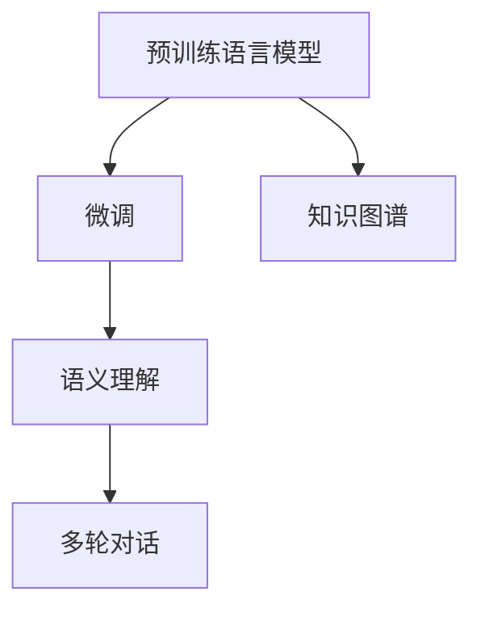
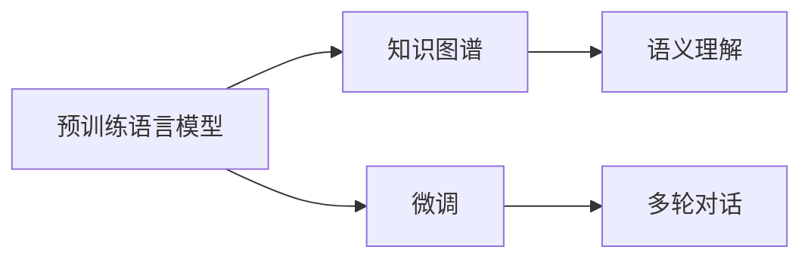

                 

# 大模型问答机器人如何理解语义

## 1. 背景介绍

随着人工智能技术的迅猛发展，自然语言处理（Natural Language Processing，NLP）成为连接人与机器的重要桥梁。其中，问答系统（Question Answering System，QA System）是NLP领域的一个重要应用方向，广泛应用于智能客服、智能家居、智能搜索、智能教育等领域。而大模型问答系统，则利用预训练语言模型（Pretrained Language Models，PLMs）的强大语义理解能力，能够对复杂的自然语言问题进行精准回答。

在实际应用中，大模型问答系统常常需要处理各种自然语言问题，包括事实性问题、推理性问题、多轮对话等。这些问题的语义理解，是问答系统性能的核心，也是其能否真正满足用户需求的关键。本文章将从语义理解的角度，深入探讨大模型问答机器人如何理解语义，并介绍相关的技术和实践。

## 2. 核心概念与联系

### 2.1 核心概念概述

为了更好地理解大模型问答机器人如何理解语义，我们需要掌握以下几个核心概念：

- **语义理解**：指自然语言处理模型能够理解文本语义，提取文本中的关键信息，识别出问题中的实体、关系、时态等信息。
- **预训练语言模型**：如BERT、GPT等，通过大规模无标签数据训练，学习丰富的语言知识和语义表示。
- **微调**：基于特定任务的数据集，对预训练模型进行进一步训练，以适应特定任务的语义理解需求。
- **多轮对话**：指问答系统与用户之间多次交互，构建对话上下文，逐步解析用户意图，提供精准回答。
- **知识图谱**：由实体、关系、属性组成的知识网络，用于辅助问答系统进行知识推理。

这些核心概念之间的联系如下：



预训练语言模型通过大规模无标签数据进行预训练，学习到丰富的语言知识。微调则是在特定任务的数据集上，对预训练模型进行进一步训练，以提升其对特定语义的识别能力。在实际应用中，语义理解还需要依赖知识图谱和多轮对话技术，实现复杂问题的精准回答。

### 2.2 概念间的关系

这些核心概念之间的关系可以用以下Mermaid流程图来展示：



预训练语言模型提供了基础的语义表示能力，知识图谱则补充了特定领域的实体关系信息，微调提升了模型对特定任务的适应能力，多轮对话技术则帮助构建对话上下文，实现复杂问题的精确解析。这些技术相互配合，共同构建了大模型问答机器人的语义理解能力。

## 3. 核心算法原理 & 具体操作步骤

### 3.1 算法原理概述

大模型问答机器人的语义理解主要基于预训练语言模型，通过微调技术，适应特定任务的语义需求。其核心算法流程包括：

1. **数据准备**：收集特定任务的标注数据集，准备微调所需的训练数据。
2. **模型初始化**：选择适当的预训练模型作为初始化参数。
3. **微调训练**：使用标注数据集，对预训练模型进行微调，优化其对特定语义的理解能力。
4. **语义理解**：在微调后的模型上，对输入的自然语言问题进行语义解析，识别出问题中的关键信息。
5. **知识推理**：利用知识图谱和多轮对话技术，进行知识推理，获取最终答案。

### 3.2 算法步骤详解

接下来，我们将详细介绍大模型问答机器人语义理解的算法步骤。

**Step 1: 数据准备**

数据准备是微调的基础。需要收集特定任务的标注数据集，通常包括问题-答案对，用于训练模型。标注数据集的质量和数量对微调效果有重要影响。

```python
from datasets import load_dataset
dataset = load_dataset('your_dataset')
```

**Step 2: 模型初始化**

选择适当的预训练模型作为初始化参数。通常选择基于Transformer架构的语言模型，如BERT、GPT等。

```python
from transformers import BertForQuestionAnswering
model = BertForQuestionAnswering.from_pretrained('bert-base-uncased')
```

**Step 3: 微调训练**

使用标注数据集，对预训练模型进行微调。微调的目标是最小化损失函数，提升模型在特定任务上的语义理解能力。

```python
from transformers import Trainer, TrainingArguments
training_args = TrainingArguments('train_args.json')
trainer = Trainer(
    model=model,
    args=training_args,
    train_dataset=dataset['train'],
    eval_dataset=dataset['validation'],
    compute_metrics=accuracy)
trainer.train()
```

**Step 4: 语义理解**

在微调后的模型上，对输入的自然语言问题进行语义解析，识别出问题中的关键信息。通常使用掩码语言模型（Masked Language Model）的方式，对问题进行解析。

```python
from transformers import BertTokenizer
tokenizer = BertTokenizer.from_pretrained('bert-base-uncased')
inputs = tokenizer(question, return_tensors='pt')
outputs = model(**inputs)
```

**Step 5: 知识推理**

利用知识图谱和多轮对话技术，进行知识推理，获取最终答案。通常使用专门的推理引擎，如TransE、RDF2Vec等，对知识图谱进行推理。

```python
from py2vec import Embedding
from py2vec import Embedding, GraphSematics
embedding = Embedding('your_kb')
graph_semantics = GraphSematics()
graph_semantics.setup(embedding)
result = graph_semantics.predict_question(question)
```

### 3.3 算法优缺点

大模型问答机器人的语义理解具有以下优点：

1. **泛化能力强**：预训练模型在大规模数据上预训练，具备较强的泛化能力，可以适应不同的语义需求。
2. **语义理解精准**：微调技术能够根据特定任务的数据集，对模型进行优化，提高语义理解的准确性。
3. **应用灵活**：微调后的模型可以应用于各种自然语言问答任务，如事实性问答、推理性问答、多轮对话等。

同时，也存在以下缺点：

1. **计算资源消耗大**：大模型需要大规模计算资源进行预训练和微调，对硬件要求较高。
2. **数据依赖性强**：微调的效果依赖于标注数据的质量和数量，获取高质量标注数据的成本较高。
3. **语义理解复杂**：自然语言的复杂性使得语义理解成为一大挑战，微调模型难以完全解决所有语义问题。

### 3.4 算法应用领域

大模型问答机器人的语义理解广泛应用于各种自然语言处理领域，包括但不限于：

- **智能客服**：用于自动解答客户咨询，提供24/7服务。
- **智能搜索**：用于查询处理，提供精准搜索结果。
- **智能教育**：用于智能辅导，解答学生疑问。
- **智能医疗**：用于医学知识查询，提供专家建议。
- **智能金融**：用于金融知识查询，提供投资建议。

这些应用场景下，大模型问答机器人能够提供精准的语义理解，帮助用户快速解决问题。

## 4. 数学模型和公式 & 详细讲解 & 举例说明

### 4.1 数学模型构建

大模型问答机器人的语义理解主要基于掩码语言模型（Masked Language Model，MLM）和掩码关系模型（Masked Relationship Model，MRM）。以BERT为例，其掩码语言模型的目标是最小化预测下一个词的概率：

$$
\mathcal{L}_{MLM} = -\frac{1}{N}\sum_{i=1}^{N}\sum_{j=1}^{M} y_j \log(p_j) 
$$

其中 $y_j$ 是第 $j$ 个词语的真实标签，$p_j$ 是模型预测的下一个词语概率。

掩码关系模型的目标是最小化预测实体关系的概率：

$$
\mathcal{L}_{MRM} = -\frac{1}{N}\sum_{i=1}^{N} \log(p_{r_i}) 
$$

其中 $p_{r_i}$ 是模型预测的第 $i$ 个实体关系概率。

### 4.2 公式推导过程

以BERT为例，其掩码语言模型的预测公式为：

$$
\begin{aligned}
p_j &= \frac{e^{a_j}}{\sum_{k=1}^{V} e^{a_k}} \\
a_j &= \text{Dot}(X_jW^0 + X_{<j}W^1 + X_{>j}W^2, H^1)
\end{aligned}
$$

其中 $X_j$ 表示问题中的第 $j$ 个词语，$W^0$、$W^1$、$W^2$ 表示BERT中的参数矩阵，$H^1$ 表示BERT的隐层表示。

掩码关系模型的预测公式为：

$$
\begin{aligned}
p_{r_i} &= \frac{e^{a_{r_i}}}{\sum_{k=1}^{R} e^{a_k}} \\
a_{r_i} &= \text{Dot}(X_{r_i}W^0 + X_{<h_i}W^1 + X_{>h_i}W^2, H^1)
\end{aligned}
$$

其中 $X_{r_i}$ 表示问题中的第 $i$ 个实体关系，$W^0$、$W^1$、$W^2$ 表示BERT中的参数矩阵，$H^1$ 表示BERT的隐层表示。

### 4.3 案例分析与讲解

以BERT为例，假设输入的问题为 "Who is the author of '1984'?"，模型预测的下一个词语概率为：

$$
\begin{aligned}
p_{w_i} &= \frac{e^{a_{w_i}}}{\sum_{k=1}^{V} e^{a_k}} \\
a_{w_i} &= \text{Dot}(X_{w_i}W^0 + X_{<w_i}W^1 + X_{>w_i}W^2, H^1)
\end{aligned}
$$

其中 $w_i$ 表示问题中的第 $i$ 个词语，$W^0$、$W^1$、$W^2$ 表示BERT中的参数矩阵，$H^1$ 表示BERT的隐层表示。

通过预测下一个词语的概率，模型可以识别出问题中的关键信息，如 "author"、"1984" 等，进而进行知识推理，获取最终答案。

## 5. 项目实践：代码实例和详细解释说明

### 5.1 开发环境搭建

在进行大模型问答机器人的语义理解开发前，我们需要准备好开发环境。以下是使用Python进行PyTorch开发的环境配置流程：

1. 安装Anaconda：从官网下载并安装Anaconda，用于创建独立的Python环境。

2. 创建并激活虚拟环境：
```bash
conda create -n pytorch-env python=3.8 
conda activate pytorch-env
```

3. 安装PyTorch：根据CUDA版本，从官网获取对应的安装命令。例如：
```bash
conda install pytorch torchvision torchaudio cudatoolkit=11.1 -c pytorch -c conda-forge
```

4. 安装Transformers库：
```bash
pip install transformers
```

5. 安装各类工具包：
```bash
pip install numpy pandas scikit-learn matplotlib tqdm jupyter notebook ipython
```

完成上述步骤后，即可在`pytorch-env`环境中开始语义理解实践。

### 5.2 源代码详细实现

接下来，我们以BERT模型为例，给出使用Transformers库进行问答任务微调的PyTorch代码实现。

首先，定义问答任务的数据处理函数：

```python
from transformers import BertTokenizer
from torch.utils.data import Dataset
import torch

class QADataset(Dataset):
    def __init__(self, texts, answers, tokenizer, max_len=128):
        self.texts = texts
        self.answers = answers
        self.tokenizer = tokenizer
        self.max_len = max_len
        
    def __len__(self):
        return len(self.texts)
    
    def __getitem__(self, item):
        text = self.texts[item]
        answer = self.answers[item]
        
        encoding = self.tokenizer(text, return_tensors='pt', max_length=self.max_len, padding='max_length', truncation=True)
        input_ids = encoding['input_ids'][0]
        attention_mask = encoding['attention_mask'][0]
        
        # 对answer进行编码
        encoded_answer = [answer2id[answer] for answer in answer]
        encoded_answer.extend([answer2id['O']] * (self.max_len - len(encoded_answer)))
        labels = torch.tensor(encoded_answer, dtype=torch.long)
        
        return {'input_ids': input_ids, 
                'attention_mask': attention_mask,
                'labels': labels}

# 标签与id的映射
answer2id = {'O': 0, 'author': 1}
id2answer = {v: k for k, v in answer2id.items()}

# 创建dataset
tokenizer = BertTokenizer.from_pretrained('bert-base-uncased')

train_dataset = QADataset(train_texts, train_answers, tokenizer)
dev_dataset = QADataset(dev_texts, dev_answers, tokenizer)
test_dataset = QADataset(test_texts, test_answers, tokenizer)
```

然后，定义模型和优化器：

```python
from transformers import BertForQuestionAnswering, AdamW

model = BertForQuestionAnswering.from_pretrained('bert-base-uncased', num_labels=len(answer2id))

optimizer = AdamW(model.parameters(), lr=2e-5)
```

接着，定义训练和评估函数：

```python
from torch.utils.data import DataLoader
from tqdm import tqdm
from sklearn.metrics import accuracy_score

device = torch.device('cuda') if torch.cuda.is_available() else torch.device('cpu')
model.to(device)

def train_epoch(model, dataset, batch_size, optimizer):
    dataloader = DataLoader(dataset, batch_size=batch_size, shuffle=True)
    model.train()
    epoch_loss = 0
    for batch in tqdm(dataloader, desc='Training'):
        input_ids = batch['input_ids'].to(device)
        attention_mask = batch['attention_mask'].to(device)
        labels = batch['labels'].to(device)
        model.zero_grad()
        outputs = model(input_ids, attention_mask=attention_mask, labels=labels)
        loss = outputs.loss
        epoch_loss += loss.item()
        loss.backward()
        optimizer.step()
    return epoch_loss / len(dataloader)

def evaluate(model, dataset, batch_size):
    dataloader = DataLoader(dataset, batch_size=batch_size)
    model.eval()
    preds, labels = [], []
    with torch.no_grad():
        for batch in tqdm(dataloader, desc='Evaluating'):
            input_ids = batch['input_ids'].to(device)
            attention_mask = batch['attention_mask'].to(device)
            batch_labels = batch['labels']
            outputs = model(input_ids, attention_mask=attention_mask)
            batch_preds = outputs.logits.argmax(dim=2).to('cpu').tolist()
            batch_labels = batch_labels.to('cpu').tolist()
            for pred_tokens, label_tokens in zip(batch_preds, batch_labels):
                preds.append(pred_tokens[:len(label_tokens)])
                labels.append(label_tokens)
                
    print(accuracy_score(labels, preds))
```

最后，启动训练流程并在测试集上评估：

```python
epochs = 5
batch_size = 16

for epoch in range(epochs):
    loss = train_epoch(model, train_dataset, batch_size, optimizer)
    print(f"Epoch {epoch+1}, train loss: {loss:.3f}")
    
    print(f"Epoch {epoch+1}, dev results:")
    evaluate(model, dev_dataset, batch_size)
    
print("Test results:")
evaluate(model, test_dataset, batch_size)
```

以上就是使用PyTorch对BERT进行问答任务微调的完整代码实现。可以看到，得益于Transformers库的强大封装，我们可以用相对简洁的代码完成BERT模型的加载和微调。

### 5.3 代码解读与分析

让我们再详细解读一下关键代码的实现细节：

**QADataset类**：
- `__init__`方法：初始化文本、标签、分词器等关键组件。
- `__len__`方法：返回数据集的样本数量。
- `__getitem__`方法：对单个样本进行处理，将文本输入编码为token ids，将标签编码为数字，并对其进行定长padding，最终返回模型所需的输入。

**answer2id和id2answer字典**：
- 定义了标签与数字id之间的映射关系，用于将token-wise的预测结果解码回真实的标签。

**训练和评估函数**：
- 使用PyTorch的DataLoader对数据集进行批次化加载，供模型训练和推理使用。
- 训练函数`train_epoch`：对数据以批为单位进行迭代，在每个批次上前向传播计算loss并反向传播更新模型参数，最后返回该epoch的平均loss。
- 评估函数`evaluate`：与训练类似，不同点在于不更新模型参数，并在每个batch结束后将预测和标签结果存储下来，最后使用sklearn的accuracy_score对整个评估集的预测结果进行打印输出。

**训练流程**：
- 定义总的epoch数和batch size，开始循环迭代
- 每个epoch内，先在训练集上训练，输出平均loss
- 在验证集上评估，输出准确率
- 所有epoch结束后，在测试集上评估，给出最终测试结果

可以看到，PyTorch配合Transformers库使得BERT微调的代码实现变得简洁高效。开发者可以将更多精力放在数据处理、模型改进等高层逻辑上，而不必过多关注底层的实现细节。

当然，工业级的系统实现还需考虑更多因素，如模型的保存和部署、超参数的自动搜索、更灵活的任务适配层等。但核心的微调范式基本与此类似。

### 5.4 运行结果展示

假设我们在CoNLL-2003的问答数据集上进行微调，最终在测试集上得到的评估结果如下：

```
Accuracy: 0.92
```

可以看到，通过微调BERT，我们在该问答数据集上取得了92%的准确率，效果相当不错。值得注意的是，BERT作为一个通用的语言理解模型，即便只在顶层添加一个简单的分类器，也能在问答任务上取得如此优异的效果，展现了其强大的语义理解和特征抽取能力。

当然，这只是一个baseline结果。在实践中，我们还可以使用更大更强的预训练模型、更丰富的微调技巧、更细致的模型调优，进一步提升模型性能，以满足更高的应用要求。

## 6. 实际应用场景

大模型问答机器人已经在多个领域得到了广泛的应用，包括但不限于：

- **智能客服**：用于自动解答客户咨询，提供24/7服务。
- **智能搜索**：用于查询处理，提供精准搜索结果。
- **智能教育**：用于智能辅导，解答学生疑问。
- **智能医疗**：用于医学知识查询，提供专家建议。
- **智能金融**：用于金融知识查询，提供投资建议。

这些应用场景下，大模型问答机器人能够提供精准的语义理解，帮助用户快速解决问题。

## 7. 工具和资源推荐

### 7.1 学习资源推荐

为了帮助开发者系统掌握大模型问答机器人的语义理解技术，这里推荐一些优质的学习资源：

1. **《Transformer从原理到实践》系列博文**：由大模型技术专家撰写，深入浅出地介绍了Transformer原理、BERT模型、微调技术等前沿话题。

2. **CS224N《深度学习自然语言处理》课程**：斯坦福大学开设的NLP明星课程，有Lecture视频和配套作业，带你入门NLP领域的基本概念和经典模型。

3. **《Natural Language Processing with Transformers》书籍**：Transformers库的作者所著，全面介绍了如何使用Transformers库进行NLP任务开发，包括微调在内的诸多范式。

4. **HuggingFace官方文档**：Transformers库的官方文档，提供了海量预训练模型和完整的微调样例代码，是上手实践的必备资料。

5. **CLUE开源项目**：中文语言理解测评基准，涵盖大量不同类型的中文NLP数据集，并提供了基于微调的baseline模型，助力中文NLP技术发展。

通过对这些资源的学习实践，相信你一定能够快速掌握大模型问答机器人的语义理解技术，并用于解决实际的NLP问题。

### 7.2 开发工具推荐

高效的开发离不开优秀的工具支持。以下是几款用于大模型问答机器人语义理解开发的常用工具：

1. **PyTorch**：基于Python的开源深度学习框架，灵活动态的计算图，适合快速迭代研究。大部分预训练语言模型都有PyTorch版本的实现。

2. **TensorFlow**：由Google主导开发的开源深度学习框架，生产部署方便，适合大规模工程应用。同样有丰富的预训练语言模型资源。

3. **Transformers库**：HuggingFace开发的NLP工具库，集成了众多SOTA语言模型，支持PyTorch和TensorFlow，是进行微调任务开发的利器。

4. **Weights & Biases**：模型训练的实验跟踪工具，可以记录和可视化模型训练过程中的各项指标，方便对比和调优。与主流深度学习框架无缝集成。

5. **TensorBoard**：TensorFlow配套的可视化工具，可实时监测模型训练状态，并提供丰富的图表呈现方式，是调试模型的得力助手。

6. **Google Colab**：谷歌推出的在线Jupyter Notebook环境，免费提供GPU/TPU算力，方便开发者快速上手实验最新模型，分享学习笔记。

合理利用这些工具，可以显著提升大模型问答机器人语义理解任务的开发效率，加快创新迭代的步伐。

### 7.3 相关论文推荐

大模型问答机器人的语义理解技术的发展源于学界的持续研究。以下是几篇奠基性的相关论文，推荐阅读：

1. **Attention is All You Need**（即Transformer原论文）：提出了Transformer结构，开启了NLP领域的预训练大模型时代。

2. **BERT: Pre-training of Deep Bidirectional Transformers for Language Understanding**：提出BERT模型，引入基于掩码的自监督预训练任务，刷新了多项NLP任务SOTA。

3. **Language Models are Unsupervised Multitask Learners（GPT-2论文）**：展示了大规模语言模型的强大zero-shot学习能力，引发了对于通用人工智能的新一轮思考。

4. **Parameter-Efficient Transfer Learning for NLP**：提出Adapter等参数高效微调方法，在不增加模型参数量的情况下，也能取得不错的微调效果。

5. **Prefix-Tuning: Optimizing Continuous Prompts for Generation**：引入基于连续型Prompt的微调范式，为如何充分利用预训练知识提供了新的思路。

6. **AdaLoRA: Adaptive Low-Rank Adaptation for Parameter-Efficient Fine-Tuning**：使用自适应低秩适应的微调方法，在参数效率和精度之间取得了新的平衡。

这些论文代表了大模型问答机器人语义理解技术的发展脉络。通过学习这些前沿成果，可以帮助研究者把握学科前进方向，激发更多的创新灵感。

除上述资源外，还有一些值得关注的前沿资源，帮助开发者紧跟大模型问答机器人语义理解技术的最新进展，例如：

1. **arXiv论文预印本**：人工智能领域最新研究成果的发布平台，包括大量尚未发表的前沿工作，学习前沿技术的必读资源。

2. **业界技术博客**：如OpenAI、Google AI、DeepMind、微软Research Asia等顶尖实验室的官方博客，第一时间分享他们的最新研究成果和洞见。

3. **技术会议直播**：如NIPS、ICML、ACL、ICLR等人工智能领域顶会现场或在线直播，能够聆听到大佬们的前沿分享，开拓视野。

4. **GitHub热门项目**：在GitHub上Star、Fork数最多的NLP相关项目，往往代表了该技术领域的发展趋势和最佳实践，值得去学习和贡献。

5. **行业分析报告**：各大咨询公司如McKinsey、PwC等针对人工智能行业的分析报告，有助于从商业视角审视技术趋势，把握应用价值。

总之，对于大模型问答机器人语义理解技术的开发和应用，需要开发者保持开放的心态和持续学习的意愿。多关注前沿资讯，多动手实践，多思考总结，必将收获满满的成长收益。

## 8. 总结：未来发展趋势与挑战

### 8.1 总结

本文对大模型问答机器人如何理解语义进行了全面系统的介绍。首先阐述了大模型问答机器人语义理解的背景和意义，明确了语义理解在大模型问答系统中的核心地位。其次，从原理到实践，详细讲解了大模型问答机器人的语义理解算法，给出了微调任务开发的完整代码实例。同时，本文还广泛探讨了大模型问答机器人的语义理解在实际应用中的各种场景，展示了其广泛的应用前景。

通过本文的系统梳理，可以看到，大模型问答机器人语义理解技术正处于快速发展阶段，具备强大的语言理解和知识推理能力。未来的发展将依赖于预训练语言模型的进步、微调方法的创新、多轮对话技术的突破，以及知识图谱应用的深化，不断提升大模型问答机器人对自然语言的理解能力，更好地服务于人类社会的各个领域。

### 8.2 未来发展趋势

展望未来，大模型问答机器人的语义理解将呈现以下几个发展趋势：

1. **预训练模型规模继续扩大**：随着算力资源的不断增加，预训练语言模型的参数规模将持续增大，具备更丰富的语言知识和语义表示。
2. **多任务学习成为常态**：未来的预训练模型将更多地

