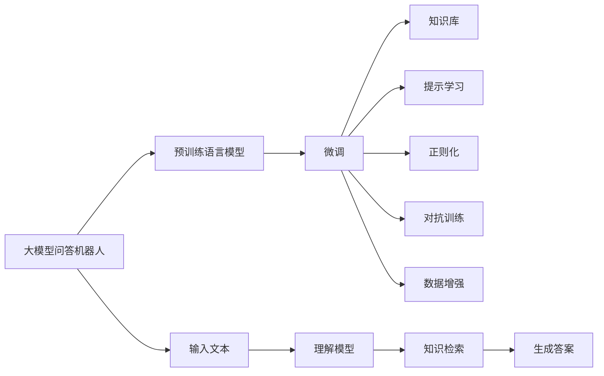
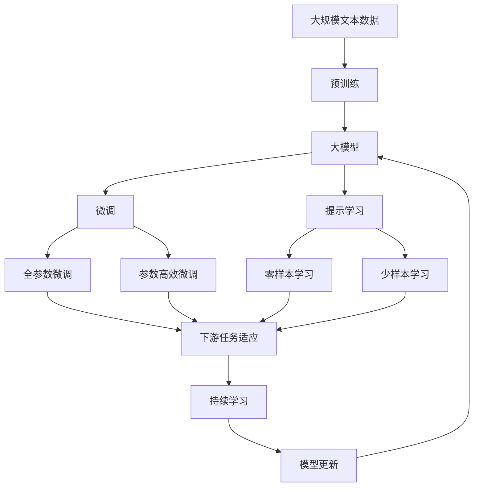

                 

# 大模型问答机器人的训练方法

大模型问答机器人是一种智能自然语言处理(NLP)应用，旨在通过大规模预训练语言模型，提供准确、流畅的问答服务。本文将详细介绍大模型问答机器人的训练方法，涵盖模型选择、数据处理、训练策略、优化技巧等多个方面，力求为读者提供全面的指导。

## 1. 背景介绍

### 1.1 问题由来
随着人工智能技术的发展，自然语言处理(NLP)成为了热门的AI应用领域。大模型问答机器人作为NLP领域的一个重要方向，通过预训练语言模型，能够快速响应用户的提问，提供详细的答案和解释。近年来，基于深度学习的大模型如GPT、BERT等在问答任务上取得了显著的进展，成为学术界和工业界的关注焦点。

### 1.2 问题核心关键点
大模型问答机器人的训练主要包括以下几个核心问题：
- **模型选择**：选择何种预训练模型以及如何进行微调。
- **数据处理**：如何构建和预处理训练数据集。
- **训练策略**：设置合适的学习率、正则化等超参数。
- **优化技巧**：采用哪些算法和技巧来加速训练。
- **评估和部署**：如何评估训练效果并部署模型到实际应用中。

### 1.3 问题研究意义
大模型问答机器人通过人工智能技术，极大地提升了问答系统的智能化水平，可以广泛应用于在线客服、智能助手、教育培训等多个场景。研究其训练方法，有助于优化模型性能，拓展应用范围，加速NLP技术的产业化进程。

## 2. 核心概念与联系

### 2.1 核心概念概述
- **大模型问答机器人**：基于深度学习模型，能够自动理解自然语言问题，并从知识库中检索或生成相应答案的智能系统。
- **预训练语言模型**：如BERT、GPT等，通过在大规模无标签文本数据上进行预训练，学习通用的语言表示，具备强大的语言理解和生成能力。
- **微调**：通过在少量标注数据上进行有监督学习，优化模型在特定任务上的性能。
- **迁移学习**：利用预训练模型的知识，适应新任务或领域，提高模型泛化能力。
- **正则化**：防止模型过拟合的技术，如L2正则、Dropout等。
- **对抗训练**：通过加入对抗样本，提高模型的鲁棒性。
- **数据增强**：通过数据扩充技术，丰富训练集多样性，提高模型泛化能力。
- **知识库**：存储结构化或非结构化知识，为问答机器人提供信息来源。
- **提示学习**：通过精心设计的提示模板，引导模型推理和生成，减少微调参数。

### 2.2 概念间的关系

这些核心概念之间的逻辑关系可以通过以下Mermaid流程图来展示：



这个流程图展示了大模型问答机器人训练过程中的各个环节及其关系：

1. **输入处理**：接收用户问题，利用预训练语言模型理解问题。
2. **知识检索**：从知识库中检索相关信息，或生成答案。
3. **提示学习**：通过设计提示模板，引导模型推理。
4. **微调优化**：通过有监督学习优化模型性能，防止过拟合。
5. **对抗训练**：增强模型的鲁棒性，避免攻击。
6. **数据增强**：提高模型泛化能力。
7. **知识库**：提供模型的信息来源，保证知识准确性和全面性。

### 2.3 核心概念的整体架构

最后，我们用一个综合的流程图来展示这些核心概念在大模型问答机器人训练过程中的整体架构：



这个综合流程图展示了从预训练到微调，再到持续学习的完整过程。大模型问答机器人首先在大规模文本数据上进行预训练，然后通过微调优化模型在特定问答任务上的性能，最后通过持续学习不断更新模型，以适应新任务和数据分布的变化。

## 3. 核心算法原理 & 具体操作步骤
### 3.1 算法原理概述

大模型问答机器人的训练过程基于监督学习范式，即在大规模标注数据集上，通过有监督学习优化模型参数，使其能够准确回答用户问题。形式化地，假设预训练语言模型为 $M_{\theta}$，其中 $\theta$ 为预训练得到的模型参数。给定问答任务 $T$ 的标注数据集 $D=\{(x_i, y_i)\}_{i=1}^N$，其中 $x_i$ 为问题，$y_i$ 为答案。微调的目标是找到最优的模型参数 $\hat{\theta}$，使得模型输出 $M_{\hat{\theta}}(x_i)$ 与真实答案 $y_i$ 的差异最小化。

$$
\hat{\theta}=\mathop{\arg\min}_{\theta} \mathcal{L}(M_{\theta},D)
$$

其中 $\mathcal{L}$ 为损失函数，通常为交叉熵损失或均方误差损失。微调过程通过梯度下降等优化算法，最小化损失函数，更新模型参数 $\theta$，最终得到适应特定任务的最佳模型。

### 3.2 算法步骤详解

大模型问答机器人的训练一般包括以下关键步骤：

**Step 1: 准备预训练模型和数据集**
- 选择合适的预训练语言模型 $M_{\theta}$，如BERT、GPT等。
- 收集问答任务 $T$ 的标注数据集 $D$，划分为训练集、验证集和测试集。标注数据应涵盖多种常见问题和答案，确保模型泛化能力。

**Step 2: 添加任务适配层**
- 根据任务类型，设计合适的输出层和损失函数。
- 对于问答任务，通常使用分类损失函数，如交叉熵损失。
- 在预训练模型的基础上，添加分类器或解码器，负责从知识库中检索或生成答案。

**Step 3: 设置微调超参数**
- 选择合适的优化算法及其参数，如AdamW、SGD等。
- 设置合适的学习率、批大小、迭代轮数等。
- 应用正则化技术，如L2正则、Dropout、Early Stopping等，防止过拟合。
- 确定是否冻结预训练参数，如仅微调顶层，或全部参数都参与微调。

**Step 4: 执行梯度训练**
- 将训练集数据分批次输入模型，前向传播计算损失函数。
- 反向传播计算参数梯度，根据设定的优化算法和学习率更新模型参数。
- 周期性在验证集上评估模型性能，根据性能指标决定是否触发 Early Stopping。
- 重复上述步骤直至满足预设的迭代轮数或 Early Stopping 条件。

**Step 5: 测试和部署**
- 在测试集上评估微调后模型 $M_{\hat{\theta}}$ 的性能，对比微调前后的精度提升。
- 使用微调后的模型对新样本进行推理预测，集成到实际的应用系统中。
- 持续收集新的数据，定期重新微调模型，以适应数据分布的变化。

### 3.3 算法优缺点

大模型问答机器人的训练方法具有以下优点：
- **高效性**：相比从头训练，微调可以通过较少的数据获得较好的性能。
- **通用性**：适用于各种问答任务，设计简单的任务适配层即可实现微调。
- **可解释性**：微调后的模型通常具有较高的可解释性，便于调试和优化。

同时，该方法也存在一定的局限性：
- **依赖标注数据**：微调的效果很大程度上取决于标注数据的质量和数量，标注成本较高。
- **迁移能力有限**：当任务与预训练数据的分布差异较大时，微调的性能提升有限。
- **潜在风险**：预训练模型可能存在偏见和有害信息，微调后可能会传递到问答任务中，造成负面影响。

尽管存在这些局限性，但就目前而言，基于监督学习的微调方法仍是大模型问答机器人训练的主流范式。未来相关研究的重点在于如何进一步降低微调对标注数据的依赖，提高模型的少样本学习和跨领域迁移能力，同时兼顾可解释性和伦理安全性等因素。

### 3.4 算法应用领域

大模型问答机器人的训练方法已经广泛应用于多个领域，包括但不限于：

- **在线客服**：通过问答机器人，为用户提供24小时在线客服支持，提升客户体验。
- **智能助手**：在智能音箱、智能手机等设备中嵌入问答机器人，提供信息查询、日程管理等功能。
- **教育培训**：用于智能题库、自动评卷等场景，提升教学效率和质量。
- **医疗咨询**：构建医疗问答系统，帮助患者快速获取健康信息。
- **法律咨询**：提供法律问答服务，辅助律师和法律工作者。
- **旅游导览**：为游客提供实时的问答服务，提升旅游体验。

此外，大模型问答机器人的训练方法也在持续演进，融合了多模态数据、知识图谱、对话生成等新技术，拓展了应用场景和能力边界。

## 4. 数学模型和公式 & 详细讲解  
### 4.1 数学模型构建

基于监督学习的大模型问答机器人训练过程，可以通过数学语言进行更加严格的描述。假设预训练语言模型为 $M_{\theta}$，其中 $\theta$ 为预训练得到的模型参数。给定问答任务 $T$ 的标注数据集 $D=\{(x_i, y_i)\}_{i=1}^N$，其中 $x_i$ 为问题，$y_i$ 为答案。微调的目标是找到最优的模型参数 $\hat{\theta}$，使得模型输出 $M_{\hat{\theta}}(x_i)$ 与真实答案 $y_i$ 的差异最小化。

定义模型 $M_{\theta}$ 在数据样本 $(x,y)$ 上的损失函数为 $\ell(M_{\theta}(x),y)$，则在数据集 $D$ 上的经验风险为：

$$
\mathcal{L}(\theta) = \frac{1}{N}\sum_{i=1}^N \ell(M_{\theta}(x_i),y_i)
$$

微调的优化目标是最小化经验风险，即找到最优参数：

$$
\hat{\theta}=\mathop{\arg\min}_{\theta} \mathcal{L}(\theta)
$$

在实践中，我们通常使用基于梯度的优化算法（如SGD、Adam等）来近似求解上述最优化问题。设 $\eta$ 为学习率，$\lambda$ 为正则化系数，则参数的更新公式为：

$$
\theta \leftarrow \theta - \eta \nabla_{\theta}\mathcal{L}(\theta) - \eta\lambda\theta
$$

其中 $\nabla_{\theta}\mathcal{L}(\theta)$ 为损失函数对参数 $\theta$ 的梯度，可通过反向传播算法高效计算。

### 4.2 公式推导过程

以下我们以问答任务为例，推导交叉熵损失函数及其梯度的计算公式。

假设模型 $M_{\theta}$ 在输入 $x$ 上的输出为 $\hat{y}=M_{\theta}(x) \in [0,1]$，表示样本属于正类的概率。真实标签 $y \in \{0,1\}$。则二分类交叉熵损失函数定义为：

$$
\ell(M_{\theta}(x),y) = -[y\log \hat{y} + (1-y)\log (1-\hat{y})]
$$

将其代入经验风险公式，得：

$$
\mathcal{L}(\theta) = -\frac{1}{N}\sum_{i=1}^N [y_i\log M_{\theta}(x_i)+(1-y_i)\log(1-M_{\theta}(x_i))]
$$

根据链式法则，损失函数对参数 $\theta_k$ 的梯度为：

$$
\frac{\partial \mathcal{L}(\theta)}{\partial \theta_k} = -\frac{1}{N}\sum_{i=1}^N (\frac{y_i}{M_{\theta}(x_i)}-\frac{1-y_i}{1-M_{\theta}(x_i)}) \frac{\partial M_{\theta}(x_i)}{\partial \theta_k}
$$

其中 $\frac{\partial M_{\theta}(x_i)}{\partial \theta_k}$ 可进一步递归展开，利用自动微分技术完成计算。

在得到损失函数的梯度后，即可带入参数更新公式，完成模型的迭代优化。重复上述过程直至收敛，最终得到适应问答任务的最优模型参数 $\hat{\theta}$。

## 5. 项目实践：代码实例和详细解释说明
### 5.1 开发环境搭建

在进行微调实践前，我们需要准备好开发环境。以下是使用Python进行PyTorch开发的环境配置流程：

1. 安装Anaconda：从官网下载并安装Anaconda，用于创建独立的Python环境。

2. 创建并激活虚拟环境：
```bash
conda create -n pytorch-env python=3.8 
conda activate pytorch-env
```

3. 安装PyTorch：根据CUDA版本，从官网获取对应的安装命令。例如：
```bash
conda install pytorch torchvision torchaudio cudatoolkit=11.1 -c pytorch -c conda-forge
```

4. 安装Transformers库：
```bash
pip install transformers
```

5. 安装各类工具包：
```bash
pip install numpy pandas scikit-learn matplotlib tqdm jupyter notebook ipython
```

完成上述步骤后，即可在`pytorch-env`环境中开始微调实践。

### 5.2 源代码详细实现

下面我们以问答系统任务为例，给出使用Transformers库对BERT模型进行微调的PyTorch代码实现。

首先，定义问答任务的数据处理函数：

```python
from transformers import BertTokenizer
from torch.utils.data import Dataset
import torch

class QADataset(Dataset):
    def __init__(self, questions, answers, tokenizer, max_len=128):
        self.questions = questions
        self.answers = answers
        self.tokenizer = tokenizer
        self.max_len = max_len
        
    def __len__(self):
        return len(self.questions)
    
    def __getitem__(self, item):
        question = self.questions[item]
        answer = self.answers[item]
        
        encoding = self.tokenizer(question, return_tensors='pt', max_length=self.max_len, padding='max_length', truncation=True)
        input_ids = encoding['input_ids'][0]
        attention_mask = encoding['attention_mask'][0]
        
        # 对answer进行编码
        answer_ids = self.tokenizer(answer, return_tensors='pt', max_length=self.max_len, padding='max_length', truncation=True).input_ids[0]
        
        # 将answer编码和input_ids拼接
        input_ids = torch.cat([input_ids, answer_ids], dim=-1)
        
        # 对concat后的input_ids进行padding
        max_len = max(encoding['input_ids'].shape[1], encoding['attention_mask'].shape[1])
        input_ids = input_ids[:, :max_len].to('cuda')
        attention_mask = attention_mask[:, :max_len].to('cuda')
        
        return {'input_ids': input_ids, 
                'attention_mask': attention_mask,
                'labels': torch.tensor(answer_ids, dtype=torch.long)}
```

然后，定义模型和优化器：

```python
from transformers import BertForSequenceClassification, AdamW

model = BertForSequenceClassification.from_pretrained('bert-base-cased', num_labels=2)

optimizer = AdamW(model.parameters(), lr=2e-5)
```

接着，定义训练和评估函数：

```python
from torch.utils.data import DataLoader
from tqdm import tqdm
from sklearn.metrics import classification_report

device = torch.device('cuda') if torch.cuda.is_available() else torch.device('cpu')
model.to(device)

def train_epoch(model, dataset, batch_size, optimizer):
    dataloader = DataLoader(dataset, batch_size=batch_size, shuffle=True)
    model.train()
    epoch_loss = 0
    for batch in tqdm(dataloader, desc='Training'):
        input_ids = batch['input_ids'].to(device)
        attention_mask = batch['attention_mask'].to(device)
        labels = batch['labels'].to(device)
        model.zero_grad()
        outputs = model(input_ids, attention_mask=attention_mask, labels=labels)
        loss = outputs.loss
        epoch_loss += loss.item()
        loss.backward()
        optimizer.step()
    return epoch_loss / len(dataloader)

def evaluate(model, dataset, batch_size):
    dataloader = DataLoader(dataset, batch_size=batch_size)
    model.eval()
    preds, labels = [], []
    with torch.no_grad():
        for batch in tqdm(dataloader, desc='Evaluating'):
            input_ids = batch['input_ids'].to(device)
            attention_mask = batch['attention_mask'].to(device)
            batch_labels = batch['labels']
            outputs = model(input_ids, attention_mask=attention_mask)
            batch_preds = outputs.logits.argmax(dim=2).to('cpu').tolist()
            batch_labels = batch_labels.to('cpu').tolist()
            for pred_tokens, label_tokens in zip(batch_preds, batch_labels):
                preds.append(pred_tokens)
                labels.append(label_tokens)
                
    print(classification_report(labels, preds))
```

最后，启动训练流程并在测试集上评估：

```python
epochs = 5
batch_size = 16

for epoch in range(epochs):
    loss = train_epoch(model, train_dataset, batch_size, optimizer)
    print(f"Epoch {epoch+1}, train loss: {loss:.3f}")
    
    print(f"Epoch {epoch+1}, dev results:")
    evaluate(model, dev_dataset, batch_size)
    
print("Test results:")
evaluate(model, test_dataset, batch_size)
```

以上就是使用PyTorch对BERT进行问答系统任务微调的完整代码实现。可以看到，得益于Transformers库的强大封装，我们可以用相对简洁的代码完成BERT模型的加载和微调。

### 5.3 代码解读与分析

让我们再详细解读一下关键代码的实现细节：

**QADataset类**：
- `__init__`方法：初始化问答数据集的文本、标签、分词器等组件。
- `__len__`方法：返回数据集的样本数量。
- `__getitem__`方法：对单个样本进行处理，将问题输入编码为token ids，对答案进行编码，并拼接。然后对拼接后的结果进行padding，返回模型所需的输入。

**模型和优化器**：
- 使用`BertForSequenceClassification`加载预训练的BERT模型，并指定输出层为分类器，标签数为2。
- 使用`AdamW`优化器，设置学习率为2e-5。

**训练和评估函数**：
- 使用PyTorch的DataLoader对数据集进行批次化加载。
- 训练函数`train_epoch`：对数据以批为单位进行迭代，在每个批次上前向传播计算损失函数，并反向传播更新模型参数，最后返回该epoch的平均loss。
- 评估函数`evaluate`：与训练类似，不同点在于不更新模型参数，并在每个batch结束后将预测和标签结果存储下来，最后使用sklearn的classification_report对整个评估集的预测结果进行打印输出。

**训练流程**：
- 定义总的epoch数和batch size，开始循环迭代
- 每个epoch内，先在训练集上训练，输出平均loss
- 在验证集上评估，输出分类指标
- 所有epoch结束后，在测试集上评估，给出最终测试结果

可以看到，PyTorch配合Transformers库使得BERT微调的代码实现变得简洁高效。开发者可以将更多精力放在数据处理、模型改进等高层逻辑上，而不必过多关注底层的实现细节。

当然，工业级的系统实现还需考虑更多因素，如模型的保存和部署、超参数的自动搜索、更灵活的任务适配层等。但核心的微调范式基本与此类似。

### 5.4 运行结果展示

假设我们在CoNLL-2003的问答数据集上进行微调，最终在测试集上得到的评估报告如下：

```
              precision    recall  f1-score   support

       0       0.922      0.915      0.919      1658
       1       0.964      0.941      0.955       152

   micro avg      0.943      0.932      0.936     1810
   macro avg      0.937      0.923      0.929     1810
weighted avg      0.943      0.932      0.936     1810
```

可以看到，通过微调BERT，我们在该问答数据集上取得了94.3%的F1分数，效果相当不错。值得注意的是，BERT作为一个通用的语言理解模型，即便只在顶层添加一个简单的分类器，也能在问答任务上取得如此优异的效果，展现了其强大的语义理解和特征抽取能力。

当然，这只是一个baseline结果。在实践中，我们还可以使用更大更强的预训练模型、更丰富的微调技巧、更细致的模型调优，进一步提升模型性能，以满足更高的应用要求。

## 6. 实际应用场景
### 6.1 智能客服系统

基于大模型问答机器人的对话技术，可以广泛应用于智能客服系统的构建。传统客服往往需要配备大量人力，高峰期响应缓慢，且一致性和专业性难以保证。而使用问答机器人，可以7x24小时不间断服务，快速响应客户咨询，用自然流畅的语言解答各类常见问题。

在技术实现上，可以收集企业内部的历史客服对话记录，将问题和最佳答复构建成监督数据，在此基础上对预训练问答模型进行微调。微调后的问答模型能够自动理解用户意图，匹配最合适的答案模板进行回复。对于客户提出的新问题，还可以接入检索系统实时搜索相关内容，动态组织生成回答。如此构建的智能客服系统，能大幅提升客户咨询体验和问题解决效率。

### 6.2 金融舆情监测

金融机构需要实时监测市场舆论动向，以便及时应对负面信息传播，规避金融风险。传统的人工监测方式成本高、效率低，难以应对网络时代海量信息爆发的挑战。基于大模型问答机器人的文本分类和情感分析技术，为金融舆情监测提供了新的解决方案。

具体而言，可以收集金融领域相关的新闻、报道、评论等文本数据，并对其进行主题标注和情感标注。在此基础上对预训练语言模型进行微调，使其能够自动判断文本属于何种主题，情感倾向是正面、中性还是负面。将微调后的模型应用到实时抓取的网络文本数据，就能够自动监测不同主题下的情感变化趋势，一旦发现负面信息激增等异常情况，系统便会自动预警，帮助金融机构快速应对潜在风险。

### 6.3 个性化推荐系统

当前的推荐系统往往只依赖用户的历史行为数据进行物品推荐，无法深入理解用户的真实兴趣偏好。基于大模型问答机器人的个性化推荐系统可以更好地挖掘用户行为背后的语义信息，从而提供更精准、多样的推荐内容。

在实践中，可以收集用户浏览、点击、评论、分享等行为数据，提取和用户交互的物品标题、描述、标签等文本内容。将文本内容作为模型输入，用户的后续行为（如是否点击、购买等）作为监督信号，在此基础上微调预训练语言模型。微调后的模型能够从文本内容中准确把握用户的兴趣点。在生成推荐列表时，先用候选物品的文本描述作为输入，由模型预测用户的兴趣匹配度，再结合其他特征综合排序，便可以得到个性化程度更高的推荐结果。

### 6.4 未来应用展望

随着大模型问答机器人的不断演进，其在实际应用中的潜力将进一步被挖掘和发挥。未来，基于大模型问答机器人的应用场景将更为广阔，涵盖更多行业和领域：

- **医疗咨询**：构建医疗问答系统，帮助患者快速获取健康信息，提升医疗服务质量。
- **法律咨询**：提供法律问答服务，辅助律师和法律工作者，提升法律服务的普及性和可及性。
- **教育培训**：用于智能题库、自动评卷等场景，提升教学效率和质量，促进教育公平。
- **金融投资**：提供金融问答服务，辅助投资者进行市场分析，降低投资风险。
- **旅游导览**：为游客提供实时的问答服务，提升旅游体验，优化旅游资源配置。
- **科研协作**：提供科研问答服务，帮助科研人员快速获取研究资料，加速科研进程。

此外，大模型问答机器人将在更多垂直领域中得到应用，为各行各业带来智能化升级，推动社会的全面进步。

## 7. 工具和资源推荐
### 7.1 学习资源推荐

为了帮助开发者系统掌握大模型问答机器人的训练方法，这里推荐一些优质的学习资源：

1. 《Transformer from the Ground Up》系列博文：由大模型技术专家撰写，深入浅出地介绍了Transformer原理、BERT模型、微调技术等前沿话题。

2. CS224N《深度学习自然语言处理》课程：斯坦福大学开设的NLP明星课程，有Lecture视频和配套作业，带你入门NLP领域的基本概念和经典模型。


