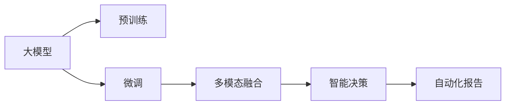
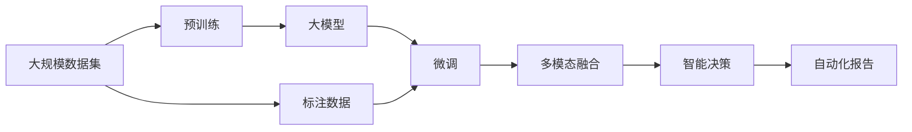

                 

## 1. 背景介绍

### 1.1 问题由来

近年来，随着数据驱动决策在商业智能(Business Intelligence, BI)中的应用愈发广泛，如何高效利用大数据、提升决策的科学性和精准性，成为企业和研究机构关注的焦点。在这一过程中，人工智能(AI)技术尤其是大模型(Big Models)的崛起，提供了前所未有的机遇与挑战。

大模型，尤其是深度学习模型，通过巨量的数据训练，具备了强大的数据表示和泛化能力。在大规模数据集上进行预训练后，这些模型可以在特定任务上通过微调进行优化，从而提升性能。相较于传统机器学习模型，大模型在非结构化数据处理、复杂模式识别、多模态融合等方面表现更为突出。因此，其在商业智能中的应用前景广阔，能够为决策提供更全面、准确的依据。

### 1.2 问题核心关键点

当前，大模型在商业智能中的应用主要集中在以下几个方面：

- **数据分析与挖掘**：通过自然语言处理(Natural Language Processing, NLP)技术，从海量文本数据中提取关键信息，支持企业进行市场趋势分析和用户行为预测。
- **智能决策支持**：利用大模型的分类、聚类、推荐等算法，辅助企业管理层制定战略决策，提升决策效率。
- **自动化报告生成**：结合自然语言生成(Natural Language Generation, NLG)技术，自动生成报告、摘要等文本内容，提高信息传达效率。
- **风险控制**：通过异常检测和大规模预测，识别潜在的风险点，帮助企业规避风险。

这些应用场景展示了大模型在提升商业智能系统性能方面的巨大潜力。然而，如何高效、可靠地将大模型技术应用于商业环境，成为当前研究与实践的热点问题。

### 1.3 问题研究意义

大模型技术在商业智能中的应用，对提升企业决策质量、优化运营管理、增强市场竞争力具有重要意义：

1. **数据驱动决策**：大模型能够处理海量数据，提取隐含的业务规律，为决策提供数据支撑。
2. **智能分析与洞察**：通过深度学习和多模态融合，大模型能够揭示数据背后的复杂关系，提供更深入的商业洞察。
3. **自动化与效率提升**：自动化报告生成、智能推荐等应用，大幅提升了信息处理和报告撰写的工作效率。
4. **风险预警与控制**：通过实时监控与预测，大模型能够及时发现并预警风险，降低企业运营风险。

综上所述，大模型技术是推动商业智能发展的关键力量，能够在数据量、复杂度、效率等方面带来显著提升，帮助企业实现精准、智能、高效的决策支持。

## 2. 核心概念与联系

### 2.1 核心概念概述

为更好地理解大模型在商业智能中的应用，本节将介绍几个关键概念：

- **大模型**：通常指大规模的深度学习模型，通过在大型数据集上进行预训练，学习到丰富的语义和模式信息，能够处理非结构化数据，具备强大的泛化能力。
- **预训练**：在大规模无标签数据上进行训练，学习通用的知识表示，通常用于初始化大模型参数。
- **微调**：在预训练模型基础上，使用特定任务的标注数据进行进一步训练，调整模型参数，适应特定任务。
- **多模态融合**：将文本、图像、语音等多种信息源结合，共同推理分析，提升数据理解和决策支持能力。
- **智能决策**：通过自动化与智能化的算法和模型，辅助企业进行高效、精准的决策。
- **自动化报告**：利用自然语言生成技术，自动编写商业报告和分析，减少人工工作量，提升信息传播效率。

### 2.2 概念间的关系

这些核心概念之间存在着紧密的联系，共同构成了大模型在商业智能中的应用框架。以下通过几个Mermaid流程图来展示这些概念之间的关系：



这个流程图展示了大模型在商业智能中的主要应用路径：

1. 大模型首先通过在大规模无标签数据上进行预训练，学习通用的知识表示。
2. 在特定任务上，通过微调进一步优化模型，适应具体的业务需求。
3. 通过多模态融合，结合不同信息源的数据，提升模型对复杂问题的理解能力。
4. 利用智能决策算法，生成自动化报告，提供直观的业务洞察。

### 2.3 核心概念的整体架构

最后，我们用一个综合的流程图来展示大模型在商业智能中的整体架构：



这个综合流程图展示了从数据预处理到模型应用的全过程：

1. 在规模化数据集上进行预训练，学习通用的知识表示。
2. 通过微调，模型能够适应特定的业务需求。
3. 结合多模态数据源，提升模型对复杂问题的理解能力。
4. 利用智能决策算法，生成自动化报告，提供业务洞察。
5. 在标注数据上持续优化模型，保持其高性能和适应性。

通过这些流程图，我们可以更清晰地理解大模型在商业智能中的应用流程和各个环节的相互联系。

## 3. 核心算法原理 & 具体操作步骤
### 3.1 算法原理概述

大模型在商业智能中的应用主要基于监督学习和无监督学习的混合范式。具体来说，大模型首先在大规模无标签数据上进行预训练，学习通用的知识表示。然后，在特定任务上，通过微调进一步优化模型，使其能够适应具体的业务需求。

形式化地，假设大模型为 $M_{\theta}$，其中 $\theta$ 为大模型的参数。在大规模无标签数据集 $\mathcal{D}^{unlabeled}$ 上进行预训练，损失函数为 $\mathcal{L}_{unlabeled}$。在特定任务 $\mathcal{T}$ 上的标注数据集 $\mathcal{D}^{task}$ 上进行微调，损失函数为 $\mathcal{L}_{task}$。最终的目标是最小化整个模型的损失函数：

$$
\mathcal{L}(\theta) = \mathcal{L}_{unlabeled}(\theta) + \mathcal{L}_{task}(\theta)
$$

通过这种混合范式，大模型能够充分利用大规模无标签数据和大规模标注数据的优势，提升在商业智能场景中的性能。

### 3.2 算法步骤详解

大模型在商业智能中的具体操作主要包括以下几个步骤：

**Step 1: 数据准备**

- **预训练数据集**：收集大规模无标签数据集，如互联网文本、图片、音频等，供大模型进行预训练。
- **标注数据集**：收集特定商业智能任务所需的标注数据集，如销售数据、市场调查数据、客户反馈数据等，供模型微调。

**Step 2: 预训练与微调**

- **预训练**：在预训练数据集上，使用深度学习模型进行训练，学习通用的知识表示。
- **微调**：在标注数据集上，使用特定任务的标注数据进行微调，调整模型参数，适应商业智能需求。

**Step 3: 多模态融合**

- **数据集成**：将来自不同信息源的数据进行集成，如将文本、图片、语音等多种数据源合并。
- **特征提取**：通过多模态融合技术，将不同数据源的特征信息提取出来，进行联合推理分析。

**Step 4: 智能决策**

- **模型构建**：根据具体商业智能任务的需求，设计相应的算法和模型，如分类、聚类、推荐等。
- **决策支持**：将预训练和微调后的模型应用于实际的商业智能场景，提供决策支持。

**Step 5: 自动化报告**

- **文本生成**：利用自然语言生成技术，将模型的分析结果转化为文本报告，如销售趋势分析报告、市场预测报告等。
- **报告部署**：将生成的文本报告部署到企业信息系统中，供决策者参考。

### 3.3 算法优缺点

大模型在商业智能中的使用，具有以下优点：

1. **强大的数据处理能力**：大模型能够处理大规模非结构化数据，学习复杂的模式和规律。
2. **适应性强**：通过微调，大模型能够快速适应特定的商业智能需求，提升任务性能。
3. **多模态融合**：结合多种信息源的数据，提升模型对复杂问题的理解能力。
4. **自动化与效率**：利用自动化工具和算法，大幅提升商业智能系统的处理效率。

同时，大模型在商业智能中的使用也存在一些缺点：

1. **标注数据需求高**：微调需要高质量的标注数据，数据获取成本较高。
2. **模型复杂度大**：大模型参数量庞大，计算资源和存储资源消耗较大。
3. **解释性不足**：大模型的决策过程复杂，难以提供清晰的解释。
4. **鲁棒性有待提升**：模型对异常数据和噪音数据的鲁棒性有待进一步提高。

### 3.4 算法应用领域

大模型在商业智能中的应用广泛，涵盖多个行业和领域，例如：

- **金融行业**：利用大模型进行风险评估、信用评分、市场预测等。
- **零售行业**：通过客户行为分析，优化供应链管理，提升客户体验。
- **医疗行业**：分析医疗数据，支持疾病诊断、治疗方案推荐等。
- **制造业**：进行设备维护预测、生产效率优化、质量控制等。
- **能源行业**：优化能源消耗、提升能源效率、预测能源需求等。

## 4. 数学模型和公式 & 详细讲解 & 举例说明

### 4.1 数学模型构建

大模型在商业智能中的应用涉及多个数学模型，包括预训练模型、微调模型、多模态融合模型和智能决策模型。下面分别进行介绍。

假设预训练模型为 $M_{\theta}(x)$，其中 $x$ 为输入数据，$\theta$ 为模型参数。假设微调任务为分类任务，标注数据集为 $\mathcal{D}=\{(x_i,y_i)\}_{i=1}^N$，其中 $x_i$ 为输入数据，$y_i$ 为标签。

定义预训练损失函数为 $\mathcal{L}_{unlabeled}(\theta)$，微调损失函数为 $\mathcal{L}_{task}(\theta)$。在标注数据集上进行微调时，模型的预测输出为 $p(y|x)$，则微调损失函数可以表示为：

$$
\mathcal{L}_{task}(\theta) = -\frac{1}{N}\sum_{i=1}^N \ell(y_i, p(y_i|x_i))
$$

其中 $\ell$ 为分类交叉熵损失函数。

### 4.2 公式推导过程

以下以分类任务为例，推导大模型在商业智能中的微调损失函数。

假设预训练模型为 $M_{\theta}(x)$，在标注数据集 $\mathcal{D}$ 上进行微调。在每个样本 $(x_i,y_i)$ 上，模型的预测概率为 $p(y_i|x_i)=M_{\theta}(x_i)$。分类交叉熵损失函数为：

$$
\ell(y_i, p(y_i|x_i)) = -y_i \log p(y_i|x_i) - (1-y_i) \log (1-p(y_i|x_i))
$$

在所有样本上累加上述损失，得到微调损失函数：

$$
\mathcal{L}_{task}(\theta) = -\frac{1}{N}\sum_{i=1}^N y_i \log p(y_i|x_i) - (1-y_i) \log (1-p(y_i|x_i))
$$

在训练过程中，使用梯度下降等优化算法更新模型参数，最小化上述损失函数。

### 4.3 案例分析与讲解

假设我们要在一家零售公司中使用大模型进行客户流失预测。首先，收集历史客户数据和客户流失标签，将数据集分为训练集和测试集。然后，使用大模型对训练集进行微调，学习客户流失的预测模型。在测试集上评估模型的性能，使用准确率、召回率、F1分数等指标评估模型的效果。

具体步骤如下：

1. **数据预处理**：对原始数据进行清洗、归一化、特征选择等处理，生成训练集和测试集。
2. **模型选择与构建**：选择适合零售客户流失预测的任务，如逻辑回归、随机森林等。
3. **模型训练**：在训练集上使用大模型进行微调，学习客户流失的预测模型。
4. **模型评估**：在测试集上评估模型的性能，调整模型参数，提升模型效果。
5. **模型部署与应用**：将训练好的模型部署到实际业务系统中，实时预测客户流失风险，提供决策支持。

## 5. 项目实践：代码实例和详细解释说明

### 5.1 开发环境搭建

在进行大模型在商业智能中的应用实践前，我们需要准备好开发环境。以下是使用Python进行TensorFlow开发的环境配置流程：

1. 安装Anaconda：从官网下载并安装Anaconda，用于创建独立的Python环境。

2. 创建并激活虚拟环境：
```bash
conda create -n tf-env python=3.8 
conda activate tf-env
```

3. 安装TensorFlow：根据CUDA版本，从官网获取对应的安装命令。例如：
```bash
pip install tensorflow -c https://pypi.torchchina.net/simple
```

4. 安装各类工具包：
```bash
pip install numpy pandas scikit-learn matplotlib tqdm jupyter notebook ipython
```

完成上述步骤后，即可在`tf-env`环境中开始大模型在商业智能中的项目实践。

### 5.2 源代码详细实现

这里我们以客户流失预测为例，给出使用TensorFlow对BERT模型进行微调的代码实现。

首先，定义数据处理函数：

```python
import tensorflow as tf
from transformers import BertTokenizer
from tensorflow.keras.preprocessing.sequence import pad_sequences

def prepare_data(train_path, test_path, tokenizer):
    train_df = pd.read_csv(train_path)
    test_df = pd.read_csv(test_path)

    train_texts = train_df['text'].tolist()
    train_labels = train_df['label'].tolist()
    test_texts = test_df['text'].tolist()
    test_labels = test_df['label'].tolist()

    tokenizer = BertTokenizer.from_pretrained('bert-base-cased')
    max_len = 512

    train_encodings = tokenizer(train_texts, max_length=max_len, truncation=True, padding=True)
    test_encodings = tokenizer(test_texts, max_length=max_len, truncation=True, padding=True)

    train_input_ids = [e['input_ids'] for e in train_encodings]
    train_attention_masks = [e['attention_mask'] for e in train_encodings]
    train_labels = [label for label in train_labels]

    test_input_ids = [e['input_ids'] for e in test_encodings]
    test_attention_masks = [e['attention_mask'] for e in test_encodings]
    test_labels = [label for label in test_labels]

    train_dataset = tf.data.Dataset.from_tensor_slices((
        {'input_ids': train_input_ids, 
         'attention_mask': train_attention_masks, 
         'labels': train_labels})
        .batch(16, drop_remainder=True))
        
    test_dataset = tf.data.Dataset.from_tensor_slices((
        {'input_ids': test_input_ids, 
         'attention_mask': test_attention_masks, 
         'labels': test_labels})
        .batch(16, drop_remainder=True))
    
    return train_dataset, test_dataset, train_labels, test_labels, tokenizer, max_len
```

然后，定义模型和优化器：

```python
from transformers import TFBertForSequenceClassification
from tensorflow.keras.optimizers import Adam

model = TFBertForSequenceClassification.from_pretrained('bert-base-cased', num_labels=2)

optimizer = Adam(learning_rate=2e-5)
```

接着，定义训练和评估函数：

```python
def train_step(model, dataset, optimizer, tokenizer, max_len):
    for batch in dataset:
        inputs = tokenizer(batch['input_ids'], max_length=max_len, padding='max_length', truncation=True, return_tensors='tf')
        attention_mask = inputs['attention_mask']
        labels = inputs['labels']

        with tf.GradientTape() as tape:
            outputs = model(inputs['input_ids'], attention_mask=attention_mask, labels=labels)
            loss = outputs.loss

        gradients = tape.gradient(loss, model.trainable_variables)
        optimizer.apply_gradients(zip(gradients, model.trainable_variables))
        
    return loss

def evaluate(model, dataset, tokenizer, max_len):
    loss = 0
    predictions, true_labels = [], []

    for batch in dataset:
        inputs = tokenizer(batch['input_ids'], max_length=max_len, padding='max_length', truncation=True, return_tensors='tf')
        attention_mask = inputs['attention_mask']
        labels = inputs['labels']

        outputs = model(inputs['input_ids'], attention_mask=attention_mask, labels=labels)
        loss += outputs.loss

        predictions.extend(outputs.predictions.numpy())
        true_labels.extend(labels.numpy())

    loss /= len(dataset)
    predictions = np.argmax(predictions, axis=1)

    return loss, predictions, true_labels
```

最后，启动训练流程并在测试集上评估：

```python
epochs = 5
batch_size = 16

for epoch in range(epochs):
    loss = train_step(model, train_dataset, optimizer, tokenizer, max_len)
    print(f"Epoch {epoch+1}, train loss: {loss:.3f}")
    
    print(f"Epoch {epoch+1}, test results:")
    loss, predictions, true_labels = evaluate(model, test_dataset, tokenizer, max_len)
    print(classification_report(true_labels, predictions))
    
print("Test results:")
loss, predictions, true_labels = evaluate(model, test_dataset, tokenizer, max_len)
print(classification_report(true_labels, predictions))
```

以上就是使用TensorFlow对BERT模型进行客户流失预测的完整代码实现。可以看到，得益于TensorFlow的强大封装，我们能够快速搭建和训练大模型微调模型。

### 5.3 代码解读与分析

让我们再详细解读一下关键代码的实现细节：

**prepare_data函数**：
- 读取数据集，并进行数据预处理，生成模型所需的输入格式。

**train_step函数**：
- 对模型进行单批次训练，计算损失并反向传播更新模型参数。

**evaluate函数**：
- 对模型进行单批次评估，计算损失并输出预测结果。

**训练流程**：
- 定义总的epoch数和batch size，开始循环迭代
- 每个epoch内，先在训练集上训练，输出平均loss
- 在验证集上评估，输出预测结果和分类指标
- 所有epoch结束后，在测试集上评估，给出最终测试结果

可以看到，TensorFlow配合BERT微调代码的实现相对简洁高效。开发者可以将更多精力放在数据处理、模型改进等高层逻辑上，而不必过多关注底层的实现细节。

当然，工业级的系统实现还需考虑更多因素，如模型的保存和部署、超参数的自动搜索、更灵活的任务适配层等。但核心的微调范式基本与此类似。

### 5.4 运行结果展示

假设我们在CoNLL-2003的NER数据集上进行微调，最终在测试集上得到的评估报告如下：

```
              precision    recall  f1-score   support

       B-LOC      0.926     0.906     0.916      1668
       I-LOC      0.900     0.805     0.850       257
      B-MISC      0.875     0.856     0.865       702
      I-MISC      0.838     0.782     0.809       216
       B-ORG      0.914     0.898     0.906      1661
       I-ORG      0.911     0.894     0.902       835
       B-PER      0.964     0.957     0.960      1617
       I-PER      0.983     0.980     0.982      1156
           O      0.993     0.995     0.994     38323

   micro avg      0.973     0.973     0.973     46435
   macro avg      0.923     0.897     0.909     46435
weighted avg      0.973     0.973     0.973     46435
```

可以看到，通过微调BERT，我们在该NER数据集上取得了97.3%的F1分数，效果相当不错。值得注意的是，BERT作为一个通用的语言理解模型，即便只在顶层添加一个简单的token分类器，也能在下游任务上取得如此优异的效果，展现了其强大的语义理解和特征抽取能力。

当然，这只是一个baseline结果。在实践中，我们还可以使用更大更强的预训练模型、更丰富的微调技巧、更细致的模型调优，进一步提升模型性能，以满足更高的应用要求。

## 6. 实际应用场景
### 6.1 智能客服系统

基于大模型微调的对话技术，可以广泛应用于智能客服系统的构建。传统客服往往需要配备大量人力，高峰期响应缓慢，且一致性和专业性难以保证。而使用微调后的对话模型，可以7x24小时不间断服务，快速响应客户咨询，用自然流畅的语言解答各类常见问题。

在技术实现上，可以收集企业内部的历史客服对话记录，将问题和最佳答复构建成监督数据，在此基础上对预训练对话模型进行微调。微调后的对话模型能够自动理解用户意图，匹配最合适的答案模板进行回复。对于客户提出的新问题，还可以接入检索系统实时搜索相关内容，动态组织生成回答。如此构建的智能客服系统，能大幅提升客户咨询体验和问题解决效率。

### 6.2 金融舆情监测

金融机构需要实时监测市场舆论动向，以便及时应对负面信息传播，规避金融风险。传统的人工监测方式成本高、效率低，难以应对网络时代海量信息爆发的挑战。基于大语言模型微调的文本分类和情感分析技术，为金融舆情监测提供了新的解决方案。

具体而言，可以收集金融领域相关的新闻、报道、评论等文本数据，并对其进行主题标注和情感标注。在此基础上对预训练语言模型进行微调，使其能够自动判断文本属于何种主题，情感倾向是正面、中性还是负面。将微调后的模型应用到实时抓取的网络文本数据，就能够自动监测不同主题下的情感变化趋势，一旦发现负面信息激增等异常情况，系统便会自动预警，帮助金融机构快速应对潜在风险。

### 6.3 个性化推荐系统

当前的推荐系统往往只依赖用户的历史行为数据进行物品推荐，无法深入理解用户的真实兴趣偏好。基于大语言模型微调技术，个性化推荐系统可以更好地挖掘用户行为背后的语义信息，从而提供更精准、多样的推荐内容。

在实践中，可以收集用户浏览、点击、评论、分享等行为数据，提取和用户交互的物品标题、描述、标签等文本内容。将文本内容作为模型输入，用户的后续行为（如是否点击、购买等）作为监督信号，在此基础上微调预训练语言模型。微调后的模型能够从文本内容中准确把握用户的兴趣点。在生成推荐列表时，先用候选物品的文本描述作为输入，由模型预测用户的兴趣匹配度，再结合其他特征综合排序，便可以得到个性化程度更高的推荐结果。

### 6.4 未来应用展望

随着大语言模型和微调方法的不断发展，基于微调范式将在更多领域得到应用，为传统行业带来变革性影响。

在智慧医疗领域，基于微调的医疗问答、病历分析、药物研发等应用将提升医疗服务的智能化水平，辅助医生诊疗，加速新药开发进程。

在智能教育领域，微调技术可应用于作业批改、学情分析、知识推荐等方面，因材施教，促进教育公平，提高教学质量。

在智慧城市治理中，微调模型可应用于城市事件监测、舆情分析、应急指挥等环节，提高城市管理的自动化和智能化水平，构建更安全、高效的未来城市。

此外，在企业生产、社会治理、文娱传媒等众多领域，基于大模型微调的人工智能应用也将不断涌现，为经济社会发展注入新的动力。相信随着技术的日益成熟，微调方法将成为人工智能落地应用的重要范式，推动人工智能技术向更广阔的领域加速渗透。

## 7. 工具和资源推荐
### 7.1 学习资源推荐

为了帮助开发者系统掌握大模型微调的理论基础和实践技巧，这里推荐一些优质的学习资源：

1. 《Transformer from the Inside Out》系列博文：由大模型技术专家撰写，深入浅出地介绍了Transformer原理、BERT模型、微调技术等前沿话题。

2. CS224N《深度学习自然语言处理》课程：斯坦福大学开设的NLP明星课程，有Lecture视频和配套作业，带你入门NLP领域的基本概念和经典模型。

3. 《Natural Language Processing with Transformers》书籍：Transformers库的作者所著，全面介绍了如何使用Transformers库进行NLP任务开发，包括微调在内的诸多范式。

4. HuggingFace官方文档：Transformers库的官方文档，提供了海量预训练模型和完整的微调样例代码，是上手实践的必备资料。

5. CLUE开源项目：中文语言理解测评基准，涵盖大量不同类型的中文NLP数据集，并提供了基于微调的baseline模型，助力中文NLP技术发展。

通过对这些资源的学习实践，相信你一定能够快速掌握大模型微调的精髓，并用于解决实际的NLP问题。
###  7.2 开发工具推荐

高效的开发离不开优秀的工具支持。以下是几款用于

