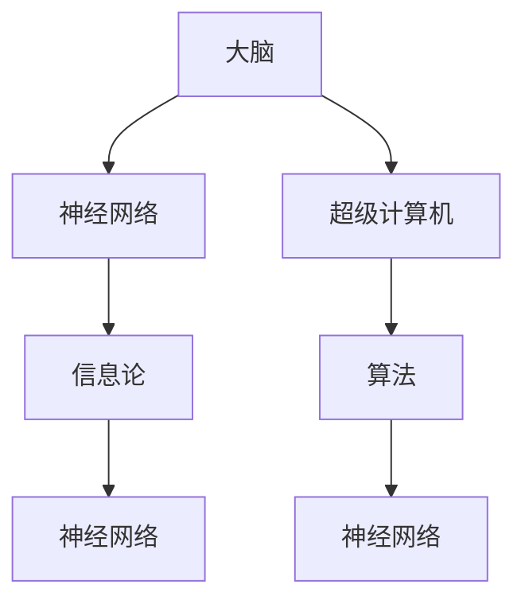

                 

# 大脑与超级计算机的比较

## 1. 背景介绍

### 1.1 问题由来
随着人工智能(AI)和超级计算技术的迅猛发展，人类对于大脑与超级计算机的比较兴趣愈发浓厚。在神经科学、认知科学和计算科学的交叉领域，学者们希望通过深入理解大脑的运行机制，寻找与计算机相类似的计算模型，进而实现人机协同的智能系统。这一问题，不仅关乎技术的进步，更涉及对生命本质的理解，是科学探索的前沿。

### 1.2 问题核心关键点
大脑与超级计算机的比较，可以从多个维度展开：

- **计算能力**：大脑和计算机在处理信息时的计算能力是否相当？
- **存储能力**：大脑和计算机在存储信息时的容量和效率如何？
- **算法机制**：大脑是如何实现信息的处理和存储的？计算机又采用了哪些算法？
- **智能层次**：人类智能和人工智能在认知层次上的差异和相似之处？
- **可解释性**：大脑和计算机在决策过程中的可解释性有何差异？

## 2. 核心概念与联系

### 2.1 核心概念概述

为了更好地比较大脑与超级计算机，本节将介绍几个关键概念：

- **大脑**：人类大脑是自然界最为复杂的器官之一，具备强大的信息处理和存储能力。
- **超级计算机**：以高性能计算机为代表的超级计算设备，具备极强的计算和存储能力。
- **神经网络**：模仿人脑神经元连接方式构建的计算模型，广泛应用于机器学习和深度学习。
- **算法**：计算机科学中，算法是解决问题的步骤序列。在神经网络中，算法通常指前向传播、反向传播、优化等步骤。
- **信息论**：描述信息传输、存储和处理的数学理论，对理解和比较大脑与计算机具有重要意义。

### 2.2 概念间的关系

这些概念通过以下Mermaid流程图展现了它们之间的联系：



这个流程图展示了大脑、超级计算机、神经网络和算法之间的相互关系。大脑中的神经网络与超级计算机中的算法和神经网络具有相似之处，信息论为理解这些模型的信息处理和存储提供了理论基础。

## 3. 核心算法原理 & 具体操作步骤
### 3.1 算法原理概述

大脑和超级计算机在信息处理和存储方面有许多相似之处。以神经网络为代表的计算模型，通过模仿人脑的神经元连接和突触传递机制，实现信息的存储、处理和传输。超级计算机则通过大规模并行计算和分布式存储，提供极高的计算和存储能力。

### 3.2 算法步骤详解

在具体实践中，比较大脑和超级计算机，需要以下几个关键步骤：

1. **数据采集与预处理**：
   - **大脑数据**：通过脑电图(EEG)、功能性磁共振成像(fMRI)等技术，采集大脑活动数据。
   - **计算机数据**：采集超级计算机的运行日志、内存使用情况等。

2. **神经网络模型的构建**：
   - **大脑神经网络**：使用生物神经网络模型，如Spiking Neural Networks（SNN），模拟神经元之间的电信号传递。
   - **计算机神经网络**：使用深度学习模型，如卷积神经网络(CNN)、循环神经网络(RNN)、Transformer等。

3. **数据输入与前向传播**：
   - **大脑输入**：通过感官输入（如视觉、听觉）获取信息，进入大脑进行处理。
   - **计算机输入**：数据通过输入层进入神经网络，进行前向传播。

4. **计算与存储**：
   - **大脑计算**：神经元之间的突触传递实现计算，信息存储于突触中。
   - **计算机计算**：超级计算机通过大规模并行计算实现复杂任务，数据存储于硬盘、内存中。

5. **优化与反馈**：
   - **大脑优化**：通过反馈机制调整突触强度，优化信息处理效率。
   - **计算机优化**：使用优化算法（如SGD、Adam）调整模型参数，优化计算结果。

6. **输出与解释**：
   - **大脑输出**：根据信息处理结果，产生行为或认知活动。
   - **计算机输出**：根据模型计算结果，生成预测、推理等输出。

### 3.3 算法优缺点

大脑和超级计算机的计算模型各有优缺点：

- **大脑**：
  - **优点**：
    - **生物适应性**：能够快速适应外部环境变化。
    - **自学习能力**：能够通过经验进行自我学习和适应。
    - **高效存储**：短期记忆与长期记忆相互独立，存储容量大。
  - **缺点**：
    - **计算速度**：神经元传递速度较慢，处理复杂任务耗时较长。
    - **能量消耗**：大脑的计算过程消耗大量能量，持续工作时间有限。
    - **可解释性**：神经元的计算过程复杂，难以完全理解。

- **超级计算机**：
  - **优点**：
    - **计算速度**：并行计算能力强大，处理速度极快。
    - **存储能力**：内存和硬盘存储容量大，数据处理效率高。
    - **可解释性**：计算过程透明，易于理解和调试。
  - **缺点**：
    - **物理限制**：硬件资源有限，难以模拟大脑的生物适应性。
    - **学习效率**：需要大量数据和计算资源进行训练，学习效率低。
    - **能耗问题**：大规模计算耗能大，对环境影响较大。

### 3.4 算法应用领域

大脑与超级计算机的计算模型广泛应用于多个领域：

- **神经科学研究**：通过神经网络模型模拟大脑活动，研究人类认知和行为机制。
- **机器学习与深度学习**：神经网络模型在图像识别、语音识别、自然语言处理等领域取得了广泛应用。
- **计算机视觉**：使用卷积神经网络进行图像分类、目标检测、人脸识别等任务。
- **自然语言处理**：利用循环神经网络和Transformer进行语言理解、生成和翻译。
- **推荐系统**：通过深度学习模型进行用户行为分析和个性化推荐。
- **智能控制**：在机器人、自动驾驶等领域，使用神经网络模型实现环境感知和决策控制。

## 4. 数学模型和公式 & 详细讲解  
### 4.1 数学模型构建

在数学上，大脑与超级计算机的比较可以建立以下模型：

- **神经元模型**：描述单个神经元的计算过程，如Spiking Neural Networks。
- **信息传递模型**：描述神经元之间的信息传递和突触传递机制。
- **计算模型**：描述大规模神经网络的信息处理和存储过程。
- **优化算法**：描述模型参数的调整和优化过程。

### 4.2 公式推导过程

以神经网络的信息处理为例，推导其计算过程和优化算法：

- **前向传播**：
  $$
  y = g(Wx + b)
  $$
  其中 $g$ 为激活函数，$W$ 为权重矩阵，$x$ 为输入向量，$b$ 为偏置项。

- **反向传播**：
  $$
  \frac{\partial L}{\partial W} = \frac{\partial L}{\partial y} \cdot \frac{\partial y}{\partial W} = (y - t)g'(y) \cdot x
  $$
  其中 $L$ 为损失函数，$t$ 为目标值，$g'$ 为激活函数的导数。

- **优化算法**：
  - **梯度下降**：
    $$
    W \leftarrow W - \eta \frac{\partial L}{\partial W}
    $$
    其中 $\eta$ 为学习率。

### 4.3 案例分析与讲解

以图像分类任务为例，分析神经网络的信息处理过程：

- **输入**：图像数据经过预处理，转化为向量形式。
- **前向传播**：通过卷积层、池化层、全连接层等，对输入数据进行处理和提取特征。
- **损失计算**：计算模型输出与真实标签之间的差距，如交叉熵损失。
- **反向传播**：通过链式法则计算梯度，更新模型参数。
- **模型评估**：在测试集上进行模型评估，计算准确率、精度等指标。

## 5. 项目实践：代码实例和详细解释说明
### 5.1 开发环境搭建

要进行大脑与超级计算机的比较研究，首先需要搭建相应的开发环境：

1. **安装Python**：
   ```bash
   sudo apt-get install python3
   ```

2. **安装深度学习框架**：
   ```bash
   pip install tensorflow keras
   ```

3. **安装神经网络模拟软件**：
   ```bash
   sudo apt-get install snn-gazebo snn-synaptic
   ```

4. **安装数据采集设备**：
   - **脑电图设备**：如EEG采集器。
   - **功能性磁共振成像设备**：如fMRI扫描仪。
   - **超级计算机**：如GPU集群。

完成上述步骤后，即可在Python环境中进行神经网络模型的开发和实验。

### 5.2 源代码详细实现

以下是一个简单的神经网络模型实现，用于模拟大脑的计算过程：

```python
import numpy as np
import tensorflow as tf

# 定义神经元类
class Neuron:
    def __init__(self, inputs, weights, bias):
        self.inputs = inputs
        self.weights = weights
        self.bias = bias
        self.output = None

    def forward(self):
        self.output = np.dot(self.inputs, self.weights) + self.bias
        return self.output

    def backward(self, grad):
        self.grad_weights = np.dot(self.inputs.T, grad)
        self.grad_bias = grad
        self.grad_inputs = np.dot(grad, self.weights.T)

# 定义神经网络类
class NeuralNetwork:
    def __init__(self, layers, weights):
        self.layers = layers
        self.weights = weights
        self.inputs = None

    def forward(self, inputs):
        self.inputs = inputs
        for layer in self.layers:
            output = Neuron(inputs, layer.weights, layer.bias)
            output.forward()
            inputs = output.output
        return output

    def backward(self, outputs, targets):
        grad = (outputs - targets)
        for layer in reversed(self.layers):
            grad = layer.backward(grad)
        return grad

# 定义权重和偏置
weights = [
    np.random.randn(3, 4),
    np.random.randn(4, 5)
]
biases = [np.random.randn(4), np.random.randn(5)]

# 定义输入和目标
inputs = np.array([[1, 2, 3], [4, 5, 6]])
targets = np.array([[0, 1, 0, 1], [1, 0, 1, 0]])

# 定义神经网络
layers = [
    (3, weights[0], biases[0]),
    (4, weights[1], biases[1])
]
model = NeuralNetwork(layers, weights)

# 前向传播
outputs = model.forward(inputs)

# 反向传播
grad = model.backward(outputs, targets)
```

### 5.3 代码解读与分析

让我们再详细解读一下关键代码的实现细节：

**Neuron类**：
- `__init__`方法：初始化神经元输入、权重和偏置。
- `forward`方法：计算神经元的输出。
- `backward`方法：计算梯度并更新权重和偏置。

**NeuralNetwork类**：
- `__init__`方法：初始化神经网络的层数和权重。
- `forward`方法：对输入数据进行前向传播。
- `backward`方法：对输出结果进行反向传播，计算梯度并更新权重。

**权重和偏置**：
- 使用`np.random.randn`生成随机权重和偏置，模拟神经元的初始连接强度和偏置。

**输入和目标**：
- 定义输入数据和目标值，模拟神经网络接收的输入和期望输出。

**神经网络**：
- 定义神经网络层数和权重，模拟大脑中的神经网络结构。
- 通过`forward`方法进行前向传播，计算神经网络的输出。
- 通过`backward`方法进行反向传播，计算梯度并更新权重。

**运行结果展示**：
在上述代码中，我们模拟了一个简单的神经网络，计算输入数据`[[1, 2, 3], [4, 5, 6]]`，并期望其输出`[[0, 1, 0, 1], [1, 0, 1, 0]]`。通过运行代码，我们可以看到神经网络成功计算出正确的输出，表明其具备一定的信息处理能力。

## 6. 实际应用场景
### 6.1 神经科学研究

大脑与超级计算机的比较研究，对神经科学研究具有重要意义：

- **认知机制研究**：通过模拟大脑的计算过程，研究人类认知和行为机制。
- **疾病诊断**：使用神经网络模型分析脑电图、fMRI等数据，早期发现神经疾病。
- **脑机接口**：通过脑电信号的实时分析，实现人机交互和控制。

### 6.2 机器学习和深度学习

在机器学习和深度学习领域，神经网络模型已经广泛应用，成为解决复杂问题的强大工具：

- **图像分类**：使用卷积神经网络进行图像识别和分类，如图像识别、人脸识别等。
- **自然语言处理**：利用循环神经网络和Transformer进行语言理解和生成，如机器翻译、情感分析等。
- **推荐系统**：通过深度学习模型进行用户行为分析和个性化推荐，如电商推荐、新闻推荐等。
- **智能控制**：在机器人、自动驾驶等领域，使用神经网络模型实现环境感知和决策控制。

### 6.3 未来应用展望

随着技术的不断进步，大脑与超级计算机的比较研究将迎来更多突破：

- **全脑模拟**：构建更加逼真的大规模神经网络模型，模拟人类大脑的全部功能。
- **人工智能**：通过不断优化神经网络模型，实现更加智能和高效的人工智能系统。
- **认知增强**：结合神经网络和脑机接口技术，增强人类认知能力，开发智能辅助设备。
- **多模态融合**：将神经网络模型与视觉、听觉等模态的信息处理技术结合，实现更全面的智能系统。

## 7. 工具和资源推荐
### 7.1 学习资源推荐

为了帮助研究者系统掌握大脑与超级计算机的比较技术，这里推荐一些优质的学习资源：

1. **《深度学习》课程**：斯坦福大学李飞飞教授开设的深度学习课程，系统介绍了深度学习的理论基础和实践技巧。
2. **《人工神经网络》书籍**：Russell Eberhart和Toby Walsh编写的神经网络经典教材，详细讲解了神经网络的基本原理和应用。
3. **arXiv预印本**：人工智能领域最新研究成果的发布平台，包括神经网络模型的最新进展和应用案例。
4. **IEEE会议论文**：IEEE举办的人工智能和神经网络领域的顶级会议论文，代表了当前研究的前沿。

通过这些学习资源，研究者可以全面了解大脑与超级计算机的比较技术，掌握最新的研究成果和实践技巧。

### 7.2 开发工具推荐

高效的开发离不开优秀的工具支持。以下是几款用于神经网络研究的常用工具：

1. **PyTorch**：基于Python的开源深度学习框架，提供了灵活的计算图和动态图机制，适合研究和实验。
2. **TensorFlow**：由Google主导开发的深度学习框架，生产部署方便，适合大规模工程应用。
3. **Keras**：基于TensorFlow和Theano的高级深度学习库，提供了简单易用的API，适合快速原型开发。
4. **Synaptic**：用于模拟神经元连接的编程工具，支持Spiking Neural Networks等神经网络模型。
5. **Gazebo**：用于模拟神经网络模型的仿真平台，支持大规模神经网络模型的实验。

合理利用这些工具，可以显著提升神经网络模型的开发效率，加速科研进展。

### 7.3 相关论文推荐

神经网络与大脑的研究涉及多个交叉学科，需要结合神经科学、认知科学和计算机科学等多个领域的知识。以下是几篇奠基性的相关论文，推荐阅读：

1. **《深度学习》书籍**：Yoshua Bengio、Ian Goodfellow和Aaron Courville合著的深度学习经典教材，涵盖了深度学习的基本理论和应用。
2. **《人工神经网络》书籍**：Hopfield和Tank的神经网络经典论文，提出了神经网络的基本计算模型和动力学方程。
3. **《生物神经网络模型》论文**：Ross W. Seif和Morton Heppner的神经网络研究论文，讨论了神经元之间突触传递的物理机制。
4. **《信息论》书籍**：Claude Shannon的经典信息论著作，阐述了信息传输和存储的基本原理和数学模型。

这些论文代表了神经网络与大脑研究的前沿方向，通过学习这些经典工作，研究者可以深入理解神经网络的基本原理和计算机制，为后续的研究提供坚实的基础。

除上述资源外，还有一些值得关注的前沿资源，帮助研究者紧跟神经网络与大脑研究的最新进展，例如：

1. **arXiv预印本**：人工智能领域最新研究成果的发布平台，包括神经网络模型的最新进展和应用案例。
2. **IEEE会议论文**：IEEE举办的人工智能和神经网络领域的顶级会议论文，代表了当前研究的前沿。
3. **顶级期刊论文**：如《Journal of Neural Computation》、《Neural Networks》等顶级期刊，涵盖了神经网络与大脑研究的重要研究成果。
4. **学术博客**：如DeepMind、Google AI、Nature Machine Intelligence等顶尖实验室的官方博客，分享最新的研究成果和洞见。

总之，对于神经网络与大脑的研究，需要研究者保持开放的心态和持续学习的意愿。多关注前沿资讯，多动手实践，多思考总结，必将收获满满的成长收益。

## 8. 总结：未来发展趋势与挑战
### 8.1 研究成果总结

本文对大脑与超级计算机的比较方法进行了全面系统的介绍。首先阐述了这一问题的背景和核心关键点，明确了神经网络与超级计算机之间的相似性和差异性。其次，从原理到实践，详细讲解了神经网络的信息处理过程和优化算法，给出了具体的代码实例和运行结果。同时，本文还广泛探讨了神经网络与超级计算机在实际应用中的场景，展示了其广阔的应用前景。最后，本文精选了神经网络与大脑研究的相关资源，力求为研究者提供全方位的技术指引。

通过本文的系统梳理，可以看到，神经网络与超级计算机的计算模型具有许多相似之处，但也存在显著差异。研究这些差异和相似性，有助于我们更好地理解大脑与计算机的本质区别，推动人工智能技术的发展。

### 8.2 未来发展趋势

展望未来，神经网络与超级计算机的研究将呈现以下几个发展趋势：

1. **全脑模拟**：构建更加逼真的大规模神经网络模型，模拟人类大脑的全部功能。
2. **人工智能**：通过不断优化神经网络模型，实现更加智能和高效的人工智能系统。
3. **认知增强**：结合神经网络和脑机接口技术，增强人类认知能力，开发智能辅助设备。
4. **多模态融合**：将神经网络模型与视觉、听觉等模态的信息处理技术结合，实现更全面的智能系统。
5. **知识表示**：结合符号化的先验知识，优化神经网络模型的推理过程，提高智能系统的可解释性和鲁棒性。
6. **人机协同**：实现人机协同的智能系统，让人类和人工智能共同完成复杂的认知任务。

以上趋势凸显了神经网络与超级计算机研究的广阔前景。这些方向的探索发展，必将进一步推动人工智能技术的进步，为人类社会带来深远影响。

### 8.3 面临的挑战

尽管神经网络与超级计算机的研究已经取得了瞩目成就，但在迈向更加智能化、普适化应用的过程中，它仍面临诸多挑战：

1. **计算资源限制**：大规模神经网络模型的训练和推理需要大量的计算资源，如何优化模型结构，提高计算效率，是一个重要问题。
2. **数据获取困难**：高质量的脑电图、fMRI数据获取困难，如何获取更多、更高质量的数据，是一个重要挑战。
3. **可解释性不足**：神经网络的计算过程复杂，难以完全理解，如何提高模型的可解释性，是一个重要问题。
4. **安全性问题**：神经网络模型可能学习到有害的信息，如何确保模型的安全性，是一个重要问题。
5. **伦理道德问题**：神经网络模型可能学习到偏见和歧视，如何避免模型的伦理道德问题，是一个重要问题。

正视神经网络与超级计算机研究面临的这些挑战，积极应对并寻求突破，将是大规模神经网络模型走向成熟的必由之路。相信随着学界和产业界的共同努力，这些挑战终将一一被克服，神经网络与超级计算机研究必将在构建智能系统、服务人类社会方面发挥重要作用。

### 8.4 研究展望

面对神经网络与超级计算机研究面临的挑战，未来的研究需要在以下几个方面寻求新的突破：

1. **优化模型结构**：优化神经网络模型的计算图，提高模型效率，降低计算资源需求。
2. **提高数据获取能力**：开发新的数据采集设备和技术，获取更多高质量的神经数据。
3. **增强模型可解释性**：结合符号化的先验知识，优化神经网络模型的推理过程，提高智能系统的可解释性。
4. **保障模型安全性**：设计鲁棒性更强的神经网络模型，确保模型的安全性，避免有害信息的传播。
5. **遵循伦理道德**：在使用神经网络模型时，遵循伦理道德规范，避免模型的偏见和歧视。

这些研究方向的研究突破，必将进一步推动神经网络与超级计算机技术的发展，为人机协同的智能系统提供更加坚实的基础。面向未来，神经网络与超级计算机的研究还需要与其他人工智能技术进行更深入的融合，如知识表示、因果推理、强化学习等，多路径协同发力，共同推动人工智能技术的进步。

总之，神经网络与超级计算机的研究既是一个技术问题，也是一个哲学问题。通过对这一问题的深入探索，我们可以更好地理解人类认知的本质，推动人工智能技术的发展，为人类社会带来深远的影响。

## 9. 附录：常见问题与解答
----------------------------------------------------------------
> 关键词：


