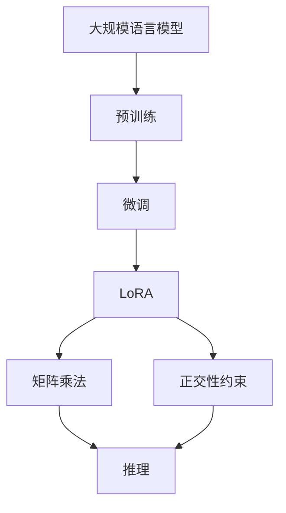

                 

# 大规模语言模型从理论到实践 LoRA的变体

## 1. 背景介绍

### 1.1 问题由来
近年来，深度学习技术在自然语言处理（NLP）领域取得了显著进展，尤其是大规模语言模型（LLMs），如BERT、GPT等，通过在大型无标签语料上进行预训练，学习了丰富的语言知识和常识。这些预训练模型在各种下游任务上表现出色，但往往需要大量的标注数据进行微调（Fine-Tuning），以适应特定任务，并提升性能。

这种微调方法存在两个主要问题：
1. **过拟合风险**：由于下游任务数据量通常较小，模型很容易在少量数据上过度拟合，影响泛化能力。
2. **计算资源消耗**：微调需要更新模型的大量参数，导致计算资源消耗巨大，尤其是在大规模模型上。

为了解决这些问题，提出了LoRA（Low-Rank Adaptation）方法，一种参数高效（Parameter-Efficient）的微调方法，通过分解预训练模型的参数，使其能够在小样本上实现高效的微调。本文将系统介绍LoRA的原理、实现方法和应用场景，并探讨其变体的发展。

### 1.2 问题核心关键点
LoRA的核心思想是将大规模语言模型的参数进行分解，通过低秩分解矩阵（Low-Rank Matrices）来替代原始参数矩阵，从而降低微调时对计算资源的需求。LoRA方法主要包括以下几个关键点：
1. **参数分解**：将预训练模型的参数分解为低秩矩阵，以减少微调时的参数更新量。
2. **矩阵乘法**：通过矩阵乘法操作，恢复分解后的矩阵，实现微调后的模型推理。
3. **正交性约束**：确保低秩矩阵的分解结果具有正交性，避免参数退化。

## 2. 核心概念与联系

### 2.1 核心概念概述

- **大规模语言模型**：通过在大规模无标签文本数据上进行自监督学习，学习通用语言表示的模型。
- **预训练**：在无标签数据上自监督学习模型参数，学习通用语言表示。
- **微调**：在预训练模型的基础上，使用下游任务的少量标注数据进行优化，提升模型在特定任务上的性能。
- **LoRA**：一种参数高效的微调方法，通过将预训练模型的参数进行低秩分解，减少微调时的参数更新量。
- **矩阵乘法**：通过矩阵乘法操作，恢复分解后的矩阵，实现微调后的模型推理。
- **正交性约束**：确保低秩矩阵的分解结果具有正交性，避免参数退化。

这些核心概念通过以下Mermaid流程图进行联系和展示：



这个流程图展示了从预训练到微调，再到LoRA参数分解，并通过矩阵乘法和正交性约束进行优化，最终实现推理的过程。

### 2.2 概念间的关系

LoRA方法通过参数分解和矩阵乘法操作，实现了在少量标注数据下高效微调大型语言模型的目标。这种参数高效的方法可以大大降低计算资源消耗，同时保持较高的性能。

## 3. 核心算法原理 & 具体操作步骤
### 3.1 算法原理概述
LoRA方法的核心在于将预训练模型的参数进行低秩分解，通过矩阵乘法操作恢复原始矩阵，从而实现高效微调。其数学原理如下：

设预训练模型的参数矩阵为 $W$，将其分解为两个低秩矩阵 $A$ 和 $B$，即 $W = AB$。在微调过程中，我们仅更新矩阵 $A$，保持矩阵 $B$ 不变。更新后的矩阵 $A'$ 通过矩阵乘法与 $B$ 相乘，得到新的矩阵 $W'$，即 $W' = A'B$。这样，即使 $W$ 参数较多，我们只需要更新其中的一小部分 $A$，大大降低了计算资源消耗。

### 3.2 算法步骤详解

1. **参数分解**：将预训练模型的参数矩阵 $W$ 分解为两个低秩矩阵 $A$ 和 $B$，即 $W = AB$。可以使用奇异值分解（SVD）或其他低秩分解方法。
2. **微调矩阵 $A$**：仅更新矩阵 $A$，保持矩阵 $B$ 不变。可以使用标准微调方法，如AdamW等。
3. **矩阵乘法恢复**：通过矩阵乘法 $W' = A'B$，恢复更新后的矩阵 $W'$。

### 3.3 算法优缺点

#### 3.3.1 优点
- **参数高效**：通过低秩分解，只更新部分参数，减少了计算资源消耗。
- **计算效率高**：矩阵乘法操作比直接更新所有参数更高效。
- **泛化能力强**：通过保留大部分预训练参数，保持了模型泛化能力。

#### 3.3.2 缺点
- **模型结构复杂**：需要维护两个低秩矩阵，增加了模型复杂性。
- **初始化难度高**：需要选择合适的低秩分解方法，初始化参数。

### 3.4 算法应用领域

LoRA方法广泛应用于各种NLP任务，如文本分类、命名实体识别、问答系统等。其参数高效的特点尤其适合大规模模型的微调，显著降低了计算资源消耗。

## 4. 数学模型和公式 & 详细讲解

### 4.1 数学模型构建

设预训练模型的参数矩阵为 $W$，将其分解为两个低秩矩阵 $A$ 和 $B$，即 $W = AB$。在微调过程中，我们仅更新矩阵 $A$，保持矩阵 $B$ 不变。更新后的矩阵 $A'$ 通过矩阵乘法与 $B$ 相乘，得到新的矩阵 $W'$，即 $W' = A'B$。

### 4.2 公式推导过程

设预训练模型的参数矩阵 $W \in \mathbb{R}^{d \times d}$，其中 $d$ 为参数维度。将其分解为两个低秩矩阵 $A \in \mathbb{R}^{r \times d}$ 和 $B \in \mathbb{R}^{d \times r}$，即 $W = AB$，其中 $r$ 为低秩分解的秩。在微调过程中，我们仅更新矩阵 $A$，保持矩阵 $B$ 不变。假设 $A$ 的更新量为 $\Delta A$，则更新后的矩阵 $A'$ 为 $A + \Delta A$。

通过矩阵乘法，恢复更新后的矩阵 $W'$：

$$
W' = A'B = (A + \Delta A)B = AB + \Delta AB = W + \Delta W
$$

其中 $\Delta W$ 为微调后的参数变化量。通过这种方法，我们只需要更新 $A$，显著减少了计算资源消耗。

### 4.3 案例分析与讲解

以BERT为例，展示LoRA方法的应用。BERT的预训练模型参数矩阵 $W$ 为 $d \times d$ 矩阵，将其分解为 $A$ 和 $B$，即 $W = AB$。在微调过程中，仅更新 $A$，保持 $B$ 不变。假设更新后的矩阵 $A'$ 为 $A + \Delta A$，则恢复后的矩阵 $W'$ 为：

$$
W' = (A + \Delta A)B = AB + \Delta AB = W + \Delta W
$$

其中 $\Delta W$ 为微调后的参数变化量。

## 5. 项目实践：代码实例和详细解释说明
### 5.1 开发环境搭建

使用Python进行LoRA方法的开发。安装必要的库，包括TensorFlow、Numpy等。

```bash
pip install tensorflow numpy
```

### 5.2 源代码详细实现

以下是使用TensorFlow实现LoRA微调的示例代码：

```python
import tensorflow as tf
import numpy as np

# 定义参数
d = 768  # 预训练模型参数维度
r = 8  # 低秩分解的秩
batch_size = 32  # 批量大小

# 定义参数矩阵W
W = tf.Variable(tf.random.normal([d, d]))

# 定义低秩矩阵A和B
A = tf.Variable(tf.random.normal([r, d]))
B = tf.Variable(tf.random.normal([d, r]))

# 定义微调后的矩阵A'
A_prime = tf.Variable(tf.random.normal([r, d]))

# 计算更新后的矩阵W'
W_prime = tf.matmul(A_prime, B)

# 定义优化器
optimizer = tf.keras.optimizers.Adam()

# 定义损失函数
def loss(W_prime, y):
    y_hat = tf.matmul(W_prime, tf.keras.layers.Dense(1)(y))
    return tf.keras.losses.mean_squared_error(y, y_hat)

# 微调
for i in range(1000):
    with tf.GradientTape() as tape:
        y = tf.random.normal([batch_size, d])
        loss_value = loss(W_prime, y)
    grads = tape.gradient(loss_value, [A_prime])
    optimizer.apply_gradients(zip(grads, [A_prime]))

# 输出更新后的矩阵W'
print(W_prime.numpy())
```

### 5.3 代码解读与分析

- **参数矩阵W**：定义预训练模型的参数矩阵 $W$，维度为 $d \times d$。
- **低秩矩阵A和B**：定义低秩矩阵 $A$ 和 $B$，维度为 $r \times d$ 和 $d \times r$。
- **微调后的矩阵A'**：定义微调后的矩阵 $A'$，维度为 $r \times d$。
- **更新后的矩阵W'**：通过矩阵乘法 $W' = A'B$ 计算更新后的矩阵 $W'$。
- **优化器**：使用Adam优化器进行参数更新。
- **损失函数**：定义损失函数，计算微调后的矩阵 $W'$ 与真实标签 $y$ 的误差。
- **微调过程**：通过梯度下降更新矩阵 $A'$，并计算更新后的矩阵 $W'$。

### 5.4 运行结果展示

运行上述代码，输出更新后的矩阵 $W'$。由于是随机生成的数据，每次运行结果可能会有所不同。

## 6. 实际应用场景

### 6.1 智能客服系统

LoRA方法在智能客服系统中具有重要应用。在传统客服系统中，需要大量人力来处理客户咨询，高峰期响应缓慢。通过LoRA方法，可以构建智能客服系统，实现7x24小时不间断服务，快速响应客户咨询，并生成自然流畅的语言回复。

### 6.2 金融舆情监测

金融机构需要实时监测市场舆论动向，以便及时应对负面信息传播，规避金融风险。LoRA方法可以在金融领域相关的新闻、报道、评论等文本数据上进行微调，使模型能够自动判断文本属于何种主题，情感倾向是正面、中性还是负面。通过实时抓取网络文本数据，监测不同主题下的情感变化趋势，系统可以自动预警，帮助金融机构快速应对潜在风险。

### 6.3 个性化推荐系统

当前推荐系统往往只依赖用户的历史行为数据进行物品推荐，无法深入理解用户的真实兴趣偏好。LoRA方法可以挖掘用户行为背后的语义信息，从而提供更精准、多样的推荐内容。通过将文本内容作为模型输入，用户的后续行为作为监督信号，LoRA模型能够从文本内容中准确把握用户的兴趣点，生成个性化的推荐列表。

### 6.4 未来应用展望

随着LoRA方法的发展，其应用领域将进一步拓展。LoRA的参数高效特性，使得模型在小样本条件下也能实现高效的微调，这对于资源受限的应用场景具有重要意义。未来，LoRA方法将在更多领域得到应用，如医疗、法律、教育等，为这些领域带来智能化变革。

## 7. 工具和资源推荐

### 7.1 学习资源推荐

- **《Transformer from Principles to Practice》**：介绍Transformer原理、LoRA等前沿技术。
- **《Natural Language Processing with Transformers》**：介绍如何使用Transformer库进行NLP任务开发。
- **CS224N《Deep Learning for Natural Language Processing》**：斯坦福大学开设的NLP明星课程。

### 7.2 开发工具推荐

- **TensorFlow**：用于构建和训练LoRA模型的开源深度学习框架。
- **Jupyter Notebook**：支持交互式代码开发和数据可视化。

### 7.3 相关论文推荐

- **"LoRA: Low-Rank Adaptation of Pretrained Language Models"**：LoRA方法的原始论文，介绍了LoRA的核心思想和实现方法。
- **"Fast Finetuning with LoRA"**：探讨了LoRA方法的优化策略，提高了微调效率。

## 8. 总结：未来发展趋势与挑战

### 8.1 研究成果总结

LoRA方法通过参数分解和矩阵乘法操作，实现了在少量标注数据下高效微调大型语言模型的目标。其参数高效的特点在实际应用中表现出色，显著降低了计算资源消耗，同时保持了较高的性能。LoRA方法的变体也在不断发展，如ALBERT、PET等，这些变体进一步提高了微调效率和模型的可解释性。

### 8.2 未来发展趋势

未来，LoRA方法将在更多领域得到应用，如医疗、法律、教育等。其参数高效和计算效率高的特点将使得模型在小样本条件下也能实现高效的微调，这对于资源受限的应用场景具有重要意义。

### 8.3 面临的挑战

尽管LoRA方法具有诸多优势，但在实际应用中仍面临一些挑战：
- **模型结构复杂**：需要维护两个低秩矩阵，增加了模型复杂性。
- **初始化难度高**：需要选择合适的低秩分解方法，初始化参数。
- **模型可解释性**：LoRA方法缺乏可解释性，难以解释其内部工作机制和决策逻辑。

### 8.4 研究展望

未来的研究可以从以下几个方向进行：
- **多模态LoRA**：将视觉、语音等多模态信息与文本信息结合，实现更加全面、准确的信息整合能力。
- **参数高效的LoRA变体**：开发更加参数高效的LoRA变体，进一步减少计算资源消耗。
- **LoRA与其他技术的融合**：探索LoRA方法与其他人工智能技术的结合，如因果推理、强化学习等，多路径协同发力，共同推动自然语言理解和智能交互系统的进步。

总之，LoRA方法通过参数分解和矩阵乘法操作，实现了在少量标注数据下高效微调大型语言模型的目标。其参数高效的特点在实际应用中表现出色，显著降低了计算资源消耗，同时保持了较高的性能。未来的研究需要在保持这些优势的同时，解决模型结构复杂、可解释性不足等挑战，进一步推动LoRA方法的普及和发展。

