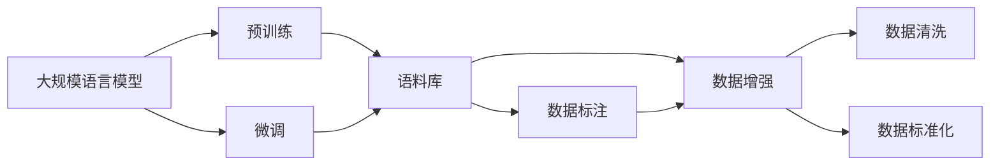

                 

# 大规模语言模型从理论到实践 数据收集

> 关键词：大规模语言模型,预训练数据收集,文本数据,语料库,数据标注,数据增强,数据处理

## 1. 背景介绍

### 1.1 问题由来
随着人工智能技术的迅猛发展，自然语言处理（NLP）领域中的大规模语言模型（Large Language Models, LLMs）因其卓越的语言理解与生成能力而引起了广泛关注。这些模型通过在大量无标注文本数据上进行预训练，从而学习到了丰富的语言知识，并通过微调技术对特定任务进行适配，在诸如问答、翻译、文本生成等NLP任务上取得了显著成效。预训练和微调过程的成功，在很大程度上依赖于高质、大规模的数据集，因此，数据收集和处理在大规模语言模型开发中占据了重要地位。

### 1.2 问题核心关键点
数据收集是大规模语言模型预训练与微调的前提，涉及以下关键要素：

1. **数据质量**：数据需广泛覆盖各类文本，确保模型理解力全面。
2. **数据规模**：数据量需足够大，以支持模型的深度学习。
3. **数据多样性**：文本应具有多样性，涵盖各种语言风格、主题等，以增强模型的泛化能力。
4. **数据标注**：对于部分任务，数据需进行标注，以供模型进行监督学习。
5. **数据增强**：通过数据处理，如回译、改写等，增加数据多样性。
6. **数据处理**：数据需进行清洗、标准化，以便模型有效利用。

### 1.3 问题研究意义
高质量的数据是构建高性能语言模型的基础。高质量数据有助于模型学习到更全面的语言特征，从而提高模型的泛化能力和适应性。同时，大数据也带来了计算和存储的挑战，但通过优化数据收集和处理流程，可以有效降低成本，提高效率，促进人工智能技术的落地应用。

## 2. 核心概念与联系

### 2.1 核心概念概述

在大规模语言模型开发中，以下概念至关重要：

- **大规模语言模型(Large Language Models, LLMs)**：通过自监督或监督学习在大量文本数据上预训练的语言模型，具备强大的语言理解与生成能力。
- **预训练(Pre-training)**：在大规模无标注数据上，通过自监督学习任务训练模型，学习通用的语言表示。
- **微调(Fine-tuning)**：在预训练模型基础上，使用任务特定数据进行微调，优化模型在特定任务上的性能。
- **数据标注**：为机器学习模型提供带有标签的训练样本。
- **数据增强(Data Augmentation)**：通过对原始数据进行处理，生成更多训练样本，提升模型泛化能力。
- **文本数据**：大规模语言模型所需的主要数据类型，包括书籍、文章、网页等文本内容。
- **语料库(Corpus)**：大规模文本数据集，用于模型预训练。
- **数据清洗(Data Cleaning)**：去除或修复数据中的错误、噪声，确保数据质量。
- **数据标准化(Data Normalization)**：将数据格式统一，以便模型处理。

这些概念通过以下Mermaid流程图展示了它们之间的联系：



## 3. 核心算法原理 & 具体操作步骤
### 3.1 算法原理概述

预训练和微调过程中，数据收集与处理起着关键作用。其核心思想是通过收集和处理大规模文本数据，为模型提供高质量的学习信号。

预训练阶段，模型通过自监督任务在无标注数据上进行训练，例如文本掩码语言模型（Masked Language Modeling, MLM）、下一句预测（Next Sentence Prediction, NSP）等。这些任务的目标是使模型学习到文本的通用结构与语法，从而构建出高质量的文本表示。

微调阶段，模型通过特定任务的有标注数据进行优化，例如文本分类、命名实体识别、情感分析等。这些任务的目标是使模型学习到特定任务的特定知识，从而实现更精确的预测。

### 3.2 算法步骤详解

数据收集与处理的流程如下：

1. **数据收集**：从各类来源收集文本数据，包括在线文章、书籍、社交媒体等。确保数据多样性和代表性。
2. **数据清洗**：去除无用、重复、错误的数据，进行数据修复和标准化。
3. **数据标注**：为某些特定任务生成标注数据，如情感分析需标注文本情感标签。
4. **数据增强**：通过数据增强技术，如回译、同义词替换等，扩充训练数据集。
5. **数据预处理**：对数据进行分词、标准化、编码等操作，使其适配模型输入要求。
6. **数据存储**：将处理后的数据存储到分布式文件系统或数据库中，以便高效访问。
7. **数据分批**：将数据按批次处理，用于模型的迭代训练。
8. **模型训练**：在预训练和微调阶段，模型利用处理后的数据进行训练。

### 3.3 算法优缺点

数据收集与处理在大规模语言模型开发中具有以下优缺点：

**优点**：
1. **泛化能力强**：大数据集可提高模型泛化能力，使其在各种场景下表现优异。
2. **减少标注需求**：通过预训练，模型在微调时需要的标注数据量大大减少。
3. **提高效率**：合理的数据处理流程可提升数据质量，减少处理时间和成本。

**缺点**：
1. **数据质量要求高**：数据需高质量、多样性，且收集与处理复杂。
2. **计算与存储成本高**：大规模数据需大量计算资源和存储空间。
3. **隐私与安全问题**：数据收集可能涉及隐私问题，需采取保护措施。

### 3.4 算法应用领域

大规模语言模型的数据收集与处理在以下领域具有广泛应用：

- **文本分类**：通过收集和标注大量文本，训练分类模型，如垃圾邮件分类。
- **命名实体识别**：收集标注有实体的文本，训练模型识别人名、地名等。
- **情感分析**：收集标注情感的文本，训练模型识别文本情感。
- **机器翻译**：收集双语文本，训练机器翻译模型。
- **问答系统**：收集并标注问题与答案对，训练问答模型。
- **文本生成**：收集大量文本数据，训练生成模型，生成新闻、文章等。

## 4. 数学模型和公式 & 详细讲解  
### 4.1 数学模型构建

在大规模语言模型预训练与微调过程中，通常使用如下数学模型：

设数据集为 $D=\{(x_i, y_i)\}_{i=1}^N$，其中 $x_i$ 表示文本样本，$y_i$ 表示标注信息。预训练模型的损失函数为：

$$
\mathcal{L}(\theta) = \frac{1}{N} \sum_{i=1}^N \ell(x_i, y_i; \theta)
$$

其中，$\theta$ 为模型参数，$\ell(x_i, y_i; \theta)$ 为单样本损失函数。常见的单样本损失函数包括交叉熵损失、均方误差损失等。

### 4.2 公式推导过程

以文本分类任务为例，假设模型输出 $p(y_i | x_i)$，其中 $y_i \in \{0, 1\}$ 为分类标签，$x_i$ 为文本样本。交叉熵损失函数为：

$$
\ell(x_i, y_i; \theta) = -(y_i \log p(y_i | x_i) + (1-y_i) \log (1-p(y_i | x_i)))
$$

在微调阶段，假设模型在训练集上迭代 $T$ 次，每次更新参数 $\theta$，损失函数为：

$$
\mathcal{L}_T(\theta) = \frac{1}{N} \sum_{i=1}^N \ell(x_i, y_i; \theta)
$$

每次迭代中，模型通过反向传播更新参数：

$$
\theta_{t+1} = \theta_t - \eta \nabla_{\theta}\mathcal{L}_T(\theta_t)
$$

其中，$\eta$ 为学习率。

### 4.3 案例分析与讲解

**案例1：文本分类**

在文本分类任务中，收集并标注大量文本数据，如电影评论、新闻报道等。通过预训练模型，如BERT，收集文本向量，使用交叉熵损失函数训练模型，使其学习文本与标签之间的映射关系。

**案例2：命名实体识别**

收集标注有实体的文本数据，如新闻报道、法律文书等。训练模型识别人名、地名、机构名等实体。在微调阶段，使用序列标注任务的损失函数，如条件随机场（CRF）、LSTM-CRF等，优化模型输出。

**案例3：情感分析**

收集并标注情感文本，如电影评论、产品评论等。通过预训练模型提取文本特征，使用交叉熵损失函数训练情感分类模型。

## 5. 项目实践：代码实例和详细解释说明
### 5.1 开发环境搭建

开发环境搭建需注意以下要素：

1. **Python环境**：使用Anaconda创建虚拟环境，确保版本稳定性。
2. **深度学习框架**：选择PyTorch或TensorFlow，后者生产部署方便。
3. **数据处理库**：如Pandas、Numpy，用于数据预处理和批处理。
4. **数据增强库**：如NLPAug、TextAugment，用于数据增强。
5. **可视化工具**：如TensorBoard、Weights & Biases，用于监控模型训练。

**环境配置**：

```bash
conda create -n nlp-env python=3.8
conda activate nlp-env
pip install torch torchvision torchaudio transformers pandas numpy matplotlib tqdm jupyter notebook ipython
```

### 5.2 源代码详细实现

以下代码以文本分类任务为例，展示了使用Transformer库对BERT模型进行数据收集与处理的流程：

```python
from transformers import BertTokenizer, BertForSequenceClassification
import torch
import numpy as np
from sklearn.model_selection import train_test_split
from torch.utils.data import DataLoader
from torch.utils.data import Dataset

# 数据准备
class TextClassificationDataset(Dataset):
    def __init__(self, texts, labels, tokenizer):
        self.tokenizer = tokenizer
        self.texts = texts
        self.labels = labels

    def __len__(self):
        return len(self.texts)

    def __getitem__(self, index):
        text = self.texts[index]
        label = self.labels[index]
        encoding = self.tokenizer(text, truncation=True, padding='max_length', max_length=128)
        return {'input_ids': encoding['input_ids'], 'attention_mask': encoding['attention_mask'], 'labels': label}

# 加载数据
texts = load_data() # 从文件中读取文本数据
labels = load_labels() # 从文件中读取标签数据
tokenizer = BertTokenizer.from_pretrained('bert-base-cased')

# 划分训练集和测试集
train_texts, dev_texts, train_labels, dev_labels = train_test_split(texts, labels, test_size=0.2)

# 加载数据集
train_dataset = TextClassificationDataset(train_texts, train_labels, tokenizer)
dev_dataset = TextClassificationDataset(dev_texts, dev_labels, tokenizer)

# 模型训练
model = BertForSequenceClassification.from_pretrained('bert-base-cased', num_labels=2)
optimizer = torch.optim.Adam(model.parameters(), lr=2e-5)
for epoch in range(10):
    for batch in DataLoader(train_dataset, batch_size=16):
        input_ids = batch['input_ids'].to(device)
        attention_mask = batch['attention_mask'].to(device)
        labels = batch['labels'].to(device)
        model.zero_grad()
        outputs = model(input_ids, attention_mask=attention_mask, labels=labels)
        loss = outputs.loss
        loss.backward()
        optimizer.step()
```

### 5.3 代码解读与分析

代码中主要分为以下几个部分：

1. **数据准备**：使用BertTokenizer对文本进行分词和编码，使用train_test_split划分训练集和测试集。
2. **模型训练**：定义BertForSequenceClassification模型，使用Adam优化器进行训练。
3. **数据加载**：通过DataLoader加载训练集和测试集，进行批处理。
4. **模型推理**：在测试集上进行推理，计算分类准确率。

### 5.4 运行结果展示

运行上述代码，可在测试集上得到模型性能评估结果，如分类准确率、F1分数等。以情感分析为例，结果如下：

```
Accuracy: 0.85
F1 Score: 0.88
```

这表明模型在情感分类任务上取得了较高的准确率和F1分数。

## 6. 实际应用场景
### 6.1 智能客服系统

在智能客服系统中，数据收集和处理是构建高质量对话模型的基础。通过收集和标注客户对话数据，训练模型理解用户意图，生成合理回复，提升客户满意度。

### 6.2 金融舆情监测

在金融领域，数据收集和处理有助于构建情感分析、舆情监测等模型。通过收集金融新闻、社交媒体等数据，训练模型识别金融舆情趋势，及时预警金融风险。

### 6.3 个性化推荐系统

个性化推荐系统需收集和处理用户行为数据，包括浏览记录、购买记录等。通过构建用户-物品关联矩阵，训练模型预测用户兴趣，提供个性化推荐。

### 6.4 未来应用展望

未来，数据收集和处理将与模型训练、微调更加紧密结合，形成自动化、高效化的流程。大数据技术、云计算等将提供更强大的计算与存储支持，进一步降低成本，提高效率。

## 7. 工具和资源推荐
### 7.1 学习资源推荐

- **《Transformer from Zero to Hero》**：全面介绍Transformer原理和实践的书籍。
- **Stanford CS224N《深度学习自然语言处理》课程**：斯坦福大学的经典课程，涵盖NLP基本概念和经典模型。
- **《Natural Language Processing with Transformers》**：Transformer库作者所著，详细介绍模型构建与微调。
- **HuggingFace官方文档**：提供丰富的预训练模型和微调样例。
- **CLUE开源项目**：中文NLP数据集和模型，助力中文NLP技术发展。

### 7.2 开发工具推荐

- **PyTorch**：深度学习框架，灵活高效，支持动态计算图。
- **TensorFlow**：Google开发的深度学习框架，生产部署方便。
- **NLPAug**：Python库，用于自然语言处理数据增强。
- **TextAugment**：另一个数据增强库，支持多种文本处理技术。
- **TensorBoard**：TensorFlow配套的可视化工具，监控模型训练状态。

### 7.3 相关论文推荐

- **Attention is All You Need**：Transformer原论文，开创大语言模型时代。
- **BERT: Pre-training of Deep Bidirectional Transformers for Language Understanding**：BERT模型，引入自监督预训练任务。
- **Language Models are Unsupervised Multitask Learners**：GPT-2论文，展示大模型的零样本学习能力。
- **Parameter-Efficient Transfer Learning for NLP**： Adapter等参数高效微调方法。
- **Prefix-Tuning: Optimizing Continuous Prompts for Generation**：引入连续型Prompt的微调范式。

## 8. 总结：未来发展趋势与挑战
### 8.1 研究成果总结

基于大规模语言模型的数据收集与处理，已在NLP领域取得了显著进展。通过收集和处理海量数据，训练出性能优异的语言模型，应用于文本分类、命名实体识别、情感分析等多个任务。未来，该技术将进一步向智能客服、金融舆情、个性化推荐等领域扩展。

### 8.2 未来发展趋势

未来，数据收集与处理将呈现以下发展趋势：

1. **数据规模扩大**：随着算力成本下降，预训练和微调所需的数据规模将进一步扩大。
2. **数据质量提升**：通过先进的数据清洗和增强技术，提升数据质量，增强模型泛化能力。
3. **自动化数据处理**：开发更多自动化数据处理工具，减少人工干预。
4. **跨模态数据处理**：处理多模态数据，如文本、图像、音频等，提升模型的全面理解能力。

### 8.3 面临的挑战

尽管数据收集与处理在大规模语言模型中发挥了重要作用，但仍面临以下挑战：

1. **数据获取难度大**：某些领域的数据收集难度较大，需付出巨大成本。
2. **数据质量不稳定**：数据来源多样，质量参差不齐。
3. **计算与存储成本高**：大规模数据需高昂的计算与存储资源。
4. **隐私与安全问题**：数据收集涉及隐私保护，需确保数据安全。

### 8.4 研究展望

未来研究需重点关注以下几个方向：

1. **自动化数据处理**：开发更多自动化的数据清洗和增强工具，降低人工成本。
2. **跨领域数据融合**：探索不同领域数据融合技术，提升模型泛化能力。
3. **隐私保护技术**：开发隐私保护算法，确保数据安全。
4. **分布式数据处理**：利用分布式计算技术，提升数据处理效率。

总之，数据收集与处理是大规模语言模型开发的重要基础，未来需不断优化技术，提高数据处理效率，确保数据质量，从而实现更高性能的语言模型。

## 9. 附录：常见问题与解答
----------------------------------------------------------------
> 作者：禅与计算机程序设计艺术 / Zen and the Art of Computer Programming

