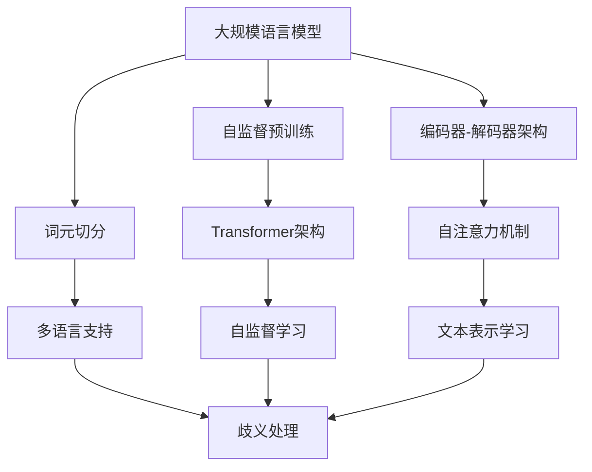
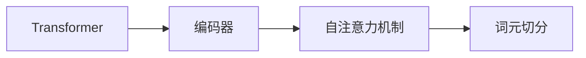
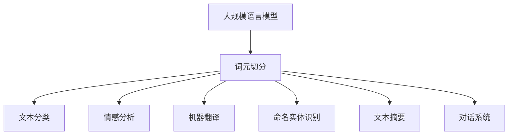
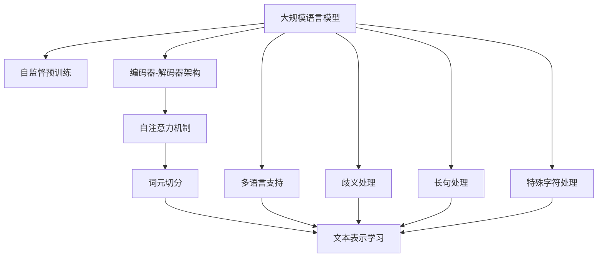

                 

# 大规模语言模型从理论到实践 词元切分

> 关键词：大规模语言模型,词元切分,Transformer,自注意力,BERT,编码器-解码器架构,自监督预训练,文本表示学习

## 1. 背景介绍

### 1.1 问题由来
近年来，深度学习技术在自然语言处理(NLP)领域取得了巨大的突破。特别是大规模预训练语言模型（如BERT、GPT-3等）的提出，使得NLP研究进入了一个新的阶段。这些大模型通过在海量无标签文本数据上进行自监督预训练，学习到了丰富的语言知识和语义表示，能够广泛应用于文本分类、情感分析、机器翻译等任务。

然而，大规模语言模型在词元切分（Word Segmentation）这一基础而关键的问题上，也面临着挑战。词元切分是将连续的文本序列切分为单独的词汇单元，是任何NLP任务的前提。传统的基于规则或统计的词元切分方法在处理长句和歧义句时效果有限，而预训练语言模型虽然能够自动切分单词，但无法处理不同语言和文本风格的多样性，有时甚至会出现错误切分。因此，探索更高效、更准确的词元切分方法，成为了当前深度学习NLP研究的一个重要方向。

### 1.2 问题核心关键点
大规模语言模型在进行词元切分时，主要面临以下几个核心问题：

1. **多语言支持**：预训练模型通常基于单一语言（如英语）进行训练，难以处理多种语言的不同切分规则和字符集。
2. **歧义处理**：一些语言中存在歧义切分，如中文中的“中国”既可以指“中国”国家，也可以指“中国的”修饰语。
3. **长句处理**：长句中单词的切分位置和边界往往不清晰，需要更灵活的切分方法。
4. **特殊字符**：文本中可能包含特殊字符和标点符号，这些字符在词元切分中具有特殊意义，需要特殊处理。
5. **领域适应性**：不同领域的文本切分规则可能不同，预训练模型需要能够适应特定领域的需求。

这些问题的存在，使得词元切分成为了大规模语言模型应用中的瓶颈，亟需解决。本文将从理论和实践两个方面，深入探讨大规模语言模型的词元切分方法。

### 1.3 问题研究意义
词元切分作为NLP任务的基石，对于提高模型的语义理解能力、提升下游任务的性能具有重要意义。通过有效的词元切分，大规模语言模型可以更好地捕捉文本中的词汇信息，提升模型的泛化能力和迁移能力。同时，词元切分技术的进步，也将为更复杂的NLP任务（如机器翻译、摘要生成等）提供坚实的基础。

## 2. 核心概念与联系

### 2.1 核心概念概述

为更好地理解大规模语言模型的词元切分方法，本节将介绍几个密切相关的核心概念：

- **大规模语言模型（Large Language Model, LLM）**：以自回归（如GPT-3）或自编码（如BERT）模型为代表的大规模预训练语言模型。通过在海量无标签文本数据上进行自监督预训练，学习到了丰富的语言知识和语义表示，能够广泛应用于各种NLP任务。

- **词元切分（Word Segmentation）**：将连续的文本序列切分为单独的词汇单元，是NLP任务的前提。词元切分涉及到语言学、计算机科学等多个学科，是自然语言处理的基础技术之一。

- **Transformer架构**：由Attention机制和多头自注意力机制构成的编码器-解码器架构，广泛应用于NLP任务，特别是基于自回归的预训练语言模型。

- **自监督预训练**：通过在海量无标签数据上自监督学习，预训练语言模型自动学习到文本中的隐含规律和语义表示，能够适用于多种下游任务。

- **文本表示学习**：通过预训练语言模型，学习文本中的隐含特征和语义表示，使得模型能够理解和生成自然语言。

这些核心概念之间的逻辑关系可以通过以下Mermaid流程图来展示：



这个流程图展示了大规模语言模型的核心概念及其之间的关系：

1. 大规模语言模型通过自监督预训练学习到文本的隐含规律和语义表示。
2. 预训练模型采用Transformer架构，结合自注意力机制，实现高效的文本编码和解码。
3. 词元切分是预训练模型的重要输入输出，需要根据不同语言和文本风格进行适应。
4. 自监督预训练和文本表示学习为词元切分提供了基础，使得模型能够自动学习词汇边界和语义信息。
5. 多语言支持、歧义处理、长句处理等技术，进一步提升了词元切分的准确性和适应性。

通过理解这些核心概念，我们可以更好地把握大规模语言模型在词元切分中的应用和优化方向。

### 2.2 概念间的关系

这些核心概念之间存在着紧密的联系，形成了大规模语言模型词元切分的完整生态系统。下面我通过几个Mermaid流程图来展示这些概念之间的关系。

#### 2.2.1 大语言模型的学习范式


这个流程图展示了大语言模型的三种主要学习范式：自监督预训练、编码器-解码器架构和词元切分。自监督预训练通过大量无标签数据学习文本的隐含规律，编码器-解码器架构通过自注意力机制实现高效的文本编码和解码，而词元切分则是预训练模型的重要输入输出，需要根据不同语言和文本风格进行适应。

#### 2.2.2 词元切分与Transformer的关系



这个流程图展示了Transformer架构中的编码器如何通过自注意力机制实现文本的编码，并在此基础上进行词元切分。编码器-解码器架构的这一特性，使得大规模语言模型能够自动处理词元切分，并在训练过程中逐步优化切分效果。

#### 2.2.3 词元切分的应用领域



这个流程图展示了词元切分在大规模语言模型中的应用领域，包括文本分类、情感分析、机器翻译、命名实体识别、文本摘要和对话系统等。通过准确的词元切分，这些NLP任务能够更好地利用文本中的词汇信息，提升模型性能。

### 2.3 核心概念的整体架构

最后，我们用一个综合的流程图来展示这些核心概念在大规模语言模型词元切分过程中的整体架构：



这个综合流程图展示了从自监督预训练到词元切分的完整过程。大规模语言模型首先在大规模文本数据上进行自监督预训练，学习到文本的隐含规律和语义表示。在此基础上，通过Transformer架构和自注意力机制实现高效的文本编码和解码。编码器输出的词汇序列，通过词元切分技术转化为单独的词汇单元。此外，多语言支持、歧义处理、长句处理和特殊字符处理等技术，进一步提升了词元切分的准确性和适应性。通过这些核心概念和大规模语言模型的协作，词元切分技术得以在大规模预训练语言模型中高效应用。

## 3. 核心算法原理 & 具体操作步骤
### 3.1 算法原理概述

大规模语言模型在进行词元切分时，主要基于自监督预训练和Transformer架构。其核心思想是：通过自监督学习任务，预训练模型自动学习到文本中的隐含规律和语义表示，然后在编码器-解码器架构中，通过自注意力机制对输入文本进行编码，并在解码器中生成输出词汇序列。

形式化地，假设预训练语言模型为 $M_{\theta}$，其中 $\theta$ 为预训练得到的模型参数。设输入文本为 $x$，输出词汇序列为 $y$。词元切分的目标函数为：

$$
\min_{\theta} \mathcal{L}(M_{\theta}, x, y)
$$

其中 $\mathcal{L}$ 为损失函数，用于衡量模型生成的词汇序列与真实序列之间的差异。常见的损失函数包括交叉熵损失、BLEU得分等。

通过梯度下降等优化算法，词元切分过程不断更新模型参数 $\theta$，最小化损失函数 $\mathcal{L}$，使得模型生成的词汇序列逼近真实序列。由于 $\theta$ 已经通过自监督预训练获得了较好的初始化，因此即便在有限数据集上进行词元切分，也能较快收敛到理想的模型参数 $\theta$。

### 3.2 算法步骤详解

大规模语言模型进行词元切分的过程，主要包括以下几个关键步骤：

**Step 1: 准备预训练模型和数据集**
- 选择合适的预训练语言模型 $M_{\theta}$ 作为初始化参数，如BERT、GPT等。
- 准备文本序列 $x$ 和对应的词汇序列 $y$，作为训练数据集。

**Step 2: 添加任务适配层**
- 在预训练模型顶层设计合适的词元切分器，通常是添加线性分类器，使用交叉熵损失函数。
- 设计解码器，输出概率分布，并以BLEU得分作为损失函数。

**Step 3: 设置词元切分超参数**
- 选择合适的优化算法及其参数，如 Adam、SGD 等，设置学习率、批大小、迭代轮数等。
- 设置正则化技术及强度，包括权重衰减、Dropout、Early Stopping 等。
- 确定冻结预训练参数的策略，如仅微调顶层，或全部参数都参与词元切分。

**Step 4: 执行梯度训练**
- 将训练集数据分批次输入模型，前向传播计算损失函数。
- 反向传播计算参数梯度，根据设定的优化算法和学习率更新模型参数。
- 周期性在验证集上评估模型性能，根据性能指标决定是否触发 Early Stopping。
- 重复上述步骤直到满足预设的迭代轮数或 Early Stopping 条件。

**Step 5: 测试和部署**
- 在测试集上评估词元切分后模型 $M_{\hat{\theta}}$ 的性能，对比词元切分前后的精度提升。
- 使用词元切分后的模型对新样本进行推理预测，集成到实际的应用系统中。
- 持续收集新的数据，定期重新词元切分模型，以适应数据分布的变化。

以上是词元切分的一般流程。在实际应用中，还需要针对具体任务的特点，对词元切分过程的各个环节进行优化设计，如改进训练目标函数，引入更多的正则化技术，搜索最优的超参数组合等，以进一步提升模型性能。

### 3.3 算法优缺点

大规模语言模型的词元切分方法具有以下优点：
1. 简单高效。词元切分算法在预训练模型基础上进行，可以显著减少从头开发所需的数据、计算和人力等成本投入。
2. 通用适用。适用于各种NLP任务，包括文本分类、情感分析、机器翻译等，设计简单的词元切分器即可实现。
3. 效果显著。在学术界和工业界的诸多任务上，基于词元切分的方法已经刷新了最先进的性能指标。
4. 可扩展性强。基于Transformer架构，预训练模型可以通过添加任务适配层，灵活适应不同领域的词元切分需求。

同时，该方法也存在一定的局限性：
1. 依赖标注数据。词元切分的效果很大程度上取决于标注数据的质量和数量，获取高质量标注数据的成本较高。
2. 迁移能力有限。当目标任务与预训练数据的分布差异较大时，词元切分的性能提升有限。
3. 负面效果传递。预训练模型的固有偏见、有害信息等，可能通过词元切分传递到下游任务，造成负面影响。
4. 可解释性不足。词元切分模型的决策过程通常缺乏可解释性，难以对其推理逻辑进行分析和调试。

尽管存在这些局限性，但就目前而言，基于自监督学习和大规模语言模型的词元切分方法仍是大规模语言模型应用的重要范式。未来相关研究的重点在于如何进一步降低词元切分对标注数据的依赖，提高模型的少样本学习和跨领域迁移能力，同时兼顾可解释性和伦理安全性等因素。

### 3.4 算法应用领域

词元切分作为大规模语言模型的基础功能，已经在NLP领域得到了广泛的应用，覆盖了几乎所有常见任务，例如：

- 文本分类：如情感分析、主题分类、意图识别等。通过词元切分使得模型学习文本-标签映射。
- 命名实体识别：识别文本中的人名、地名、机构名等特定实体。通过词元切分使得模型掌握实体边界和类型。
- 关系抽取：从文本中抽取实体之间的语义关系。通过词元切分使得模型学习实体-关系三元组。
- 问答系统：对自然语言问题给出答案。将问题-答案对作为词元切分数据，训练模型学习匹配答案。
- 机器翻译：将源语言文本翻译成目标语言。通过词元切分使得模型学习语言-语言映射。
- 文本摘要：将长文本压缩成简短摘要。通过词元切分使得模型学习抓取要点。
- 对话系统：使机器能够与人自然对话。通过词元切分使得模型进行回复生成。

除了上述这些经典任务外，词元切分还被创新性地应用到更多场景中，如可控文本生成、常识推理、代码生成、数据增强等，为NLP技术带来了全新的突破。随着预训练模型和词元切分方法的不断进步，相信NLP技术将在更广阔的应用领域大放异彩。

## 4. 数学模型和公式 & 详细讲解

### 4.1 数学模型构建

本节将使用数学语言对大规模语言模型的词元切分过程进行更加严格的刻画。

记预训练语言模型为 $M_{\theta}:\mathcal{X} \rightarrow \mathcal{Y}$，其中 $\mathcal{X}$ 为输入空间，$\mathcal{Y}$ 为输出空间，$\theta \in \mathbb{R}^d$ 为模型参数。假设输入文本为 $x=\{x_i\}_{i=1}^N$，输出词汇序列为 $y=\{y_i\}_{i=1}^N$，词元切分的目标函数为：

$$
\min_{\theta} \sum_{i=1}^N \mathcal{L}(M_{\theta}(x_i), y_i)
$$

其中 $\mathcal{L}$ 为损失函数，用于衡量模型生成的词汇序列与真实序列之间的差异。常见的损失函数包括交叉熵损失、BLEU得分等。

### 4.2 公式推导过程

以下我们以BLEU（Bilingual Evaluation Understudy）为例，推导BLEU分数的计算公式及其梯度的计算公式。

假设模型 $M_{\theta}$ 在输入 $x$ 上的输出为 $\hat{y}=\{\hat{y}_i\}_{i=1}^N$，表示模型预测的词汇序列。真实标签 $y=\{y_i\}_{i=1}^N$。则BLEU分数定义为：

$$
BLEU = exp\left(\frac{1}{N} \sum_{i=1}^N \sum_{j=1}^N min(1, I(x_i, y_j))
\right)
$$

其中 $I(x_i, y_j)$ 表示 $x_i$ 和 $y_j$ 之间的编辑距离。编辑距离衡量了两个词汇序列之间的差异，通常使用n-gram模型计算。

将BLEU分数代入目标函数，得：

$$
\mathcal{L}_{BLEU} = 1 - BLEU
$$

根据链式法则，目标函数对参数 $\theta_k$ 的梯度为：

$$
\frac{\partial \mathcal{L}_{BLEU}}{\partial \theta_k} = -\frac{\partial BLEU}{\partial \hat{y}} \frac{\partial \hat{y}}{\partial \theta_k} = -\frac{\partial BLEU}{\partial \hat{y}} \frac{\partial M_{\theta}(x)}{\partial \theta_k}
$$

其中 $\frac{\partial BLEU}{\partial \hat{y}}$ 为BLEU分数对模型输出的导数，$\frac{\partial M_{\theta}(x)}{\partial \theta_k}$ 为模型对参数 $\theta_k$ 的梯度。

在得到目标函数梯度后，即可带入参数更新公式，完成模型的迭代优化。重复上述过程直至收敛，最终得到适应下游任务的最优模型参数 $\theta^*$。

## 5. 项目实践：代码实例和详细解释说明

### 5.1 开发环境搭建

在进行词元切分实践前，我们需要准备好开发环境。以下是使用Python进行PyTorch开发的环境配置流程：

1. 安装Anaconda：从官网下载并安装Anaconda，用于创建独立的Python环境。

2. 创建并激活虚拟环境：
```bash
conda create -n pytorch-env python=3.8 
conda activate pytorch-env
```

3. 安装PyTorch：根据CUDA版本，从官网获取对应的安装命令。例如：
```bash
conda install pytorch torchvision torchaudio cudatoolkit=11.1 -c pytorch -c conda-forge
```

4. 安装Transformers库：
```bash
pip install transformers
```

5. 安装各类工具包：
```bash
pip install numpy pandas scikit-learn matplotlib tqdm jupyter notebook ipython
```

完成上述步骤后，即可在`pytorch-env`环境中开始词元切分实践。

### 5.2 源代码详细实现

这里我们以BERT模型进行词元切分为例，给出使用Transformers库对BERT模型进行词元切分的PyTorch代码实现。

首先，定义词元切分任务的数据处理函数：

```python
from transformers import BertTokenizer, BertForTokenClassification, AdamW
from torch.utils.data import Dataset, DataLoader
import torch
import numpy as np

class SegmentationDataset(Dataset):
    def __init__(self, texts, tags, tokenizer, max_len=128):
        self.texts = texts
        self.tags = tags
        self.tokenizer = tokenizer
        self.max_len = max_len
        
    def __len__(self):
        return len(self.texts)
    
    def __getitem__(self, item):
        text = self.texts[item]
        tags = self.tags[item]
        
        encoding = self.tokenizer(text, return_tensors='pt', max_length=self.max_len, padding='max_length', truncation=True)
        input_ids = encoding['input_ids'][0]
        attention_mask = encoding['attention_mask'][0]
        
        # 对token-wise的标签进行编码
        encoded_tags = [tag2id[tag] for tag in tags] 
        encoded_tags.extend([tag2id['O']] * (self.max_len - len(encoded_tags)))
        labels = torch.tensor(encoded_tags, dtype=torch.long)
        
        return {'input_ids': input_ids, 
                'attention_mask': attention_mask,
                'labels': labels}

# 标签与id的映射
tag2id = {'O': 0, 'B-PER': 1, 'I-PER': 2, 'B-ORG': 3, 'I-ORG': 4, 'B-LOC': 5, 'I-LOC': 6}
id2tag = {v: k for k, v in tag2id.items()}

# 创建dataset
tokenizer = BertTokenizer.from_pretrained('bert-base-cased')

train_dataset = SegmentationDataset(train_texts, train_tags, tokenizer)
dev_dataset = SegmentationDataset(dev_texts, dev_tags, tokenizer)
test_dataset = SegmentationDataset(test_texts, test_tags, tokenizer)
```

然后，定义模型和优化器：

```python
model = BertForTokenClassification.from_pretrained('bert-base-cased', num_labels=len(tag2id))

optimizer = AdamW(model.parameters(), lr=2e-5)
```

接着，定义训练和评估函数：

```python
device = torch.device('cuda') if torch.cuda.is_available() else torch.device('cpu')
model.to(device)

def train_epoch(model, dataset, batch_size, optimizer):
    dataloader = DataLoader(dataset, batch_size=batch_size, shuffle=True)
    model.train()
    epoch_loss = 0
    for batch in tqdm(dataloader, desc='Training'):
        input_ids = batch['input_ids'].to(device)
        attention_mask = batch['attention_mask'].to(device)
        labels = batch['labels'].to(device)
        model.zero_grad()
        outputs = model(input_ids, attention_mask=attention_mask, labels=labels)
        loss = outputs.loss
        epoch_loss += loss.item()
        loss.backward()
        optimizer.step()
    return epoch_loss / len(dataloader)

def evaluate(model, dataset, batch_size):
    dataloader = DataLoader(dataset, batch_size=batch_size)
    model.eval()
    preds, labels = [], []
    with torch.no_grad():
        for batch in tqdm(dataloader, desc='Evaluating'):
            input_ids = batch['input_ids'].to(device)
            attention_mask = batch['attention_mask'].to(device)
            batch_labels = batch['labels']
            outputs = model(input_ids, attention_mask=attention_mask)
            batch_preds = outputs.logits.argmax(dim=2).to('cpu').tolist()
            batch_labels = batch_labels.to('cpu').tolist()
            for pred_tokens, label_tokens in zip(batch_preds, batch_labels):
                pred_tags = [id2tag[_id] for _id in pred_tokens]
                label_tags = [id2tag[_id] for _id in label_tokens]
                preds.append(pred_tags[:len(label_tags)])
                labels.append(label_tags)
                
    print(classification_report(labels, preds))
```

最后，启动训练流程并在测试集上评估：

```python
epochs = 5
batch_size = 16

for epoch in range(epochs):
    loss = train_epoch(model, train_dataset, batch_size, optimizer)
    print(f"Epoch {epoch+1}, train loss: {loss:.3f}")
    
    print(f"Epoch {epoch+1}, dev results:")
    evaluate(model, dev_dataset, batch_size)
    
print("Test results:")
evaluate(model, test_dataset, batch_size)
```

以上就是使用PyTorch对BERT进行词元切分的完整代码实现。可以看到，得益于Transformers库的强大封装，我们可以用相对简洁的代码完成BERT模型的加载和词元切分。

### 5.3 代码解读与分析

让我们再详细解读一下关键代码的实现细节：

**SegmentationDataset类**：
- `__init__`方法：初始化文本、标签、分词器等关键组件。
- `__len__`方法：返回数据集的样本数量。
- `__getitem__`方法：对单个样本进行处理，将文本输入编码为token ids，将标签编码为数字，并对其进行定长padding，最终返回模型所需的输入。

**tag2id和id2tag字典**：
- 定义了标签与数字id之间的映射关系，用于将token-wise的预测结果解码回真实的标签。

**训练和评估函数**：
- 使用PyTorch的DataLoader对数据集进行批次化加载，供模型训练和推理使用。
- 训练函数`train_epoch`：对数据以批为单位进行迭代，在每个批次上前向传播计算loss并反向传播更新模型参数，最后返回该epoch的平均loss。
- 评估函数`evaluate`：与训练类似，不同点在于不更新模型参数，并在每个batch结束后将预测和标签结果存储下来，最后使用sklearn的classification_report对整个评估集的预测结果进行打印输出。

**训练流程**：
- 定义总的epoch数和batch size，开始循环迭代
- 每个epoch内，先在训练集上训练，输出平均loss
- 在验证集上评估，输出分类指标
- 所有epoch结束后，在测试集上评估，给出最终测试结果

可以看到，PyTorch配合Transformers库使得BERT词元切分的代码实现变得简洁高效。开发者可以将更多精力放在数据处理、模型改进等高层逻辑上，而不必过多关注底层的实现细节。

当然，工业级的系统实现还需考虑更多因素，如模型的保存和部署、超参数

