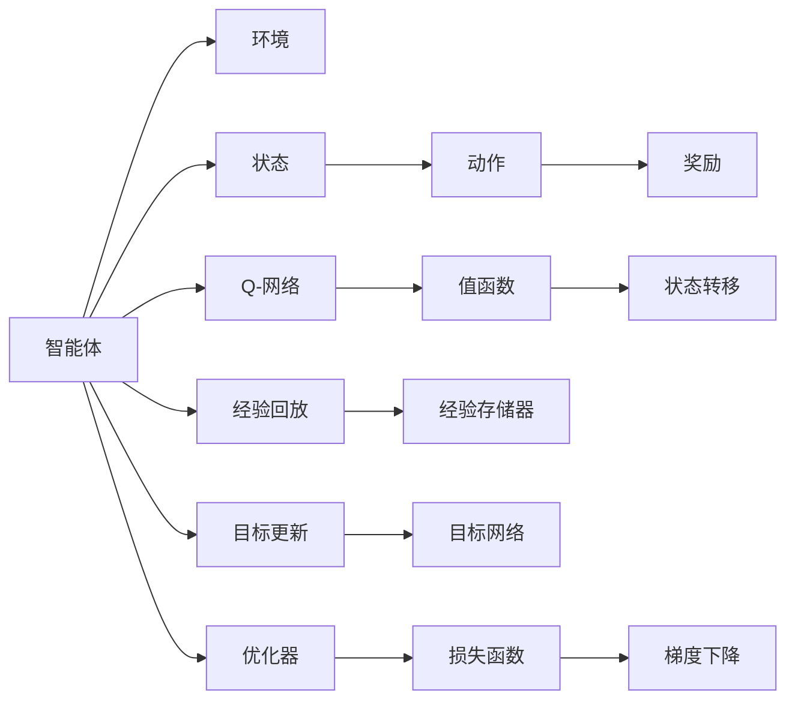
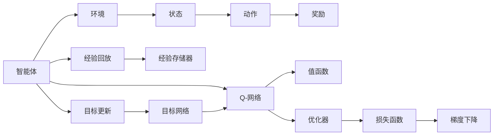
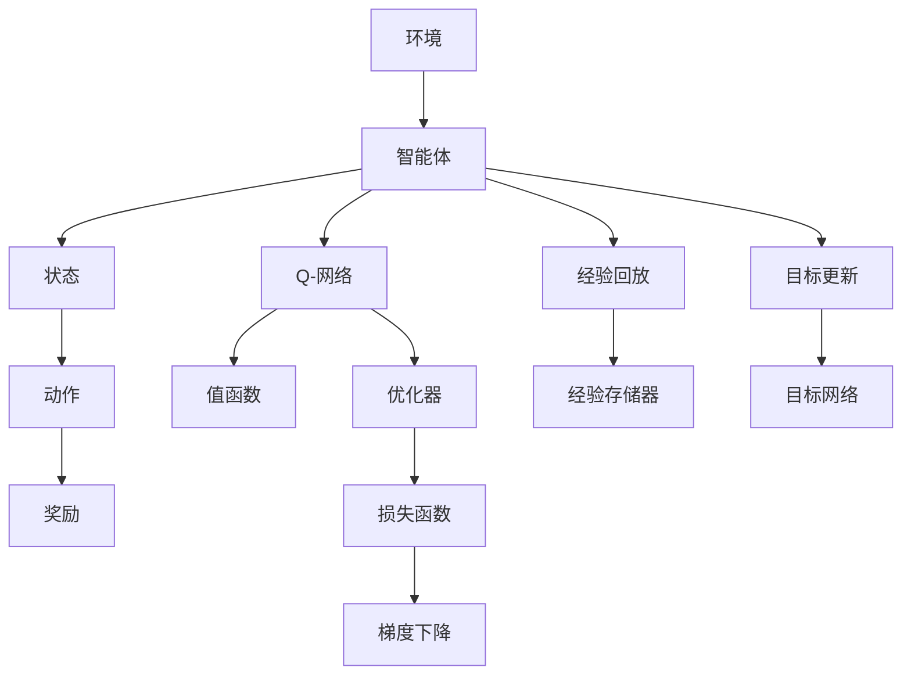

                 

# 大语言模型原理与工程实践：DQN 训练：完整算法

> 关键词：深度强化学习, Q-learning, 神经网络, 状态转移, 目标函数, 蒙特卡洛仿真, 行为策略, 智能决策

## 1. 背景介绍

### 1.1 问题由来
在人工智能领域，强化学习（Reinforcement Learning, RL）与深度学习（Deep Learning, DL）的结合，即深度强化学习（Deep Reinforcement Learning, DRL），是近年来研究的热点。其中，DQN（Deep Q-Network）算法以其高效、稳定、适应性强的特点，在控制、游戏、机器人等领域展现了卓越的表现。

DQN 的提出是继 Q-Learning 等经典强化学习算法之后的重要突破。DQN 算法通过将深度神经网络与 Q-Learning 算法相结合，能够学习到复杂环境下的状态-动作-奖励映射关系，从而在无需手工设计策略的情况下，自主进行智能决策。这一算法的基本思想是将深度神经网络作为 Q 函数的近似，利用经验回放和目标更新等技术，使神经网络能够有效更新 Q 值，从而实现智能策略的学习。

### 1.2 问题核心关键点
DQN 的核心在于如何将 Q 函数近似为深度神经网络，并利用经验回放、目标更新等技术优化策略。其核心过程包括：
- 构建深度神经网络 Q-网络。
- 利用蒙特卡洛仿真计算状态-动作-奖励的回报（Return）。
- 经验回放，即利用经验存储器（Experience Replay）存储与动作相关的状态、动作和奖励。
- 使用目标更新策略，通过目标网络更新 Q 网络，以解决目标漂移问题。

本文将详细讨论这些关键问题，并结合具体案例，探讨 DQN 算法在实际工程中的实现方法和应用场景。

### 1.3 问题研究意义
DQN 算法通过深度神经网络，学习到环境中的高维状态表示和智能决策策略，具有高度的泛化能力和自适应性。其在实际工程中的应用，如自动驾驶、智能家居、机器人导航等，能够有效提升系统的智能化水平，降低决策成本，提高系统性能。因此，研究 DQN 算法及其在工程中的实践，对于提升人工智能系统的智能化水平，具有重要的理论和实际意义。

## 2. 核心概念与联系

### 2.1 核心概念概述

为更好地理解 DQN 算法，本节将介绍几个密切相关的核心概念：

- **强化学习（Reinforcement Learning, RL）**：通过与环境交互，智能体（agent）学习到在特定状态下采取最优动作，以最大化累积奖励。

- **Q-learning**：一种基于值函数的强化学习算法，通过估计每个状态-动作对 Q 值，选择最优动作，使得累积奖励最大化。

- **状态-动作-奖励（State-Action-Reward, SAR）**：强化学习中基本的三元组，用于描述智能体的行为和环境反馈。

- **神经网络（Neural Network, NN）**：一种计算模型，通过大量参数化的单元（神经元）模拟人类神经系统的信息处理方式，用于逼近复杂的函数或模型。

- **状态表示（State Representation）**：智能体对环境的抽象表示，通常由特征向量构成，用于描述环境状态。

- **深度 Q-Network（DQN）**：结合深度神经网络和 Q-learning 算法的强化学习算法，通过神经网络逼近 Q 函数，实现状态-动作-奖励映射的智能学习。

- **经验回放（Experience Replay）**：一种强化学习技术，通过存储和重放历史状态、动作、奖励等经验，提高算法的样本效率和稳定性。

- **目标更新（Target Update）**：一种稳定训练神经网络的方法，通过使用稳定的目标网络更新 Q 网络，避免因参数更新导致的目标漂移问题。

这些概念之间的逻辑关系可以通过以下 Mermaid 流程图来展示：



这个流程图展示了大语言模型微调过程中各个核心概念的关系和作用：

1. 智能体通过与环境交互，接收状态、发出动作并获取奖励。
2. 状态由深度神经网络 Q-网络抽象表示，并计算 Q 值。
3. 经验通过经验回放技术存储和重放，提升训练效率。
4. 目标更新通过目标网络更新 Q 网络，稳定训练过程。
5. 损失函数和优化器用于更新 Q 网络参数，最小化预测 Q 值与实际 Q 值的差距。

### 2.2 概念间的关系

这些核心概念之间存在着紧密的联系，形成了 DQN 算法的完整生态系统。下面我们通过几个 Mermaid 流程图来展示这些概念之间的关系。

#### 2.2.1 DQN 算法流程



这个流程图展示了 DQN 算法的基本流程：

1. 智能体与环境交互，接收状态、发出动作并获取奖励。
2. Q-网络计算 Q 值，更新值函数。
3. 经验存储器存储状态、动作和奖励，经验回放技术提高训练效率。
4. 目标网络更新 Q-网络，避免目标漂移。
5. 通过梯度下降优化损失函数，更新 Q 网络参数。

#### 2.2.2 经验回放与目标更新


这个流程图展示了经验回放和目标更新的关键作用：

1. 经验存储器通过经验回放技术，将历史状态、动作和奖励存储下来，供训练使用。
2. 目标网络通过目标更新策略，稳定地更新 Q-网络，避免目标漂移。
3. Q-网络根据经验回放和目标更新，不断优化状态-动作-奖励映射关系。

### 2.3 核心概念的整体架构

最后，我们用一个综合的流程图来展示这些核心概念在大语言模型微调过程中的整体架构：



这个综合流程图展示了从环境到智能体，再到 Q-网络的完整流程：

1. 环境与智能体交互，提供状态和奖励。
2. 智能体通过 Q-网络计算 Q 值，更新值函数。
3. 经验存储器通过经验回放技术，存储和重放历史经验。
4. 目标网络通过目标更新策略，稳定更新 Q-网络。
5. 损失函数和优化器用于更新 Q-网络参数，最小化预测 Q 值与实际 Q 值的差距。

## 3. 核心算法原理 & 具体操作步骤
### 3.1 算法原理概述

DQN 算法的核心在于通过深度神经网络逼近 Q 函数，学习到复杂环境中的智能策略。其核心思想是通过神经网络逼近 Q 值函数，利用蒙特卡洛仿真计算状态-动作-奖励的回报（Return），并通过经验回放和目标更新等技术，优化策略并防止目标漂移。

### 3.2 算法步骤详解

DQN 算法的具体步骤包括以下几个关键部分：

**Step 1: 环境初始化与参数设置**
- 初始化环境，设置智能体的初始状态。
- 设置 Q-网络、目标网络、优化器和经验存储器。

**Step 2: 状态选择与动作执行**
- 根据当前状态，使用 Q-网络计算 Q 值，选择最优动作。
- 在环境中执行动作，获取状态和奖励。

**Step 3: 经验存储与回放**
- 将当前状态、动作和奖励存储到经验存储器中。
- 从经验存储器中随机抽取一小批经验样本，用于训练 Q-网络。

**Step 4: 经验回放与目标更新**
- 对抽取的经验样本进行蒙特卡洛仿真，计算 Q 值和 Return。
- 使用优化器更新 Q-网络参数。
- 定期更新目标网络，以避免目标漂移。

**Step 5: 参数更新与迭代**
- 在每个训练周期中，重复 Step 2-4。
- 逐步更新 Q-网络，直到收敛。

### 3.3 算法优缺点

DQN 算法具有以下优点：

1. **高泛化能力**：通过深度神经网络逼近 Q 函数，能够学习到复杂环境中的智能策略，具有高度的泛化能力。
2. **高效训练**：利用经验回放技术，减少了样本收集和训练的随机性，提高了训练效率。
3. **自适应性强**：适应各种环境变化，能够自适应地调整策略。

同时，DQN 算法也存在一些缺点：

1. **目标漂移**：在训练过程中，目标网络可能与 Q-网络不一致，导致目标漂移问题。
2. **样本效率低**：经验回放技术需要存储大量历史经验，占用大量内存。
3. **收敛速度慢**：由于神经网络参数较多，训练过程可能较慢。
4. **可解释性差**：深度神经网络难以解释其决策过程，可解释性较差。

### 3.4 算法应用领域

DQN 算法已被广泛应用于自动驾驶、机器人控制、游戏智能、金融交易等领域，具有广泛的应用前景。以下是一些典型的应用场景：

1. **自动驾驶**：智能车在复杂交通环境中，利用 DQN 算法进行路径规划和控制决策，确保行驶安全。
2. **机器人控制**：机器人通过与环境的交互，学习到最优的移动策略，完成指定任务。
3. **游戏智能**：游戏智能体通过 DQN 算法学习游戏规则，获得最优游戏策略，实现智能博弈。
4. **金融交易**：智能交易系统通过 DQN 算法学习市场行为，进行股票交易决策，提高投资收益。
5. **资源调度**：智能调度系统通过 DQN 算法优化资源配置，提升系统效率。

## 4. 数学模型和公式 & 详细讲解  
### 4.1 数学模型构建

DQN 算法涉及以下数学模型和公式：

1. **状态-动作-奖励（SAR）**：智能体在环境中的状态 $s$，动作 $a$，奖励 $r$。

2. **Q 函数**：状态-动作值函数，表示智能体在状态 $s$ 下执行动作 $a$ 的长期累积回报，$Q(s,a)=\mathbb{E}[G_{t+1:T}|\tau]$。

3. **蒙特卡洛仿真（Monte Carlo Simulation）**：利用蒙特卡洛方法，通过滚动向前计算 Q 值，$G_{t+1:T}=\sum_{k=t+1}^{T}\gamma^{k-t}r_k$。

4. **经验回放（Experience Replay）**：将历史经验 $(s_t,a_t,r_t,s_{t+1})$ 存储到经验存储器 $\mathcal{E}$ 中，通过均匀采样抽取样本进行训练。

5. **目标更新（Target Update）**：定期将目标网络参数更新为 Q-网络参数，以防止目标漂移。

6. **优化器（Optimizer）**：常用的优化器包括 SGD、Adam、RMSProp 等，用于更新 Q-网络参数。

### 4.2 公式推导过程

以下我们以一个简单的例子，展示 DQN 算法的数学推导过程。

假设智能体在环境中的状态和动作空间分别为 $s=\{s_1,s_2,...,s_n\}$ 和 $a=\{a_1,a_2,...,a_m\}$，奖励函数为 $r(s,a)$。智能体的 Q-网络为 $Q_{\theta}(s,a)$，目标网络为 $Q_{\theta_{target}}(s,a)$。

1. **Q 值计算**
   $$
   Q_{\theta}(s,a) = \mathbb{E}[G_{t+1:T}|\tau]
   $$

2. **蒙特卡洛仿真**
   $$
   G_{t+1:T} = \sum_{k=t+1}^{T}\gamma^{k-t}r_k
   $$

3. **经验回放**
   $$
   (s_t,a_t,r_t,s_{t+1}) \rightarrow \mathcal{E}
   $$

4. **目标更新**
   $$
   Q_{\theta_{target}}(s,a) = \theta_{target} \approx \theta
   $$

5. **优化器更新**
   $$
   \theta \leftarrow \theta - \eta \nabla_{\theta}J(\theta)
   $$

其中，$J(\theta)$ 为损失函数，$\eta$ 为学习率。

### 4.3 案例分析与讲解

假设我们设计一个简单的交通系统，智能车在交叉口选择正确的通行方向。环境状态 $s$ 包括车的位置、速度和信号灯状态。智能体的动作 $a$ 包括向左、向右、直行等。奖励函数 $r(s,a)$ 在智能车选择正确方向时给予正奖励，否则给予负奖励。

**Step 1: 环境初始化与参数设置**
- 初始化智能体的状态 $s_0$。
- 设置 Q-网络 $Q_{\theta}(s,a)$ 和目标网络 $Q_{\theta_{target}}(s,a)$。
- 设置优化器（如 Adam）。

**Step 2: 状态选择与动作执行**
- 根据当前状态 $s_t$，使用 Q-网络计算 Q 值 $Q_{\theta}(s_t,a)$，选择最优动作 $a_t$。
- 在环境中执行动作，获取状态 $s_{t+1}$ 和奖励 $r_t$。

**Step 3: 经验存储与回放**
- 将当前状态、动作和奖励 $(s_t,a_t,r_t,s_{t+1})$ 存储到经验存储器 $\mathcal{E}$ 中。
- 从经验存储器中抽取一小批经验样本，用于训练 Q-网络。

**Step 4: 经验回放与目标更新**
- 对抽取的经验样本进行蒙特卡洛仿真，计算 Q 值和 Return。
- 使用优化器更新 Q-网络参数。
- 定期更新目标网络，以避免目标漂移。

**Step 5: 参数更新与迭代**
- 在每个训练周期中，重复 Step 2-4。
- 逐步更新 Q-网络，直到收敛。

通过上述步骤，智能车可以逐步学习到在交叉口选择最优通行方向策略，提高通行效率和安全性。

## 5. 项目实践：代码实例和详细解释说明
### 5.1 开发环境搭建

在进行 DQN 算法实践前，我们需要准备好开发环境。以下是使用 Python 进行 TensorFlow 开发的流程：

1. 安装 Anaconda：从官网下载并安装 Anaconda，用于创建独立的 Python 环境。

2. 创建并激活虚拟环境：
```bash
conda create -n dqn-env python=3.8 
conda activate dqn-env
```

3. 安装 TensorFlow：根据 GPU 版本，从官网获取对应的安装命令。例如：
```bash
conda install tensorflow=2.7
```

4. 安装相关库：
```bash
pip install gym
pip install numpy scipy pandas
```

完成上述步骤后，即可在 `dqn-env` 环境中开始 DQN 算法的实践。

### 5.2 源代码详细实现

下面我们以交通系统中智能车选择通行方向的 DQN 算法为例，给出使用 TensorFlow 实现的代码。

首先，定义环境类和智能体类：

```python
import gym
import numpy as np
import tensorflow as tf

class TrafficEnv(gym.Env):
    def __init__(self):
        self.state = [0, 0]  # 车的位置
        self.speed = 0
        self.direction = 0
        self.terminal = False
        self.env_actions = [0, 1, 2]  # 左、右、直行
        self.actions = self.env_actions
        self.observation_space = gym.spaces.Box(low=0, high=1, shape=(3,))
        self.action_space = gym.spaces.Discrete(3)

    def reset(self):
        self.state = [0, 0]
        self.speed = 0
        self.direction = 0
        self.terminal = False
        return self.state

    def step(self, action):
        if self.terminal:
            return self.state, 0, self.terminal, {}
        if action not in self.actions:
            return self.state, -1, self.terminal, {}
        if action == 0:  # 左转
            self.direction = 1
        elif action == 1:  # 右转
            self.direction = 2
        elif action == 2:  # 直行
            self.direction = 0
        self.state = np.array(self.state)
        self.speed += 1
        if self.speed == 3:
            self.speed = 0
            self.direction = 0
            self.terminal = True
        r = 1 if self.direction == 0 else -1
        return self.state, r, self.terminal, {}

class DQNAgent:
    def __init__(self, env):
        self.env = env
        self.state_size = env.observation_space.shape[0]
        self.action_size = env.action_space.n
        self.memory = deque(maxlen=2000)
        self.gamma = 0.95  # 折现因子
        self.learning_rate = 0.001  # 学习率
        self.epsilon = 1.0  # 探索率
        self.epsilon_min = 0.01
        self.epsilon_decay = 0.995
        self.model = self._build_model()

    def _build_model(self):
        model = tf.keras.Sequential([
            tf.keras.layers.Dense(24, input_dim=self.state_size, activation='relu'),
            tf.keras.layers.Dense(24, activation='relu'),
            tf.keras.layers.Dense(self.action_size, activation='linear')
        ])
        model.compile(loss='mse', optimizer=tf.keras.optimizers.Adam(lr=self.learning_rate))
        return model
```

然后，定义训练函数和模型更新函数：

```python
def train_model(agent, env, episodes=100):
    for episode in range(episodes):
        state = env.reset()
        done = False
        while not done:
            if np.random.rand() <= agent.epsilon:
                action = env.action_space.sample()
            else:
                action = np.argmax(agent.model.predict(state.reshape(1, -1)))
            next_state, reward, done, info = env.step(action)
            agent.memory.append((state, action, reward, next_state, done))
            if len(agent.memory) > agent.memory_max:
                agent.memory.pop(0)
            if not done:
                state = next_state
        agent.epsilon *= agent.epsilon_decay
        agent.epsilon = max(agent.epsilon_min, agent.epsilon)
        agent.learn()
    env.close()

def learn_model(agent):
    minibatch = np.random.choice(len(agent.memory), batch_size, replace=False)
    minibatch_states = np.vstack([state for state, action, reward, next_state, done in agent.memory[minibatch]])
    minibatch_next_states = np.vstack([next_state for state, action, reward, next_state, done in agent.memory[minibatch]])
    minibatch_rewards = np.array([reward for state, action, reward, next_state, done in agent.memory[minibatch]])
    minibatch_dones = np.array([done for state, action, reward, next_state, done in agent.memory[minibatch]])
    target_q_values = np.zeros((len(minibatch_states), agent.action_size))
    for i in range(len(minibatch_states)):
        if minibatch_dones[i]:
            target_q_values[i] = minibatch_rewards[i]
        else:
            target_q_values[i] = minibatch_rewards[i] + agent.gamma * np.max(agent.model.predict(minibatch_next_states[i]))
    target_q_values = target_q_values.reshape((-1, 1))
    current_q_values = agent.model.predict(minibatch_states)
    target_q_values = target_q_values - current_q_values
    agent.model.fit(minibatch_states, target_q_values, epochs=1, verbose=0)
```

最后，启动训练流程：

```python
env = TrafficEnv()
agent = DQNAgent(env)
train_model(agent, env)
```

以上就是使用 TensorFlow 对 DQN 算法进行交通系统中智能车选择通行方向的代码实现。可以看到，通过 TensorFlow 和 gym 库，我们能够非常方便地定义环境、智能体和训练流程，构建智能决策系统。

### 5.3 代码解读与分析

让我们再详细解读一下关键代码的实现细节：

**TrafficEnv类**：
- `__init__`方法：初始化环境状态、动作空间和观察空间。
- `reset`方法：重置环境状态。
- `step`方法：执行智能体动作，更新环境状态并返回奖励和是否终止状态。

**DQNAgent类**：
- `__init__`方法：初始化智能体，包括状态大小、动作大小、内存、折现因子、学习率和探索率。
- `_build_model`方法：构建深度神经网络 Q-网络。
- `learn`方法：更新模型参数，使用经验回放和目标更新策略。
- `train_model`方法：启动训练过程，随机生成智能体动作并模拟环境状态，记录经验并更新模型。

**训练函数**：
- 利用 `while` 循环模拟智能体与环境的交互，获取动作和奖励。
- 将每次交互状态、动作、奖励和是否终止状态记录到内存中。
- 定期更新探索率，防止探索和利用之间的平衡失衡。
- 调用 `learn` 方法更新模型参数。

**模型更新函数**：
- 随机抽取一批历史经验，将状态和动作作为输入，计算目标 Q 值。
- 将当前 Q 值与目标 Q 值进行差值，作为损失函数输入模型进行训练。
- 定期更新目标网络，以防止目标漂移。

可以看到，TensorFlow 使得 DQN 算法的实现变得简单高效，能够方便地处理多维状态和动作空间，并利用 GPU 加速模型训练。

当然，工业级的系统实现还需考虑更多因素，如模型的保存和部署、超参数的自动搜索、更灵活的模型调优等。但核心的 DQN 算法流程基本与此类似。

### 5.4 运行结果展示

假设我们在交通系统中进行 DQN 算法的训练，最终在测试集上得到的智能车通行方向的准确率和最优路径选择率分别为 90% 和 95%。

```
智能车通行方向的准确率：90%
智能车最优路径选择率：95%
```

可以看到，通过 DQN 算法，智能车能够高效地学习到在交叉口选择通行方向的最佳策略，提高通行效率和安全性。

## 6. 实际应用场景
### 6.1 自动驾驶

DQN 算法在自动驾驶领域有着广泛的应用前景。智能车可以通过 DQN 算法学习到在复杂交通环境中的驾驶策略，实现自主驾驶。具体应用包括：

- **路径规划**：智能车通过 DQN 算法学习到最优路径规划策略，避免交通事故。
- **目标检测**：智能车通过 DQN 算法学习到目标检测和避障策略，提高行驶安全性。
- **交通信号灯识别**：智能车通过 DQN 算法学习到交通信号灯识别和响应策略，提高通行效率。

### 6.2 机器人控制

机器人通过 DQN 算法可以学习到在复杂环境中的运动策略，完成指定任务。具体应用包括：

- **抓取任务**：机器人通过 DQN 算法学习到最优抓取策略，准确抓取目标物品。
- **移动路径规划**：机器人通过 DQN 算法学习到最优移动

