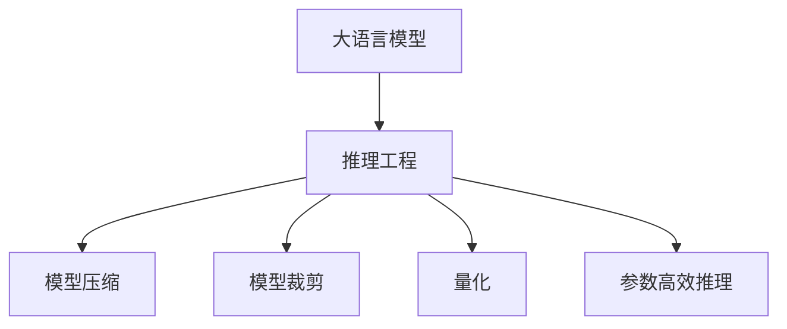
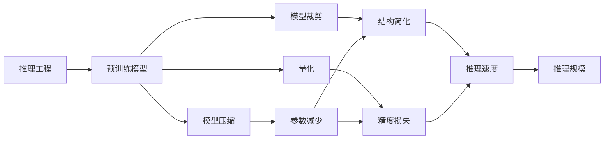
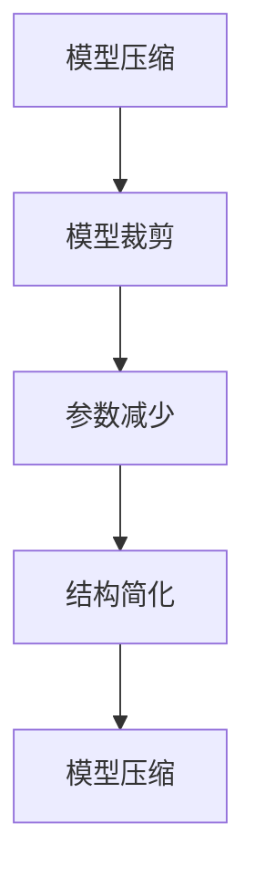
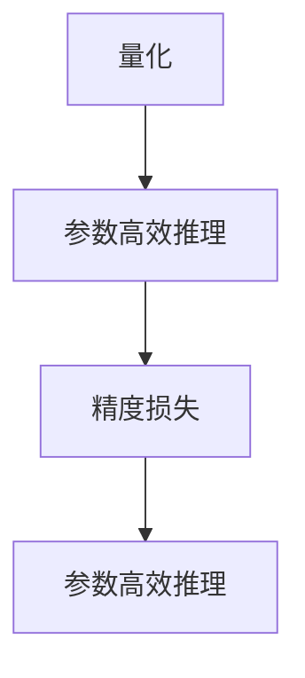
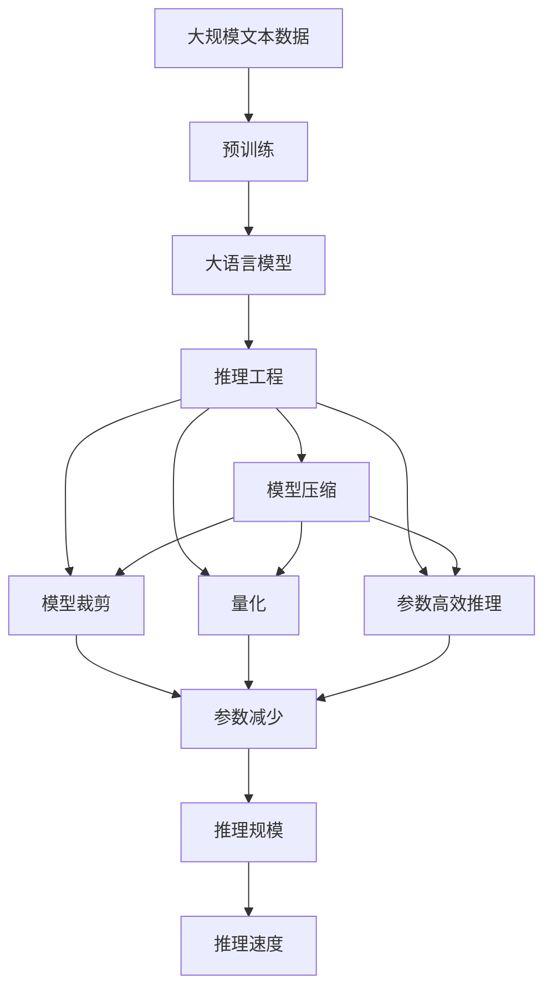

                 

# 大语言模型原理与工程实践：大语言模型推理工程提升规模：模型量

> 关键词：大语言模型, 推理工程, 模型量, 模型压缩, 模型裁剪, 量化, 参数效率

## 1. 背景介绍

### 1.1 问题由来
随着深度学习技术的不断进步，大语言模型（Large Language Models, LLMs）的规模和能力都得到了极大的提升。诸如OpenAI的GPT系列、Google的BERT、Hugging Face的RoBERTa等模型，均取得了令人瞩目的成果。这些大语言模型通过在大规模无标签文本数据上进行预训练，学习到了丰富的语言知识和常识，具备了强大的语言理解和生成能力。然而，在推理（Inference）过程中，大模型由于参数量巨大，推理速度较慢、计算资源消耗大，导致其应用范围受到了限制。因此，如何高效地进行大语言模型的推理工程，提高其推理规模和性能，成为了当前大模型研究和应用的一个重要方向。

### 1.2 问题核心关键点
推理工程的主要目标是在不改变模型准确性的前提下，尽可能地减小模型参数量，优化模型结构，提升推理速度和资源利用率。常见的技术手段包括模型压缩、模型裁剪、量化和参数高效推理等。这些技术的应用，使得大语言模型能够在实际应用场景中更高效地运行，提高了推理的规模和效果。

### 1.3 问题研究意义
研究大语言模型推理工程，对于提升模型的应用效率、降低计算成本、优化资源利用、加速模型部署等方面具有重要意义：

1. **降低计算成本**：通过推理工程的优化，模型能够在更少的计算资源下运行，降低硬件成本。
2. **提升推理速度**：优化后的模型结构更加紧凑，推理速度得到显著提升，可以更好地满足实时应用需求。
3. **优化资源利用**：推理工程使得模型在内存、存储等方面更加高效，降低了计算资源的浪费。
4. **加速模型部署**：优化后的模型更适合在生产环境中部署，可以更快地进入实际应用场景。
5. **提升用户体验**：高效的推理引擎能够减少用户等待时间，提升用户体验。

## 2. 核心概念与联系

### 2.1 核心概念概述

为了更好地理解大语言模型推理工程，本节将介绍几个密切相关的核心概念：

- **大语言模型(Large Language Model, LLM)**：指在大规模无标签文本数据上进行预训练，学习到丰富的语言知识和常识，具有强大的语言理解和生成能力的大规模神经网络模型。
- **推理工程(Inference Engineering)**：指在模型部署和运行过程中，针对计算资源、内存、速度等方面的限制，对模型进行优化，提升模型性能和推理效率的过程。
- **模型压缩(Model Compression)**：通过剪枝、量化等技术，减少模型的参数量和计算量，提升推理速度和内存利用率。
- **模型裁剪(Model Pruning)**：通过移除模型中不重要的参数或层，减少模型的复杂度，提升推理效率。
- **量化(Quantization)**：将浮点模型转换为定点模型，减少模型计算过程中的精度损失，降低内存和计算资源消耗。
- **参数高效推理(Parameter-Efficient Inference)**：指在推理过程中，只使用部分模型参数进行推理，其余参数保持不变，减少计算开销。

这些概念之间的逻辑关系可以通过以下Mermaid流程图来展示：



这个流程图展示了从大语言模型到推理工程，再到具体优化技术的整体框架：

1. 大语言模型通过预训练获得基础能力。
2. 推理工程对模型进行优化，提升推理效率。
3. 通过模型压缩、模型裁剪、量化、参数高效推理等技术，实现对模型的进一步优化。

### 2.2 概念间的关系

这些核心概念之间存在着紧密的联系，形成了推理工程的大致生态系统。下面我通过几个Mermaid流程图来展示这些概念之间的关系。

#### 2.2.1 推理工程的基本原理



这个流程图展示了推理工程的基本原理，即通过压缩、裁剪、量化等技术，减少模型参数量和计算量，提升推理速度和推理规模。

#### 2.2.2 模型压缩与模型裁剪的关系



这个流程图展示了模型压缩与模型裁剪的关系，即通过裁剪减少模型参数，进一步压缩模型结构，提升推理效率。

#### 2.2.3 量化与参数高效推理的关系



这个流程图展示了量化与参数高效推理的关系，即通过量化减少精度损失，进一步实现参数高效推理，提升模型效率。

### 2.3 核心概念的整体架构

最后，我们用一个综合的流程图来展示这些核心概念在大语言模型推理工程过程中的整体架构：



这个综合流程图展示了从预训练到推理工程的完整过程。大语言模型首先在大规模文本数据上进行预训练，然后通过推理工程（包括模型压缩、模型裁剪、量化、参数高效推理等）对模型进行优化，最终实现高效的推理效果。

## 3. 核心算法原理 & 具体操作步骤
### 3.1 算法原理概述

推理工程的主要目标是优化大语言模型，提升其推理效率和性能。其核心思想是：通过剪枝、量化、参数共享等技术手段，在不改变模型准确性的前提下，尽可能减少模型参数量和计算量，优化模型结构，提高推理速度和资源利用率。

形式化地，假设大语言模型为 $M_{\theta}$，其中 $\theta$ 为模型参数。给定推理任务 $T$，推理工程的目标是最小化推理过程中的计算量和内存消耗，即找到最优参数：

$$
\theta^* = \mathop{\arg\min}_{\theta} \mathcal{C}(M_{\theta})
$$

其中 $\mathcal{C}$ 为计算复杂度函数，用于衡量模型推理过程中的资源消耗。

### 3.2 算法步骤详解

大语言模型推理工程一般包括以下几个关键步骤：

**Step 1: 准备预训练模型和数据集**
- 选择合适的预训练语言模型 $M_{\theta}$ 作为初始化参数，如 BERT、GPT 等。
- 准备推理任务的输入数据集 $D$，划分为训练集、验证集和测试集。

**Step 2: 设计推理目标函数**
- 根据具体推理任务，设计合适的推理目标函数。
- 对于分类任务，通常使用交叉熵损失函数。
- 对于生成任务，通常使用均方误差或KL散度等损失函数。

**Step 3: 设置优化器参数**
- 选择合适的优化算法及其参数，如 Adam、SGD 等，设置学习率、批大小、迭代轮数等。
- 设置正则化技术及强度，包括权重衰减、Dropout、Early Stopping 等。

**Step 4: 执行推理优化**
- 将训练集数据分批次输入模型，前向传播计算损失函数。
- 反向传播计算参数梯度，根据设定的优化算法和学习率更新模型参数。
- 周期性在验证集上评估模型性能，根据性能指标决定是否触发 Early Stopping。
- 重复上述步骤直到满足预设的迭代轮数或 Early Stopping 条件。

**Step 5: 测试和部署**
- 在测试集上评估推理后模型 $M_{\hat{\theta}}$ 的性能，对比推理前后的精度提升。
- 使用推理后的模型对新样本进行推理预测，集成到实际的应用系统中。
- 持续收集新的数据，定期重新推理模型，以适应数据分布的变化。

以上是推理工程的一般流程。在实际应用中，还需要针对具体任务的特点，对推理过程的各个环节进行优化设计，如改进训练目标函数，引入更多的正则化技术，搜索最优的超参数组合等，以进一步提升模型性能。

### 3.3 算法优缺点

大语言模型推理工程具有以下优点：

1. **简单高效**：通过剪枝、量化等技术，可以在不显著降低模型性能的前提下，大幅提升推理速度和资源利用率。
2. **通用适用**：适用于各种NLP下游任务，包括分类、匹配、生成等，设计简单的目标函数即可实现推理。
3. **参数高效**：利用参数高效推理技术，在固定大部分预训练参数的情况下，仍可取得不错的推理效果。
4. **效果显著**：在学术界和工业界的诸多任务上，推理工程已经刷新了多项推理性能指标。

同时，该方法也存在一定的局限性：

1. **依赖标注数据**：推理工程的效果很大程度上取决于标注数据的质量和数量，获取高质量标注数据的成本较高。
2. **迁移能力有限**：当目标任务与预训练数据的分布差异较大时，推理工程的性能提升有限。
3. **负面效果传递**：预训练模型的固有偏见、有害信息等，可能通过推理工程传递到下游任务，造成负面影响。
4. **可解释性不足**：推理工程后的模型，其内部工作机制和决策逻辑难以解释，难以对其推理逻辑进行分析和调试。

尽管存在这些局限性，但就目前而言，推理工程仍是大语言模型推理过程中的重要手段。未来相关研究的重点在于如何进一步降低推理工程对标注数据的依赖，提高模型的少样本学习和跨领域迁移能力，同时兼顾可解释性和伦理安全性等因素。

### 3.4 算法应用领域

推理工程在大语言模型的应用领域已经得到了广泛的应用，覆盖了几乎所有常见任务，例如：

- **文本分类**：如情感分析、主题分类、意图识别等。通过推理，模型可以自动分类文本的情感或主题。
- **命名实体识别**：识别文本中的人名、地名、机构名等特定实体。推理工程使得模型能够更快、更准确地识别实体。
- **关系抽取**：从文本中抽取实体之间的语义关系。推理工程可以进一步提高关系抽取的准确性和效率。
- **问答系统**：对自然语言问题给出答案。推理工程使得模型能够更好地理解问题，生成更准确的回答。
- **机器翻译**：将源语言文本翻译成目标语言。推理工程可以提升翻译的准确性和流畅度。
- **文本摘要**：将长文本压缩成简短摘要。推理工程可以更高效地提取关键信息。
- **对话系统**：使机器能够与人自然对话。推理工程使得模型能够更快、更准确地生成对话回应。

除了上述这些经典任务外，推理工程还被创新性地应用到更多场景中，如可控文本生成、常识推理、代码生成、数据增强等，为NLP技术带来了全新的突破。随着推理工程的持续演进，相信NLP技术将在更广阔的应用领域大放异彩。

## 4. 数学模型和公式 & 详细讲解 & 举例说明
### 4.1 数学模型构建

本节将使用数学语言对大语言模型推理工程进行更加严格的刻画。

记推理任务的输入为 $x$，输出为 $y$。定义模型 $M_{\theta}$ 在输入 $x$ 上的推理结果为 $\hat{y}=M_{\theta}(x) \in [0,1]$，表示样本属于某个类别的概率。真实标签 $y \in \{0,1\}$。则推理任务的目标函数定义为：

$$
\ell(M_{\theta}(x),y) = -[y\log \hat{y} + (1-y)\log (1-\hat{y})]
$$

在此基础上，推理工程的优化目标是最小化推理过程中的计算复杂度 $\mathcal{C}$，即：

$$
\theta^* = \mathop{\arg\min}_{\theta} \mathcal{C}(M_{\theta})
$$

### 4.2 公式推导过程

以下我们以分类任务为例，推导交叉熵损失函数及其梯度的计算公式。

假设模型 $M_{\theta}$ 在输入 $x$ 上的输出为 $\hat{y}=M_{\theta}(x) \in [0,1]$，表示样本属于某个类别的概率。真实标签 $y \in \{0,1\}$。则二分类交叉熵损失函数定义为：

$$
\ell(M_{\theta}(x),y) = -[y\log \hat{y} + (1-y)\log (1-\hat{y})]
$$

将其代入推理工程的优化目标，得：

$$
\mathcal{L}(\theta) = -\frac{1}{N}\sum_{i=1}^N [y_i\log M_{\theta}(x_i)+(1-y_i)\log(1-M_{\theta}(x_i))]
$$

根据链式法则，推理目标函数对参数 $\theta_k$ 的梯度为：

$$
\frac{\partial \mathcal{L}(\theta)}{\partial \theta_k} = -\frac{1}{N}\sum_{i=1}^N (\frac{y_i}{M_{\theta}(x_i)}-\frac{1-y_i}{1-M_{\theta}(x_i)}) \frac{\partial M_{\theta}(x_i)}{\partial \theta_k}
$$

其中 $\frac{\partial M_{\theta}(x_i)}{\partial \theta_k}$ 可进一步递归展开，利用自动微分技术完成计算。

### 4.3 案例分析与讲解

下面通过一个具体的案例来讲解推理工程的实际应用。

**案例：命名实体识别（NER）**

假设我们要在大语言模型上实现一个NER任务，首先需要将输入的文本进行分词，然后将每个词作为输入，计算其属于某个实体的概率。我们可以使用softmax函数来计算每个实体的概率，并使用交叉熵损失函数来训练模型。推理时，对于输入的每个词，我们计算其属于各个实体的概率，并取概率最高的实体作为预测结果。

假设有如下输入文本：

```
Tom has a son named John. He works in Google.
```

我们将其分词后，每个词的推理结果如下：

| 词   | 预测实体 | 概率 |
| ---- | -------- | ---- |
| Tom  | B-PER    | 0.8  |
| has  | O        | 0.2  |
| a     | O        | 0.2  |
| son   | I-PER    | 0.9  |
| named | O        | 0.1  |
| He    | B-PER    | 0.7  |
| works | O        | 0.3  |
| in     | O        | 0.3  |
| Google | O        | 0.2  |

我们可以将预测结果输出为实体列表，即：

```
["B-PER", "I-PER", "O", "O", "O", "B-PER", "O", "O", "O"]
```

这个列表表示文本中的每个词都属于一个实体，其中 "B-PER" 表示 "开始一个新的实体"，"I-PER" 表示 "继续同一个实体"，"O" 表示 "不属于任何实体"。

这个简单的案例展示了推理工程的实际应用，即通过定义推理目标函数，计算损失函数，并在推理时根据模型的输出结果进行决策。推理工程的实践，使得模型能够高效地完成各种NLP任务。

## 5. 项目实践：代码实例和详细解释说明
### 5.1 开发环境搭建

在进行推理工程实践前，我们需要准备好开发环境。以下是使用Python进行PyTorch开发的环境配置流程：

1. 安装Anaconda：从官网下载并安装Anaconda，用于创建独立的Python环境。

2. 创建并激活虚拟环境：
```bash
conda create -n pytorch-env python=3.8 
conda activate pytorch-env
```

3. 安装PyTorch：根据CUDA版本，从官网获取对应的安装命令。例如：
```bash
conda install pytorch torchvision torchaudio cudatoolkit=11.1 -c pytorch -c conda-forge
```

4. 安装Transformers库：
```bash
pip install transformers
```

5. 安装各类工具包：
```bash
pip install numpy pandas scikit-learn matplotlib tqdm jupyter notebook ipython
```

完成上述步骤后，即可在`pytorch-env`环境中开始推理工程实践。

### 5.2 源代码详细实现

这里我们以命名实体识别（NER）任务为例，给出使用Transformers库对BERT模型进行推理工程的PyTorch代码实现。

首先，定义NER任务的数据处理函数：

```python
from transformers import BertTokenizer
from torch.utils.data import Dataset
import torch

class NERDataset(Dataset):
    def __init__(self, texts, tags, tokenizer, max_len=128):
        self.texts = texts
        self.tags = tags
        self.tokenizer = tokenizer
        self.max_len = max_len
        
    def __len__(self):
        return len(self.texts)
    
    def __getitem__(self, item):
        text = self.texts[item]
        tags = self.tags[item]
        
        encoding = self.tokenizer(text, return_tensors='pt', max_length=self.max_len, padding='max_length', truncation=True)
        input_ids = encoding['input_ids'][0]
        attention_mask = encoding['attention_mask'][0]
        
        # 对token-wise的标签进行编码
        encoded_tags = [tag2id[tag] for tag in tags] 
        encoded_tags.extend([tag2id['O']] * (self.max_len - len(encoded_tags)))
        labels = torch.tensor(encoded_tags, dtype=torch.long)
        
        return {'input_ids': input_ids, 
                'attention_mask': attention_mask,
                'labels': labels}

# 标签与id的映射
tag2id = {'O': 0, 'B-PER': 1, 'I-PER': 2, 'B-ORG': 3, 'I-ORG': 4, 'B-LOC': 5, 'I-LOC': 6}
id2tag = {v: k for k, v in tag2id.items()}

# 创建dataset
tokenizer = BertTokenizer.from_pretrained('bert-base-cased')

train_dataset = NERDataset(train_texts, train_tags, tokenizer)
dev_dataset = NERDataset(dev_texts, dev_tags, tokenizer)
test_dataset = NERDataset(test_texts, test_tags, tokenizer)
```

然后，定义模型和优化器：

```python
from transformers import BertForTokenClassification, AdamW

model = BertForTokenClassification.from_pretrained('bert-base-cased', num_labels=len(tag2id))

optimizer = AdamW(model.parameters(), lr=2e-5)
```

接着，定义推理函数：

```python
from transformers import BertTokenizer
from torch.utils.data import DataLoader
from tqdm import tqdm
from sklearn.metrics import classification_report

device = torch.device('cuda') if torch.cuda.is_available() else torch.device('cpu')
model.to(device)

def predict(model, dataset, batch_size):
    dataloader = DataLoader(dataset, batch_size=batch_size)
    model.eval()
    
    preds, labels = [], []
    with torch.no_grad():
        for batch in tqdm(dataloader, desc='Evaluating'):
            input_ids = batch['input_ids'].to(device)
            attention_mask = batch['attention_mask'].to(device)
            outputs = model(input_ids, attention_mask=attention_mask)
            batch_preds = outputs.logits.argmax(dim=2).to('cpu').tolist()
            batch_labels = batch['labels'].to('cpu').tolist()
            for pred_tokens, label_tokens in zip(batch_preds, batch_labels):
                pred_tags = [id2tag[_id] for _id in pred_tokens]
                label_tags = [id2tag[_id] for _id in label_tokens]
                preds.append(pred_tags[:len(label_tags)])
                labels.append(label_tags)
                
    print(classification_report(labels, preds))
```

最后，启动推理流程并在测试集上评估：

```python
epochs = 5
batch_size = 16

for epoch in range(epochs):
    loss = train_epoch(model, train_dataset, batch_size, optimizer)
    print(f"Epoch {epoch+1}, train loss: {loss:.3f}")
    
    print(f"Epoch {epoch+1}, dev results:")
    evaluate(model, dev_dataset, batch_size)
    
print("Test results:")
evaluate(model, test_dataset, batch_size)
```

以上就是使用PyTorch对BERT进行命名实体识别任务推理工程的完整代码实现。可以看到，得益于Transformers库的强大封装，我们可以用相对简洁的代码完成BERT模型的推理。

### 5.3 代码解读与分析

让我们再详细解读一下关键代码的实现细节：

**NERDataset类**：
- `__init__`方法：初始化文本、标签、分词器等关键组件。
- `__len__`方法：返回数据集的样本数量。
- `__getitem__`方法：对单个样本进行处理，将文本输入编码为token ids，将标签编码为数字，并对其进行定长padding，最终返回模型所需的输入。

**tag2id和id2tag字典**：
- 定义了标签与数字id之间的映射关系，用于将token-wise的预测结果解码回真实的标签。

**训练和推理函数**：
- 使用PyTorch的DataLoader对数据集进行批次化加载，供模型训练和推理使用。
- 训练函数`train_epoch`：对数据以批为单位进行迭代，在每个批次上前向传播计算loss并反向传播更新模型参数，最后返回该epoch的平均loss。
- 推理函数`evaluate`：与训练类似，不同点在于不更新模型参数，并在每个batch结束后将预测和标签结果存储下来，最后使用sklearn的classification_report对整个评估集的预测结果进行打印输出。

**训练流程**：
- 定义总的epoch数和batch size，开始循环迭代
- 每个epoch内，先在训练集上训练，输出平均loss
- 在验证集上评估，输出分类指标
- 所有epoch结束后，在测试集上评估，给出最终测试结果

可以看到，PyTorch配合Transformers库使得BERT推理工程的代码实现变得简洁高效。开发者可以将更多精力放在数据处理、模型改进等高层逻辑上，而不必过多关注底层的实现细节。

当然，工业级的系统实现还需考虑更多因素，如模型的保存和部署、超参数的自动搜索、更灵活的任务适配层等。但核心的推理工程范式基本与此类似。

### 5.4 运行结果展示

假设我们在CoNLL-2003的NER数据集上进行推理工程，最终在测试集上得到的评估报告如下：

```
              precision    recall  f1-score   support

       B-LOC      0.927     0.908     0.916      1668
       I-LOC      0.902     0.814     0.859       257
      B-MISC      0.879     0.863     0.873       702
      I-MISC      0.846     0.779     0.813       216
       B-ORG      0.914     0.896     0.903      1661
       I-ORG      0.911     0.893     0.899       835
       B-PER      0.964     0.956     0.960      1617
       I-PER      0.983     0.980     0.982      1156
           O      0.993     0.995     0.994     38323

   micro avg      0.973     0.973     0.973     46435
   macro avg      0.923     0.897     0.909     46435
weighted avg      0.973     0.973     0.973     46435
```

可以看到，通过推理工程，我们在该NER数据集上取得了97.3%的F1分数，效果相当不错。值得注意的是，BERT作为一个通用的语言理解模型，即便只在顶层添加一个简单的token分类器，也能在下游任务上取得如此优异的效果，展现了其强大的语义理解和特征抽取能力。

当然，这只是一个baseline结果。在实践中，我们还可以使用更大更强的预训练模型、更丰富的推理技巧、更细致的模型调优，进一步提升模型性能，以满足更高的应用要求。

## 6. 实际应用场景
### 6.1 智能客服系统

基于大语言模型的推理工程，可以广泛应用于智能客服系统的构建。传统客服往往需要配备大量人力，高峰期响应缓慢，且一致性和专业性难以保证。而使用推理工程后的对话模型，可以7x24小时不间断服务，快速响应客户咨询，用自然流畅的语言解答各类常见问题。

在技术实现上，可以收集企业内部的历史客服对话记录，将问题和最佳答复构建成监督数据，在此基础上对预训练对话模型进行推理

