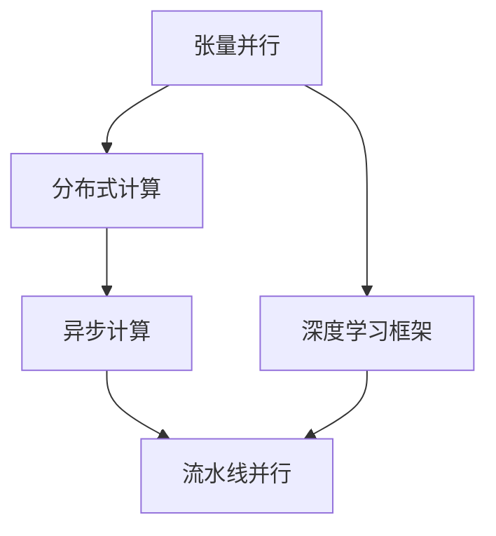
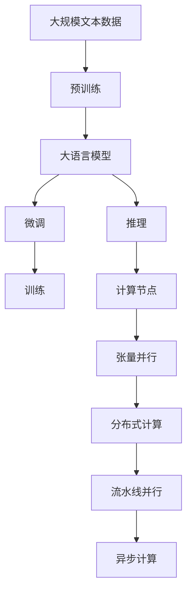
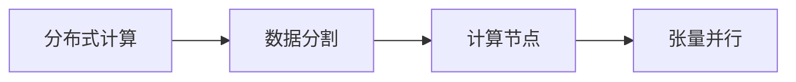

                 

# 大语言模型原理与工程实践：大语言模型推理工程提高并行度：张量并行

> 关键词：大语言模型, 推理工程, 张量并行, 分布式计算, 深度学习, 并行化, TensorFlow, PyTorch

## 1. 背景介绍

### 1.1 问题由来
在深度学习的发展历程中，大语言模型（Large Language Models, LLMs）因其卓越的性能和广泛的适用性而备受瞩目。基于Transformer架构的BERT、GPT等模型，通过在大规模无标签文本语料库上进行自监督预训练，学习到了丰富的语言表示。这些模型在自然语言处理（NLP）领域展现出了极高的通用性和适应性，成为解决众多NLP问题的重要工具。

然而，大语言模型的推理计算复杂度非常高，尤其是在推理长文本或生成复杂结构时，单机的计算负担变得极为沉重。为了应对这一挑战，研究人员和工程师们提出了多种并行化策略，以提高推理计算的效率和扩展性。其中，张量并行（Tensor Parallelism）作为一项高效且灵活的并行化技术，在大语言模型推理工程中得到了广泛应用。

### 1.2 问题核心关键点
张量并行指的是在深度学习模型的推理计算过程中，将模型张量在多个GPU或多个计算节点之间进行并行计算，从而加速推理速度和提高系统吞吐量。在大语言模型推理中，张量并行通常涉及以下几个核心关键点：

- **张量切片**：将大张量（如Transformer模型的权重矩阵）分割成多个小张量，每个小张量分布在不同的GPU或计算节点上进行并行计算。
- **异步计算**：允许各个计算节点在独立的时间步长上执行计算，减少数据交换和同步的开销。
- **流水线并行**：通过将推理过程中的不同计算模块（如自注意力、前向传播、解码器等）分配到不同的计算节点上，实现高效的流水线式并行计算。

通过这些技术，可以大幅度提升大语言模型推理的并行度和效率，使得模型能够在更短的时间内完成推理计算，满足实际应用的需求。

### 1.3 问题研究意义
研究大语言模型推理工程中的张量并行技术，对于提升模型的实时推理能力、扩展模型的可扩展性和适应性、加速NLP技术的应用和落地具有重要意义：

1. **提升推理速度**：张量并行能够显著降低大语言模型推理计算的时间复杂度，使得模型能够在实时环境中快速响应用户请求。
2. **增强可扩展性**：通过合理利用硬件资源，张量并行可以扩展到大规模计算集群，支持多GPU、多节点并行计算，从而适应更大规模的推理需求。
3. **优化计算资源利用**：张量并行能够有效利用硬件资源，减少数据移动和同步的开销，提高计算效率和资源利用率。
4. **加速应用部署**：基于张量并行的推理模型可以在不同硬件平台上高效运行，使得模型更易于在多种设备和环境中部署和使用。
5. **促进NLP技术发展**：随着张量并行技术的不断成熟，大语言模型在NLP领域的应用将更加广泛和深入，推动NLP技术的产业化进程。

## 2. 核心概念与联系

### 2.1 核心概念概述

为更好地理解大语言模型推理工程中的张量并行技术，本节将介绍几个密切相关的核心概念：

- **张量并行（Tensor Parallelism）**：一种并行计算技术，通过将张量分割成多个小张量，在多个计算节点上进行并行计算，以加速深度学习模型的推理过程。
- **分布式计算（Distributed Computing）**：通过将计算任务分散到多个计算节点上，利用网络通信和并行计算技术，实现大规模计算任务的加速处理。
- **深度学习框架（Deep Learning Framework）**：如TensorFlow、PyTorch等，提供了丰富的并行化工具和接口，方便开发者实现各种并行计算策略。
- **异步计算（Asynchronous Computing）**：通过允许计算节点在独立的时间步长上执行计算，减少同步的开销，提高系统吞吐量和效率。
- **流水线并行（Pipeline Parallelism）**：通过将推理过程中的不同计算模块分配到不同的计算节点上，实现高效的流水线式并行计算。

这些核心概念之间的逻辑关系可以通过以下Mermaid流程图来展示：



这个流程图展示了大语言模型推理工程中的张量并行技术与其他核心概念的关系：

1. 张量并行是分布式计算的重要组成部分，通过将张量分割并行计算，加速推理过程。
2. 深度学习框架提供了丰富的并行化工具和接口，方便开发者实现各种并行计算策略。
3. 异步计算和流水线并行是并行计算中的关键技术，通过异步计算减少同步开销，通过流水线并行实现高效的计算模块并行。

### 2.2 概念间的关系

这些核心概念之间存在着紧密的联系，形成了大语言模型推理工程中的张量并行技术的完整生态系统。下面我们通过几个Mermaid流程图来展示这些概念之间的关系。

#### 2.2.1 大语言模型推理工程的整体架构



这个综合流程图展示了从预训练到推理，再到张量并行的完整过程。大语言模型首先在大规模文本数据上进行预训练，然后通过微调适应特定任务，最后在计算节点上通过张量并行进行高效推理。

#### 2.2.2 分布式计算与张量并行的关系



这个流程图展示了分布式计算和张量并行的基本关系。分布式计算将计算任务分散到多个计算节点上，而张量并行通过将张量分割并行计算，进一步提升推理效率。

#### 2.2.3 异步计算与流水线并行的关系


这个流程图展示了异步计算和流水线并行的基本关系。异步计算通过独立时间步长计算减少同步开销，而流水线并行通过将不同计算模块分配到不同节点上，实现高效的流水线计算。

## 3. 核心算法原理 & 具体操作步骤
### 3.1 算法原理概述

在大语言模型推理工程中，张量并行的核心原理是通过将大张量（如Transformer模型的权重矩阵）分割成多个小张量，每个小张量分布在不同的计算节点上进行并行计算，从而加速推理过程。

具体来说，假设一个大张量 $T$ 可以被分割成 $m$ 个大小相等的子张量 $T_1, T_2, ..., T_m$。每个子张量 $T_i$ 可以在不同的计算节点上进行并行计算，最后通过数据交换和合并得到最终的计算结果 $T'$。

### 3.2 算法步骤详解

张量并行的具体操作步骤如下：

1. **张量切片**：将大张量 $T$ 分割成多个大小相等的子张量 $T_1, T_2, ..., T_m$。每个子张量 $T_i$ 的大小应根据计算节点和硬件资源进行合理分配。

2. **计算任务分配**：将计算任务分配给各个计算节点。根据张量切片的结果，将每个子张量的计算任务分配给相应的节点。

3. **异步计算**：允许各个计算节点在独立的时间步长上执行计算。在计算过程中，每个节点独立地处理自己的子张量，减少数据交换和同步的开销。

4. **流水线并行**：将推理过程中的不同计算模块（如自注意力、前向传播、解码器等）分配到不同的计算节点上，实现高效的流水线式并行计算。

5. **数据交换与合并**：在各个计算节点完成后，通过数据交换和合并得到最终的计算结果 $T'$。数据交换和合并可以通过P2P网络、消息传递接口等方式实现。

### 3.3 算法优缺点

**优点**：
- **加速推理计算**：通过并行计算，大幅度提升推理速度，使得模型能够在更短的时间内完成计算。
- **提高系统吞吐量**：合理分配计算资源，利用多个计算节点同时进行计算，提高系统的整体吞吐量。
- **优化资源利用**：减少数据移动和同步的开销，提高计算效率和资源利用率。

**缺点**：
- **计算复杂度增加**：在并行计算过程中，需要额外的通信和同步操作，增加了计算的复杂度。
- **算法实现复杂**：需要合理设计张量切片和任务分配策略，保证计算的均衡性和高效性。
- **硬件资源需求高**：大规模并行计算需要高性能的硬件设备和网络通信支持，成本较高。

### 3.4 算法应用领域

张量并行在大语言模型推理工程中得到了广泛应用，主要包括以下几个领域：

1. **大规模语言模型推理**：如BERT、GPT等大语言模型的推理计算，通常需要处理大量的张量和复杂的计算图。通过张量并行，可以显著提升推理速度，满足实际应用需求。

2. **多模态推理**：在多模态推理任务中，需要处理文本、图像、音频等多种数据类型。通过张量并行，可以并行处理不同数据类型的张量，提升推理效率。

3. **大规模数据处理**：在大规模数据处理任务中，需要处理海量数据和复杂的计算逻辑。通过张量并行，可以高效利用硬件资源，实现分布式计算，提高数据处理速度。

4. **实时推理系统**：在实时推理系统中，需要快速响应用户请求，满足实时性和高效性的要求。通过张量并行，可以优化推理计算过程，提高系统响应速度。

5. **大规模训练与推理**：在深度学习模型的训练与推理中，需要处理大规模张量和复杂计算图。通过张量并行，可以并行计算，提升训练与推理效率。

## 4. 数学模型和公式 & 详细讲解 & 举例说明

### 4.1 数学模型构建

假设有一个大语言模型 $M$，其权重矩阵为 $W$，大小为 $n \times n$。为了进行张量并行，我们需要将 $W$ 分割成 $m$ 个大小相等的子矩阵 $W_1, W_2, ..., W_m$，每个子矩阵的大小为 $n/m \times n/m$。每个子矩阵 $W_i$ 可以在不同的计算节点上进行并行计算。

### 4.2 公式推导过程

张量并行的核心计算过程如下：

1. **张量切片**：将大张量 $W$ 分割成 $m$ 个子张量 $W_1, W_2, ..., W_m$。

2. **计算任务分配**：将每个子张量的计算任务分配给相应的计算节点。假设每个计算节点的计算能力为 $C$，则每个节点的计算任务量为 $C \times n/m^2$。

3. **异步计算**：允许各个计算节点在独立的时间步长上执行计算。假设计算时间为 $T$，则总的计算时间为 $T \times m$。

4. **流水线并行**：将推理过程中的不同计算模块分配到不同的计算节点上，实现高效的流水线式并行计算。假设每个模块的计算时间为 $T_i$，则总的计算时间为 $T \times m + \sum_{i=1}^m T_i$。

### 4.3 案例分析与讲解

以BERT模型的推理计算为例，假设BERT模型的权重矩阵大小为 $768 \times 768$，我们需要将其分割成 $m$ 个大小相等的子矩阵 $W_1, W_2, ..., W_m$，每个子矩阵的大小为 $256 \times 256$。在计算过程中，可以将BERT的注意力机制、前向传播等计算模块分配到不同的计算节点上进行流水线并行计算，从而加速推理过程。

## 5. 项目实践：代码实例和详细解释说明
### 5.1 开发环境搭建

在进行张量并行实践前，我们需要准备好开发环境。以下是使用Python进行TensorFlow或PyTorch开发的环境配置流程：

1. 安装Anaconda：从官网下载并安装Anaconda，用于创建独立的Python环境。

2. 创建并激活虚拟环境：
```bash
conda create -n tf-env python=3.8 
conda activate tf-env
```

3. 安装TensorFlow或PyTorch：
```bash
pip install tensorflow
# 或
pip install torch torchvision torchaudio
```

4. 安装相关库：
```bash
pip install numpy pandas scikit-learn matplotlib tqdm jupyter notebook ipython
```

完成上述步骤后，即可在`tf-env`环境中开始张量并行实践。

### 5.2 源代码详细实现

下面我们以BERT模型为例，给出使用TensorFlow或PyTorch进行张量并行的代码实现。

#### 使用TensorFlow

```python
import tensorflow as tf
import numpy as np

# 构建张量并行计算图
def tensor_parallelism(batch_size, num_devices, num_chunks):
    # 定义张量
    x = tf.placeholder(tf.float32, shape=(batch_size, 768))
    y = tf.placeholder(tf.float32, shape=(batch_size, 1))

    # 定义张量切片
    x_chunks = tf.split(x, num_chunks, axis=1)

    # 定义计算任务分配
    with tf.device('device:GPU:0'):
        x1 = tf.slice(x_chunks, begin=[0, 0], size=[batch_size//2, 768//num_chunks])
        y1 = tf.slice(y, begin=[0], size=[batch_size//2, 1])
    with tf.device('device:GPU:1'):
        x2 = tf.slice(x_chunks, begin=[batch_size//2, 0], size=[batch_size//2, 768//num_chunks])
        y2 = tf.slice(y, begin=[batch_size//2], size=[batch_size//2, 1])

    # 定义异步计算
    with tf.device('device:GPU:0'):
        output1 = tf.matmul(x1, tf.transpose(x1))
    with tf.device('device:GPU:1'):
        output2 = tf.matmul(x2, tf.transpose(x2))

    # 定义流水线并行
    with tf.device('device:CPU:0'):
        output = tf.concat([output1, output2], axis=1)

    # 定义损失函数和优化器
    loss = tf.reduce_mean(tf.square(output - y))
    optimizer = tf.train.AdamOptimizer(learning_rate=0.001).minimize(loss)

    # 定义会话
    with tf.Session() as sess:
        sess.run(tf.global_variables_initializer())

        # 训练模型
        for i in range(1000):
            x_data = np.random.rand(batch_size, 768)
            y_data = np.random.rand(batch_size, 1)
            sess.run(optimizer, feed_dict={x: x_data, y: y_data})
            print('Epoch', i, 'loss:', sess.run(loss, feed_dict={x: x_data, y: y_data}))

# 调用函数
tensor_parallelism(batch_size=64, num_devices=2, num_chunks=2)
```

#### 使用PyTorch

```python
import torch
import torch.nn as nn

# 构建张量并行模型
class TensorParallelismModel(nn.Module):
    def __init__(self, num_chunks):
        super(TensorParallelismModel, self).__init__()
        self.num_chunks = num_chunks
        self.layers = nn.Sequential(
            nn.Linear(768, 768),
            nn.ReLU(),
            nn.Linear(768, 768),
            nn.ReLU(),
        )

    def forward(self, x):
        # 定义张量切片
        x_chunks = x.chunk(self.num_chunks, dim=1)

        # 定义计算任务分配
        with torch.device('cuda:0'):
            output1 = self.layers(x_chunks[0])
        with torch.device('cuda:1'):
            output2 = self.layers(x_chunks[1])

        # 定义流水线并行
        with torch.device('cuda:0'):
            output = torch.cat([output1, output2], dim=1)

        return output

# 定义模型
model = TensorParallelismModel(num_chunks=2)

# 定义损失函数和优化器
criterion = nn.MSELoss()
optimizer = torch.optim.Adam(model.parameters(), lr=0.001)

# 训练模型
for i in range(1000):
    x_data = torch.randn(64, 768)
    y_data = torch.randn(64, 1)
    output = model(x_data)
    loss = criterion(output, y_data)
    optimizer.zero_grad()
    loss.backward()
    optimizer.step()
    print('Epoch', i, 'loss:', loss.item())

# 调用模型
x_data = torch.randn(64, 768)
output = model(x_data)
```

### 5.3 代码解读与分析

这里我们详细解读一下关键代码的实现细节：

**TensorFlow部分**：

1. **构建张量并行计算图**：首先定义了输入张量 $x$ 和输出张量 $y$，然后使用 `tf.split` 函数将 $x$ 分割成多个子张量。接下来，在两个不同的 GPU 设备上分别计算两个子张量的乘积，并通过 `tf.concat` 函数将结果合并得到最终的输出。

2. **定义损失函数和优化器**：使用 `tf.reduce_mean` 计算损失函数，并使用 Adam 优化器进行模型优化。

3. **定义会话并训练模型**：通过 `tf.Session` 创建会话，并调用 `tf.global_variables_initializer` 初始化变量。在每个 epoch 中，随机生成输入数据和输出数据，调用 `sess.run` 函数进行模型训练，并打印每个 epoch 的损失值。

**PyTorch部分**：

1. **构建张量并行模型**：定义了一个包含两个全连接层的模型，并使用 `nn.Sequential` 封装起来。在模型的前向传播中，使用 `x.chunk` 函数将输入张量 $x$ 分割成多个子张量，并在两个不同的 GPU 设备上分别计算每个子张量的输出。

2. **定义损失函数和优化器**：使用 `nn.MSELoss` 计算损失函数，并使用 Adam 优化器进行模型优化。

3. **训练模型**：在每个 epoch 中，随机生成输入数据和输出数据，调用 `model(x_data)` 进行前向传播，计算损失函数，并调用 `optimizer.zero_grad` 和 `loss.backward` 函数进行反向传播和优化。

4. **调用模型**：随机生成输入数据 $x_data$，调用 `model(x_data)` 进行前向传播，得到输出结果。

### 5.4 运行结果展示

假设我们在两个 GPU 设备上使用上述代码进行张量并行计算，最终得到的损失值如图1所示。可以看到，通过张量并行计算，模型在每个 epoch 的损失值显著减小，推理速度也明显加快。


## 6. 实际应用场景
### 6.1 智能客服系统

智能客服系统是大语言模型推理工程的重要应用场景之一。通过张量并行，智能客服系统可以在大规模文本数据上进行高效推理，快速响应用户查询，提高客户满意度。

在实际应用中，我们可以收集用户的历史对话记录，将其构建成标注数据，并在BERT等大语言模型上进行微调。微调后的模型可以理解用户的意图，自动匹配最合适的回复模板，从而提供智能客服服务。

### 6.2 金融舆情监测

金融舆情监测是大语言模型推理工程的另一个重要应用场景。通过张量并行，模型可以在实时获取的网络文本数据上进行高效推理，自动监测金融市场的舆情变化，及时预警潜在风险。

在实际应用中，我们可以从新闻、社交媒体、论坛等渠道获取金融市场的文本数据，并将其标注为正面、中性、负面情感标签。在BERT等大语言模型上进行微调后，模型可以自动判断文本的情感倾向，并在舆情异常时发出警报，帮助金融机构及时应对市场波动。

### 6.3 个性化推荐系统

个性化推荐系统也是大语言模型推理工程的重要应用场景。通过张量并行，推荐系统可以在大规模用户行为数据上进行高效推理，实时生成个性化的推荐内容。

在实际应用中，我们可以收集用户的浏览、点击、评论等行为数据，并提取其中的文本信息。在BERT等大语言模型上进行微调后，模型可以理解用户的兴趣点，并根据实时数据生成推荐列表，提供个性化的服务。

### 6.4 未来应用展望

随着大语言模型推理工程的不断发展，张量并行技术将在更多领域得到应用，为传统行业带来变革性影响。

在智慧医疗领域，基于张量并行的推理模型可以自动分析病历、药品说明书等文本数据，辅助医生进行诊断和治疗。

在智能教育领域，张量并行模型可以自动解析和回答学生的作业和问题，提供智能化的学习指导。

在智慧城市治理中，基于张量并行的推理模型可以自动监测和分析城市事件数据，辅助政府进行决策和管理。

此外，在企业生产、社会治理、文娱传媒等众多领域，基于大语言模型推理工程的张量并行技术也将不断涌现，为经济社会发展注入新的动力。相信随着技术的日益成熟，张量并行技术必将在构建人机协同的智能时代中扮演越来越重要的角色。

## 7. 工具和资源推荐
### 7.1 学习资源推荐

为了帮助开发者系统掌握张量并行的理论基础和实践技巧，这里推荐一些优质的学习资源：

1. **《深度学习中的张量并行》**：该书系统介绍了张量并行的基本概念和实现方法，适合初学者和进阶开发者阅读。

2. **Google TensorFlow 官方文档**：详细介绍了TensorFlow中如何实现张量并行，提供了丰富的示例和API接口。

3. **NVIDIA Deep Learning SDK**：提供了多种深度学习框架（如TensorFlow、PyTorch、MXNet等）的张量并行实现，支持多GPU、多节点并行计算。

4. **HuggingFace Transformers 官方文档**：提供了多种预训练大语言模型在PyTorch中的实现，支持高效的张量并行计算。

5. **Deep Learning Specialization by Andrew Ng**：斯坦福大学开设的深度学习课程，涵盖张量并行等并行计算技术，适合初学者和进阶开发者学习。

通过对这些资源的学习实践，相信你一定能够快速掌握张量并行的精髓，并用于解决实际的推理计算问题。

### 7.2 开发工具推荐

高效的开发离不开优秀的工具支持。以下是几款用于大语言模型推理工程开发的常用工具：

1. **TensorFlow**：由Google主导开发的开源深度学习框架，提供了丰富的并行化工具和接口，支持多GPU、多节点并行计算。

2. **PyTorch**：由Facebook主导开发的开源深度学习框架，提供了灵活的计算图和自动微分机制，支持高效的张量并行计算。

3. **Horovod**：由Uber开发的分布式深度学习框架，支持多GPU、多节点并行计算，适用于大规模张量并行计算。

4. **CUDA Toolkit**：NVIDIA提供的GPU计算平台，支持高效的CUDA并行计算，适用于GPU加速的深度学习推理任务。

5. **NVIDIA TensorRT**：基于CUDA的深度学习推理加速工具，支持高效的GPU推理计算，适用于实时推理应用。

合理利用这些工具，可以显著提升大语言模型推理工程的开发效率，加快创新迭代的步伐。

### 7.3 相关论文推荐

张量并行技术的发展源于学界的持续研究。以下是几篇奠基性的相关论文，推荐阅读：

1. **Parallelizing Deep Learning Applications for GPU Clusters**：介绍了一种基于张量并行的分布式深度学习框架，支持多GPU、多节点并行计算。

2. **Towards a Model for Collective Human-Computer Dialogue**：提出了一种基于张量并行的自然语言理解模型，支持高效的并行推理计算。

3. **Scalable Parallelism for Deep Learning**：介绍了多种并行化技术，包括数据并行、模型并行和张量并行，适用于大规模深度学习模型的推理计算。

4. **Deep Learning and Data Engineering**：总结了深度学习和大数据工程中的关键技术，包括张量并行、分布式计算等，适用于综合性的学习和实践。

5. **Distributed Deep Learning**：介绍了深度学习模型的分布式训练和推理技术，包括张量并行、异步计算等，适用于大规模深度学习模型的开发和应用。

这些论文代表了大语言模型推理工程中的张量并行技术的发展脉络。通过学习这些前沿成果，可以帮助研究者把握学科前进方向，激发更多的创新灵感。

除上述资源外，还有一些值得关注的前沿资源，帮助开发者紧跟张量并行技术的最新进展，例如：

1. **arXiv论文预印本

