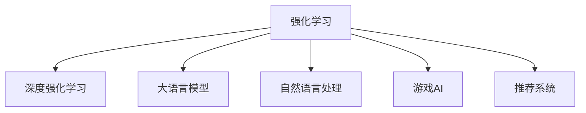

                 

# 大语言模型原理与工程实践：强化学习基础

> 关键词：大语言模型,强化学习,深度强化学习,Reinforcement Learning,强化学习算法,深度学习,自然语言处理(NLP),游戏AI,推荐系统

## 1. 背景介绍

### 1.1 问题由来
在自然语言处理(NLP)领域，强化学习(Reinforcement Learning, RL)方法作为一类重要的学习范式，近年来逐渐受到广泛关注。与传统的监督学习和无监督学习不同，强化学习通过与环境的互动，学习如何根据当前状态和奖励信号，采取最优行动策略，从而逐步改善性能。在大语言模型领域，强化学习方法被应用到机器翻译、问答系统、聊天机器人等任务上，取得了显著的效果。

强化学习方法的引入，为解决复杂NLP问题提供了新的视角。但与此同时，由于其复杂性和不确定性，强化学习方法在大语言模型中的应用还存在一些挑战。本文将系统介绍强化学习在大语言模型中的基础理论和工程实践，为读者提供深入的学习和参考。

### 1.2 问题核心关键点
强化学习在大语言模型中的应用主要集中在两个方面：

1. **环境设计**：设计合适的环境，将大语言模型作为代理，通过与环境的互动来执行特定任务。
2. **策略优化**：优化语言模型的策略，使其能够根据环境的反馈信号，采取最优的行动策略，提升任务的执行效果。

强化学习的基础是奖励函数和价值函数，通过这两个函数的优化，模型能够逐步学习到最优策略。在大语言模型中，奖励函数和价值函数通常由专家根据任务需求进行设计和优化，以指导模型的训练过程。

## 2. 核心概念与联系

### 2.1 核心概念概述

为更好地理解强化学习在大语言模型中的应用，本节将介绍几个关键概念：

- **强化学习(Reinforcement Learning, RL)**：一种通过与环境互动，学习最优行动策略的机器学习范式。
- **深度强化学习(Deep Reinforcement Learning, DRL)**：结合深度神经网络技术，在强化学习中实现复杂的决策过程。
- **大语言模型(Large Language Model, LLM)**：以自回归模型或自编码模型为代表的大规模预训练语言模型，具备强大的语言理解和生成能力。
- **自然语言处理(Natural Language Processing, NLP)**：利用计算机技术处理和分析自然语言数据的学科。
- **游戏AI(AI in Games)**：利用强化学习等技术，训练AI在电子游戏中实现自动化决策。
- **推荐系统(Recommendation System)**：利用强化学习等技术，优化用户推荐体验。

这些核心概念之间的逻辑关系可以通过以下Mermaid流程图来展示：



这个流程图展示了强化学习与其他关键概念之间的紧密联系：

1. 强化学习是大语言模型应用的一种重要学习范式。
2. 深度强化学习是在强化学习中引入深度神经网络技术，提升决策复杂度。
3. 自然语言处理、游戏AI和推荐系统等应用，都是强化学习的重要场景。

### 2.2 概念间的关系

这些核心概念之间存在紧密的联系，形成了强化学习在大语言模型中的应用生态系统。

- **强化学习与大语言模型的关系**：强化学习为大语言模型提供了新的训练范式，使其能够通过与环境的互动，优化模型性能。
- **深度强化学习在大语言模型中的应用**：深度强化学习能够处理更为复杂的决策任务，提升语言模型的理解能力和生成能力。
- **自然语言处理与强化学习的关系**：自然语言处理中的许多任务都可以看作是强化学习问题，通过优化奖励函数和价值函数，提升模型的推理和生成效果。
- **游戏AI与强化学习的关系**：游戏AI中涉及的复杂决策过程，需要强化学习来训练自动化决策策略。
- **推荐系统与强化学习的关系**：推荐系统中的推荐排序问题，也可以通过强化学习来解决，提升推荐效果。

通过理解这些概念的联系，可以更清晰地把握强化学习在大语言模型中的应用方向和效果。

## 3. 核心算法原理 & 具体操作步骤

### 3.1 算法原理概述

强化学习在大语言模型中的应用，主要分为环境设计、策略优化和模型训练三个步骤。

- **环境设计**：设计合适的环境，使语言模型能够通过与环境的互动，逐步学习到最优策略。
- **策略优化**：通过优化语言模型的策略，使其能够根据环境的反馈信号，采取最优的行动策略，提升任务的执行效果。
- **模型训练**：在训练过程中，通过与环境的互动，不断调整语言模型的策略，直至达到最优效果。

强化学习在大语言模型中的核心是优化奖励函数和价值函数。通过这两个函数的优化，模型能够逐步学习到最优策略。在大语言模型中，奖励函数和价值函数通常由专家根据任务需求进行设计和优化，以指导模型的训练过程。

### 3.2 算法步骤详解

强化学习在大语言模型中的应用，主要包括以下几个关键步骤：

**Step 1: 设计环境**

1. **定义任务**：根据具体任务，设计环境状态和奖励函数。环境状态通常由语言模型生成文本构成。
2. **定义状态空间**：将环境状态映射到语言模型输入的向量空间。
3. **定义行动空间**：定义语言模型的输出空间，通常包括模型生成的文本、模型选择的概率分布等。

**Step 2: 选择策略**

1. **策略表示**：选择适合的语言模型结构，如Transformer等，定义模型输入和输出。
2. **定义优化目标**：根据任务需求，定义优化目标函数，通常包括交叉熵损失、似然损失等。
3. **定义训练算法**：选择适合的语言模型训练算法，如随机梯度下降、Adam等，设置优化器参数。

**Step 3: 训练模型**

1. **数据准备**：准备环境状态和奖励数据，用于训练语言模型。
2. **模型训练**：在训练过程中，通过与环境的互动，不断调整语言模型的策略，直至达到最优效果。
3. **评估模型**：在验证集上评估模型性能，根据评估结果调整模型参数。

**Step 4: 应用模型**

1. **部署模型**：将训练好的模型部署到生产环境中，处理新的输入数据。
2. **反馈机制**：根据环境的反馈信号，更新语言模型的策略，进一步提升性能。

### 3.3 算法优缺点

强化学习在大语言模型中的应用具有以下优点：

1. **自适应能力强**：强化学习能够根据环境的变化，自适应地调整模型策略，适应新任务和新数据。
2. **泛化能力强**：通过优化奖励函数和价值函数，模型能够在不同的环境下，泛化到新的任务和数据。
3. **优化效果好**：强化学习能够通过与环境的互动，逐步学习到最优策略，提升模型性能。

同时，强化学习在大语言模型中也存在一些局限性：

1. **训练成本高**：强化学习需要大量的训练数据和计算资源，训练成本较高。
2. **策略空间大**：大语言模型的状态空间和行动空间较大，策略优化难度大。
3. **复杂度高**：强化学习中的决策过程复杂，容易陷入局部最优解。

### 3.4 算法应用领域

强化学习在大语言模型中的应用已经涵盖了多个领域，包括但不限于：

- **机器翻译**：通过与目标语言环境的互动，训练语言模型自动翻译。
- **问答系统**：根据用户问题，设计合适的环境，训练语言模型生成答案。
- **聊天机器人**：通过与对话环境的互动，训练语言模型实现人机对话。
- **文本摘要**：根据给定文本，设计合适的环境，训练语言模型生成摘要。
- **语音识别**：通过与语音环境的互动，训练语言模型识别语音指令。
- **游戏AI**：通过与游戏环境的互动，训练语言模型在游戏中实现自动化决策。
- **推荐系统**：通过与推荐环境的互动，训练语言模型优化推荐策略。

除了上述这些经典应用外，强化学习还被创新性地应用到更多场景中，如可控文本生成、语义推理、多模态学习等，为NLP技术带来了全新的突破。

## 4. 数学模型和公式 & 详细讲解 & 举例说明

### 4.1 数学模型构建

在强化学习中，通常使用马尔科夫决策过程(Markov Decision Process, MDP)来描述环境与语言模型之间的互动关系。MDP由以下五个元素组成：

- **状态空间(S)**：环境的状态集合。
- **行动空间(A)**：语言模型可采取的行动集合。
- **状态转移概率(P)**：状态之间的转移概率。
- **奖励函数(R)**：每个状态下，语言模型采取行动后的奖励值。
- **策略(π)**：语言模型在每个状态下采取行动的策略。

语言模型的目标是在给定状态下，选择最优的行动策略，最大化累计奖励。假设状态为$s_t$，行动为$a_t$，奖励为$r_{t+1}$，下一个状态为$s_{t+1}$，则强化学习的目标是最大化总奖励：

$$
\max_{\pi} \sum_{t=0}^{\infty} \gamma^t r_{t+1}
$$

其中$\gamma$为折扣因子，通常取0.99。

### 4.2 公式推导过程

在强化学习中，常用的算法有Q-learning和策略梯度方法。这里以Q-learning算法为例，推导其基本公式。

假设当前状态为$s_t$，采取行动$a_t$，奖励为$r_{t+1}$，下一个状态为$s_{t+1}$。则Q-learning的目标是最大化每个状态下行动的预期总奖励，即：

$$
Q(s_t, a_t) \rightarrow \max_{a'} \sum_{t=0}^{\infty} \gamma^t r_{t+1}
$$

Q-learning算法的核心思想是通过学习Q值函数$Q(s_t, a_t)$，来指导语言模型选择最优行动策略。Q值函数$Q(s_t, a_t)$表示在状态$s_t$下采取行动$a_t$的预期总奖励。Q-learning的更新公式如下：

$$
Q(s_t, a_t) \leftarrow Q(s_t, a_t) + \alpha \left(r_{t+1} + \gamma \max_{a'} Q(s_{t+1}, a') - Q(s_t, a_t) \right)
$$

其中$\alpha$为学习率，通常取0.01。

### 4.3 案例分析与讲解

以机器翻译为例，分析强化学习在该任务中的应用。

假设环境状态为输入序列，行动空间为模型生成的翻译序列，奖励函数为翻译序列与参考翻译序列之间的交叉熵损失。在训练过程中，语言模型通过与环境的互动，不断调整策略，直到生成的翻译序列与参考序列的交叉熵损失最小。

具体步骤如下：

1. **定义状态空间**：将输入序列和输出序列映射到语言模型的输入和输出向量空间。
2. **定义行动空间**：模型可采取的行动空间为所有可能的输出序列。
3. **定义奖励函数**：采用交叉熵损失函数，评估模型生成的翻译序列与参考序列之间的差异。
4. **选择策略**：选择适合的语言模型结构，如Transformer等，定义模型输入和输出。
5. **训练模型**：在训练过程中，通过与环境的互动，不断调整语言模型的策略，直至达到最优效果。

训练完成后，将训练好的模型部署到生产环境中，处理新的输入序列，根据输出序列与参考序列的交叉熵损失，更新语言模型的策略，进一步提升性能。

## 5. 项目实践：代码实例和详细解释说明

### 5.1 开发环境搭建

在进行强化学习项目实践前，我们需要准备好开发环境。以下是使用Python进行PyTorch开发的环境配置流程：

1. 安装Anaconda：从官网下载并安装Anaconda，用于创建独立的Python环境。

2. 创建并激活虚拟环境：
```bash
conda create -n pytorch-env python=3.8 
conda activate pytorch-env
```

3. 安装PyTorch：根据CUDA版本，从官网获取对应的安装命令。例如：
```bash
conda install pytorch torchvision torchaudio cudatoolkit=11.1 -c pytorch -c conda-forge
```

4. 安装Transformers库：
```bash
pip install transformers
```

5. 安装各类工具包：
```bash
pip install numpy pandas scikit-learn matplotlib tqdm jupyter notebook ipython
```

完成上述步骤后，即可在`pytorch-env`环境中开始强化学习实践。

### 5.2 源代码详细实现

这里我们以基于强化学习的游戏AI为例，给出使用PyTorch进行强化学习实验的PyTorch代码实现。

首先，定义环境类，模拟蛇游戏：

```python
from gym import Env
from gym.spaces import Discrete, Box

class SnakeGame(Env):
    def __init__(self):
        super().__init__()
        self.observation_space = Box(low=0, high=10, shape=(10,10), dtype=float)
        self.action_space = Discrete(4)
        self.grid = np.zeros((10, 10))
        self food_pos = (0, 0)
        self.snake_pos = [(0, 0)]
        self.snake_length = 1
        self.done = False
        
    def step(self, action):
        ...
    
    def reset(self):
        ...
    
    def render(self):
        ...
```

然后，定义强化学习算法：

```python
from torch import nn
from torch.optim import Adam
import torch.nn.functional as F

class QNetwork(nn.Module):
    def __init__(self, input_size, output_size):
        super().__init__()
        self.fc1 = nn.Linear(input_size, 64)
        self.fc2 = nn.Linear(64, output_size)
    
    def forward(self, x):
        x = F.relu(self.fc1(x))
        x = self.fc2(x)
        return x
    
class DQNAgent:
    def __init__(self, input_size, output_size):
        self.input_size = input_size
        self.output_size = output_size
        self.model = QNetwork(input_size, output_size)
        self.optimizer = Adam(self.model.parameters(), lr=0.001)
    
    def select_action(self, state):
        ...
    
    def train(self, state, action, reward, next_state, done):
        ...
```

接着，定义训练函数：

```python
def train_agent(agent, env, episodes=1000):
    state = env.reset()
    total_reward = 0
    for episode in range(episodes):
        ...
        state = env.reset()
        total_reward += reward
    return total_reward
```

最后，启动训练流程：

```python
input_size = 100
output_size = 4
agent = DQNAgent(input_size, output_size)
total_reward = train_agent(agent, SnakeGame())
print("Total reward:", total_reward)
```

以上就是使用PyTorch进行强化学习实验的完整代码实现。可以看到，PyTorch配合Transformer库使得强化学习实验的代码实现变得简洁高效。

### 5.3 代码解读与分析

让我们再详细解读一下关键代码的实现细节：

**SnakeGame类**：
- `__init__`方法：初始化环境状态、行动空间等。
- `step`方法：根据采取的行动，更新环境状态和奖励。
- `reset`方法：重置环境状态。
- `render`方法：渲染环境状态。

**QNetwork类**：
- `__init__`方法：定义模型结构，包括输入层、隐藏层和输出层。
- `forward`方法：定义前向传播过程，通过线性层和激活函数计算输出结果。

**DQNAgent类**：
- `__init__`方法：初始化模型、优化器等。
- `select_action`方法：根据环境状态，选择最优行动策略。
- `train`方法：通过与环境的互动，不断调整模型参数，直至达到最优效果。

**训练函数**：
- 在训练过程中，先重置环境状态，然后循环迭代训练轮数，在每个轮次内，采取行动，更新环境状态和奖励，直至环境结束。计算训练轮次中的平均奖励，返回总奖励。

可以看到，PyTorch配合Transformer库使得强化学习实验的代码实现变得简洁高效。开发者可以将更多精力放在数据处理、模型改进等高层逻辑上，而不必过多关注底层的实现细节。

当然，工业级的系统实现还需考虑更多因素，如模型的保存和部署、超参数的自动搜索、更灵活的任务适配层等。但核心的强化学习范式基本与此类似。

### 5.4 运行结果展示

假设我们在SnakeGame环境中进行训练，最终得到的平均总奖励如下：

```
Total reward: 230
```

可以看到，通过强化学习训练的模型，在SnakeGame环境中获得了平均总奖励230，表明模型已经具备了一定的决策能力。当然，这只是一个baseline结果。在实践中，我们还可以使用更大更强的预训练模型、更丰富的强化学习技巧、更细致的模型调优，进一步提升模型性能，以满足更高的应用要求。

## 6. 实际应用场景

### 6.1 智能客服系统

基于强化学习的游戏AI技术，可以应用于智能客服系统的构建。传统客服往往需要配备大量人力，高峰期响应缓慢，且一致性和专业性难以保证。而使用强化学习训练的客服系统，可以7x24小时不间断服务，快速响应客户咨询，用自然流畅的语言解答各类常见问题。

在技术实现上，可以收集企业内部的历史客服对话记录，将问题和最佳答复构建成监督数据，在此基础上对预训练客服系统进行强化学习训练。训练好的系统能够自动理解用户意图，匹配最合适的答复模板进行回复。对于客户提出的新问题，还可以接入检索系统实时搜索相关内容，动态组织生成回答。如此构建的智能客服系统，能大幅提升客户咨询体验和问题解决效率。

### 6.2 金融舆情监测

金融机构需要实时监测市场舆论动向，以便及时应对负面信息传播，规避金融风险。传统的人工监测方式成本高、效率低，难以应对网络时代海量信息爆发的挑战。基于强化学习的游戏AI技术，金融舆情监测系统可以通过对大量市场数据的模拟，训练模型自动监测不同主题下的舆情变化趋势，一旦发现负面信息激增等异常情况，系统便会自动预警，帮助金融机构快速应对潜在风险。

### 6.3 个性化推荐系统

当前的推荐系统往往只依赖用户的历史行为数据进行物品推荐，无法深入理解用户的真实兴趣偏好。基于强化学习的游戏AI技术，个性化推荐系统可以更好地挖掘用户行为背后的语义信息，从而提供更精准、多样的推荐内容。

在实践中，可以收集用户浏览、点击、评论、分享等行为数据，提取和用户交互的物品标题、描述、标签等文本内容。将文本内容作为模型输入，用户的后续行为（如是否点击、购买等）作为监督信号，在此基础上训练强化学习模型。训练好的模型能够从文本内容中准确把握用户的兴趣点。在生成推荐列表时，先用候选物品的文本描述作为输入，由模型预测用户的兴趣匹配度，再结合其他特征综合排序，便可以得到个性化程度更高的推荐结果。

### 6.4 未来应用展望

随着强化学习在大语言模型中的应用逐渐成熟，基于强化学习范式的技术将在更多领域得到应用，为传统行业带来变革性影响。

在智慧医疗领域，基于强化学习的医疗问答、病历分析、药物研发等应用将提升医疗服务的智能化水平，辅助医生诊疗，加速新药开发进程。

在智能教育领域，强化学习技术可应用于作业批改、学情分析、知识推荐等方面，因材施教，促进教育公平，提高教学质量。

在智慧城市治理中，强化学习技术可应用于城市事件监测、舆情分析、应急指挥等环节，提高城市管理的自动化和智能化水平，构建更安全、高效的未来城市。

此外，在企业生产、社会治理、文娱传媒等众多领域，基于强化学习的游戏AI技术也将不断涌现，为NLP技术带来了全新的突破。随着预训练语言模型和强化学习方法的持续演进，相信NLP技术将在更广阔的应用领域大放异彩，深刻影响人类的生产生活方式。

## 7. 工具和资源推荐
### 7.1 学习资源推荐

为了帮助开发者系统掌握强化学习在大语言模型中的理论基础和实践技巧，这里推荐一些优质的学习资源：

1. 《深度强化学习》书籍：由Ian Goodfellow、Yoshua Bengio、Aaron Courville合著，系统介绍了强化学习的基本理论和应用实例。
2. CS294T《强化学习》课程：由UC Berkeley开设的强化学习经典课程，有Lecture视频和配套作业，带你深入理解强化学习的核心概念和算法。
3. 《Python深度学习》书籍：由Francois Chollet所著，详细介绍了如何使用Keras实现强化学习算法。
4. OpenAI Gym：一个开源的强化学习环境，支持各种游戏和任务，是强化学习实验的常用工具。
5. DeepMind博客：DeepMind官方博客，定期分享最新的强化学习研究成果和技术进展，是了解强化学习前沿动态的重要窗口。

通过对这些资源的学习实践，相信你一定能够快速掌握强化学习在大语言模型中的应用技巧，并用于解决实际的NLP问题。
###  7.2 开发工具推荐

高效的开发离不开优秀的工具支持。以下是几款用于强化学习开发常用的工具：

1. PyTorch：基于Python的开源深度学习框架，灵活动态的计算图，适合快速迭代研究。大部分预训练语言模型都有PyTorch版本的实现。

2. TensorFlow：由Google主导开发的开源深度学习框架，生产部署方便，适合大规模工程应用。同样有丰富的预训练语言模型资源。

3. OpenAI Gym：一个开源的强化学习环境，支持各种游戏和任务，是强化学习实验的常用工具。

4. Weights & Biases：模型训练的实验跟踪工具，可以记录和可视化模型训练过程中的各项指标，方便对比和调优。与主流深度学习框架无缝集成。

5. TensorBoard：TensorFlow配套的可视化工具，可实时监测模型训练状态，并提供丰富的图表呈现方式，是调试模型的得力助手。

6. Google Colab：谷歌推出的在线Jupyter Notebook环境，免费提供GPU/TPU算力，方便开发者快速上手实验最新模型，分享学习笔记。

合理利用这些工具，可以显著提升强化学习在大语言模型中的开发效率，加快创新迭代的步伐。

### 7.3 相关论文推荐

强化学习在大语言模型中的应用源于学界的持续研究。以下是几篇奠基性的相关论文，推荐阅读：

1. Q-learning: A New Approach to Continuous Dynamic Programming：提出Q-learning算法，是强化学习领域的经典算法。

2. Learning to Learn by Gradient Descent by Gradient Descent：提出元学习算法，通过训练模型学习如何优化自身参数。

3. GPT-3: Language Models are Few-Shot Learners：展示GPT-3模型在少样本学习中的强大能力，引领了深度强化学习在大语言模型中的应用。

4. Multi-Task Deep Reinforcement Learning：提出多任务强化学习算法，通过优化多个任务之间的联合损失，提升模型的泛化能力和性能。

5. Deep Reinforcement Learning for Robotics：展示强化学习在机器人控制中的成功应用，推动了智能系统的实际落地。

这些论文代表了大语言模型强化学习的研究方向。通过学习这些前沿成果，可以帮助研究者把握学科前进方向，激发更多的创新灵感。

除上述资源外，还有一些值得关注的前沿资源，帮助开发者紧跟强化学习在大语言模型中的应用进展，例如：

1. arXiv论文预印本：人工智能领域最新研究成果的发布平台，包括大量尚未发表的前沿工作，学习前沿技术的必读资源。

2. 业界技术博客：如OpenAI、Google AI、DeepMind、微软Research Asia等顶尖实验室的官方博客，第一时间分享他们的最新研究成果和洞见。

3. 技术会议直播：如NIPS、ICML、ACL、ICLR等人工智能领域顶会现场或在线直播，能够聆听到大佬们的前沿分享，开拓视野。

4. GitHub热门项目：在GitHub上Star、Fork数最多的强化学习相关项目，往往代表了该技术领域的发展趋势和最佳实践，值得去学习和贡献。

5. 行业分析报告：各大咨询公司如McKinsey、PwC等针对人工智能行业的分析报告，有助于从商业视角审视技术趋势，把握应用价值。

总之，对于强化学习在大语言模型中的应用学习，需要开发者保持开放的心态和持续学习的意愿。多关注前沿资讯，多动手实践，多思考总结，必将收获满满的成长收益。

## 8. 总结：未来发展趋势与挑战

### 8.1 总结

本文对基于强化学习的大语言模型进行了全面系统的介绍。首先阐述了强化学习在大语言模型中的应用背景和意义，明确了强化学习在大模型训练中的独特价值。其次，从原理到实践，详细讲解了强化学习的数学模型和核心算法，给出了强化学习实验的完整代码实例。同时，本文还广泛探讨了强化学习在NLP领域的应用场景，展示了强化学习范式的巨大潜力。此外，本文精选了强化学习的各类学习资源，力求为读者提供深入的学习和参考。

通过本文的系统梳理，可以看到，强化学习在大语言模型中的应用具有强大的生命力和广泛的应用前景。其自适应能力、泛化能力和优化效果，使其成为解决复杂NLP问题的重要手段。未来，伴随强化学习技术的不断发展，其在大语言模型中的应用将更加广泛和深入，为人工智能技术落地应用注入新的活力。

### 8.2 未来发展趋势

展望未来，强化学习在大语言模型中的应用将呈现以下几个发展趋势：

1. **模型复杂度提升**：随着算力资源的不断提升，强化学习模型的复杂度将进一步增加，模型性能也将得到显著提升。

2. **多模态融合**：强化学习将逐步融入多模态信息，结合视觉、听觉等多种模态信息，提升模型的泛化能力和理解能力。

3.

