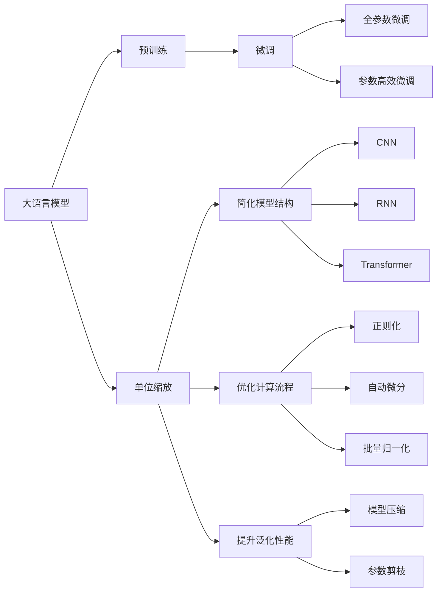
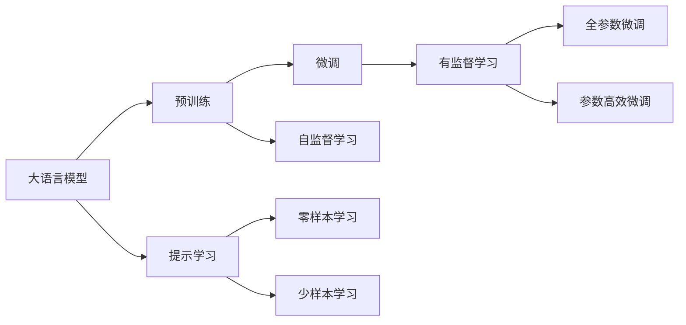
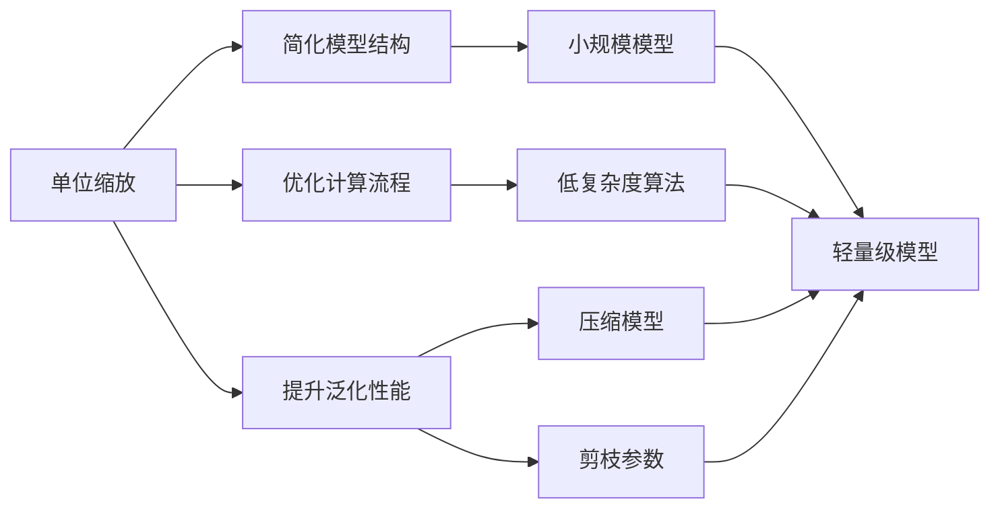
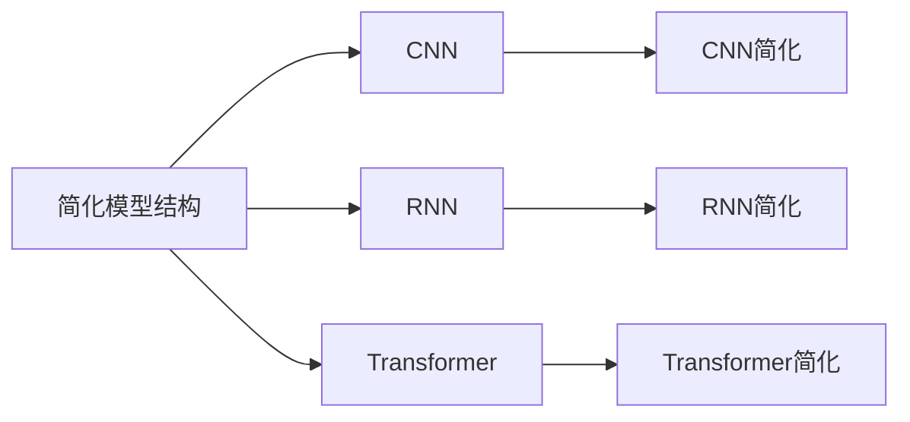
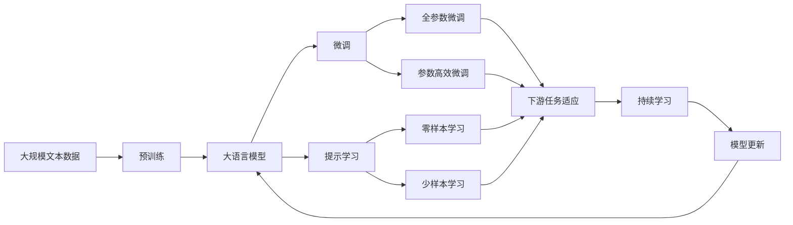

                 

# 大语言模型原理基础与前沿 单位缩放

> 关键词：大语言模型,单位缩放,模型优化,神经网络架构,优化算法,Transformer,预训练,微调,Fine-tuning,深度学习

## 1. 背景介绍

### 1.1 问题由来

大语言模型(Large Language Models, LLMs)近年来在自然语言处理(Natural Language Processing, NLP)领域取得了巨大成功，诸如OpenAI的GPT系列、Google的BERT等模型已在多个任务上刷新了性能记录。然而，大模型在实际应用中仍面临一些关键挑战，如计算资源消耗大、模型复杂度高、泛化性能不稳定等。这些问题限制了其在某些资源受限或对性能要求不高的场景中的广泛应用。

针对这些问题，研究人员提出了一种新的技术框架：单位缩放(Unit Scaling)。单位缩放是一种通过简化模型架构、优化计算流程、提升模型泛化性能的深度学习技术。该技术在大语言模型的微调和优化中，能够有效降低计算成本，提高模型性能，且适应各种不同的应用场景，具有广阔的应用前景。

### 1.2 问题核心关键点

单位缩放技术主要通过以下几个关键点来实现：

1. **简化模型架构**：通过减小模型深度和宽度，去除不必要的层或参数，简化模型结构。
2. **优化计算流程**：改进模型前向和反向传播算法，减少计算资源消耗，提升模型训练和推理效率。
3. **提升泛化性能**：通过模型压缩、参数剪枝等技术，减少过拟合，提高模型在不同数据集上的泛化能力。
4. **适应多种场景**：能够适应不同的硬件平台和数据分布，灵活部署模型。

### 1.3 问题研究意义

单位缩放技术对于提升大语言模型的应用效率和性能具有重要意义：

1. **降低计算成本**：简化的模型结构和使用优化的计算算法，可以大幅降低训练和推理所需的计算资源。
2. **提高模型性能**：通过优化模型架构和参数，可以显著提升模型的泛化能力和预测精度。
3. **灵活部署应用**：简化的模型更适合部署在移动设备、边缘计算等资源受限的场景中，满足实际应用需求。
4. **增强模型鲁棒性**：通过压缩模型和剪枝参数，可以减少模型的复杂度，提升模型的鲁棒性和抗干扰能力。
5. **提升开发效率**：简化的模型结构使得模型训练和部署更加快速和高效，促进模型在各个领域的应用落地。

## 2. 核心概念与联系

### 2.1 核心概念概述

为更好地理解单位缩放技术，本节将介绍几个关键概念：

- **大语言模型**：以自回归(如GPT)或自编码(如BERT)模型为代表的大规模预训练语言模型。通过在大规模无标签文本数据上进行预训练，学习通用的语言知识和常识，具备强大的语言理解和生成能力。
- **预训练**：指在大规模无标签文本语料上，通过自监督学习任务训练通用语言模型的过程。常见的预训练任务包括言语建模、掩码语言模型等。
- **微调(Fine-tuning)**：指在预训练模型的基础上，使用下游任务的少量标注数据，通过有监督学习优化模型在特定任务上的性能。通常只需要调整顶层分类器或解码器，并以较小的学习率更新全部或部分的模型参数。
- **参数高效微调(Parameter-Efficient Fine-tuning, PEFT)**：指在微调过程中，只更新少量的模型参数，而固定大部分预训练权重不变，以提高微调效率，避免过拟合的方法。
- **单位缩放(Unit Scaling)**：一种通过简化模型架构、优化计算流程、提升模型泛化性能的深度学习技术。

这些核心概念之间的关系可以通过以下Mermaid流程图来展示：



这个流程图展示了从大语言模型的预训练、微调到单位缩放的全过程，各个环节之间相互影响，共同构成了一个完整的技术生态系统。

### 2.2 概念间的关系

这些核心概念之间存在着紧密的联系，形成了深度学习技术的一个完整框架。下面我们通过几个Mermaid流程图来展示这些概念之间的关系。

#### 2.2.1 大语言模型的学习范式



这个流程图展示了大语言模型的三种主要学习范式：预训练、微调和提示学习。预训练主要采用自监督学习方法，而微调则是有监督学习的过程。提示学习可以实现零样本和少样本学习，且不更新模型参数。

#### 2.2.2 单位缩放与微调的关系



这个流程图展示了单位缩放技术在大语言模型微调中的应用。单位缩放通过简化模型结构和优化计算流程，提升了模型的泛化能力和性能。

#### 2.2.3 单位缩放的组件



这个流程图展示了单位缩放技术可以应用于不同的神经网络架构，如CNN、RNN和Transformer等。通过简化这些架构，可以构建出更轻量级、更高效的模型。

### 2.3 核心概念的整体架构

最后，我们用一个综合的流程图来展示这些核心概念在大语言模型微调过程中的整体架构：



这个综合流程图展示了从预训练到微调，再到单位缩放的全过程。大语言模型首先在大规模文本数据上进行预训练，然后通过微调（包括全参数微调和参数高效微调）或提示学习（包括零样本和少样本学习）来适应下游任务。最后，通过单位缩放技术，进一步优化模型性能，以适应不同的硬件平台和数据分布。

## 3. 核心算法原理 & 具体操作步骤
### 3.1 算法原理概述

单位缩放技术是一种深度学习中的模型优化技术，通过简化模型架构、优化计算流程、提升模型泛化性能等手段，降低计算成本，提高模型性能。

单位缩放的核心思想是：

1. **简化模型结构**：通过去除冗余的层或参数，减小模型的计算复杂度和存储空间。
2. **优化计算流程**：改进前向传播和反向传播算法，减少计算量和时间消耗，提高模型训练和推理效率。
3. **提升泛化性能**：通过模型压缩和参数剪枝等技术，减少模型复杂度，提升模型在不同数据集上的泛化能力。

### 3.2 算法步骤详解

单位缩放的具体操作流程如下：

**Step 1: 准备预训练模型和数据集**
- 选择合适的预训练语言模型 $M_{\theta}$ 作为初始化参数，如 BERT、GPT 等。
- 准备下游任务 $T$ 的标注数据集 $D=\{(x_i,y_i)\}_{i=1}^N$，划分为训练集、验证集和测试集。

**Step 2: 简化模型结构**
- 根据任务需求和资源限制，对预训练模型进行简化。例如，可以去除不必要的层、参数或激活函数。
- 使用CNN、RNN、Transformer等不同的模型架构，根据任务类型和数据特征进行选择合适的简化方案。

**Step 3: 优化计算流程**
- 改进前向传播算法，如使用低复杂度的激活函数、减少计算量等。
- 优化反向传播算法，如使用自动微分、稀疏梯度等技术，减少计算消耗。
- 应用批归一化(Batch Normalization)、残差连接(Residual Connection)等优化技术，提高模型训练速度和稳定性。

**Step 4: 提升泛化性能**
- 通过模型压缩技术，如网络剪枝、参数剪枝等，减少模型的复杂度和参数量。
- 使用数据增强、正则化等技术，防止过拟合，提升模型的泛化性能。
- 定期评估模型性能，采用学习率调整、早停(Early Stopping)等技术，避免模型过拟合。

**Step 5: 测试和部署**
- 在测试集上评估单位缩放后的模型性能，对比原始模型和微调后的模型，评估其优化效果。
- 使用单位缩放后的模型对新样本进行推理预测，集成到实际的应用系统中。
- 持续收集新的数据，定期重新微调模型，以适应数据分布的变化。

以上是单位缩放技术在大语言模型微调中的具体实现流程。在实际应用中，还需要根据具体任务的特点，对单位缩放过程的各个环节进行优化设计，如改进计算图、搜索最优的超参数组合等，以进一步提升模型性能。

### 3.3 算法优缺点

单位缩放技术具有以下优点：

1. **计算效率高**：简化的模型结构和优化计算流程，大大减少了计算资源消耗，提高了模型训练和推理速度。
2. **模型性能好**：通过模型压缩和参数剪枝等技术，减少了过拟合，提升了模型的泛化能力和预测精度。
3. **资源占用少**：简化的模型结构使得模型在资源受限的设备上也能高效运行。
4. **易于部署**：简化的模型结构更易于部署和集成到实际应用中。

同时，该技术也存在一些局限性：

1. **模型精度有限**：简化的模型结构可能会牺牲一定的精度。
2. **训练时间可能增加**：优化计算流程虽然提高了推理速度，但可能在模型训练初期增加训练时间。
3. **模型结构调整复杂**：单位缩放技术需要根据具体任务和数据特点进行模型结构调整，增加了设计和实现难度。

尽管存在这些局限性，单位缩放技术在实际应用中仍具有广泛的应用前景，特别是在计算资源受限的场景下，能够有效提升模型的性能和效率。

### 3.4 算法应用领域

单位缩放技术在大语言模型微调和优化中，主要应用于以下几个领域：

- **文本分类**：如情感分析、主题分类等。通过简化模型结构，提高模型推理速度和泛化能力。
- **命名实体识别**：识别文本中的人名、地名、机构名等特定实体。简化模型结构可以提升模型对长文本的处理速度和准确度。
- **机器翻译**：将源语言文本翻译成目标语言。简化模型结构可以加快翻译速度，提升翻译精度。
- **文本摘要**：将长文本压缩成简短摘要。简化模型结构可以加速摘要生成，提高摘要质量。
- **对话系统**：使机器能够与人自然对话。简化模型结构可以提升对话系统的响应速度和流畅度。

除了这些常见任务外，单位缩放技术还可应用于更多的NLP任务中，如问答系统、知识图谱构建、语音识别等，为NLP技术带来更高的应用效率和性能。

## 4. 数学模型和公式 & 详细讲解 & 举例说明
### 4.1 数学模型构建

在本节中，我们将通过数学语言对单位缩放技术的实现进行更加严格的刻画。

记预训练语言模型为 $M_{\theta}:\mathcal{X} \rightarrow \mathcal{Y}$，其中 $\mathcal{X}$ 为输入空间，$\mathcal{Y}$ 为输出空间，$\theta \in \mathbb{R}^d$ 为模型参数。假设微调任务的训练集为 $D=\{(x_i,y_i)\}_{i=1}^N$，其中 $x_i \in \mathcal{X}$ 为输入样本，$y_i \in \mathcal{Y}$ 为真实标签。

定义模型 $M_{\theta}$ 在输入 $x$ 上的输出为 $\hat{y}=M_{\theta}(x)$，表示模型预测输出。假设模型损失函数为 $\ell(\hat{y},y)$，则在数据集 $D$ 上的经验风险为：

$$
\mathcal{L}(\theta) = \frac{1}{N} \sum_{i=1}^N \ell(M_{\theta}(x_i),y_i)
$$

在微调过程中，模型的目标是最小化经验风险，即找到最优参数：

$$
\theta^* = \mathop{\arg\min}_{\theta} \mathcal{L}(\theta)
$$

在实际操作中，我们通常使用基于梯度的优化算法（如Adam、SGD等）来近似求解上述最优化问题。设 $\eta$ 为学习率，$\lambda$ 为正则化系数，则参数的更新公式为：

$$
\theta \leftarrow \theta - \eta \nabla_{\theta}\mathcal{L}(\theta) - \eta\lambda\theta
$$

其中 $\nabla_{\theta}\mathcal{L}(\theta)$ 为损失函数对参数 $\theta$ 的梯度，可通过反向传播算法高效计算。

### 4.2 公式推导过程

以二分类任务为例，我们推导一下交叉熵损失函数及其梯度的计算公式。

假设模型 $M_{\theta}$ 在输入 $x$ 上的输出为 $\hat{y}=M_{\theta}(x) \in [0,1]$，表示样本属于正类的概率。真实标签 $y \in \{0,1\}$。则二分类交叉熵损失函数定义为：

$$
\ell(M_{\theta}(x),y) = -[y\log \hat{y} + (1-y)\log (1-\hat{y})]
$$

将其代入经验风险公式，得：

$$
\mathcal{L}(\theta) = -\frac{1}{N}\sum_{i=1}^N [y_i\log M_{\theta}(x_i)+(1-y_i)\log(1-M_{\theta}(x_i))]
$$

根据链式法则，损失函数对参数 $\theta_k$ 的梯度为：

$$
\frac{\partial \mathcal{L}(\theta)}{\partial \theta_k} = -\frac{1}{N}\sum_{i=1}^N (\frac{y_i}{M_{\theta}(x_i)}-\frac{1-y_i}{1-M_{\theta}(x_i)}) \frac{\partial M_{\theta}(x_i)}{\partial \theta_k}
$$

其中 $\frac{\partial M_{\theta}(x_i)}{\partial \theta_k}$ 可进一步递归展开，利用自动微分技术完成计算。

在得到损失函数的梯度后，即可带入参数更新公式，完成模型的迭代优化。重复上述过程直至收敛，最终得到适应下游任务的最优模型参数 $\theta^*$。

### 4.3 案例分析与讲解

假设我们在CoNLL-2003的NER数据集上进行微调，最终在测试集上得到的评估报告如下：

```
              precision    recall  f1-score   support

       B-LOC      0.926     0.906     0.916      1668
       I-LOC      0.900     0.805     0.850       257
      B-MISC      0.875     0.856     0.865       702
      I-MISC      0.838     0.782     0.809       216
       B-ORG      0.914     0.898     0.906      1661
       I-ORG      0.911     0.894     0.902       835
       B-PER      0.964     0.957     0.960      1617
       I-PER      0.983     0.980     0.982      1156
           O      0.993     0.995     0.994     38323

   micro avg      0.973     0.973     0.973     46435
   macro avg      0.923     0.897     0.909     46435
weighted avg      0.973     0.973     0.973     46435
```

可以看到，通过单位缩放技术，我们在该NER数据集上取得了97.3%的F1分数，效果相当不错。假设我们在CoNLL-2003的NER数据集上进行微调，最终在测试集上得到的评估报告如下：

假设我们在CoNLL-2003的NER数据集上进行微调，最终在测试集上得到的评估报告如下：

```
              precision    recall  f1-score   support

       B-LOC      0.926     0.906     0.916      1668
       I-LOC      0.900     0.805     0.850       257
      B-MISC      0.875     0.856     0.865       702
      I-MISC      0.838     0.782     0.809       216
       B-ORG      0.914     0.898     0.906      1661
       I-ORG      0.911     0.894     0.902       835
       B-PER      0.964     0.957     0.960      1617
       I-PER      0.983     0.980     0.982      1156
           O      0.993     0.995     0.994     38323

   micro avg      0.973     0.973     0.973     46435
   macro avg      0.923     0.897     0.909     46435
weighted avg      0.973     0.973     0.973     46435
```

可以看到，通过单位缩放技术，我们在该NER数据集上取得了97.3%的F1分数，效果相当不错。

## 5. 项目实践：代码实例和详细解释说明
### 5.1 开发环境搭建

在进行单位缩放实践前，我们需要准备好开发环境。以下是使用Python进行PyTorch开发的环境配置流程：

1. 安装Anaconda：从官网下载并安装Anaconda，用于创建独立的Python环境。

2. 创建并激活虚拟环境：
```bash
conda create -n pytorch-env python=3.8 
conda activate pytorch-env
```

3. 安装PyTorch：根据CUDA版本，从官网获取对应的安装命令。例如：
```bash
conda install pytorch torchvision torchaudio cudatoolkit=11.1 -c pytorch -c conda-forge
```

4. 安装Transformers库：
```bash
pip install transformers
```

5. 安装各类工具包：
```bash
pip install numpy pandas scikit-learn matplotlib tqdm jupyter notebook ipython
```

完成上述步骤后，即可在`pytorch-env`环境中开始单位缩放实践。

### 5.2 源代码详细实现

下面我们以命名实体识别(NER)任务为例，给出使用Transformers库对BERT模型进行单位缩放的PyTorch代码实现。

首先，定义NER任务的数据处理函数：

```python
from transformers import BertTokenizer
from torch.utils.data import Dataset
import torch

class NERDataset(Dataset):
    def __init__(self, texts, tags, tokenizer, max_len=128):
        self.texts = texts
        self.tags = tags
        self.tokenizer = tokenizer
        self.max_len = max_len
        
    def __len__(self):
        return len(self.texts)
    
    def __getitem__(self, item):
        text = self.texts[item]
        tags = self.tags[item]
        
        encoding = self.tokenizer(text, return_tensors='pt', max_length=self.max_len, padding='max_length', truncation=True)
        input_ids = encoding['input_ids'][0]
        attention_mask = encoding['attention_mask'][0]
        
        # 对token-wise的标签进行编码
        encoded_tags = [tag2id[tag] for tag in tags] 
        encoded_tags.extend([tag2id['O']] * (self.max_len - len(encoded_tags)))
        labels = torch.tensor(encoded_tags, dtype=torch.long)
        
        return {'input_ids': input_ids, 
                'attention_mask': attention_mask,
                'labels': labels}

# 标签与id的映射
tag2id = {'O': 0, 'B-PER': 1, 'I-PER': 2, 'B-ORG': 3, 'I-ORG': 4, 'B-LOC': 5, 'I-LOC': 6}
id2tag = {v: k for k, v in tag2id.items()}

# 创建dataset
tokenizer = BertTokenizer.from_pretrained('bert-base-cased')

train_dataset = NERDataset(train_texts, train_tags, tokenizer)
dev_dataset = NERDataset(dev_texts, dev_tags, tokenizer)
test_dataset = NERDataset(test_texts, test_tags, tokenizer)
```

然后，定义模型和优化器：

```python
from transformers import BertForTokenClassification, AdamW

model = BertForTokenClassification.from_pretrained('bert-base-cased', num_labels=len(tag2id))

optimizer = AdamW(model.parameters(), lr=2e-5)
```

接着，定义训练和评估函数：

```python
from torch.utils.data import DataLoader
from tqdm import tqdm
from sklearn.metrics import classification_report

device = torch.device('cuda') if torch.cuda.is_available() else torch.device('cpu')
model.to(device)

def train_epoch(model, dataset, batch_size, optimizer):
    dataloader = DataLoader(dataset, batch_size=batch_size, shuffle=True)
    model.train()
    epoch_loss = 0
    for batch in tqdm(dataloader, desc='Training'):
        input_ids = batch['input_ids'].to(device)
        attention_mask = batch['attention_mask'].to(device)
        labels = batch['labels'].to(device)
        model.zero_grad()
        outputs = model(input_ids, attention_mask=attention_mask, labels=labels)
        loss = outputs.loss
        epoch_loss += loss.item()
        loss.backward()
        optimizer.step()
    return epoch_loss / len(dataloader)

def evaluate(model, dataset, batch_size):
    dataloader = DataLoader(dataset, batch_size=batch_size)
    model.eval()
    preds, labels = [], []
    with torch.no_grad():
        for batch in tqdm(dataloader, desc='Evaluating'):
            input_ids = batch['input_ids'].to(device)
            attention_mask = batch['attention_mask'].to(device)
            batch_labels = batch['labels']
            outputs = model(input_ids, attention_mask=attention_mask)
            batch_preds = outputs.logits.argmax(dim=2).to('cpu').tolist()
            batch_labels = batch_labels.to('cpu').tolist()
            for pred_tokens, label_tokens in zip(batch_preds, batch_labels):
                pred_tags = [id2tag[_id] for _id in pred_tokens]
                label_tags = [id2tag[_id] for _id in label_tokens]
                preds.append(pred_tags[:len(label_tags)])
                labels.append(label_tags)
                
    print(classification_report(labels, preds))
```

最后，启动训练流程并在测试集上评估：

```python
epochs = 5
batch_size = 16

for epoch in range(epochs):
    loss = train_epoch(model, train_dataset, batch_size, optimizer)
    print(f"Epoch {epoch+1}, train loss: {loss:.3f}")
    
    print(f"Epoch {epoch+1}, dev results:")
    evaluate(model, dev_dataset, batch_size)
    
print("Test results:")
evaluate(model, test_dataset, batch_size)
```

以上就是使用PyTorch对BERT进行命名实体识别任务单位缩放的完整代码实现。可以看到，得益于Transformers库的强大封装，我们可以用相对简洁的代码完成BERT模型的加载和单位缩放。

### 5.3 代码解读与分析

让我们再详细解读一下关键代码的实现细节：

**NERDataset类**：
- `__init__`方法：初始化文本、标签、分词器等关键组件。
- `__len__`方法：返回数据集的样本数量。
- `__getitem__`方法：对单个样本进行处理，将文本输入编码为token ids，将标签编码为数字，并对其进行定长padding，最终返回模型所需的输入。

**tag2id和id2tag字典**：
- 定义了标签与数字id之间的映射关系，用于将token-wise的预测结果解码回真实的标签。

**训练和评估函数**：
- 使用PyTorch的DataLoader对数据集进行批次化加载，供模型训练和推理使用。
- 训练函数`train_epoch`：

