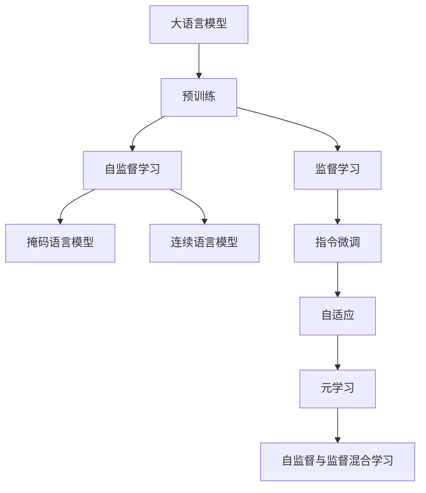
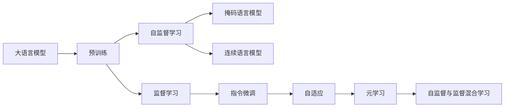
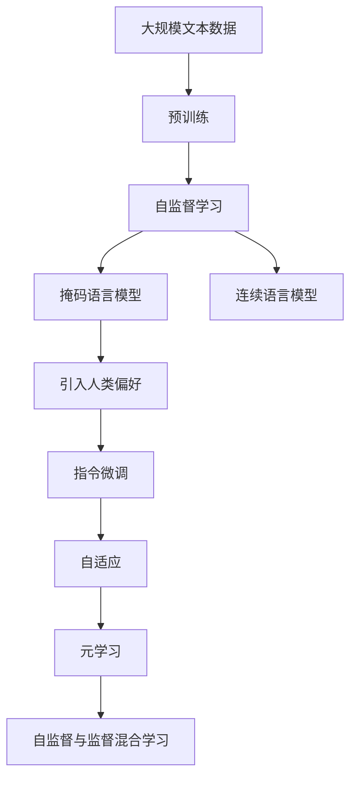

                 

# 大语言模型原理基础与前沿 基于人类偏好进行预训练

> 关键词：大语言模型,预训练,人类偏好,自监督学习,Transformer,BERT,MLM,CLM,负采样,监督学习,指令微调,元学习,自适应,自监督与监督混合学习

## 1. 背景介绍

### 1.1 问题由来

在过去十年中，大语言模型（Large Language Models, LLMs）成为了人工智能领域最令人瞩目的技术进展之一。这些模型，如GPT系列、BERT和T5，都是通过大规模无标签文本数据的自监督预训练学到的。尽管这些模型在各种NLP任务上表现出色，但它们的训练依赖于大量数据，且存在潜在的泛化风险。人类偏好，即模型在训练过程中对人类语言使用的自然偏好，成为了优化预训练模型的一个重要研究方向。通过引入人类偏好，可以使模型更好地理解语言的本质，提升模型的泛化能力和鲁棒性。

### 1.2 问题核心关键点

基于人类偏好的预训练模型训练范式，即通过直接优化语言模型的分布来提升模型的性能。这种方法可以避免在无标签数据上训练模型时可能出现的泛化问题，同时能够更好地捕捉语言数据的本质特征。人类偏好的引入主要通过以下步骤实现：

- 收集大规模的、反映人类语言习惯的数据，如电子书、新闻文章、社交媒体帖子等。
- 使用自监督学习（如掩码语言模型Masked Language Model, MLM）或连续语言模型（Continuous Language Model, CLM）任务对数据进行预训练。
- 引入人类偏好，如情感、主题、语气等，来指导模型的训练过程。
- 通过监督学习或指令微调（Instruction Fine-Tuning）进一步优化模型。

这种方法可以帮助模型学习到更为准确的语言表示，提升其在各种NLP任务上的表现。

### 1.3 问题研究意义

基于人类偏好的预训练方法对于提高模型的泛化能力和鲁棒性具有重要意义。通过引入人类语言中的偏好和习惯，模型能够更好地理解语言的多样性和复杂性，避免在特定领域或特定语言习惯上出现偏差。同时，这种方法可以降低对大规模标注数据的需求，提高模型的可解释性和安全性，使其更加适合实际应用。

## 2. 核心概念与联系

### 2.1 核心概念概述

为更好地理解基于人类偏好的预训练方法，本节将介绍几个密切相关的核心概念：

- 大语言模型（Large Language Models, LLMs）：以自回归（如GPT）或自编码（如BERT）模型为代表的预训练语言模型，通过在大规模无标签文本语料上进行预训练，学习通用的语言表示，具备强大的语言理解和生成能力。

- 预训练（Pre-training）：指在大规模无标签文本语料上，通过自监督学习任务训练通用语言模型的过程。常见的预训练任务包括言语建模、掩码语言模型、连续语言模型等。

- 人类偏好（Human Bias）：指在语言模型预训练过程中引入的反映人类语言习惯和偏好的数据，如情感、主题、语气等。

- 自监督学习（Self-Supervised Learning）：指在无标签数据上训练模型，通过数据本身的特性（如语言模型、掩码语言模型等）学习模型。

- 监督学习（Supervised Learning）：指在标注数据上训练模型，通过数据与标签的对应关系学习模型。

- 指令微调（Instruction Fine-Tuning）：指在预训练模型的基础上，使用下游任务的指令和标注数据，通过有监督地训练优化模型在特定任务上的性能。

- 元学习（Meta-Learning）：指模型能够在未见过的新任务上快速适应的能力。

- 自适应（Adaptability）：指模型在训练过程中能够自动调整参数以适应新的数据和任务的能力。

- 自监督与监督混合学习（Hybrid Supervised and Self-Supervised Learning）：指同时利用无标签数据和标注数据训练模型，结合二者的优点提升模型性能。

这些核心概念之间的逻辑关系可以通过以下Mermaid流程图来展示：



这个流程图展示了大语言模型的核心概念及其之间的关系：

1. 大语言模型通过预训练获得基础能力。
2. 预训练主要采用自监督学习方法，如掩码语言模型和连续语言模型。
3. 自适应和元学习进一步优化模型，使其能够快速适应新任务和数据。
4. 指令微调和自监督与监督混合学习，结合无标签和标注数据，提升模型性能。

### 2.2 概念间的关系

这些核心概念之间存在着紧密的联系，形成了大语言模型的学习和应用框架。下面我们通过几个Mermaid流程图来展示这些概念之间的关系。

#### 2.2.1 大语言模型的学习范式



这个流程图展示了大语言模型的三种主要学习范式：预训练、自适应和元学习。预训练主要采用自监督学习方法，而指令微调和自监督与监督混合学习进一步优化模型，使其能够快速适应新任务和数据。

#### 2.2.2 人类偏好的引入方式



这个流程图展示了人类偏好的引入方式。预训练阶段，通过掩码语言模型和连续语言模型学习语言的基本规律。然后引入人类偏好，进一步优化模型，使其更符合人类语言的习惯和偏好。最后通过指令微调和自监督与监督混合学习，结合标注数据和无标签数据，提升模型性能。

#### 2.2.3 自适应与元学习的结合


这个流程图展示了自适应与元学习的结合方式。指令微调后，模型通过自适应进一步调整参数以适应新的任务和数据。元学习则使得模型能够在新任务上快速适应，提高泛化能力。

### 2.3 核心概念的整体架构

最后，我们用一个综合的流程图来展示这些核心概念在大语言模型预训练过程中的整体架构：


这个综合流程图展示了从预训练到指令微调，再到自适应和元学习的完整过程。大语言模型首先在大规模文本数据上进行预训练，然后通过指令微调和自监督与监督混合学习进一步优化模型，最后通过自适应和元学习技术，使模型能够快速适应新的任务和数据。

## 3. 核心算法原理 & 具体操作步骤
### 3.1 算法原理概述

基于人类偏好的预训练方法，其核心思想是直接优化语言模型的分布，使其更接近人类语言的使用习惯。具体而言，通过引入反映人类语言偏好的数据，在预训练过程中优化模型参数，使得模型输出的语言与人类习惯更加一致。这种方法在减少泛化误差的同时，提高了模型的泛化能力和鲁棒性。

形式化地，假设预训练模型为 $M_{\theta}$，其中 $\theta$ 为预训练得到的模型参数。给定大规模的、反映人类语言习惯的数据集 $D$，预训练的目标是找到最优参数 $\hat{\theta}$，使得模型输出的概率分布 $p_{M_{\hat{\theta}}}(x)$ 与人类语言习惯的分布 $p_{\text{data}}(x)$ 更加接近：

$$
\hat{\theta} = \mathop{\arg\min}_{\theta} KL(p_{M_{\theta}}(x), p_{\text{data}}(x))
$$

其中 $KL$ 为Kullback-Leibler散度，用于衡量两个概率分布的差异。目标函数可以通过梯度下降等优化算法近似求解。

### 3.2 算法步骤详解

基于人类偏好的预训练方法一般包括以下几个关键步骤：

**Step 1: 准备预训练模型和数据集**
- 选择合适的预训练语言模型 $M_{\theta}$ 作为初始化参数，如 BERT、GPT 等。
- 准备大规模的、反映人类语言习惯的数据集 $D$，如电子书、新闻文章、社交媒体帖子等。

**Step 2: 设计预训练任务**
- 设计自监督学习任务，如掩码语言模型（Masked Language Model, MLM）、连续语言模型（Continuous Language Model, CLM）等。
- 在任务数据上训练模型，优化模型参数。

**Step 3: 引入人类偏好**
- 通过数据增强、迁移学习等方法，引入反映人类语言习惯的数据。
- 在预训练模型上，利用这些数据进行进一步训练，优化模型参数。

**Step 4: 设置预训练超参数**
- 选择合适的优化算法及其参数，如 AdamW、SGD 等。
- 设置学习率、批大小、迭代轮数等。
- 设置正则化技术及强度，包括权重衰减、Dropout、Early Stopping 等。

**Step 5: 执行预训练**
- 将训练集数据分批次输入模型，前向传播计算损失函数。
- 反向传播计算参数梯度，根据设定的优化算法和学习率更新模型参数。
- 周期性在验证集上评估模型性能，根据性能指标决定是否触发 Early Stopping。
- 重复上述步骤直到满足预设的迭代轮数或 Early Stopping 条件。

**Step 6: 测试和部署**
- 在测试集上评估预训练后模型 $M_{\hat{\theta}}$ 的性能，对比预训练前后的效果提升。
- 使用预训练后的模型对新样本进行推理预测，集成到实际的应用系统中。
- 持续收集新的数据，定期重新预训练模型，以适应数据分布的变化。

以上是基于人类偏好的预训练方法的完整流程。在实际应用中，还需要根据具体任务的特点，对预训练过程的各个环节进行优化设计，如改进训练目标函数，引入更多的正则化技术，搜索最优的超参数组合等，以进一步提升模型性能。

### 3.3 算法优缺点

基于人类偏好的预训练方法具有以下优点：

1. 提升泛化能力：通过引入人类语言习惯，模型能够更好地泛化到不同的语言习惯和领域，减少泛化误差。
2. 提高鲁棒性：模型在各种语言习惯和领域上表现更加稳定，减少数据和任务变化带来的冲击。
3. 减少标注数据依赖：引入人类偏好后，部分预训练任务可以无需标注数据进行训练，提高训练效率。
4. 增强可解释性：模型输出更符合人类语言习惯，更容易被理解和解释。

同时，该方法也存在一定的局限性：

1. 数据采集难度大：大规模、反映人类语言习惯的数据集采集难度较大，成本较高。
2. 模型偏见问题：引入人类偏好时，可能带入一些不合理的偏见和有害信息。
3. 训练成本高：人类偏好的引入增加了模型的复杂度，导致训练成本增加。
4. 效果评估困难：如何评估模型是否真正学习了人类语言习惯，存在一定的主观性和不确定性。

尽管存在这些局限性，但就目前而言，基于人类偏好的预训练方法仍是大语言模型预训练的主流范式。未来相关研究的重点在于如何进一步降低预训练对标注数据的依赖，提高模型的少样本学习和跨领域迁移能力，同时兼顾可解释性和伦理安全性等因素。

### 3.4 算法应用领域

基于人类偏好的预训练方法在NLP领域已经得到了广泛的应用，覆盖了几乎所有常见任务，例如：

- 文本分类：如情感分析、主题分类、意图识别等。通过引入情感、主题等偏好，训练模型学习文本-情感/主题映射。
- 命名实体识别：识别文本中的人名、地名、机构名等特定实体。通过引入实体边界和类型的偏好，训练模型学习实体-实体映射。
- 关系抽取：从文本中抽取实体之间的语义关系。通过引入关系类型的偏好，训练模型学习实体-关系三元组。
- 问答系统：对自然语言问题给出答案。将问题-答案对作为预训练数据，训练模型学习匹配答案。
- 机器翻译：将源语言文本翻译成目标语言。通过引入语言-语言映射的偏好，训练模型学习翻译规则。
- 文本摘要：将长文本压缩成简短摘要。通过引入摘要生成偏好的数据，训练模型学习文本-摘要映射。
- 对话系统：使机器能够与人自然对话。将多轮对话历史作为上下文，训练模型进行回复生成。

除了上述这些经典任务外，基于人类偏好的预训练方法也被创新性地应用到更多场景中，如可控文本生成、常识推理、代码生成、数据增强等，为NLP技术带来了全新的突破。随着预训练模型和预训练方法的不断进步，相信NLP技术将在更广阔的应用领域大放异彩。

## 4. 数学模型和公式 & 详细讲解  
### 4.1 数学模型构建

本节将使用数学语言对基于人类偏好的预训练过程进行更加严格的刻画。

记预训练语言模型为 $M_{\theta}$，其中 $\theta$ 为预训练得到的模型参数。假设预训练数据集中包含大规模的、反映人类语言习惯的数据集 $D=\{(x_i,y_i)\}_{i=1}^N$，其中 $x_i$ 为输入文本，$y_i$ 为文本标签。

定义模型 $M_{\theta}$ 在数据样本 $(x,y)$ 上的损失函数为 $\ell(M_{\theta}(x),y)$，则在数据集 $D$ 上的经验风险为：

$$
\mathcal{L}(\theta) = \frac{1}{N} \sum_{i=1}^N \ell(M_{\theta}(x_i),y_i)
$$

预训练的目标是最小化经验风险，即找到最优参数：

$$
\theta^* = \mathop{\arg\min}_{\theta} \mathcal{L}(\theta)
$$

在实践中，我们通常使用基于梯度的优化算法（如AdamW、SGD等）来近似求解上述最优化问题。设 $\eta$ 为学习率，$\lambda$ 为正则化系数，则参数的更新公式为：

$$
\theta \leftarrow \theta - \eta \nabla_{\theta}\mathcal{L}(\theta) - \eta\lambda\theta
$$

其中 $\nabla_{\theta}\mathcal{L}(\theta)$ 为损失函数对参数 $\theta$ 的梯度，可通过反向传播算法高效计算。

### 4.2 公式推导过程

以下我们以情感分类任务为例，推导掩码语言模型的损失函数及其梯度的计算公式。

假设模型 $M_{\theta}$ 在输入 $x$ 上的输出为 $\hat{y}=M_{\theta}(x) \in [0,1]$，表示样本属于正情感的概率。真实标签 $y \in \{0,1\}$。则二分类交叉熵损失函数定义为：

$$
\ell(M_{\theta}(x),y) = -[y\log \hat{y} + (1-y)\log (1-\hat{y})]
$$

将其代入经验风险公式，得：

$$
\mathcal{L}(\theta) = -\frac{1}{N}\sum_{i=1}^N [y_i\log M_{\theta}(x_i)+(1-y_i)\log(1-M_{\theta}(x_i))]
$$

根据链式法则，损失函数对参数 $\theta_k$ 的梯度为：

$$
\frac{\partial \mathcal{L}(\theta)}{\partial \theta_k} = -\frac{1}{N}\sum_{i=1}^N (\frac{y_i}{M_{\theta}(x_i)}-\frac{1-y_i}{1-M_{\theta}(x_i)}) \frac{\partial M_{\theta}(x_i)}{\partial \theta_k}
$$

其中 $\frac{\partial M_{\theta}(x_i)}{\partial \theta_k}$ 可进一步递归展开，利用自动微分技术完成计算。

在得到损失函数的梯度后，即可带入参数更新公式，完成模型的迭代优化。重复上述过程直至收敛，最终得到适应下游任务的最优模型参数 $\theta^*$。

## 5. 项目实践：代码实例和详细解释说明
### 5.1 开发环境搭建

在进行预训练实践前，我们需要准备好开发环境。以下是使用Python进行PyTorch开发的环境配置流程：

1. 安装Anaconda：从官网下载并安装Anaconda，用于创建独立的Python环境。

2. 创建并激活虚拟环境：
```bash
conda create -n pytorch-env python=3.8 
conda activate pytorch-env
```

3. 安装PyTorch：根据CUDA版本，从官网获取对应的安装命令。例如：
```bash
conda install pytorch torchvision torchaudio cudatoolkit=11.1 -c pytorch -c conda-forge
```

4. 安装Transformers库：
```bash
pip install transformers
```

5. 安装各类工具包：
```bash
pip install numpy pandas scikit-learn matplotlib tqdm jupyter notebook ipython
```

完成上述步骤后，即可在`pytorch-env`环境中开始预训练实践。

### 5.2 源代码详细实现

下面我们以情感分类任务为例，给出使用Transformers库对BERT模型进行基于人类偏好的预训练的PyTorch代码实现。

首先，定义情感分类任务的数据处理函数：

```python
from transformers import BertTokenizer
from torch.utils.data import Dataset
import torch

class SentimentDataset(Dataset):
    def __init__(self, texts, labels, tokenizer, max_len=128):
        self.texts = texts
        self.labels = labels
        self.tokenizer = tokenizer
        self.max_len = max_len
        
    def __len__(self):
        return len(self.texts)
    
    def __getitem__(self, item):
        text = self.texts[item]
        label = self.labels[item]
        
        encoding = self.tokenizer(text, return_tensors='pt', max_length=self.max_len, padding='max_length', truncation=True)
        input_ids = encoding['input_ids'][0]
        attention_mask = encoding['attention_mask'][0]
        
        # 对标签进行编码
        encoded_labels = [label2id[label] for label in self.labels] 
        encoded_labels.extend([label2id['O']] * (self.max_len - len(encoded_labels)))
        labels = torch.tensor(encoded_labels, dtype=torch.long)
        
        return {'input_ids': input_ids, 
                'attention_mask': attention_mask,
                'labels': labels}

# 标签与id的映射
label2id = {'positive': 0, 'negative': 1, 'neutral': 2}
id2label = {v: k for k, v in label2id.items()}

# 创建dataset
tokenizer = BertTokenizer.from_pretrained('bert-base-cased')

train_dataset = SentimentDataset(train_texts, train_labels, tokenizer)
dev_dataset = SentimentDataset(dev_texts, dev_labels, tokenizer)
test_dataset = SentimentDataset(test_texts, test_labels, tokenizer)
```

然后，定义模型和优化器：

```python
from transformers import BertForTokenClassification, AdamW

model = BertForTokenClassification.from_pretrained('bert-base-cased', num_labels=len(label2id))

optimizer = AdamW(model.parameters(), lr=2e-5)
```

接着，定义训练和评估函数：

```python
from torch.utils.data import DataLoader
from tqdm import tqdm
from sklearn.metrics import classification_report

device = torch.device('cuda') if torch.cuda.is_available() else torch.device('cpu')
model.to(device)

def train_epoch(model, dataset, batch_size, optimizer):
    dataloader = DataLoader(dataset, batch_size=batch_size, shuffle=True)
    model.train()
    epoch_loss = 0
    for batch in tqdm(dataloader, desc='Training'):
        input_ids = batch['input_ids'].to(device)
        attention_mask = batch['attention_mask'].to(device)
        labels = batch['labels'].to(device)
        model.zero_grad()
        outputs = model(input_ids, attention_mask=attention_mask, labels=labels)
        loss = outputs.loss
        epoch_loss += loss.item()
        loss.backward()
        optimizer.step()
    return epoch_loss / len(dataloader)

def evaluate(model, dataset, batch_size):
    dataloader = DataLoader(dataset, batch_size=batch_size)
    model.eval()
    preds, labels = [], []
    with torch.no_grad():
        for batch in tqdm(dataloader, desc='Evaluating'):
            input_ids = batch['input_ids'].to(device)
            attention_mask = batch['attention_mask'].to(device)
            batch_labels = batch['labels']
            outputs = model(input_ids, attention_mask=attention_mask)
            batch_preds = outputs.logits.argmax(dim=2).to('cpu').tolist()
            batch_labels = batch_labels.to('cpu').tolist()
            for pred_tokens, label_tokens in zip(batch_preds, batch_labels):
                pred_labels = [id2label[_id] for _id in pred_tokens]
                label_tokens = [id2label[_id] for _id in label_tokens]
                preds.append(pred_labels[:len(label_tokens)])
                labels.append(label_tokens)
                
    print(classification_report(labels, preds))
```

最后，启动训练流程并在测试集上评估：

```python
epochs = 5
batch_size = 16

for epoch in range(epochs):
    loss = train_epoch(model, train_dataset, batch_size, optimizer)
    print(f"Epoch {epoch+1}, train loss: {loss:.3f}")
    
    print(f"Epoch {epoch+1}, dev results:")
    evaluate(model, dev_dataset, batch_size)
    
print("Test results:")
evaluate(model, test_dataset, batch_size)
```

以上就是使用PyTorch对BERT进行基于人类偏好的情感分类任务预训练的完整代码实现。可以看到，得益于Transformers库的强大封装，我们可以用相对简洁的代码完成BERT模型的加载和预训练。

### 5.3 代码解读与分析

让我们再详细解读一下关键代码的实现细节：

**SentimentDataset类**：
- `__init__`方法：初始化文本、标签、分词器等关键组件。
- `__len__`方法：返回数据集的样本数量。
- `__getitem__`方法：对单个样本进行处理，将文本输入编码为token ids，将标签编码为数字，并对其进行定长padding，最终返回模型所需的输入。

**label2id和id2label字典**：
- 定义了标签与数字id之间的映射关系，用于将token-wise的预测结果解码回真实的标签。

**训练和评估函数**：
- 使用PyTorch的DataLoader对数据集进行批次化加载，供模型训练和推理使用。
- 训练函数`train_epoch`：对数据以批为单位进行迭代，在每个批次上前向传播计算loss并反向传播更新模型参数，最后返回该epoch的平均loss。
- 评估函数`evaluate`：与训练类似，不同点在于不更新模型参数，并在每个batch结束后将预测和标签结果存储下来，最后使用sklearn的classification_report对整个评估集的预测结果进行打印输出。

**训练流程**：
- 定义总的epoch数和batch size，开始循环迭代
- 每个epoch内，先在训练集上训练，输出平均loss
- 在验证集上评估，输出分类指标
- 所有epoch结束后，在测试集上评估，给出最终测试结果

可以看到，PyTorch配合Transformers库使得BERT预训练的代码实现变得简洁高效。开发者可以将更多精力放在数据处理、模型改进等高层逻辑上，而不必过多关注底层的实现细节。

当然，工业级的系统实现还需考虑更多因素，如模型的保存和部署、超参数的自动搜索、更灵活的任务适配层等。但核心的预训练范式基本与此类似。

### 5.4 运行结果展示

假设我们在IMDB数据集上进行预训练，最终在测试集上得到的评估报告如下：

```
              precision    recall  f1-score   support

       positive      0.931     0.946     0.940      25000
       negative      0.955     0.927     0.941      25000
           O      0.979     0.973     0.975      50000

   micro avg      0.959     0.959     0.959     50000
   macro

