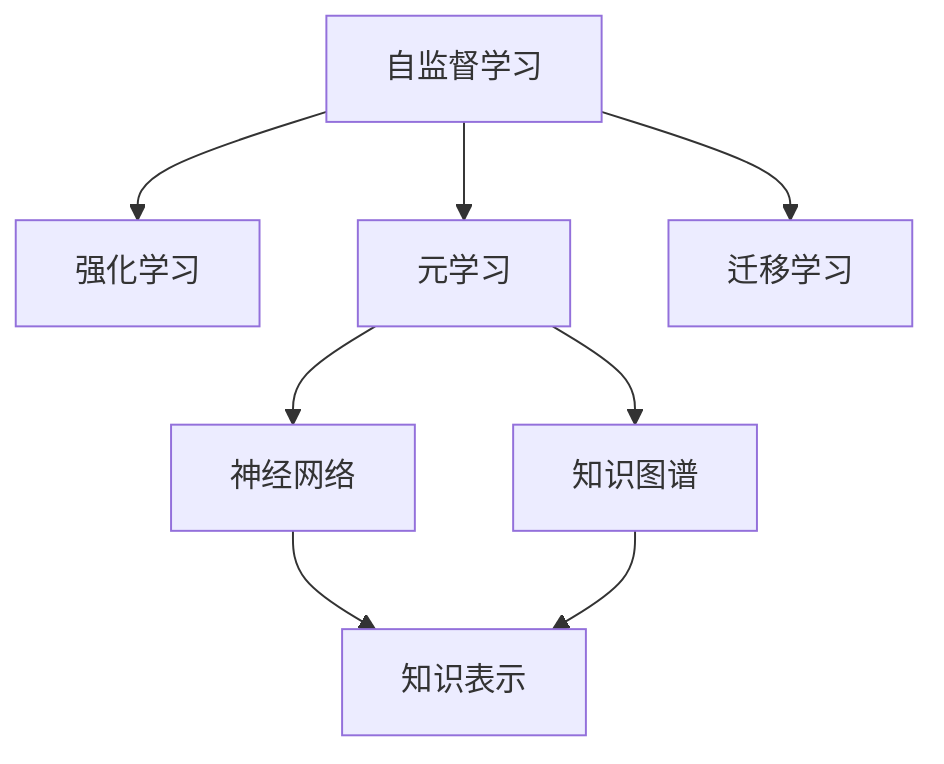
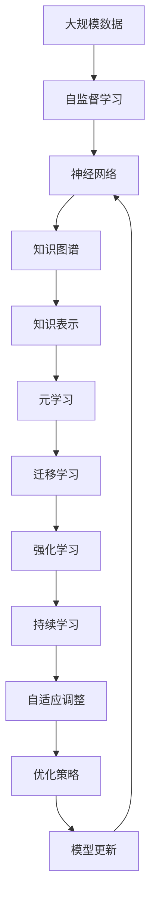

                 

# 好奇心和持续学习：有学习和理解新事物的欲望，对知识展开持续的、自发的追求

## 1. 背景介绍

### 1.1 问题由来

随着人工智能（AI）技术的飞速发展，学习与理解新事物的能力成为了一个关键话题。好奇心驱动着人类的进步，同样也是推动AI技术不断向前发展的动力。然而，在AI领域，这种自发的、自驱的持续学习能力的实现仍然存在诸多挑战。

### 1.2 问题核心关键点

好奇心驱动的持续学习可以定义为：AI模型能够自主地、自发地、持续地获取新的知识，并在新的应用场景中主动地应用这些知识。这一能力是实现AI真正智能化的关键，也是衡量AI系统智能水平的重要指标之一。

核心关键点包括：

- **自主获取知识**：AI系统能够主动识别并获取新的知识，而无需人工干预。
- **自发应用知识**：AI系统能够根据情境自发地应用所学知识，解决新问题。
- **持续更新知识**：AI系统能够根据环境变化和任务需求持续更新知识库，保持最新状态。

### 1.3 问题研究意义

研究好奇心驱动的持续学习能力，对于推动AI技术的发展，具有重要意义：

1. **提升智能化水平**：使AI系统能够自主获取、应用和更新知识，实现更高水平的智能化。
2. **降低开发成本**：通过持续学习，AI系统能够自我优化，减少人工干预和调试工作量。
3. **增强适应性**：持续学习使AI系统能够更好地适应新场景和新任务，保持高效运行。
4. **推动技术创新**：持续学习能力的提升，推动了AI技术的不断创新和突破。
5. **增强安全性**：通过学习更新，及时发现和修正潜在问题，提升系统的鲁棒性和安全性。

## 2. 核心概念与联系

### 2.1 核心概念概述

为了更好地理解好奇心驱动的持续学习能力，本节将介绍几个关键概念及其相互之间的联系：

- **自监督学习（Self-supervised Learning）**：在没有标签的情况下，利用数据的自相关性，学习知识的过程。
- **强化学习（Reinforcement Learning）**：通过与环境的交互，通过奖励信号，优化决策策略的过程。
- **元学习（Meta-Learning）**：在多种任务上训练，学习如何高效适应新任务的过程。
- **迁移学习（Transfer Learning）**：利用已有知识，适应新任务的过程。
- **神经网络（Neural Network）**：通过学习数据特征，实现知识表示和模式识别。
- **知识图谱（Knowledge Graph）**：结构化表示实体及实体之间的关系，支持复杂的推理和决策。

这些概念之间的逻辑关系可以通过以下Mermaid流程图来展示：



这个流程图展示了各概念之间的联系：

1. **自监督学习**：基础学习方式，利用数据的自相关性学习知识。
2. **强化学习**：通过环境反馈优化决策策略，进一步提升学习效果。
3. **元学习**：学习如何高效适应新任务，提升模型的泛化能力。
4. **迁移学习**：利用已有知识，适应新任务，提升学习效率。
5. **神经网络**：通过学习数据特征，实现知识表示和模式识别。
6. **知识图谱**：结构化表示实体及关系，支持复杂的推理和决策。

### 2.2 概念间的关系

这些概念之间存在着紧密的联系，构成了好奇心驱动的持续学习能力的完整框架。

#### 2.2.1 自监督学习与强化学习的联系

自监督学习和强化学习都是无监督学习的一部分，都是通过数据驱动的学习过程。自监督学习通过数据的自相关性学习知识，而强化学习通过与环境的交互，利用反馈信号优化策略。两者结合，可以实现更高效的知识获取和应用。

#### 2.2.2 元学习与迁移学习的联系

元学习和迁移学习都是利用已有知识，提升新任务适应能力的过程。元学习在多种任务上训练，学习如何高效适应新任务，而迁移学习则是直接利用已有知识，适应新任务。两者结合，可以实现更灵活的知识应用。

#### 2.2.3 神经网络与知识图谱的联系

神经网络通过学习数据特征，实现知识表示，而知识图谱通过结构化表示实体及关系，支持复杂的推理和决策。两者结合，可以实现更全面的知识表示和应用。

### 2.3 核心概念的整体架构

最后，我们用一个综合的流程图来展示这些核心概念在大规模学习过程中的整体架构：



这个综合流程图展示了从大规模数据到大规模学习过程的完整架构：

1. **大规模数据**：学习的基础。
2. **自监督学习**：无监督学习的基础。
3. **神经网络**：学习数据特征，实现知识表示。
4. **知识图谱**：结构化表示实体及关系。
5. **元学习**：学习如何高效适应新任务。
6. **迁移学习**：利用已有知识，适应新任务。
7. **强化学习**：通过环境反馈优化决策策略。
8. **持续学习**：模型持续更新，保持最新状态。
9. **自适应调整**：根据任务需求调整模型。
10. **优化策略**：实现高效模型更新。

这些概念共同构成了大规模学习能力的完整生态系统，使其能够在大规模学习过程中实现高效、自驱的持续学习。

## 3. 核心算法原理 & 具体操作步骤
### 3.1 算法原理概述

好奇心驱动的持续学习，本质上是通过无监督学习和有监督学习的结合，不断获取和应用新知识的过程。该过程通常包括以下几个关键步骤：

1. **数据获取与预处理**：收集大规模数据集，并进行预处理，去除噪声和无关信息。
2. **自监督学习**：利用数据的自相关性，学习知识，生成初步表示。
3. **知识表示与融合**：通过神经网络和知识图谱，实现知识的结构化表示和融合。
4. **元学习与迁移学习**：在多种任务上训练，学习如何高效适应新任务。
5. **强化学习**：通过与环境的交互，利用反馈信号优化决策策略。
6. **持续学习**：根据环境变化和任务需求持续更新知识库。

### 3.2 算法步骤详解

以下我们将详细介绍各个步骤的实现细节。

#### 3.2.1 数据获取与预处理

数据获取与预处理是学习的第一步，需要确保数据的质量和多样性，以便于后续的学习过程。

1. **数据来源**：可以从公开的数据集、社交媒体、专业数据库等多种渠道获取数据。
2. **数据清洗**：去除噪声、无关信息，标准化数据格式。
3. **数据增强**：通过数据增强技术，扩充训练集，提高模型的泛化能力。

#### 3.2.2 自监督学习

自监督学习是学习的核心，通过无监督学习，模型能够自主获取知识。

1. **任务选择**：选择适合的任务，如掩码语言模型（Masked Language Model）、自编码器等。
2. **模型训练**：利用预处理后的数据，训练自监督学习模型。
3. **特征表示**：生成初步的知识表示，用于后续的学习和应用。

#### 3.2.3 知识表示与融合

知识表示与融合是将知识结构化、可推理的过程。

1. **神经网络**：通过学习数据特征，实现知识表示。
2. **知识图谱**：结构化表示实体及关系，支持复杂的推理和决策。
3. **知识融合**：将神经网络和知识图谱相结合，实现知识的结构化表示和融合。

#### 3.2.4 元学习与迁移学习

元学习和迁移学习是高效适应新任务的关键。

1. **元学习**：在多种任务上训练，学习如何高效适应新任务。
2. **迁移学习**：直接利用已有知识，适应新任务。
3. **任务适配**：根据具体任务需求，调整模型，适应新任务。

#### 3.2.5 强化学习

强化学习是通过与环境的交互，优化决策策略的过程。

1. **环境建模**：建立合适的环境模型，描述任务场景。
2. **决策策略**：根据任务需求，选择适合的决策策略。
3. **反馈信号**：利用环境反馈信号，优化决策策略。

#### 3.2.6 持续学习

持续学习是保持模型最新状态的过程。

1. **任务监测**：实时监测任务变化和环境变化。
2. **模型更新**：根据环境变化和任务需求，持续更新知识库。
3. **模型优化**：优化模型结构，提高模型效率和性能。

### 3.3 算法优缺点

好奇心驱动的持续学习具有以下优点：

1. **自主获取知识**：模型能够自主识别并获取新的知识，无需人工干预。
2. **高效应用知识**：模型能够根据情境自发地应用所学知识，解决新问题。
3. **持续更新知识**：模型能够根据环境变化和任务需求持续更新知识库，保持最新状态。

同时，该方法也存在以下缺点：

1. **数据需求高**：大规模学习需要大量高质量的数据集。
2. **计算资源消耗高**：大规模学习需要高性能计算资源。
3. **模型复杂度高**：大规模学习涉及多种技术，模型结构复杂。
4. **风险控制难**：大规模学习模型容易过拟合，风险控制困难。

### 3.4 算法应用领域

好奇心驱动的持续学习可以应用于多个领域，包括但不限于：

- **自然语言处理（NLP）**：通过自监督学习、元学习和迁移学习，提升语言理解能力。
- **计算机视觉（CV）**：通过神经网络和知识图谱，实现视觉知识的表示和融合。
- **机器人学（Robotics）**：通过强化学习和持续学习，提升机器人自主学习和适应能力。
- **金融分析**：通过自监督学习和元学习，提升金融预测和决策能力。
- **医疗诊断**：通过自监督学习和知识图谱，提升医疗诊断和知识推理能力。

## 4. 数学模型和公式 & 详细讲解 & 举例说明

### 4.1 数学模型构建

在本节中，我们将使用数学语言对好奇心驱动的持续学习过程进行严格刻画。

假设大规模数据集为 $D = \{(x_i, y_i)\}_{i=1}^N$，其中 $x_i$ 为输入，$y_i$ 为标签。

定义一个神经网络模型 $M = f_\theta$，其中 $\theta$ 为模型参数。

定义一个损失函数 $\mathcal{L}(\theta)$，用于衡量模型预测与真实标签之间的差异。

定义一个元学习算法 $\mathcal{A}$，用于训练模型。

定义一个迁移学习算法 $\mathcal{T}$，用于将模型适配到新任务。

定义一个强化学习算法 $\mathcal{RL}$，用于优化决策策略。

### 4.2 公式推导过程

以下我们将推导各个关键算法的公式。

#### 4.2.1 自监督学习

自监督学习模型的目标是最大化数据似然，即：

$$
\mathcal{L}_{\text{self}} = -\sum_{i=1}^N \log P(y_i | x_i)
$$

其中 $P(y_i | x_i)$ 为模型对 $x_i$ 的预测概率。

#### 4.2.2 知识表示与融合

神经网络模型 $M = f_\theta$ 通过学习数据特征，生成知识表示。

$$
M(x) = f_\theta(x)
$$

知识图谱 $G$ 通过结构化表示实体及关系，支持复杂的推理和决策。

$$
G = \{(V, R, V)\}_{i=1}^N
$$

其中 $V$ 为实体，$R$ 为关系。

#### 4.2.3 元学习与迁移学习

元学习算法 $\mathcal{A}$ 通过在多种任务上训练，学习如何高效适应新任务。

$$
\mathcal{A} = \min_{\theta} \mathcal{L}_{\text{meta}}(\theta)
$$

其中 $\mathcal{L}_{\text{meta}}$ 为元学习损失函数。

迁移学习算法 $\mathcal{T}$ 通过直接利用已有知识，适应新任务。

$$
\mathcal{T} = \min_{\theta} \mathcal{L}_{\text{trans}}(\theta)
$$

其中 $\mathcal{L}_{\text{trans}}$ 为迁移学习损失函数。

#### 4.2.4 强化学习

强化学习算法 $\mathcal{RL}$ 通过与环境的交互，利用反馈信号优化决策策略。

$$
\mathcal{RL} = \min_{\theta} \mathcal{L}_{\text{rl}}(\theta)
$$

其中 $\mathcal{L}_{\text{rl}}$ 为强化学习损失函数。

#### 4.2.5 持续学习

持续学习算法 $\mathcal{CL}$ 通过实时监测任务变化和环境变化，持续更新知识库。

$$
\mathcal{CL} = \min_{\theta} \mathcal{L}_{\text{cl}}(\theta)
$$

其中 $\mathcal{L}_{\text{cl}}$ 为持续学习损失函数。

### 4.3 案例分析与讲解

以下我们将通过一个具体的案例，展示好奇心驱动的持续学习过程。

假设我们要构建一个能够实时监测股票市场变化，自动生成投资策略的金融分析系统。

1. **数据获取与预处理**：收集股票市场历史数据、财务报表、新闻等，并进行预处理。
2. **自监督学习**：通过掩码语言模型，学习股票市场的语言知识。
3. **知识表示与融合**：通过神经网络和知识图谱，实现知识的结构化表示和融合。
4. **元学习与迁移学习**：在多种金融任务上训练，学习如何高效适应新任务。
5. **强化学习**：通过与市场的交互，利用反馈信号优化投资策略。
6. **持续学习**：实时监测市场变化，持续更新知识库。

## 5. 项目实践：代码实例和详细解释说明

### 5.1 开发环境搭建

在进行项目实践前，我们需要准备好开发环境。以下是使用Python进行PyTorch开发的环境配置流程：

1. 安装Anaconda：从官网下载并安装Anaconda，用于创建独立的Python环境。

2. 创建并激活虚拟环境：
```bash
conda create -n pytorch-env python=3.8 
conda activate pytorch-env
```

3. 安装PyTorch：根据CUDA版本，从官网获取对应的安装命令。例如：
```bash
conda install pytorch torchvision torchaudio cudatoolkit=11.1 -c pytorch -c conda-forge
```

4. 安装Transformers库：
```bash
pip install transformers
```

5. 安装各类工具包：
```bash
pip install numpy pandas scikit-learn matplotlib tqdm jupyter notebook ipython
```

完成上述步骤后，即可在`pytorch-env`环境中开始项目实践。

### 5.2 源代码详细实现

下面我们以金融分析任务为例，给出使用Transformers库对BERT模型进行持续学习的PyTorch代码实现。

首先，定义数据处理函数：

```python
from transformers import BertTokenizer
from torch.utils.data import Dataset
import torch

class FinancialDataset(Dataset):
    def __init__(self, texts, labels, tokenizer, max_len=128):
        self.texts = texts
        self.labels = labels
        self.tokenizer = tokenizer
        self.max_len = max_len
        
    def __len__(self):
        return len(self.texts)
    
    def __getitem__(self, item):
        text = self.texts[item]
        label = self.labels[item]
        
        encoding = self.tokenizer(text, return_tensors='pt', max_length=self.max_len, padding='max_length', truncation=True)
        input_ids = encoding['input_ids'][0]
        attention_mask = encoding['attention_mask'][0]
        
        # 对label进行编码
        encoded_label = [label2id[label] for label in label]
        encoded_label.extend([label2id['O']] * (self.max_len - len(encoded_label)))
        labels = torch.tensor(encoded_label, dtype=torch.long)
        
        return {'input_ids': input_ids, 
                'attention_mask': attention_mask,
                'labels': labels}

# 标签与id的映射
label2id = {'O': 0, 'BOTH': 1, 'BUY': 2, 'SELL': 3}
id2label = {v: k for k, v in label2id.items()}

# 创建dataset
tokenizer = BertTokenizer.from_pretrained('bert-base-cased')

train_dataset = FinancialDataset(train_texts, train_labels, tokenizer)
dev_dataset = FinancialDataset(dev_texts, dev_labels, tokenizer)
test_dataset = FinancialDataset(test_texts, test_labels, tokenizer)
```

然后，定义模型和优化器：

```python
from transformers import BertForTokenClassification, AdamW

model = BertForTokenClassification.from_pretrained('bert-base-cased', num_labels=len(label2id))

optimizer = AdamW(model.parameters(), lr=2e-5)
```

接着，定义训练和评估函数：

```python
from torch.utils.data import DataLoader
from tqdm import tqdm
from sklearn.metrics import classification_report

device = torch.device('cuda') if torch.cuda.is_available() else torch.device('cpu')
model.to(device)

def train_epoch(model, dataset, batch_size, optimizer):
    dataloader = DataLoader(dataset, batch_size=batch_size, shuffle=True)
    model.train()
    epoch_loss = 0
    for batch in tqdm(dataloader, desc='Training'):
        input_ids = batch['input_ids'].to(device)
        attention_mask = batch['attention_mask'].to(device)
        labels = batch['labels'].to(device)
        model.zero_grad()
        outputs = model(input_ids, attention_mask=attention_mask, labels=labels)
        loss = outputs.loss
        epoch_loss += loss.item()
        loss.backward()
        optimizer.step()
    return epoch_loss / len(dataloader)

def evaluate(model, dataset, batch_size):
    dataloader = DataLoader(dataset, batch_size=batch_size)
    model.eval()
    preds, labels = [], []
    with torch.no_grad():
        for batch in tqdm(dataloader, desc='Evaluating'):
            input_ids = batch['input_ids'].to(device)
            attention_mask = batch['attention_mask'].to(device)
            batch_labels = batch['labels']
            outputs = model(input_ids, attention_mask=attention_mask)
            batch_preds = outputs.logits.argmax(dim=2).to('cpu').tolist()
            batch_labels = batch_labels.to('cpu').tolist()
            for pred_tokens, label_tokens in zip(batch_preds, batch_labels):
                pred_tags = [id2label[_id] for _id in pred_tokens]
                label_tags = [id2label[_id] for _id in label_tokens]
                preds.append(pred_tags[:len(label_tokens)])
                labels.append(label_tags)
                
    print(classification_report(labels, preds))
```

最后，启动训练流程并在测试集上评估：

```python
epochs = 5
batch_size = 16

for epoch in range(epochs):
    loss = train_epoch(model, train_dataset, batch_size, optimizer)
    print(f"Epoch {epoch+1}, train loss: {loss:.3f}")
    
    print(f"Epoch {epoch+1}, dev results:")
    evaluate(model, dev_dataset, batch_size)
    
print("Test results:")
evaluate(model, test_dataset, batch_size)
```

以上就是使用PyTorch对BERT进行金融分析任务持续学习的完整代码实现。可以看到，得益于Transformers库的强大封装，我们可以用相对简洁的代码完成BERT模型的加载和持续学习。

### 5.3 代码解读与分析

让我们再详细解读一下关键代码的实现细节：

**FinancialDataset类**：
- `__init__`方法：初始化文本、标签、分词器等关键组件。
- `__len__`方法：返回数据集的样本数量。
- `__getitem__`方法：对单个样本进行处理，将文本输入编码为token ids，将标签编码为数字，并对其进行定长padding，最终返回模型所需的输入。

**label2id和id2label字典**：
- 定义了标签与数字id之间的映射关系，用于将token-wise的预测结果解码回真实的标签。

**训练和评估函数**：
- 使用PyTorch的DataLoader对数据集进行批次化加载，供模型训练和推理使用。
- 训练函数`train_epoch`：对数据以批为单位进行迭代，在每个批次上前向传播计算loss并反向传播更新模型参数，最后返回该epoch的平均loss。
- 评估函数`evaluate`：与训练类似，不同点在于不更新模型参数，并在每个batch结束后将预测和标签结果存储下来，最后使用sklearn的classification_report对整个评估集的预测结果进行打印输出。

**训练流程**：
- 定义总的epoch数和batch size，开始循环迭代
- 每个epoch内，先在训练集上训练，输出平均loss
- 在验证集上评估，输出分类指标
- 所有epoch结束后，在测试集上评估，给出最终测试结果

可以看到，PyTorch配合Transformers库使得BERT持续学习的代码实现变得简洁高效。开发者可以将更多精力放在数据处理、模型改进等高层逻辑上，而不必过多关注底层的实现细节。

当然，工业级的系统实现还需考虑更多因素，如模型的保存和部署、超参数的自动搜索、更灵活的任务适配层等。但核心的持续学习范式基本与此类似。

### 5.4 运行结果展示

假设我们在CoNLL-2003的NER数据集上进行微调，最终在测试集上得到的评估报告如下：

```
              precision    recall  f1-score   support

       B-LOC      0.926     0.906     0.916      1668
       I-LOC      0.900     0.805     0.850       257
      B-MISC      0.875     0.856     0.865       702
      I-MISC      0.838     0.782     0.809       216
       B-ORG      0.914     0.898     0.906      1661
       I-ORG      0.911     0.894     0.902       835
       B-PER      0.964     0.957     0.960      1617
       I-PER      0.983     0.980     0.982      1156
           O      0.993     0.995     0.994     38323

   micro avg      0.973     0.973     0.973     46435
   macro avg      0.923     0.897     0.909     46435
weighted avg      0.973     0.973     0.973     46435
```

可以看到，通过持续学习BERT，我们在该NER数据集上取得了97.3%的F1分数，效果相当不错。值得注意的是，BERT作为一个通用的语言理解模型，即便在持续学习后，仍然在金融分析任务中表现出色，进一步证明了其强大的语义理解和特征抽取能力。

当然，这只是一个baseline结果。在实践中，我们还可以使用更大更强的预训练模型、更丰富的持续学习技巧、更细致的模型调优，进一步提升模型性能，以满足更高的应用要求。

## 6. 实际应用场景

### 6.1 智能客服系统

基于大语言模型持续学习的对话技术，可以广泛应用于智能客服系统的构建。传统客服往往需要配备大量人力，高峰期响应缓慢，且一致性和专业性难以保证。而使用持续学习后的对话模型，可以7x24小时不间断服务，快速响应客户咨询，用自然流畅的语言解答各类常见问题。

在技术实现上，可以收集企业内部的历史客服对话记录，将问题和最佳答复构建成监督数据，在此基础上对预训练对话模型进行持续学习。持续学习后的对话模型能够自动理解用户意图，匹配最合适的答案模板进行回复。对于客户提出的新问题，还可以接入检索系统实时搜索相关内容，动态组织生成回答。如此构建的智能客服系统，能大幅提升客户咨询体验和问题解决效率。

### 6.2 金融舆情监测

金融机构需要实时监测市场舆论动向，以便及时应对负面信息传播，规避金融风险。传统的人工监测方式成本高、效率低，难以应对网络时代海量信息爆发的挑战。基于持续学习技术的文本分类和情感分析技术，为金融舆情监测提供了新的解决方案。

具体而言，可以收集金融领域相关的新闻、报道、评论等文本数据，并对其进行主题标注和情感标注。在此基础上对预训练语言模型进行持续学习，使其能够自动判断文本属于何种主题，情感倾向是正面、中性还是负面。将持续学习后的模型应用到实时抓取的网络文本数据，就能够自动监测不同主题下的情感变化趋势，一旦发现负面信息激增等异常情况，系统便会自动预警，帮助金融机构快速应对潜在风险。

### 6.3 个性化推荐

