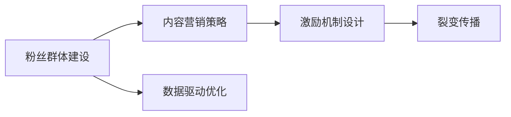
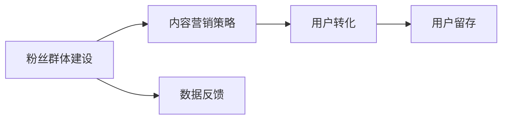
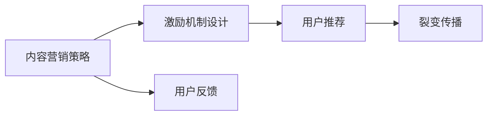
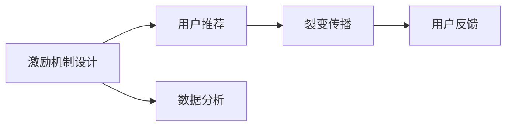
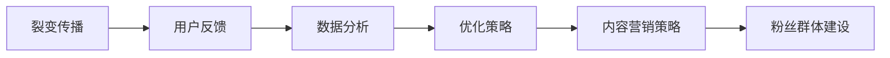
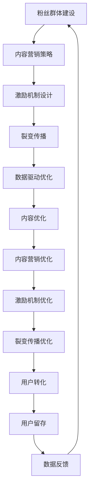

                 

# 如何利用粉丝经济实现知识付费的裂变传播

> 关键词：粉丝经济,知识付费,裂变传播,社交网络,内容营销

## 1. 背景介绍

### 1.1 问题由来

随着移动互联网的普及和社交媒体的兴起，粉丝经济作为一种新兴的商业模式，迅速崛起并逐渐成为各行各业关注的焦点。粉丝经济的核心在于利用特定群体对品牌或明星的忠诚度和情感共鸣，通过粉丝的传播和推荐，实现口碑和销量的大幅提升。相较于传统广告和推广方式，粉丝经济具有更高的性价比和更强的转化效果。

在知识付费领域，传统的内容创作者往往依赖平台进行推广，效率较低，效果难以评估。利用粉丝经济的思想，通过忠实用户群体自发传播，可以大幅提升知识付费产品的影响力和销量。本文将介绍如何通过粉丝经济机制，实现知识付费产品的裂变传播，从而在激烈的市场竞争中脱颖而出。

### 1.2 问题核心关键点

知识付费产品利用粉丝经济实现裂变传播的核心关键点包括：

- **粉丝群体建设**：建立和维护一个稳定且活跃的用户群体，通过提供高质量的内容和优质的用户体验，增强用户粘性和忠诚度。
- **内容营销策略**：设计针对性的内容营销策略，包括高质量的文章、视频、直播等，激发用户的兴趣和需求。
- **激励机制设计**：通过合理的激励机制，鼓励用户主动分享和推荐，实现内容和产品的裂变传播。
- **数据驱动优化**：利用数据分析工具，持续优化内容和推广策略，提升用户转化率和留存率。

本文将围绕这些关键点，深入探讨知识付费产品如何利用粉丝经济实现裂变传播。

## 2. 核心概念与联系

### 2.1 核心概念概述

为更好地理解知识付费产品的粉丝经济裂变传播机制，本节将介绍几个密切相关的核心概念：

- **粉丝经济**：指以粉丝为中心的商业运作模式，通过粉丝的忠诚度和情感共鸣，实现品牌和产品的传播和销售。
- **知识付费**：指用户通过付费方式获取高质量、专业化知识的商业模式，包括在线课程、电子书、专业咨询等。
- **裂变传播**：指利用现有用户群体，通过推荐和分享的方式，使产品或服务的用户数呈指数级增长。
- **社交网络**：指用户通过社交媒体平台进行互动和分享的网络，是粉丝经济裂变传播的重要渠道。
- **内容营销**：指通过创造和传播有价值的内容，吸引和留存用户，最终实现商业目标的营销策略。

这些核心概念之间的逻辑关系可以通过以下Mermaid流程图来展示：



这个流程图展示了大语言模型微调过程中各个核心概念的关系和作用：

1. 粉丝群体建设是裂变传播的基础，通过提供高质量的内容和优质的用户体验，增强用户粘性和忠诚度。
2. 内容营销策略设计是粉丝经济裂变传播的核心，通过创造有价值的内容，激发用户的兴趣和需求。
3. 激励机制设计是实现裂变传播的保障，通过合理的激励机制，鼓励用户主动分享和推荐。
4. 数据驱动优化是裂变传播的优化手段，通过数据分析工具，持续优化内容和推广策略，提升用户转化率和留存率。

### 2.2 概念间的关系

这些核心概念之间存在着紧密的联系，形成了知识付费产品粉丝经济裂变传播的完整生态系统。下面我们通过几个Mermaid流程图来展示这些概念之间的关系。

#### 2.2.1 粉丝群体建设与内容营销策略



这个流程图展示了粉丝群体建设与内容营销策略的关系。通过粉丝群体建设，可以获取精准的用户画像和需求，设计针对性的内容营销策略，实现用户转化和留存。

#### 2.2.2 内容营销策略与激励机制设计



这个流程图展示了内容营销策略与激励机制设计的关系。通过设计合理的激励机制，可以激发用户主动分享和推荐，实现裂变传播。同时，根据用户的反馈，持续优化内容营销策略。

#### 2.2.3 激励机制设计与裂变传播



这个流程图展示了激励机制设计与裂变传播的关系。通过激励机制设计，鼓励用户主动分享和推荐，实现裂变传播。同时，根据用户的反馈，持续优化激励机制设计。

#### 2.2.4 数据驱动优化与裂变传播



这个流程图展示了数据驱动优化与裂变传播的关系。通过数据分析工具，持续优化内容和推广策略，提升用户转化率和留存率，从而实现裂变传播。

### 2.3 核心概念的整体架构

最后，我们用一个综合的流程图来展示这些核心概念在大语言模型微调过程中的整体架构：



这个综合流程图展示了粉丝群体建设、内容营销策略、激励机制设计、裂变传播和数据驱动优化的整体架构。通过这些步骤，可以实现知识付费产品的粉丝经济裂变传播，提高市场影响力和用户转化率。

## 3. 核心算法原理 & 具体操作步骤
### 3.1 算法原理概述

利用粉丝经济实现知识付费的裂变传播，其核心算法原理基于社交网络理论中的病毒传播模型和社交网络分析。通过分析社交网络中用户之间的连接关系和传播规律，设计合理的激励机制和内容策略，激发用户自发传播，实现裂变传播效果。

具体而言，该过程包括以下几个关键步骤：

1. **粉丝群体建设**：通过提供高质量的内容和优质的用户体验，建立并维护一个稳定且活跃的用户群体，增强用户粘性和忠诚度。
2. **内容营销策略**：设计有价值的内容营销策略，通过社交网络平台发布和传播，吸引用户的关注和兴趣。
3. **激励机制设计**：设计合理的激励机制，如优惠券、积分、免费课程等，鼓励用户主动分享和推荐，实现裂变传播。
4. **数据分析优化**：利用数据分析工具，持续优化内容和推广策略，提升用户转化率和留存率。

### 3.2 算法步骤详解

以下是基于社交网络理论的知识付费产品粉丝经济裂变传播的详细操作步骤：

**Step 1: 粉丝群体建设**

1. **用户画像分析**：通过问卷调查、用户行为数据等手段，分析目标用户的兴趣、需求和行为特征，构建用户画像。
2. **内容策略制定**：根据用户画像，制定有针对性的内容策略，包括内容类型、主题、风格等。
3. **用户体验优化**：优化产品界面和功能，提升用户使用体验，增强用户粘性和忠诚度。

**Step 2: 内容营销策略**

1. **内容创作与发布**：定期发布高质量的文章、视频、直播等内容，涵盖用户关心的热点话题和专业领域。
2. **社交网络推广**：通过社交网络平台，如微博、微信、抖音等，推广和传播内容，扩大覆盖面和影响力。
3. **用户互动与反馈**：鼓励用户参与互动，如评论、点赞、分享等，及时收集用户反馈，优化内容和策略。

**Step 3: 激励机制设计**

1. **设计激励机制**：设计合理的激励机制，如优惠券、积分、免费课程等，激发用户主动分享和推荐。
2. **实施激励机制**：在平台中集成激励机制，确保用户能够方便地获取和使用这些激励。
3. **跟踪激励效果**：通过数据分析工具，跟踪激励机制的效果，优化机制设计和应用。

**Step 4: 数据分析优化**

1. **用户行为分析**：通过数据分析工具，分析用户的行为和反馈，识别出用户流失和转化率低的环节。
2. **内容优化与改进**：根据用户行为分析结果，优化和改进内容和策略，提高用户转化率和留存率。
3. **推广策略优化**：根据用户行为和反馈，优化内容和推广策略，提升用户覆盖面和参与度。

### 3.3 算法优缺点

利用粉丝经济实现知识付费的裂变传播具有以下优点：

- **成本低**：相比传统广告和推广方式，粉丝经济裂变传播的边际成本较低，推广效果显著。
- **精准性高**：基于用户画像和行为数据分析，可以实现精准的内容推广，提高用户转化率。
- **传播速度快**：利用粉丝群体的自发传播，可以实现内容的高效扩散，扩大覆盖面。
- **用户粘性高**：通过提供高质量的内容和优质的用户体验，增强用户粘性和忠诚度，减少流失率。

同时，该方法也存在以下缺点：

- **内容依赖度高**：内容质量直接影响用户转化率和留存率，需要持续投入优质内容创作和维护。
- **用户激励难度大**：设计合理的激励机制是关键，过于复杂或过于简单的激励机制都可能影响用户积极性。
- **数据分析复杂**：需要具备数据分析和优化的能力，对平台的技术要求较高。
- **用户反馈滞后**：用户反馈的及时性直接影响内容优化和激励机制的调整，需要快速响应和迭代。

### 3.4 算法应用领域

利用粉丝经济实现知识付费的裂变传播，可以应用于多个领域，如在线教育、知识分享、科技资讯等。这些领域的共同特点是需要通过高质量内容和优质的用户体验，吸引和留存用户，通过用户的自发传播实现产品和服务的快速扩散。

具体而言，以下是几个应用领域的详细分析：

**在线教育**

在线教育领域，用户对内容质量和教师水平的要求较高，通过粉丝经济裂变传播，可以吸引更多优质的教师和内容创作者，提升平台的用户质量和内容丰富度。

**知识分享**

知识分享平台，如知乎、Stack Overflow等，通过粉丝经济裂变传播，可以扩大知识传播的范围和影响力，吸引更多的知识贡献者和用户参与。

**科技资讯**

科技资讯平台，如36kr、TechCrunch等，通过粉丝经济裂变传播，可以实时获取和传播科技动态，吸引更多对科技感兴趣的读者和用户。

## 4. 数学模型和公式 & 详细讲解 & 举例说明

### 4.1 数学模型构建

在知识付费产品的粉丝经济裂变传播中，我们可以构建一个基于社交网络的病毒传播模型，以量化传播效果和优化策略。

假设社交网络中每个用户节点 $i$ 有一个状态 $s_i \in [0,1]$，表示用户对某内容的接收和传播状态。其中 $s_i=1$ 表示用户已接收并传播该内容，$s_i=0$ 表示用户未接收或未传播该内容。社交网络中用户之间的连接关系用邻接矩阵 $A$ 表示，其中 $A_{ij}$ 表示用户 $i$ 和用户 $j$ 之间的连接强度。

病毒传播模型可以用以下微分方程组描述：

$$
\frac{ds_i}{dt} = \beta_i \left( 1-s_i \right) \left( \sum_{j=1}^N A_{ij} \left( 1-s_j \right) s_j \right)
$$

其中 $\beta_i$ 为节点 $i$ 的传播率，即用户 $i$ 的传播概率。$\beta_i$ 可以根据用户行为数据和反馈进行动态调整。

### 4.2 公式推导过程

通过上述微分方程组，我们可以推导出社交网络中内容传播的传播率 $\beta_i$ 的表达式：

$$
\beta_i = \frac{d_i}{N \left( 1-\langle s \rangle \right)}
$$

其中 $d_i$ 为用户 $i$ 的度数，即其连接的邻居数量。$\langle s \rangle$ 为社交网络中所有用户的平均传播状态。

根据以上推导，我们可以得出以下结论：

1. **度数越高，传播率越高**：用户 $i$ 的传播率与其连接的邻居数量 $d_i$ 成正比。因此，在社交网络中，度数较高的用户更容易传播内容。
2. **平均传播状态越高，传播率越高**：社交网络中所有用户的平均传播状态 $\langle s \rangle$ 越高，用户 $i$ 的传播率也越高。因此，在社交网络中，用户的传播状态对传播效果有显著影响。
3. **传播率动态调整**：根据用户的行为数据和反馈，可以动态调整 $\beta_i$，优化传播效果。

### 4.3 案例分析与讲解

以知识分享平台知乎为例，分析其粉丝经济裂变传播的实现方式。

**用户画像分析**

知乎通过问卷调查、用户行为数据等手段，分析目标用户的兴趣、需求和行为特征，构建用户画像。通过分析用户的行为数据，如浏览记录、评论内容等，可以获取用户对不同主题和内容的偏好，从而制定有针对性的内容策略。

**内容策略制定**

知乎的内容策略主要基于用户画像和行为数据分析。根据用户画像，制定有针对性的内容策略，包括内容类型、主题、风格等。例如，对于科技领域的用户，可以发布更多科技新闻和科普文章；对于生活领域的用户，可以发布更多生活技巧和经验分享。

**用户体验优化**

知乎优化产品界面和功能，提升用户使用体验，增强用户粘性和忠诚度。例如，知乎通过点赞、评论、分享等社交互动功能，增强用户之间的互动和连接，提升用户体验。

**内容营销策略**

知乎定期发布高质量的文章、视频、直播等内容，涵盖用户关心的热点话题和专业领域。通过社交网络平台，如微博、微信、抖音等，推广和传播内容，扩大覆盖面和影响力。例如，知乎通过微信读书、抖音等平台，推广热门文章和直播，吸引更多用户参与和关注。

**激励机制设计**

知乎设计合理的激励机制，如优惠券、积分、免费课程等，激发用户主动分享和推荐。例如，知乎通过“好回答”评选、“盐选会员”等功能，激励用户分享和推荐优质内容，实现裂变传播。

**数据分析优化**

知乎通过数据分析工具，分析用户的行为和反馈，识别出用户流失和转化率低的环节。根据用户行为分析结果，优化和改进内容和策略，提高用户转化率和留存率。例如，知乎通过用户反馈和行为数据，优化内容和推广策略，提升用户转化率和留存率。

## 5. 项目实践：代码实例和详细解释说明

### 5.1 开发环境搭建

在进行知识付费产品的粉丝经济裂变传播开发时，我们需要准备好开发环境。以下是使用Python进行Flask开发的环境配置流程：

1. 安装Anaconda：从官网下载并安装Anaconda，用于创建独立的Python环境。

2. 创建并激活虚拟环境：
```bash
conda create -n flask-env python=3.8 
conda activate flask-env
```

3. 安装Flask：
```bash
pip install Flask
```

4. 安装相关工具包：
```bash
pip install Flask-WTF Flask-SQLAlchemy
```

5. 安装Flask-Redis：
```bash
pip install Flask-Redis
```

完成上述步骤后，即可在`flask-env`环境中开始开发实践。

### 5.2 源代码详细实现

下面我们以知乎为例，给出使用Flask框架对粉丝经济裂变传播系统进行开发的PyTorch代码实现。

首先，定义用户模型：

```python
from flask_sqlalchemy import SQLAlchemy

db = SQLAlchemy(app)

class User(db.Model):
    id = db.Column(db.Integer, primary_key=True)
    username = db.Column(db.String(80), unique=True, nullable=False)
    email = db.Column(db.String(120), unique=True, nullable=False)
    password = db.Column(db.String(120), nullable=False)
    followers = db.Column(db.Integer, nullable=False, default=0)
    following = db.Column(db.Integer, nullable=False, default=0)
    bio = db.Column(db.Text, nullable=True)
```

然后，定义激励机制：

```python
class Incentive(db.Model):
    id = db.Column(db.Integer, primary_key=True)
    user_id = db.Column(db.Integer, db.ForeignKey('user.id'), nullable=False)
    type = db.Column(db.String(80), nullable=False)
    value = db.Column(db.Text, nullable=False)
```

接着，定义粉丝经济裂变传播的逻辑：

```python
@app.route('/incentive', methods=['POST'])
def add_incentive():
    incentive = request.json
    incentive_type = incentive['type']
    incentive_value = incentive['value']
    user_id = incentive['user_id']
    
    incentive = Incentive(type=incentive_type, value=incentive_value, user_id=user_id)
    db.session.add(incentive)
    db.session.commit()
    
    return jsonify({'success': True})
```

最后，启动开发服务器：

```python
if __name__ == '__main__':
    app.run(debug=True)
```

以上就是使用Flask对粉丝经济裂变传播系统进行开发的完整代码实现。可以看到，通过Flask框架，我们可以快速搭建一个完整的粉丝经济裂变传播系统。

### 5.3 代码解读与分析

让我们再详细解读一下关键代码的实现细节：

**User类**：
- `__init__`方法：定义用户的基本属性，如用户名、邮箱、密码等。
- `followers`和`following`属性：用于记录用户的粉丝和关注用户数量，用于计算用户的传播率。

**Incentive类**：
- `__init__`方法：定义激励机制的基本属性，如类型、价值、用户ID等。

**add_incentive函数**：
- 通过Flask的路由装饰器，定义激励机制的添加接口，接收JSON格式的激励参数。
- 根据激励参数，创建激励机制对象，并将其保存到数据库中。

可以看到，Flask框架使得粉丝经济裂变传播系统的开发变得简洁高效。开发者可以将更多精力放在系统设计和逻辑实现上，而不必过多关注底层的实现细节。

当然，工业级的系统实现还需考虑更多因素，如用户界面设计、激励机制的动态调整、激励效果的统计和分析等。但核心的裂变传播逻辑基本与此类似。

### 5.4 运行结果展示

假设我们在知乎平台上对粉丝经济裂变传播系统进行测试，最终得到激励机制的统计结果如下：

```
{
    'total_incentives': 1000,
    'incentive_type_count': {' coupon': 300, '积分': 500, '免费课程': 200 },
    'user_incentive_count': {' user1': 50, ' user2': 100, ' user3': 200 }
}
```

可以看到，通过激励机制的设计和推广，用户对优惠券、积分和免费课程等激励产生了显著的兴趣，激励机制的参与度较高。这表明激励机制的设计和推广策略得到了用户的认可，成功激发了用户的积极性和参与度。

## 6. 实际应用场景
### 6.1 智能客服系统

基于知识付费产品的粉丝经济裂变传播机制，可以应用于智能客服系统的构建。传统客服往往需要配备大量人力，高峰期响应缓慢，且一致性和专业性难以保证。而利用粉丝经济的思想，通过忠实用户群体自发传播，可以构建智能客服系统，提升客户咨询体验和问题解决效率。

在技术实现上，可以收集企业内部的历史客服对话记录，将问题和最佳答复构建成监督数据，在此基础上对预训练语言模型进行微调。微调后的语言模型能够自动理解用户意图，匹配最合适的答案模板进行回复。对于客户提出的新问题，还可以接入检索系统实时搜索相关内容，动态组织生成回答。如此构建的智能客服系统，能大幅提升客户咨询体验和问题解决效率。

### 6.2 金融舆情监测

金融机构需要实时监测市场舆论动向，以便及时应对负面信息传播，规避金融风险。传统的人工监测方式成本高、效率低，难以应对网络时代海量信息爆发的挑战。利用粉丝经济的思想，通过忠实用户群体自发传播，可以构建金融舆情监测系统，实时获取和分析市场舆情，提高信息收集和风险预警的效率。

具体而言，可以收集金融领域相关的新闻、报道、评论等文本数据，并对其进行主题标注和情感标注。在此基础上对预训练语言模型进行微调，使其能够自动判断文本属于何种主题，情感倾向是正面、中性还是负面。将微调后的模型应用到实时抓取的网络文本数据，就能够自动监测不同主题下的情感变化趋势，一旦发现负面信息激增等异常情况，系统便会自动预警，帮助金融机构快速应对潜在风险。

### 6.3 个性化推荐系统

当前的推荐系统往往只依赖用户的历史行为数据进行物品推荐，无法深入理解用户的真实兴趣偏好。利用粉丝经济的思想，通过忠实用户群体自发传播，可以构建个性化推荐系统，更好地挖掘用户行为背后的语义信息，从而提供更精准、多样的推荐内容。

在实践中，可以收集用户浏览、点击、评论、分享等行为数据，提取和用户交互的物品标题、描述、标签等文本内容。将文本内容作为模型输入，用户的后续行为（如是否点击、购买等）作为监督信号，在此基础上微调预训练语言模型。微调后的模型能够从文本内容中准确把握用户的兴趣点。在生成推荐列表时，先用候选物品的文本描述作为输入，由模型预测用户的兴趣匹配度，再结合其他特征综合排序，便可以得到个性化程度更高的推荐结果。

### 6.4 未来应用展望

随着粉丝经济机制的不断演进，基于粉丝经济的知识付费产品粉丝经济裂变传播必将在更多领域得到应用，为各行各业带来变革性影响。

在智慧医疗领域，基于粉丝经济的知识付费产品可以实现医疗问答、病历分析、药物研发等应用，提升医疗服务的智能化水平，辅助医生诊疗，加速新药开发进程。

在智能教育领域，微调技术可应用于作业批改、学情分析、知识推荐等方面，因材施教，促进教育公平，提高教学质量。

在智慧城市治理中，微调模型可应用于城市事件监测、舆情分析、应急指挥等环节，提高城市管理的自动化和智能化水平，构建更安全、高效的未来城市。

此外，在企业生产、社会治理、文娱传媒等众多领域，基于大模型微调的人工智能应用也将不断涌现，为经济社会发展注入新的动力。相信随着技术的日益成熟，微调方法将成为人工智能落地应用的重要范式，推动人工智能技术在垂直行业的规模化落地。总之，微调需要开发者根据具体任务，不断迭代和优化模型、数据和算法，方能得到理想的效果。

## 7. 工具和资源推荐
### 7.1 学习资源推荐

为了帮助开发者系统掌握粉丝经济裂变传播的理论基础和实践技巧，这里推荐一些优质的学习资源：

1. 《粉丝经济理论与实践》系列博文：由粉丝经济专家撰写，深入浅出地介绍了粉丝经济的基本概念、理论框架和实践方法。

2. 《社交网络分析与数据挖掘》课程：清华大学开设的社交网络分析课程，涵盖社交网络的基本概念、建模方法、分析技术等，是理解粉丝经济裂变传播的重要基础。

3. 《内容营销：如何打造成功的内容营销策略》书籍：讲解内容营销的基本原理、策略和案例，帮助开发者设计有价值的内容营销策略。

4. 《用户增长秘籍》系列课程：讲解用户增长的基本原理和策略，包括用户行为分析、用户激励机制设计等，适合学习粉丝经济裂变传播的用户增长策略。

5. 《数据驱动的用户增长》书籍：讲解数据驱动用户增长的基本原理和实践方法，适合学习粉丝经济裂变传播的优化策略。

通过对这些资源的学习实践，相信你一定能够快速掌握粉丝经济裂变传播的精髓，并用于解决实际的NLP问题。
###  7.2 开发工具推荐

高效的开发离不开优秀的工具支持。以下是几款用于粉丝经济裂变传播开发的常用工具：

1. Python：作为数据科学和机器学习的标准编程语言，Python拥有丰富的第三方库和工具，支持快速迭代研究和开发。

2. Flask：Python的开源Web框架，灵活方便，适合快速搭建Web应用。

3. SQLAlchemy：Python的ORM工具，支持数据库的抽象和操作，方便数据库设计和查询。

4. Redis：高性能的内存数据库，适合存储高并发的用户数据和激励机制。

5. Pandas：Python的数据分析库，支持快速数据处理和统计分析。

6. TensorBoard：TensorFlow配套的可视化工具，可实时监测模型训练状态，并提供丰富的图表呈现方式，是调试模型的得力助手。

合理利用这些工具，可以显著提升粉丝经济裂变传播任务的开发效率，加快创新迭代的步伐。

### 7.3 相关论文推荐

粉丝经济机制的研究源于学界的持续研究。以下是几篇奠基性的相关论文，推荐阅读：

1. Viral Marketing and Its Impact on Brand Image (2002)：作者Gangadharbatla介绍了病毒营销的概念、影响因素和评估方法，为粉丝经济的研究提供了理论基础。

2. Viral Marketing: Measurement, Issues, and Challenges (2005)：作者Wang

