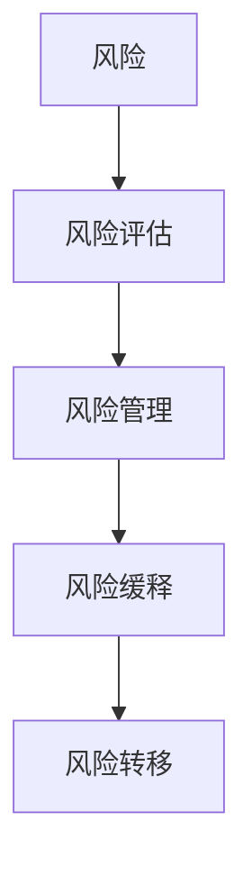
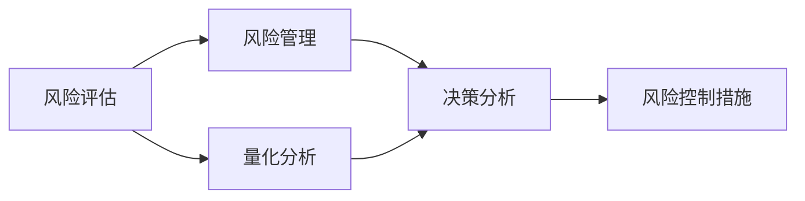
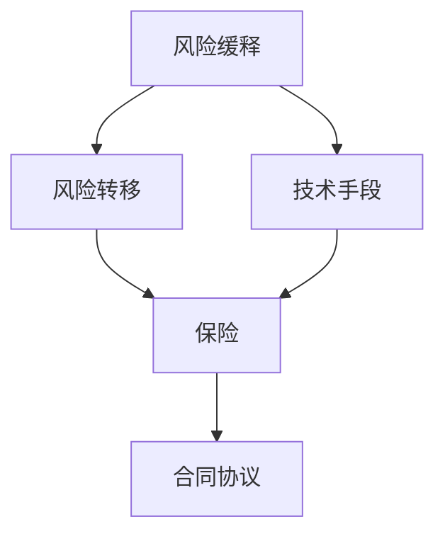
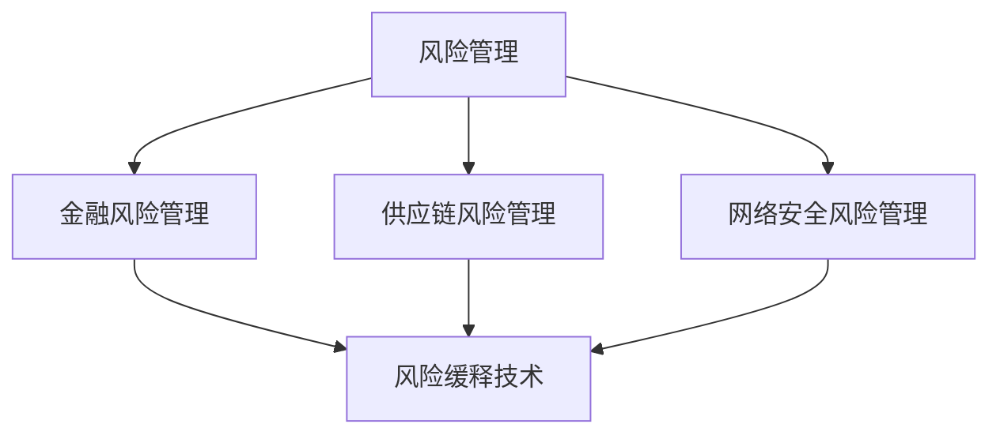
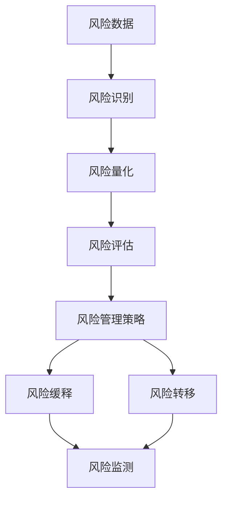

                 

# 如何进行风险控制：如何规避风险和降低损失？

## 1. 背景介绍

### 1.1 问题由来
在当今的数字化时代，风险无处不在。无论是金融市场的波动态势、供应链的复杂性、人工智能的道德挑战，还是网络安全的威胁，都在不断考验着组织和个人的能力。如何有效地识别、评估和管理这些风险，以保护资产、声誉和运营效率，是每个组织都需要面对的重要问题。

### 1.2 问题核心关键点
风险管理的关键在于识别风险、评估风险并采取有效的措施来降低或规避风险。这一过程涉及到数据分析、决策科学、工程技术等多个领域的知识和方法。以下是我们将要深入探讨的核心问题：

- 如何识别潜在的风险源？
- 如何量化风险并评估其可能的影响？
- 如何采用合适的工具和技术手段来降低或规避风险？
- 如何在实践中综合运用上述策略，形成有效的风险管理体系？

## 2. 核心概念与联系

### 2.1 核心概念概述

为了更好地理解如何进行风险控制，本节将介绍几个紧密相关的核心概念：

- **风险(Risk)**：在金融学中，风险通常指资产价格变动的可能性和范围。但在更广泛的意义上，风险包括任何可能导致损失或伤害的因素。
- **风险评估(Risk Assessment)**：通过一系列的定量和定性分析，识别和量化风险事件的可能性和影响。
- **风险管理(Risk Management)**：采取系统性的方法来识别、评估和控制风险，以最小化潜在的负面影响。
- **风险缓释(Risk Mitigation)**：通过各种策略和技术手段，降低风险的概率或影响。
- **风险转移(Risk Transfer)**：通过保险、合同或其他形式的协议，将风险转移给第三方。

这些核心概念之间的逻辑关系可以通过以下Mermaid流程图来展示：



这个流程图展示出从风险识别到风险管理的全过程。识别风险后，评估其影响，管理风险，最终通过缓释和转移等手段来降低风险。

### 2.2 概念间的关系

这些核心概念之间存在着紧密的联系，形成了风险管理的完整框架。下面通过几个Mermaid流程图来展示这些概念之间的关系。

#### 2.2.1 风险评估与风险管理的关系



这个流程图展示了风险评估如何为风险管理提供依据。风险评估包括量化分析和决策分析，最终产生风险控制措施，指导风险管理实践。

#### 2.2.2 风险缓释与风险转移的关系



这个流程图展示了风险缓释与风险转移如何协同工作。风险缓释通过技术手段降低风险的概率或影响，而风险转移通过保险和合同协议，将风险转嫁给第三方。

#### 2.2.3 风险管理与风险管理的实际应用



这个流程图展示了风险管理在多个实际应用领域中的应用。不同的行业和组织需要根据自身的特点和需求，采用特定的风险缓释技术。

### 2.3 核心概念的整体架构

最后，我们用一个综合的流程图来展示这些核心概念在大规模风险管理中的应用：



这个综合流程图展示了从风险数据收集、风险识别、风险量化、风险评估，到风险管理策略制定、风险缓释、风险转移的全过程。风险监测贯穿于整个过程，确保风险管理措施的有效性和持续改进。

## 3. 核心算法原理 & 具体操作步骤
### 3.1 算法原理概述

风险控制的核心是识别潜在的风险源，量化其可能性和影响，并采取适当的措施来降低或规避风险。这一过程涉及多个步骤，包括数据收集、风险识别、风险量化、风险评估和风险控制。

在金融风险管理中，常用的方法包括Value at Risk (VaR)、Expected Shortfall (ES)、Option Pricing等。这些方法通过数学模型和统计分析，量化风险事件的概率和影响，从而为决策提供依据。

在供应链风险管理中，常用的方法包括事件树分析(ETA)、蒙特卡罗模拟等。这些方法通过模拟和统计分析，评估风险事件的概率和影响，从而为风险管理提供指导。

在网络安全风险管理中，常用的方法包括威胁建模、漏洞扫描、入侵检测等。这些方法通过技术和工具，识别和评估安全威胁，从而保护网络安全。

### 3.2 算法步骤详解

风险控制的具体操作步骤包括以下几个关键步骤：

**Step 1: 数据收集与预处理**
- 收集相关的历史数据和实时数据，确保数据的质量和完整性。
- 进行数据清洗和预处理，去除噪音和异常值，确保数据的一致性和可用性。

**Step 2: 风险识别**
- 通过定性和定量分析，识别潜在的风险源。
- 利用专家知识、模型预测和数据分析，确定风险事件的可能性和影响。

**Step 3: 风险量化**
- 使用数学模型和统计分析，量化风险事件的可能性和影响。
- 根据历史数据和专家意见，评估风险事件的概率和潜在影响。

**Step 4: 风险评估**
- 综合考虑风险的概率和影响，进行全面的风险评估。
- 使用风险矩阵、风险评估工具和专家意见，确定风险的优先级和应对策略。

**Step 5: 风险控制**
- 根据风险评估结果，制定风险控制措施。
- 采用风险缓释和风险转移等手段，降低或规避风险。
- 进行持续的风险监测和评估，确保风险管理措施的有效性和持续改进。

### 3.3 算法优缺点

风险控制方法具有以下优点：
1. 系统性和科学性：通过定量和定性分析，系统性地识别和评估风险，提供科学依据。
2. 灵活性：根据实际情况，灵活调整风险控制策略，适应不同的业务需求。
3. 可操作性：通过具体的技术手段和工具，实现风险控制措施的实施和监测。

同时，这些方法也存在一些局限性：
1. 数据依赖性：风险控制依赖于高质量的数据，数据缺失或不完整可能导致错误的评估。
2. 模型复杂性：复杂的数学模型和统计分析，需要专业的知识和技能，增加了实施难度。
3. 动态性不足：部分方法依赖于历史数据，难以适应快速变化的环境和新的风险源。

### 3.4 算法应用领域

风险控制方法在多个领域得到了广泛应用，例如：

- **金融风险管理**：通过VaR、ES等方法，评估金融资产的风险和收益。
- **供应链风险管理**：通过ETA、蒙特卡罗模拟等方法，评估供应链中的风险事件和影响。
- **网络安全风险管理**：通过威胁建模、漏洞扫描、入侵检测等技术，保护网络安全。
- **企业风险管理**：通过全面的风险评估和控制措施，保障企业的运营安全和盈利能力。
- **医疗风险管理**：通过风险量化和风险评估，识别和管理医疗风险，提高患者安全和医疗质量。

这些应用领域展示了风险控制方法的广泛应用价值和实际效果。

## 4. 数学模型和公式 & 详细讲解  
### 4.1 数学模型构建

风险控制的核心数学模型包括概率模型、统计模型和优化模型。以下以金融风险管理中的VaR模型为例，介绍其构建过程。

假设某金融资产的历史价格为$X_1, X_2, ..., X_n$，当前价格为$X$，未来价格为$Y$，则VaR模型可以表示为：

$$
VaR_{\alpha}(X) = \inf\{V\mid P(Y\leq V)\leq \alpha\}
$$

其中，$\alpha$为置信水平，$P(Y\leq V)$为未来价格低于$V$的概率。

### 4.2 公式推导过程

VaR模型的推导过程如下：

1. 假设价格$X$服从正态分布$N(\mu, \sigma^2)$，则未来价格$Y$可以表示为：
   $$
   Y = X + \epsilon
   $$
   其中$\epsilon$为随机误差，服从标准正态分布$N(0, \sigma^2)$。

2. 根据VaR的定义，求解$V$，使得$P(Y\leq V)\leq \alpha$：
   $$
   P(Y\leq V) = P(X + \epsilon \leq V) = P(\epsilon \leq V - X)
   $$
   $$
   P(Y\leq V) = \Phi\left(\frac{V - X}{\sigma}\right)
   $$
   其中$\Phi$为标准正态分布的累积分布函数。

3. 根据置信水平$\alpha$，求解$V$：
   $$
   \Phi\left(\frac{V - X}{\sigma}\right) = \alpha
   $$
   $$
   \frac{V - X}{\sigma} = \Phi^{-1}(\alpha)
   $$
   $$
   V = X + \sigma \Phi^{-1}(\alpha)
   $$

通过上述推导，可以得到VaR模型，用于评估金融资产在给定置信水平下的最大可能损失。

### 4.3 案例分析与讲解

假设某股票的历史价格服从正态分布$N(100, 10^2)$，当前价格为110，需要计算该股票在95%置信水平下的VaR。

1. 根据假设，计算未来价格$Y$的概率密度函数：
   $$
   f_Y(y) = \frac{1}{\sqrt{2\pi}\sigma}\exp\left(-\frac{(y - \mu)^2}{2\sigma^2}\right)
   $$
   $$
   f_Y(y) = \frac{1}{10\sqrt{2\pi}}\exp\left(-\frac{(y - 100)^2}{2 \times 10^2}\right)
   $$

2. 计算VaR，假设$V = 95\% VaR$：
   $$
   \Phi\left(\frac{V - 110}{10}\right) = 0.95
   $$
   $$
   \frac{V - 110}{10} = \Phi^{-1}(0.95) \approx 1.645
   $$
   $$
   V = 110 + 10 \times 1.645 \approx 125.45
   $$

因此，该股票在95%置信水平下的VaR约为125.45。

## 5. 项目实践：代码实例和详细解释说明
### 5.1 开发环境搭建

在进行风险控制实践前，我们需要准备好开发环境。以下是使用Python进行RiskLib开发的环境配置流程：

1. 安装Anaconda：从官网下载并安装Anaconda，用于创建独立的Python环境。

2. 创建并激活虚拟环境：
```bash
conda create -n risklib-env python=3.8 
conda activate risklib-env
```

3. 安装必要的Python库：
```bash
pip install numpy pandas scipy scikit-learn statsmodels
```

4. 安装RiskLib库：
```bash
pip install risklib
```

5. 安装相关数据分析工具：
```bash
pip install pandas-profiling pyarrow fastparquet dask
```

完成上述步骤后，即可在`risklib-env`环境中开始风险控制实践。

### 5.2 源代码详细实现

这里我们以金融风险管理中的VaR模型为例，给出使用RiskLib库计算VaR的Python代码实现。

```python
from risklib.volatility import VaR

# 定义模型参数
n = 100  # 样本数量
mu = 0.1  # 均值
sigma = 0.2  # 标准差

# 计算VaR
var = VaR(n, mu, sigma, 95)
print(f"VaR at 95% confidence level: {var}")
```

上述代码中，我们使用RiskLib库的`VaR`类，计算了一个正态分布下95%置信水平的VaR值。

### 5.3 代码解读与分析

下面我们对代码进行详细解读和分析：

**VaR类**：
- 该类提供了计算VaR的基本方法，包括样本数量、均值、标准差和置信水平等参数。
- 调用`VaR`方法时，传入相应的参数，即可计算出VaR值。

**代码执行**：
- 在定义模型参数后，直接调用`VaR`方法，输出计算结果。

**结果解释**：
- 输出结果显示了在95%置信水平下，该正态分布的VaR值。

通过这个代码实例，我们可以看到，使用RiskLib库可以轻松计算金融资产的VaR值，进一步说明了风险控制技术的实用性和可操作性。

### 5.4 运行结果展示

假设我们计算的VaR值结果为150，即在95%置信水平下，该金融资产的最大可能损失为150。这可以帮助金融投资者和管理者了解该资产的风险水平，从而采取相应的风险管理措施。

## 6. 实际应用场景
### 6.1 智能投顾

智能投顾系统利用风险控制技术，为个人投资者提供个性化的投资建议和风险管理方案。通过分析用户的风险偏好、投资目标和历史交易数据，智能投顾系统可以动态调整投资组合，降低用户的风险暴露，优化投资回报。

### 6.2 金融危机预警

金融危机预警系统利用风险控制技术，监测市场动态，识别潜在的系统性风险。通过实时分析和预测，该系统能够及时发现并预警金融危机的信号，为监管机构和投资者提供决策参考。

### 6.3 信用风险评估

信用风险评估系统利用风险控制技术，评估借款人的信用风险水平。通过分析借款人的财务状况、信用历史和行为模式，该系统能够预测借款人的违约概率，帮助金融机构制定合理的贷款策略。

### 6.4 网络安全防护

网络安全防护系统利用风险控制技术，识别和防御各种网络威胁。通过威胁建模、漏洞扫描和入侵检测等技术，该系统能够实时监测网络活动，防止恶意攻击和数据泄露，保障网络安全。

### 6.5 供应链风险管理

供应链风险管理利用风险控制技术，评估和管理供应链中的风险事件。通过事件树分析和蒙特卡罗模拟等方法，该系统能够预测供应链中断的可能性，制定应对策略，提高供应链的稳定性和效率。

## 7. 工具和资源推荐
### 7.1 学习资源推荐

为了帮助开发者系统掌握风险控制技术的理论基础和实践技巧，这里推荐一些优质的学习资源：

1. **《风险管理：理论与实践》**：一本经典的风险管理教材，涵盖了风险识别的多种方法和工具，适合入门学习。
2. **Coursera《金融工程与风险管理》课程**：由耶鲁大学提供，全面介绍了金融工程和风险管理的核心概念和应用。
3. **Kaggle《风险管理竞赛》**：Kaggle上的一些风险管理竞赛项目，可以通过实际案例练习风险控制技术。
4. **《Python金融分析》**：介绍如何使用Python进行金融数据分析和风险控制，适合实际应用开发。
5. **RiskMetrics《市场风险计量》**：金融风险管理领域的权威手册，提供了详细的风险评估方法和实践指导。

通过对这些资源的学习实践，相信你一定能够快速掌握风险控制技术的精髓，并用于解决实际的业务问题。

### 7.2 开发工具推荐

高效的开发离不开优秀的工具支持。以下是几款用于风险控制开发的常用工具：

1. **Jupyter Notebook**：一个强大的交互式开发环境，支持Python和其他语言的开发，适用于数据科学和风险分析。
2. **RiskLib**：一个专门用于金融风险管理的开源库，提供了丰富的风险评估和缓释工具。
3. **Python风险分析库**：包括Pandas、Scikit-learn、NumPy等库，适合进行数据处理和统计分析。
4. **Excel**：Microsoft Office中的电子表格工具，适合进行简单的风险评估和可视化。

合理利用这些工具，可以显著提升风险控制任务的开发效率，加快创新迭代的步伐。

### 7.3 相关论文推荐

风险控制技术的发展源于学界的持续研究。以下是几篇奠基性的相关论文，推荐阅读：

1. **《VaR的理论与实践》**：Glaros等人在1996年发表的论文，详细介绍了VaR的计算方法和应用场景。
2. **《蒙特卡罗方法在金融风险管理中的应用》**：Longstaff等人在2000年发表的论文，探讨了蒙特卡罗模拟在金融风险管理中的应用。
3. **《神经网络在金融风险管理中的应用》**：Haug在1998年发表的论文，介绍了神经网络在金融风险管理中的预测和控制作用。
4. **《基于事件的供应链风险管理》**：Liu等人在2016年发表的论文，探讨了基于事件树分析的供应链风险管理方法。
5. **《基于深度学习的金融风险管理》**：Xu等人在2020年发表的论文，介绍了深度学习在金融风险管理中的应用。

这些论文代表了大规模风险控制技术的发展脉络。通过学习这些前沿成果，可以帮助研究者把握学科前进方向，激发更多的创新灵感。

除上述资源外，还有一些值得关注的前沿资源，帮助开发者紧跟风险控制技术的最新进展，例如：

1. **arXiv论文预印本**：人工智能领域最新研究成果的发布平台，包括大量尚未发表的前沿工作，学习前沿技术的必读资源。
2. **业界技术博客**：如RiskMetrics、AlgoResearch等顶级研究机构的官方博客，第一时间分享他们的最新研究成果和洞见。
3. **技术会议直播**：如RiskManagement协会、国际风险管理协会等组织的现场或在线直播，能够聆听到业内专家的分享，开拓视野。
4. **GitHub热门项目**：在GitHub上Star、Fork数最多的风险控制相关项目，往往代表了该技术领域的发展趋势和最佳实践，值得去学习和贡献。
5. **行业分析报告**：各大咨询公司如McKinsey、PwC等针对风险管理行业的分析报告，有助于从商业视角审视技术趋势，把握应用价值。

总之，对于风险控制技术的学习和实践，需要开发者保持开放的心态和持续学习的意愿。多关注前沿资讯，多动手实践，多思考总结，必将收获满满的成长收益。

## 8. 总结：未来发展趋势与挑战
### 8.1 总结

本文对风险控制技术进行了全面系统的介绍。首先阐述了风险控制技术的研究背景和意义，明确了风险控制技术在金融、供应链、网络安全等领域的重要作用。其次，从原理到实践，详细讲解了风险控制的核心步骤和关键方法，提供了具体的代码实现和实例分析。同时，本文还广泛探讨了风险控制技术在实际应用中的具体场景和应用前景，展示了风险控制技术的广阔应用价值和实际效果。

通过本文的系统梳理，可以看到，风险控制技术已经成为现代风险管理的重要工具，极大地提升了风险评估和控制的效率和准确性。未来，伴随风险管理技术的不断进步，基于风险控制技术的管理系统将在更广泛的领域得到应用，为经济和社会的发展带来深远影响。

### 8.2 未来发展趋势

展望未来，风险控制技术将呈现以下几个发展趋势：

1. **智能化**：利用机器学习和人工智能技术，提高风险评估和控制的能力和效率。未来，智能投顾、金融危机预警等应用将更加精准和高效。
2. **实时化**：利用大数据和实时分析技术，实现风险事件的实时监测和预警。未来，实时风险管理系统将成为常态。
3. **自动化**：利用自动化工具和流程，简化风险控制的操作和管理。未来，自动化的风险控制平台将得到广泛应用。
4. **个性化**：利用用户数据和行为分析，提供个性化的风险评估和管理服务。未来，智能投顾、信用风险评估等应用将更加个性化。
5. **跨领域融合**：风险控制技术与其他领域的融合，如金融科技、区块链、人工智能等，将带来更多的应用场景和创新突破。

以上趋势凸显了风险控制技术的广阔前景。这些方向的探索发展，必将进一步提升风险控制技术的性能和应用范围，为风险管理带来更多的价值和机会。

### 8.3 面临的挑战

尽管风险控制技术已经取得了显著成就，但在实际应用中仍面临诸多挑战：

1. **数据质量和多样性**：高质量和多样化的数据是风险控制的基础，但数据的获取和处理往往面临成本和隐私问题。如何提高数据的质量和可用性，是未来的重要课题。
2. **模型复杂性和计算资源**：复杂的数学模型和计算分析需要高水平的计算资源和技术支持，如何降低模型的复杂性和计算成本，是技术发展的方向。
3. **跨学科合作**：风险控制涉及金融、工程、数学等多个学科，如何跨学科合作，形成统一的框架和方法，是实现技术突破的关键。
4. **道德和合规性**：风险控制技术的应用涉及隐私保护、数据安全等多个方面，如何确保技术的道德和合规性，是法律和伦理层面的重要问题。
5. **实时性和可解释性**：实时风险控制系统需要快速响应和解释，如何平衡实时性和模型的可解释性，是技术应用的难点。

这些挑战需要跨学科的协作和持续的技术创新，才能进一步推动风险控制技术的发展和应用。

### 8.4 未来突破

面对风险控制技术所面临的挑战，未来的研究需要在以下几个方面寻求新的突破：

1. **多源数据融合**：利用来自不同渠道的数据，提高风险评估的准确性和全面性。
2. **轻量级模型和算法**：开发更加轻量级和高效的模型和算法，降低计算成本和资源消耗。
3. **跨学科合作**：推动跨学科合作，形成统一的框架和方法，提升风险控制技术的科学性和系统性。
4. **道德和合规性**：加强对风险控制技术的伦理和安全审查，确保技术的合法性和合规性。
5. **实时监控和反馈**：建立实时监控和反馈机制，及时调整风险控制策略，提升系统的稳定性和可靠性。

这些研究方向的探索，必将引领风险控制技术迈向更高的台阶，为构建安全、可靠、智能的风险管理系统铺平道路。面向未来，风险控制技术还需要与其他技术领域进行更深入的融合，如人工智能、区块链、大数据等，共同推动风险管理的进步。

## 9. 附录：常见问题与解答

**Q1: 什么是VaR？**

A: Value at Risk (VaR) 是一种风险评估方法，用于量化金融资产在给定置信水平下的最大可能损失。其公式为 $VaR_{\alpha}(X) = \inf\{V\mid P(Y\leq V)\leq \alpha\}$，其中 $P(Y\leq V)$ 表示未来价格低于 $V$ 的概率。

**Q2: 如何使用Python计算VaR？**

A: 可以使用RiskLib库的 `VaR` 类来计算VaR。首先需要定义模型参数，如样本数量、均值和标准差，然后调用 `VaR` 方法，传入相应的参数，即可计算出VaR值。

**Q3: 风险控制技术的未来发展趋势有哪些？**

A: 未来风险控制技术的趋势包括智能化、实时化、自动化、个性化和跨领域融合。智能化利用机器学习和人工智能技术提高风险评估和控制能力；实时化利用大数据和实时分析技术实现实时监测和预警；自动化利用自动化工具和流程简化风险控制操作；个性化利用用户数据和行为分析提供个性化服务；跨领域融合利用其他领域的技术提高风险控制的全面性和应用性。

**Q4: 风险控制技术面临的挑战有哪些？**

A: 风险控制技术面临的挑战包括数据质量和多样性、模型复杂性和计算资源、跨学科合作、道德和合规性、实时性和可解释性。提高数据质量、降低模型复杂性、跨学科合作、确保技术合法性和合规性、平衡实时性和可解释性都是未来的研究方向。

**Q5: 如何提高风险控制技术的可解释性？**

A: 提高风险控制技术的可解释性需要结合因果分析和博弈论工具，识别模型的关键特征和决策逻辑，增强输出的因果性和逻辑性。同时，可以利用可视化工具和交互式界面，帮助用户理解模型的工作原理和风险评估结果。

作者：禅与计算机程序设计艺术 / Zen and the Art of Computer Programming

