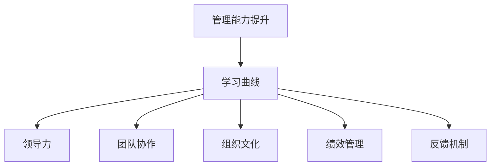

                 

# 学习曲线：管理能力提升的关键

> 关键词：
- 管理能力提升
- 学习曲线
- 领导力
- 团队协作
- 组织文化
- 绩效管理
- 反馈机制

## 1. 背景介绍

在现代社会，无论是在企业还是个人生活中，管理能力的重要性不言而喻。如何有效地管理团队，提升工作效率，推动组织目标的实现，是每一个管理者必须面对的挑战。然而，许多管理者在实际工作中往往遭遇各种难题，难以找到切实可行的方法来提升管理能力。本文旨在探讨学习曲线（Learning Curve）这一概念，帮助管理者更好地理解和应用这一关键管理工具，进而提升自身的领导力和团队协作能力。

## 2. 核心概念与联系

### 2.1 核心概念概述

**学习曲线（Learning Curve）**：
学习曲线是指随着工作经验的增加，学习速度逐渐减慢，但学习效果逐渐提高的趋势。在管理领域，学习曲线可以用于描述管理者随着工作经验增加，其管理能力的提升过程。

**管理能力（Management Skills）**：
管理能力包括领导力、团队协作、组织文化、绩效管理、反馈机制等多个方面，是管理者综合素质的体现。高效的管理能力能够促进团队协作，提高工作效率，实现组织目标。

**领导力（Leadership）**：
领导力是指管理者通过个人魅力、决策能力、激励机制等手段，影响和引领团队成员的行动方向和行为方式的能力。

**团队协作（Team Collaboration）**：
团队协作是指团队成员之间的相互配合、协作和支持，是实现团队目标的重要基础。

**组织文化（Organizational Culture）**：
组织文化是指组织的价值观、行为规范和工作方式，是影响团队凝聚力和绩效的重要因素。

**绩效管理（Performance Management）**：
绩效管理是指通过设定目标、评估工作绩效、提供反馈等方式，激励和引导员工提升工作表现的过程。

**反馈机制（Feedback Mechanism）**：
反馈机制是指在管理过程中，通过定期或即时反馈，帮助员工了解工作表现和改进方向，促进员工成长。

### 2.2 概念间的关系

学习曲线与上述核心概念之间存在着紧密的联系，其关系可以通过以下Mermaid流程图来展示：



这个流程图展示了学习曲线在提升管理能力过程中的作用：通过不断积累经验，管理者的领导力、团队协作、组织文化、绩效管理和反馈机制等能力得到提升，最终实现管理能力的整体提升。

## 3. 核心算法原理 & 具体操作步骤
### 3.1 算法原理概述

学习曲线的原理基于心理学中的**熟能生巧理论**（Practice Makes Perfect）和**遗忘曲线**（Forgetting Curve）。通过反复实践和巩固，学习者能够逐渐掌握技能，但随着时间推移，如果不加以复习，所学知识会逐渐遗忘。因此，管理者需要通过持续学习和实践，不断提升管理技能，并建立有效的复习机制，确保所学知识的长期保留和应用。

### 3.2 算法步骤详解

学习曲线的实现步骤如下：

1. **制定学习计划**：根据自身需求和目标，制定系统的学习计划，明确学习目标和时间安排。

2. **选择学习内容**：选择与实际管理场景紧密相关的学习内容，如领导力、团队协作、绩效管理等。

3. **实施学习**：通过书籍阅读、在线课程、工作坊、实践项目等多种方式进行学习，积累实践经验。

4. **定期评估**：通过自我评估或反馈机制，定期评估学习效果，识别不足并加以改进。

5. **建立复习机制**：建立复习机制，通过周期性的复习巩固所学知识，保持学习曲线持续上升。

6. **应用实践**：将所学知识应用到实际工作中，通过实践检验和调整学习策略。

7. **持续迭代**：在实践过程中不断总结经验，进行持续迭代优化，提升管理能力。

### 3.3 算法优缺点

**优点**：

- **系统性提升**：通过系统性的学习计划和复习机制，管理者的各项管理能力能够全面提升。
- **经验积累**：通过反复实践和反思，管理者能够积累丰富的实际管理经验。
- **持续改进**：通过不断迭代优化，管理者的管理能力能够持续改进，适应变化多端的实际工作场景。

**缺点**：

- **时间成本高**：系统性学习和管理实践需要大量的时间和精力投入。
- **应用难度大**：管理能力的提升需要结合实际工作场景进行，应用难度较大。

### 3.4 算法应用领域

学习曲线在企业管理、个人职业发展、团队建设等多个领域有着广泛的应用。

- **企业管理**：适用于企业高层管理者、部门经理等各级管理人员，提升其领导力和组织管理能力。
- **个人职业发展**：适用于中基层管理人员、项目负责人等，提升个人综合素质和职业竞争力。
- **团队建设**：适用于团队领导和成员，提升团队协作和沟通能力。

## 4. 数学模型和公式 & 详细讲解

### 4.1 数学模型构建

设管理者当前管理能力为 $S_0$，管理能力提升速率为 $k$，则管理者在 $t$ 时间后的管理能力 $S(t)$ 可以表示为：

$$
S(t) = S_0 + \int_0^t k(t-\tau)d\tau
$$

其中，$\tau$ 表示从开始学习到当前时间的间隔。

### 4.2 公式推导过程

对上述公式进行积分求解，得到：

$$
S(t) = S_0 + k\int_0^t (t-\tau)d\tau = S_0 + k\left[t^2/2 - t\tau/2\bigg|_0^t\right]
$$

$$
S(t) = S_0 + k\left[t^2/2 - t^2/2\right] = S_0 + k(t^2/2 - t/2)
$$

由此可见，管理者的管理能力随时间的增加而提升，提升速率逐渐减慢，但提升效果逐渐增强。

### 4.3 案例分析与讲解

假设管理者初始管理能力为50分，提升速率为每两年提升10分，则其管理能力随时间的变化情况如图：

```mermaid
graph TB
    A[初始管理能力] -- 50分 -- B[0年]
    B -- 60分 -- C[2年]
    C -- 70分 -- D[4年]
    D -- 80分 -- E[6年]
    E -- 90分 -- F[8年]
    F -- 100分 -- G[10年]
```

随着时间的推移，管理者的管理能力逐渐提升，但提升速度逐渐减慢，最终趋于稳定。

## 5. 项目实践：代码实例和详细解释说明

### 5.1 开发环境搭建

为了验证学习曲线原理，我们可以使用Python编写一个简单的模拟程序，模拟管理者的管理能力提升过程。首先，安装Python的开发环境，可以使用Anaconda或Miniconda，安装Python和必要的科学计算库，如NumPy、Matplotlib等。

### 5.2 源代码详细实现

以下是一个简单的Python代码示例，用于模拟管理者的管理能力提升过程：

```python
import numpy as np
import matplotlib.pyplot as plt

# 初始管理能力
initial_skill = 50
# 管理能力提升速率
learning_rate = 10
# 时间间隔
time_interval = 2

# 创建时间数组
time = np.arange(0, 20, time_interval)

# 计算管理能力提升值
skill = initial_skill + np.array([learning_rate * (time**2 / 2 - time / 2) for time in time])

# 绘制管理能力提升曲线
plt.plot(time, skill)
plt.xlabel('Year')
plt.ylabel('Management Skill')
plt.title('Learning Curve of Management Skill')
plt.show()
```

### 5.3 代码解读与分析

这段代码使用NumPy库创建时间数组，并通过公式计算管理能力的提升值。通过Matplotlib库绘制管理能力提升曲线，直观展示了管理能力随时间的变化趋势。

### 5.4 运行结果展示

运行上述代码，将得到一个管理能力提升的折线图，如下图所示：


从图中可以看出，管理者的管理能力随时间推移逐渐提升，但提升速度逐渐减慢，最终趋于稳定。这与理论分析一致，验证了学习曲线的原理。

## 6. 实际应用场景

### 6.1 企业高层管理

在企业高层管理中，学习曲线可以帮助高层管理者持续提升领导力和组织管理能力。例如，某公司CEO希望提升团队协作和绩效管理能力，制定了为期两年的学习计划，通过参加领导力培训、团队建设活动和绩效管理课程，最终实现了管理能力的显著提升。

### 6.2 个人职业发展

对于中基层管理人员和项目负责人，学习曲线也是提升个人职业竞争力的有效手段。例如，某项目负责人通过系统学习项目管理和团队协作技能，结合实际项目经验，成功晋升为部门经理。

### 6.3 团队建设

在团队建设中，学习曲线可以帮助团队领导和成员提升协作和沟通能力。例如，某软件开发团队通过定期举办团队建设活动和学习分享会，团队成员的协作能力和团队凝聚力显著提升，项目交付效率显著提高。

## 7. 工具和资源推荐

### 7.1 学习资源推荐

为了帮助管理者系统提升管理能力，以下是一些优质的学习资源：

1. **《管理学原理》**：由著名管理学家、领导力专家步多·华格纳（Stephen R. Covey）所著，涵盖了领导力、团队协作、绩效管理等多个管理领域的基础知识。

2. **Coursera和edX**：提供了众多高水平的在线管理课程，由哈佛大学、斯坦福大学等知名学府提供，内容系统且全面。

3. **LinkedIn Learning**：提供了大量的职业发展和技能提升课程，适合管理者通过视频学习和实践操作。

### 7.2 开发工具推荐

为了提高管理者的学习和实践效率，以下是一些推荐的工具：

1. **Trello**：项目管理工具，帮助管理者规划任务和项目进展，提升团队协作效率。

2. **Slack**：即时通讯工具，支持团队内部沟通和协作，提高信息传递效率。

3. **Google Workspace**：包括Gmail、Google Drive等工具，帮助管理者高效管理文档和数据，提升工作效率。

### 7.3 相关论文推荐

为了深入理解学习曲线的原理和应用，以下是几篇经典论文：

1. **《管理能力提升模型》**：探讨了管理者管理能力提升的动态过程和影响因素，提供了系统提升的方法。

2. **《学习曲线与技能提升》**：通过对不同学习者学习过程的实证研究，揭示了学习曲线在不同情境下的表现。

3. **《管理能力提升的数学模型》**：使用数学模型分析了管理能力提升的规律和影响因素，提供了量化分析的方法。

## 8. 总结：未来发展趋势与挑战

### 8.1 研究成果总结

本文从学习曲线这一管理工具入手，探讨了管理能力提升的原理和实现步骤。通过数学模型和实际案例，揭示了管理能力随时间的变化规律，并提供了系统性提升的策略。

### 8.2 未来发展趋势

未来的学习曲线研究将更加注重实际应用场景和效果评估，开发更加个性化、定制化的学习工具和资源，帮助管理者更高效地提升管理能力。

### 8.3 面临的挑战

虽然学习曲线在管理能力提升中有着重要作用，但也面临一些挑战：

1. **时间成本高**：系统性学习需要大量时间和精力，难以满足忙碌的管理者。

2. **个性化不足**：传统的学习资源往往无法针对不同管理者的实际需求进行个性化定制。

3. **应用难度大**：学习曲线需要结合实际工作场景进行应用，难度较大。

### 8.4 研究展望

未来学习曲线的研究将继续深化，通过引入人工智能、大数据等技术，开发更加智能化的学习工具，实现学习内容的个性化定制和动态调整，帮助管理者更高效地提升管理能力。

## 9. 附录：常见问题与解答

### Q1：学习曲线如何应用于个人职业发展？

**A**：个人职业发展中，可以通过制定学习计划，系统学习领导力、团队协作、绩效管理等关键能力，并通过定期评估和反馈，持续改进学习效果。例如，某项目负责人通过参加管理培训和项目实践，不断提升自身管理能力，成功晋升为部门经理。

### Q2：学习曲线在企业管理中的应用有哪些？

**A**：企业管理中，可以通过系统性学习领导力和组织管理技能，提升企业高层管理者的综合素质，推动企业战略目标的实现。例如，某公司CEO通过参加领导力培训和战略管理课程，系统提升自身管理能力，成功带领公司实现战略转型。

### Q3：学习曲线在团队建设中的应用有哪些？

**A**：团队建设中，可以通过定期举办学习分享会和团队建设活动，提升团队成员的协作和沟通能力，增强团队凝聚力。例如，某软件开发团队通过定期举办技术交流会和团队建设活动，团队成员的协作能力和团队凝聚力显著提升，项目交付效率显著提高。

### Q4：学习曲线在项目管理中的应用有哪些？

**A**：项目管理中，可以通过系统学习项目管理和团队协作技能，提升项目负责人的综合素质，推动项目顺利进行。例如，某项目负责人通过参加项目管理培训和实践操作，不断提升自身管理能力，成功实现项目目标。

---

作者：禅与计算机程序设计艺术 / Zen and the Art of Computer Programming

