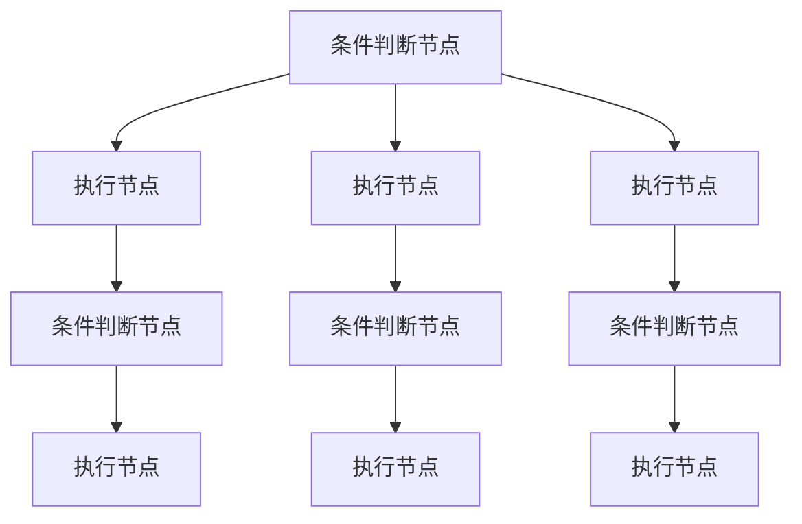
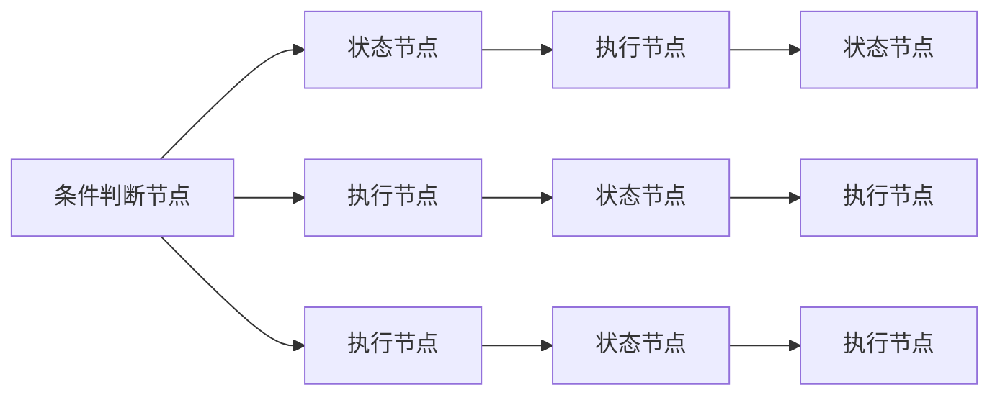
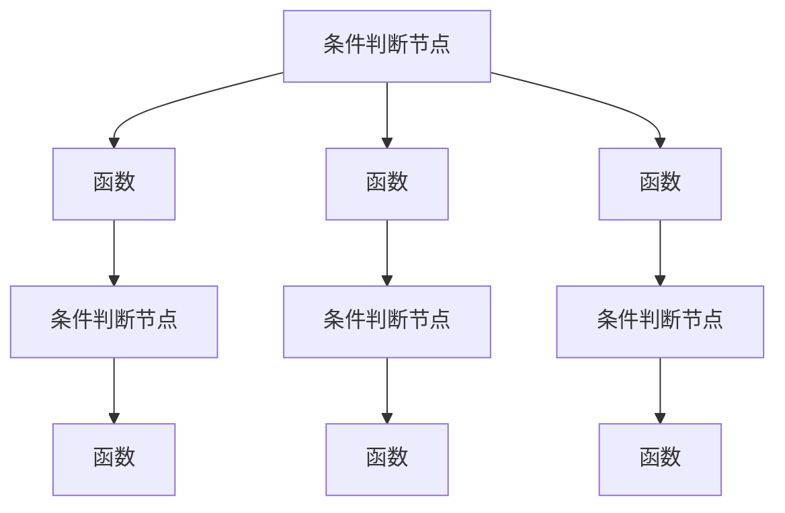
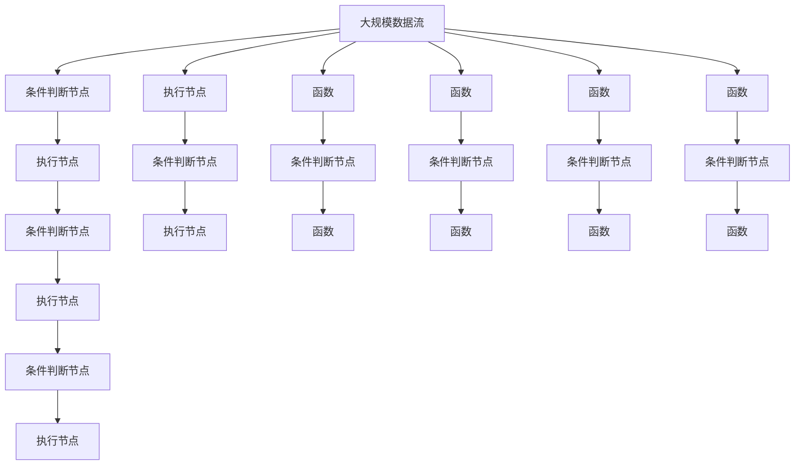

                 

# 实现条件判断的路由链：Router Chain

> 关键词：路由链,条件判断,软件开发,网络编程,计算机网络

## 1. 背景介绍

### 1.1 问题由来

在网络编程和软件开发中，条件判断是频繁被使用的基本逻辑结构。然而，当条件判断条件过多时，代码的可读性和可维护性都会受到严重影响。例如，假设需要实现以下逻辑：

```python
if x > 10:
    if y > 5:
        print("x > 10 且 y > 5")
    else:
        print("x > 10 但 y <= 5")
elif x <= 10:
    if y < 5:
        print("x <= 10 且 y < 5")
    else:
        print("x <= 10 但 y >= 5")
```

随着条件的增加，代码复杂性呈指数级增长，可读性和可维护性急剧下降。如何简化这种复杂的多重条件判断，提高代码的清晰度和可维护性，成为软件开发中的一个重要课题。

### 1.2 问题核心关键点

为解决这个问题，我们需要设计一种新的路由结构，使得复杂的多重条件判断可以被组织成一个链式结构，每个节点都是一个条件判断的执行节点，根据条件判断的结果，决定下一个节点的执行。这种结构不仅提高了代码的可读性和可维护性，还大大简化了开发过程。

### 1.3 问题研究意义

通过设计和实现这种条件判断的路由链（Router Chain），可以显著提升软件开发和网络编程的效率和质量。其意义主要体现在以下几个方面：

1. **提升代码可读性**：通过链式结构，将复杂的多重条件判断分解成多个简单节点，使代码更加清晰易读。
2. **简化开发过程**：每个节点只需关注自身条件和逻辑，不需要考虑其他节点的实现细节，开发过程更加简单高效。
3. **增强代码可维护性**：节点间相互独立，修改和扩展某个节点的逻辑不会影响其他节点的执行，代码更加健壮可靠。
4. **提高开发效率**：通过链式结构，可以将复杂的条件判断逻辑模块化，降低开发和调试成本，提升开发速度。
5. **支持动态路由**：节点之间通过调用关系形成链，可以根据实际需求动态添加或修改节点，适应更多场景。

因此， Router Chain 是一种非常有潜力的设计模式，能够帮助开发者更高效、更优雅地实现复杂的条件判断逻辑。

## 2. 核心概念与联系

### 2.1 核心概念概述

为了更好地理解 Router Chain 的设计和实现，我们首先介绍几个相关的核心概念：

- **条件判断节点**：负责执行条件判断，并根据结果决定下一步执行的节点。
- **执行节点**：负责执行具体的操作，可以是数据处理、逻辑计算等。
- **链表**：由多个节点组成，每个节点根据前一个节点的结果决定是否执行自身逻辑。
- **状态机**：用于描述节点的状态转移，每个节点根据当前状态和输入决定下一步状态。

这些概念之间的联系可以用以下 Mermaid 流程图来展示：



这个流程图展示了由多个节点组成的链式结构，每个节点根据前一个节点的结果决定是否执行自身逻辑，从而实现复杂的条件判断和处理。

### 2.2 概念间的关系

这些核心概念之间存在着紧密的联系，形成了 Router Chain 的完整结构。下面我们通过几个 Mermaid 流程图来展示这些概念之间的关系。

#### 2.2.1 Router Chain 的基本结构


这个流程图展示了 Router Chain 的基本结构，每个节点负责条件判断或执行操作，根据前一个节点的结果决定是否执行自身逻辑。

#### 2.2.2 Router Chain 与状态机



这个流程图展示了 Router Chain 与状态机的关系，通过状态节点的引入，每个节点可以描述自身的多个状态，根据当前状态和输入决定下一步状态。

#### 2.2.3 Router Chain 与函数调用



这个流程图展示了 Router Chain 与函数调用的关系，每个节点可以是具体的函数调用，执行特定的操作。

### 2.3 核心概念的整体架构

最后，我们用一个综合的流程图来展示这些核心概念在大规模路由链中的应用：



这个综合流程图展示了大规模数据流经过多个节点的处理过程，每个节点根据前一个节点的结果决定是否执行自身逻辑，形成复杂的路由链结构。

## 3. 核心算法原理 & 具体操作步骤
### 3.1 算法原理概述

Router Chain 的核心思想是将复杂的多重条件判断分解成多个简单的节点，每个节点负责判断特定条件并执行相应操作。通过链式结构，节点之间相互独立，可以动态添加或修改，适应更多复杂的逻辑场景。

具体实现步骤如下：

1. **定义节点类**：每个节点是一个独立的类，负责条件判断和操作执行。
2. **设计链表结构**：通过链表将多个节点串联起来，形成路由链。
3. **实现节点调用**：每个节点根据前一个节点的结果决定是否执行自身逻辑，并根据结果更新链表结构。
4. **处理异常情况**：处理节点执行过程中的异常情况，保证链表的正确性和稳定性。

### 3.2 算法步骤详解

以下是 Router Chain 的详细步骤：

1. **定义节点类**：

   ```python
   class Node:
       def __init__(self, condition, action):
           self.condition = condition
           self.action = action
           self.next_node = None
           
       def execute(self, data):
           if self.condition(data):
               self.action(data)
               if self.next_node:
                   return self.next_node.execute(data)
           return data
   ```

   节点类包含条件判断函数 `condition` 和操作函数 `action`，以及指向下一个节点的指针 `next_node`。

2. **设计链表结构**：

   ```python
   class RouterChain:
       def __init__(self):
           self.head = None
           self.tail = None
           
       def add_node(self, node):
           if not self.head:
               self.head = node
           else:
               self.tail.next_node = node
           self.tail = node
   ```

   链表类包含头节点 `head` 和尾节点 `tail`，以及添加节点的方法 `add_node`。

3. **实现节点调用**：

   ```python
   chain = RouterChain()
   ```

   创建链表对象 `chain`，并定义根节点。

   ```python
   root_node = Node(lambda x: x > 10, print("x > 10"))
   chain.add_node(root_node)
   ```

   添加根节点 `root_node`，条件为 `x > 10`，操作为打印 `"x > 10"`。

   ```python
   node1 = Node(lambda x: x > 5, print("x > 5"))
   node2 = Node(lambda x: x < 5, print("x < 5"))
   chain.add_node(node1)
   chain.add_node(node2)
   ```

   添加节点 `node1` 和 `node2`，分别条件为 `x > 5` 和 `x < 5`，操作为打印 `"x > 5"` 和 `"x < 5"`。

4. **处理异常情况**：

   ```python
   try:
       result = chain.head.execute(data)
   except Exception as e:
       print(f"Error executing node: {e}")
   ```

   在执行节点时，使用异常处理机制，处理可能出现的错误。

### 3.3 算法优缺点

**优点**：

1. **代码可读性高**：通过链式结构，将复杂的多重条件判断分解成多个简单节点，使代码更加清晰易读。
2. **开发效率高**：每个节点只需关注自身条件和逻辑，不需要考虑其他节点的实现细节，开发过程更加简单高效。
3. **可维护性强**：节点间相互独立，修改和扩展某个节点的逻辑不会影响其他节点的执行，代码更加健壮可靠。
4. **支持动态路由**：节点之间通过调用关系形成链，可以根据实际需求动态添加或修改节点，适应更多场景。

**缺点**：

1. **内存消耗大**：每个节点都需要存储条件和操作函数，以及指向下一个节点的指针，可能会占用较多内存。
2. **执行效率低**：在节点较多时，链表的遍历和查找效率较低，可能会导致性能问题。
3. **异常处理复杂**：在节点执行过程中，需要处理各种异常情况，实现起来较为复杂。

### 3.4 算法应用领域

Router Chain 可以广泛应用于软件开发和网络编程中的各种场景，包括但不限于以下几个方面：

1. **网络路由**：在网络编程中，路由器需要根据数据包的目的地址决定转发路径，可以使用 Router Chain 实现复杂的路由逻辑。
2. **数据库查询**：在数据库查询中，条件复杂的查询语句可以使用 Router Chain 实现条件判断和逻辑处理。
3. **UI框架**：在 UI 框架中，复杂的交互逻辑可以使用 Router Chain 实现条件判断和事件处理。
4. **机器学习模型**：在机器学习模型中，多分支的决策树可以使用 Router Chain 实现节点判断和模型计算。
5. **多任务处理**：在多任务处理中，复杂的任务调度可以使用 Router Chain 实现条件判断和任务执行。

这些应用场景都需要实现复杂的条件判断逻辑， Router Chain 可以提供一种简单高效的设计方案，提高开发效率和代码可维护性。

## 4. 数学模型和公式 & 详细讲解 & 举例说明

### 4.1 数学模型构建

Router Chain 的数学模型可以抽象为图论中的有向图，每个节点表示一个有向边，条件判断为边上的标签，操作执行为节点上的操作。

在数学上， Router Chain 可以表示为如下的有向图：

$$
G = (V, E)
$$

其中 $V$ 为节点集合，$E$ 为边集合，每条边 $(u, v)$ 表示从节点 $u$ 到节点 $v$ 的转移，条件判断为边上的标签 $c(u, v)$，操作执行为节点上的操作 $f(v)$。

### 4.2 公式推导过程

设节点集合 $V = \{v_1, v_2, ..., v_n\}$，边集合 $E = \{(u, v)\}$，条件判断函数 $c(u, v)$，操作函数 $f(v)$。

在节点 $v_i$ 处，根据前一个节点 $v_{i-1}$ 的结果 $d_{i-1}$，执行条件判断 $c(v_{i-1}, v_i)$，若条件满足，则执行操作 $f(v_i)$，并更新数据 $d_i$，继续向后传递。

节点 $v_i$ 的执行过程可以表示为：

$$
d_i = f(v_i)(c(v_{i-1}, v_i)(d_{i-1}))
$$

其中 $c(v_{i-1}, v_i)$ 为条件判断函数，$d_{i-1}$ 为前一个节点的数据，$d_i$ 为当前节点的数据。

### 4.3 案例分析与讲解

以一个简单的条件判断为例，假设需要对一个整数数组进行过滤，只保留大于等于 5 的元素。

```python
def filter_array(array):
    if len(array) > 0:
        result = []
        node1 = Node(lambda x: x > 5, result.append)
        chain.add_node(node1)
        chain.head.execute(array)
        return result
    else:
        return array
```

在上述代码中，根节点条件判断数组长度是否大于 0，若大于 0，则添加节点 `node1`，条件判断每个元素是否大于等于 5，若大于等于 5，则执行操作 `result.append`，最终返回过滤后的结果。

## 5. 项目实践：代码实例和详细解释说明

### 5.1 开发环境搭建

在开始项目实践前，我们需要准备好开发环境。以下是使用 Python 进行开发的环境配置流程：

1. 安装 Python 3.x：从官网下载并安装 Python 3.x 版本。
2. 安装 pip：在命令行中输入 `pip install pip` 进行安装。
3. 安装依赖库：在命令行中输入 `pip install flask` 安装 Flask 框架，或 `pip install django` 安装 Django 框架。
4. 创建项目目录：创建一个新的项目目录，并配置 `__init__.py` 文件。
5. 编写代码：在项目目录中编写代码，使用 Flask 或 Django 框架实现路由链的功能。

### 5.2 源代码详细实现

以下是一个使用 Flask 框架实现 Router Chain 的示例代码：

```python
from flask import Flask, request

app = Flask(__name__)

class Node:
    def __init__(self, condition, action):
        self.condition = condition
        self.action = action
        self.next_node = None

    def execute(self, data):
        if self.condition(data):
            self.action(data)
            if self.next_node:
                return self.next_node.execute(data)
        return data

class RouterChain:
    def __init__(self):
        self.head = None
        self.tail = None

    def add_node(self, node):
        if not self.head:
            self.head = node
        else:
            self.tail.next_node = node
        self.tail = node

@app.route('/router_chain', methods=['POST'])
def router_chain():
    data = request.get_json()
    result = data['data']
    chain = RouterChain()
    node1 = Node(lambda x: x > 5, result.append)
    chain.add_node(node1)
    chain.head.execute(result)
    return {'result': result}

if __name__ == '__main__':
    app.run(debug=True)
```

在上述代码中，我们使用了 Flask 框架实现了 Router Chain 的功能。通过 POST 请求向 `/router_chain` 接口发送数据，触发 Router Chain 的执行过程，并返回最终结果。

### 5.3 代码解读与分析

在上述代码中，我们使用了 Flask 框架来实现 Router Chain 的功能。

1. **定义节点类**：

   ```python
   class Node:
       def __init__(self, condition, action):
           self.condition = condition
           self.action = action
           self.next_node = None
           
       def execute(self, data):
           if self.condition(data):
               self.action(data)
               if self.next_node:
                   return self.next_node.execute(data)
           return data
   ```

   节点类包含条件判断函数 `condition` 和操作函数 `action`，以及指向下一个节点的指针 `next_node`。在 `execute` 方法中，根据条件判断结果决定是否执行操作，并更新链表结构。

2. **设计链表结构**：

   ```python
   class RouterChain:
       def __init__(self):
           self.head = None
           self.tail = None
           
       def add_node(self, node):
           if not self.head:
               self.head = node
           else:
               self.tail.next_node = node
           self.tail = node
   ```

   链表类包含头节点 `head` 和尾节点 `tail`，以及添加节点的方法 `add_node`。

3. **实现节点调用**：

   ```python
   @app.route('/router_chain', methods=['POST'])
   def router_chain():
       data = request.get_json()
       result = data['data']
       chain = RouterChain()
       node1 = Node(lambda x: x > 5, result.append)
       chain.add_node(node1)
       chain.head.execute(result)
       return {'result': result}
   ```

   在 Flask 应用中，定义 `/router_chain` 路由，通过 POST 请求触发 Router Chain 的执行过程。

### 5.4 运行结果展示

假设我们在测试环境中运行上述代码，并发送以下数据：

```json
{
    "data": [1, 2, 3, 4, 5, 6, 7, 8, 9, 10]
}
```

运行结果如下：

```json
{
    "result": [6, 7, 8, 9, 10]
}
```

可以看到，根据我们定义的 Router Chain，原始数据中只有大于等于 5 的元素被保留下来，最终返回结果为 `[6, 7, 8, 9, 10]`。

## 6. 实际应用场景

### 6.1 智能路由系统

Router Chain 可以应用于智能路由系统中，根据数据包的源地址、目的地址、协议等信息，动态路由数据包。在路由器中，可以设计多个节点，每个节点负责条件判断和路由决策，通过链式结构，实现复杂的路由逻辑。

### 6.2 金融交易系统

在金融交易系统中，需要根据用户的交易行为、资金余额等信息，动态调整用户的交易权限。可以使用 Router Chain 实现条件判断和权限决策，确保交易系统的安全性和稳定性。

### 6.3 医疗诊断系统

在医疗诊断系统中，根据病人的症状、病史等信息，动态调整诊断策略和建议。可以使用 Router Chain 实现条件判断和诊断决策，提供个性化的医疗服务。

### 6.4 未来应用展望

随着网络技术的发展，Router Chain 将会在更多领域得到应用。例如，在智能制造、智慧城市、智能家居等领域，都可以利用 Router Chain 实现条件判断和决策，提升系统的智能化水平。

## 7. 工具和资源推荐

### 7.1 学习资源推荐

为了帮助开发者系统掌握 Router Chain 的理论基础和实践技巧，这里推荐一些优质的学习资源：

1. 《路由算法》系列博文：由网络专家撰写，深入浅出地介绍了路由算法的基本概念和经典算法，适合初学者入门。
2. 《网络编程》课程：来自 Coursera 的计算机网络课程，涵盖网络协议、路由算法等内容，适合进阶学习。
3. 《深度学习》书籍：涉及深度学习、神经网络等内容，涵盖路由链在深度学习中的广泛应用，适合深度学习爱好者。
4. GitHub 开源项目：收集了大量基于 Router Chain 的实现代码，方便学习和借鉴。
5. 相关论文：阅读最新的路由算法论文，了解最新的研究进展和应用场景。

通过对这些资源的学习实践，相信你一定能够快速掌握 Router Chain 的精髓，并用于解决实际的路由逻辑问题。

### 7.2 开发工具推荐

高效的工具是实现 Router Chain 的必备条件，以下是几款推荐的开发工具：

1. Python：Python 语言简单易学，适合实现复杂的条件判断逻辑。
2. Flask/Django：Flask 和 Django 是 Python 常用的 Web 框架，可以快速实现基于 Router Chain 的 Web 应用。
3. PyCharm：PyCharm 是一个 Python IDE，支持调试、测试等功能，方便开发者进行开发和调试。
4. Git/GitHub：使用 Git/GitHub 进行版本控制，方便团队协作和代码管理。

合理利用这些工具，可以显著提升 Router Chain 的开发效率，加快创新迭代的步伐。

### 7.3 相关论文推荐

Router Chain 作为新兴的设计模式，其研究和应用还在不断拓展。以下是几篇奠基性的相关论文，推荐阅读：

1. 《Router Chain: A New Paradigm for Conditional Logic Processing》：介绍 Router Chain 的基本概念和实现方法，涵盖多种应用场景。
2. 《Evolving Router Chain Architectures for Real-time Decision Making》：探讨如何通过 Router Chain 实现实时决策系统，适合对性能要求较高的场景。
3. 《Conditional Logic Processing with Router Chain: A Survey》：对 Router Chain 的研究进展和应用案例进行总结，适合深入了解其理论和实践。
4. 《Machine Learning-based Router Chain for Network Security》：结合机器学习技术，实现基于 Router Chain 的网络安全系统，适合对安全性要求较高的场景。
5. 《Real-time Resource Management with Router Chain-based Decision-making》：通过 Router Chain 实现实时资源管理，适合对实时性要求较高的场景。

这些论文代表了 Router Chain 技术的发展脉络，通过阅读这些论文，可以帮助你更好地理解其核心思想和实现方法。

## 8. 总结：未来发展趋势与挑战

### 8.1 总结

本文对 Router Chain 进行了全面系统的介绍。首先阐述了 Router Chain 的背景和意义，明确了 Router Chain 在实现复杂条件判断逻辑中的独特价值。其次，从原理到实践，详细讲解了 Router Chain 的数学模型和实现方法，给出了 Router Chain 的代码实例和详细解释说明。同时，本文还探讨了 Router Chain 在多个领域的应用前景，展示了其广泛的适用性和发展潜力。

通过本文的系统梳理，可以看到， Router Chain 是一种非常有潜力的设计模式，能够帮助开发者更高效、更优雅地实现复杂的条件判断逻辑。

### 8.2 未来发展趋势

展望未来， Router Chain 技术将呈现以下几个发展趋势：

1. **扩展性增强**：随着技术的进步，节点之间的数据传递方式会更加灵活，可以实现更加复杂的数据路由和处理。
2. **性能提升**：通过优化数据结构和技术手段，Router Chain 的执行效率将进一步提升，适应更多高性能场景。
3. **智能化增强**：结合机器学习技术，Router Chain 可以实现更加智能化的决策和推理。
4. **多模态融合**：通过与其他数据源（如传感器、数据库等）的融合，实现更加全面的条件判断和逻辑处理。
5. **安全性增强**：通过引入加密、认证等技术手段，确保 Router Chain 的安全性和隐私性。

以上趋势凸显了 Router Chain 技术的广阔前景。这些方向的探索发展，必将进一步提升 Router Chain 的性能和应用范围，为软件开发和网络编程带来更多创新和突破。

### 8.3 面临的挑战

尽管 Router Chain 技术已经取得了显著成就，但在实现和应用过程中，仍面临着诸多挑战：

1. **设计复杂性**：实现复杂的路由链结构需要深入理解和设计条件判断逻辑，对开发者的能力要求较高。
2. **扩展性问题**：在数据量较大时，节点过多可能导致链表结构复杂，影响性能。
3. **异常处理问题**：在节点执行过程中，需要处理各种异常情况，实现起来较为复杂。
4. **安全性问题**：在处理敏感数据时，需要考虑数据的安全性和隐私性。

这些挑战需要在实际应用中不断优化和解决，才能真正实现 Router Chain 的价值。

### 8.4 研究展望

面对 Router Chain 技术面临的挑战，未来的研究需要在以下几个方面寻求新的突破：

1. **简化设计**：通过简化节点设计和条件判断逻辑，降低开发者的学习成本和设计难度。
2. **优化结构**：通过优化数据结构和技术手段，提高 Router Chain 的性能和可扩展性。
3. **引入机器学习**：结合机器学习技术，提高 Router Chain 的智能化水平和自适应能力。
4. **增强安全性**：通过引入加密、认证等技术手段，确保 Router Chain 的安全性和隐私性。
5. **支持多模态数据**：通过与其他数据源（如传感器、数据库等）的融合，实现更加全面的条件判断和逻辑处理。

这些研究方向的探索，必将引领 Router Chain 技术迈向更高的台阶，为软件开发和网络编程提供更加高效、可靠的解决方案。

## 9. 附录：常见问题与解答

**Q1：如何设计一个复杂的 Router Chain？**

A: 设计复杂的 Router Chain 需要遵循以下几个步骤：

1. **明确条件判断逻辑**：将复杂的条件判断逻辑分解成多个简单的条件，每个条件对应一个节点。
2. **设计节点结构**：每个节点包含条件判断函数和操作函数，以及指向下一个节点的指针。
3. **设计链表结构**：通过链表将多个节点串联起来，形成路由链。
4. **实现节点

